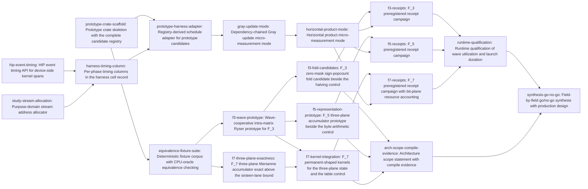

# Plan: Evaluate wave-parallel GPU kernels for finite-field permanents (0de41c82)

> Planning node: 1b113b9d. Authoritative graph:
> [breakdown.json](breakdown.json).

## Outcome and criterion approach

| Criterion | Approach | Evidence / open gap |
|---|---|---|
| REQ-01 | Give each lane a contiguous Gray-code interval of one matrix and its own complete packed accumulator in registers; reduce only the partial Ryser sums across the wave, in lane-index order. $\mathbb{F}_3$ goes first because its packed state needs no arithmetic change, so the mapping is studied unconfounded. | `parallel_bipedal3.rs:237` chunk model is the only structural prior art; investigation §7 fact 1 records that no wave-cooperative permanent kernel exists in the tree |
| REQ-02 | Build the boundary fixture corpus once, ahead of any candidate, and route every candidate through one element-wise oracle comparison against `permanent_ryser`. | Investigation §4c: nothing in the tree constructs boundary matrices or boundary Gray indices today |
| REQ-03 | Add the HIP event API to the crate that owns device resources, then feed kernel, copy, and launch-overhead columns from its per-phase spans; extend the harness's preregistered protocol and provenance preamble rather than replacing them. | `protocol.rs:89-99`, `env.rs:130`; investigation §7 fact 7 records no HIP event use anywhere in the crate |
| REQ-04 | Split the two halves: measure wave utilization, occupancy limits, and the launch-duration envelope on the target host, testing each kernel's predicted register and shared-memory budget against what the device reports and treating the archived $\approx 190$–$200$ s calibration as a prior; state architecture scope separately, only where compile evidence exists. | `r4_gpu_uniformity_resample.md` §2.5 against `gpu-hang-2026-08-07.log:36-43`; `build.rs:43` compiles gfx1030 alone |
| REQ-05 | State $\mathbb{F}_3$'s two algebraic gifts ($3 = 2^2 - 1$ and $\lvert\mathbb{F}_3^*\rvert = 2$) explicitly in the synthesis; implement two arithmetic paths per field under one held-fixed execution mapping so arithmetic is never confounded with mapping. | Representation study, "Why $\mathbb{F}_3$ is exceptional" |
| REQ-06 | Name the existing `host::{DeviceBuffer, HipStreamPool, LaunchDims}` types in the production design, and close the fallback gap the current dispatcher leaves open by asserting on every device return code. | `host/mod.rs:28-31`; `permanent/mod.rs:973-983` |
| REQ-07 | Aspirational, and carried explicitly: the $\mathbb{F}_5$ and $\mathbb{F}_7$ campaigns each hold an `[aspirational]` criterion for the $1.5\times$ target at their declared operating point inside the safe launch-duration bound, and the synthesis states per field whether it was reached, with the measured factor and shortfall where it was not. Both campaigns carry `satisfies:REQ-07`, marking contribution to the aspirational operating point rather than a commitment to reach it. | Prior measurement puts batch rayon roughly $3\times$ ahead at every shared order (feasibility study §4.4) |
| REQ-08 | One implementation task per field pairs the current arithmetic control with the canonical bit-plane candidate under one mapping; a loser stays compiled and tested beside its falsifying evidence. | Representation study, "Arithmetic candidates" |
| REQ-09 | Add micro-measurement modes for the dependency-chained Gray update and the horizontal product that reuse the protocol's warm-up and censoring policy; each field's receipt campaign runs all three nested shapes against both mappings. | Investigation §4a: the harness reports four composite phases with no sub-evaluate decomposition |
| REQ-10 | Fold the boundary classes and $n \in \{16, 20, 24\}$ into the corpus at construction time; every campaign reports the observed zero-fast-path frequency beside $1-\left(\frac{q-1}{q}\right)^n$ and the observed slow-path frequency beside $\left(\frac{q-1}{q}\right)^n$, stating the complement relation. $\left(\frac{q-1}{q}\right)^n$ is $\Pr[\text{all row sums nonzero}]$, so it is the slow path; the fast path is its complement. | Representation study table ($q = 7$ slow path: $8.489\%$, $4.582\%$, $2.473\%$) |
| REQ-11 | Prove exactness at $n = 20$ and $n = 24$ at the accumulator level, assemble it into a permanent-shaped kernel, measure the register, spill, occupancy, and bit-plane preparation consequences in the $\mathbb{F}_7$ campaign, then settle the public-versus-internal boundary in the synthesis with a named exception plus a tracked convergence condition. | `packed7.rs:216` `LANES = 16`; `@/inv/convention-convergence` |

## Shared architectural contracts

### `prototype-crate-layout` [implementation-produced] — Prototype crate shape and candidate registry

All study prototypes live in one new standalone crate, `dev/research/permanent_wave_gpu/`, outside the default Cargo workspace, carrying a `.gitignore` of exactly `target/` and `Cargo.lock`. Build and test evidence is always an explicit `cargo … --manifest-path dev/research/permanent_wave_gpu/Cargo.toml --release` invocation, because `scripts/cargo-ci.sh` runs over the default workspace and compiles neither `dev/research` crates nor `crates/gf2-kernels-hip` (investigation §6, gate implications). Rejected candidates stay compiled and tested in the crate beside their falsifying evidence, as `dev/research/f7_packing` already does for its four.

**Stub-registry pattern.** Five candidates are implemented concurrently in this crate, so the crate is created with its registry already complete rather than growing one entry at a time. `src/lib.rs` and `src/paths.rs` enumerate every planned candidate from the start; each registry entry dispatches to a named function in that candidate's own module (`src/wave.rs`, `src/fold_gf3.rs`, `src/f5_candidates.rs`, `src/f7_three_plane.rs`, `src/wave_gf7.rs`), and each of those functions begins as a stub returning an unsupported result with a stated reason. Implementing a candidate replaces one function body inside one dedicated module and adds that candidate's own kernel and test files; **neither registry file is edited again**. An unrunnable path is recorded with a reason rather than dropped, matching `equivalence.rs:158-162`. This registry is the study's single candidate list; how the harness reaches it is `prototype-harness-interface`'s concern, not a second list here.

The build script obeys the same rule: it compiles whatever `.hip` sources it finds under `hip/`, the way the in-tree per-architecture blob pipeline collects its sources (`build.rs:113`), so a candidate adds a kernel without a build-script edit. A no-op `hip/probe.hip` keeps that compile path exercised before any candidate kernel exists, mirroring `ensure_probe_source` (`build.rs:192`). The consequence is that no two concurrently runnable candidate tasks share a file: each touches exactly one module and creates its own kernel and test.

### `fixture-corpus` [implementation-produced] — Deterministic boundary fixtures and the oracle comparator

One seeded corpus plus one element-wise comparator against `gf2_algebra::permanent::permanent_ryser`, covering empty and singleton cases where supported, Gray-interval boundary indices, both transition directions, active-lane masking, zero-containing products, each nonzero exponent class, and $n \in \{16, 20, 24\}$ for $\mathbb{F}_7$. Nothing of this shape exists in the tree (investigation §4c), and every candidate is admitted through it.

### `wave-decomposition-interface` [implementation-produced] — Lane-owns-interval Ryser decomposition

One matrix's Gray-code walk over $[0, 2^n)$ is partitioned into contiguous, disjoint intervals, one per active lane, covering the walk exactly once. Each lane owns its complete packed row-sum accumulator in registers for the whole of its interval and initializes it from the column subset encoded by its interval start index, using `gray_code_index_to_subset(start)` semantics rather than replaying from zero. Each lane applies one packed add or subtract per Gray step and computes its own horizontal row product locally, as a reduction over the row lanes inside its own packed words, with no cross-lane exchange in the product path. **Only the partial Ryser sums cross the wave**, combined in lane-index order so the reduction is scheduling-independent (`@/inv/deterministic-seeded-execution`); $(-1)^n$ is applied once afterwards. Grid and block dimensions are a pure function of matrix order, batch size, and the range partition, with no runtime occupancy probe (`host/launch.rs:3-19`). This is `parallel_bipedal3.rs`'s chunk model with lanes in place of rayon workers.

Giving every lane a full accumulator is what the mapping spends to buy wave utilization, so the per-lane register state and the shared column table are budgeted quantities. Beyond its packed accumulator each lane carries three scalar `u64` words — Gray cursor, interval end bound, partial Ryser sum — so the live per-lane state is the packed word count plus three:

| Path | Packed accumulator | Live per-lane state | Shared column table per block |
|---|---|---|---|
| $\mathbb{F}_3$ two-plane | $2 \times$ `u64` | $5 \times$ `u64` (10 32-bit registers) | $16n$ B — $384$ B at $n{=}24$ |
| $\mathbb{F}_5$ / $\mathbb{F}_7$ three-plane | $3 \times$ `u64` | $6 \times$ `u64` (12 32-bit registers) | $24n$ B — $576$ B at $n{=}24$ |
| $\mathbb{F}_5$ byte control | $n$ bytes | $n + 24$ bytes, growing with order | $n^2$ B — $576$ B at $n{=}24$, $3969$ B at $n{=}63$ |
| $\mathbb{F}_7$ nibble control | $\lceil n/16 \rceil \times$ `u64` | $4$–$5 \times$ `u64` | $8n\lceil n/16 \rceil$ B — $384$ B at $n{=}24$ |

The column table is staged once per block from global memory by a cooperative strided copy followed by one barrier, then read-only. Its steady-state access is **not** a broadcast: at each Gray step a lane reads the bundle indexed by its own flip index, and flip indices differ across lanes, so bank behaviour under that scattered read is a measured quantity. The $\mathbb{F}_7$ nibble control additionally reaches three 64 KiB multiplication tables that are far too large for shared memory and stay in constant and global memory, as they do in the shipped kernel.

**This budget is the study's central occupancy hypothesis.** A packed accumulator is constant in $n$ where a byte-oriented one grows and reaches scratch; the three-plane fields cost one more `u64` per lane than $\mathbb{F}_3$, and the $\mathbb{F}_7$ bit-sliced path costs one more than its own nibble control at $n = 24$ while removing that control's table working set. Whether any of that, instruction scheduling, or the scattered shared-memory read is what limits occupancy is settled by the per-field receipt campaigns, each of which reports measured registers, scratch, shared memory, and spills against the budget its kernels predicted, and device-wide by the runtime qualification.

### `hip-event-api` [implementation-produced] — Device event timing primitive

A HIP event type in `crates/gf2-kernels-hip/src/host/` that acquires an event on construction, releases it on drop, records a start and stop pair on a caller-supplied stream, and returns the elapsed device time — with an explicit safety contract on each FFI boundary. Its instrumented launch boundary records a phase-tagged span sequence across one dispatch and returns the copy and kernel durations separately, because the shipped dispatchers synchronize internally and a caller bracketing them measures the synchronize. Launch overhead is two quantities on their own clocks — the host-side duration of the submission call, and the device-only span from a marker event recorded at submission to the kernel start event — never a subtraction of a host timestamp from a device timestamp. Because every shipped permanent kernel entry point hard-codes the default stream, the boundary rests on stream-bearing variants of the batch launch entry points, which this contract includes. It sits beside the existing public `DeviceBuffer`, `PinnedHostBuffer`, `HipStream`, `HipStreamPool`, and `LaunchDims` (`host/mod.rs:28-31`), because a private event helper in a research crate would duplicate a shared device-resource mechanism.

### `kernel-only-timing` [implementation-produced] — Event-measured kernel duration in the cell record

Per-phase device durations reported per timed cell beside the existing wall-clock duration — host-to-device copy, kernel, device-to-host copy, the submission call's host-side duration, and the pre-kernel device span — each carried from the instrumented launch boundary through the protocol module's cell record into its own CSV column, with an absent value recorded with a reason rather than backfilled from wall-clock or written as zero. Transfer and launch cost are therefore attributable from one run, which is what REQ-04's separation of overhead from kernel time needs.

### `prototype-harness-interface` [implementation-produced] — Single registration path

One stream-aware adapter through which harness backends invoke prototype-crate candidates. The harness derives its `Backend::ALL` schedule from the prototype crate's candidate registry rather than maintaining a second hand-written list, so a candidate registered once becomes schedulable without a parallel edit, and a test asserts the two sets are equal. The adapter also binds each candidate's stream purpose, so a scheduled path draws from the domain the harness assigned it. Produced by `prototype-harness-adapter`, which owns the harness side of that boundary; the registry it reads is `prototype-crate-layout`'s.

### `micro-timing-interface` [implementation-produced] — Isolated Gray-update and horizontal-product timing

Two harness modes that time one dependency-chained packed add or subtract on a single accumulator, and zero-mask detection with the complete nonzero reduction, both reusing the protocol module's warm-up, repetition, and censoring policy and both reporting an event-measured kernel duration. Neither sub-evaluate shape has any measurement path today (investigation §7 fact 7). The surface lands in two steps over shared plumbing — the Gray-update mode first, the horizontal-product mode completing it — and the completing leaf produces the contract.

### `study-stream-allocation` [implementation-produced] — Purpose-tagged seed address space

A purpose tag occupies a fixed high-bit field of one seed word and the stream index occupies the remaining low bits, with both bounds asserted at the call site so the fields cannot overlap. The encoding is injective over the enumerated purpose set and a bounded index range, a committed table of golden derivation vectors pins the mapping from $(\text{root}, q, n, \text{purpose}, \text{index})$ to seed bytes and to leading generator output, and warm-up is a distinct purpose from its cell's timed repetitions. This is the design the feasibility study §7.3 prescribes after its own history: the harness first based sustained runs at $10^6 + j \times 10^5$ against a grid reserving $1 + i \times 10^5$, the ranges overlapped in index space, and the pooled counts were valid only because no colliding pair happened to share a $(q, n)$ — "verified, not designed". Two defects of that family corrupted a superseded result set (§4.7).

The guarantee is over **seed inputs**: distinct purposes and indices encode to distinct addresses, and the golden vectors pin that mapping. It is not a claim that the resulting ChaCha20 output streams are disjoint as sequences — that follows from the cipher's construction, and nothing in this study establishes it. The contract and its criteria keep those two statements apart.

### `receipt-provenance-format` [plan-fixed] — What the committed harness already provides

The harness supplies, today and unchanged by this study: the protocol constants and their censoring contract (`protocol.rs:89-99`, `protocol.rs:34-50`) — warm-up $\ge 3$ s, repetitions until $\ge 5$ repetitions and $\ge 5$ s of timed work, a $120$ s cap that censors rather than truncates, per-cell batch calibration targeting a $2$ s repetition capped at $65\,536$; the CSV header constants; exact-rejection ChaCha20 sampling with disjoint streams per `(root, q, n, stream)` tuple and a `q`-label guard (`sampler.rs:95-190`); the generated provenance preamble carrying binary hash, CPU model, GPU model, and ROCm version (`env.rs:130`); and single-list backend scheduling through `Backend::ALL` (`backend.rs:60-68`) so a registered path cannot silently miss a cell. It does **not** supply structural purpose-domain separation of stream indices — that is `study-stream-allocation`'s job.

## Generated decomposition overview

<!-- jit:breakdown-overview:begin -->
| Key | Title | Type | Outcome | Contracts | Sources | Footprint | Landing | Depends on |
|---|---|---|---|---|---|---|---|---|
| prototype-crate-scaffold | Prototype crate skeleton with the complete candidate registry | task | A standalone prototype crate exists with the full planned candidate set registered, each entry reporting unsupported until implemented. | — | REQ-02, INV-CRATE-PLACEMENT, INV-GATE-SCOPE, INV-BEHAVIORAL-EQUIV | creates 15 | — | — |
| equivalence-fixture-suite | Deterministic fixture corpus with CPU-oracle equivalence checking | task | A seeded fixture corpus reproduces exact CPU-oracle permanents across the study's boundary classes for three fields. | prototype-crate-layout | REQ-02, REQ-10, INV-FACT-06, INV-ORACLE, INV-EQUIV-CHECK, STUDY-FOLD | creates 1, touches 2 | — | prototype-crate-scaffold |
| hip-event-timing | HIP event timing API for device-side kernel spans | task | An instrumented launch boundary returns per-phase device durations for copies, kernel, and launch overhead in one dispatch. | — | REQ-03, INV-FACT-07, INV-CONVERGENCE, INV-HIP-TESTS, INV-GATE-SCOPE, INV-DISPATCH-SHAPE | creates 2, touches 7 | — | — |
| study-stream-allocation | Purpose-domain stream address allocator | task | Each measurement purpose addresses the sampler through a bounded, injective seed encoding, with golden vectors pinning the mapping. | receipt-provenance-format | REQ-03, BASELINE-STREAM-ALLOCATION, BASELINE-PROTOCOL, INV-HARNESS | creates 1, touches 2 | — | — |
| harness-timing-column | Per-phase timing columns in the harness cell record | task | Each timed GPU cell reports event-measured kernel, copy, and launch durations as their own columns beside wall-clock. | hip-event-api, receipt-provenance-format | REQ-03, INV-FACT-07, INV-HARNESS, INV-DISPATCH-SHAPE, BASELINE-PROTOCOL | creates 1, touches 5 | — | hip-event-timing, study-stream-allocation |
| prototype-harness-adapter | Registry-derived schedule adapter for prototype candidates | task | The harness's backend schedule is derived from the prototype registry through one stream-aware adapter, with set equality asserted. | prototype-crate-layout, study-stream-allocation, receipt-provenance-format | REQ-03, INV-HARNESS, INV-BEHAVIORAL-EQUIV, INV-EQUIV-CHECK, BASELINE-STREAM-ALLOCATION | creates 1, touches 3 | — | prototype-crate-scaffold, harness-timing-column |
| gray-update-mode | Dependency-chained Gray update micro-measurement mode | task | The harness times one dependency-chained packed add or subtract on a single accumulator, isolated from the Ryser loop. | kernel-only-timing, prototype-harness-interface, hip-event-api, study-stream-allocation, receipt-provenance-format | REQ-09, INV-FACT-07, STUDY-SHAPES, BASELINE-PROTOCOL | creates 1, touches 2 | — | prototype-harness-adapter |
| horizontal-product-mode | Horizontal product micro-measurement mode | task | The harness times zero-mask detection with the complete nonzero reduction, reporting fast and slow paths separately. | kernel-only-timing, prototype-harness-interface, hip-event-api, study-stream-allocation, receipt-provenance-format | REQ-09, REQ-10, INV-FACT-07, STUDY-SHAPES, STUDY-FOLD | creates 1, touches 2 | — | gray-update-mode |
| f3-wave-prototype | Wave-cooperative intra-matrix Ryser prototype for F_3 | task | Each lane walks its own Gray-code interval and only partial Ryser sums cross the wave, matching the CPU oracle over F_3. | fixture-corpus, prototype-crate-layout | REQ-01, REQ-02, INV-FACT-01, INV-CPU-CHUNKED, INV-LAUNCH-PURITY, INV-DETERMINISM, INV-HIP-TESTS, STUDY-SHAPES, DECISION-LANE-MAPPING | creates 2, touches 1 | — | equivalence-fixture-suite |
| f3-fold-candidates | F_3 zero-mask sign-popcount fold candidate beside the halving control | task | Both F_3 horizontal folds run under one execution mapping and agree exactly with the CPU oracle on the fixture corpus. | wave-decomposition-interface, fixture-corpus, prototype-crate-layout | REQ-02, REQ-08, STUDY-CANDIDATES, STUDY-FOLD, INV-FACT-04, INV-FALSIFICATION, DECISION-LANE-MAPPING, DECISION-RECEIPT-OWNERSHIP | creates 2, touches 1 | — | f3-wave-prototype |
| f5-representation-prototype | F_5 three-plane accumulator prototype beside the byte-arithmetic control | task | Two F_5 arithmetic paths run under one execution mapping and agree exactly with the CPU oracle on the fixture corpus. | wave-decomposition-interface, fixture-corpus, prototype-crate-layout | REQ-02, REQ-05, REQ-08, STUDY-FOLD, STUDY-CANDIDATES, INV-PACKED5-COST, INV-PACKED-LIMITS, INV-FACT-04, DECISION-LANE-MAPPING, DECISION-RECEIPT-OWNERSHIP | creates 2, touches 1 | — | f3-wave-prototype |
| f7-three-plane-exactness | F_7 three-plane Mersenne accumulator exact above the sixteen-lane bound | task | A three-plane Mersenne accumulator computes exact F_7 permanents at orders 16, 20, and 24, past the sixteen-lane packed bound. | fixture-corpus, prototype-crate-layout | REQ-02, REQ-05, REQ-08, REQ-10, REQ-11, STUDY-FOLD, STUDY-CANDIDATES, INV-FACT-03, INV-PACKED-LIMITS, INV-FALSIFICATION | creates 2, touches 1 | — | equivalence-fixture-suite |
| f7-kernel-integration | F_7 permanent-shaped kernels for the three-plane state and the table control | task | Two F_7 permanent kernels run under one execution mapping and agree exactly with the CPU oracle at orders 16, 20, and 24. | wave-decomposition-interface, fixture-corpus, prototype-crate-layout | REQ-02, REQ-08, REQ-11, STUDY-BOUNDARY, INV-PACKED-LIMITS, INV-FALLBACK-GAP, DECISION-LANE-MAPPING, DECISION-RECEIPT-OWNERSHIP | creates 2, touches 1 | — | f3-wave-prototype, f7-three-plane-exactness |
| f3-receipts | F_3 preregistered receipt campaign | simulation | Committed F_3 receipts compare the current GPU path, the prototypes that execute, and the best CPU path under one protocol. | receipt-provenance-format, micro-timing-interface, kernel-only-timing, prototype-harness-interface, study-stream-allocation, hip-event-api, wave-decomposition-interface, fixture-corpus, prototype-crate-layout | REQ-03, REQ-09, REQ-10, BASELINE-PROTOCOL, BASELINE-CROSSOVER, BASELINE-STREAM-ALLOCATION, INV-HARNESS, INV-BEHAVIORAL-EQUIV, INV-EQUIV-CHECK, INV-RECEIPT-LOCATION, INV-DISPATCH-SHAPE, INV-FACT-09, DECISION-RECEIPT-OWNERSHIP | creates 6, uncertain | — | f3-fold-candidates, horizontal-product-mode |
| f5-receipts | F_5 preregistered receipt campaign | simulation | Committed F_5 receipts compare the current GPU path, the prototypes that execute, and the best CPU path under one protocol. | receipt-provenance-format, micro-timing-interface, kernel-only-timing, prototype-harness-interface, study-stream-allocation, hip-event-api, wave-decomposition-interface, fixture-corpus, prototype-crate-layout | REQ-03, REQ-07, REQ-09, REQ-10, BASELINE-PROTOCOL, BASELINE-CROSSOVER, BASELINE-CENSORED, BASELINE-STREAM-ALLOCATION, INV-BEHAVIORAL-EQUIV, INV-EQUIV-CHECK, INV-RECEIPT-LOCATION, INV-DISPATCH-SHAPE, INV-FACT-09, INV-PACKED-LIMITS, DECISION-RECEIPT-OWNERSHIP | creates 6, uncertain | — | f5-representation-prototype, horizontal-product-mode |
| f7-receipts | F_7 preregistered receipt campaign with bit-plane resource accounting | simulation | Committed F_7 receipts cover the protocol comparison plus bit-plane preparation cost, register pressure, spills, and occupancy. | receipt-provenance-format, micro-timing-interface, kernel-only-timing, prototype-harness-interface, study-stream-allocation, hip-event-api, wave-decomposition-interface, fixture-corpus, prototype-crate-layout | REQ-03, REQ-07, REQ-09, REQ-10, REQ-11, BASELINE-PROTOCOL, BASELINE-CROSSOVER, BASELINE-CENSORED, BASELINE-STREAM-ALLOCATION, INV-BEHAVIORAL-EQUIV, INV-EQUIV-CHECK, INV-RECEIPT-LOCATION, INV-DISPATCH-SHAPE, INV-FACT-09, INV-PACKED-LIMITS, DECISION-RECEIPT-OWNERSHIP | creates 7, uncertain | — | f7-kernel-integration, horizontal-product-mode |
| runtime-qualification | Runtime qualification of wave utilization and launch duration | simulation | A qualification receipt states wave utilization, the occupancy-limiting resource, launch-duration envelope, and watchdog-safe work bounds. | receipt-provenance-format, micro-timing-interface, kernel-only-timing, prototype-harness-interface, study-stream-allocation, hip-event-api, wave-decomposition-interface, prototype-crate-layout | REQ-04, INV-FACT-08, INV-NO-PROFILING, INV-FALSIFICATION, INV-RECEIPT-LOCATION, BASELINE-PROTOCOL, STUDY-SHAPES, DECISION-RECEIPT-OWNERSHIP | creates 3, uncertain | — | f3-receipts, f5-receipts, f7-receipts |
| arch-scope-compile-evidence | Architecture scope statement with compile evidence | task | The study's supported GPU architecture set is stated, with compile evidence committed for each architecture claimed. | prototype-crate-layout, wave-decomposition-interface | REQ-04, INV-FACT-02, INV-GATE-SCOPE, INV-CRATE-PLACEMENT | creates 1, touches 2, uncertain | — | f3-fold-candidates, f5-representation-prototype, f7-kernel-integration |
| synthesis-go-no-go | Field-by-field go/no-go synthesis with production design | task | A findings document records the per-field go/no-go verdict, the production design, and the representation-boundary decision. | receipt-provenance-format, wave-decomposition-interface, micro-timing-interface, kernel-only-timing, fixture-corpus, prototype-crate-layout | REQ-01, REQ-05, REQ-06, REQ-07, REQ-11, STUDY-BOUNDARY, STUDY-DECISION-RULE, INV-FACT-03, INV-FACT-05, INV-FACT-10, INV-CONVERGENCE, INV-FALLBACK-GAP, INV-PROOF-OBLIGATION, INV-ORACLE, INV-CPU-CHUNKED | creates 1, touches 1, uncertain | — | runtime-qualification, arch-scope-compile-evidence |

<!-- jit:breakdown-overview:end -->

## Material risks and owner decisions

| Decision | Rationale |
|---|---|
| Lane mapping is lane-owns-interval | Each lane owns a contiguous Gray interval and its complete packed accumulator; the row product is lane-local over the row lanes inside that lane's own words; only partial Ryser sums cross the wave. REQ-01's four named elements map onto it exactly. A mapping where lanes both split the range and cooperate per step is incoherent — a lane walking its own interval holds its own row sums, leaving nothing to cooperate on. |
| Register and shared-memory budget is stated, then tested | The `wave-decomposition-interface` table quantifies per-lane live state and per-block column-table size for all four packed paths. Those figures are design arithmetic, not measurements: each kernel task states the budget it predicts, each campaign reports what the device returned beside it, and `runtime-qualification` gives the device-wide verdict on whether the budget is the occupancy limiter. A falsified prediction is recorded with the contradiction. |
| Per-field receipt ownership | Each field owns all of its preregistered evidence in one leaf. Candidate leaves are implementation-plus-equivalence only, so no field's measurements have two owners. `f7-receipts` additionally owns the bit-plane resource figures REQ-11 demands, and `runtime-qualification` cites them rather than re-measuring. |
| Campaigns scope the planned candidate set | The campaigns decide retention, so their criteria are worded over "every planned prototype path that executes on the target device", with a separate criterion requiring a candidate that cannot execute to be named with its falsification. "Every retained candidate" would be circular. `runtime-qualification` says "retained" correctly: it runs after all three campaigns. |
| Aspirational target is carried, not gated | REQ-07's $1.5\times$ crossover appears as an `[aspirational]` criterion on the $\mathbb{F}_5$ and $\mathbb{F}_7$ campaigns and is consumed by the synthesis, which states the measured factor and any shortfall. Both campaigns carry `satisfies:REQ-07` so the coverage is visible in the graph; the label marks contribution to the aspirational operating point, and no `[hard]` criterion depends on reaching it. |
| Zero fast path pairs with the complement | $\left(\frac{q-1}{q}\right)^n$ is the probability that every row sum is nonzero, so it is the **slow**-path expectation; the zero fast path is $1-\left(\frac{q-1}{q}\right)^n$. Every receipt criterion reports each observed frequency beside its own expectation and states the complement relation. |
| Prototype crate under `dev/research/` | Every prior kernel-representation study lived there; it is a `permanent_paths` entry so prototypes survive archival of `dev/active/0de41c82/`; and it keeps unvalidated `unsafe` out of the production HIP crate, which `@/inv/unsafe-kernel-isolation` guards. Rejected an experimental module inside `crates/gf2-kernels-hip`. |
| Registry ships complete, before any candidate | `prototype-crate-scaffold` creates the full registry plus one stub module per candidate, every entry returning unsupported, and a build script that discovers kernel sources by directory. Each candidate then touches exactly one module and creates only its own kernel and test, so concurrently runnable tasks share no file. Every remaining footprint overlap lies along a dependency edge. Rejected serializing the candidate waves: three waves of wall-clock to avoid a problem the registry pattern removes. |
| Event timing splits into primitive, column, adapter, modes | `hip-event-timing` owns the event RAII, the stream-bearing variants the hard-coded default-stream launch entry points lack, and an instrumented launch boundary that brackets the kernel on its own stream without a device-wide sync — necessary because the shipped dispatchers sync internally, so bracketing them measures the synchronize. `harness-timing-column` carries that into the cell record and CSV; `prototype-harness-adapter` bridges the harness to the prototype registry, following the column leaf on a dependency edge because the two rework the same harness files; `gray-update-mode` and `horizontal-product-mode` add the two sub-evaluate shapes. The shipped dispatch entry points keep their synchronous contract. |
| Stream addressing is structural | `study-stream-allocation` puts a purpose tag in a fixed high-bit field of one seed word with both bounds asserted, proven injective over the purpose set and pinned by golden derivation vectors. Today's disjointness rests on hand-chosen numeric bases the feasibility study §7.3 calls "verified, not designed". The guarantee is over **seed inputs**; the criteria deliberately never claim the derived ChaCha20 output sequences are disjoint, which no test here establishes. |
| One candidate list, one bridge | The prototype crate holds the study's only candidate registry; `prototype-harness-adapter` produces `prototype-harness-interface`, the adapter that derives `Backend::ALL` from that registry and binds each candidate's stream purpose, with a test asserting the scheduled set equals the registered set. Rejected a second hand-maintained list in the harness: two lists drift, and the drift is silent until a cell is missing from a receipt. |
| Achieved occupancy needs runtime evidence | Achieved occupancy is reported only from profiler counters observed during a measured run. Compiler resource-usage output — registers, scratch, shared memory, spills — supplements it and is what the occupancy-*limiting* resource is derived from, but never substitutes for the achieved figure. Where the profiler is unavailable on the campaign host, the receipt records achieved occupancy as not measured with the reason; a computed stand-in presented as achieved would be a fabricated measurement. |
| Transfer and launch cost come from one run | The instrumented launch boundary records a phase-tagged span sequence, so host-to-device copy, kernel, device-to-host copy, and launch overhead are separated within a single dispatch, with launch overhead reported as a host-clock submission duration beside a device-only pre-kernel span rather than as a cross-clock subtraction. Rejected reconstructing them by differencing repeated runs with pieces removed: that attributes run-to-run variance to a phase. |
| Micro modes are two leaves, not one | `gray-update-mode` and `horizontal-product-mode` are separately testable and were split rather than carrying a sizing override. They share the event plumbing, purpose tags, schedule adapter, and CSV schema that `harness-timing-column` and `prototype-harness-adapter` already built, so the split duplicates no scaffolding. The product mode depends on the update mode so the two share the CLI surface serially, which costs no wave: its siblings in that wave are the field candidate leaves. |
| Watchdog bound is re-derived | The archived $\approx 190$–$200$ s calibration and the retracted hang attribution disagree. `runtime-qualification` derives the safe launch bound from its own measurements, citing r4 as a prior rather than an established device property, and records any contradicting measurement with the contradiction per `@/inv/falsification-preserved`. |
| Archived R2 amendment belongs to the synthesis | `synthesis-go-no-go` amends `dev/archive/…/f10152f6/r2_f7_encoding_decision.md` only where the receipts reopen it. `f7-three-plane-exactness` re-measures Candidate D but does not touch the archived verdict. `dev/archive` is permanent content, so the amendment needs owner approval; its footprint is recorded as uncertain. |
| Architecture scope is compile-evidenced | `arch-scope-compile-evidence` is the only leaf touching the prototype crate's `build.rs`. Production compiles one unconditional `--offload-arch=gfx1030` and the per-arch pipeline compiles only no-op probes, so REQ-04's scope statement has one defensible answer today; the leaf may widen it only by committing compile evidence. |
| Arithmetic controls are re-implemented in the prototype crate | REQ-08's "current" $\mathbb{F}_5$ and $\mathbb{F}_7$ arithmetic runs inside the prototype crate under the study's mapping, so the arithmetic comparison holds execution mapping fixed. The shipped one-thread-per-matrix path is still measured, as REQ-09's mapping control. |
| No new public packed representation is planned | No task changes `Packed5` or `Packed7` at its source. A public packed representation attracts a Lean proof obligation by convention, and `AGENTS.md:114-116` requires an approved sketch first. If the synthesis chooses that resolution of REQ-11, it is follow-up work behind a new bracket. |
| Story slug | `story:gpu-wave-permanents`, a descriptive kebab-case bucket. A JIT short id is never a strategic label: short ids are non-descriptive UUID prefixes that break under rename. |
| Receipts location | Findings and receipts in `dev/active/0de41c82/`, executable prototypes under `dev/research/`. Matches the b488f02c precedent and what `jit doc dir` resolves to. Documents are attached to their issue rather than cross-referenced by inline path. |

## Investigation sources

- [Investigation](investigation.md) — exhaustive claim classification, consumer inventory, and primitive verification remain there.
- [Representation study](bipedal-f5-f7-representation-study.md) — fold formulas, arithmetic candidates, benchmark shapes, architectural boundary options.
- [Feasibility study](../../studies/b488f02c/feasibility-study.md) — baseline receipts, preregistered protocol, measured GPU-versus-CPU ordering, censored cells, and the §7.3 stream-allocation requirement.

Source ids used by the manifest resolve as follows.

- `REQ-01` … `REQ-11` — the container's success criteria, verbatim.
- `INV-FACT-01` … `INV-FACT-10` — investigation §7, "Findings the breakdown should treat as facts", numbered in order.
- `INV-ORACLE`, `INV-CPU-CHUNKED`, `INV-PACKED-LIMITS`, `INV-PACKED5-COST`, `INV-PROOF-OBLIGATION`, `INV-DISPATCH-SHAPE`, `INV-HARNESS` — investigation §1, claims 9, 10, 4, 5, 11, 3, and 7.
- `INV-EQUIV-CHECK`, `INV-HIP-TESTS`, `INV-NO-PROFILING` — investigation §4b, §4d, and §2 "Not found".
- `INV-CRATE-PLACEMENT`, `INV-LAUNCH-PURITY`, `INV-FALLBACK-GAP`, `INV-RECEIPT-LOCATION` — investigation §5.
- `INV-CONVERGENCE`, `INV-FALSIFICATION`, `INV-BEHAVIORAL-EQUIV`, `INV-DETERMINISM`, `INV-GATE-SCOPE` — investigation §6.
- `STUDY-FOLD`, `STUDY-CANDIDATES`, `STUDY-SHAPES`, `STUDY-BOUNDARY`, `STUDY-DECISION-RULE` — representation study sections "Constant-word horizontal product", "Arithmetic candidates", "Required benchmark shapes", "Architectural boundary", "Decision rule".
- `BASELINE-PROTOCOL`, `BASELINE-CENSORED`, `BASELINE-CROSSOVER`, `BASELINE-STREAM-ALLOCATION` — feasibility study §4.2, §4.3, §4.4, and §4.7 with §7.3.
- `DECISION-LANE-MAPPING`, `DECISION-RECEIPT-OWNERSHIP` — the two owner-fixed corrections recorded in the decisions table above.
