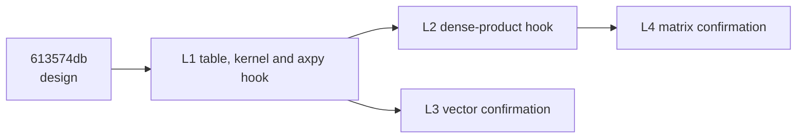

# Implementation and confirmation manifest for the cached GF(2^8) tables

> **Diátaxis Type:** Reference

The authoritative worker-sized leaves that carry [`design.md`](design.md) into
production, as epic `1a379447` children. Each entry gives the title, the
description a worker reads standalone, the hard criteria, the labels, the gates
and the dependency edges. The lead instantiates them; this worktree creates no
tracker state.

## Shape

The cached table, the region kernel and the single selection point are not a
leaf of their own: crate-internal items no consumer reaches are dead code, and
the lint gate denies warnings, so the shared kernel lands with the first
consumer that uses it. The dense product is a separate leaf because it adds its
own traversal, its own scratch buffers and its own conformance surface over the
same kernel. Each implementation leaf gets its own paired confirmation, because
the two consumers reach different current routes and so need different baselines.

Edges for the lead: `L1 → 613574db`, `L2 → L1`, `L3 → L1`, `L4 → L2`.
Containment edges from the epic reach `L3` and `L4` only; `L1`, `L2` and
`613574db` are already reachable through them, so an epic edge to any of those
is transitively redundant. The epic's existing edge to `613574db` becomes
redundant once the epic depends on `L3`, so it is dropped or re-added under
reduction in the same operation.

## L1 — Cache GF(2^8) byte product tables and route FieldVec::axpy through them

**Labels:** `type:task`, `component:gf2-core`, `satisfies:REQ-02`,
`satisfies:REQ-06`

**Gates:** `repo-validate`, `doc-review`, `cargo-ci`, `code-review`,
`tdd-reminder`, `asm-artefact-present`

**Description.**

> Cache the GF(2^8) byte product table per reduction polynomial in `gf2-core`,
> and make the vector fused multiply-add over GF(2^8) take it through the
> accelerated-axpy hook that consumer already consults, for both the
> runtime-context element and the single-word wide representation.
>
> ## Background
>
> Byte-oriented GF(2^8) arithmetic multiplies by a reused coefficient with one
> indexed load and accumulates with one XOR, over a table of the products of
> every byte pair under the field's reduction polynomial. Preparing that table
> inside a call is a large fraction of a small call, so it is built once per
> polynomial and shared for the life of the process; the same key serves the
> runtime-context and the compile-time-configured representation.
> `FieldVec::axpy` offers its operands to one hook before running its scalar
> element loop, and no GF(2^8) representation overrides that hook, so the loop
> reaches a per-element function pointer for one representation and a
> per-element allocation for the other. `dev/active/1a379447-zen3-cpu-performance/613574db/design.md` fixes
> the table layout, the cache key, the lifetime, the guard conditions, the
> field-handle pre-check, the in-place write-back and the conformance surface;
> it is the contract this work implements.
>
> ## Success Criteria
>
> - [hard] REQ-01: A product table for a degree-8 reduction polynomial answers
>   every byte pair with the product an independent schoolbook oracle computes,
>   for all 30 irreducible degree-8 polynomials, with the zero coefficient
>   giving an all-zero row and the one coefficient giving the identity row.
> - [hard] REQ-02: A table is built at most once per reduction polynomial per
>   process and is shared by reference afterwards; concurrent first touches of
>   one key from many threads observe one identical table that agrees with the
>   oracle, and a second lookup of a key returns the same table.
> - [hard] REQ-03: The accelerated path accepts single-word GF(2^8) operands of
>   both representations and declines every other degree, backing width and
>   multi-word configuration, so those keep the results they produce.
> - [hard] REQ-04: For every coefficient 0 through 255 over both the 0x11B and
>   0x11D polynomials, the accepted path and the scalar path produce identical
>   vectors, for lengths 0, 1, 63, 64 and 65, an odd length above the kernel's
>   unrolling, and source and destination at every byte offset 0 through 7. A
>   coefficient of zero leaves the destination unchanged and a coefficient of
>   one reduces the operation to XOR.
> - [hard] REQ-05: A call whose operands do not all share the coefficient's
>   field context behaves exactly as it does without the accelerated path.
> - [hard] REQ-06: One function selects between the accelerated lane and the
>   scalar lane; its documentation is the authoritative statement of the
>   predicate, a lane witness reports which lane ran, and a switch compiled only
>   for test builds holds every caller on the scalar lane so the fallback is
>   exercised on a host where the accelerated lane would run.
> - [hard] REQ-07: The call allocates nothing, reads a source distinct from its
>   destination, and leaves the vector element type, layout and public signature
>   unchanged; the crate adds no unsafe code, no dependency and no public
>   byte-region API, and the table and kernel stay crate-internal outside test
>   builds.
> - [hard] REQ-08: The shared field-law suite runs over both representations
>   over both polynomials and passes, and the work builds and tests at Rust 1.95
>   under the repository CI contract.

## L2 — Route the dense FieldMatrix product for GF(2^8) through the cached table

**Labels:** `type:task`, `component:gf2-core`, `satisfies:REQ-02`,
`satisfies:REQ-06`

**Gates:** `repo-validate`, `doc-review`, `cargo-ci`, `code-review`,
`tdd-reminder`, `asm-artefact-present`

**Description.**

> Make the dense matrix product over GF(2^8) take the cached byte product
> table, through the whole-product hook that consumer already consults, for
> both the runtime-context element and the single-word wide representation.
>
> ## Background
>
> The dense product offers the whole product to one hook before its per-cell
> traversal. For GF(2^8) that hook declines, so one representation runs a
> batched dot product per output cell and the other flattens both operands
> through a carry-less-multiply kernel. A product built from region
> multiply-accumulates over a cached byte table reuses each left-hand
> coefficient across a whole output row and needs one indexed load and one XOR
> per product. The hook receives the right operand transposed, so the accepted
> path restores it. A companion availability probe also selects the algorithm in
> the matrix-vector fold, the blocked triangular solve and the blocked inverse,
> none of which has measured evidence, so it keeps its declining answer.
> `dev/active/1a379447-zen3-cpu-performance/613574db/design.md` fixes the traversal, the scratch buffers, the
> probe exception and the conformance surface; it is the contract this work
> implements.
>
> ## Success Criteria
>
> - [hard] REQ-01: The accepted path takes single-word GF(2^8) operands of both
>   representations and declines every other degree, backing width and
>   multi-word configuration, so those keep the results and the routes they
>   have.
> - [hard] REQ-02: Over both the 0x11B and 0x11D polynomials, the accepted path
>   and the path without it produce identical products for square and
>   rectangular shapes including 0 and 1 in each of the three dimensions, and
>   for shapes at and above the traversal's tiling boundary.
> - [hard] REQ-03: A product with a zero operand, an identity operand and a
>   single-column operand gives the mathematically required result.
> - [hard] REQ-04: The per-call allocation count and bytes of the accepted path
>   are recorded for both representations at a named shape, and the output
>   matrix keeps its element type, layout and public signature.
> - [hard] REQ-05: The companion availability probe keeps its declining answer
>   for GF(2^8), so the matrix-vector fold, the blocked triangular solve and the
>   blocked inverse keep the routes they take; the probe's own documentation
>   states that a field may accept the hook while declining the probe, and names
>   the condition under which that stops.
> - [hard] REQ-06: The lane witness reports the accepted lane for accepted
>   shapes and the scalar lane otherwise, the shared field-law suite runs over
>   both representations over both polynomials and passes, and no unsafe code,
>   public byte-region API or storage change is added.
> - [hard] REQ-07: The work builds and tests at Rust 1.95 under the repository
>   CI contract.

## L3 — Confirm the GF(2^8) axpy path against the current vector route

**Labels:** `type:task`, `component:gf2-core`, `component:benchmarks`,
`satisfies:REQ-01`, `satisfies:REQ-02`, `satisfies:REQ-04`

**Gates:** `repo-validate`, `doc-review`, `cargo-ci`, `code-review`,
`research-review`, `asm-artefact-present`

**Description.**

> Measure the shipped GF(2^8) vector fused multiply-add against the route the
> library takes without it, as a protocol-version-4 A/B family with a pilot and
> a confirmation, and publish the receipts and the decision.
>
> ## Background
>
> A production change needs a current pinned pre-change baseline and an after
> measurement on the same host, including dispatch overhead; a prior study's
> receipts are context, not a substitute. Both arms are the same shipped
> executable: the baseline arm holds every call on the scalar element lane
> through the test-build lane switch, and the candidate arm lets the accelerated
> lane run, so the comparison isolates the change and nothing else. The accepted
> vector-family confirmation receipt under `dev/bench_results/19513245/` states
> the direction and rough size an earlier prototype reached and is cited for
> agreement, not inherited as evidence; the shipped path also writes results in
> place, which the prototype did not, so the sizes need not match. Cells cover
> both GF(2^8) representations, the cache regimes that family used, and small
> lengths, since no committed cell sits below its smallest size and a
> first-touch table build is unamortized there.
>
> ## Success Criteria
>
> - [hard] REQ-01: A frozen family addendum is committed before the campaign
>   launches, with every numeric setting from it and the shared protocol
>   settings, and the confirmation addendum is derived from the committed pilot
>   receipt by the repository's canonical confirmation freezer with its
>   derivation record beside it.
> - [hard] REQ-02: The family's append-only ledger opens empty, records each
>   attempt's reservation, and is never hand-edited; an attempt aborted for a
>   procedural defect in its own freeze or launch, before any result is read, is
>   recorded under the voided-attempt rule with its stage preserved.
> - [hard] REQ-03: Every arm and case operation passes through the real
>   benchmark runner on a throwaway plan before any timed campaign is queued,
>   and every timed run is a committed queue line for the benchmark window
>   rather than a session launch.
> - [hard] REQ-04: Each campaign is verified from its own execution log: the
>   declared cell count starts, checkpoints and completes exactly once, every
>   cell reaches its declared pair count with a measured status, the campaign
>   ends in a terminal complete record, and the acceptance tool recomputes the
>   committed verdict.
> - [hard] REQ-05: The pilot covers both GF(2^8) element representations, at
>   least three sizes spanning cache-resident and streaming operands, and at
>   least one size small enough that the first table build is unamortized; the
>   confirmation retains as many of those cells as its family's confirmatory
>   budget admits, and the freezer's derivation record names which cells are
>   retained, which are dropped and why. Each cell's selected lane is recorded
>   at run time.
> - [hard] REQ-06: The published outcome states, for each cell, the verdict the
>   acceptance summary records, including any not-material or regressed cell,
>   and states whether the result agrees in direction with the earlier
>   vector-family confirmation receipt it pins by path and digest. A
>   non-qualifying outcome is published as the result, with retention or removal
>   of the accelerated path decided by the frozen rule rather than after the
>   fact.
> - [hard] REQ-07: No measured or derived figure is copied into prose; each
>   quantitative statement is a conclusion plus a pointer to the generated table
>   row, receipt or ledger line that holds it.

## L4 — Confirm the GF(2^8) dense product against the current matrix route

**Labels:** `type:task`, `component:gf2-core`, `component:benchmarks`,
`satisfies:REQ-01`, `satisfies:REQ-02`, `satisfies:REQ-04`

**Gates:** `repo-validate`, `doc-review`, `cargo-ci`, `code-review`,
`research-review`, `asm-artefact-present`

**Description.**

> Measure the shipped GF(2^8) dense matrix product against the route the
> library takes without it, as a protocol-version-4 A/B family with a pilot and
> a confirmation, and publish the receipts and the decision.
>
> ## Background
>
> A production change needs a current pinned pre-change baseline and an after
> measurement on the same host, including dispatch overhead; a prior study's
> receipts are context, not a substitute. Both arms are the same shipped
> executable, separated by the test-build lane switch, so the comparison
> isolates the change. The accepted matrix-family confirmation receipt under
> `dev/bench_results/19513245/` states the direction an earlier prototype
> reached and is cited for agreement, not inherited; the shipped path writes
> results in place and restores the transposed operand, neither of which the
> prototype did. The two representations reach different routes without the
> change — one a batched dot product per output cell, the other a whole-product
> carry-less-multiply kernel — so each is its own cell. Cells also cover the
> whole-consumer boundary, where the scratch buffers and the operand restoration
> are paid.
>
> ## Success Criteria
>
> - [hard] REQ-01: A frozen family addendum is committed before the campaign
>   launches, with every numeric setting from it and the shared protocol
>   settings, and the confirmation addendum is derived from the committed pilot
>   receipt by the repository's canonical confirmation freezer with its
>   derivation record beside it.
> - [hard] REQ-02: The family's append-only ledger opens empty, records each
>   attempt's reservation, and is never hand-edited; an attempt aborted for a
>   procedural defect in its own freeze or launch, before any result is read, is
>   recorded under the voided-attempt rule with its stage preserved.
> - [hard] REQ-03: Every arm and case operation passes through the real
>   benchmark runner on a throwaway plan before any timed campaign is queued,
>   and every timed run is a committed queue line for the benchmark window
>   rather than a session launch.
> - [hard] REQ-04: Each campaign is verified from its own execution log: the
>   declared cell count starts, checkpoints and completes exactly once, every
>   cell reaches its declared pair count with a measured status, the campaign
>   ends in a terminal complete record, and the acceptance tool recomputes the
>   committed verdict.
> - [hard] REQ-05: The pilot covers both GF(2^8) element representations, at
>   least two square dimensions and the whole-matrix consumer boundary; the
>   confirmation retains as many of those cells as its family's confirmatory
>   budget admits, and the freezer's derivation record names which cells are
>   retained, which are dropped and why. Each cell's selected lane and per-call
>   allocation counts are recorded at run time.
> - [hard] REQ-06: The published outcome states, for each cell, the verdict the
>   acceptance summary records, including any not-material or regressed cell,
>   and states whether the result agrees in direction with the earlier
>   matrix-family confirmation receipt it pins by path and digest. A
>   non-qualifying outcome is published as the result, with retention or removal
>   of the accelerated path decided by the frozen rule rather than after the
>   fact.
> - [hard] REQ-07: No measured or derived figure is copied into prose; each
>   quantitative statement is a conclusion plus a pointer to the generated table
>   row, receipt or ledger line that holds it.

## Excluded from this manifest

`FieldMatrix::matvec` and `FieldVec::dot_product` gain no accelerated path
here. Both reach a scalar chain, both have a profile row and neither has a
paired cell, so adoption needs its own campaign: a `bytefield-matvec`
protocol-version-4 family with its own append-only ledger, a pilot and a
confirmation over both representations at the kernel-isolated and
whole-`FieldMatrix` boundaries, under the same shipped-binary two-lane arm
construction the leaves above use. That campaign, and the hook override it
would authorize, are separate issues created only if it qualifies.

The matrix-vector fold, the blocked triangular solve and the blocked inverse
select their algorithm on the availability probe L2 leaves declining. They are
excluded for the same reason and need the same kind of campaign before that
probe changes its answer for GF(2^8).
