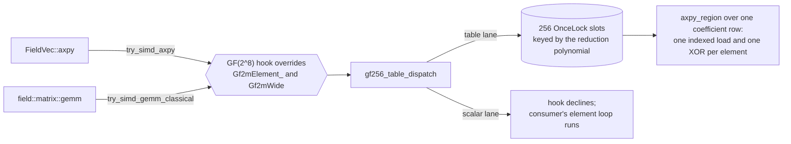

# Cached GF(2^8) product tables and the confirmed consumer hooks

> **Diátaxis Type:** Explanation

This design turns the accepted evidence of `@/issue/19513245` into a
library-layer plan: one cached byte product table per GF(2^8) reduction
polynomial, reached by `FieldVec::axpy` and the dense `FieldMatrix` product
through the two hooks those consumers already consult. It ships no public
byte-region API, no storage redesign, and no unsafe code. The worker-sized
implementation and confirmation leaves are in
[`breakdown.md`](breakdown.md).

## Problem statement

The byte-field assessment measures both routes on every GF(2^8) consumer and
ends in a proceed-to-design decision
([findings](../19513245/findings.md) § Decision). Three things it establishes
bound this design.

**Where the current cost sits.** `FieldVec::axpy` consults one hook whose
default declines (`axpy-hook`, `axpy-hook-default-false`), so both GF(2^8)
representations run the scalar element loop (`axpy-scalar-loop`). That loop
reaches a function pointer per element for `Gf2mElement` (`element-mul-clmul`)
and allocates per element for `Gf2mWide<1, _>` (`wide-mul-allocates`); the
profile counts those allocations per call (profile § Allocation, reuse and
conversion, rows `axpy-*-wide-current`) and the counter sample explains the
instruction and cycle gap it produces (profile § Hardware counters, rows
`axpy-128k-wide-*`). `Gf2mField::gf256()` builds no log or antilog table
(`gf256-builds-no-tables`), so no table path exists to reach.

**Why a cache is the design's centre.** The prototype's whole 65536-entry
product table depends on the field alone, and its preparation is a large
fraction of a small dense product and a negligible fraction of a large one
(profile § Allocation, reuse and conversion, `table prep` column, rows
`matmul-n64-*-prototype` against `matmul-n256-*-prototype`). The findings draw
exactly one production conclusion from that row pair: a production design
caches the table per field rather than rebuilding it per product
([findings](../19513245/findings.md) § Results, the profile's matrix
attribution). The no-reuse control repeats the conclusion from the other
side: one table build is a large fraction of a 128 KiB pairwise call, so the
profile supports a field-cached table and not per-call construction
([findings](../19513245/findings.md) § Results, the profile's no-reuse
control).

**What is confirmed, and what is not.** Three accepted confirmations qualify.
The vector family covers `FieldVec::axpy` for both representations, at three
cache regimes and at the byte-region boundary; the matrix family covers the
dense product at two square dimensions and at the whole-`FieldMatrix`
boundary; the control family covers arbitrary pairwise multiplication against
`gf2m::batch::batch_mul`, which is the library's strongest current GF(2^8)
route. Every cell's estimate, interval and outcome is in the generated tables;
this design copies none of them.

| Family | Receipt | SHA-256 |
|---|---|---|
| vector | `dev/bench_results/19513245/r1-vector-confirmation/receipt.json` | `53f8c413dd1bf90190c6ad7bd51680d4b231063fb7e5aca7f977ead1e99a3b74` |
| matrix | `dev/bench_results/19513245/r1-matrix-confirmation/receipt.json` | `0610976ca4c2b0d04681b29f4ff87949c58edb9f5e9dfdea4d4cc5e81c88d8a2` |
| control | `dev/bench_results/19513245/r1-control-confirmation/receipt.json` | `6b840723c8b78b80002e76accb90f7c639dbd7f053129b6eb280c7131e37589f` |

`FieldMatrix::matvec` has a profile row and no A/B cell. The profile records it
as an unconfirmed candidate rather than an adoption result
([findings](../19513245/findings.md) § Results, the profile's matrix
attribution), and this design excludes it.

## Scope and non-goals

In scope: one cached product table in `gf2-core`, one region kernel over it,
overrides of the two existing hooks on the two GF(2^8) representations, the
conformance surface, and the implementation and confirmation breakdown.

Non-goals, each with the reason it stays out:

- **`FieldMatrix::matvec`.** No paired cell measures it. Adoption needs its own
  protocol-v4 consumer campaign — a `bytefield-matvec` family with its own
  append-only ledger, a pilot and a confirmation over both representations at
  the kernel-isolated and whole-`FieldMatrix` boundaries — before a `matvec`
  hook override ships. The leaves in [`breakdown.md`](breakdown.md) do not
  touch `try_simd_matvec` (`matvec-hook`).
- **A public byte-region API.** The confirmed consumers reach byte arithmetic
  without one, so the region kernel stays `pub(crate)`
  ([findings](../19513245/findings.md) § Decision).
- **Byte-packed `FieldVec` or `FieldMatrix` storage.** The hooks read and write
  the representations callers already hold.
- **A vectorised successor.** The split-table byte shuffle needs intrinsics and
  an unsafe kernel; it is a separate proposal starting from the committed MSRV
  record (§ Rust 1.95 feasibility).
- **The `gf256()` rustdoc defect.** `@/issue/835f34f0` owns it. This design
  states which polynomial each constructor builds from the code and changes no
  rustdoc of the constructors.

## Design

### One table, one cache, one key

`Gf256ProductTable` holds the 65536 products $c \cdot v$ for every pair of
bytes over one degree-8 reduction polynomial, laid out so that the products of
a fixed coefficient are contiguous:

$$
T[256c + v] = c \cdot v \bmod P(x), \qquad c, v \in \{0, \dots, 255\}.
$$

`row(c)` returns the 256-byte window beginning at $256c$, for a reused
coefficient; one product for the no-reuse shape is `row(c)[v]`, and a dedicated
accessor arrives with the first consumer that needs one (leaf b64dc9c4).

The cache key is the low eight bits of the reduction polynomial. A degree-8
modulus is eight low bits plus an implicit leading one, so the key is total and
collision-free over every field this table can serve, and both representations
derive it without a conversion: `Gf2mElement` from its field parameters, and
`Gf2mWide<1, Cfg>` from `Cfg::MODULUS[0]` (`wide-config-modulus`).



### Construction, footprint and amortization

One row is built by the doubling recurrence over the field's own reduction
polynomial, and the conformance suite checks every entry against a separate
schoolbook oracle that multiplies and reduces bit by bit: $T[256c] = 0$,
$T[256c + 1] = c$, and for
$v \ge 2$,

$$
T[256c + v] =
\begin{cases}
\mathrm{xtime}\!\left(T\!\left[256c + \tfrac{v}{2}\right]\right) & v \text{ even},\\[4pt]
T[256c + v - 1] \oplus T[256c + 1] & v \text{ odd},
\end{cases}
$$

where $\mathrm{xtime}(u) = (u \ll 1) \oplus (P_{\text{low}} \cdot [\,u_7 = 1\,])$.
Each row starts from its two initial entries and takes one
shift-and-conditional-XOR or one XOR per further entry, so a whole table is 256
initialisation stores and 65024 recurrence steps and names no gf2-core
arithmetic.

One table occupies 65536 bytes. The number of monic irreducible polynomials of
degree 8 over $\mathrm{GF}(2)$ is

$$
\frac{1}{8}\sum_{d \mid 8} \mu(d)\, 2^{8/d} = \frac{2^8 - 2^4}{8} = 30,
$$

so a process exercising every GF(2^8) field caches at most 30 tables, and a
process using one field caches one. `Gf2mField::new` also admits a reducible
degree-8 modulus with a warning, so the registry's absolute bound is its 256
slots, or 16 MiB, which a caller reaches only by constructing every degree-8
modulus there is. The registry itself holds no table until a hook first touches
its polynomial.

Amortization is the whole point: a cached table moves the preparation the
profile charges to each prototype call out of the call entirely, so the
shipped path's per-call table preparation is zero after the first touch. That
is a design claim about the shipped path, not a measured one; the confirmation
leaves measure it.

### Lifetime and thread safety

The registry is a `static [OnceLock<Gf256ProductTable>; 256]`. A lookup calls
`get_or_init`: the first caller for a key builds the table, concurrent callers
for the same key block until it is published, and every later caller takes a
`&'static Gf256ProductTable` with no lock and no atomic beyond the `OnceLock`
acquire load. A table is immutable after publication and holds no interior
mutability, so it is `Send + Sync` and shareable across every worker.

Tables live for the process. They are never evicted, which is the property
that makes the amortization unconditional; the footprint is bounded by the 256
registry slots, one table per distinct degree-8 modulus a process uses.

Determinism follows from purity: a table's contents are a function of its key
alone, so the same seed and configuration produce identical results across
worker counts, scheduling and fallbacks, satisfying
`@/inv/deterministic-seeded-execution`.

### How the confirmed consumers reach it

Neither consumer gains new code at its call site. Both already consult a hook
before their scalar path, and both hooks default to declining
(`axpy-hook`, `axpy-hook-default-false`, `gemm-whole-hook`,
`gemm-classical-default-false`). This design overrides those two hooks on the
two GF(2^8) representations and adds nothing to `field/vec.rs` or
`field/matrix.rs`.

**`FieldVec::axpy`.** The override computes
$y_i \leftarrow y_i \oplus T[256a + x_i]$ over the coefficient's row. It accepts
only the case the evidence covers and declines otherwise, guarding exactly as
the existing GF(2^m) batch-dot override guards (`element-batch-dot-guard`):
`Gf2mElement_<V>` requires `V::IS_U64` and degree 8; `Gf2mWide<N, Cfg>`
requires `N == 1` and `Cfg::M == 8`.

For `Gf2mElement_`, the override first verifies that every element of `y` and
`x` shares the coefficient's field handle by pointer, declining if any does
not, which preserves the scalar path's field-context assertion semantics
exactly as the batch-dot override preserves them
(`element-batch-dot-ptr-precheck`). That check is one pointer comparison per
element in a pass outside the arithmetic loop, against an arithmetic loop that
is itself linear in the same length.

**Dense `FieldMatrix` product.** `field::matrix::gemm` transposes the right
operand and then offers the whole product to `try_simd_gemm_classical`
(`gemm-transposes`, `gemm-whole-hook`). The override packs $A$ into $mk$ bytes,
restores $B$ from the transposed operand into $kn$ bytes, and runs

$$
C_{i,j} \leftarrow C_{i,j} \oplus T\!\left[256 A_{i,p} + B_{p,j}\right]
\qquad \text{for each } p \text{ and every } j,
$$

which is the same region kernel the axpy hook uses, called $mk$ times. The
restore is $O(kn)$ byte moves against $O(mkn)$ table lookups.

The companion availability probe `has_simd_gemm_classical`
(`gemm-classical-probe`) keeps its declining default for GF(2^8), which is a
named exception carried by D-08 rather than an oversight: that probe gates
algorithm selection in the GEMM-axpy fold (`gemm-axpy-probe-gate`), the blocked
triangular solve and the blocked inverse, none of which any cell measures. The
dense product calls the hook directly without consulting the probe
(`gemm-whole-hook`), so the confirmed consumer reaches the table lane while the
unmeasured ones keep the route they take.

**Scalar fallback.** Declining a hook is the fallback: the consumer runs its
element loop unchanged. The fallback is reachable under test on a host
where the table path would be selected, through a process-global force switch
compiled only under `test` and `test-support`, following
`force_scalar_clmul_wide` (`force-scalar-switch`). A test that toggles it holds
the serializing mutex for the whole toggle-execute-observe-restore section, as
`crates/gf2-core/tests/prime_route_dispatch.rs` does.

### One dispatch abstraction

Selection happens in exactly one function, `gf256_table_dispatch`, whose
rustdoc is the authoritative statement of when the table lane runs; every other
mention cites it by name rather than restating it. It carries the lane witness
and the force switch of the canonical carry-less-product dispatch
(`clmul-wide-dispatch`, `portable-lane-name`), so one vocabulary covers both.

The predicate is simpler than the carry-less one because the table path calls
no kernel crate and needs no processor feature: the lane runs when the
representation is a single-word GF(2^8) element or wide value, the degree is 8,
and the force switch is clear. Consequently this design adds no
`crate::simd::maybe_*` accessor and no second dispatcher, satisfying
`@/inv/convention-convergence`. A vectorised successor is the change that would
add such an accessor, alongside a kernel in `gf2-kernels-simd`.

This design declares no length threshold. No measured cell sits below the
vector family's smallest size, so a crossover below it is unevidenced; if the
confirmation pilots find one, it becomes a selector in the existing
`FieldVecSelectors` or `GemmSelectors` family of the canonical tuning profile
(`core-selectors`), never a private constant.

### Contracts this design preserves

- **Overlap.** `FieldVec::axpy` takes `&mut self` and `&Self`
  (`axpy-signature`), so the borrows forbid an aliasing call; the hook receives
  disjoint slices and widens nothing. The product writes into a freshly
  allocated output (`gemm-fresh-output`), which no operand aliases.
- **Allocation.** `axpy` allocates nothing and the hook allocates nothing:
  the table is cached, not per call, and the destination elements are mutated in
  place. The product's override adds three bounded byte scratch buffers per call
  to the output and transpose the consumer already allocates; the implementation
  leaf records the resulting per-call counts, which the existing route's counts
  in the profile bound the comparison against (profile § Allocation, reuse and
  conversion, rows `matmul-*-current`).
- **Representations.** `FieldVec<Gf2mElement>` and
  `FieldVec<Gf2mWide<1, _>>` keep their element types, their layout and their
  field-handle semantics. The overrides write results by updating each
  destination element's value in place, so the reference-counted handle is
  neither cloned nor dropped per element.
- **Unsafe isolation.** The table, the registry and the kernel are safe scalar
  Rust in `gf2-core`, which denies unsafe; production unsafe stays in
  `gf2-kernels-simd` and `gf2-kernels-hip`
  (`@/inv/unsafe-kernel-isolation`). Dependencies still point inward
  (`@/inv/crate-dependency-direction`): `gf2-core` gains no dependency at all.
- **Library-first generality.** The capability lands in `gf2-core`, the
  layer-appropriate crate, reached through the public vector and matrix APIs
  (`@/inv/library-first-generality`).

## Conformance specification

Every row below is a hard requirement on the implementation leaves. "Equivalence"
means the table lane and the forced-scalar lane produce identical values for
identical inputs, which is `@/inv/backend-behavioral-equivalence` applied to
these two lanes, and the shared suite is the one both lanes run
(`@/inv/shared-test-contracts`).

| Case | What is asserted | Where it runs |
|---|---|---|
| Every coefficient $c \in \{0, \dots, 255\}$ | Each table entry equals an independent schoolbook oracle written without the table and without gf2-core arithmetic | `gf2m::byte_table` unit tests |
| Coefficient 0 | `axpy` leaves the destination unchanged; the row is all zeros | byte-table unit tests and the consumer suite |
| Coefficient 1 | `axpy` reduces to XOR; the row is the identity permutation | byte-table unit tests and the consumer suite |
| Both 0x11B and 0x11D | Table and both consumer hooks agree with the forced-scalar lane over each polynomial | consumer conformance suite |
| Every irreducible degree-8 modulus | All 30 of them, with and without `with_tables()` | consumer conformance suite |
| Unaligned inputs | Source and destination at every byte offset $0$ through $7$ within their buffers | consumer conformance suite |
| Tails and boundaries | Lengths 0, 1, 63, 64, 65, and an odd length above the kernel's unrolling | consumer conformance suite |
| Dense-product shapes | Square and rectangular $m, k, n$ including 0 and 1 in each position, against the forced-scalar lane | consumer conformance suite |
| Field laws | The shared `test_field_axioms` suite over both representations and both polynomials | `field::axiom_tests` |
| Lane witness | The table lane is the one actually taken for a supported case, and the scalar lane for every declined case | consumer conformance suite |
| Cache lifetime | A second lookup for one key returns the same `&'static` table; a different key returns a different table | byte-table unit tests |
| Thread safety | Many threads first-touching one key concurrently observe one identical table and agree with the oracle | byte-table unit tests, following `gf2m::thread_safety_tests` |
| Determinism | Identical results across worker counts and across a forced-scalar/table lane switch | consumer conformance suite |

Two boundaries are stated rather than tested. `Gf2mField::new` admits a
reducible degree-8 modulus with a warning; the table then computes the same
ring the element multiply computes, so equivalence still holds, while
`with_tables()` on such a modulus panics inside primitive-element search and so
cannot combine with the hook. Degrees other than 8 and multi-word wide
configurations decline the hook and reach no new code.

Which polynomial each constructor builds is read from the code, not from
rustdoc: `Gf2mField::gf256()` constructs `0b100011101`, which is 0x11D,
$x^8 + x^4 + x^3 + x^2 + 1$ (`gf256-polynomial`), while its rustdoc names
$x^8 + x^4 + x^3 + x + 1$, which is 0x11B (`gf256-doc-polynomial`), and the
polynomial database comment calls the same 0x11D value a trinomial when it is a
pentanomial (`standard-poly-trinomial-comment`). `@/issue/835f34f0` owns both
defects. A 0x11B field is `Gf2mField::new(8, 0b100011011)` and a 0x11B wide
configuration sets `MODULUS` to `[0x1b]`.

## Key decisions

**D-01: a full 65536-entry product table, not log/antilog and not split
nibbles.** The full table costs one indexed load per product with no branch,
and its fixed-coefficient row gives the axpy kernel for free. A log/antilog
pair is one sixty-fourth of the memory but needs a zero test, two lookups, an
addition and a modulus per product, and is a per-element multiply rather than
a region kernel; `with_tables()` already offers that shape and the confirmed
prototype is not it. Split nibble tables are a quarter of the memory and are
the AVX2 shuffle shape, which needs intrinsics and unsafe. Cost of D-01: 64 KiB
per polynomial and the worst cache behaviour of the three on the no-reuse
shape, where the counter sample records the prototype's higher cache-miss rate
per call (profile § Hardware counters, rows `pairwise-128k-batch-*`); the
control receipt is what establishes that the route still wins there.

**D-02: cache per reduction polynomial, not per field instance and not per
element type.** `Gf2mField::gf256()` constructs a fresh field on every call and
callers construct freely, so a per-instance table would rebuild the table per
construction — the cost the findings tell this design to remove. Keying on the
polynomial also lets one cached table serve `Gf2mElement` and
`Gf2mWide<1, Cfg>` alike, which is why the design has one cache rather than a
runtime one and a compile-time one. Cost of D-02: a table outlives every field
that caused it to be built.

**D-03: lazy construction through `OnceLock`, not eager.** Eager construction
would charge every `Gf2mField::gf256()` the whole table build whether or not
the caller ever reaches a hook. `OnceLock` gives lock-free steady-state access
at MSRV with no added dependency. Cost of D-03: the first call on a key pays
the build, so a single small axpy on a fresh polynomial is slower than the
scalar loop; the confirmation pilots measure the smallest sizes to bound it.

**D-04: override the two existing hooks; add no hook and no dispatcher.** The
consumers already consult `try_simd_axpy` and `try_simd_gemm_classical`, both
declining by default, so overriding them changes no shared signature and no
other field's behaviour. A new hook or a private dispatcher would be a second
form of one convention (`@/inv/convention-convergence`).

**D-05: the product override restores the right operand rather than changing
the shared hook contract.** `gemm` hands the hook a transposed operand, and the
measured kernel traverses the right operand by rows. Restoring costs $O(kn)$
byte moves inside an $O(mkn)$ kernel. Hoisting the hook above the transpose
would change a signature every field shares, for a gain the evidence does not
size; it stays an open question rather than part of this design.

**D-06: write results in place.** Both overrides mutate the destination
element's value word rather than constructing replacement elements, which
removes the reference-counted write-back the prototype still paid on
`Gf2mElement` and the element construction at the product's output boundary.
The shipped path therefore differs from the measured prototype in the direction
of being cheaper, which is one reason the confirmation leaves run their own
campaigns rather than inheriting the prototype's cells.

**D-07: no unsafe and no intrinsic.** The kernel is safe scalar Rust, so
`gf2-core` keeps denying unsafe and the design adds no safety contract. A
vectorised successor is where an unsafe kernel and its contract would live.

**D-08: leave the whole-product availability probe declining for GF(2^8), as a
named exception.** `has_simd_gemm_classical` is documented as an allocation-free
probe for the whole-product hook, so a field that accepts the hook while
declining the probe diverges from that reading. The divergence is deliberate:
the probe also selects the blocked algorithm in the GEMM-axpy fold
(`gemm-axpy-probe-gate`), the blocked triangular solve and the blocked inverse
(`inverse-probe-gate`), and no cell measures any of them for GF(2^8).
Answering it truthfully would restructure three unmeasured consumers on the
strength of a dense-product receipt. The exception is recorded at the
convention's source: the implementation leaf amends the probe's own rustdoc to
say that a field may accept the hook while declining the probe, meaning that
callers should neither pre-allocate nor restructure around it. Its convergence
condition is a paired campaign over those three consumers; until one qualifies,
the probe stays declining for GF(2^8).

## Risks and open questions

**RISK-01: the validation pass on the element axpy hook.** The pointer
comparison over `y` and `x` is linear work the prototype did not pay. It is a
predicted branch over already-loaded pointers against a linear arithmetic loop,
but the confirmation leaf measures the hook as shipped and its smallest cell
bounds the effect. Mitigation is already in the design: the same pre-check
shape is what the existing batch-dot override pays on every dense-product
output cell.

**RISK-02: first-touch cost on a short call.** A process whose only GF(2^8)
work is one short axpy pays a table build it cannot amortize. The pilots
include the smallest vector sizes so the effect is measured rather than
assumed; if a threshold is warranted it goes into the canonical tuning profile
(§ One dispatch abstraction).

**RISK-03: the product override's scratch allocations.** Three byte buffers per
call are new allocations on a path whose current counts the profile records.
The implementation leaf records the new counts and the confirmation measures
the whole-consumer boundary, where they are paid.

**RISK-04: cache pressure from the full table.** The reuse consumers touch one
256-byte row at a time, so their working set is a small part of the table. The
no-reuse shape touches all of it, and the profile's counter sample records the
prototype's higher cache-miss count per call there (profile § Hardware
counters, rows `pairwise-128k-batch-*`); the control receipt is the evidence
that the route still wins anyway. A consumer mixing many coefficients inside a
tight loop is unmeasured.

**OPEN-01: hoisting the product hook above the transpose.** Whether offering
the untransposed operand to a whole-product hook pays for a shared signature
change needs its own measurement (D-05).

**OPEN-02: `FieldMatrix::matvec` and `FieldVec::dot_product`.** Both reach the
scalar chain (`matvec-scalar-rows`, `dot-product-scalar-chain`) and both
have a profile row and no cell. A separate paired campaign decides them.

**OPEN-03: polynomials other than 0x11D in production.** The assessment finds
no production consumer configured with 0x11B
([findings](../19513245/findings.md) § Comparator semantics). The design serves
every degree-8 polynomial anyway because the table is built from the field's
own modulus; no cell measures a non-0x11D field.

**OPEN-04: the three probe-gated consumers.** The GEMM-axpy fold, the blocked
triangular solve and the blocked inverse select their algorithm on the
availability probe D-08 leaves declining. Whether the byte route helps them is
unmeasured, and the paired campaign that would decide it is the exception's
convergence condition.

## Rust 1.95 feasibility

The design names no intrinsic, so its feasibility question is whether the
cache and kernel shapes compile at the MSRV. The committed MSRV record
[`conformance/msrv-intrinsics.txt`](../19513245/conformance/msrv-intrinsics.txt)
covers the separate question a vectorised successor would start from — the
AVX2 split-table shuffle and the gather and scatter around a `u64`-lane
representation, each carrying the `target_feature` attribute a shipped kernel
would carry — and records that compile at `rustc 1.95.0 (59807616e 2026-04-14)`.
No part of this design needs it.

A throwaway probe carrying the shapes below compiles and runs at that
toolchain, verifying the product table against an independent schoolbook oracle
for every byte pair over 0x11D and 0x11B, the all-zero and identity rows, the
`Gf2mWide`-shaped const-generic entry point, and the force switch:

```rust
static TABLES: [OnceLock<Gf256ProductTable>; 256] = [const { OnceLock::new() }; 256];

fn product_table(reduction_low: u8) -> &'static Gf256ProductTable {
    TABLES[reduction_low as usize].get_or_init(|| Gf256ProductTable::build(reduction_low))
}

fn row(&self, coefficient: u8) -> &[u8; 256] {
    let start = (coefficient as usize) << 8;
    self.entries[start..start + 256]
        .try_into()
        .expect("a 256-byte window of a 65536-byte table")
}

fn axpy_region(y: &mut [u8], row: &[u8; 256], x: &[u8]) {
    for (destination, source) in y.iter_mut().zip(x.iter()) {
        *destination ^= row[*source as usize];
    }
}
```

The probe is not committed, as a design-stage feasibility check rather than
evidence. The command is `rustc +1.95 --edition 2021 -O` over a single file
with `#![forbid(unsafe_code)]`, and the toolchain reports
`rustc 1.95.0 (59807616e 2026-04-14)`. Two MSRV-sensitive shapes are what it
settles: the inline-const array repeat that builds a 256-slot `OnceLock`
registry in a `static`, and `get_or_init` yielding a `&'static` table from that
`static`. The implementation leaf re-establishes both inside the crate, where
`./scripts/cargo-ci.sh` is the standing check.

## Implementation steps

1. `crates/gf2-core/src/gf2m/byte_table.rs` — new private module with
   `pub(crate)` items, declared the way `gf2m::field` is:
   `Gf256ProductTable` with its builder, `row` and `get`; the
   `[OnceLock<Gf256ProductTable>; 256]` registry and its keyed lookup;
   `axpy_region`; `gf256_table_dispatch` with the authoritative predicate
   rustdoc, the lane names and the `test`/`test-support` force switch; unit
   tests for the oracle, rows 0 and 1, all 30 irreducible moduli, lifetime and
   the concurrent first touch.
2. `crates/gf2-core/src/gf2m/mod.rs` — declare `mod byte_table;`.
3. `crates/gf2-core/src/gf2m/field.rs` — override `try_simd_axpy` and
   `try_simd_gemm_classical` on `Gf2mElement_<V>`, guarded on `V::IS_U64` and
   degree 8, with the field-handle pre-check. `has_simd_gemm_classical` keeps
   its default (D-08).
4. `crates/gf2-core/src/gf2m/wide.rs` — a fresh `try_simd_axpy` override on
   `Gf2mWide<N, Cfg>` guarded on `N == 1` and `Cfg::M == 8`, and the byte path
   taking precedence inside the existing `try_simd_gemm_classical` override
   under the same guard (`wide-whole-gemm-override`); every other width keeps
   the carry-less-multiply GEMM path it takes.
5. `crates/gf2-core/tests/gf256_table_conformance.rs` — the consumer
   conformance suite of the table above, mirroring the structure of
   `crates/gf2-core/tests/clmul_wide_conformance.rs`.
6. Rustdoc on both consumers' hook overrides naming the mechanism actually
   used, and a module-level walkthrough on `byte_table`.

## Source evidence

Project `gf2`, commit `f2c0ab2e7d3e9cd4a4e5ff568c1a01c5948f95c0` throughout.

| Claim | Path | Line | Verbatim | Why |
|---|---|---:|---|---|
| `axpy-signature` | `crates/gf2-core/src/field/vec.rs` | 663 | `pub fn axpy(&mut self, a: &F, rhs: &Self) {` | the overlap contract: destination `&mut`, source `&` |
| `axpy-hook` | `crates/gf2-core/src/field/vec.rs` | 675 | `if F::try_simd_axpy(self.data.as_mut_slice(), a, rhs.data.as_slice()) {` | the one hook the vector consumer consults |
| `axpy-scalar-loop` | `crates/gf2-core/src/field/vec.rs` | 679 | `*y += a.clone() * x.clone();` | the scalar fallback a declining hook selects |
| `axpy-hook-default-false` | `crates/gf2-core/src/field/traits.rs` | 610 | `fn try_simd_axpy(y: &mut [Self], a: &Self, x: &[Self]) -> bool {` | the default declines, so GF(2^8) takes the scalar loop |
| `gemm-classical-default-false` | `crates/gf2-core/src/field/traits.rs` | 490 | `fn try_simd_gemm_classical(` | the whole-product hook, also declining by default |
| `gemm-classical-probe` | `crates/gf2-core/src/field/traits.rs` | 526 | `fn has_simd_gemm_classical() -> bool {` | the availability probe D-08 leaves at its default for GF(2^8) |
| `gemm-axpy-probe-gate` | `crates/gf2-core/src/field/matrix.rs` | 3443 | `if F::has_simd_gemm_classical() && route == GemmAxpyRoute::WholeGemm {` | the unmeasured consumer the probe would enable |
| `inverse-probe-gate` | `crates/gf2-core/src/field/inverse.rs` | 472 | `if F::has_simd_gemm_classical()` | the blocked inverse's algorithm selection turns on the same probe |
| `matvec-hook` | `crates/gf2-core/src/field/matrix.rs` | 1460 | `&& F::try_simd_matvec(` | the hook this design leaves untouched |
| `gemm-transposes` | `crates/gf2-core/src/field/matrix.rs` | 3032 | `let b_t = b.transpose();` | why the product override restores the right operand |
| `gemm-whole-hook` | `crates/gf2-core/src/field/matrix.rs` | 3040 | `if F::try_simd_gemm_classical(` | where the dense product offers the whole product |
| `gemm-per-cell-hook` | `crates/gf2-core/src/field/matrix.rs` | 3082 | `if let Some(value) = F::try_gf2m_u64_batch_dot_product(` | the current element route the override displaces |
| `element-batch-dot-guard` | `crates/gf2-core/src/gf2m/field.rs` | 1414 | `if !V::IS_U64 \|\| !matches!(zero.params.m, 8 \| 16 \| 32) {` | the guard shape the axpy override mirrors |
| `element-batch-dot-ptr-precheck` | `crates/gf2-core/src/gf2m/field.rs` | 1420 | `// Preserve the scalar path's field-context assertion semantics.` | the established reason for the field-handle pre-check |
| `gf256-polynomial` | `crates/gf2-core/src/gf2m/field.rs` | 850 | `Gf2mField::new(8, 0b100011101)` | the preset builds 0x11D |
| `gf256-doc-polynomial` | `crates/gf2-core/src/gf2m/field.rs` | 837 | `/// Creates a GF(2^8) field with standard primitive polynomial x^8 + x^4 + x^3 + x + 1.` | the rustdoc names 0x11B; `@/issue/835f34f0` owns it |
| `standard-poly-trinomial-comment` | `crates/gf2-core/src/primitive_polys.rs` | 139 | `8 => Some(0b100011101),          // x^8 + x^4 + x^3 + x^2 + 1 (primitive trinomial)` | the same value called a trinomial; `@/issue/835f34f0` owns it |
| `gf256-builds-no-tables` | `crates/gf2-core/src/gf2m/field.rs` | 303 | `log_table: None,` | the constructor builds no table, so no table path exists to reach |
| `with-tables-opt-in` | `crates/gf2-core/src/gf2m/field.rs` | 401 | `pub fn with_tables(self) -> Self {` | the existing per-instance log/antilog cache D-01 and D-02 weigh against |
| `element-arc-handle` | `crates/gf2-core/src/gf2m/field.rs` | 208 | `params: Arc<FieldParams_<V>>,` | the reference-counted handle in-place writes avoid touching |
| `element-mul-clmul` | `crates/gf2-core/src/gf2m/field.rs` | 1154 | `if let (Some(clmul_barrett_fn), Some(barrett)) = (` | the per-element function-pointer route the scalar loop takes |
| `wide-mul-allocates` | `crates/gf2-core/src/gf2m/wide.rs` | 930 | `let mut product = vec![0u64; 2 * N];` | why one wide element multiplication allocates |
| `wide-whole-gemm-override` | `crates/gf2-core/src/gf2m/wide.rs` | 1677 | `fn try_simd_gemm_classical(` | the existing wide override the byte path takes precedence inside |
| `clmul-wide-dispatch` | `crates/gf2-core/src/gf2m/wide.rs` | 2103 | `pub(crate) fn clmul_wide_dispatch<const N: usize>(` | the canonical single-selection-point convention |
| `force-scalar-switch` | `crates/gf2-core/src/gf2m/wide.rs` | 2029 | `pub fn force_scalar_clmul_wide(forced: bool) -> bool {` | the tested-fallback switch shape |
| `portable-lane-name` | `crates/gf2-core/src/gf2m/wide.rs` | 1981 | `pub const PORTABLE_LANE: &str = "portable-scalar";` | the lane vocabulary the witness extends |
| `wide-config-modulus` | `crates/gf2-core/src/gf2m/wide_config.rs` | 109 | `const MODULUS: [u64; N];` | the compile-time source of the cache key |
| `matvec-scalar-rows` | `crates/gf2-core/src/field/matrix.rs` | 1478 | `crate::field::vec::dot_product_slices(row, x.as_slice(), &zero),` | the unconfirmed consumer's current route |
| `dot-product-scalar-chain` | `crates/gf2-core/src/field/vec.rs` | 569 | `let mut acc = a[0].mul_product_sum_wide(&b[0]);` | the same chain `dot_product` reaches |
| `core-selectors` | `crates/gf2-core/src/tuning/mod.rs` | 1221 | `pub struct CoreSelectors {` | where a measured threshold would live if one is warranted |
