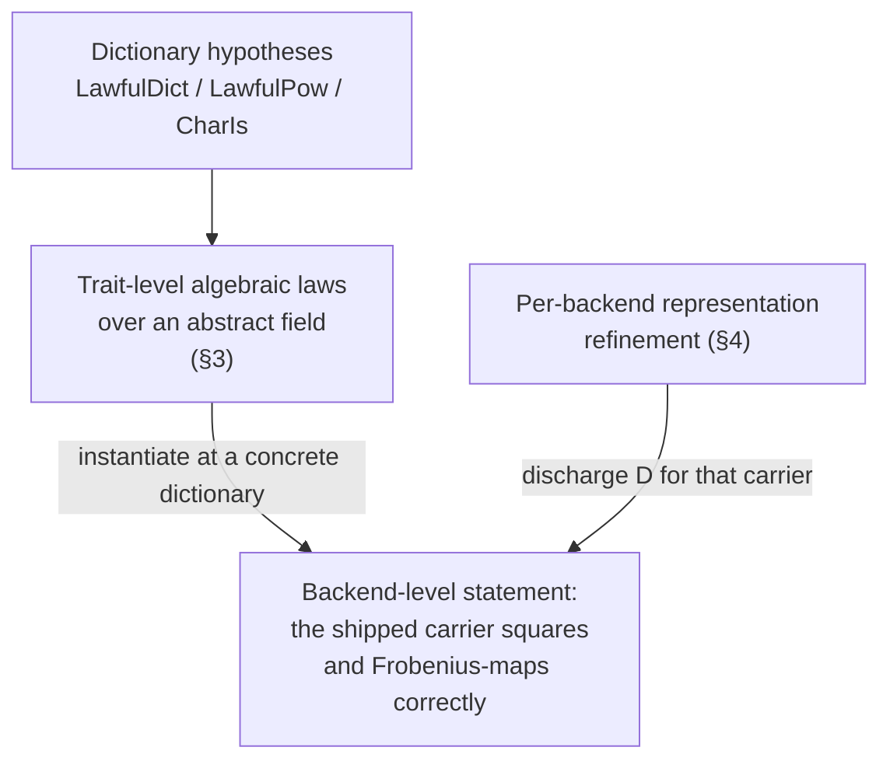
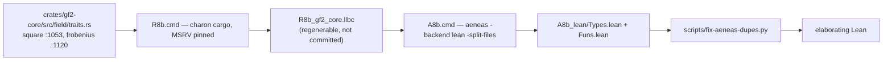

# Proof sketch — loop-free extraction obligation factoring (1ac74567)

Approved-sketch document for epic `6dc81018` criterion REQ-05, as narrowed by
owner decision DEC-A. It factors the proof obligations for the two loop-free
Charon/Aeneas-extracted generic field operations into trait-level algebraic
laws over an abstract field (§3) and per-backend representation refinement
(§4), names the exact production path and proof strategy for every stated lemma
(§5), and records what the generated Lean does under the elaborator (§6).

Discharging the lemmas is follow-on work outside this epic. This document
states no proof body.

Anchor commit for every citation: `66311b25`.

---

## 1. Targets

DEC-A narrows REQ-05 to the loop-free generic operations of the
`FiniteFieldExt::square` / `frobenius` class. Two extracted definitions carry
that class:

| Extracted definition | Generated Lean | Rust source |
|---|---|---|
| `field.traits.FiniteFieldExt.square.default` | `dev/active/34d85cb9/extraction/A8b_lean/Funs.lean:25-32` | `crates/gf2-core/src/field/traits.rs:1053-1055` |
| `field.traits.FiniteFieldExt.frobenius.default` | `dev/active/34d85cb9/extraction/A8b_lean/Funs.lean:135-148` | `crates/gf2-core/src/field/traits.rs:1120-1131` |

`frobenius.default` is served by two lifted loop helpers,
`frobenius.default_loop.body`
(`dev/active/34d85cb9/extraction/A8b_lean/Funs.lean:105-117`) and
`frobenius.default_loop` (`:123-130`).

### 1.1 What the generated Lean supports, by citation

Three structural claims decide the factoring. Each is verified against the
generated file.

**`square.default` is complete and dictionary-parameterised.**
`dev/active/34d85cb9/extraction/A8b_lean/Funs.lean:25-32` binds `{Self :
Type}`, `{Clause0_Clause0_Characteristic : Type}`, `{Clause0_Clause0_Wide :
Type}` and the explicit parameter `(FiniteFieldExtInst :
field.traits.FiniteFieldExt Self Clause0_Clause0_Characteristic
Clause0_Clause0_Wide)`, and its body reaches the field operations through that
dictionary only — `FiniteFieldExtInst.FiniteFieldInst.corecloneCloneInst.clone`
at `:31` and `FiniteFieldExtInst.FiniteFieldInst.coreopsarithMulInst.mul` at
`:32`. No `sorry` appears in the definition. It carries no axiom dependency at
all (`dev/active/1ac74567/elaboration/elaborate.log:91`).

One precision the spike's record does not make.
`dev/active/34d85cb9/findings.md:826-828` states that both targets "take the
`FiniteField` dictionary as a parameter". The parameter is the
**`FiniteFieldExt`** dictionary; the `FiniteField` dictionary is reached
through its first field, `FiniteFieldInst`
(`dev/active/34d85cb9/extraction/A8b_lean/Types.lean:119-120`). The lemma
statements in §3 therefore bind both structures: the `FiniteFieldExt`
dictionary because the extracted definitions are applied to it, and the
`FiniteField` dictionary as a parameter in its own right, tied to the first by
the hypothesis `dict.FiniteFieldInst = ff`.

**`frobenius.default_loop` is complete, and its loop state carries no `Self`.**
`dev/active/34d85cb9/extraction/A8b_lean/Funs.lean:123-125` gives the loop the
signature `(iter : core.ops.range.Range Std.Usize) (p : Std.U64) (exp :
Std.U64) : Result Std.U64` — no type parameters, no dictionary, no `sorry`. The
body at `:105-117` takes `(p : Std.U64) (iter : core.ops.range.Range Std.Usize)
(exp : Std.U64)`, with the argument reordering threaded correctly at `:129`.
This is the contrast with `pow`: `pow.default_loop.body` at `:38-41` and
`pow.default_loop` at `:70-73` bind `{Self : Type}` and then carry `sorry /-
Could not find: type_var_id: 1 from ExtractBase.Item-/` and `... : 2 ...` in
the two associated-type argument positions their parent `pow.default` binds
properly at `:87-89`. That is finding F4 of the spike
(`dev/active/34d85cb9/findings.md:356-372`), and it reproduces here.

**`frobenius.default` calls the dictionary's `pow`, not `pow.default`.**
`dev/active/34d85cb9/extraction/A8b_lean/Funs.lean:148` is
`FiniteFieldExtInst.pow self exp` — a projection of the `pow` field declared at
`dev/active/34d85cb9/extraction/A8b_lean/Types.lean:122`, not a call to
`field.traits.FiniteFieldExt.pow.default` at `:86`. The Rust it translates,
`self.pow(exp)` at `crates/gf2-core/src/field/traits.rs:1130`, resolves through
the trait's method table for the same reason. So the specification of
`frobenius.default` is conditional on what the dictionary's `pow` field
satisfies and has no dependency on the two `sorry`-carrying definitions. §6.3
confirms this at the elaborator: deleting the whole `pow` chain leaves
`frobenius.default` elaborating
(`dev/active/1ac74567/elaboration/elaborate.log:81-89`).

All three claims hold. None of them is falsified.

### 1.2 Why `pow` is not a target

`pow.default` (`dev/active/34d85cb9/extraction/A8b_lean/Funs.lean:86-99`) is
well-formed in isolation but calls `pow.default_loop`, whose signature contains
the two F4 `sorry` placeholders. Under the elaborator this is not a cosmetic
defect: each `sorry` elaborates to a *distinct* opaque constant, so the
application at `:98` does not type-check
(`dev/active/1ac74567/elaboration/elaborate.log:70-77`). `pow` is excluded,
matching `dev/active/34d85cb9/findings.md:830-831`.

---

## 2. Factoring



The laws in §3 quantify over an abstract carrier `Self` equipped with a Mathlib
`Field` structure and the extracted `FiniteField` and `FiniteFieldExt`
dictionaries over it. Machine layout appears nowhere in them. Everything
layout-dependent — Montgomery form, packed limbs, coefficient vectors — enters
only in §4, as the obligation to discharge the dictionary hypotheses for one
concrete carrier. This is the `ExtDefs`/`ExtAlgebra` split the repository
already uses: `ValidExtConfig` at `proofs/Gf2Core/Proofs/ExtDefs.lean:65-87`
bundles exactly this kind of dictionary hypothesis, and the algebra above it
never mentions storage.

---

## 3. Trait-level algebraic laws

Every statement below elaborates. The receipt is
`dev/active/1ac74567/elaboration/statements.lean`, run as stage 4 of the
harness; `dev/active/1ac74567/elaboration/elaborate.log:109-119` records exit 0
with nine `declaration uses 'sorry'` warnings and no error, which is exactly
"the statements type-check, the bodies are absent". Bodies are out of scope for
this issue.

The statements live outside `proofs/`, in no lake target, and are not proof
code.

### 3.1 Setting and dictionary hypotheses

Two dictionaries are in play, and §1.1 says why. `ff` is the extracted
`FiniteField` dictionary, the one the laws are stated over; `dict` is the
extracted `FiniteFieldExt` dictionary, the one the extracted definitions are
applied to. `hff : dict.FiniteFieldInst = ff` ties them.

```lean
abbrev FFExt (Self Char Wide : Type) := field.traits.FiniteFieldExt Self Char Wide

variable {Self Char Wide : Type}

abbrev dictClone (ff : field.traits.FiniteField Self Char Wide) :=
  ff.corecloneCloneInst.clone

abbrev dictMul (ff : field.traits.FiniteField Self Char Wide) :=
  ff.coreopsarithMulInst.mul

abbrev dictChar (ff : field.traits.FiniteField Self Char Wide) :=
  ff.characteristic

/-- The extracted `FiniteField` dictionary refines the abstract field `Self`:
    `Clone` is the identity and `Mul` is the field multiplication, both total. -/
structure LawfulDict [Field Self]
    (ff : field.traits.FiniteField Self Char Wide) : Prop where
  clone_ok : ∀ a : Self, dictClone ff a = ok a
  mul_ok : ∀ a b : Self, dictMul ff a b = ok (a * b)

/-- The dictionary's own `pow` method is the field power map. -/
structure LawfulPow [Field Self] (dict : FFExt Self Char Wide) : Prop where
  pow_ok : ∀ (a : Self) (e : Std.U64), dict.pow a e = ok (a ^ e.val)

/-- The dictionary reports characteristic `p`, and the `Into` dictionary the
    extraction demands converts it to the same `U64` for every element. -/
structure CharIs [Field Self] (ff : field.traits.FiniteField Self Char Wide)
    (intoU64 : core.convert.Into Char Std.U64) (p : Std.U64) : Prop where
  char_ok : ∀ a : Self, ∃ c, dictChar ff a = ok c ∧ intoU64.into c = ok p
```

`LawfulDict` and `CharIs` are stated over `ff` because every field they
mention is a `FiniteField` field: `corecloneCloneInst`, `coreopsarithMulInst`
and `characteristic` are declared at
`dev/active/34d85cb9/extraction/A8b_lean/Types.lean:72-112`. `LawfulPow` takes
the `FiniteFieldExt` dictionary instead, because `pow` is a field of
`FiniteFieldExt` (`dev/active/34d85cb9/extraction/A8b_lean/Types.lean:122`) and
of nothing below it — the split is forced by the extraction, not chosen.

`CharIs` carries the `core.convert.Into Char Std.U64` dictionary because
`frobenius.default` takes it as an explicit parameter
(`dev/active/34d85cb9/extraction/A8b_lean/Funs.lean:139-140`), which is the
extraction of the Rust `where Self::Characteristic: Into<u64>` bound at
`crates/gf2-core/src/field/traits.rs:1122`.

### 3.2 Laws for `square.default`

```lean
/-- L1. `square.default` is total and equals multiplication of the element by
    itself. -/
theorem square_default_eq_mul_self [Field Self]
    (ff : field.traits.FiniteField Self Char Wide)
    (dict : FFExt Self Char Wide) (hff : dict.FiniteFieldInst = ff)
    (hd : LawfulDict ff) (a : Self) :
    field.traits.FiniteFieldExt.square.default dict a = ok (a * a)

/-- L2. `square.default` is multiplicative, stated conditionally on
    `Result`-monad success at all three arguments. -/
theorem square_default_mul_hom [Field Self]
    (ff : field.traits.FiniteField Self Char Wide)
    (dict : FFExt Self Char Wide) (hff : dict.FiniteFieldInst = ff)
    (hd : LawfulDict ff) (a b sa sb sab : Self)
    (ha : field.traits.FiniteFieldExt.square.default dict a = ok sa)
    (hb : field.traits.FiniteFieldExt.square.default dict b = ok sb)
    (hab : field.traits.FiniteFieldExt.square.default dict (a * b) = ok sab) :
    sab = sa * sb
```

L1's hypothesis set closes: `LawfulDict` and the `hff` tie are the whole of it,
and the body at `dev/active/34d85cb9/extraction/A8b_lean/Funs.lean:31-32` is a
two-step monadic chain through `clone` and `mul`. L2 is stated in success-conditional form on
purpose — it is then true of any dictionary satisfying `LawfulDict`, and it
stays true if a future dictionary makes `mul` partial.

### 3.3 Laws for the exponent loop

```lean
/-- L3. Below the `U64` ceiling the exponent loop is total and computes p^k.
    The extracted loop takes neither dictionary and no type parameter, so no
    dictionary is bound here. -/
theorem frobenius_default_loop_eq_pow
    (p : Std.U64) (k : Std.Usize) (hnof : p.val ^ k.val ≤ Std.U64.max) :
    ∃ e : Std.U64,
      field.traits.FiniteFieldExt.frobenius.default_loop
        { start := 0#usize, «end» := k } p 1#u64 = ok e ∧ e.val = p.val ^ k.val

/-- L4. Above the ceiling the loop's `Option::expect` fires. -/
theorem frobenius_default_loop_overflow
    (p : Std.U64) (k : Std.Usize) (hov : Std.U64.max < p.val ^ k.val) :
    ∃ e, field.traits.FiniteFieldExt.frobenius.default_loop
      { start := 0#usize, «end» := k } p 1#u64 = fail e
```

L3 and L4 are the two laws that bind no dictionary and carry no `hff` tie.
`frobenius.default_loop` has the signature `(iter : core.ops.range.Range
Std.Usize) (p : Std.U64) (exp : Std.U64) : Result Std.U64`
(`dev/active/34d85cb9/extraction/A8b_lean/Funs.lean:123-125`): no type
parameter, no `FiniteFieldExt` dictionary, and so no `FiniteField` dictionary
to state anything over. Their content is arithmetic on `U64`, and §1.1 records
that this is what makes the loop separable from the field.

L3's hypothesis is forced by the extraction, not by the mathematics: the loop
computes the exponent by repeated `U64.checked_mul`
(`dev/active/34d85cb9/extraction/A8b_lean/Funs.lean:114`) and raises through
`core.option.Option.expect` with the message `"Frobenius exponent overflow"`
(`:116`), the extraction of `crates/gf2-core/src/field/traits.rs:1128`. L4 is
the necessity direction and makes the restriction visible rather than hiding it
in L3's antecedent.

### 3.4 Laws for `frobenius.default`

```lean
/-- L5. `frobenius.default` at k is the p^k-power map. -/
theorem frobenius_default_eq_pow_char [Field Self]
    (p : Std.U64) (ff : field.traits.FiniteField Self Char Wide)
    (dict : FFExt Self Char Wide) (hff : dict.FiniteFieldInst = ff)
    (intoU64 : core.convert.Into Char Std.U64)
    (hp : LawfulPow dict) (hc : CharIs ff intoU64 p)
    (a : Self) (k : Std.Usize) (hnof : p.val ^ k.val ≤ Std.U64.max) :
    field.traits.FiniteFieldExt.frobenius.default dict intoU64 a k
      = ok (a ^ (p.val ^ k.val))

/-- L6. `frobenius.default` at k is Mathlib's k-fold Frobenius, given that
    `Self` has exponential characteristic p. -/
theorem frobenius_default_eq_iterateFrobenius [Field Self]
    (p : Std.U64) [ExpChar Self p.val] (ff : field.traits.FiniteField Self Char Wide)
    (dict : FFExt Self Char Wide) (hff : dict.FiniteFieldInst = ff)
    (intoU64 : core.convert.Into Char Std.U64)
    (hp : LawfulPow dict) (hc : CharIs ff intoU64 p)
    (a : Self) (k : Std.Usize) (hnof : p.val ^ k.val ≤ Std.U64.max) :
    field.traits.FiniteFieldExt.frobenius.default dict intoU64 a k
      = ok (iterateFrobenius Self p.val k.val a)

/-- L7. `frobenius.default` is additive. -/
theorem frobenius_default_add [Field Self]
    (p : Std.U64) [ExpChar Self p.val] (ff : field.traits.FiniteField Self Char Wide)
    (dict : FFExt Self Char Wide) (hff : dict.FiniteFieldInst = ff)
    (intoU64 : core.convert.Into Char Std.U64)
    (hp : LawfulPow dict) (hc : CharIs ff intoU64 p)
    (a b ra rb rab : Self) (k : Std.Usize)
    (ha : field.traits.FiniteFieldExt.frobenius.default dict intoU64 a k = ok ra)
    (hb : field.traits.FiniteFieldExt.frobenius.default dict intoU64 b k = ok rb)
    (hab : field.traits.FiniteFieldExt.frobenius.default dict intoU64 (a + b) k = ok rab) :
    rab = ra + rb

/-- L8a. k = 0 is the identity. -/
theorem frobenius_default_zero [Field Self]
    (p : Std.U64) (ff : field.traits.FiniteField Self Char Wide)
    (dict : FFExt Self Char Wide) (hff : dict.FiniteFieldInst = ff)
    (intoU64 : core.convert.Into Char Std.U64)
    (hp : LawfulPow dict) (hc : CharIs ff intoU64 p) (a : Self) :
    field.traits.FiniteFieldExt.frobenius.default dict intoU64 a 0#usize = ok a

/-- L8b. Composition: φ^j ∘ φ^k = φ^(j+k). -/
theorem frobenius_default_comp [Field Self]
    (p : Std.U64) [ExpChar Self p.val] (ff : field.traits.FiniteField Self Char Wide)
    (dict : FFExt Self Char Wide) (hff : dict.FiniteFieldInst = ff)
    (intoU64 : core.convert.Into Char Std.U64)
    (hp : LawfulPow dict) (hc : CharIs ff intoU64 p)
    (a x : Self) (j k jk : Std.Usize) (hjk : jk.val = j.val + k.val)
    (hnof : p.val ^ jk.val ≤ Std.U64.max)
    (hx : field.traits.FiniteFieldExt.frobenius.default dict intoU64 a k = ok x) :
    field.traits.FiniteFieldExt.frobenius.default dict intoU64 x j
      = field.traits.FiniteFieldExt.frobenius.default dict intoU64 a jk
```

Hypotheses, stated explicitly rather than assumed:

- **`hff : dict.FiniteFieldInst = ff`.** The tie of §3.1. It is what lets
  `CharIs`, stated over the `FiniteField` dictionary, discharge the
  `characteristic` bind that the extracted body reaches through
  `FiniteFieldExtInst.FiniteFieldInst`
  (`dev/active/34d85cb9/extraction/A8b_lean/Funs.lean:143`).
- **`LawfulPow`.** `frobenius.default` delegates the arithmetic entirely to
  `dict.pow` (`dev/active/34d85cb9/extraction/A8b_lean/Funs.lean:148`), so no
  law about it is stronger than what that field satisfies. §7.1 records why
  this hypothesis cannot currently be closed from the extraction.
- **`CharIs`.** The characteristic is read per element
  (`dev/active/34d85cb9/extraction/A8b_lean/Funs.lean:143-144`), so the
  hypothesis is universally quantified over elements. For a carrier whose
  `characteristic` is a constant — which is every production carrier in §4 — it
  is immediate.
- **`hnof : p.val ^ k.val ≤ Std.U64.max`.** L3's condition, propagated. L7
  needs none: its three calls share one $k$, and the law assumes success at all
  three rather than deriving it.
- **`[ExpChar Self p.val]`.** L6 needs it to name `iterateFrobenius` at all,
  and L7 and L8b inherit it: additivity and composition hold because
  $x \mapsto x^p$ is a ring homomorphism in characteristic $p$, which is what
  this instance supplies. L5 and L8a do not need it.
- **L8b's `jk` and `hjk`.** The `Usize` sum is passed in with its defining
  equation rather than written `j + k`, so no `Usize` overflow condition leaks
  into a statement about field automorphisms.

$\phi^j \circ \phi^k = \phi^{j+k}$ in L8b is stated at the level of the
extracted function, with `x` the intermediate result. Given L6 it is Mathlib's
`iterateFrobenius_add_apply`.

---

## 4. Per-backend representation refinement

Machine layout is confined to this section. Each entry gives the refinement
relation tying the carrier's concrete representation to the abstract field, the
obligation that discharges §3's dictionary hypotheses for it, and whether it is
in scope for the follow-on round.

The production carriers are the six `FiniteField` implementations the epic's
classification records at
`dev/active/6dc81018-field-capability-dispatch/classification.md:56`, matching
`dev/active/6dc81018-field-capability-dispatch/investigation.md:18-31` and `git
grep -n "impl.*FiniteField for" -- crates` minus the two test-only carriers
`OpCount` (`crates/gf2-core/src/field/batch_ops.rs:670`, inside the
`#[cfg(test)]` module opened at `:409`) and `RuntimeFp7`
(`crates/gf2-algebra/src/permanent/ryser.rs:495`, inside the `#[cfg(test)]`
module opened at `:194`). Those two are instruments, not shipped field
families, and are out of scope by classification §2.1.

**One step is common to every entry.** §3 puts `[Field Self]` on the abstract
carrier, following `ValidExtConfig`, which puts `[Field BF]` on the extracted
base-field *type variable* (`proofs/Gf2Core/Proofs/ExtDefs.lean:65-68`). A
concrete backend's extracted carrier is not a type variable and carries no
`Field` structure: `proofs/Gf2Core/Types.lean:146` reduces `gfp.Fp P` to
`Std.U64`, and `Std.U64` is not a field. Instantiating §3 at a backend
therefore goes through a transport: build the `Field` structure on a subtype or
quotient of the carrier that satisfies the representation invariant, then
transport the extracted dictionary onto it, discharging totality and invariant
preservation at every operation. `FpVal` exists for exactly this reason and
says so at `proofs/Gf2Core/Proofs/Defs.lean:21-22`, and
`proofs/Gf2Core/Proofs/QuadraticExtField.lean:1-7` performs the same move by
`Equiv` transfer. The transport is the substance of each entry's obligation
below, not a formality.

### 4.1 Covered — `Fp<P>`

- **Representation.** `crates/gf2-core/src/gfp/mod.rs:134` — `pub struct
  Fp<const P: u64>(u64)`, one storage word whose interpretation is chosen at
  compile time: canonical for `P = 2` and for specialised Mersenne and Proth
  primes, Montgomery form $aR \bmod P$ with $R = 2^{64}$ otherwise (`:93-109`).
  The canonicalising boundary is `new` (`:167-177`) and `value` (`:190-196`);
  `raw_storage` (`:214`) and `from_raw_storage` (`:230`) are crate-private.
  Montgomery constants are `MontConsts` at
  `crates/gf2-core/src/gfp/montgomery.rs:12-23`.
- **Refinement relation.** The extraction reduces the carrier to its storage
  word: `proofs/Gf2Core/Types.lean:146` is `def gfp.Fp (P : Std.U64) :=
  Std.U64`. The relation to the abstract field is the ring isomorphism
  $\mathrm{FpVal}\,P \simeq \mathbb{Z}/P$ built at
  `proofs/Gf2Core/Proofs/FpField.lean:136-144`, whose carrier `FpVal`
  (`proofs/Gf2Core/Proofs/Defs.lean:23-27`) pairs the storage word with the
  invariant `mont.val < P.val`, and whose `Field` instance is
  `FpField.FpVal.instField` at `proofs/Gf2Core/Proofs/FpField.lean:150-153`. It
  is stated under `ValidPrime` (`proofs/Gf2Core/Proofs/Defs.lean:18-19`: $P$
  prime, $1 < P \le 2^{63}$) and $P \neq 2$.
- **Obligation.** Transport `gfp.Fp.Insts.Gf2_coreFieldTraitsFiniteFieldU64U128
  P` (`proofs/Gf2Core/Funs.lean:1370-1371`) from the storage word onto
  `FpVal P`, then discharge `LawfulDict` and `CharIs` there. `mul_ok` follows
  from `FpProgress.mul_progress`, which is what
  `proofs/Gf2Core/Proofs/FpField.lean:53-56` already uses to extract the pure
  multiplication and its `< P` invariant from the `Result` monad, and
  `clone_ok` from the identity body of `gfp.Fp.Insts.CoreCloneClone.clone`
  (`proofs/Gf2Core/Funs.lean:341`). `CharIs` is open for the reason §7.2 gives,
  and `LawfulPow` for the reason §7.1 gives.
- **Scope.** In scope. It is the only carrier with both a complete Lean
  refinement to a Mathlib field and an assembled `FiniteField` dictionary whose
  arithmetic fields are all defined.

### 4.2 Covered — `GoldilocksFp`

- **Representation.** `crates/gf2-core/src/gfp/specialized.rs:780` — `pub
  struct GoldilocksFp(u64)`, canonical value in $[0, p)$ for $p = 2^{64} -
  2^{32} + 1$ (`:784`), with `new` (`:805`) and `value` (`:826`) as the
  boundary. `Wide = u128` (`:988`).
- **Refinement relation.** Identity on the storage word into
  $\mathbb{Z}/(2^{64} - 2^{32} + 1)$; there is no Montgomery round trip to
  invert. The reduction path is proved at
  `proofs/Gf2Core/Proofs/Specialized.lean`, whose scope note at `:12-20`
  records that `specialized_mul` is fully proven across all four `PrimeShape`
  arms on top of exactly two documented model-assumption specs for
  `u64::trailing_zeros` and `u64::is_power_of_two`.
- **Obligation.** Discharge `LawfulDict` at the dictionary
  `proofs/Gf2Core/Funs.lean:2308-2309`, whose arithmetic fields are defined;
  `CharIs` is open for the reason §7.2 gives. The `Field` instance on the
  abstract side is not yet built — `Specialized.lean` proves reduction
  correctness, not a ring isomorphism — so this carrier needs a
  `FpField`-shaped transfer of its own before L1 can be instantiated at it.
- **Scope.** In scope, second. The missing `Field` transfer is a bounded piece
  of work modelled directly on `proofs/Gf2Core/Proofs/FpField.lean:83-153`, but
  it is real work and it is not shared with §4.1.

### 4.3 Stated, out of scope — `QuadraticExt<C>` and `CubicExt<C>`

- **Representation.** `crates/gf2-core/src/gfpn/quadratic.rs:229-232` —
  `QuadraticExt<C> { c0, c1 : C::BaseField }`, coefficients of
  $\mathbb{F}_q[u]/(u^2 - \beta)$; `crates/gf2-core/src/gfpn/cubic.rs:250-254`
  is the cubic analogue over $\mathbb{F}_q[v]/(v^3 - \beta)$. The
  delayed-reduction accumulators propagate componentwise: `QuadraticExtWide<W>`
  at `crates/gf2-core/src/gfpn/quadratic.rs:97-102` and `CubicExtWide<W>` at
  `crates/gf2-core/src/gfpn/cubic.rs:102`, with `Wide =
  QuadraticExtWide<<C::BaseField as FiniteField>::Wide>` at
  `crates/gf2-core/src/gfpn/quadratic.rs:584` and the cubic counterpart at
  `crates/gf2-core/src/gfpn/cubic.rs:635`.
- **Refinement relation.** Coefficient-wise application of the base field's own
  relation, composed with the tower isomorphism proved in
  `proofs/Gf2Core/Proofs/QuadraticExtField.lean`, which transfers `CommRing`
  and `Field` from the abstract `QExt BF β` of `ExtAlgebra.lean` onto the
  extracted type (`proofs/Gf2Core/Proofs/QuadraticExtField.lean:1-7`). The
  base-field dictionary hypotheses have a precedent already in this shape:
  `ValidExtConfig` at `proofs/Gf2Core/Proofs/ExtDefs.lean:65-87`.
- **Obligation.** Discharge `LawfulDict` at a `FiniteField` dictionary for the
  extension carrier, then compose with `ValidExtConfig` for the base field.
  `CharIs` would be inherited from the base field, since `characteristic`
  delegates to `c0` (`crates/gf2-core/src/gfpn/quadratic.rs:587-588`,
  `crates/gf2-core/src/gfpn/cubic.rs:638-639`), but the delegation is not
  visible in the extraction — §7.2.
- **Scope.** Out of scope, for a reason that is a finding rather than a
  preference. The committed extraction contains **no assembled `FiniteField`
  dictionary for either carrier** — the only `field.traits.FiniteField`
  dictionary records in `proofs/Gf2Core/Funs.lean` are the two at `:1371` and
  `:2309` — and the `ConstField` dictionaries that do exist for them are
  `sorry`: `gfpn.cubic.CubicExt.Insts.Gf2_coreFieldTraitsConstField…` at
  `proofs/Gf2Core/Funs.lean:4068-4078` and the quadratic counterpart at
  `:5661-5670`. The individual methods are present (for example
  `…FiniteFieldClause0_Clause0_Clause0_CharacteristicQuadraticExtWide.inv` at
  `:4844`), so the obligation is stateable, but instantiating §3 at these
  carriers needs an extraction that assembles the dictionary first.

### 4.4 Not covered — `Gf2mElement_<V>`

- **Representation.** `crates/gf2-core/src/gf2m/field.rs:206-209` —
  `Gf2mElement_<V> { value: V, params: Arc<FieldParams_<V>> }`: a bit-packed
  polynomial over $\mathbb{F}_2$ of degree below $m$, plus a shared handle to
  the runtime field parameters. `Wide = Self` (`:1323`), because XOR
  accumulation never overflows. The boundary is `value` (`:870`).
- **Refinement relation.** The storage word's bits are the coefficient vector
  in the canonical little-endian indexing of `@/inv/canonical-bit-indexing`,
  and the abstract element is its class in $\mathbb{F}_2[x]/(f)$ for the
  defining polynomial carried by `params`.
- **Scope.** Not covered. `gf2_core::gf2m::field` is opaque in the committed
  extraction (`scripts/verify-lean.sh:109`), for the runtime-parameter reasons
  recorded at `proofs/WORKAROUNDS.md:35`; only the monomorphised free function
  `gf2m_mul_raw` is extracted and proved
  (`proofs/Gf2Core/Proofs/Gf2mMulRaw.lean:1-6`). There is no extracted carrier
  to instantiate §3 at, and making one is a separate extraction project.
- **Domain note.** The characteristic is 2
  (`crates/gf2-core/src/gf2m/field.rs:1326`), so L3's hypothesis $p^k \le
  \texttt{U64::MAX}$ bites at $k \ge 64$ — see §7.3.

### 4.5 Not covered — `Gf2mWide<N, Cfg>`

- **Representation.** `crates/gf2-core/src/gf2m/wide.rs:114-117` — `Gf2mWide<N,
  Cfg> { words: [u64; N], _marker }`: an $N$-limb packed polynomial over
  $\mathbb{F}_2$, with `from_words` (`:277`) and `words` (`:464`) as the
  boundary and `Wide = Self` (`:1361`).
- **Refinement relation.** Concatenation of the $N$ limbs in canonical bit
  indexing gives the coefficient vector; the abstract element is its class in
  $\mathbb{F}_2[x]/(f)$ for `Cfg`'s defining polynomial.
- **Scope.** Not covered. The carrier has no Lean image at all: `Gf2mWide` does
  not occur in `proofs/Gf2Core/Types.lean` or `proofs/Gf2Core/Funs.lean`,
  because `gf2_core::gf2m::wide` is not among the extraction roots
  (`scripts/verify-lean.sh:106-108`).

### 4.6 Summary

| Carrier | `Wide` | Lean image in the committed extraction | `characteristic` | Follow-on scope |
|---|---|---|---|---|
| `Fp<P>` | `u128` | carrier + `FiniteField` dictionary, arithmetic fields defined | `sorry` (§7.2) | in scope, first |
| `GoldilocksFp` | `u128` | carrier + `FiniteField` dictionary, arithmetic fields defined | `sorry` (§7.2) | in scope, second; needs a `Field` transfer |
| `QuadraticExt<C>` | `QuadraticExtWide<…>` | carrier + methods; no `FiniteField` dictionary | `sorry` (§7.2) | out of scope |
| `CubicExt<C>` | `CubicExtWide<…>` | carrier + methods; no `FiniteField` dictionary | `sorry` (§7.2) | out of scope |
| `Gf2mElement_<V>` | `Self` | none (module opaque) | absent | out of scope |
| `Gf2mWide<N, Cfg>` | `Self` | none (not an extraction root) | absent | out of scope |

---

## 5. Production path and proof strategy

### 5.1 Production path, per lemma

Every lemma in §3 mentions exactly one of two extracted definitions, so the
path is common to the group and differs only in the Rust item.



| Lemma | Rust item | Extraction invocation | Generated Lean |
|---|---|---|---|
| L1, L2 | `FiniteFieldExt::square`, `crates/gf2-core/src/field/traits.rs:1053-1055` | `dev/active/34d85cb9/extraction/R8b.cmd` then `dev/active/34d85cb9/extraction/A8b.cmd` | `dev/active/34d85cb9/extraction/A8b_lean/Funs.lean:25-32`; dictionaries in `dev/active/34d85cb9/extraction/A8b_lean/Types.lean:72-112` and `:117-124` |
| L3, L4 | the `for _ in 0..k` loop of `FiniteFieldExt::frobenius`, `crates/gf2-core/src/field/traits.rs:1127-1129` | same | `dev/active/34d85cb9/extraction/A8b_lean/Funs.lean:105-117` and `:123-130` |
| L5–L8b | `FiniteFieldExt::frobenius`, `crates/gf2-core/src/field/traits.rs:1120-1131` | same | `dev/active/34d85cb9/extraction/A8b_lean/Funs.lean:135-148`; dictionaries in `dev/active/34d85cb9/extraction/A8b_lean/Types.lean:72-112` and `:117-124` |

`R8b.cmd` starts from `gf2_core::field::traits::FiniteFieldExt::pow`, keeps
`--opaque 'gf2_core::field'` and re-narrows it with `--include
'gf2_core::field::traits::FiniteFieldExt'`, runs under
`RUSTUP_TOOLCHAIN=1.95.0` (`dev/active/34d85cb9/extraction/R8b.cmd:1`), and
omits `--translate-all-methods`, which panics Charon
(`dev/active/34d85cb9/findings.md:821-824`). `A8b.cmd` is `aeneas -backend lean
-dest … -split-files -print-error-emitters`. The `.llbc` intermediate is
regenerable and deliberately uncommitted
(`dev/active/34d85cb9/findings.md:118-122`).

### 5.2 Strategy

**L1 — `square_default_eq_mul_self`.** Unfold the definition and step the
two-element monadic chain. `progress`/`step` from `Aeneas.Std.WP` is the tactic
family; `hff` rewrites the body's `FiniteFieldInst` projection to `ff`, then
`LawfulDict.clone_ok` rewrites the first bind and `LawfulDict.mul_ok` the
second. Modelled on the shape of `FpProgress.wrapping_neg_spec`
(`proofs/Gf2Core/Proofs/Progress.lean:33-37`), which is the same "unfold, then
discharge by the dictionary's own spec" move. Expected difficulty: low. This is
the lemma to prove first, because it validates the whole `LawfulDict`
formulation before any loop reasoning.

**L2 — `square_default_mul_hom`.** Rewrite all three hypotheses with L1, then
`ring`. Expected difficulty: low, conditional on L1.

**L3 — `frobenius_default_loop_eq_pow`.** The real work. The loop is Aeneas's
`loop` combinator over `(iter, exp)`
(`dev/active/34d85cb9/extraction/A8b_lean/Funs.lean:127-130`); the proof is an
induction on the remaining range length with the invariant "`exp.val` $= p^i$
after $i$ steps, and $p^i \le$ `U64.max`", strengthened so the `checked_mul` at
`:114` is known to return `some`. The precedent is `Gf2mSpec.specLoop` at
`proofs/Gf2Core/Proofs/Gf2mDefs.lean:39-46`: a pure `termination_by` recursion
mirroring the extracted loop, proved equal to it and then reasoned about
mathematically. Expected difficulty: high — it is the only loop in the set,
`core.iter.range.IteratorRange.next` has to be stepped through Aeneas's
iterator model, and the monotonicity argument that lets the antecedent be
stated on $p^k$ alone rather than on every partial product needs care for $p
\in \{0, 1\}$.

**L4 — `frobenius_default_loop_overflow`.** Same induction, opposite branch:
find the least $i$ with $p^i > $ `U64.max`, show `checked_mul` returns `none`
there, and step `core.option.Option.expect` to `fail`. Expected difficulty:
medium, and it shares its induction skeleton with L3, so prove them together.

**L5 — `frobenius_default_eq_pow_char`.** Compose: `hff` rewrites the
`FiniteFieldInst` projection at
`dev/active/34d85cb9/extraction/A8b_lean/Funs.lean:143` so `CharIs.char_ok`
discharges the two binds at `:143-144`, L3 discharges the loop, and
`LawfulPow.pow_ok` discharges the tail call at `:148`. Expected difficulty:
low, conditional on L3.

**L6 — `frobenius_default_eq_iterateFrobenius`.** L5 followed by
`iterateFrobenius_def` (Mathlib `v4.30.0-rc2`,
`Mathlib/Algebra/CharP/Frobenius.lean:34`), which is `rfl`. Expected
difficulty: low.

**L7 — `frobenius_default_add`.** Rewrite the three hypotheses with L6, then
`map_add` on the `RingHom` that `iterateFrobenius` returns. Expected
difficulty: low. This is where the `[ExpChar Self p.val]` instance pays for
itself: without it, additivity would need a freshman's-dream argument from
scratch.

**L8a — `frobenius_default_zero`.** The loop over the empty range `0..0`
returns its initial `exp = 1#u64` in one step, then `LawfulPow.pow_ok` gives `a
^ 1`. Expected difficulty: low, and it does not depend on L3.

**L8b — `frobenius_default_comp`.** Rewrite both sides with L6 and apply
`iterateFrobenius_add_apply` (Mathlib `v4.30.0-rc2`,
`Mathlib/Algebra/CharP/Frobenius.lean:60-62`). Expected difficulty: low,
conditional on L6.

**Per-backend instantiation (§4).** The strategy is the one issue `0606186a`
established for `permanent_ryser` and recorded at
`proofs/Gf2Algebra/Proofs/RyserBounded.lean:57-105`: prove the abstract content
over a `CommRing`/`Field` and bind it to extracted Rust only where the
extraction actually supports the binding, descoping rather than
`sorry`-stubbing where it does not. §4.3–§4.5 apply that rule.

### 5.3 Ordering

L1 → L2, then L3 with L4, then L5 → L6 → {L7, L8b}. L8a is independent and is a
good second lemma after L1. If L3 proves intractable, L1, L2 and L8a still
stand and the `frobenius` group degrades to statements conditional on an
assumed loop spec, which is a visible, reviewable outcome rather than a silent
one.

---

## 6. Does the extracted Lean elaborate?

**No.** `dev/active/34d85cb9/extraction/A8b_lean/` as generated does not
elaborate. The failure is recorded here as a finding.

The harness is `dev/active/1ac74567/elaboration/elaborate.sh`; the committed
output is `dev/active/1ac74567/elaboration/elaborate.log`. It copies the
generated files into a `mktemp` tree and elaborates them with `lake env` run
from `proofs/`, which supplies the pinned Lean `v4.30.0-rc2`, Mathlib and the
Aeneas backend without building or modifying the committed lake project. No
lake target, library, or file is added to `proofs/`, and `proofs/lakefile.lean`
is unchanged.

Command, exactly as run:

```
./dev/active/1ac74567/elaboration/elaborate.sh \
  > dev/active/1ac74567/elaboration/elaborate.log 2>&1
```

Toolchain recorded in the log header
(`dev/active/1ac74567/elaboration/elaborate.log:4-6`):
`leanprover/lean4:v4.30.0-rc2`, `Lean (version 4.30.0-rc2, …, commit
3dc1a08…)`, `Lake version 5.0.0-src+3dc1a08`.

### 6.1 Stage 1 — the generated files verbatim: exit 1

`dev/active/1ac74567/elaboration/elaborate.log:8-15`.

```
R8bGf2Core/Types.lean:94:2: error: Field `corecloneCloneInst` has already been declared
R8bGf2Core/Types.lean:119:20: error(lean.unknownIdentifier): Unknown identifier `field.traits.FiniteField`
exit=1  R8bGf2Core/Types.lean
```

`FunsExternal.lean` and `Funs.lean` then fail at exit 1 for the missing
`Types.olean`.

Two distinct defects.

**D1 — duplicate structure fields.** The generated `structure
field.traits.FiniteField`
(`dev/active/34d85cb9/extraction/A8b_lean/Types.lean:72-112`) declares six
field names more than once: `corecloneCloneInst` three times (`:78`, `:94`,
`:99`) and `corecmpPartialEqInst`, `corecmpEqInst`, `corefmtDebugInst`,
`coreopsarithAddInst`, `coreopsarithAddAssignInst` twice each. The cause is in
the Rust: `FiniteField: Clone` (`crates/gf2-core/src/field/traits.rs:46`),
`type Characteristic: Clone + Debug + PartialEq + Eq` (`:64`) and `type Wide:
Clone + Add<Output = Self::Wide> + AddAssign` (`:70`) each contribute a supertrait instance field,
and Aeneas names them after the trait rather than after the type it is
instantiated at. Lean rejects the second declaration, abandons the structure,
and `field.traits.FiniteFieldExt` at `:117` then fails on the unknown
identifier.

This defect is already known to the repository and already fixed for the
committed pipeline: `proofs/WORKAROUNDS.md:5-14` describes it and names
`scripts/fix-aeneas-dupes.py`, which `scripts/verify-lean.sh:248` runs as step
3. The committed `proofs/Gf2Core/Types.lean:95` and `:100` carry the
deduplicated names.

**D2 — a missing module.**
`dev/active/34d85cb9/extraction/A8b_lean/Funs.lean:5` imports
`R8bGf2Core.FunsExternal`, and the A8b run generated no file for it — the
directory holds `Funs.lean` and `Types.lean` only, and unlike
`dev/active/34d85cb9/extraction/A2_lean/FunsExternal_Template.lean` there is no
template to seed from. The A8b extraction declares no external function, so the
harness supplies an empty module
(`dev/active/1ac74567/elaboration/FunsExternal.lean`). Any elaboration of this
extraction has to supply it.

### 6.2 Stage 2 — after `scripts/fix-aeneas-dupes.py`: `Types.lean` exit 0, `Funs.lean` exit 1

`dev/active/1ac74567/elaboration/elaborate.log:17-78`. The pass renames the
seven redundant declarations to `…CharacteristicInst` / `…WideInst` (diff at
`:19-42`) and adds the `warn.sorry` carve-out to `Funs.lean` (`:44-58`).
`Types.lean` and `FunsExternal.lean` then elaborate at exit 0 (`:60-61`).

`Funs.lean` still fails, at exit 1, with two errors (`:62-78`), both in the
`pow` chain:

```
R8bGf2Core/Funs.lean:85:56: error: Application type mismatch: The argument
  FiniteFieldExtInst
has type
  FiniteFieldExt Self (sorry `«R8bGf2Core.Funs:78:2») sorry
but is expected to have type
  FiniteFieldExt Self (sorry `«R8bGf2Core.Funs:46:2») sorry
```

This is F4 at the elaborator. Each `sorry` in a type position elaborates to a
*distinct* opaque constant tagged with its own source position, so
`pow.default_loop` cannot be applied to the dictionary that
`pow.default_loop.body` expects, and `pow.default` cannot be applied to its own
loop. The spike's account of F4 as a signature defect
(`dev/active/34d85cb9/findings.md:356-372`) is confirmed and sharpened: the
`sorry`s do not merely weaken the `pow` signature, they make the `pow` chain
fail to type-check.

### 6.3 Stage 3 — the two targets in isolation: exit 0

`dev/active/1ac74567/elaboration/elaborate.log:80-107`. Deleting the `pow`
chain from the stage-2 tree leaves `square.default`,
`frobenius.default_loop.body`, `frobenius.default_loop` and `frobenius.default`
(`:82-85`), and all three modules elaborate at exit 0 (`:87-89`).

Axiom dependencies (`:91-106`):

- `square.default` — "does not depend on any axioms".
- the three `frobenius` definitions — `propext`, `Classical.choice`,
  `Quot.sound`, and one extraction-generated axiom.

The extra axiom is `…frobenius.default_loop.body._native.decide.ax_3`, stated
at `dev/active/1ac74567/elaboration/elaborate.log:104-106` as `decide
("Frobenius exponent overflow".toByteArray.size ≤ Aeneas.Std.U32.max) = true`.
It is a `native_decide` fact about the length of the panic-message string
literal that `toStr` introduces at
`dev/active/34d85cb9/extraction/A8b_lean/Funs.lean:116`. It is benign and
independent of the field mathematics, but it is a trusted axiom and the
follow-on round states it as such rather than claiming the `frobenius` chain is
axiom-free.

No `sorry` reaches either target: `sorryAx` appears in none of the four axiom
lists.

### 6.4 Stage 4 — the sketch's lemma statements: exit 0

`dev/active/1ac74567/elaboration/elaborate.log:109-119`. All nine statements of
§3 elaborate against the stage-3 tree, each reporting only `declaration uses
'sorry'` for its absent body.

### 6.5 What elaboration of this extraction requires

Recorded rather than performed, because it changes the committed lake project
and this issue must not.

1. **A post-processing step.** `scripts/fix-aeneas-dupes.py` must run on the
   A8b output, exactly as `scripts/verify-lean.sh:248` runs it on the committed
   extraction. §6.2 shows this is sufficient for `Types.lean`.
2. **A `FunsExternal` module.** Either seeded from a template the A8b run does
   not produce, or written empty as in §6.1's D2.
3. **A lake library.** `R8bGf2Core` is a third module namespace beside
   `Gf2Core` and `Gf2Algebra`, so `proofs/lakefile.lean:16-22` needs a third
   `lean_lib` and `scripts/verify-lean.sh` a third extraction leg. The
   `FiniteFieldExt` trait is absent from the committed extraction — it occurs
   zero times in `proofs/Gf2Core/Types.lean` and `proofs/Gf2Core/Funs.lean` —
   so merging the R8b root into the existing gf2-core leg is the alternative,
   and it changes the byte-for-byte reproducibility that
   `dev/active/34d85cb9/upgrade/pipeline-regression.sh` checks.
4. **A decision on `pow`.** With the `pow` chain present, the library does not
   build. Dropping `pow` from the invocation is not available: it is R8b's
   start root (`dev/active/34d85cb9/extraction/R8b.cmd:4`). The choice is
   between rewriting `pow.default_loop` and its body to `axiom`s, in the manner
   `scripts/fix-aeneas-gf2algebra.py` already uses for unresolvable impl
   wrappers (`proofs/WORKAROUNDS.md:146-162`), and deleting them in
   post-processing as this harness's stage 3 does. Rewriting keeps
   `pow.default` referable while leaving it unproved; deleting removes
   `pow.default` from the library. This sketch does not choose; the choice
   belongs to the round that builds the library.

Items 3 and 4 are the follow-on work. Items 1 and 2 are mechanical.

---

## 7. Open obligations and findings

### 7.1 `LawfulPow` cannot be closed from the extraction

`frobenius.default` is specified relative to `dict.pow`
(`dev/active/34d85cb9/extraction/A8b_lean/Funs.lean:148`). Closing `LawfulPow`
for a concrete carrier requires knowing what that field holds, and
`FiniteFieldExt` is blanket-implemented for every `T: FiniteField`
(`crates/gf2-core/src/field/traits.rs:1135`), so for every production carrier
the field holds the default body — the square-and-multiply loop at `:1074-1094`
whose extraction is exactly the `sorry`-poisoned `pow.default` chain of §6.2.

The consequence, stated plainly: **the `frobenius` laws L5–L8b are conditional
on a hypothesis that the current extraction cannot discharge for any concrete
backend.** They remain honest trait-level statements over an abstract
dictionary, and they are instantiable at any dictionary whose `pow` is proved
correct by other means, but the follow-on round cannot close them against
extracted Rust while F4 stands. `square`'s laws L1 and L2 carry no such
dependency.

Three ways forward, none chosen here: prove `pow.default_loop` after F4 is
fixed upstream (option DEC-B of `dev/active/34d85cb9/findings.md:796-802`);
prove the `pow` obligation against a monomorphised free function in the manner
of `gf2m_mul_raw` (`proofs/WORKAROUNDS.md:108-123`); or leave `LawfulPow` as a
named assumption of the backend instantiation, in the manner `ValidExtConfig`
assumes base-field correctness (`proofs/Gf2Core/Proofs/ExtDefs.lean:65-87`).

### 7.2 `CharIs` cannot be closed from the committed extraction either

`CharIs` needs the extracted `characteristic` method to return the carrier's
characteristic. In the committed extraction it returns nothing provable: the
method has a `sorry` body for `Fp<P>` (`proofs/Gf2Core/Funs.lean:1364-1366`),
for `GoldilocksFp` (`:2300-2303`), and for both extension carriers. That is not
an accident of the generator. `scripts/fix-aeneas-sorrys.py` names all four in
`OPAQUE_DEFS` (`scripts/fix-aeneas-sorrys.py:469`, `:471`, `:490`, `:494`), and
`opaque_unsupported_defs` (`:507-537`) rewrites the body of every named
definition to `sorry` unconditionally. The file groups the two `gfp` entries
under "outside the field-arithmetic proof obligations" (`:460-461`) and the two
`gfpn` entries under a list of Aeneas and rustc translation failures (`:473-482`).

Whether Aeneas can translate `characteristic` at all is **not established by
this issue**: the pass overwrites the body whatever Aeneas emitted, so the
committed `sorry` is evidence of the pass, not of a translation failure.
Diagnosing that is the first step of closing this obligation.

The Rust bodies are constants — `P` at `crates/gf2-core/src/gfp/mod.rs:516-518`,
`GOLDILOCKS_PRIME` at `crates/gf2-core/src/gfp/specialized.rs:991-993`, and a
delegation to `c0` at `crates/gf2-core/src/gfpn/quadratic.rs:587-588` and
`crates/gf2-core/src/gfpn/cubic.rs:638-639` — so nothing mathematical is at
stake. What is at stake is that no backend instantiation of L5–L8b discharges
`CharIs` from the extraction as it stands. Two ways to close it, neither chosen
here: restore a real `characteristic` body, which means establishing what
Aeneas emits for it and removing the four `OPAQUE_DEFS` entries if it emits
something usable; or admit one documented model-assumption spec per carrier, in
the manner `proofs/Gf2Core/Proofs/Specialized.lean:12-20` admits exactly two for
the `u64` intrinsics, and record it as a named assumption rather than a proof.

This obligation is separable from §7.1: `CharIs` blocks only the `frobenius`
laws' backend instantiation, and `square`'s L1 and L2 do not mention it.

### 7.3 The extracted `frobenius` is narrower than the mathematics

$\phi^k$ is defined for every $k$ on every finite field, and over
$\mathrm{GF}(p^m)$ it is periodic with $\phi^m = \mathrm{id}$. The extracted
code computes the exponent $p^k$ in a `u64` first
(`crates/gf2-core/src/field/traits.rs:1126-1129`), so it panics whenever $p^k >
2^{64} - 1$ — at $k \ge 64$ for the binary carriers of §4.4 and §4.5, whose
characteristic is 2 (`crates/gf2-core/src/gf2m/field.rs:1326`,
`crates/gf2-core/src/gf2m/wide.rs:1361`), and at $k \ge 2$ for `Fp<P>` with $P
> 2^{32}$, which includes `GoldilocksFp`.

L3 and L4 record this exactly, with the restriction in the antecedent of one
and the failure as the conclusion of the other, rather than stating a total
Frobenius law that the code does not satisfy.

### 7.4 A rustdoc panic clause is incomplete

`crates/gf2-core/src/field/traits.rs:1105-1107` documents one panic cause for
`frobenius` — the characteristic failing to convert to `u64`. The
`expect("Frobenius exponent overflow")` at `:1128` is a second cause and is not
documented. This contradicts nothing in the spike or the classification, but it
is a defect the proof work surfaces, and §7.3 is the mathematical reason it
matters. It is not fixed here: this issue changes nothing under `crates/`. It
is tracked as issue `99c92597`.

### 7.5 Corrections to the spike record

- `dev/active/34d85cb9/findings.md:826-828` states that the two targets take
  the `FiniteField` dictionary as a parameter. They take the `FiniteFieldExt`
  dictionary; `FiniteField` is reached through its `FiniteFieldInst` field
  (`dev/active/34d85cb9/extraction/A8b_lean/Types.lean:119-120`). The
  distinction matters for the lemma statements, which bind both dictionaries
  and tie them.
- `dev/active/34d85cb9/findings.md:434-445` scopes elaboration out and names it
  as the follow-up's required step. It does not anticipate that the generated
  `Types.lean` fails before any target is reached, nor that the repository's
  own `scripts/fix-aeneas-dupes.py` is what clears it. §6.1 and §6.2 record
  both.
- `dev/active/34d85cb9/findings.md:832-834` budgets "a `lake build` step". A
  `lake build` is not available for this extraction without adding a library to
  `proofs/`; §6 uses `lake env lean`, which reads the same environment without
  modifying the project. The follow-on round needs §6.5's items 3 and 4 before
  a `lake build` is meaningful.

Nothing in `dev/active/6dc81018-field-capability-dispatch/classification.md` is
contradicted by this work. Its §4.3 exclusion of the four trait-associated
threshold constants on a Lean synchronization hazard
(`dev/active/6dc81018-field-capability-dispatch/classification.md:210-237`) is
consistent with what §4 assumes: the refinement obligations rest on the
dictionary's arithmetic fields, never on `WINOGRAD_THRESHOLD`,
`TRI_BASE_THRESHOLD`, `PLE_BASE_COLS` or `PLE_PANEL_COLS`, which are declared
in the extracted structure
(`dev/active/34d85cb9/extraction/A8b_lean/Types.lean:74-77`) but referenced by
no lemma in §3.

---

## 8. Artifacts

| Path | Contents |
|---|---|
| `dev/active/1ac74567/proof-sketch.md` | this document |
| `dev/active/1ac74567/elaboration/elaborate.sh` | the four-stage elaboration harness |
| `dev/active/1ac74567/elaboration/elaborate.log` | its committed output |
| `dev/active/1ac74567/elaboration/statements.lean` | the §3 lemma statements, `sorry` bodies, stage-4 input |
| `dev/active/1ac74567/elaboration/FunsExternal.lean` | the empty stand-in module of §6.1 D2 |
