# Plan: Profile and optimize mid-range buffer operations (8-64 words) (2037941f)

> Planning node: 8d8be934. Authoritative graph:
> [breakdown.json](breakdown.json).

## Outcome and criterion approach

| Criterion | Approach | Evidence / open gap |
|---|---|---|
| REQ-01 | Freeze separate logical-buffer and dense-parity addenda, implement resumable harnesses, then capture current isolated and production-consumer baselines at 8, 9, 63, 64, and 65 words with offset and neighboring cells. | [Investigation](investigation.md) § Claim classification, § Consumer sweep, § Frozen questions for implementation planning |
| REQ-02 | Let current profiles select a bounded unroll, consumer-specific dispatch, private zero-copy, and distinct fusion experiment portfolio; apply predeclared confidence-bound, equivalence, and complexity rules before any production adoption. | [Investigation](investigation.md) § Scope verdict, § Claim classification, § Consumer sweep |
| REQ-03 | Qualify ISA-L semantics and dispatched-route availability before freezing its cells; qualify a matched M4RI consuming operation before freezing dense comparison cells. Every whole-consumer comparison charges adapters and outputs. | [Investigation](investigation.md) § Prior art and reusable evidence, § Frozen questions for implementation planning |
| REQ-04 | Keep one core buffer/dispatch authority, preserve scalar fallback, little-endian indexing and zero tails, and reuse the shared behavioral boundaries for production candidates. | [Investigation](investigation.md) § Consumer sweep, § Architecture, invariants, and MSRV |
| REQ-05 | Each measurement leaf emits its own receipt, assembly/profile explanation, or bounded decision; independently selectable production changes have separate adoption and confirmation leaves. | [Investigation](investigation.md) § Claim classification, § Tests, benchmarks, and docs |
| REQ-06 | All protocols, receipts, bounded execution, provenance, statistics, holdout confirmation, and no-win handling conform to the linked [Zen 3 measurement contract](../1a379447-zen3-cpu-performance/measurement-contract.md). | [Investigation](investigation.md) § Claim classification, § Prior art and reusable evidence |

## Shared architectural contracts

### `measurement-evidence-contract` [plan-fixed] — Zen 3 measurement discipline

The linked Zen 3 contract governs protocol identity, pre-confirmation freezing,
paired/interleaved statistics, family-wise selection, equivalence margins,
prepared-host execution, resumable logs, comparable costs, correctness, content
identity, receipts, and current before/after evidence. Story addenda may specialize
cells but cannot weaken those rules.

### `canonical-buffer-boundary` [plan-fixed] — one buffer and dispatch authority

`BitSlice` remains an offset bit view; it is not treated as borrowed word storage.
Production logical operations continue through the canonical `gf2-core` storage and
dispatch surface, with unsafe intrinsics isolated in `gf2-kernels-simd`, runtime
capability checks, Rust 1.95 feasibility, tested scalar fallback, canonical
little-endian bit numbering, and zero tail padding. This plan authorizes no new
public borrowed-word API.

### `preserved-no-win-boundaries` [plan-fixed] — established routes are evidence

The predecessor's 64-word generic dispatch-hoist result remains a no-win, and
already-hoisted fixed-row loops are not migration targets. Dense matvec's selected
fused AND-popcount route remains the baseline; the unselected generic carry-save
route is not a new fusion candidate. Only a materially different measured consumer
contract can justify reopening either boundary.

### `external-comparator-boundary` [plan-fixed] — external arms must be matched

ISA-L SIMD means its public dispatched `xor_gen` route built with NASM; without a
reproducible NASM build, only an explicitly labelled scalar `xor_gen_base` arm is
available. M4RI enters the protocol only through a demonstrated matched consuming
operation. Setup, construction, pointer arrays, representation conversion,
dispatch, and output costs remain visible in whole-consumer cells.

### `isal-comparator-spec` [implementation-produced] — qualified ISA-L arm

Produced by `isal-comparator-qualification`. It pins revision, build, selected
symbol, semantic mapping, adapter costs, and dispatched-route availability.

### `m4ri-comparator-spec` [implementation-produced] — matched M4RI arm

Produced by `m4ri-operation-qualification`. It pins the equivalent consuming
operation, build, representation mapping, output semantics, and adapter costs, or
an evidence-backed unavailable outcome.

### `logical-buffer-protocol` [implementation-produced] — frozen logical addendum

Produced by `logical-buffer-protocol`. It fixes logical cells, inputs, cache
regimes, statistical rules, effect/equivalence margins, complexity budget, primary
consumer routes, external arm, and stop rules before sampling.

### `dense-parity-protocol` [implementation-produced] — frozen parity addendum

Produced by `dense-parity-protocol`. It fixes allocated matvec cells, inputs,
cache regimes, statistical rules, effect/equivalence margins, complexity budget,
matched M4RI arm, and stop rules before sampling.

### `logical-measurement-interface` [implementation-produced] — logical harness schema

Produced by `logical-measurement-harness`. It defines cell identity, semantic
validation, route provenance, append-only logging, checkpoint/resume, and
machine-readable output for logical experiments.

### `parity-measurement-interface` [implementation-produced] — parity harness schema

Produced by `parity-measurement-harness`. It defines cell identity, parity
validation, route provenance, append-only logging, checkpoint/resume, and
machine-readable output for dense-parity experiments.

### `candidate-experiment-portfolio` [implementation-produced] — profile-led search

Produced by `candidate-experiment-selection` after current baselines. It names the
bounded candidate arms and their profile rationale, target cells, comparison
families, complexity budgets, and stop conditions while preserving prior no-wins.

### `logical-adoption-decision` [implementation-produced] — logical route authority

Produced by `logical-adoption-selection`. It selects at most one bounded production
change with an exact dispatch domain and confirmation matrix, or records no
adoption under the frozen rule.

### `parity-adoption-decision` [implementation-produced] — parity route authority

Produced by `parity-adoption-selection`. It selects at most one bounded production
change with an exact dispatch domain and confirmation matrix, or records no
adoption under the frozen rule.

### `zero-copy-adoption-decision` [implementation-produced] — zero-copy eligibility

Produced by `zero-copy-adoption-selection`. It determines whether private
copy-avoidance evidence qualifies for separate design while keeping public API
choices outside the selection.

### `zero-copy-integration-contract` [implementation-produced] — evidence-gated integration

Produced by `zero-copy-integration-design`. It either fixes one bounded private
integration through existing abstractions, closes as no-adoption, or records the
owner's explicit resolution when a lasting public API would be required.

## Generated decomposition overview

<!-- jit:breakdown-overview:begin -->
| Key | Title | Type | Outcome | Contracts | Sources | Footprint | Landing | Depends on |
|---|---|---|---|---|---|---|---|---|
| isal-comparator-qualification | Qualify the ISA-L XOR comparator | task | ISA-L comparator semantics and dispatched-route availability fixed before protocol freezing | measurement-evidence-contract, external-comparator-boundary | REQ-03, REQ-06, INV-CLAIM-REQ-03, INV-PRIOR-ART, INV-FROZEN-QUESTIONS | creates 1, uncertain | — | — |
| m4ri-operation-qualification | Qualify a matched M4RI consumer operation | task | M4RI operation equivalence and adapter boundary fixed before protocol freezing | measurement-evidence-contract, external-comparator-boundary | REQ-03, REQ-06, INV-CLAIM-REQ-03, INV-PRIOR-ART, INV-FROZEN-QUESTIONS | creates 1, uncertain | — | — |
| logical-buffer-protocol | Freeze the logical-buffer measurement addendum | task | Logical-buffer confirmation rules frozen before baseline or candidate sampling | measurement-evidence-contract, preserved-no-win-boundaries, external-comparator-boundary, isal-comparator-spec | REQ-01, REQ-02, REQ-03, REQ-06, INV-SCOPE-VERDICT, INV-CLAIM-CLASSIFICATION, INV-CLAIM-BUFFER-OVERHEAD, INV-CLAIM-PRODUCTION-CONSUMERS, INV-CLAIM-MEASURE-BEFORE-SELECTION, INV-CLAIM-REQ-01, INV-CLAIM-REQ-02, INV-CLAIM-REQ-06, INV-FROZEN-QUESTIONS | creates 1 | — | isal-comparator-qualification |
| dense-parity-protocol | Freeze the dense-parity measurement addendum | task | Dense-parity confirmation rules frozen before baseline or candidate sampling | measurement-evidence-contract, preserved-no-win-boundaries, external-comparator-boundary, m4ri-comparator-spec | REQ-01, REQ-02, REQ-03, REQ-06, INV-CLAIM-PRODUCTION-CONSUMERS, INV-CLAIM-MEASURE-BEFORE-SELECTION, INV-CLAIM-REQ-01, INV-CLAIM-REQ-02, INV-CLAIM-REQ-03, INV-CLAIM-REQ-06, INV-FROZEN-QUESTIONS | creates 1 | — | m4ri-operation-qualification |
| logical-measurement-harness | Implement the logical-buffer measurement harness | task | Resumable logical-buffer harness reproduces the frozen cells without production changes | measurement-evidence-contract, canonical-buffer-boundary, logical-buffer-protocol | REQ-01, REQ-04, REQ-06, INV-CONSUMER-SWEEP, INV-PRODUCTION-SOURCE, INV-TESTS-BENCHMARKS-DOCS, INV-ARCHITECTURE-INVARIANTS-MSRV | creates 1, touches 1 | — | logical-buffer-protocol |
| parity-measurement-harness | Implement the dense-parity measurement harness | task | Resumable dense-parity harness reproduces the frozen cells without production changes | measurement-evidence-contract, canonical-buffer-boundary, dense-parity-protocol | REQ-01, REQ-04, REQ-06, INV-CONSUMER-SWEEP, INV-PRODUCTION-SOURCE, INV-TESTS-BENCHMARKS-DOCS, INV-ARCHITECTURE-INVARIANTS-MSRV | creates 1, touches 1 | — | dense-parity-protocol |
| isolated-xor-baseline | Record the isolated XOR baseline | task | Current isolated XOR baseline published with assembly-backed cost attribution | measurement-evidence-contract, logical-buffer-protocol, logical-measurement-interface | REQ-01, REQ-05, REQ-06, INV-CLAIM-BUFFER-OVERHEAD, INV-CLAIM-REQ-01, INV-CLAIM-REQ-05, INV-CLAIM-REQ-06, INV-PRIOR-ART | uncertain | — | logical-measurement-harness |
| row-xor-baseline | Record the row-XOR consumer baseline | task | Public row-XOR baseline published with consumer-level cost attribution | measurement-evidence-contract, canonical-buffer-boundary, preserved-no-win-boundaries, logical-buffer-protocol, logical-measurement-interface | REQ-01, REQ-04, REQ-05, REQ-06, INV-CLAIM-PRODUCTION-CONSUMERS, INV-CONSUMER-SWEEP, INV-PRODUCTION-SOURCE, INV-CLAIM-REQ-04, INV-CLAIM-REQ-05 | uncertain | — | logical-measurement-harness |
| coding-route-baseline | Record the coding-route logical baseline | task | One actual mid-range coding route has a reproducible whole-consumer baseline | measurement-evidence-contract, canonical-buffer-boundary, logical-buffer-protocol, logical-measurement-interface | REQ-01, REQ-04, REQ-05, REQ-06, INV-CLAIM-PRODUCTION-CONSUMERS, INV-CONSUMER-SWEEP, INV-PRODUCTION-SOURCE | uncertain | — | logical-measurement-harness |
| dense-matvec-baseline | Record the dense-matvec baseline | task | Current allocated dense-matvec baseline published with assembly-backed cost attribution | measurement-evidence-contract, canonical-buffer-boundary, preserved-no-win-boundaries, dense-parity-protocol, parity-measurement-interface | REQ-01, REQ-04, REQ-05, REQ-06, INV-CLAIM-PRODUCTION-CONSUMERS, INV-CLAIM-REQ-04, INV-CLAIM-REQ-05, INV-CONSUMER-SWEEP, INV-PRODUCTION-SOURCE | uncertain | — | parity-measurement-harness |
| candidate-experiment-selection | Freeze the profile-led candidate portfolio | task | Bounded profile-led experiment portfolio frozen before candidate runs | measurement-evidence-contract, canonical-buffer-boundary, preserved-no-win-boundaries, logical-buffer-protocol, dense-parity-protocol | REQ-02, REQ-04, REQ-05, REQ-06, INV-SCOPE-VERDICT, INV-CLAIM-MEASURE-BEFORE-SELECTION, INV-CLAIM-REQ-02, INV-OWNER-DECISION | creates 1 | — | isolated-xor-baseline, row-xor-baseline, coding-route-baseline, dense-matvec-baseline |
| isal-xor-comparison | Measure the ISA-L XOR comparison | task | ISA-L XOR comparison published with semantic and cost parity | measurement-evidence-contract, external-comparator-boundary, isal-comparator-spec, logical-buffer-protocol, logical-measurement-interface, candidate-experiment-portfolio | REQ-03, REQ-05, REQ-06, INV-CLAIM-REQ-03, INV-PRIOR-ART, INV-FROZEN-QUESTIONS | uncertain | — | candidate-experiment-selection |
| m4ri-dense-comparison | Measure the M4RI dense comparison | task | M4RI dense comparison published for the matched consuming operation | measurement-evidence-contract, external-comparator-boundary, m4ri-comparator-spec, dense-parity-protocol, parity-measurement-interface, candidate-experiment-portfolio | REQ-03, REQ-05, REQ-06, INV-CLAIM-REQ-03, INV-PRIOR-ART, INV-FROZEN-QUESTIONS | uncertain | — | candidate-experiment-selection |
| xor-unroll-study | Measure the XOR unroll portfolio | task | Predeclared XOR unroll arms measured without production adoption | measurement-evidence-contract, canonical-buffer-boundary, candidate-experiment-portfolio, logical-buffer-protocol, logical-measurement-interface | REQ-02, REQ-04, REQ-05, REQ-06, INV-CLAIM-REQ-02, INV-ARCHITECTURE-INVARIANTS-MSRV | touches 3, uncertain | — | candidate-experiment-selection |
| consumer-dispatch-study | Measure the consumer-specific dispatch candidate | task | Profile-selected dispatch experiment measured without reopening the generic 64-word no-win | measurement-evidence-contract, canonical-buffer-boundary, preserved-no-win-boundaries, candidate-experiment-portfolio, logical-buffer-protocol, logical-measurement-interface | REQ-02, REQ-04, REQ-05, REQ-06, INV-SCOPE-VERDICT, INV-CLAIM-BUFFER-OVERHEAD, INV-PRODUCTION-SOURCE | touches 1, uncertain | — | candidate-experiment-selection |
| bitslice-zero-copy-study | Measure a private BitSlice zero-copy prototype | task | Private BitSlice copy-avoidance evidence recorded without public API change | measurement-evidence-contract, canonical-buffer-boundary, candidate-experiment-portfolio, logical-buffer-protocol, logical-measurement-interface | REQ-02, REQ-04, REQ-05, REQ-06, INV-CLAIM-REQ-02, INV-PRODUCTION-SOURCE, INV-OWNER-DECISION | touches 1, uncertain | — | candidate-experiment-selection |
| matvec-fusion-study | Measure the profile-selected matvec fusion | task | One distinct profile-led matvec fusion measured or a no-candidate result preserved | measurement-evidence-contract, canonical-buffer-boundary, preserved-no-win-boundaries, candidate-experiment-portfolio, dense-parity-protocol, parity-measurement-interface | REQ-02, REQ-04, REQ-05, REQ-06, INV-CLAIM-REQ-02, INV-PRODUCTION-SOURCE, INV-ARCHITECTURE-INVARIANTS-MSRV | touches 3, uncertain | — | candidate-experiment-selection |
| logical-adoption-selection | Select the logical-buffer production outcome | task | Logical-buffer candidate evidence resolves to one bounded adoption decision | measurement-evidence-contract, canonical-buffer-boundary, preserved-no-win-boundaries, candidate-experiment-portfolio, logical-buffer-protocol | REQ-02, REQ-04, REQ-06, INV-CLAIM-MEASURE-BEFORE-SELECTION, INV-CLAIM-REQ-02, INV-CLAIM-REQ-04 | creates 1 | — | isal-xor-comparison, xor-unroll-study, consumer-dispatch-study |
| parity-adoption-selection | Select the dense-parity production outcome | task | Dense-parity candidate evidence resolves to one bounded adoption decision | measurement-evidence-contract, canonical-buffer-boundary, preserved-no-win-boundaries, candidate-experiment-portfolio, dense-parity-protocol | REQ-02, REQ-04, REQ-06, INV-CLAIM-MEASURE-BEFORE-SELECTION, INV-CLAIM-REQ-02, INV-CLAIM-REQ-04 | creates 1 | — | m4ri-dense-comparison, matvec-fusion-study |
| zero-copy-adoption-selection | Select the zero-copy integration outcome | task | Private zero-copy evidence resolves to design eligibility or preserved no-adoption | measurement-evidence-contract, canonical-buffer-boundary, candidate-experiment-portfolio, logical-buffer-protocol | REQ-02, REQ-04, REQ-06, INV-CLAIM-REQ-02, INV-CLAIM-REQ-04, INV-OWNER-DECISION | creates 1 | — | bitslice-zero-copy-study |
| logical-production-adoption | Implement the selected logical-buffer outcome | task | Selected logical-buffer decision reflected through the canonical production boundary | measurement-evidence-contract, canonical-buffer-boundary, preserved-no-win-boundaries, logical-adoption-decision | REQ-02, REQ-04, REQ-05, REQ-06, INV-CLAIM-REQ-04, INV-ARCHITECTURE-INVARIANTS-MSRV | touches 4, uncertain | — | logical-adoption-selection |
| parity-production-adoption | Implement the selected dense-parity outcome | task | Selected dense-parity decision reflected through the canonical production boundary | measurement-evidence-contract, canonical-buffer-boundary, preserved-no-win-boundaries, parity-adoption-decision | REQ-02, REQ-04, REQ-05, REQ-06, INV-CLAIM-REQ-04, INV-ARCHITECTURE-INVARIANTS-MSRV | touches 4, uncertain | — | parity-adoption-selection |
| zero-copy-integration-design | Design the qualifying zero-copy integration | task | Qualifying zero-copy evidence receives a bounded design or closes as no-adoption | measurement-evidence-contract, canonical-buffer-boundary, zero-copy-adoption-decision | REQ-02, REQ-04, REQ-06, INV-CLAIM-REQ-02, INV-CLAIM-REQ-04, INV-OWNER-DECISION | creates 1 | — | zero-copy-adoption-selection |
| zero-copy-production-adoption | Implement the approved zero-copy outcome | task | Approved zero-copy design reflected in one bounded production consumer | measurement-evidence-contract, canonical-buffer-boundary, zero-copy-adoption-decision, zero-copy-integration-contract | REQ-02, REQ-04, REQ-05, REQ-06, INV-ARCHITECTURE-INVARIANTS-MSRV, INV-OWNER-DECISION | touches 2, uncertain | — | zero-copy-integration-design |
| logical-adoption-confirmation | Confirm the logical-buffer production outcome | task | Logical-buffer adoption receives holdout evidence or closes with preserved no-change | measurement-evidence-contract, logical-buffer-protocol, logical-measurement-interface, logical-adoption-decision | REQ-02, REQ-05, REQ-06, INV-CLAIM-REQ-05, INV-CLAIM-REQ-06 | uncertain | — | logical-production-adoption |
| parity-adoption-confirmation | Confirm the dense-parity production outcome | task | Dense-parity adoption receives holdout evidence or closes with preserved no-change | measurement-evidence-contract, dense-parity-protocol, parity-measurement-interface, parity-adoption-decision | REQ-02, REQ-05, REQ-06, INV-CLAIM-REQ-05, INV-CLAIM-REQ-06 | uncertain | — | parity-production-adoption |
| zero-copy-adoption-confirmation | Confirm the zero-copy production outcome | task | Zero-copy adoption receives holdout evidence or closes with preserved no-change | measurement-evidence-contract, canonical-buffer-boundary, logical-buffer-protocol, logical-measurement-interface, zero-copy-adoption-decision, zero-copy-integration-contract | REQ-02, REQ-04, REQ-05, REQ-06, INV-OWNER-DECISION | uncertain | — | zero-copy-production-adoption |
| story-evidence-synthesis | Publish the mid-range evidence synthesis | task | Story evidence mapped to criteria with selected routes and preserved no-wins | measurement-evidence-contract, canonical-buffer-boundary, preserved-no-win-boundaries, external-comparator-boundary, logical-adoption-decision, parity-adoption-decision, zero-copy-adoption-decision, zero-copy-integration-contract | REQ-01, REQ-02, REQ-03, REQ-04, REQ-05, REQ-06, INV-CLAIM-REQ-01, INV-CLAIM-REQ-02, INV-CLAIM-REQ-03, INV-CLAIM-REQ-04, INV-CLAIM-REQ-05, INV-CLAIM-REQ-06, INV-TESTS-BENCHMARKS-DOCS, INV-PRIOR-ART, INV-ARCHITECTURE-INVARIANTS-MSRV | creates 1 | — | logical-adoption-confirmation, parity-adoption-confirmation, zero-copy-adoption-confirmation |

```mermaid
flowchart LR
    N0["isal-comparator-qualification: Qualify the ISA-L XOR comparator"]
    N1["m4ri-operation-qualification: Qualify a matched M4RI consumer operation"]
    N2["logical-buffer-protocol: Freeze the logical-buffer measurement addendum"]
    N3["dense-parity-protocol: Freeze the dense-parity measurement addendum"]
    N4["logical-measurement-harness: Implement the logical-buffer measurement harness"]
    N5["parity-measurement-harness: Implement the dense-parity measurement harness"]
    N6["isolated-xor-baseline: Record the isolated XOR baseline"]
    N7["row-xor-baseline: Record the row-XOR consumer baseline"]
    N8["coding-route-baseline: Record the coding-route logical baseline"]
    N9["dense-matvec-baseline: Record the dense-matvec baseline"]
    N10["candidate-experiment-selection: Freeze the profile-led candidate portfolio"]
    N11["isal-xor-comparison: Measure the ISA-L XOR comparison"]
    N12["m4ri-dense-comparison: Measure the M4RI dense comparison"]
    N13["xor-unroll-study: Measure the XOR unroll portfolio"]
    N14["consumer-dispatch-study: Measure the consumer-specific dispatch candidate"]
    N15["bitslice-zero-copy-study: Measure a private BitSlice zero-copy prototype"]
    N16["matvec-fusion-study: Measure the profile-selected matvec fusion"]
    N17["logical-adoption-selection: Select the logical-buffer production outcome"]
    N18["parity-adoption-selection: Select the dense-parity production outcome"]
    N19["zero-copy-adoption-selection: Select the zero-copy integration outcome"]
    N20["logical-production-adoption: Implement the selected logical-buffer outcome"]
    N21["parity-production-adoption: Implement the selected dense-parity outcome"]
    N22["zero-copy-integration-design: Design the qualifying zero-copy integration"]
    N23["zero-copy-production-adoption: Implement the approved zero-copy outcome"]
    N24["logical-adoption-confirmation: Confirm the logical-buffer production outcome"]
    N25["parity-adoption-confirmation: Confirm the dense-parity production outcome"]
    N26["zero-copy-adoption-confirmation: Confirm the zero-copy production outcome"]
    N27["story-evidence-synthesis: Publish the mid-range evidence synthesis"]
    N0 --> N2
    N1 --> N3
    N2 --> N4
    N3 --> N5
    N4 --> N6
    N4 --> N7
    N4 --> N8
    N5 --> N9
    N6 --> N10
    N7 --> N10
    N8 --> N10
    N9 --> N10
    N10 --> N11
    N10 --> N12
    N10 --> N13
    N10 --> N14
    N10 --> N15
    N10 --> N16
    N11 --> N17
    N13 --> N17
    N14 --> N17
    N12 --> N18
    N16 --> N18
    N15 --> N19
    N17 --> N20
    N18 --> N21
    N19 --> N22
    N22 --> N23
    N20 --> N24
    N21 --> N25
    N23 --> N26
    N24 --> N27
    N25 --> N27
    N26 --> N27
```

<!-- jit:breakdown-overview:end -->

## Material risks and owner decisions

| Risk / decision | Resolution and rationale |
|---|---|
| Baseline evidence could be contaminated by exploratory selection. | Chosen: qualify external arms, freeze family addenda, implement the harnesses, and capture current baselines before candidate selection. Rejected: adapting the protocol after seeing confirmatory samples. |
| Generic dispatch work could repeat accepted no-win evidence. | Chosen: preserve the 64-word generic-hoist result and target only one profile-demonstrated unhoisted consumer with a materially different call contract. Rejected: a new generic hoist task. |
| Dense fusion work could relabel the selected path as new optimization. | Chosen: retain fused AND-popcount as the baseline and allow at most one distinct profile-led fusion. Rejected: re-running the generic carry-save comparator as a fresh candidate. |
| BitSlice zero-copy could silently widen public API. | Chosen: keep BitSlice a bit view and permit only a private measurement prototype. Qualifying evidence feeds separate design and implementation leaves; a lasting public borrowed-word API remains an explicit owner escalation. Rejected: assuming word borrowing is an existing primitive. |
| External libraries could be compared under incompatible operations. | Chosen: ISA-L dispatched SIMD requires a NASM-qualified build; M4RI requires a matched consumer operation; unavailable arms remain explicit. Rejected: treating base ISA-L, transpose, or BCH-generator data as equivalent consumer evidence. |
| Conditional adoption could erase a negative result. | Chosen: each adoption leaf has a valid no-change outcome and every confirmation leaf preserves losing or contradictory evidence. Rejected: requiring a code change regardless of the frozen rule. |
| Completed predecessor work is upstream of planning. | Chosen: use its linked findings as planning evidence only; no implementation dependency is re-homed because current baselines must be produced under this story's frozen addenda. |

The unresolved owner decision is contingent: if qualifying zero-copy evidence can
only be realized through a lasting public borrowed-word API or shared infrastructure
change, the owner must choose that architecture before the integration contract can
authorize implementation. The conservative current decision is no public API.

## Investigation sources

- [Investigation](investigation.md) — exhaustive consumer, file, benchmark,
  prior-art, invariant, and MSRV evidence remains there.
- [Zen 3 measurement contract](../1a379447-zen3-cpu-performance/measurement-contract.md)
  — normative protocol, statistics, execution, comparison, and receipt rules.

Known-source universe used for deterministic validation:

- Criteria: `REQ-01`, `REQ-02`, `REQ-03`, `REQ-04`, `REQ-05`, `REQ-06`.
- Investigation claim rows: `INV-CLAIM-BUFFER-OVERHEAD`,
  `INV-CLAIM-PRODUCTION-CONSUMERS`, `INV-CLAIM-MEASURE-BEFORE-SELECTION`,
  `INV-CLAIM-REQ-01`, `INV-CLAIM-REQ-02`, `INV-CLAIM-REQ-03`,
  `INV-CLAIM-REQ-04`, `INV-CLAIM-REQ-05`, `INV-CLAIM-REQ-06`.
- Investigation sections: `INV-SCOPE-VERDICT`, `INV-CLAIM-CLASSIFICATION`,
  `INV-CONSUMER-SWEEP`, `INV-PRODUCTION-SOURCE`,
  `INV-TESTS-BENCHMARKS-DOCS`, `INV-PRIOR-ART`, `INV-FROZEN-QUESTIONS`,
  `INV-ARCHITECTURE-INVARIANTS-MSRV`, `INV-OWNER-DECISION`.

The manifest is the sole authority for issue bodies, success criteria, semantic
keys, footprints, and dependency edges. The generated region is maintained by the
manifest helper.
