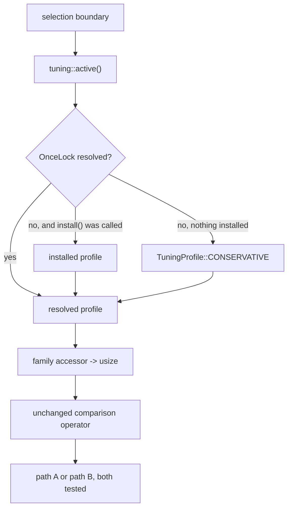

# Design: versioned tuning-profile format and selection integration (220cab0b)

This is the `tuning-profile-format` contract of the epic
[plan](../6dc81018-field-capability-dispatch/plan.md). It fixes the profile
schema, the version rule, the committed storage location, the loader API in
`gf2-core`, the conservative-default and unknown-host policy, and the
calibration workflow. It decides over the pilot families designated by the
[classification](../6dc81018-field-capability-dispatch/classification.md) §4.1.

Every code citation below is re-derived by reading the tree at worktree anchor
`05bc9c1423edeacc2048ed51ddfb9d7e208ea704`. The classification's own citations
were taken at anchor `2f2cbb37`; the pilot-family line numbers agree at both
anchors.

## 1. Problem statement

Selection between behaviourally equivalent execution paths is compiled into
`gf2-core` as source constants. `select_backend_for_size` decides scalar
against SIMD from `_SIMD_THRESHOLD`, a function-local constant at
`crates/gf2-core/src/kernels/backend.rs:96`. The four polynomial crossovers are
crate-public constants at `crates/gf2-core/src/field/poly.rs:2147`, `:2192`,
`:2711`, and `:2909`. A host whose cache hierarchy or vector width moves a
crossover has no way to say so short of editing and rebuilding the library.

The classification marks all five values profile-scoped and assigns them to two
pilot families (§4.1). It also fixes what a profile may not do: a profile entry
selects among paths that already carry a tested fallback and never removes one
(classification §2.4, closing paragraph).

Three properties constrain any solution.

- **No new crate dependency edges.** `gf2-core` has one non-optional workspace
  dependency, `gf2-kernels-simd` at `crates/gf2-core/Cargo.toml:19`. The
  `dispatch-authority` contract forbids adding edges, and
  `@/inv/crate-dependency-direction` forbids reverse ones.
- **Default behaviour identical by construction.** The pilot cutover issues
  carry that phrase as their outcome. Existing selection tests assert the
  crossover values literally — `crates/gf2-core/tests/backend_selection.rs:11`,
  `:19`, `:35` and the unit tests at
  `crates/gf2-core/src/kernels/backend.rs:220-258` — so the default resolution
  must reproduce today's decisions without a tolerance argument.
- **Calibration is never a build side effect.** `gf2-core` declares no build
  script; its manifest runs from package metadata at
  `crates/gf2-core/Cargo.toml:1` straight to `[dependencies]` at `:15`. Nothing
  may reintroduce one, and no library code path may read the environment: the
  crate's only `std::env::var` call today is the `GF2_BENCH` gate inside a test,
  at `crates/gf2-core/src/field/ple.rs:3307`.

## 2. Design

### 2.1 Artifact and schema

A tuning profile is one JSON document with four top-level members.

```json
{
  "schema_version": 1,
  "profile_id": "conservative",
  "provenance": { "kind": "inherited" },
  "selectors": {
    "bit_backend": {
      "simd_min_words": 8
    },
    "polynomial": {
      "karatsuba_min_degree": 32,
      "karatsuba_max_out_len": 128,
      "div_rem_fast_min_len": 2048,
      "subproduct_min_len": 4096
    }
  }
}
```

`selectors` holds one object per selector family. Each family object holds
threshold fields, and every threshold field name carries the comparison
operator as a suffix:

| Suffix | Predicate | Meaning |
|---|---|---|
| `_min_*` | measured quantity $\ge t$ | the named path is selected at or above $t$ |
| `_max_*` | measured quantity $\le t$ | the named path is selected at or below $t$ |

The suffix is load-bearing. Each pilot cutover is then a substitution of the
constant by the profile accessor with the comparison operator untouched, which
is what makes "identical by construction" checkable by reading the diff rather
than by running a benchmark.

Every threshold is a `usize`. Both endpoints of the `usize` range are
admissible and meaningful: for a `_min_` field, $t = \texttt{usize::MAX}$
disables the named path, and the repository already uses that sentinel for
exactly this purpose at `crates/gf2-core/src/field/charpoly.rs:276`
(`KG_DISPATCH_MIN_N`, classification §4.2). For a `_max_` field, $t = 0$
disables the named path.

The loader validates each field against a per-field admissible range before
constructing the profile:

| Field | Admissible range | Reason for the bound |
|---|---|---|
| `bit_backend.simd_min_words` | $0 \le t$ | $t = 0$ means "SIMD whenever the feature is compiled in", a legitimate tuning point. |
| `polynomial.karatsuba_min_degree` | $1 \le t$ | The schoolbook arm is the tested base case for degenerate operands; `mul_karatsuba_raw` states the caller's non-empty guarantee as a `debug_assert!` at `crates/gf2-core/src/field/poly.rs:2532`. |
| `polynomial.karatsuba_max_out_len` | $0 \le t$ | $t = 0$ routes every product to the NTT arm, which `mul_fast` already reaches for large inputs at `crates/gf2-core/src/field/poly.rs:2874`. |
| `polynomial.div_rem_fast_min_len` | $1 \le t$ | Same base-case reason as `karatsuba_min_degree`; the schoolbook arm is `div_rem`. |
| `polynomial.subproduct_min_len` | $1 \le t$ | The naive Horner arm is the base case both entry points fall back to. |

Validation rejects the whole document, never a single field. A partially
applied profile would put the process in a selection state that no receipt
describes, which `claims-trace-to-artifacts` does not admit.

Unknown keys are rejected, not ignored. `serde`'s `deny_unknown_fields` gives
this for free, and it is the behaviour the extensibility rule in §5 depends on:
a profile written against a later field set must fail loudly on an older
loader rather than silently drop the field and select a path the operator did
not ask for.

### 2.2 Version field semantics

`schema_version` is a monotone `u32`, not a semantic version. The loader
implements a reader for exactly one value, `SchemaVersion::SUPPORTED`, and
rejects every other value with `ProfileError::UnsupportedSchemaVersion`.
Accepting a range would be compatibility code, which `@/inv/canonical-cutover`
admits only inside a named, versioned migration boundary with a tracked removal
condition. A future bump is therefore a deliberate migration issue, not a
loader branch added in passing.

Three change classes, with the rule for each:

1. **Adding a selector field or a whole selector family.** No version bump. An
   absent family object or an absent field resolves to the conservative
   default for that field (§2.5). This is the mechanism §5 relies on to admit
   the classification's §4.2 follow-on families without invalidating committed
   profiles.
2. **Changing the meaning, unit, comparison operator, or type of an existing
   field, or removing a field.** Bump `schema_version`. Every committed profile
   is regenerated by re-running calibration; a stale profile fails to load
   rather than being reinterpreted.
3. **Changing a *value* in the committed conservative default.** Not a schema
   change. It is a performance claim and needs its own benchmark receipt under
   `@/inv/benchmark-backed-performance`.

### 2.3 Committed storage location

Profiles live at `crates/gf2-core/data/tuning-profiles/`, one JSON file per
profile, named `<profile_id>.json`.

Inside the crate directory, because a profile is production data the library
resolves, and Cargo packages the crate directory. The `data/` subdirectory name
follows the existing repository convention for committed per-crate data files,
of which `crates/gf2-coding/data/dvb_t2_tr102831_reference.toml` is the extant
instance.

Two files are committed by this epic:

- `conservative.json` — the projection of the compiled-in default table (§2.5).
- One file per calibrated host, added by the calibration workflow (§2.7),
  each accompanied by a receipt under `dev/benchmarks/`.

The library never scans the directory and never auto-selects among its
contents. Directory membership is a repository fact for operators and receipts;
selection is always an explicit `install` call (§2.4).

### 2.4 Loader API in `gf2-core`

A new module `crates/gf2-core/src/tuning/`, declared alongside the existing
`pub mod kernels;` at `crates/gf2-core/src/lib.rs:51`.

```rust
pub struct TuningProfile { /* private fields */ }

pub struct BitBackendSelectors { /* private fields */ }
pub struct PolynomialSelectors { /* private fields */ }

impl TuningProfile {
    /// Compiled-in conservative table; no allocation, no parser, no I/O.
    pub const CONSERVATIVE: TuningProfile;

    pub fn schema_version(&self) -> SchemaVersion;
    pub fn id(&self) -> &ProfileId;
    pub fn provenance(&self) -> &Provenance;
    pub fn bit_backend(&self) -> &BitBackendSelectors;
    pub fn polynomial(&self) -> &PolynomialSelectors;
}

impl BitBackendSelectors {
    pub fn simd_min_words(&self) -> usize;
}

impl PolynomialSelectors {
    pub fn karatsuba_min_degree(&self) -> usize;
    pub fn karatsuba_max_out_len(&self) -> usize;
    pub fn div_rem_fast_min_len(&self) -> usize;
    pub fn subproduct_min_len(&self) -> usize;
}

/// The profile every selection boundary reads. Resolves once.
pub fn active() -> &'static TuningProfile;

/// Installs `profile` as the active one. Fails if `active()` already resolved.
pub fn install(profile: TuningProfile) -> Result<(), AlreadyResolved>;

#[cfg(feature = "tuning-profile")]
impl TuningProfile {
    pub fn from_json(text: &str) -> Result<TuningProfile, ProfileError>;
    pub fn to_json(&self) -> String;
}
```

Fields are private and the only constructors are `CONSERVATIVE`, `from_json`,
and one validating constructor for the calibration harness. A `TuningProfile`
value therefore always satisfies §2.1's ranges, and no consumer needs to
re-validate.

`active()` is backed by a `OnceLock<TuningProfile>` that resolves to
`CONSERVATIVE` when nothing was installed. This is deliberately the same
one-shot discipline the crate already uses for kernel dispatch, where each
family is an `OnceLock<Option<_>>` resolved through an accessor —
`crates/gf2-core/src/lib.rs:100-115` for the tables and `:118`, `:145`, `:367`
for representative accessors. Selection authority stays in one place per
family, and it cannot change under a running computation, which is what
`@/inv/deterministic-seeded-execution` needs from a selection input.

`install` returns `Err(AlreadyResolved)` once `active()` has been read. A
caller that wants a calibrated profile installs it before doing work; a caller
that does not gets the conservative table. No library code path reads the
environment or the filesystem to find a profile: `from_json` takes text the
caller supplies, and the caller decides where that text came from. That keeps
the crate's production env-read count at zero.

Semantic types, per `@/inv/semantic-types`. `SchemaVersion` wraps the `u32` and
owns the `SUPPORTED` constant. `ProfileId` wraps a validated non-empty
kebab-case token and is the file's basename. `GitRevision` and `Sha256` wrap
their fixed-length hex forms. `Provenance` is a tagged enum, so the `kind`
vocabulary has no raw-string form above the parse boundary. `ProfileError` is
an enum with `UnsupportedSchemaVersion { found, supported }`,
`SelectorOutOfRange { family, field, value }`, and `Malformed`, never a string
message. Opaque descriptive fields — `cpu_model`, `os_kernel`, `governor`,
`toolchain` — stay `String`: they are free text with no closed vocabulary.

Feature gating. `from_json`/`to_json` sit behind a new `tuning-profile`
feature defined as `tuning-profile = ["dep:serde", "dep:serde_json"]`. Both
dependencies are already declared optional at `crates/gf2-core/Cargo.toml:23`
and `:24`, so this adds a feature name and no dependency. The feature is
**not** in `default` (`crates/gf2-core/Cargo.toml:41`), which keeps the default
build parser-free and makes the "no parser on the default path" property hold
without argument. `cargo build --workspace --all-features` (AGENTS.md:19-20)
covers the gated code.



### 2.5 Conservative default table

`CONSERVATIVE` carries exactly today's values, and it defines each one **by
referring to the existing in-source constant** rather than restating the
literal. There is then one definition site per value, which is what
`@/inv/single-source-prose` requires of a fact with a single source of truth.

| Family | Field | Value | Defining constant |
|---|---|---|---|
| `bit_backend` | `simd_min_words` | 8 | `SIMD_MIN_WORDS_DEFAULT`, hoisted in `crates/gf2-core/src/kernels/backend.rs` from `_SIMD_THRESHOLD` at `:96` |
| `polynomial` | `karatsuba_min_degree` | 32 | `KARATSUBA_THRESHOLD`, `crates/gf2-core/src/field/poly.rs:2147` |
| `polynomial` | `karatsuba_max_out_len` | 128 | `NTT_THRESHOLD`, `crates/gf2-core/src/field/poly.rs:2711` |
| `polynomial` | `div_rem_fast_min_len` | 2048 | `DIV_REM_THRESHOLD`, `crates/gf2-core/src/field/poly.rs:2909` |
| `polynomial` | `subproduct_min_len` | 4096 | `SUBPRODUCT_THRESHOLD`, `crates/gf2-core/src/field/poly.rs:2192` |

A default's definition site is the selector's own module, and its visibility is
the narrowest that lets `crate::tuning` name it. `CONSERVATIVE` is a `const` in
`crate::tuning`, which is not a descendant of any selector module, so an item
private to a selector module is out of scope for it. The visibility of each
default is therefore part of this design rather than an implementation detail.

The four `poly.rs` constants stay `pub` and keep their names, so they need no
visibility change. The module's own dispatch and complexity tables link them
throughout `crates/gf2-core/src/field/poly.rs:63-412`, and tests size operands
relative to them at `:4433`, `:4555`, `:4629`, and `:4936`. Their role is
default-value definition, so their rustdoc is rewritten in the poly cutover to
say so and to name the profile field that holds the live value — the stale-text
sweep AGENTS.md requires of a change that invalidates a doc comment.

The bit-backend constant needs both a hoist and a visibility widening.
`_SIMD_THRESHOLD` is declared inside the body of `select_backend_for_size` at
`crates/gf2-core/src/kernels/backend.rs:96`, so today it is nameable only
within that function. It becomes a module-level
`pub(crate) const SIMD_MIN_WORDS_DEFAULT: usize` in the same file, which
`CONSERVATIVE` names as `crate::kernels::backend::SIMD_MIN_WORDS_DEFAULT`.
`pub(crate)` is the narrowest visibility that makes that path resolve; `pub`
would add public API with no external consumer, since the constant is
function-local today and nothing outside the crate can name it. The rename
drops the leading underscore, which marks an item that may go unused and is
accurate only while the constant is read solely inside the
`#[cfg(feature = "simd")]` arm at `:98-99`; once `CONSERVATIVE` names it
unconditionally the marker is wrong. The new name matches the profile field
`simd_min_words`.

`conservative.json` is a projection of `CONSERVATIVE`, not a second source. A
test under the `tuning-profile` feature asserts
`TuningProfile::from_json(<file text>) == TuningProfile::CONSERVATIVE`, which
fails the moment the two drift.

Tests that size inputs from a threshold constant stay correct because tests
install nothing and therefore run on `CONSERVATIVE`. A test that does install a
profile derives its operand sizes from the installed profile's accessors, never
from the constants.

### 2.6 Unknown-host fallback policy

The library holds no host-identity logic and performs no host matching. CPU
feature detection lives in `gf2-kernels-simd` and reaches `gf2-core` only as
the `Option<FnTable>` each accessor caches
(`crates/gf2-core/src/lib.rs:118-119`, `:145-148`, `:367-370`). The profile
does not duplicate that mechanism.

Four cases, with the policy for each:

| Case | Policy |
|---|---|
| Nothing installed | `active()` resolves to `CONSERVATIVE`. This is every host by default, so an unknown host is the ordinary case, not an error path. |
| Installed profile whose `provenance.host` differs from the running host | Accepted and used. The library does not compare hosts; the profile's provenance records which host produced it so a receipt can state what was active. Host suitability is the operator's decision. |
| Profile text malformed, or `schema_version` unsupported | `from_json` returns `Err`; nothing is installed; `active()` stays `CONSERVATIVE`. No panic. |
| Profile parses but a selector is out of range | Whole document rejected with `SelectorOutOfRange`; nothing is installed. No clamping, no partial application. |

A profile that sets `bit_backend.simd_min_words` on a build without the `simd`
feature is inert rather than an error: `SelectedBackend::Simd` exists only
under `#[cfg(feature = "simd")]` at `crates/gf2-core/src/kernels/backend.rs:67`,
so the scalar arm is the only reachable one. That is the documented
`@/inv/accelerator-safe-fallback` behaviour, and the loader does not reject the
field.

### 2.7 Calibration workflow and provenance fields

Calibration is one explicit benchmark action: a new bench target
`crates/gf2-core/benches/tuning_calibration.rs`, declared in
`crates/gf2-core/Cargo.toml` with `harness = false` — the shape every existing
`gf2-core` bench target uses, for example `crates/gf2-core/Cargo.toml:59-61` —
and `required-features = ["tuning-profile"]`, following the precedent at
`crates/gf2-algebra/Cargo.toml:56-57`. Without the parser feature the target
cannot emit a profile, so the requirement is real rather than defensive.

Invocation, on a prepared uncontended host, under the repository's lock
wrapper:

```sh
GF2_BENCH=1 ./dev/scripts/ccx1-bench-flock.sh \
  cargo bench -p gf2-core --features tuning-profile \
  --bench tuning_calibration -- \
  --executions 5 --repetitions 5 --target-ms 250 \
  --out /tmp/<unique-absent-path>.json
```

`dev/scripts/ccx1-bench-flock.sh` holds `flock -x` on `/tmp/gf2-ccx1.lock`
(overridable by `GF2_CCX1_LOCK`) for the child's whole lifetime and pins to
CPUs 6–11 with `nice -n -5`; contention blocks, because the wrapper passes
neither `-n` nor a timeout — `dev/scripts/ccx1-bench-flock.sh:18-30`. A
benchmark whose configuration needs the full processor uses the wrapper's
`--full-host` form, which holds the same mutex without `taskset`
(`dev/scripts/ccx1-bench-flock.sh:21-27`). `GF2_BENCH=1` is the repository's
prepared-host marker per AGENTS.md:97.

Sweep and selection rule, per selector field:

1. Measure both arms of the crossover across a size grid straddling the
   conservative default, with the same operand construction on both arms.
2. Take the field's value to be the smallest grid point at which the
   asymptotic arm's median beats the other arm's by more than the measured
   noise band.
3. **On a tie, or on a non-monotone crossover, keep the conservative default.**
   The action's output is then never worse than the default by construction.
   The non-monotone sweep is recorded in the receipt rather than smoothed away,
   which is what `@/inv/falsification-preserved` requires.

Output discipline mirrors the committed-receipt convention: write to a unique
absent `/tmp` path, validate by loading the emitted text back through
`TuningProfile::from_json`, then copy byte-for-byte to
`crates/gf2-core/data/tuning-profiles/<profile_id>.json`. The receipt goes to
`dev/benchmarks/` in the same commit.

Provenance fields. `Provenance` is a tagged enum with two variants, so the
conservative table states honestly that it was never measured instead of
carrying empty measurement fields:

- `{"kind": "inherited"}` — values carried from the in-source constants.
- `{"kind": "calibrated", ...}` — the fields below, all required.

| Field | Content | Convention source |
|---|---|---|
| `measured_at` | RFC 3339 UTC instant of the timed work | receipt "Measured duration" row |
| `source_revision` | `GitRevision` the bench binary was built from | receipt "Clean source revision" row |
| `source_dirty` | `bool`; a committed profile requires `false` | receipt "Clean source revision" row |
| `harness` | repository-relative path of the bench target | receipt "Harness and checker" row |
| `harness_schema` | the harness's own schema token, `tuning-calibration-v1` | receipt "Harness and checker" row |
| `binary_sha256` | `Sha256` of the bench binary that produced the numbers | receipt "Bench binary SHA-256" row |
| `toolchain` | full `rustc -V` string | receipt "Toolchain" row |
| `host` | host name | receipt "Host" row |
| `cpu_model` | CPU model string | receipt "Host" row |
| `cpu_features` | runtime-observed feature tokens gating the kernels | receipt "Host" row |
| `os_kernel` | `uname` string | receipt "OS/kernel and governor" row |
| `governor` | CPU frequency governor | receipt "OS/kernel and governor" row |
| `lock_wrapper`, `lock_file`, `cpu_affinity` | the wrapper path, mutex path, and pinned CPU set actually used | receipt "Lock and affinity" row |
| `executions`, `repetitions`, `target_ms` | the timing protocol constants | receipt "Timed work" row |
| `receipt` | repository-relative path of the committed receipt | `@/inv/claims-trace-to-artifacts` |

The convention source column names rows of
`dev/benchmarks/permanent_campaign/batched-f3-avx2-provenance-fixed.md:24-36`,
the repository's provenance-fixed receipt; the profile carries the same field
set as data so a reader does not have to cross-reference the prose to know what
produced a threshold. Every field is runtime-observed by the harness or a
protocol constant of the harness itself — no field is hand-written into the
tool, per `@/inv/runtime-observed-provenance`.

An illustrative calibrated record, with placeholders where a real run supplies
observed values:

```json
{
  "schema_version": 1,
  "profile_id": "example-host-avx2",
  "provenance": {
    "kind": "calibrated",
    "measured_at": "<RFC 3339 UTC>",
    "source_revision": "<40 hex>",
    "source_dirty": false,
    "harness": "crates/gf2-core/benches/tuning_calibration.rs",
    "harness_schema": "tuning-calibration-v1",
    "binary_sha256": "<64 hex>",
    "toolchain": "<rustc -V>",
    "host": "<hostname>",
    "cpu_model": "<CPU model>",
    "cpu_features": ["<observed tokens>"],
    "os_kernel": "<uname -a>",
    "governor": "<governor>",
    "lock_wrapper": "dev/scripts/ccx1-bench-flock.sh",
    "lock_file": "/tmp/gf2-ccx1.lock",
    "cpu_affinity": "6-11",
    "executions": 5,
    "repetitions": 5,
    "target_ms": 250,
    "receipt": "dev/benchmarks/tuning_profiles/<date>-<profile_id>.md"
  },
  "selectors": {
    "bit_backend": { "simd_min_words": 8 },
    "polynomial": {
      "karatsuba_min_degree": 32,
      "karatsuba_max_out_len": 128,
      "div_rem_fast_min_len": 2048,
      "subproduct_min_len": 4096
    }
  }
}
```

A test globs `crates/gf2-core/data/tuning-profiles/` at run time and asserts
every file loads and validates, so a committed profile cannot rot silently. The
glob is deliberate: a hand-maintained file list inside the test would be the
staleness defect `@/inv/runtime-observed-provenance` names.

## 3. Key decisions

### D1 — Serialization and placement

Four options were weighed. The dimensions that separate them are whether the
default path needs a parser, whether calibration can take effect without a
rebuild, and what the crate's dependency set becomes.

| Option | Format and placement | Dependency cost | Default path | Calibration without rebuild |
|---|---|---|---|---|
| A | TOML under `crates/gf2-core/data/tuning-profiles/`, runtime-parsed | new `toml` dependency on `gf2-core` | needs parser unless a second default mechanism is added | yes |
| **B (recommended)** | JSON under `crates/gf2-core/data/tuning-profiles/`, runtime-parsed behind a feature; default table a compiled-in `const` | none — `serde` and `serde_json` are already declared optional at `crates/gf2-core/Cargo.toml:23-24` | no parser, no allocation, no I/O | yes |
| C | Committed file embedded by `include_str!` plus a build script generating a `const` table | none | no parser | **no** — a new profile requires a rebuild |
| D | Same format as B, stored under `dev/reference_data/tuning-profiles/` | none | no parser | yes, in-repo only |

**A (TOML)** is attractive on reviewability: TOML diffs read well and the
repository already commits a TOML data file at
`crates/gf2-coding/data/dvb_t2_tr102831_reference.toml`, with `gf2-coding`
carrying `toml = "0.8"` at `crates/gf2-coding/Cargo.toml:21`. It is rejected on
dependency cost. `gf2-core` is the inward-most layer; its entire non-optional
dependency set today is one path dependency at `crates/gf2-core/Cargo.toml:19`.
Adding `toml` to obtain a format whose only advantage over JSON is comment
support is a poor trade, and comments are the wrong home for provenance anyway
— §2.7 makes provenance machine-checkable data fields, which a comment header
cannot be.

**C (build-time embedding)** gives the cheapest possible runtime, since the
table becomes a `const`. It is rejected on the plan's own constraint. The
`dispatch-authority` contract states that calibration is an explicit benchmark
action and never a build side effect; a build script that reads a profile makes
the profile a build input, so installing a freshly calibrated profile means
rebuilding the library and invalidating the very binary the calibration
measured. It also introduces a build script into a crate that has none
(`crates/gf2-core/Cargo.toml:1`).

**D (storage under `dev/`)** is rejected on packaging and on area semantics.
`dev/` is outside the crate directory, so a consumer of the packaged crate
receives no profile and no example. `dev/reference_data` is also a
`permanent_paths` area in `.jit/config.toml:164`, which fits committed host
receipts and does not fit production data the library resolves.

**B is recommended.** It adds no dependency: the feature `tuning-profile`
switches on `serde` and `serde_json`, both already optional members of the
manifest, and the `io` feature at `crates/gf2-core/Cargo.toml:53` already
enables the same pair, so the dependency graph is unchanged in every feature
configuration. It keeps the default path free of parsing entirely, because the
conservative table is a compiled-in `const` rather than a parsed document,
which is what lets a `--no-default-features` build select correctly. And it
keeps calibration a pure runtime action: a new profile is a file plus an
`install` call, with no rebuild.

The residual cost of B is that JSON carries no comments. §2.7 answers it by
making every provenance item a required field, which is stronger than a comment
because the loader can check it.

### D2 — Resolution is install-based, not ambient

`active()` resolves to `CONSERVATIVE` unless a caller installs a profile. The
rejected alternative is an ambient lookup — an env var such as
`GF2_TUNING_PROFILE=<path>` read inside `active()`. Ambient lookup is
convenient for benchmarking and wrong for a library: it makes the selected
execution path depend on the shell that launched the process, so two runs of
the same pinned benchmark can silently take different paths and a receipt
cannot state which. It would also give `gf2-core` its first production
environment read; today the crate's only `std::env::var` call is inside a test
at `crates/gf2-core/src/field/ple.rs:3307`. Harnesses and binaries that want
env-driven selection read the variable themselves and call `install`.

### D3 — Each default is defined at its selector's own module

Two alternatives were rejected.

**Making the four `poly.rs` constants private** and exposing the defaults only
through the profile type breaks the public API for no behavioural gain, and
churns the rustdoc links across `crates/gf2-core/src/field/poly.rs:63-412` that
resolve to them.

**Moving the bit-backend default into `crate::tuning`** avoids widening any
visibility, since `CONSERVATIVE` would then hold the literal directly. It is
rejected because it splits the rule: the polynomial defaults must stay at their
family site, so a bit-backend default living in `crate::tuning` would give two
conventions for where a default is defined, and a reader of
`select_backend_for_size` would find no statement of its default in the file
that implements it. `pub(crate)` on a hoisted constant costs one visibility
keyword and keeps one convention.

Keeping each default at its selector's module, named exactly once by
`CONSERVATIVE`, gives one definition per value and satisfies
`@/inv/convention-convergence`: the constant is the default's single definition
site, and the profile accessor is the single selection authority.

## 4. Integration points

One subsection per pilot family, as designated by classification §4.1.

### 4.1 Bit-backend family

The classification's pilot bit-backend constant is `_SIMD_THRESHOLD` = 8 at
`crates/gf2-core/src/kernels/backend.rs:96`.

| Item | Location |
|---|---|
| Selection boundary | `select_backend_for_size`, `crates/gf2-core/src/kernels/backend.rs:95` |
| Constant it replaces | `_SIMD_THRESHOLD`, `crates/gf2-core/src/kernels/backend.rs:96` |
| Profile field | `bit_backend.simd_min_words` |
| Comparison to preserve | `_size >= threshold`, `crates/gf2-core/src/kernels/backend.rs:99` |

The constant is not deleted: §2.5 hoists it out of the function body to a
module-level `pub(crate) const SIMD_MIN_WORDS_DEFAULT`, where it defines the
conservative default and nothing else. That hoist lands in step 1 of §6, before
this cutover, so this issue changes only the comparison's right-hand side.

The profile read goes **inside** the `#[cfg(feature = "simd")]` arm at
`crates/gf2-core/src/kernels/backend.rs:98`, so a build without the `simd`
feature keeps its current code exactly and the `_size` parameter stays unused
there. The five call sites are untouched:
`crates/gf2-core/src/kernels/ops.rs:58`, `:126`, `:163`, `:185`, and `:207`.
The re-export at `crates/gf2-core/src/kernels/mod.rs:33` is unchanged.

Evidence that default behaviour is unchanged: the existing assertions at
`crates/gf2-core/tests/backend_selection.rs:11`, `:19`, `:35` and
`crates/gf2-core/src/kernels/backend.rs:220-258` pass without modification.

The deprecated `select_kernel()` at `crates/gf2-core/src/kernels/mod.rs:83` is
**not** a profile consumer. It returns the scalar backend unconditionally and
its removal is the separate cutover the classification records in §5.

#### Amendment — issue `c42720ce` (2026-08-20)

The post-cutover receipt's Falsification record reports that resolving
`bit_backend.simd_min_words` through `tuning::active()` adds 0.337867 ns/call
at `bit_backend/popcount/words=1` and 0.224830 ns/call at
`bit_backend/popcount/words=8`; both exceed the predeclared 5% cell tolerance.
See [`2026-08-20-post-cutover-receipt.md`](../../benchmarks/tuning_profiles/2026-08-20-post-cutover-receipt.md).

Issue `c42720ce` reduces that hot-path cost by publishing the active profile's
`simd_min_words` into an `AtomicUsize` threshold beside an `AtomicBool`
resolved flag. The threshold is seeded with `SIMD_MIN_WORDS_DEFAULT` = 8 as a
placeholder; no threshold value is reserved, so `usize::MAX` remains
admissible as specified by §2.1. The cold resolution path stores the resolved
threshold with `Ordering::Relaxed` and then publishes the flag with
`Ordering::Release`; `install` performs the same ordered publication only
after `ACTIVE.set` succeeds. `active_simd_min_words` reads the flag with
`Ordering::Acquire`, takes the `#[cold]` `#[inline(never)]` resolution path
when it is false, and otherwise loads the threshold with `Ordering::Relaxed`.
The cold path leaves the process in the resolved state, so it stops being
taken once any selection has completed. It is not mutually excluded: two
threads whose first selections race can both observe the flag unset and both
enter it. That is harmless and needs no lock, because `active()` resolves the
profile exactly once through its own `OnceLock` and every caller therefore
publishes the same threshold, so the cold path is idempotent rather than
one-shot. The steady-state selection boundary remains one load, a predicted
branch, and one load, including the calibrated value 4.

### 4.2 Polynomial-crossover family

Four constants, six read sites — `SUBPRODUCT_THRESHOLD` is read at two entry
points, and both must move together or the two entry points disagree about the
crossover.

| Constant (definition) | Read site | Enclosing function | Profile field | Comparison to preserve |
|---|---|---|---|---|
| `KARATSUBA_THRESHOLD`, `poly.rs:2147` | `poly.rs:2636` | `mul_impl`, `poly.rs:2629` | `polynomial.karatsuba_min_degree` | `deg_lhs < t \|\| deg_rhs < t` → schoolbook |
| `KARATSUBA_THRESHOLD`, `poly.rs:2147` | `poly.rs:2537` | `mul_karatsuba_raw`, `poly.rs:2531` | same | same |
| `NTT_THRESHOLD`, `poly.rs:2711` | `poly.rs:2874` | `mul_fast`, `poly.rs:2869` | `polynomial.karatsuba_max_out_len` | `out_len <= t` → Karatsuba |
| `DIV_REM_THRESHOLD`, `poly.rs:2909` | `poly.rs:3210` | `div_rem_auto`, `poly.rs:3209` | `polynomial.div_rem_fast_min_len` | `self.len < t \|\| divisor.len < t` → schoolbook |
| `SUBPRODUCT_THRESHOLD`, `poly.rs:2192` | `poly.rs:1402` | `batch_evaluate`, `poly.rs:1381` | `polynomial.subproduct_min_len` | `points.len < t \|\| coeffs.len < t` → Horner |
| `SUBPRODUCT_THRESHOLD`, `poly.rs:2192` | `poly.rs:3259` | `batch_evaluate_auto`, `poly.rs:3254` | same | same |

All paths are relative to `crates/gf2-core/src/field/poly.rs`.

**The Karatsuba recursion resolves the threshold once.** `mul_karatsuba_raw` is
recursive — it calls itself at `crates/gf2-core/src/field/poly.rs:2568`,
`:2574`, and `:2582` — so reading `tuning::active()` at its guard would put an
atomic load and a branch on every node of the recursion tree. `mul_impl`
(`:2629`) resolves the threshold once and passes it to `mul_karatsuba_raw`
(`:2531`) as a parameter, and the three self-calls forward that parameter. The
call from `mul_impl` at `:2640` supplies it. The other four sites are
non-recursive gates and read `active()` directly.

### 4.3 Families explicitly out of this design's scope

The classification's §4.2 constants are profile-scoped follow-on work and are
admitted later under §5's rule. The §4.3 constants —
`WINOGRAD_THRESHOLD` (`crates/gf2-core/src/field/traits.rs:825`),
`TRI_BASE_THRESHOLD` (`:858`), `PLE_BASE_COLS` (`:892`), and `PLE_PANEL_COLS`
(`:926`) — are excluded, and §5 keeps them inadmissible until their recorded
Lean extraction-surface hazard is resolved. §4.4 constants are never
admissible: they are not host-tuning crossovers.

## 5. Extensibility rule

A further selector family is admitted to the schema when all five conditions
hold.

1. **The classification marks its constants profile-scoped.** §4.1 and §4.2 are
   admissible. §4.3 stays inadmissible until the trait-associated thresholds
   are either re-derived through the proof surface or read through a
   non-extracted seam, which classification §4.3 records as separate work.
   §4.4 is never admissible.
2. **The family arrives as a new object under `selectors`, with a new
   sub-struct and accessor on `TuningProfile`.** An absent object resolves to
   that family's conservative defaults, so `schema_version` does not move
   (§2.2 rule 1) and every already-committed profile keeps loading.
3. **Every new field carries a `_min_`/`_max_` operator suffix and a documented
   admissible range** (§2.1), so its cutover stays a substitution with the
   comparison operator untouched.
4. **Every new default is defined by naming the existing in-source constant**,
   never by restating its literal, at that constant's own module and with the
   narrowest visibility that lets `crate::tuning` name it — `pub(crate)` for a
   crate-internal constant, unchanged for one already `pub` for independent
   reasons (§2.5).
5. **The calibration sweep is extended before any committed profile claims the
   new field.** Until the sweep covers it, a committed profile omits the field
   and inherits the default; a profile that carries an uncalibrated value is a
   `@/inv/benchmark-backed-performance` defect.

A change that instead alters an existing field's meaning, unit, operator, or
type, or removes one, is not an extension: it is §2.2 rule 2, a
`schema_version` bump handled as a named migration.

## 6. Implementation steps

Ordered so each downstream issue starts from decided ground. The ordering
matches the epic plan's dependency graph.

1. **`f35daec0` — profile type, loader, conservative defaults.** Add
   `crates/gf2-core/src/tuning/` with the types and API of §2.4, the semantic
   types, the §2.1 validation, and `CONSERVATIVE` defined by naming the
   constants of §2.5. This includes hoisting `_SIMD_THRESHOLD` out of the body
   of `select_backend_for_size` to a module-level
   `pub(crate) const SIMD_MIN_WORDS_DEFAULT` in
   `crates/gf2-core/src/kernels/backend.rs`, so `CONSERVATIVE` can name it;
   `select_backend_for_size` reads the hoisted constant and its selection
   behaviour is unchanged by this step. Add the `tuning-profile` feature. Commit
   `crates/gf2-core/data/tuning-profiles/conservative.json` and the
   round-trip test that ties it to `CONSERVATIVE`, plus the directory-glob
   validation test. **No selector site changes in this issue** — the crate's
   selection behaviour is bit-identical after it.
2. **`5ecc9bf8` — calibration action.** Add
   `crates/gf2-core/benches/tuning_calibration.rs` with
   `harness = false` and `required-features = ["tuning-profile"]`, the §2.7
   sweep and tie rule, the full provenance record, and the
   `/tmp`-then-validate-then-copy output discipline. Document the
   lock-wrapper invocation in the target's own module docs.
3. **`e8fe47f5` — pinned non-regression set and tolerance.** The pinned cells
   must cover both pilot families at sizes that straddle each conservative
   default, and must include a **small-buffer** bit-logical cell (buffer under
   `simd_min_words` words) so the added `OnceLock` read on the cheapest
   operation is inside the measured set rather than outside it. Predeclare the
   tolerance before any cutover measurement.
4. **`278acf3a` — pre-cutover baseline receipt.** Execute the pinned procedure
   unmodified, after step 1 and before steps 5 and 6.
5. **`0d819b62` — bit-backend cutover.** §4.1: substitute inside the
   `#[cfg(feature = "simd")]` arm; leave the five `ops.rs` call sites and both
   existing test files untouched.
6. **`697fc55b` — polynomial cutover.** §4.2: all six read sites, with the
   threshold hoisted out of the Karatsuba recursion into a parameter. Rewrite
   the four constants' rustdoc to state their default-definition role and name
   the profile field, and sweep the module-level tables at
   `crates/gf2-core/src/field/poly.rs:63-412` for text that names a constant as
   the selection authority.
7. **`50b47eae` — post-cutover receipt.** Re-run the pinned procedure and
   compare against step 4 within the predeclared tolerance.

## 7. Success criteria

- [hard] REQ-01: A design document specifies the profile schema, versioning
  rule, committed storage location, and loader API, weighing at least two
  serialization/placement options before the recommendation.
- [hard] REQ-02: The document names the integration point for each pilot
  selector family designated by the classification, the conservative default
  and unknown-host fallback policy, and the explicit calibration workflow with
  its provenance fields.

## 8. Risks and open questions

| Risk | Assessment and mitigation |
|---|---|
| The `OnceLock` read adds an atomic load plus a branch to the cheapest bit-logical operations, where the operation itself is a handful of instructions. | The Karatsuba recursion is the acute case and §4.2 removes it by hoisting. For the bit backend the read is once per bulk operation at `crates/gf2-core/src/kernels/ops.rs:58` and friends, not once per word, but the small-buffer case is thin. Step 3 puts a small-buffer cell in the pinned set so the cost is bounded by measurement rather than by argument. |
| `install` racing the first `active()` read inside a parallel test binary makes an install-based test order-dependent. | Any test that installs a profile is `#[serial]`. The crate already carries `serial_test = "3"` as a dev-dependency and uses it for order-sensitive counter tests at `crates/gf2-core/src/field/inverse.rs:719`, `field/triangular.rs:2530`, and `field/ple.rs:1901`. |
| A committed calibrated profile becomes stale when a kernel changes and its crossover moves, while the file keeps claiming a measured value. | `@/inv/behavioral-evidence-validity` scopes this: the profile is invalidated by a change to measurement behaviour or to the measured kernel, not by documentation churn. The `harness_schema` token and `binary_sha256` field make the producing tool's identity explicit, so a re-run is distinguishable from a re-read. Recalibration is an explicit action, and until it runs the operator can install nothing and get `CONSERVATIVE`. |
| A follow-on family lands its schema fields but its cutover slips, leaving a field nothing reads. | §5 condition 5 forbids a committed profile carrying an uncalibrated field, and condition 2 makes an absent field resolve to the default, so an unread field is inert. Field and cutover land in the same issue. |

Open questions for the epic lead:

1. **Two read sites for one pilot constant.** Classification §4.1 lists
   `SUBPRODUCT_THRESHOLD` once, but it gates two public entry points —
   `batch_evaluate` at `crates/gf2-core/src/field/poly.rs:1402` and
   `batch_evaluate_auto` at `:3259`. §4.2 above covers both. Confirm the
   polynomial cutover issue `697fc55b` is scoped to both, since cutting one
   would leave the two entry points selecting on different authorities.
2. **Profiles for more than one host.** This design commits one file per
   calibrated host and has the library auto-select none of them. If the epic
   wants a default calibrated profile for the project's own benchmark host,
   that is a policy decision about which host is canonical, and it belongs to
   the lead rather than to this design.
