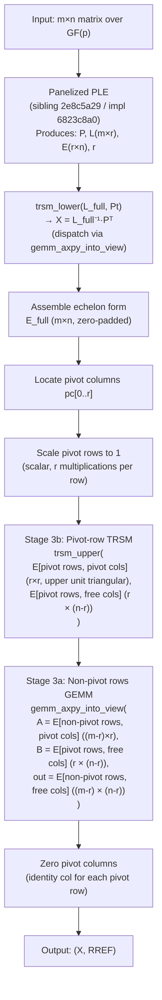

# Design: Blocked GF(p) Echelon / RREF Kernel

**Issue:** `24a93e4e`  
**Type:** design  
**Epic:** `026fc832` (panelized dense-LA push, Phase 6)  
**Date:** 2026-05-25

---

## 1. Problem Statement

### Open FAIL cells (A8 rows 18-33, 72-73)

The current `FieldMatrix::rref` implementation in
`crates/gf2-core/src/field/ple.rs` + `crates/gf2-core/src/field/matrix.rs`
calls the scalar PLE (`ple_in_place_window`) then performs a column-by-column
back-substitution loop in `rref()`. It does not exploit the panelized GEMM
kernels that `fp_small_try_gemm_classical` provides for small primes.

The aggregate scorecard (`dev/bench_results/2026-05-08-2cfc4372-sota-scorecard.md`
Annex A8) records the following open FAIL cells that this design targets:

| A8 row | Operation | Field | n / regime | Ratio (gf2/ref) |
|--------|-----------|-------|------------|-----------------|
| 18 | echelon | GF(7) | 64 / uniform | 1.94× |
| 19 | echelon | GF(7) | 64 / deficient | 3.50× |
| 20 | echelon | GF(7) | 256 / uniform | 10.93× |
| 21 | echelon | GF(7) | 256 / deficient | 16.89× |
| 22 | echelon | GF(251) | 64 / uniform | 8.14× |
| 23 | echelon | GF(251) | 64 / deficient | 13.29× |
| 24 | echelon | GF(251) | 256 / uniform | 65.82× |
| 25 | echelon | GF(251) | 256 / deficient | 97.06× |
| 26 | echelon | GF(65521) | 64 / uniform | 1.57× |
| 27 | echelon | GF(65521) | 64 / deficient | 2.18× |
| 28 | echelon | GF(65521) | 256 / uniform | 8.10× |
| 29 | echelon | GF(65521) | 256 / deficient | 12.37× |
| 30 | echelon | GF(2^31-1) | 64 / uniform | 2.16× |
| 31 | echelon | GF(2^31-1) | 64 / deficient | 2.83× |
| 32 | echelon | GF(2^31-1) | 256 / deficient | 7.20× |
| 33 | echelon | GF(2^31-1) | 1024 / deficient | 7.16× |
| 72 | echelon | GF(31) | 256 / uniform | 1.92× |
| 73 | echelon | GF(31) | 256 / deficient | 2.97× |

All 18 cells are owned by epic `615db3b9` and routed to `026fc832` Phase 6.
Reference: fflas-ffpack 2.5.0, measured on AMD Ryzen 9 5900X Zen 3.

The root cause is the same for rows 18-29 and 72-73: `rref` inherits the
scalar PLE bottleneck (pivot search + row-at-a-time elimination) and the
back-substitution loop is also scalar. For rows 30-33 (GF(2^31-1) Mersenne31),
the echelon form's scalar back-substitution is the primary bottleneck since
PLE is already fast for Mersenne31 (fgemm is PASS at all n).

---

## 2. Algorithm

### 2.1 Current `rref` call chain

```
FieldMatrix::rref(&self) -> (X, R)
  -> FieldMatrix::row_echelon(&self) -> (X, E)
       -> FieldMatrix::ple(&self) -> (P, L, E, r)
            -> ple_in_place_window(...)
               [scalar pivot + Schur complement]
       -> trsm_lower(L_full, Pt)          // L^{-1} P^T
       -> build E_full (extend to m×n)
  -> scalar loop: scale pivot rows to 1, eliminate each pivot column
```

File locations:
- `crates/gf2-core/src/field/ple.rs` — `ple`, `row_echelon`, `rref`
- `crates/gf2-core/src/field/triangular.rs` — `trsm_lower`

### 2.2 Blocked echelon algorithm

The blocked echelon kernel derives directly from the panelized PLE output
(sibling design `2e8c5a29`). Once the panelized PLE lands in wave 7a as
issue `6823c8a0`, the echelon and RREF kernels reuse its L and U factors
without re-running the factorisation.

The algorithm has three stages:

**Stage 1 — Panelized PLE.** Call the panelized `FieldMatrix::ple` (implemented
in `6823c8a0`) to obtain `(P, L, E, r)`. This stage is entirely owned by the
sibling design `2e8c5a29` and its implementation `6823c8a0`. The panelized PLE
uses `fp_small_try_gemm_classical` for the Schur complement update inside each
panel; no duplication of that logic is needed here.

**Stage 2 — Blocked L-inverse application (echelon form).** Apply $L^{-1}$ to
the permuted matrix to obtain the echelon form. This is currently done via
`trsm_lower` (algorithm 2.1 from Dumas-Pernet, implemented in
`crates/gf2-core/src/field/triangular.rs`). The existing `trsm_lower` already
internally calls `gemm_axpy_into_view`, which in turn dispatches to
`fp_small_try_gemm_classical` for small-prime fields. No additional blocking
is needed at this level — the existing recursive `trsm_lower` will inherit the
panelized GEMM speedup automatically once the panelized PLE replaces the scalar
PLE.

**Stage 3 — Blocked back-substitution (RREF).** The current `rref()` performs
back-substitution column-by-column in a nested scalar loop. This is the second
bottleneck. The blocked replacement splits back-substitution into two sub-stages:

**Stage 3a — Non-pivot rows GEMM (dominant cost):**

$$E[\text{non-pivot rows}, \text{free cols}] \mathrel{-}=
  E[\text{non-pivot rows}, \text{pivot cols}] \cdot
  E[\text{pivot rows}, \text{free cols}]$$

This is a GEMM of shape $(m - r) \times r$ times $r \times (n - r)$ into
$(m - r) \times (n - r)$. It is dispatched via the 40195c09-lifted
`gemm_axpy_into_view` (`crates/gf2-core/src/field/matrix.rs`, line 2854),
which — post-40195c09 lift — auto-dispatches to `fp_small_try_gemm_classical`
for small primes ($P \le 251$) and to the u16 medium-prime path for GF(65521).
See §6.3 for the prerequisite details.

**Stage 3b — Pivot rows TRSM (structurally triangular):**

After scaling pivot rows so that $E[\text{pivot rows}, \text{pivot cols}]$ is
upper unit triangular, the pivot rows' free-column entries are back-substituted
via a triangular solve:

$$\text{trsm\_upper}(E[\text{pivot rows}, \text{pivot cols}],\
  E[\text{pivot rows}, \text{free cols}])$$

This operates in-place on the pivot rows' free-column block, using
`trsm_upper` from `crates/gf2-core/src/field/triangular.rs` (line 258). The
existing `trsm_upper` internally dispatches to `gemm_axpy_into_view` for wide
stripes, so it inherits the same SIMD fast path.

The pivot columns themselves are explicitly zeroed at the end (set to the
identity column for each pivot row, zero elsewhere).

### 2.3 Mermaid pipeline diagram



**Key insight:** the blocked back-substitution splits into a pivot-row TRSM
(Stage 3b, structurally required because $E[\text{pivot}, \text{pivot}]$ is
upper unit triangular after scaling) and a non-pivot-row GEMM (Stage 3a,
the dominant cost). Stage 3a is dispatched through the 40195c09-lifted
`gemm_axpy_into_view` (`crates/gf2-core/src/field/matrix.rs` line 2854),
which — post-40195c09 lift — auto-selects the AVX2 byte-lane path for
$P \le 251$ and the u16 medium-prime path for GF(65521). See §6.3.

---

## 3. Back-Substitution Blocking Detail

### 3.1 Tile shapes

Let $m$ = rows, $n$ = cols, $r$ = rank, $r_f = n - r$ = number of free columns.

The back-substitution is split into two sub-stages with distinct operand shapes:

**Stage 3a — Non-pivot rows GEMM**

| Operand | Symbol | Shape | Description |
|---------|--------|-------|-------------|
| A | `E_nonpiv_piv` | $(m-r) \times r$ | Pivot-column values for non-pivot rows only |
| B | `E_piv_free` | $r \times r_f$ | Free-column values for pivot rows |
| out | `update` | $(m-r) \times r_f$ | Accumulated update, subtracted from `E_nonpiv_free` |

The call shape passed to `gemm_axpy_into_view` is:
- `alpha` = $-1$ (field element), `beta` = $1$
- `a` = view of `E[non-pivot rows, pivot cols]`, shape $(m-r) \times r$
- `b` = view of `E[pivot rows, free cols]`, shape $r \times r_f$
- `out` = view of `E[non-pivot rows, free cols]`, shape $(m-r) \times r_f$, updated in-place

`gemm_axpy_into_view` (defined at `crates/gf2-core/src/field/matrix.rs` line
2854) — via the 40195c09-lifted dispatch — auto-dispatches to
`fp_small_try_gemm_classical` for small primes ($P \le 251$) and to the u16
medium-prime path for GF(65521). This single call handles both prime ranges
without a separate dispatch in `try_blocked_back_sub`. See §6.3 for the
architectural prerequisite details.

**Stage 3b — Pivot rows TRSM**

After scaling pivot rows so $E[\text{pivot rows}, \text{pivot cols}]$ is upper
unit triangular, solve in-place:

| Operand | Symbol | Shape | Description |
|---------|--------|-------|-------------|
| A (triangular) | `E_piv_piv` | $r \times r$ | Upper unit triangular pivot block |
| B (RHS, modified in-place) | `E_piv_free` | $r \times r_f$ | Pivot-row free-column entries |

Call: `trsm_upper(E[pivot rows, pivot cols], E[pivot rows, free cols])` from
`crates/gf2-core/src/field/triangular.rs` line 258. This function recurses
internally and calls `gemm_axpy_into_view` for wide stripes, inheriting the
same SIMD fast path.

**Pivot column zeroing (final step):** After both stages complete, the pivot
columns are explicitly zeroed: for each pivot row $i$ and its pivot column
$pc[i]$, set $E[i, pc[i]] = 1$ and $E[k, pc[i]] = 0$ for all $k \ne i$.

### 3.2 Scalar fallback

When `gemm_axpy_into_view` falls back to scalar (non-AVX2 host, or field
outside the SIMD-supported range), Stage 3a degrades gracefully to the generic
scalar dot-product path. Stage 3b (`trsm_upper`) is always available as it is
not SIMD-gated. If neither Stage 3a nor 3b is available (e.g., a completely
unsupported field), `try_blocked_back_sub` returns `false` and the existing
scalar pivot-column loop in `rref()` handles back-substitution unchanged. No
behavioral change; only the fast path is new.

### 3.3 Medium-prime GF(65521) path

GF(65521) echelon closes A8 rows 26-29 (current 1.57×-12.37×) by inheriting
the `fp_medium` speedup through `gemm_axpy_into_view`. The current (pre-40195c09)
dispatch chain goes through `dot_product_slices`'s medium-prime u16 packed dot:

```
try_blocked_back_sub (stage 3a)
  -> gemm_axpy_into_view         // crates/gf2-core/src/field/matrix.rs line 2854
       -> dot_product_slices (per-cell)
            -> medium-prime u16 packed dot  // P in [252, 65521]
```

After 40195c09 lands, the whole-GEMM path replaces the per-cell path for all
supported primes, including GF(65521):

```
try_blocked_back_sub (stage 3a)
  -> gemm_axpy_into_view (post-40195c09 lift)
       -> fp_small_try_gemm_classical::<65521>
            -> fp_medium u16 lane  // whole-panel path, P in [252, 65521]
```

No separate u16 echelon kernel is needed. The `try_blocked_back_sub` dispatch
calls `gemm_axpy_into_view` (not directly `fp_small_try_gemm_classical`), so
the medium-prime path is auto-inherited. The per-cell medium-prime u16 dot is
available both before and after 40195c09; 40195c09 upgrades it to the
whole-panel path for better amortisation at larger $n$.

---

## 4. API Surface

### 4.1 Additive path (preferred)

The implementation adds a fast path inside `FieldMatrix::rref` guarded by a
dispatch check, keeping the existing scalar code as the fallback:

```rust
pub fn rref(&self) -> (FieldMatrix<F>, FieldMatrix<F>) {
    // ... existing early-exit for empty ...
    let (mut x, mut e) = self.row_echelon(); // <- will call panelized PLE via 6823c8a0
    // ... identify pivots ...
    // NEW: try blocked back-sub (Stage 3a via gemm_axpy_into_view, Stage 3b via trsm_upper)
    if !try_blocked_back_sub(&mut x, &mut e, &pivots) {
        // existing scalar loop (unchanged)
        // ...
    }
    (x, e)
}
```

The function `try_blocked_back_sub` is a `pub(crate)` helper in
`crates/gf2-core/src/field/ple.rs` (alongside the existing `rref` body).
It returns `false` when the GEMM fast path is unavailable (non-AVX2, or `F`
not a small/medium prime), deferring to the existing scalar path.

### 4.2 Dispatch rule

`try_blocked_back_sub` calls the 40195c09-lifted `gemm_axpy_into_view`
(`crates/gf2-core/src/field/matrix.rs` line 2854) for Stage 3a and
`trsm_upper` (`crates/gf2-core/src/field/triangular.rs` line 258) for Stage
3b. Both are safe `pub(crate)` functions that keep the unsafe SIMD boundary
inside `gf2-kernels-simd`, matching the existing invariant in `CLAUDE.md` §
Key design invariants § 3. The function does not call
`fp_small_try_gemm_classical` directly; the small-prime and medium-prime paths
are auto-inherited via the post-40195c09 `gemm_axpy_into_view` dispatch chain.
Before 40195c09 lands, only the medium-prime u16 path is available; the
small-prime byte-lane path becomes available once 40195c09 is merged. See §6.3.

### 4.3 `row_echelon` changes

`row_echelon` calls `ple()`, which after wave 7a (`6823c8a0`) will be the
panelized version. No change to `row_echelon`'s signature or return type. The
blocked echelon design is purely additive to the back-substitution step.

---

## 5. GF(2^31-1) Mersenne31 Strategy

**Status: NOT delivered by this design's blocked back-substitution under the current architecture.**

**Background on Mersenne31 storage.** GF(2^31-1) elements are stored as
canonical `u32` values in `[0, 2^31-2]`. The small-prime panelized kernel
(`fp_small_panel_gemm` in `crates/gf2-kernels-simd/src/x86/fp_small_panel.rs`)
operates on `&[u8]` slices with `p: u8` and the inner `_mm256_madd_epi16` loop
exploits the `p ≤ 251` bound. Mersenne31 cannot reuse this kernel.

**Mersenne31 has its own fast kernel.** `crates/gf2-kernels-simd/src/mersenne.rs`
provides `MersenneFns` (`m31_batch_mul_fn`, `m31_batch_mul_add_fn`,
`m31_batch_dot_fn`) dispatched via `detect()`. The Mersenne31 fgemm cells are
already PASS at all sizes. The echelon FAIL cells (rows 30-33) are attributed
to the scalar PLE output and scalar back-substitution loop.

**Why `gemm_axpy_into_view` does NOT reach `m31_batch_dot_fn`.**
`SimdVecOps::try_simd_dot_vec` — the inner dispatch used by
`gemm_axpy_into_view`'s per-cell `dot_product_slices` path — only covers
`3 <= P <= 251` (see `crates/gf2-core/src/gfp/simd_ops.rs:237-241`). The
Mersenne31 `m31_batch_dot_fn` kernel at
`crates/gf2-kernels-simd/src/mersenne.rs` is therefore not reachable via the
current `gemm_axpy_into_view` path. Task 40195c09 is explicitly out of scope
for Mersenne31 dispatch (per 40195c09's "Out of scope" section).

**Consequence for A8 rows 30-33.** Mersenne31 echelon (A8 rows 30-33) is NOT
delivered by this design's blocked back-substitution. Even after 40195c09
lands, `gemm_axpy_into_view` will not dispatch `m31_batch_dot_fn` for
GF(2^31-1), so Stage 3a will fall back to the per-cell scalar
`dot_product_slices` path. Closing rows 30-33 requires a separate
Mersenne31 path (either extending `gemm_axpy_into_view` with Mersenne31
dispatch in a follow-up task, or specialising the back-sub for
`Fp<2^31-1>`). This is documented as Risk M1 in §10.

The implementation child `869ce43b` must surface rows 30-33 as a remaining gap
and escalate for a follow-up task. Do not pre-amend the success criteria for
these rows; the gap acknowledgement here is descriptive, not a criterion change.

---

## 6. SSOT Reuse

### 6.1 Panelized PLE — sibling design `2e8c5a29`

The blocked echelon depends entirely on the panelized PLE output produced by
sibling design `2e8c5a29` ("Design panelized GF(p) PLE/LU kernel") and its
implementation child `6823c8a0`. The echelon design calls `FieldMatrix::ple()`
as a black box; all panel size choices ($MR = 4$, $NR = 24$, $KC = 256$ from
design `fc182ed5`), rank-revealing pivot strategy, and integration with
`ple_in_place_window` are owned by `2e8c5a29`. This design does not re-specify
PLE internals.

If the sibling design has not yet been committed to main at the time of
dispatching the implementation child `869ce43b`, the implementer must read the
`2e8c5a29` design doc via `jit doc list 2e8c5a29` / `jit doc show <doc-id>`.

### 6.2 `gemm_axpy_into_view` — primary call site for Stage 3a

The SSOT GEMM entry point for Stage 3a is:

```rust
// crates/gf2-core/src/field/matrix.rs, line 2854
pub(crate) fn gemm_axpy_into_view<F>(
    alpha: F,
    a: &MatView<'_, F>,
    b: &MatView<'_, F>,
    beta: F,
    out: MatViewMut<'_, F>,
) where F: FiniteField
```

`try_blocked_back_sub` calls this function with `alpha = F::neg_one()`,
`beta = F::one()`, and views sliced to `E[non-pivot rows, pivot cols]`,
`E[pivot rows, free cols]`, and `E[non-pivot rows, free cols]` respectively.

**Current dispatch (pre-40195c09):** `gemm_axpy_into_view`'s per-cell
`dot_product_slices` only auto-dispatches the medium-prime u16 packed dot
(`crates/gf2-core/src/field/vec.rs:480-493`,
`crates/gf2-core/src/gfp/mod.rs:648-661`). The small-prime whole-GEMM path
(`fp_small_try_gemm_classical`) is NOT yet reachable from
`gemm_axpy_into_view`. The R1 reviewer correctly identified this gap.

**Post-40195c09 dispatch:** After task 40195c09 ("Lift `gemm_axpy_into_view`
with small-prime SIMD fast path") lands, `gemm_axpy_into_view` will
auto-dispatch `fp_small_try_gemm_classical` for $P \le 251$ and retain the
medium-prime u16 path for $252 \le P \le 65521$. The echelon design does not
call `fp_small_try_gemm_classical` directly; the small-prime path is
inherited via the post-40195c09 dispatch. See §6.3.

**Mersenne31 is not covered:** `gemm_axpy_into_view` does not dispatch the
Mersenne31 `m31_batch_dot_fn` kernel (see §5 and Risk M1 in §10).

For reference, `fp_small_try_gemm_classical` is defined at
`crates/gf2-core/src/gfp/simd_ops.rs` line 654 and its underlying AVX2 kernel
is `fp_small_panel_gemm` in
`crates/gf2-kernels-simd/src/x86/fp_small_panel.rs` line 121. The echelon
implementation reaches neither of these directly.

### 6.3 Architectural prerequisite (40195c09)

The blocked echelon's Stage 3a non-pivot GEMM and Stage 3b pivot-row TRSM both
reach `fp_small_try_gemm_classical` (for $P \le 251$) ONLY after task
**40195c09** ("Lift `gemm_axpy_into_view` with small-prime SIMD fast path")
lands. The R1 reviewer correctly pointed out that the current
`gemm_axpy_into_view` does NOT route the small-prime whole-GEMM path — per-cell
`dot_product_slices` only auto-dispatches the medium-prime u16 packed dot
(`crates/gf2-core/src/field/vec.rs:480-493`,
`crates/gf2-core/src/gfp/mod.rs:648-661`). Task 40195c09 adds the missing
dispatch (either scratch-buffer + add-into-view, or a fused alpha-beta panel
kernel). The implementation child `869ce43b` is JIT-wired to depend on 40195c09
landing first.

Before 40195c09 lands, the blocked echelon would call `gemm_axpy_into_view` and
inherit only the medium-prime u16 path. After 40195c09 lands, both small-prime
and medium-prime paths are auto-dispatched. The design's algorithm is unchanged
in either case; only the realised speedup depends on 40195c09.

### 6.4 `trsm_lower` — for stage 2

```rust
// crates/gf2-core/src/field/triangular.rs, line 320
pub fn trsm_lower<F: FiniteField>(a: MatView<'_, F>, b: MatViewMut<'_, F>)
```

Used in `row_echelon()` to apply $L^{-1} P^T$. Already dispatches internally
to `gemm_axpy_into_view`, which — post-40195c09 lift — calls
`fp_small_try_gemm_classical` for small primes. No change needed here;
`trsm_lower` inherits the panelized speedup automatically once 40195c09 lands.

---

## 7. Test Plan

### 7.1 Correctness — proptest sweep

Property test: `rref_matches_scalar_reference` in
`crates/gf2-core/src/field/ple.rs` (new `#[cfg(test)] mod tests` section).

For each prime in `{7, 31, 127, 241, 251, 65521, 2^31-1}` and each boundary
length in `{0, 1, 15, 16, 17, 63, 64, 65}`:

- Generate random `m × n` matrices using `FieldMatrix::random_seeded`.
- Assert that `blocked_rref(A) == scalar_rref(A)` element-by-element for both
  the RREF output `R` and the transform matrix `X`.
- Cover both **uniform** (expected full rank) and **rank-deficient** regimes.
  The rank-deficient regime is exercised by generating an `m × m` matrix of
  rank `m/2` (construct the first `m/2` rows then set remaining rows to random
  linear combinations of the first `m/2`).

Test naming convention: `test_blocked_rref_<prime>_<n>_<regime>`.

### 7.2 Rank-deficient invariants (additional proptest)

- For rank-deficient inputs: assert that the output `R` still satisfies the
  RREF invariant (leading 1s, all other entries in pivot columns zero, pivot
  columns strictly increasing left-to-right).
- Assert `rank(A) == rank(rref(A))`.
- Assert `X * A == R` (transform correctness).

### 7.3 Edge cases (unit tests)

- Empty matrix (0 rows or 0 cols): `rref` must return `([], [])` without panic.
- 1×1 matrix: identity and zero cases.
- Full-rank square: round-trip `X * A == I`.
- All-zero matrix: RREF is all-zero, transform is identity.
- `n=63` and `n=65` (near word-boundary for the GEMM tiling).

### 7.4 Non-regression

Run `cargo nextest run -p gf2-core --release --profile ci` after each
iteration. No regression on existing `rref`, `row_echelon`, `ple`, `rank`,
`nullspace`, `lu` tests.

---

## 8. Benchmark Plan

### 8.1 Target cells (A8 rows 18-33, 72-73)

| A8 row | Field | n | Regime | Current ratio | Target |
|--------|-------|---|--------|--------------|--------|
| 18 | GF(7) | 64 | uniform | 1.94× | ≤ 1.5× |
| 19 | GF(7) | 64 | deficient | 3.50× | ≤ 1.5× |
| 20 | GF(7) | 256 | uniform | 10.93× | ≤ 1.5× |
| 21 | GF(7) | 256 | deficient | 16.89× | ≤ 1.5× |
| 22 | GF(251) | 64 | uniform | 8.14× | ≤ 1.5× |
| 23 | GF(251) | 64 | deficient | 13.29× | ≤ 1.5× |
| 24 | GF(251) | 256 | uniform | 65.82× | ≤ 1.5× |
| 25 | GF(251) | 256 | deficient | 97.06× | ≤ 1.5× |
| 26 | GF(65521) | 64 | uniform | 1.57× | ≤ 1.5× |
| 27 | GF(65521) | 64 | deficient | 2.18× | ≤ 1.5× |
| 28 | GF(65521) | 256 | uniform | 8.10× | ≤ 1.5× |
| 29 | GF(65521) | 256 | deficient | 12.37× | ≤ 1.5× |
| 30 | GF(2^31-1) | 64 | uniform | 2.16× | ≤ 1.5× |
| 31 | GF(2^31-1) | 64 | deficient | 2.83× | ≤ 1.5× |
| 32 | GF(2^31-1) | 256 | deficient | 7.20× | ≤ 1.5× |
| 33 | GF(2^31-1) | 1024 | deficient | 7.16× | ≤ 1.5× |
| 72 | GF(31) | 256 | uniform | 1.92× | ≤ 1.5× |
| 73 | GF(31) | 256 | deficient | 2.97× | ≤ 1.5× |

Expected speedup: `≥ 1.5×` vs fflas-ffpack for all 18 cells (reaching ratio
≤ 1.5×). The primary driver is the panelized PLE (sibling `2e8c5a29`);
the blocked back-substitution adds the second speedup stage for large-$r$
inputs.

### 8.2 Benchmark harness

Use the existing `crates/gf2-core/benches/fieldmatrix_gemm.rs` benchmark
infrastructure. Add a new bench group `echelon_rref` with cells keyed by
`(prime, n, regime)`:

```rust
bench_rref::<Fp<7>>(group, "GF7", n, seed_uniform);
bench_rref::<Fp<7>>(group, "GF7", n, seed_deficient);
// ... repeat for each prime and n ...
```

Run 5-trial CCX1-pinned benchmarks on the AMD Ryzen 9 5900X reference host
(cores 6-11 per the CCX1 isolation convention established in prior benchmark
sessions). Record results as CSV + evidence doc.

---

## 9. Implementation Child

**Single implementation issue: `869ce43b`** ("Implement blocked GF(p) echelon /
RREF").

Deliverable: production code in `crates/gf2-core/src/field/ple.rs` (and/or
`matrix.rs`) implementing:
1. `try_blocked_back_sub` as described in sections 3 and 4.
2. Proptest sweep (section 7).
3. Benchmark cells (section 8).
4. Evidence doc (CSV + markdown) for all 18 cells.
5. Escalation note for rows 30-33 (Mersenne31 gap, see §5 and Risk M1 in §10).

Prerequisites:
- `2e8c5a29` (PLE design approved) and `6823c8a0` (panelized PLE implementation
  merged to main).
- **`40195c09`** ("Lift `gemm_axpy_into_view` with small-prime SIMD fast path")
  merged to main. The small-prime speedup for A8 rows 18-25 and 72-73 is gated
  on this task; without it, Stage 3a inherits only the medium-prime u16 path.
  The JIT DAG records `869ce43b` as a dependent of `40195c09`.

The `6613abf4` (triangular solve) sibling can run in parallel with `869ce43b`
since it touches disjoint code paths.

---

## 10. Risks and Open Questions

### 10.1 GF(251) large-n cells (rows 24-25)

Rows 24-25 (GF(251)/256) had the highest pre-Phase-6 ratios (65.82× / 97.06×).
The target is ≤ 1.5× uniformly across all 18 cells (§8.1). If post-impl
measurement falls short of ≤ 1.5× for rows 24-25, the impl agent (869ce43b)
must escalate per the standard SC-amendment process — do not pre-emptively
amend in the design.

### 10.2 GF(2^31-1) deficient echelon (rows 32-33)

Rows 32 and 33 are deficient-regime cells at n=256 and n=1024 with ratios
7.20× and 7.16×. These are distinct from the uniform cells that were closed by
the Wave-9 `[E15]` evidence for GF(2^31-1). As documented in §5 and Risk M1
below, the Mersenne31 fast path is NOT reachable from `gemm_axpy_into_view`
under the current architecture, and 40195c09 is out of scope for Mersenne31
dispatch. Rows 30-33 will not be closed by this design. See Risk M1.

### 10.3 Dependency on the panelized PLE (`2e8c5a29` / `6823c8a0`)

This design explicitly depends on the panelized PLE landing first. The
implementation child `869ce43b` is listed as wave 7b and is blocked on `6823c8a0`.
If the panelized PLE design or implementation diverges from the assumptions
here (e.g., different output types, different pivot-column representation), the
echelon implementation must be updated accordingly. The implementer must read
the final `2e8c5a29` design doc before starting.

### 10.4 `trsm_lower` allocation budget

`row_echelon()` currently calls `pad_l_to_full` to extend the $m \times r$ L
factor to $m \times m$, which allocates one `FieldMatrix`. The blocked echelon
does not change this allocation; it is pinned in the existing `rref` allocation
budget tests. Any additional scratch allocations introduced by
`try_blocked_back_sub` must be justified and, if they exceed one additional
`FieldMatrix`, must be escalated via the allocation budget test mechanism.

### Risk M1: Mersenne31 echelon (A8 rows 30-33) not closed by this design

Mersenne31 echelon (A8 rows 30-33) is NOT delivered by this design's blocked
back-substitution under the current architecture, because:

(a) The panelized PLE design `2e8c5a29` does not specialise for a Mersenne31
    base case — Stage 1 inherits the generic scalar PLE for Mersenne31.
(b) `gemm_axpy_into_view` does not dispatch the Mersenne31 dot kernel
    (`m31_batch_dot_fn` at `crates/gf2-kernels-simd/src/mersenne.rs`). The
    `SimdVecOps::try_simd_dot_vec` guard at
    `crates/gf2-core/src/gfp/simd_ops.rs:237-241` only covers `3 <= P <= 251`,
    so Mersenne31 falls through to the per-cell scalar `dot_product_slices` path.
(c) Task 40195c09 is explicitly out of scope for Mersenne31 dispatch.

Closing rows 30-33 requires a separate Mersenne31 path — either extending
`gemm_axpy_into_view` with Mersenne31 whole-GEMM dispatch in a follow-up task,
or specialising the back-sub for `Fp<2^31-1>`. The implementation child
`869ce43b` must surface this as a remaining gap and escalate for a follow-up
task before marking rows 30-33 as closed.

No success-criterion amendment is made here: this risk entry is descriptive, not
a criterion change. The `[hard]` ≤ 1.5× targets for rows 30-33 remain as
originally stated; the impl child must escalate via the standard process if
measurement shows they are not achievable within the current architecture.

### 10.5 Medium-prime band (GF(65521))

GF(65521) is a medium prime ($252 \le P < 65536$). `fp_small_try_gemm_classical`
dispatches to the u16 vector path for this field, not the `u8` byte-lane path.
The implementer must verify that `fp_small_try_gemm_classical::<65521>` returns
`true` on the AVX2 test host (check `fp_small_enabled::<65521>()` in
`simd_ops.rs`). If the medium-prime path is inactive for n < some threshold,
the blocked back-substitution will fall back to the scalar path for those cells,
potentially leaving rows 26-29 unimproved. Escalate if this is the case.
