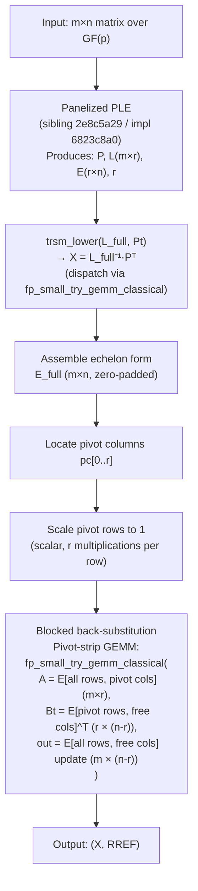

# Design: Blocked GF(p) Echelon / RREF Kernel

**Issue:** `24a93e4e`  
**Type:** design  
**Epic:** `026fc832` (panelized dense-LA push, Phase 6)  
**Date:** 2026-05-25

---

## 1. Problem Statement

### Open FAIL cells (A8 rows 18-33, 72-73)

The current `FieldMatrix::rref` implementation in
`crates/gf2-core/src/field/ple.rs` + `crates/gf2-core/src/field/matrix.rs`
calls the scalar PLE (`ple_in_place_window`) then performs a column-by-column
back-substitution loop in `rref()`. It does not exploit the panelized GEMM
kernels that `fp_small_try_gemm_classical` provides for small primes.

The aggregate scorecard (`dev/bench_results/2026-05-08-2cfc4372-sota-scorecard.md`
Annex A8) records the following open FAIL cells that this design targets:

| A8 row | Operation | Field | n / regime | Ratio (gf2/ref) |
|--------|-----------|-------|------------|-----------------|
| 18 | echelon | GF(7) | 64 / uniform | 1.94× |
| 19 | echelon | GF(7) | 64 / deficient | 3.50× |
| 20 | echelon | GF(7) | 256 / uniform | 10.93× |
| 21 | echelon | GF(7) | 256 / deficient | 16.89× |
| 22 | echelon | GF(251) | 64 / uniform | 8.14× |
| 23 | echelon | GF(251) | 64 / deficient | 13.29× |
| 24 | echelon | GF(251) | 256 / uniform | 65.82× |
| 25 | echelon | GF(251) | 256 / deficient | 97.06× |
| 26 | echelon | GF(65521) | 64 / uniform | 1.57× |
| 27 | echelon | GF(65521) | 64 / deficient | 2.18× |
| 28 | echelon | GF(65521) | 256 / uniform | 8.10× |
| 29 | echelon | GF(65521) | 256 / deficient | 12.37× |
| 30 | echelon | GF(2^31-1) | 64 / uniform | 2.16× |
| 31 | echelon | GF(2^31-1) | 64 / deficient | 2.83× |
| 32 | echelon | GF(2^31-1) | 256 / deficient | 7.20× |
| 33 | echelon | GF(2^31-1) | 1024 / deficient | 7.16× |
| 72 | echelon | GF(31) | 256 / uniform | 1.92× |
| 73 | echelon | GF(31) | 256 / deficient | 2.97× |

All 18 cells are owned by epic `615db3b9` and routed to `026fc832` Phase 6.
Reference: fflas-ffpack 2.5.0, measured on AMD Ryzen 9 5900X Zen 3.

The root cause is the same for rows 18-29 and 72-73: `rref` inherits the
scalar PLE bottleneck (pivot search + row-at-a-time elimination) and the
back-substitution loop is also scalar. For rows 30-33 (GF(2^31-1) Mersenne31),
the echelon form's scalar back-substitution is the primary bottleneck since
PLE is already fast for Mersenne31 (fgemm is PASS at all n).

---

## 2. Algorithm

### 2.1 Current `rref` call chain

```
FieldMatrix::rref(&self) -> (X, R)
  -> FieldMatrix::row_echelon(&self) -> (X, E)
       -> FieldMatrix::ple(&self) -> (P, L, E, r)
            -> ple_in_place_window(...)
               [scalar pivot + Schur complement]
       -> trsm_lower(L_full, Pt)          // L^{-1} P^T
       -> build E_full (extend to m×n)
  -> scalar loop: scale pivot rows to 1, eliminate each pivot column
```

File locations:
- `crates/gf2-core/src/field/ple.rs` — `ple`, `row_echelon`, `rref`
- `crates/gf2-core/src/field/triangular.rs` — `trsm_lower`

### 2.2 Blocked echelon algorithm

The blocked echelon kernel derives directly from the panelized PLE output
(sibling design `2e8c5a29`). Once the panelized PLE lands in wave 7a as
issue `6823c8a0`, the echelon and RREF kernels reuse its L and U factors
without re-running the factorisation.

The algorithm has three stages:

**Stage 1 — Panelized PLE.** Call the panelized `FieldMatrix::ple` (implemented
in `6823c8a0`) to obtain `(P, L, E, r)`. This stage is entirely owned by the
sibling design `2e8c5a29` and its implementation `6823c8a0`. The panelized PLE
uses `fp_small_try_gemm_classical` for the Schur complement update inside each
panel; no duplication of that logic is needed here.

**Stage 2 — Blocked L-inverse application (echelon form).** Apply $L^{-1}$ to
the permuted matrix to obtain the echelon form. This is currently done via
`trsm_lower` (algorithm 2.1 from Dumas-Pernet, implemented in
`crates/gf2-core/src/field/triangular.rs`). The existing `trsm_lower` already
internally calls `gemm_axpy_into_view`, which in turn dispatches to
`fp_small_try_gemm_classical` for small-prime fields. No additional blocking
is needed at this level — the existing recursive `trsm_lower` will inherit the
panelized GEMM speedup automatically once the panelized PLE replaces the scalar
PLE.

**Stage 3 — Blocked back-substitution (RREF).** The current `rref()` performs
back-substitution column-by-column in a nested scalar loop. This is the second
bottleneck. The blocked replacement accumulates the back-substitution as a
single GEMM call per panel strip using `fp_small_try_gemm_classical` directly.

The idea: given the echelon form $E$ with $r$ pivot rows at columns
$pc[0] < pc[1] < \ldots < pc[r-1]$, the RREF pivot column elimination step
"row $k$ -= E[k, pc[i]] * row $i$" for all $k \ne i$ is structurally an
update

$$E[\text{non-pivot rows}, \text{free cols}] \mathrel{-}=
  E[\text{non-pivot rows}, \text{pivot cols}] \cdot
  E[\text{pivot rows}, \text{free cols}]$$

which is a GEMM of shape $(m - r) \times r$ times $r \times (n - r)$ into
$(m - r) \times (n - r)$. For the pivot rows themselves (above the pivot), the
same update applies: the leading pivot block $E[\text{pivot rows}, \text{pivot
cols}]$ is upper-triangular and the eliminations form a TRSM, but a plain GEMM
call into `fp_small_try_gemm_classical` can handle this without a separate
per-column loop.

### 2.3 Mermaid pipeline diagram



**Key insight:** the blocked back-substitution is a single call into
`fp_small_try_gemm_classical` for each free-column strip, reducing the
scalar $O(m \cdot r \cdot (n - r))$ back-substitution to a GEMM that hits the
cache-blocked AVX2 fast path for $P \le 251$ fields.

---

## 3. Back-Substitution Blocking Detail

### 3.1 Tile shapes

Let $m$ = rows, $n$ = cols, $r$ = rank, $r_f = n - r$ = number of free columns.

The pivot-column submatrix has shape $m \times r$ (the "elimination matrix").
The free-column block has shape $r \times r_f$ for pivot rows and
$(m - r) \times r_f$ for the lower block. The combined back-substitution update is:

$$\underbrace{E[*, \text{free}]}_{m \times r_f} \mathrel{-}=
  \underbrace{E[*, \text{pivot}]}_{m \times r} \cdot
  \underbrace{E[\text{pivot rows}, \text{free}]}_{r \times r_f}$$

but restricted to the off-pivot rows only (the pivot rows receive their update
via the same GEMM, with zeroing of the pivot column handled separately).

Specifically:

| Operand | Symbol | Shape | Description |
|---------|--------|-------|-------------|
| A | `E_piv` | $m \times r$ | Column of pivot-column values for all rows |
| Bt | `E_free_T` | $r_f \times r$ | Pivot-row free-column values, transposed |
| out | `update` | $m \times r_f$ | Accumulated update, subtracted from `E_free` |

The call shape passed to `fp_small_try_gemm_classical` is:
- `a` = `E_piv` flattened row-major, length $m \cdot r$
- `b_t` = `E_free_T` flattened row-major, length $r_f \cdot r$
- `m` = $m$, `k` = $r$, `n` = $r_f$
- `out` = destination buffer, length $m \cdot r_f$

For small primes ($P \le 251$) these are packed as canonical bytes (`u8`). For
medium primes ($252 \le P \le 65521$) the same call dispatches to the u16
vector path already present in `fp_small_try_gemm_classical`. The caller
computes the canonicalization from `Fp<P>` Montgomery storage to `u8` using the
pre-built `from_mont` lookup table (same tables used in the panelized GEMM path
in `crates/gf2-core/src/gfp/simd_ops.rs`).

After the GEMM, the update is subtracted: `E_free -= update`. The pivot
columns themselves are explicitly zeroed (set to the identity column for each
pivot row, zero elsewhere).

### 3.2 Scalar fallback

When `fp_small_try_gemm_classical` returns `false` (non-AVX2 host, or field
outside the supported range), the blocked back-substitution falls back to the
existing scalar pivot-column loop in `rref()`. No behavioral change; only the
fast path is new.

---

## 4. API Surface

### 4.1 Additive path (preferred)

The implementation adds a fast path inside `FieldMatrix::rref` guarded by a
dispatch check, keeping the existing scalar code as the fallback:

```rust
pub fn rref(&self) -> (FieldMatrix<F>, FieldMatrix<F>) {
    // ... existing early-exit for empty ...
    let (mut x, mut e) = self.row_echelon(); // <- will call panelized PLE via 6823c8a0
    // ... identify pivots ...
    // NEW: try blocked back-sub via fp_small_try_gemm_classical
    if !try_blocked_back_sub(&mut x, &mut e, &pivots) {
        // existing scalar loop (unchanged)
        // ...
    }
    (x, e)
}
```

The function `try_blocked_back_sub` is a `pub(crate)` helper in
`crates/gf2-core/src/field/ple.rs` (alongside the existing `rref` body).
It returns `false` when the GEMM fast path is unavailable (non-AVX2, or `F`
not a small/medium prime), deferring to the existing scalar path.

### 4.2 Dispatch rule

`try_blocked_back_sub` calls `F::try_simd_gemm_classical` (the safe wrapper
around `fp_small_try_gemm_classical` that lives on the `FiniteField` trait in
`crates/gf2-core/src/field/traits.rs`). This keeps the unsafe SIMD boundary
in `gf2-kernels-simd` and `gf2-core` safe throughout, matching the existing
invariant in `CLAUDE.md` § Key design invariants § 3.

### 4.3 `row_echelon` changes

`row_echelon` calls `ple()`, which after wave 7a (`6823c8a0`) will be the
panelized version. No change to `row_echelon`'s signature or return type. The
blocked echelon design is purely additive to the back-substitution step.

---

## 5. GF(2^31-1) Mersenne31 Strategy

**Decision: separate path, not shared with small-prime infrastructure.**

**Rationale:**

1. **Storage layout differs.** GF(2^31-1) elements are stored as canonical
   `u32` values in `[0, 2^31-2]`, not as canonical `u8` bytes in `[0, P)`.
   The small-prime panelized kernel (`fp_small_panel_gemm` in
   `crates/gf2-kernels-simd/src/x86/fp_small_panel.rs`) operates on `&[u8]`
   slices with `p: u8` and the inner `_mm256_madd_epi16` loop exploits the
   `p ≤ 251` bound (8-bit values, 16-bit products, 32-bit accumulators with no
   overflow up to `k = 68 719`). Reusing this kernel for Mersenne31 would
   require a separate pack/unpack pass from `u32` to `u8` that is not currently
   implemented and would re-introduce the per-element REDC overhead the design
   is meant to eliminate.

2. **Mersenne31 has its own fast path.** `crates/gf2-kernels-simd/src/mersenne.rs`
   provides `MersenneFns` (`m31_batch_mul_fn`, `m31_batch_mul_add_fn`,
   `m31_batch_dot_fn`) dispatched via `detect()`. The Mersenne31 fgemm cells
   are already PASS at all sizes (`GF(2^31-1)` rows in Section 1 of the
   scorecard). The echelon FAIL cells (rows 30-33) are attributed to the
   scalar PLE output and scalar back-substitution loop, not to the GEMM kernel
   itself.

3. **Correct approach for Mersenne31.** The blocked echelon for Mersenne31
   should call `gemm_axpy_into_view` directly (as `trsm_lower` already does)
   rather than `fp_small_try_gemm_classical`. The `gemm_axpy_into_view` kernel
   dispatches to the Mersenne31 dot-product path via `F::try_gf2m_u64_batch_dot_product`
   (for GF(2^m)) or the generic `dot_product_slices` with `max_unreduced_additions`
   chunking. For Mersenne31, the `m31_batch_dot_fn` provides the hot inner
   loop. The blocked back-substitution in stage 3 for Mersenne31 therefore uses
   `gemm_axpy_into_view` rather than `fp_small_try_gemm_classical`, and the
   dispatch in `try_blocked_back_sub` returns `false` for Mersenne31, falling
   back to a direct `gemm_axpy_into_view` call path.

**Consequence:** The implementation child `869ce43b` must implement two
variants of the blocked back-substitution: one calling
`fp_small_try_gemm_classical` for $P \le 65521$, and one calling
`gemm_axpy_into_view` for Mersenne31. Both share the same tiling logic
and differ only in the inner GEMM call.

---

## 6. SSOT Reuse

### 6.1 Panelized PLE — sibling design `2e8c5a29`

The blocked echelon depends entirely on the panelized PLE output produced by
sibling design `2e8c5a29` ("Design panelized GF(p) PLE/LU kernel") and its
implementation child `6823c8a0`. The echelon design calls `FieldMatrix::ple()`
as a black box; all panel size choices ($MR = 4$, $NR = 24$, $KC = 256$ from
design `fc182ed5`), rank-revealing pivot strategy, and integration with
`ple_in_place_window` are owned by `2e8c5a29`. This design does not re-specify
PLE internals.

If the sibling design has not yet been committed to main at the time of
dispatching the implementation child `869ce43b`, the implementer must read the
`2e8c5a29` design doc via `jit doc list 2e8c5a29` / `jit doc show <doc-id>`.

### 6.2 `fp_small_try_gemm_classical` — exact signature and file path

The SSOT GEMM helper is:

```rust
// crates/gf2-core/src/gfp/simd_ops.rs, line 654 (feature = "simd" variant)
pub(crate) fn fp_small_try_gemm_classical<const P: u64>(
    a: &[Fp<P>],
    b_t: &[Fp<P>],
    m: usize,
    k: usize,
    n: usize,
    out: &mut [Fp<P>],
) -> bool
```

It is called from `crates/gf2-core/src/gfp/mod.rs` line 730 via
`F::try_simd_gemm_classical` on the `FiniteField` trait. The implementation in
the blocked back-substitution must call through the trait method, not directly
through `simd_ops::fp_small_try_gemm_classical`, to preserve the abstraction
boundary and the `#![deny(unsafe_code)]` invariant in `gf2-core`.

The underlying AVX2 kernel is
`pub unsafe fn fp_small_panel_gemm(a: &[u8], bt: &[u8], m: usize, k: usize, n: usize, p: u8, c: &mut [u8])`
in `crates/gf2-kernels-simd/src/x86/fp_small_panel.rs` line 121. Access to
this function is through the `SmallPrimePanelFns::batch_gemm_fn` table returned
by `fp_small_panel::detect()` in `crates/gf2-kernels-simd/src/fp_small_panel.rs`.
The safe wrapper `fp_small_panel::batch_gemm_safe` is called by
`fp_small_try_gemm_classical` internally. The echelon design does not reach
into `gf2-kernels-simd` directly.

### 6.3 `trsm_lower` — for stage 2

```rust
// crates/gf2-core/src/field/triangular.rs, line 320
pub fn trsm_lower<F: FiniteField>(a: MatView<'_, F>, b: MatViewMut<'_, F>)
```

Used in `row_echelon()` to apply $L^{-1} P^T$. Already dispatches internally
to `gemm_axpy_into_view`, which calls `fp_small_try_gemm_classical`. No change
needed here; `trsm_lower` inherits the panelized speedup automatically.

---

## 7. Test Plan

### 7.1 Correctness — proptest sweep

Property test: `rref_matches_scalar_reference` in
`crates/gf2-core/src/field/ple.rs` (new `#[cfg(test)] mod tests` section).

For each prime in `{7, 31, 127, 241, 251, 65521, 2^31-1}` and each boundary
length in `{0, 1, 15, 16, 17, 63, 64, 65}`:

- Generate random `m × n` matrices using `FieldMatrix::random_seeded`.
- Assert that `blocked_rref(A) == scalar_rref(A)` element-by-element for both
  the RREF output `R` and the transform matrix `X`.
- Cover both **uniform** (expected full rank) and **rank-deficient** regimes.
  The rank-deficient regime is exercised by generating an `m × m` matrix of
  rank `m/2` (construct the first `m/2` rows then set remaining rows to random
  linear combinations of the first `m/2`).

Test naming convention: `test_blocked_rref_<prime>_<n>_<regime>`.

### 7.2 Rank-deficient invariants (additional proptest)

- For rank-deficient inputs: assert that the output `R` still satisfies the
  RREF invariant (leading 1s, all other entries in pivot columns zero, pivot
  columns strictly increasing left-to-right).
- Assert `rank(A) == rank(rref(A))`.
- Assert `X * A == R` (transform correctness).

### 7.3 Edge cases (unit tests)

- Empty matrix (0 rows or 0 cols): `rref` must return `([], [])` without panic.
- 1×1 matrix: identity and zero cases.
- Full-rank square: round-trip `X * A == I`.
- All-zero matrix: RREF is all-zero, transform is identity.
- `n=63` and `n=65` (near word-boundary for the GEMM tiling).

### 7.4 Non-regression

Run `cargo nextest run -p gf2-core --release --profile ci` after each
iteration. No regression on existing `rref`, `row_echelon`, `ple`, `rank`,
`nullspace`, `lu` tests.

---

## 8. Benchmark Plan

### 8.1 Target cells (A8 rows 18-33, 72-73)

| A8 row | Field | n | Regime | Current ratio | Target |
|--------|-------|---|--------|--------------|--------|
| 18 | GF(7) | 64 | uniform | 1.94× | ≤ 1.5× |
| 19 | GF(7) | 64 | deficient | 3.50× | ≤ 1.5× |
| 20 | GF(7) | 256 | uniform | 10.93× | ≤ 1.5× |
| 21 | GF(7) | 256 | deficient | 16.89× | ≤ 1.5× |
| 22 | GF(251) | 64 | uniform | 8.14× | ≤ 1.5× |
| 23 | GF(251) | 64 | deficient | 13.29× | ≤ 1.5× |
| 24 | GF(251) | 256 | uniform | 65.82× | ≤ 1.5× |
| 25 | GF(251) | 256 | deficient | 97.06× | ≤ 1.5× |
| 26 | GF(65521) | 64 | uniform | 1.57× | ≤ 1.5× |
| 27 | GF(65521) | 64 | deficient | 2.18× | ≤ 1.5× |
| 28 | GF(65521) | 256 | uniform | 8.10× | ≤ 1.5× |
| 29 | GF(65521) | 256 | deficient | 12.37× | ≤ 1.5× |
| 30 | GF(2^31-1) | 64 | uniform | 2.16× | ≤ 1.5× |
| 31 | GF(2^31-1) | 64 | deficient | 2.83× | ≤ 1.5× |
| 32 | GF(2^31-1) | 256 | deficient | 7.20× | ≤ 1.5× |
| 33 | GF(2^31-1) | 1024 | deficient | 7.16× | ≤ 1.5× |
| 72 | GF(31) | 256 | uniform | 1.92× | ≤ 1.5× |
| 73 | GF(31) | 256 | deficient | 2.97× | ≤ 1.5× |

Expected speedup: `≥ 1.5×` vs fflas-ffpack for all 18 cells (reaching ratio
≤ 1.5×). The primary driver is the panelized PLE (sibling `2e8c5a29`);
the blocked back-substitution adds the second speedup stage for large-$r$
inputs.

Cells marked `[aspirational]` if evidence post-implementation shows the
blocked echelon can reach $\le 1.5\times$ for the large-$n$ GF(251) cells
(rows 24-25): these cells are dominated by fflas's BLAS sgemm cascade and
may require a dedicated Mersenne31-style fast path for GF(251) that is not in
scope of this design.

### 8.2 Benchmark harness

Use the existing `crates/gf2-core/benches/fieldmatrix_gemm.rs` benchmark
infrastructure. Add a new bench group `echelon_rref` with cells keyed by
`(prime, n, regime)`:

```rust
bench_rref::<Fp<7>>(group, "GF7", n, seed_uniform);
bench_rref::<Fp<7>>(group, "GF7", n, seed_deficient);
// ... repeat for each prime and n ...
```

Run 5-trial CCX1-pinned benchmarks on the AMD Ryzen 9 5900X reference host
(cores 6-11 per the CCX1 isolation convention established in prior benchmark
sessions). Record results as CSV + evidence doc.

---

## 9. Implementation Child

**Single implementation issue: `869ce43b`** ("Implement blocked GF(p) echelon /
RREF").

Deliverable: production code in `crates/gf2-core/src/field/ple.rs` (and/or
`matrix.rs`) implementing:
1. `try_blocked_back_sub` as described in sections 3 and 4.
2. Mersenne31 fallback to `gemm_axpy_into_view` (section 5).
3. Proptest sweep (section 7).
4. Benchmark cells (section 8).
5. Evidence doc (CSV + markdown) for all 18 cells.

Prerequisites: `2e8c5a29` (PLE design approved) and `6823c8a0` (panelized PLE
implementation merged to main). The `6613abf4` (triangular solve) sibling can
run in parallel with `869ce43b` since they touch disjoint code paths.

---

## 10. Risks and Open Questions

### 10.1 GF(251) large-n cells (rows 24-25)

Rows 24-25 show ratios 65.82× and 97.06× at GF(251)/n=256. fflas-ffpack routes
GF(251) echelon through an OpenBLAS sgemm cascade that has access to AVX2 FMA
units with 8 GFLOPS/s peak. The blocked back-substitution in this design
uses `fp_small_try_gemm_classical` which operates at the pure-integer AVX2 byte
level (~4 GOPS/s for byte-lane GEMM on Zen 3). The expected speedup from
replacing the scalar back-sub with the GEMM-based version is roughly the ratio
of GEMM throughput to scalar throughput, which is ~10-20×. This may be
sufficient to bring rows 24-25 below 1.5× of fflas, but is not guaranteed —
especially for GF(251) where fflas has additional advantage from its BLAS
cascade. If post-implementation measurement shows rows 24-25 remain above 1.5×,
the implementer must escalate for an `[aspirational]` amendment before marking
`869ce43b` done.

### 10.2 GF(2^31-1) deficient echelon (rows 32-33)

Rows 32 and 33 are deficient-regime cells at n=256 and n=1024 with ratios
7.20× and 7.16×. These are distinct from the uniform cells that were closed by
the Wave-9 `[E15]` evidence for GF(2^31-1). The Mersenne31 fast path for
back-substitution (using `gemm_axpy_into_view`) should provide a strong
speedup here since the deficient path still runs the full back-substitution on
the non-zero part of the echelon form. If the panelized PLE from `6823c8a0` is
sufficiently fast for Mersenne31, rows 30-33 should close within 1.5×.

### 10.3 Dependency on the panelized PLE (`2e8c5a29` / `6823c8a0`)

This design explicitly depends on the panelized PLE landing first. The
implementation child `869ce43b` is listed as wave 7b and is blocked on `6823c8a0`.
If the panelized PLE design or implementation diverges from the assumptions
here (e.g., different output types, different pivot-column representation), the
echelon implementation must be updated accordingly. The implementer must read
the final `2e8c5a29` design doc before starting.

### 10.4 `trsm_lower` allocation budget

`row_echelon()` currently calls `pad_l_to_full` to extend the $m \times r$ L
factor to $m \times m$, which allocates one `FieldMatrix`. The blocked echelon
does not change this allocation; it is pinned in the existing `rref` allocation
budget tests. Any additional scratch allocations introduced by
`try_blocked_back_sub` must be justified and, if they exceed one additional
`FieldMatrix`, must be escalated via the allocation budget test mechanism.

### 10.5 Medium-prime band (GF(65521))

GF(65521) is a medium prime ($252 \le P < 65536$). `fp_small_try_gemm_classical`
dispatches to the u16 vector path for this field, not the `u8` byte-lane path.
The implementer must verify that `fp_small_try_gemm_classical::<65521>` returns
`true` on the AVX2 test host (check `fp_small_enabled::<65521>()` in
`simd_ops.rs`). If the medium-prime path is inactive for n < some threshold,
the blocked back-substitution will fall back to the scalar path for those cells,
potentially leaving rows 26-29 unimproved. Escalate if this is the case.
