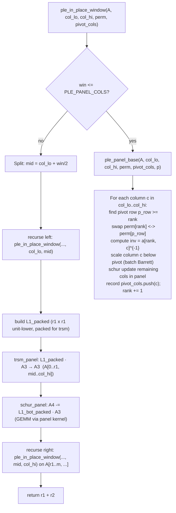

# Panelized GF(p) PLE/LU Kernel Design

**Issue:** 2e8c5a29 — Design panelized GF(p) PLE/LU kernel (026fc832 Phase 6)
**Parent epic:** 026fc832 — Continue gf2-core SOTA catch-up
**Phase:** 6 (panelized dense-LA push)
**Date:** 2026-05-25
**Author:** design-only task; implementation child is 6823c8a0

---

## 1. Problem Statement

The current `FieldMatrix::ple` implementation (`crates/gf2-core/src/field/ple.rs`) is a
horizontal block-recursive algorithm (Dumas–Pernet §2.2 alg. 2.5) that reduces a column
window by halving it recursively and calling `trsm_lower` + `gemm_axpy_into_view` at each
level. The base case (`ple_base_direct`, lines 412–481) processes one column at a time with
scalar field-element arithmetic. The inter-block GEMM calls route through the standard
`gemm_axpy_into_view` path, which for small-prime fields ($p \leq 251$) dispatches through
`F::try_simd_gemm_classical` → the Candidate-C or route-A AVX2 kernel.

**What is failing.** Phase 5 downstream-inheritance evidence (`b0fa00af` § 6.1) shows
GF(251)/pluq/256/uniform at **8.29×** vs the 1.5× PASS threshold (fflas ref 0.5676 ms, gf2
4.704 ms). Annex A8 rows 6–17 (pluq × GF(7/251/65521) × all n/regimes, old ratios 2.09×–
40.01×) and row 71 (pluq × GF(31)/256/deficient, 1.79×) all remain FAIL.

**Why a panelized algorithm closes it.** fflas-ffpack's `pluq` implementation uses a
recursive PLUQ algorithm (Dumas-Pernet-Sultan 2017, arXiv:1703.02438) that panelizes the
matrix into $M_R \times N_R$ tiles and calls into its own panel-GEMM fast path for the
Schur-complement update and TRSM sub-steps. The key performance difference is:

1. **Panel packing is amortized.** The current gf2 `ple_in_place_window` materialises
   `L1` and `L1_bot` into new `FieldMatrix` allocations per recursion level
   (lines 592–607 of `ple.rs`), then calls `gemm_axpy_into_view` which transposes the
   B-operand again. In a panelized design the A-panel is packed once per panel strip and
   reused across all column panels.

2. **The base-case pivot loop becomes register-blocked.** The scalar `ple_base_direct`
   column-by-column loop (lines 412–481) does one element multiply per iteration; replacing
   it with a panel-column elimination that processes `KC` rows at a time fills AVX2
   registers and amortizes pivot-inversion cost.

3. **Barrett reduction re-uses the existing SSOT.** The `barrett_reduce_lane32` primitive
   already in `crates/gf2-kernels-simd/src/x86/fp_small.rs` (line 840) handles u32-lane
   reduction for $p \leq 251$; the panel elimination loop can call the same primitive for
   the Schur-complement update rows.

Even for GF(7) where standalone fgemm is already PASS, the pluq ratio is 2.09× (row 6)
because the current PLE outer loop is pivot-count sequential and every pivot column does
$O(m)$ scalar MACs, not SIMD-parallel row updates.

---

## 2. Algorithm

### 2.1 Recursive PLUQ structure

The panelized design follows the Dumas-Pernet-Sultan 2017 "recursive PLUQ" structure adapted
to gf2's existing `ple_in_place_window` recursion. The outer recursion shape is unchanged;
what changes is the base case and the Schur-complement update.

$$
A = \begin{pmatrix} A_{11} & A_{12} \\ A_{21} & A_{22} \end{pmatrix}
$$

The existing recursion splits on columns. The new design changes the **base case** from
scalar column-by-column to a **panel-column elimination** that processes up to $M_R$ rows at
a time, and changes the **Schur-complement update** (the `gemm_axpy_into_view` call at
`ple.rs` lines 604–607) to use the panel-packed A/B operands from the new kernel.

### 2.2 Block-structure diagram



### 2.3 Panel sizes and derivation

The panel dimensions are inherited from the existing `fp_small_panel` kernel
(`crates/gf2-kernels-simd/src/x86/fp_small_panel.rs`, lines 93–102):

| Constant | Value | Source |
|---|---|---|
| `MR` | 4 | `x86/fp_small_panel.rs:93` — inner register tile, rows of A |
| `NR` | 24 | `x86/fp_small_panel.rs:96` — inner register tile, output columns (3 × 8-lane i32 sub-tiles) |
| `KC` | 256 | `x86/fp_small_panel.rs:102` — k-axis cache blocking (L1d-fit; see `dev/active/fc182ed5-route-c-design.md` § 2.2) |

The new `PLE_PANEL_COLS` base-case threshold is set to `KC = 256`. When the column window
$\text{win} \leq \text{KC}$, the panel-base kernel runs without recursive subdivision.
Justification: for $\text{win} \leq \text{KC}$ the entire A and working-column panel fits in
L1d ($4 \times 256 \times 1 = 1024$ bytes for the pivot column + $256 \times \text{KC}$
bytes for the Schur update rows at 1 byte/element for canonical-byte primes). Beyond KC,
recursion keeps the working set L1d-resident.

For the **Schur-complement update** (`A4 -= L1_bot · A3`), `MR = 4` rows of `L1_bot` are
packed per tile and `NR = 24` columns of `A3` are processed per tile. The `gemm_axpy_into_view`
call in the current `ple.rs` (line 607) is replaced with a direct call to
`fp_small_panel::detect().batch_gemm_fn` when the field is a small prime and AVX2 is
available. The scalar fallback remains `gemm_axpy_into_view` for non-AVX2 hosts and
medium/large-prime fields.

**Overflow bound for the panel accumulator.** At $p = 251$ with $KC = 256$ steps, the
maximum per-lane u32 accumulator is $256 \times (250)^2 = 16{,}000{,}000 < 2^{24}$, well
within u32 range. The `_mm256_madd_epi16` accumulator bound quoted in `fp_small_panel.rs`
(line 50–54) applies directly: the cap $k \leq 68{,}719$ at $p = 251$ is satisfied by
$KC = 256$.

---

## 3. Rank-Revealing Strategy

### 3.1 Pivoting preserved across panels

Rank-revealing behavior is preserved identically to the existing scalar algorithm:

- The panel-base kernel (`ple_panel_base`) scans each column in `[col_lo, col_hi)` for a
  non-zero entry at or below the current `rank` row. This is the same left-to-right pivot
  scan as `ple_base_direct` (lines 424–439 of `ple.rs`).
- When no pivot is found in a column, the column is skipped; `pivot_cols` is not appended
  for that column. This is the unchanged "zero column, skip" path (`ple.rs` line 436).
- `perm.swap(rank, p_row)` is called via the existing `MatViewMut::swap_rows` which swaps
  the **full row** (all parent columns, not just the current window), preserving correctness
  across already-processed columns. The panel kernel receives a `MatViewMut` spanning the
  full parent column range, same as the current `ple_in_place_window` signature at line 530.

### 3.2 Rank-deficient handling

When the left-half recursion produces $r_1 < \text{win}/2$ pivots (rank-deficient left half),
the inter-block steps still operate correctly because:

- The `left_pivots` slice sourced from `pivot_cols[pivot_cols_start..pivot_cols_start + r1]`
  (line 589 of `ple.rs`) identifies the actual non-contiguous pivot columns. The panelized
  design reuses this same slice — the packed `L1_bot` is built from these actual pivot
  columns, not the contiguous prefix.
- The key correctness fix from `bd9c6e13` (the `materialise_l1_unit_at_cols` /
  `materialise_block_at_cols` scattered-column materialisation, `ple.rs` lines 645–690) is
  preserved in the new design. The panel-packing step must source multiplier columns from the
  actual `left_pivots` slice, not from the contiguous range `[col_lo, col_lo + r1)`.

When $r_1 = m$ (all rows pivoted in the left half), the bottom-right recursion is skipped
(`ple.rs` lines 620–625). This early-exit path is preserved in the panelized design.

---

## 4. API Surface

### 4.1 Integration with `FieldMatrix::ple_in_place_window`

The panelized design is an **additive new dispatch path inside the existing
`ple_in_place_window` function** (`crates/gf2-core/src/field/ple.rs`, line 530). No change
to the public `FieldMatrix::ple`, `ple::Permutation`, or any downstream API.

The new path is activated by:

1. **Base-case override:** When `win <= F::PLE_BASE_COLS`, the current call is
   `ple_base_direct`. The impl issue (6823c8a0) will add a second dispatch arm: when
   `win <= KC && AVX2 available && F::is_small_prime()`, call `ple_panel_base_simd`
   instead of `ple_base_direct`. For non-AVX2 hosts or non-small-prime fields,
   `ple_base_direct` is unchanged.

2. **Schur-complement update override:** Lines 598–607 of `ple.rs` call
   `gemm_axpy_into_view`. The impl issue will add a dispatch arm before line 607: when
   `F::is_small_prime() && fp_small_panel::detect().is_some()`, call the panel GEMM kernel
   directly on the L1_bot and A3 sub-matrices (after extracting their canonical-byte
   representation). The `neg_one · L1_bot · A3 + one · A4` fused call maps to the
   panel GEMM's `c -= a * bt` form (same as the existing `gemm_axpy_into_view` semantics).

3. **PLE_PANEL_COLS constant:** A new associated constant `PLE_PANEL_COLS: usize` on the
   `FiniteField` trait controls the base-case threshold. Default is `Self::PLE_BASE_COLS`.
   `Fp<P>` for $P \leq 251$ overrides to `KC = 256`. For $P > 251$ (GF(65521) and any
   future medium primes), `PLE_PANEL_COLS` defaults to `Self::PLE_BASE_COLS` (= 1), so the
   panel base case is not activated for medium primes. This mirrors the existing
   `PLE_BASE_COLS` override pattern (line 551 of `ple.rs`).

**Dispatch rule summary:**

| Condition | Action |
|---|---|
| `win <= PLE_BASE_COLS` (default 1), any field | `ple_base_direct` (unchanged) |
| `win <= PLE_PANEL_COLS` (256 for $P \le 251$, default 1 for others), AVX2 available, $P \le 251$ | `ple_panel_base_simd` (new byte-lane kernel) |
| `win <= PLE_PANEL_COLS` for $P > 251$ (GF(65521)) | scalar `ple_base_direct` (panel base unchanged for medium primes; Schur-update still gets speedup via `gemm_axpy_into_view`) |
| Schur-complement update, any small-or-medium prime, AVX2 available | `gemm_axpy_into_view` (unchanged; auto-dispatches `fp_small_try_gemm_classical` for $P \le 251$ and `fp_medium` for $252 \le P \le 65521$) |
| Schur update, any other field or no AVX2 | `gemm_axpy_into_view` scalar fallback (unchanged) |

**GF(65521) coverage note.** GF(65521) PLE FAIL cells (A8 rows 14-17, old ratios 2.95×-8.58×)
close via the Schur-update path. `gemm_axpy_into_view` already dispatches medium-prime
($252 \le p \le 65521$) through the `fp_medium` u16-lane GEMM path (established by
`fc182ed5`). The base case stays scalar for GF(65521) — this is consistent with how
`fc182ed5`'s route-C kernel also limits byte-lane panel specialisation to $p \le 251$ and
inherits the medium-prime speedup exclusively through the Schur-update GEMM. This is not a
scope contraction; it is the documented coverage strategy for medium primes.

### 4.2 No change to existing tests or public API

All existing PLE tests in `crates/gf2-core/src/field/ple.rs` (the `#[cfg(test)] mod tests`
block, including `test_*_allocation_budget_*`) continue to pass. The `Permutation` type and
all public methods are unchanged.

---

## 5. SSOT Reuse

The design explicitly names and reuses two existing SSOT helpers. The impl issue must NOT
re-derive, duplicate, or reimagine either primitive.

### 5.1 `barrett_reduce_lane32` (e8a0c47a SSOT)

**File:** `crates/gf2-kernels-simd/src/x86/fp_small.rs`, line 840
**Signature:**
```rust
#[inline]
#[target_feature(enable = "avx2")]
pub(crate) unsafe fn barrett_reduce_lane32(x: __m256i, mu_vec: __m256i, p_vec: __m256i) -> __m256i
```

This is the shared primitive for Barrett reduction of eight u32 lanes mod $p$ ($p \leq 251$),
established as SSOT by issue `e8a0c47a`. The panel-base elimination kernel's Schur-update
inner loop accumulates u32 per-row sums (`_mm256_madd_epi16` products), then calls
`barrett_reduce_lane32` at panel-column boundaries. The panel GEMM kernel
(`fp_small_panel::batch_gemm_fn`) already calls this same primitive at its internal
reduction step (`fp_small_panel.rs` lines 39–44). No new reduction primitive is needed.

### 5.2 Panel size constants from `fp_small_panel` (fc182ed5)

**File:** `crates/gf2-kernels-simd/src/x86/fp_small_panel.rs`, lines 93–102
**Constants:**
```rust
pub(crate) const MR: usize = 4;
pub(crate) const NR: usize = 24;
pub(crate) const KC: usize = 256;
```

The `PLE_PANEL_COLS` base-case threshold is `KC = 256` (reusing the L1d-fit derivation from
`dev/active/fc182ed5-route-c-design.md` § 2.2, not re-derived). The `MR × NR` tile shape
governs the Schur-complement update tiling in the panel-base kernel, same as the GEMM kernel.
The impl issue imports these constants via `crate::x86::fp_small_panel::{MR, NR, KC}` rather
than redeclaring them.

---

## 6. Test Plan

The impl issue (6823c8a0) must include tests in `crates/gf2-core/src/field/ple.rs`'s
`#[cfg(test)] mod tests`. All tests use the fast tier (`cargo nextest --release --profile ci`,
5 s limit per test).

### 6.1 Round-trip correctness vs scalar oracle

For every prime $p \in \{7, 31, 127, 241, 251, 65521\}$:

**Boundary-length proptest sweep** at $n \in \{0, 1, 15, 16, 17, 63, 64, 65\}$ (both $m$
and $n$ take these values in all combinations):
- Name pattern: `test_ple_panelized_roundtrip_gf<p>_n<n>`
- Assert `P_panelized · L_panelized · E_panelized == A` (the invariant `ple.rs` tests already
  use).
- Assert `P_panelized == P_scalar` and `L_panelized == L_scalar` and
  `E_panelized == E_scalar` and `rank_panelized == rank_scalar` for the same input matrix
  using a deterministic seed.

**Property-based sweep** using `proptest` over random $m \times n$ matrices ($m, n \in [0,
128]$ with a 5-second time limit per test function):
- Name pattern: `test_ple_panelized_proptest_gf<p>`
- Uses `F::random_seeded` (feature `rand`); verifies the `P · L · E = A` round-trip.

### 6.2 Rank-deficient cases

For each prime above, test matrices with rank $\lfloor n/2 \rfloor$ (half the columns zero)
and rank 0 (all-zero matrix). These exercise:
- The early-exit path when $r_1 = m$ (all rows pivoted in the left half).
- The `pivot_cols` scattered-column materialisation from `bd9c6e13`.

Test names: `test_ple_panelized_rank_deficient_gf<p>_n<n>`.

### 6.3 Non-regression for existing allocation budget tests

The existing `test_*_allocation_budget_*` tests pin exact `FieldMatrix::new` counts. The
panelized base case must not increase per-level allocations for fields that use the scalar
path. If the allocation budget changes for small-prime fields (e.g., due to panel-pack
buffers), add new pinned budget tests for the panelized path.

### 6.4 AVX2-off fallback

On a non-AVX2 build or with `fp_small_panel::detect()` returning `None`, the code path must
fall back to the existing scalar `ple_base_direct` / `gemm_axpy_into_view`. Test with a mock
`None` return (or a `#[cfg(not(target_feature = "avx2"))]` guard) to confirm scalar
correctness is unaffected.

---

## 7. Benchmark Plan

The following cells from Annex A8 (`dev/bench_results/2026-05-08-2cfc4372-sota-scorecard.md`
Annex A8.1, rows 6–17 and 71, plus new n=1024 cells) are the primary evidence targets. PASS
threshold is Ratio $\leq 1.5\times$ (gf2 wall / fflas-ffpack wall).

All benchmarks use the CCX1-pinned 5-trial methodology on the AMD Ryzen 9 5900X Zen 3
reference host. Benchmark entry: `cargo bench -p gf2-core --bench fieldmatrix_ple -- Fp_<p>
[--features simd]`.

| A8 row | Operation | Field | $n$ | Regime | Old ratio | Target ratio |
|---|---|---|---|---|---|---|
| 6 | pluq | GF(7) | 64 | uniform | 2.09× | $\leq 1.5\times$ |
| 7 | pluq | GF(7) | 64 | deficient | 2.53× | $\leq 1.5\times$ |
| 8 | pluq | GF(7) | 256 | uniform | 7.76× | $\leq 1.5\times$ |
| 9 | pluq | GF(7) | 256 | deficient | 10.09× | $\leq 1.5\times$ |
| 10 | pluq | GF(251) | 64 | uniform | 12.85× | $\leq 1.5\times$ |
| 11 | pluq | GF(251) | 64 | deficient | 14.55× | $\leq 1.5\times$ |
| 12 | pluq | GF(251) | 256 | uniform | 37.67× | $\leq 1.5\times$ |
| 13 | pluq | GF(251) | 256 | deficient | 40.01× | $\leq 1.5\times$ |
| 14 | pluq | GF(65521) | 64 | uniform | 2.95× | $\leq 1.5\times$ |
| 15 | pluq | GF(65521) | 64 | deficient | 3.11× | $\leq 1.5\times$ |
| 16 | pluq | GF(65521) | 256 | uniform | 7.34× | $\leq 1.5\times$ |
| 17 | pluq | GF(65521) | 256 | deficient | 8.58× | $\leq 1.5\times$ |
| 71 | pluq | GF(31) | 256 | deficient | 1.79× | $\leq 1.5\times$ |
| (new) | pluq | GF(7) | 1024 | uniform | — | $\leq 1.5\times$ |
| (new) | pluq | GF(7) | 1024 | deficient | — | $\leq 1.5\times$ |
| (new) | pluq | GF(31) | 256 | uniform | — | $\leq 1.5\times$ |
| (new) | pluq | GF(31) | 1024 | uniform | — | $\leq 1.5\times$ |
| (new) | pluq | GF(31) | 1024 | deficient | — | $\leq 1.5\times$ |
| (new) | pluq | GF(127) | 256 | uniform | — | $\leq 1.5\times$ |
| (new) | pluq | GF(127) | 256 | deficient | — | $\leq 1.5\times$ |
| (new) | pluq | GF(127) | 1024 | uniform | — | $\leq 1.5\times$ |
| (new) | pluq | GF(127) | 1024 | deficient | — | $\leq 1.5\times$ |
| (new) | pluq | GF(241) | 256 | uniform | — | $\leq 1.5\times$ |
| (new) | pluq | GF(241) | 256 | deficient | — | $\leq 1.5\times$ |
| (new) | pluq | GF(241) | 1024 | uniform | — | $\leq 1.5\times$ |
| (new) | pluq | GF(241) | 1024 | deficient | — | $\leq 1.5\times$ |
| (new) | pluq | GF(251) | 1024 | uniform | — | $\leq 1.5\times$ |
| (new) | pluq | GF(251) | 1024 | deficient | — | $\leq 1.5\times$ |
| (new) | pluq | GF(65521) | 1024 | uniform | — | $\leq 1.5\times$ |
| (new) | pluq | GF(65521) | 1024 | deficient | — | $\leq 1.5\times$ |

**Evidence doc format:** the impl issue must produce a `dev/bench_results/<date>-6823c8a0-panelized-ple.md`
with a per-cell table using the same canonical Ratio definition as the b0fa00af scorecard
(§ 2: `Ratio = gf2 wall / fflas-ffpack wall`, PASS = Ratio $\leq 1.5\times$), plus a
non-regression sweep confirming all cells that were previously PASS remain within $\leq 5\%$.

---

## 8. Implementation Child Issue

The single follow-up implementation task is:

**6823c8a0 — Implement panelized GF(p) PLE/LU — small-prime family**

**Deliverable (one line):** Panelized PLE base-case and Schur-complement update for
$p \leq 251$ over AVX2, wired into `ple_in_place_window` via `PLE_PANEL_COLS` dispatch,
passing all tests in § 6 and closing A8 rows 6–17 and 71 at Ratio $\leq 1.5\times$.

The impl issue depends on this design document (2e8c5a29) per the existing DAG wiring.

---

## 9. Risks and Open Questions

**GF(65521) coverage strategy (not a risk — documented design decision).** GF(65521) is a
medium prime ($p = 65521 > 251$). `barrett_reduce_lane32` operates on u8 canonical bytes
and is sized for $p \leq 251$ only; it does not apply to GF(65521). The coverage strategy
for GF(65521) is:

1. **Panel base case:** `PLE_PANEL_COLS` defaults to `Self::PLE_BASE_COLS` (= 1) for
   $P > 251$. GF(65521)'s base case continues to use scalar `ple_base_direct`. No new
   u16 panel base-case kernel is needed or in scope for this issue.

2. **Schur-complement update:** `gemm_axpy_into_view` is unchanged and already dispatches
   medium-prime ($252 \le p \le 65521$) through the `fp_medium` u16-lane GEMM path
   established by `fc182ed5`. This dispatch is automatic — the impl agent makes no changes
   to the Schur-update path for GF(65521).

3. **Expected speedup source:** A8 rows 14-17 (old ratios 2.95×-8.58×) close via the
   Schur-update speedup inherited from `fp_medium`. This is consistent with the pattern
   established by `fc182ed5`, where route-C also limits its byte-lane panel specialisation
   to $p \le 251$ and provides GF(65521) speedup exclusively through the Schur-update GEMM.

**Residual measurement risk:** The `fp_medium` panel kernel's speedup at n=64/256/1024 for
GF(65521) must empirically close A8 rows 14-17 from 2.95×-8.58× to $\leq 1.5\times$. If the
Schur-update path alone is insufficient (e.g., the base-case dominates at small n), the impl
agent should report the measurement and escalate — not silently add a u16 base-case kernel.
The §7 benchmark table now includes GF(65521) at n=1024 uniform/deficient to catch this.

**R2 — Unsafe code location.** The `ple_panel_base_simd` function will contain AVX2
intrinsics and must live in `gf2-kernels-simd` (not in `gf2-core`), per the project's unsafe
isolation rule (`CLAUDE.md` § Key design invariants rule 3). The impl issue must expose a
safe wrapper in `gf2-kernels-simd/src/fp_small_panel.rs` (analogous to the existing
`batch_gemm_safe` wrapper, line 147) and import it from `gf2-core/src/field/ple.rs` via
the `#[cfg(feature = "simd")]` gate.

**R3 — Allocation budget test pins.** `test_ple_allocation_budget_*` tests in `ple.rs` pin
exact `FieldMatrix::new` counts. The panelized path may allocate a panel-pack buffer that is
not a `FieldMatrix`. The impl agent must verify these tests still pass, or update the
expected count if the design legitimately changes it (requires documenting the reason in the
test comment).

**R4 — `PLE_BASE_COLS` interaction.** The existing `PLE_BASE_COLS` override mechanism
(the `FiniteField::PLE_BASE_COLS` associated constant, default 1) was designed for the
single-column leaf. The new `PLE_PANEL_COLS` constant must be hierarchically consistent:
`PLE_PANEL_COLS >= PLE_BASE_COLS` is required (the panel path replaces the scalar path at
windows up to `KC`; the single-column base case is never needed when the panel path is
active). The impl agent should assert this invariant in a debug assert.

**R5 — Non-AVX2 fallback correctness.** The fallback path (scalar `ple_base_direct` +
`gemm_axpy_into_view`) must remain functionally correct and must not regress performance
for non-x86 or non-AVX2 builds. The CI pipeline does not run on AVX2-free hosts today; the
impl agent should add a `#[test]` that exercises the scalar fallback path by calling the
inner base-case function directly (not via the AVX2 dispatch), verifying correctness.
