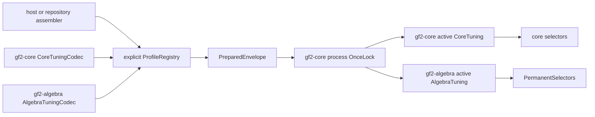

# Design: crate-owned typed tuning sections (3fa7c9d0)

Profile format 2 consists of one generic envelope and process-wide resolution
authority in `gf2-core`, with typed selector sections owned by the crate that
owns each algorithm. This document is the implementation-exact authority for
that architecture. `dev/active/7d824b2f/design.md` D4 remains a historical
record and receives the append-only supersession described in §7.3.

## Success Criteria

- [hard] REQ-01: Profile format 2 has a generic deterministic envelope in
  `gf2-core`, stable section IDs, safe erased typed codecs, explicit registry
  construction, and one atomic install-or-freeze authority.
- [hard] REQ-02: Full and subset loading, missing and skipped sections, late
  installation, resolution provenance, and one-shot subprocess tests have
  exact observable semantics.
- [hard] REQ-03: Core and algebra selector vocabulary, defaults, validation,
  codecs, accessors, baked values, and calibration components have exactly one
  crate-appropriate owner and preserve the inward dependency edge.
- [hard] REQ-04: Envelope assembly evidence and per-section measurement
  evidence compose without conflation; versions, features, artifact storage,
  and calibration locking have explicit contracts.
- [hard] REQ-05: The active flat profile and historical baked anchor migrate
  without relabeling evidence, and the final tree contains no flat reader,
  flat artifact, core permanent alias, or compatibility authority.

## 1. Decision and boundaries

`gf2-core` owns two different things, kept visibly separate:

1. the generic profile mechanism: envelope identities, canonical JSON,
   registry construction, erased codec storage, validation policy, skipped
   records, process-wide install/freeze, resolution diagnostics, and assembly
   provenance; and
2. `CoreTuning`, the typed section containing selectors for algorithms that
   `gf2-core` owns.

`gf2-algebra` owns `AlgebraTuning`, including `PermanentSelectors` and the
parallel-permanent chunk extent. It depends on the generic mechanism through
the existing `gf2-algebra -> gf2-core` edge. `gf2-core` never names an algebra
type, field, range, default, codec, receipt, or calibration action.



The envelope is not a new semantic owner. It carries opaque section documents
and process policy. Each typed codec is the sole authority that can interpret
its section document.

## 2. Stable identities and Rust API

### 2.1 Public mechanism API in `gf2-core`

The names and signatures below are normative pseudocode. Implementation may
split them across `tuning/envelope.rs`, `registry.rs`, and `active.rs`, but it
does not merge the typed core section back into the generic types.

```rust
pub const PROFILE_FORMAT_VERSION: u32 = 2;

#[derive(Clone, Copy, Debug, Eq, Ord, PartialEq, PartialOrd)]
pub struct SectionId(&'static str);

impl SectionId {
    pub const fn from_static(id: &'static str) -> Self;
    pub const fn as_str(self) -> &'static str;
}
pub trait TuningSection: Clone + Send + Sync + 'static {
    const ID: SectionId;
    type Selectors: Send + Sync + 'static;
    fn conservative() -> &'static Self;
    fn selectors(&self) -> &Self::Selectors;
}
#[cfg(feature = "tuning-profile")]
pub trait SectionCodec<T: TuningSection>: Send + Sync + 'static {
    const SCHEMA_VERSION: u32;
    fn validate_measurement(value: &MeasurementProvenance)
        -> Result<(), SectionError>;
    fn decode_body(body: CanonicalValue) -> Result<T, SectionError>;
    fn encode_body(section: &T) -> Result<CanonicalValue, SectionError>;
}
pub struct PreparedEnvelope { /* validated typed entries; private fields */ }
pub struct PreparedEnvelopeBuilder { /* typed erased sections; no serde */ }
pub struct CompiledProfileProvenance { pub artifact_id: ProfileId }
impl PreparedEnvelope {
    pub fn compiled(
        id: ProfileId,
        provenance: CompiledProfileProvenance,
    ) -> PreparedEnvelopeBuilder;
}
impl PreparedEnvelopeBuilder {
    pub fn insert<T: TuningSection>(
        self,
        section: T,
    ) -> Result<Self, ProfileError>;
    #[cfg(feature = "tuning-profile")]
    pub fn insert_measured<T, C>(
        self,
        section: T,
        measurement: MeasurementProvenance,
    ) -> Result<Self, ProfileError>
    where
        T: TuningSection,
        C: SectionCodec<T>;
    pub fn build(self) -> Result<PreparedEnvelope, ProfileError>;
}
#[cfg(feature = "tuning-profile")]
pub struct ProfileRegistryBuilder { /* BTreeMap<SectionId, erased codec> */ }
#[cfg(feature = "tuning-profile")]
impl ProfileRegistryBuilder {
    pub fn new() -> Self;
    pub fn register<T, C>(self) -> Result<Self, RegistryError>
    where
        T: TuningSection,
        C: SectionCodec<T>;
    pub fn build(self) -> Result<ProfileRegistry, RegistryError>;
}
#[cfg(feature = "tuning-profile")]
impl ProfileRegistry {
    pub fn from_json(&self, text: &str, mode: LoadMode)
        -> Result<PreparedEnvelope, ProfileError>;
    pub fn to_json(
        &self,
        prepared: &PreparedEnvelope,
        assembly: &AssemblyProvenance,
    ) -> Result<String, ProfileError>;
}
#[track_caller]
pub fn active_section<T: TuningSection>() -> ActiveSection<'static, T>;
#[track_caller]
pub fn install(prepared: PreparedEnvelope) -> Result<(), AlreadyResolved>;
pub struct ActiveSection<'a, T> {
    pub section: &'a T,
    pub resolution: SectionResolution<'a>,
}
```

`SectionId`, `TuningSection`, `PreparedEnvelope`, its compiled builder, the
provenance/diagnostic types, `active_section`, and `install` are always
available. The compiled builder safely erases concrete `TuningSection` values
with `Any` and constructs a usable in-memory envelope without serde, JSON, or
filesystem access. The always-available `insert` path records
`MeasurementProvenance::Inherited`; the profile-feature-only
`insert_measured` path records the owner-codec-validated provenance supplied by
a component. `CompiledProfileProvenance` identifies the prepared value's
in-process construction and makes no measurement claim. Such a prepared value
is encodable only when the caller separately supplies `AssemblyProvenance` and
the registry has the owner codec for every entry; encoding creates a new
canonical assembly identity rather than serializing the compiled origin.
A caller whose profile values are compiled into its binary constructs this
prepared value at startup and installs it before dispatch; baked selectors
themselves remain compile-time constants and do not call `install`.
`CanonicalValue`, `SectionCodec`, the registry, format-2 parser/encoder, and
canonical digest implementation exist only with `tuning-profile`. Parsing and
compiled construction converge on the same `PreparedEnvelope`, so the
unconditional `install` signature compiles and is useful with
`--no-default-features`.

`PreparedEnvelope` owns its `ProfileId` and a `BTreeMap<OwnedSectionId,
PreparedEntry>`. Every decoded entry holds the typed erased value, its
`TypeId`, and its `MeasurementProvenance`; parsed subset envelopes may also
hold skipped records. `insert_measured::<T, C>` is the composer path: the one
owner codec validates the supplied measurement before the typed entry is
admitted. `ProfileRegistry::to_json` returns
`ProfileError::SkippedSectionCannotEncode` for any skipped entry and
`ProfileError::UnregisteredSectionForEncoding` when a decoded entry has no
codec. It requires the registered codec to match each decoded entry's ID and
type, revalidates its measurement, re-encodes every typed value through that
codec into `CanonicalValue`, and emits sections in the map's order. Extra
registered codecs add no absent section. The encoder derives each wire section
schema from the registered erased codec's `SCHEMA_VERSION`, copies the
validated section measurement, computes the content digest, and inserts that
digest into the wire assembly object. Raw input bytes and their key order are
never reused. An encoding downcast or ID/type mismatch is
`ProfileError::RegistryInvariant`.

`CanonicalValue` is an opaque, deterministic JSON value exposed to codecs
only through constructors and typed serde adapters. It stores object
members in `BTreeMap<String, CanonicalValue>`, rejects duplicate keys, rejects
floating-point numbers, and serializes without insignificant whitespace.
Selectors are integral today; excluding floats avoids platform-dependent
spellings from entering digests.

A future mathematically non-integral selector uses a scaled integer and names
the exact unit/scale in the field, for example `error_rate_millionths`; its
codec validates the integer range and converts only at the typed API boundary.
JSON floating-point numbers, decimal-string selectors, and ad hoc codec-local
representations remain forbidden. The scaled-integer rule is canonical across
all sections, and changing a field's scale or unit changes its meaning and
therefore bumps that section's schema version.

`SectionId::from_static` validates at compile time or panics in a const context
unless the ID is non-empty lowercase kebab-case path components separated by
one `/`. IDs are wire identities, never Rust type names. The initial IDs are:

| Owner | Typed section | Stable section ID | Section schema |
|---|---|---|---|
| `gf2-core` | `CoreTuning` | `gf2-core/selectors` | 1 |
| `gf2-algebra` | `AlgebraTuning` | `gf2-algebra/permanent` | 1 |

Changing an ID is section removal plus addition and requires an envelope
migration. Changing the meaning, unit, comparison direction, or type of a
field increments that owning section's schema version. Adding an optional
field that defaults conservatively does not increment the envelope version;
the owning codec decides whether its own schema version must change.

There is intentionally one `SCHEMA_VERSION` and one owner codec per
`SectionId`. A steady-state codec accepts exactly that section version; it is
not a multi-version translator. Registry construction rejects a second codec
for the same ID even when it advertises another Rust type or version. Callers
of `insert_measured` name that same owner codec, and the registered owner codec
revalidates the entry during encode; an alternate codec is not compatibility
machinery. A version cutover regenerates canonical artifacts and removes the
superseded reader in the same migration, as `@/inv/canonical-cutover` requires.

### 2.2 Safe type erasure

`register::<T, C>()` constructs a private `TypedErasedCodec<T, C>`. Its erased
decode returns `Arc<dyn Any + Send + Sync>` and its encode performs
`Any::downcast_ref::<T>()`. Both are safe standard-library operations. A
registry entry also stores `TypeId::of::<T>()`; build rejects duplicate IDs,
duplicate type IDs, and an empty registry.

`PreparedEnvelopeBuilder::insert::<T>()` uses the same `Any` representation
without a codec: `TuningSection::ID` supplies the map key and the already-typed
constructor supplies validation. It rejects duplicate IDs and type IDs before
producing a prepared value.

No raw pointer, transmute, unchecked downcast, linker registration, inventory
crate, mutable global, or `unsafe` block is used. This is mandatory because
production unsafe code is isolated to the two kernel crates. A downcast
mismatch during parse/prepare/encode is the typed
`ProfileError::RegistryInvariant`; a mismatch reached through post-install
`active_section` means the already-installed process invariant is corrupt and
is the fatal typed-invariant panic described in §5.2.

The registry is explicit. A core-only consumer registers only `CoreTuning`.
A repository composite tool registers both types. There is no ambient plugin
registration and no dependency from the mechanism to a section owner.

### 2.3 Crate-owned typed APIs

`gf2-core` defines:

```rust
pub struct CoreTuning { selectors: CoreSelectors }
pub struct CoreSelectors { /* the 37 core fields, grouped as today */ }
#[cfg(feature = "tuning-profile")]
pub struct CoreTuningCodec;

impl TuningSection for CoreTuning {
    const ID: SectionId = SectionId::from_static("gf2-core/selectors");
    type Selectors = CoreSelectors;
    fn conservative() -> &'static Self { /* names core-owned constants */ }
    fn selectors(&self) -> &CoreSelectors;
}

#[must_use]
pub fn active() -> ActiveSection<'static, CoreTuning> {
    gf2_core::tuning::active_section::<CoreTuning>()
}
```

The existing family accessors (`bit_matrix()`, `m4rm()`, `polynomial()`, and
the other core families) remain methods on `CoreSelectors` or `CoreTuning`.
`CoreTuning` contains no `permanent` member.

`gf2-algebra` defines:

```rust
pub mod tuning {
    pub const CHUNK_SUBSETS: usize = 1 << 16;
    pub struct PermanentSelectors { gray_chunk_subsets: usize }
    pub struct AlgebraTuning { permanent: PermanentSelectors }
    #[cfg(feature = "tuning-profile")]
    pub struct AlgebraTuningCodec;
    impl PermanentSelectors {
        pub fn try_new(gray_chunk_subsets: usize) -> Result<Self, SectionError>;
        pub fn gray_chunk_subsets(&self) -> usize;
    }
    impl TuningSection for AlgebraTuning {
        const ID: SectionId =
            SectionId::from_static("gf2-algebra/permanent");
        type Selectors = PermanentSelectors;
        fn conservative() -> &'static Self { &CONSERVATIVE }
        fn selectors(&self) -> &PermanentSelectors;
    }
    #[must_use]
    pub fn active() -> ActiveSection<'static, AlgebraTuning> {
        gf2_core::tuning::active_section::<AlgebraTuning>()
    }
}
```

The real constant lives beside the algorithm in
`gf2-algebra::permanent::parallel_bipedal3`; the module may re-export it as
`gf2_algebra::tuning::CHUNK_SUBSETS`, but there is one declaration. Its range
is $1 \le t \le \texttt{usize::MAX}$, validated only by
`AlgebraTuningCodec`/`PermanentSelectors::try_new`.

## 3. Profile-format-2 wire contract

### 3.1 Example composite document

```json
{
  "profile_format_version": 2,
  "profile_id": "fraktaali-2026-08-25",
  "assembly": {
    "kind": "assembled",
    "assembled_at": "2026-08-25T19:00:00Z",
    "source_revision": "0123456789abcdef0123456789abcdef01234567",
    "source_dirty": false,
    "tool": "dev/tools/tuning-profile-compose",
    "tool_sha256": "aaaaaaaaaaaaaaaaaaaaaaaaaaaaaaaaaaaaaaaaaaaaaaaaaaaaaaaaaaaaaaaa",
    "content_sha256": "bbbbbbbbbbbbbbbbbbbbbbbbbbbbbbbbbbbbbbbbbbbbbbbbbbbbbbbbbbbbbbbb"
  },
  "sections": {
    "gf2-algebra/permanent": {
      "schema_version": 1,
      "measurement": {
        "kind": "calibrated",
        "measured_at": "2026-08-25T17:30:00Z",
        "source_revision": "0123456789abcdef0123456789abcdef01234567", "source_dirty": false,
        "harness": "crates/gf2-algebra/benches/tuning_calibration.rs",
        "harness_schema": "algebra-tuning-calibration-v1",
        "binary_sha256": "cccccccccccccccccccccccccccccccccccccccccccccccccccccccccccccccc",
        "receipt": "dev/benchmarks/tuning_profiles/algebra-receipt.md"
      },
      "selectors": {
        "permanent": { "gray_chunk_subsets": 65536 }
      }
    },
    "gf2-core/selectors": {
      "schema_version": 1,
      "measurement": { "kind": "inherited" },
      "selectors": {
        "bit_backend": { "simd_min_words": 8 },
        "polynomial": {
          "karatsuba_min_degree": 32, "karatsuba_max_out_len": 128,
          "div_rem_fast_min_len": 2048, "subproduct_min_len": 4096,
          "interpolate_fast_min_points": 16
        }
      }
    }
  }
}
```

The abbreviated core `selectors` object above illustrates the shape; a
committed conservative core section is the complete deterministic projection
of all 37 core fields. A calibrated section may omit unmeasured fields; its
codec resolves those fields to crate-owned conservative defaults.

### 3.2 Deterministic encoding and digests

The encoder pins top-level field order to
`profile_format_version`, `profile_id`, `assembly`, `sections`; assembly field
order to the example above; and section wrapper field order to
`schema_version`, `measurement`, `selectors`. All extensible maps, including
`sections`, selector-family maps, and selector maps, are `BTreeMap`s and emit
lexicographically. Output is UTF-8, compact JSON, with one trailing newline.
`ProfileRegistry::to_json` is the only envelope encoder. Section codecs return
typed `CanonicalValue`, not text or bytes, so a parsed or composed typed value
is re-canonicalized under these rules on every encode.

`assembly.content_sha256` is SHA-256 over the canonical compact encoding of
the three-member value
`{profile_format_version, profile_id, sections}`. It intentionally excludes
the complete `assembly` object, avoiding a self-digest and keeping assembly
metadata distinct from the payload identity. Parsing recomputes and compares
the digest before any codec runs.

A skipped record is:

```rust
pub struct SkippedSection {
    pub id: OwnedSectionId,
    pub canonical_raw_sha256: Sha256,
}
```

Its digest is SHA-256 over that section wrapper's canonical raw JSON value,
including `schema_version`, `measurement`, and `selectors`, but not the ID map
key. Canonical raw means the generic parser reorders object keys and validates
JSON without asking a section codec to understand the section. Skipped bytes
therefore remain attributable even when the codec or schema is unknown.

## 4. Registry validation and load modes

```rust
pub enum LoadMode {
    StrictFull,
    ExplicitSubset { required: BTreeSet<SectionId> },
}
```

Both modes first reject malformed JSON, duplicate keys, an envelope version
other than 2, an invalid envelope identity or assembly-provenance token, or a
mismatched content digest. Section measurement provenance is interpreted only
for decoded sections. Validation then follows this table.

| Condition | `StrictFull` | `ExplicitSubset` |
|---|---|---|
| IDs decoded | Every present wire ID | Exactly the caller's non-empty `required` set |
| Required ID not registered | Not applicable | `UnregisteredRequiredSection` |
| Requested section absent | Not applicable | `MissingRequiredSection` |
| Wire-ID relation to registry | Wire IDs must be a subset of registered IDs | Requested IDs must be registered; other present IDs need not be |
| Present unregistered/unknown ID | `UnexpectedSection`; reject | Record ID + canonical raw SHA-256; do not decode |
| Registered and present | Validate version, provenance, body, and range | Decode only when requested; otherwise record as skipped |
| Registered but absent | Valid; later typed access defaults | Valid unless requested; later typed access defaults |
| Decoded section schema unsupported | Reject before selector decoding | Reject before selector decoding |
| Skipped section schema unsupported | Not applicable | Allowed and recorded by raw digest |
| Any decoded codec/range error | Reject whole envelope | Reject whole envelope |

The subset set is a `BTreeSet`, so duplicate caller IDs are unrepresentable;
an empty set is `EmptyRequiredSubset`. No implicit "all known" subset exists.
Callers spell out every section whose semantics they intend to accept.

The `StrictFull` algorithm iterates the wire `sections` map. For each present
ID it requires a registered codec, checks that codec's section version and
measurement token, and decodes the body. It does not iterate registry IDs to
require presence: an envelope containing only `gf2-core/selectors` is a valid
strict-full input even when the registry also knows the algebra codec.

The `ExplicitSubset` algorithm first verifies that every requested ID is
registered and present. It decodes exactly those IDs. For every other present
wire entry—whether registered or unknown—it stores `SkippedSection { id,
canonical_raw_sha256 }` without interpreting its version, provenance, or body.
The errors `UnregisteredRequiredSection` and `MissingRequiredSection` therefore
belong only to `ExplicitSubset`; `UnexpectedSection` belongs only to
`StrictFull`.

Presence, absence, and skipping are intentionally asymmetric:

- An installed envelope that contains no entry for section $S$ permits access
  to $S$ and yields `T::conservative()` with `DefaultedMissing`. Absence makes
  no claim about $S$. This holds whether or not a codec for $S$ participated
  in parsing; `TuningSection` supplies the stable ID and conservative value.
- An installed envelope that contains $S$ but whose subset load skipped it
  makes access to $S$ fatal. The document made a claim, and silently replacing
  that claim with a default would erase operator intent and provenance.

A decoded section is necessarily registered because only a registered codec
can produce it. Codec registration governs decoding of present bytes, not the
ability to use a crate-owned conservative value for absent bytes.

This is not partial application. Every section selected for decoding validates
before a `PreparedEnvelope` exists; installation moves the whole prepared
value into the one process cell.

## 5. Install, freeze, access, and errors

### 5.1 One process state machine

```rust
static PROCESS_TUNING: OnceLock<ProcessTuning> = OnceLock::new();

enum ProcessTuning {
    Installed {
        at: ResolutionSite,
        profile_id: ProfileId,
        entries: BTreeMap<OwnedSectionId, PreparedEntry>,
        origin: PreparedOrigin,
    },
    FrozenBeforeInstall {
        at: ResolutionSite,
    },
}

enum PreparedOrigin {
    CanonicalEnvelope(VerifiedAssembly),
    Compiled(CompiledProfileProvenance),
}

enum PreparedEntry {
    Decoded(ErasedSection),
    Skipped(SkippedSection),
}
```

`T::conservative()` returns a crate-owned static reference, so missing and
pre-install defaults need no allocation, lock, or second cache. Installed
erased sections are owned by the process cell for the rest of the process.

Both `install` and `active_section` are `#[track_caller]`. The transition out
of `Unresolved` stores the caller's file, line, and column as `ResolutionSite`
with cause `Installed` or `FirstAccess { section_id }`. A late install is a
hard, inspectable error:

```rust
pub struct AlreadyResolved {
    pub first_resolution: ResolutionSite,
}
```

It is never downgraded to a warning, boolean, or idempotent success. A
calibration producer propagates it from `main`, prints the first-resolution
site, emits no artifact, and exits nonzero.

### 5.2 Per-section resolution provenance

```rust
pub enum SectionResolution<'a> {
    Installed {
        profile_id: &'a ProfileId,
        section_id: SectionId,
        measurement: &'a MeasurementProvenance,
    },
    DefaultedMissing {
        profile_id: &'a ProfileId,
        section_id: SectionId,
    },
    FrozenBeforeInstall {
        section_id: SectionId,
        first_resolution: ResolutionSite,
    },
}
```

| Process state and section | Access result | Resolution |
|---|---|---|
| Installed and decoded | Typed installed section | `Installed` |
| Installed and absent, codec registered or not | Owning type's conservative section | `DefaultedMissing` |
| Installed and skipped | Fatal `SkippedSectionAccess` with ID and digest | No value |
| Frozen before any install | Owning type's conservative section | `FrozenBeforeInstall` |
| Type/ID mismatch | Fatal `ActiveSectionInvariant` panic | No value |

Access looks up `T::ID` once. A decoded entry is downcast and returned; a
skipped entry is fatal. No entry means the wire section was absent, so the
accessor returns `T::conservative()` with `DefaultedMissing`; it does not
consult a record of parser registrations. Thus a core-only installed envelope
followed by `active_section::<AlgebraTuning>()` defaults even when the registry
was core-only. A present algebra entry could only be decoded by an algebra
codec or retained as skipped, so it can never fall through to the absent case.

"Fatal" means a dedicated panic from `active_section` because production
selection accessors cannot return `Result` without infecting every algorithm
API. `SkippedSectionAccess` contains the stable ID and raw digest;
`ActiveSectionInvariant` contains the ID and expected/stored type identities.
Both payloads implement `Display`, and tests assert the typed payload rather
than prose formatting.

No public reset API and no test-only alternate global exists. Resettable state
would test a different lifecycle from production.

## 6. Provenance, features, storage, and composition

### 6.1 Two evidence layers

`AssemblyProvenance` is the composer-supplied encode input and describes only
the act that combines typed section values:

```rust
pub struct AssemblyProvenance {
    pub assembled_at: Rfc3339Utc,
    pub source_revision: GitRevision,
    pub source_dirty: bool,
    pub tool: RepoRelPath,
    pub tool_sha256: Sha256,
}

pub struct VerifiedAssembly {
    pub provenance: AssemblyProvenance,
    pub content_sha256: Sha256,
}
```

It never says that a selector was measured. `AssemblyProvenance` deliberately
does not accept a caller-provided content digest. `ProfileRegistry::to_json`
takes the `ProfileId`, ordered typed entries, and per-entry
`MeasurementProvenance` from `PreparedEnvelope`; it takes the assembly fields
above from the separate argument, re-canonicalizes the entries as §2.1 fixes,
computes `content_sha256`, and emits wire `kind: "assembled"`. Parsing verifies
the digest and retains the pair as `VerifiedAssembly` in the prepared origin.

Each section wrapper contains `MeasurementProvenance` owned semantically by
that section codec:

```rust
pub enum MeasurementProvenance {
    Inherited,
    Calibrated {
        measured_at: Rfc3339Utc,
        source_revision: GitRevision,
        source_dirty: bool,
        harness: RepoRelPath,
        harness_schema: HarnessSchema,
        binary_sha256: Sha256,
        toolchain: String,
        host: String,
        cpu_model: String,
        cpu_features: Vec<String>,
        os_kernel: String,
        governor: String,
        receipt: RepoRelPath,
    },
}
```

Common token types remain in `gf2-core`; a codec may add section-specific
measurement fields inside its body. Composition copies section provenance
unchanged. It cannot promote `Inherited` to `Calibrated`, rewrite a receipt,
or merge two measurements into one section without that section owner's
calibration component doing so.

`HarnessSchema` validates the lexical shape of a measurement-behavior identity
but has no globally hard-coded supported value. Each `SectionCodec` owns the
accepted harness token or tokens for its calibrated section through
`validate_measurement`; an inherited section has no harness token to validate.
After checking the wrapper's section schema and before decoding selectors, the
erased adapter parses common provenance and asks that codec to validate it.
An unsupported calibrated token is
`UnsupportedHarnessSchema { section_id, found, supported }` for that section.
Envelope format 2 and section schema 1 therefore say nothing by themselves
about calibration behavior.

Envelope version rejection happens before registry logic. For each decoded
section, the erased adapter reads only `schema_version`, compares it to
`C::SCHEMA_VERSION`, and returns `UnsupportedSectionSchemaVersion { id,
found, supported }` before provenance or selector decoding. Envelope version,
section version, and harness-schema errors are distinct enum variants and
tests. The inherited conservative intermediate in §7.1 is a format-2
container with inherited values; it is not labeled calibrated and does not
claim a version-2 measurement behavior.

### 6.2 Feature and dependency layout

| Crate/area | Feature | Additional dependencies | Default? | Contents |
|---|---|---|---|---|
| `gf2-core` | always | none for tuning | yes | IDs, typed-section trait, prepared/compiled builder, process cell, install/active access, conservative core values |
| `gf2-core` | `tuning-profile` | optional `serde`, `serde_json`, `sha2` | no | canonical JSON, registry/codecs, envelope validation, digesting |
| `gf2-algebra` | always | existing `gf2-core` | yes | `AlgebraTuning`, `PermanentSelectors`, range/default/accessor, baked constants |
| `gf2-algebra` | `tuning-profile` | `gf2-core/tuning-profile`, optional `serde` | no | `AlgebraTuningCodec`, section calibration serialization |
| repository dev tool | explicit features | both crate profile features | n/a | composite assembly and validation |

The existing algebra `serde` feature may share the dependency, but
`tuning-profile` is separately named and non-default; enabling selector codecs
does not promise serde support for unrelated packed types. A no-default-feature
build can use conservative access or install a programmatically compiled
`PreparedEnvelope`; it cannot parse or emit JSON. No production crate gains a
reverse dependency, build script, environment lookup, filesystem scan, or
build-time profile input.

Serde implementations for always-available tuning types are themselves gated
by `tuning-profile`. Cargo feature unification may activate the optional serde
dependency through another feature such as core `io`, but that does not expose
the profile parser, codecs, registry, or serde implementations unless
`tuning-profile` is explicitly enabled.

### 6.3 Storage and calibration composition

Crate-owned component artifacts live under:

- `crates/gf2-core/data/tuning-sections/<section-id-safe-name>.json` for core;
- `crates/gf2-algebra/data/tuning-sections/<section-id-safe-name>.json` for
  algebra.

Repository-level complete envelopes live at
`dev/reference_data/tuning-profiles/<profile-id>.json`. This is the canonical
committed reference/composite input location. A caller that wants one of these
profiles reads it explicitly and supplies its text to the registry; it is not
packaged production runtime data, auto-discovered, or selected by a library.
Owner crates compile conservative defaults and scan no filesystem. The
conservative reference envelope is projected there, while crate-level tests
compare each conservative component to its compiled table.

Each crate owns a calibration component that returns a validated typed section
plus `MeasurementProvenance`; it neither installs a process profile nor writes
a composite artifact. A dev-only repository composer invokes selected
components, adds their results with
`PreparedEnvelopeBuilder::insert_measured::<T, OwnerCodec>`, builds one
registry, and calls `registry.to_json(&prepared, &assembly_provenance)`. The
encoder re-canonicalizes every typed section and computes the digest before the
composer writes one absent output path atomically.

The composer and each top-level component remain parent processes and do not
install a profile into themselves: one installation would prevent the several
forced variants a sweep needs. Every forced measurement uses
`fresh_tuning_process` to start a child that constructs or parses one prepared
envelope, installs it exactly once before any dispatch, and asserts
`SectionResolution::Installed` for every steered section. A late install,
skipped-present access, `DefaultedMissing`, or `FrozenBeforeInstall` is fatal;
the child exits nonzero and contributes no timing or selected value. This is
the steering contract for the core sweeps in `389aa4de`, `eaae1b56`, and
`dbd8787d`, and for both the 11 core extents and one algebra extent in
`a83583e0`.

The parent treats a nonzero child, absent structured result, or non-installed
resolution as a hard calibration failure. It exits nonzero and emits neither a
section component nor a composite artifact.

The outer invocation acquires `dev/scripts/ccx1-bench-flock.sh` once for the
whole composite run. Inner core/algebra components never acquire the lock.
Core-only calibration uses the same outer wrapper and registers only the core
codec. Calibration remains an explicit `GF2_BENCH=1` action and never a Cargo
build side effect.

## 7. Canonical migration and current inventory

### 7.1 Migration data and historical evidence

The migration inputs have distinct evidentiary roles:

| Current path | Current identity | Format-2 disposition |
|---|---|---|
| `crates/gf2-core/data/tuning-profiles/conservative.json` | Flat complete inherited projection | Replace it with `dev/reference_data/tuning-profiles/conservative.json`, a clean format-2 inherited, core-only envelope; no algebra claim |
| `crates/gf2-core/data/tuning-profiles/gf2-5ecc9bf8-calibration-e202c080.json` | Exact calibrated v1 bytes, SHA-256 `674eea65379d1c814cd54584ad1ea4517fc3f2adbef3d5229d58593e9aad63bb` | Move exact bytes to `dev/archive/3fa7c9d0/tuning-profiles/` only while a baked/evidence reader needs them; never relabel them format 2 |
| `dev/benchmarks/tuning_profiles/2026-08-20-host-calibration.md` | Measurement receipt quoting the v1 output | Preserve every existing byte and append a supersession section pointing to the new artifact |

The clean intermediate canonical reference envelope is inherited and core-only even
though its core values equal today's conservative table. It does not borrow
the v1 calibration's identity, host, timestamp, harness digest, or receipt.
Callers supply it explicitly until `389aa4de` emits a calibrated format-2 core
section; owner crates still compile their defaults and do not discover it.

At the format-2 cutover, `389aa4de`'s five-field core sweep is expected to omit
32 of the 37 core fields. This is a migration expectation, not a maintained
schema constant; the harness derives and prints the complement from the core
codec. `a83583e0` owns twelve extent sweeps split as 11 core fields plus one
algebra field, so it consumes both calibration components through the composer.

Baked-value tests do not treat the inherited intermediate envelope as
calibration. Until a measured format-2 section supersedes the anchor, each baked
test cites the historical artifact path and SHA-256 above together with its
unchanged receipt. Once the last such reader cites superseding measurement, the
archived v1 bytes may be removed if Git history plus the receipt citation is
sufficient; existing receipt content remains byte-for-byte and supersession is
append-only.

### 7.2 Symbol and reader cutover inventory

| Current authority/reader | Required final state |
|---|---|
| `gf2_core::tuning::TuningProfile` flat struct | Split into generic envelope/process types and `CoreTuning`; no flat alias |
| `SelectorFamilies` aggregate | Rename/scope to `CoreSelectors`; remove `permanent` member |
| `PermanentSelectors` in `gf2-core` | Delete; define only in `gf2-algebra::tuning` |
| `PERMANENT_GRAY_CHUNK_SUBSETS_DEFAULT` in `gf2-core` | Delete; `CHUNK_SUBSETS` in algebra is the declaration |
| `ProfileFamily::Permanent` and permanent field vocabulary in core | Delete from core error/schema vocabulary |
| `TuningProfile::permanent()` | Delete with no deprecated forwarding method |
| Flat `from_json`/`to_json` and serde mirror structs in `tuning/mod.rs` | Replace by envelope registry plus core codec |
| `ACTIVE: OnceLock<TuningProfile>` | Replace once by `PROCESS_TUNING`; no parallel algebra cell |
| `parallel_bipedal3::permanent_chunk_len` | Read `gf2_algebra::tuning::active()` |
| Two algebra installed-profile integration binaries | Rebuild through `fresh_tuning_process` and the algebra codec |
| Core unit tests enumerating permanent alongside core families | Move permanent range/round-trip/default cases to algebra; core canonical inventory has only core fields |
| `tuning_calibration.rs` flat builder/omission/serializer | Emit a core component; schema complement is registry/section aware |
| `tuning_calibration_harness.rs` and committed-profile tests | Read format 2, assert envelope and section versions separately |
| `tuning/baked.rs` profile reader | Read measured core section or cite historical anchor; algebra baked values stay in algebra |
| Every `crates/gf2-core/tests/tuning_profile_*` binary | Use core typed builders/codec and `fresh_tuning_process` where install order matters |
| `scripts/cargo-ci.sh` baked step | Invoke crate-owned baked witnesses; no flat-profile grep or parser |

The prose sweep includes module rustdoc in `gf2-core::tuning`,
`parallel_bipedal3.rs`'s chunk-tuning section and `CHUNK_SUBSETS` rustdoc, the
two permanent integration-test module docs, `220cab0b` and `7d824b2f`,
`389aa4de/receipt-notes.md`, current calibration harness docs, classification
rows that name core ownership, and the epic progress/handoff decision record.
Historical documents receive append-only amendments; permanent crate rustdoc
describes only the resulting present-tense API.

The final static sweep fails on active production matches for:

```text
PERMANENT_GRAY_CHUNK_SUBSETS_DEFAULT
gf2_core::tuning::PermanentSelectors
TuningProfile::permanent
selectors.permanent
root "schema_version":1 followed by root "profile_id" at a profile reader
crates/gf2-core/data/tuning-profiles/*.json
```

The historical archive and appended supersession citations are explicitly
excluded by path. There is no temporary v1 reader, dual-write, re-export,
deprecated alias, or `#[allow(dead_code)]` compatibility residue on final
main.

### 7.3 Dependent issue amendments

| Issue/design | Amendment or dependency |
|---|---|
| `220cab0b` | Append that format 2 supersedes its flat artifact/API while preserving install-based, non-ambient resolution and explicit calibration principles |
| `7d824b2f` | Append that this design supersedes D4/D5 for ownership; per-field mechanism and amortisation decisions remain |
| `389aa4de` | Depend on the format-2 cutover; use the core component, expect derived 32/37 omissions, emit calibrated core measurement provenance, and append receipt supersession |
| `eaae1b56` | Sweep only core-owned threshold fields in the core component; it never writes algebra vocabulary |
| `a83583e0` | Split its twelve extents into 11 core plus one algebra and compose them under the one outer lock |
| `dbd8787d` | Use the core typed steering/component for its three seam fields and preserve section-local omission rules |

`eaae1b56`, `a83583e0`, and `dbd8787d` remain downstream of the format-2
cutover through their calibration/assembly dependencies. The tracker DAG, not
this table, remains sequencing authority.

## 8. Test matrix

### 8.1 `fresh_tuning_process`

All order-sensitive integration tests and calibration forced-child launches
must use `fresh_tuning_process(case: FreshProcessCase)`. The private sentinel
is exactly `GF2_TUNING_FRESH_CASE=child-v1`. For integration tests the helper
launches the current test binary with
`--exact fresh_tuning_process_child --nocapture`, sets that sentinel only on
the child command, and writes the
canonical compact JSON encoding of `FreshProcessCase` to the child's stdin.
The sentinel is the only ambient input the child protocol consults; case data
never travels in an environment variable. Calibration cases use the same
sentinel-and-stdin protocol with the current calibration executable's private
child mode. The calibration parent checks `GF2_BENCH=1` before spawning; child
mode does not consult it or any other ambient case input.

The `fresh_tuning_process_child` test entry checks the sentinel before reading
stdin or touching tuning state and returns `Ok(())` immediately when it is
absent; any value other than `child-v1` is a protocol error. When the exact
sentinel is present, it reads exactly one canonical case, performs exactly one
lifecycle or forced-dispatch scenario, and prints one canonical JSON result
line prefixed exactly `GF2_TUNING_RESULT=` for the parent. Its `run_child` path
cannot call `fresh_tuning_process`, and `FreshProcessCase` contains no
spawn-child variant, so recursive child creation is unrepresentable. Ordinary
suite execution runs the entry as a no-op.

The helper is mandatory even under nextest for every test whose observation
depends on install/freeze order. Nextest's process-per-test behavior is never
load-bearing: the parent test touches no process tuning state and asserts only
the spawned child's structured result. The same tests therefore retain their
semantics under plain `cargo test`, where several parent tests and the no-op
child entry may share one test-binary process. No reset hook, serial-test
mutex, alternate global, or fork-after-threads technique is accepted.

| Area | Case | Expected observation |
|---|---|---|
| Registry | duplicate stable ID/type/version codec | build error; no second codec serves as a translator |
| Envelope | version 1, 3, max | explicit unsupported envelope version |
| Section | decoded core/algebra version 0, 2, max | reject before provenance/selector decode |
| Provenance | calibrated section has unknown harness token | owning codec rejects it; a different section's codec may accept a different token |
| Determinism | keys reordered on input then typed value encoded | one pinned output and stable content digest; raw ordering is not reused |
| Assembly encode | typed prepared entries plus caller assembly provenance | wire digest is computed by the encoder; caller cannot inject it |
| Encode | prepared subset contains a skipped entry | `SkippedSectionCannotEncode` |
| Encode invariant | registered codec and erased type disagree | typed `RegistryInvariant`, not a panic |
| Active invariant | installed entry and requested type disagree | fatal typed-invariant panic |
| Raw JSON | duplicate key or float | reject before codec |
| Future non-integral | scaled integer with unit-bearing field name | canonical round trip; float, decimal string, and codec-local variant reject |
| Child guard | `GF2_TUNING_FRESH_CASE` absent | child entry returns `Ok(())` without reading stdin or resolving tuning |
| Child protocol | sentinel is `child-v1` and stdin holds one canonical case | execute once, emit one `GF2_TUNING_RESULT=` line, never recurse |
| Runner | same order-sensitive cases under nextest and plain `cargo test` | both use the helper child; runner isolation changes no semantics |
| Strict full | core+algebra present and registered | validate and install both |
| Strict full | core present, registered algebra absent | valid; algebra access is `DefaultedMissing` |
| Strict full | core present, no algebra codec, algebra absent | valid; algebra access is `DefaultedMissing` |
| Strict full | no sections present | valid; any typed access is `DefaultedMissing` |
| Strict full | present unknown/unregistered section | `UnexpectedSection` |
| Subset | required core present, algebra present but not required | algebra skipped record has canonical digest; algebra access is fatal |
| Subset | unrequested present section has unsupported schema/token | load succeeds, raw digest is recorded, and later access is fatal |
| Subset | required core present, algebra absent | algebra access returns conservative with `DefaultedMissing` |
| Subset | empty required set | `EmptyRequiredSubset` |
| Subset | required ID absent/unregistered | load error |
| Freeze | core access before install | core conservative, `FrozenBeforeInstall`, caller site captured |
| Late install | after first access | hard `AlreadyResolved` carries same site |
| Install order | install before access | `Installed` for present sections |
| Missing | install core-only then algebra access | algebra conservative and `DefaultedMissing` |
| Compiled install | no profile/serde feature, typed core section present | install succeeds and core resolution is `Installed` |
| Calibration | intentional early access or late install | child exits nonzero and contributes no result |
| Calibration | core forced child for `389`/`eaae`/`dbd` | exactly one install precedes dispatch; every steered core resolution is `Installed` |
| Calibration | each `a835` core or algebra extent child | every section that child steers is `Installed`; no default or skipped section is timed |
| Ownership | algebra chunk values 3 and 4,000,000 | production callee observes each; permanent output identical |
| Defaults | no install | every selector equals its crate-owned declaration |
| Baked | default and `gf2_tuning_baked` | crate selection sites use crate-owned constants and cited measured anchor |
| Features | each crate default/no-default/all profile features | codecs absent by default, active typed access always present |

Semantic family route tests remain beside their owning crate. The envelope
suite tests stable external representation exactly once; other tests assert
relationships rather than repeating complete field inventories.

## 9. Hot-path cost shape

`active_section::<T>()` performs one acquire load from the process `OnceLock`,
one lookup by stable `SectionId` in a small immutable `BTreeMap`, and, for an
installed value, one safe `Any` downcast. It never allocates or locks.
Selection code reads the returned typed section once at the existing
non-recursive public-operation boundary and threads values through inner loops,
preserving `7d824b2f` §2.3 and its ratified amortisation rule.

Baked selectors perform none of these operations. Each baked constant remains
in its algorithm-owning crate and its selection site remains a compile-time
choice. The envelope is evidence for baked values, not their runtime source.

If profiling later shows the ID lookup material, a safe typed cache may memoize
a pointer only after calling the central accessor; it may not introduce a
second install/freeze authority. That optimization is outside this cutover and
requires benchmark evidence.

## 10. Ordered implementation plan

1. Add generic stable IDs, canonical value/digest support, registry builder,
   single-version owner codecs, envelope wire types, typed re-encoding, load
   modes, and exhaustive parser tests in `gf2-core` behind the non-default
   feature. Fix scaled integers with unit-bearing field names as the only
   non-integral selector representation. Do not change selection readers yet.
2. Add always-available `PreparedEnvelope` compiled construction,
   `PROCESS_TUNING`, tracked resolution sites, typed active access, resolution
   provenance, fatal skipped access, and `fresh_tuning_process` with its exact
   sentinel/stdin guard; establish failing lifecycle tests under both nextest
   and plain `cargo test` before replacing `ACTIVE`.
3. Define `CoreTuning`/`CoreSelectors` and `CoreTuningCodec`; convert core
   selectors, builders, core route tests, and core calibration component.
4. Define `AlgebraTuning`, `PermanentSelectors`, codec, range, active accessor,
   and calibration component in `gf2-algebra`; move `CHUNK_SUBSETS` ownership
   and permanent tests in the same change.
5. Add the dev-only composer and repository composite validation under the
   outer host lock. Assemble through typed measured entries and
   `ProfileRegistry::to_json`; cover core-only and core+algebra assembly.
6. Replace the active conservative flat file with the clean inherited
   format-2 core-only envelope. Preserve exact v1 calibrated bytes at a
   historical path only while cited readers need them; update baked readers
   to name the historical digest rather than infer calibration from the new
   envelope.
7. Convert all remaining flat readers, committed fixtures, CI baked witnesses,
   and calibration omission derivation. Delete v1 serde mirrors and flat API
   in the same cutover; do not land an intermediate compatibility reader.
8. Append supersession amendments to `220cab0b`, `7d824b2f`, the host receipt,
   and the epic decision record. Amend the four dependent issue contracts and
   dependency edges under their own JIT-state commits.
9. Run the final symbol/artifact/prose sweep, crate feature matrix, focused
   subprocess suite, workspace CI contract, and independent code/doc review.
   Any defect found is fixed in the cutover or tracked before completion.

Steps 1 and 2 may be one mechanism issue. Steps 3 and 4 can be separate worker
issues after the mechanism API is fixed, but the canonical cutover step that
deletes v1 does not merge until both owners and every reader are ready.

## 11. Rejected alternatives

| Alternative | Reason rejected |
|---|---|
| Keep permanent vocabulary in `gf2-core` | Violates algorithm ownership and library-first generality even though the dependency arrow remains legal |
| Add a second algebra profile/global | Creates two authorities and cannot give one atomic process configuration |
| Add a neutral production tuning crate | Forces a new dependency below `gf2-core`, contrary to its no-workspace-production-dependency boundary |
| Make the envelope enum know every section | Reintroduces core ownership of outward crate vocabulary and requires core releases for algebra additions |
| Linker/inventory registration | Ambient, platform-sensitive registration obscures the exact accepted section set |
| Raw `serde_json::Value` at access sites | Erases typed validation and moves parsing to algorithm crates' hot paths |
| Unsafe erased storage | Forbidden outside kernel crates and unnecessary with `Any` |
| Silently default a skipped present section | Erases an explicit document claim and its provenance |
| Reject every absent registered section | Prevents core-only profiles and future crate composition; absence is the designed conservative-default signal |
| Keep simultaneous codecs for old and current section versions | Creates steady-state compatibility machinery and makes one ID ambiguous; a version cutover replaces its artifact and reader atomically |
| Encode non-integral selectors as JSON floats or decimal strings | Floats undermine canonical spelling and decimal strings create a second numeric convention; scaled integers with unit-bearing names are the repository convention |
| Depend on nextest process-per-test isolation | Does not preserve lifecycle semantics under plain `cargo test`; every order-sensitive case uses the explicit fresh-process protocol |
| Accept v1 and v2 in one production reader | Leaves a compatibility authority with no removal need after an atomic repository cutover |
| Relabel the v1 calibrated artifact as v2 | Falsifies the measured bytes, harness identity, and schema the receipt records |
| Copy v1 calibrated values into the inherited intermediate envelope | Makes inherited data appear measured and detaches values from their original provenance |
| Dynamically read baked constants from the envelope | Changes compile-time/hot-loop mechanisms fixed by `7d824b2f` |
| Let each calibration component lock independently | Risks deadlock or interleaving and fails to hold one host exclusion across the composite run |

## 12. Authority and risks

DEC-W in the epic progress record is the ownership authority: algorithm-owning
crates own vocabulary, defaults, validation, codecs, baked values, and
calibration logic; `gf2-core` owns the generic mechanism and its own section.
This rule governs conflicts with D4, DEC-B10 item 2, and DEC-B11. The normative
freeze, subset, resolution, provenance, and version contracts are stated in
§§2–6.

| Risk | Containment |
|---|---|
| First selection happens before intended install | `#[track_caller]` freeze record, hard late-install error, producer nonzero exit, subprocess tests |
| Subset load hides an unhandled section | Present-but-skipped access is fatal and includes canonical raw digest |
| Envelope provenance is mistaken for measurement | Separate types and wire locations; composer copies section measurement unchanged |
| Unknown schema reaches selector decoding | Envelope check precedes registry; section adapter checks version before codec body |
| Canonical JSON/digest drifts | One pinned representation suite, `BTreeMap`s, duplicate/float rejection, fixed field order |
| Composer bypasses typed canonical encoding | `to_json` accepts prepared typed entries, requires their owner codecs, and recomputes canonical bodies and the digest |
| Child entry recurses or mutates state in ordinary runs | Exact private sentinel, stdin case payload, no spawn case, and absent-token no-op tested with both runners |
| Old receipt loses its evidentiary meaning | Preserve receipt and exact artifact bytes where needed; append supersession only |
| Core/algebra counts become stale prose | Counts are migration expectations; tools derive inventories from codecs and print them |
| Generic access adds material overhead | One read per public operation, values threaded inward; profile before any cache change |
| Feature unification accidentally enables codecs | Both crates name non-default `tuning-profile`; feature-matrix tests inspect the public surface |

## 13. Criterion map

| Criterion | Design sections | Verification anchor |
|---|---|---|
| REQ-01 | §§1–4 | API pseudocode, stable-ID/one-codec rules, safe erasure, typed canonical encoding, scaled-integer convention, registry/load validation |
| REQ-02 | §§4–5, §8 | asymmetry table, state machine, phase-specific invariants, tracked error, resolution enum, exact guarded subprocess matrix |
| REQ-03 | §§1–2.3, §§7.2–7.3 | crate-owned API, symbol/reader/prose inventory, dependency amendments |
| REQ-04 | §§3, 6, 8 | JSON example, encoder-owned digest, assembly input, two provenance layers, version rejection, feature/storage layout, composite lock |
| REQ-05 | §7, §10 | clean inherited envelope, exact v1 digest treatment, append-only supersession, ordered no-compatibility cutover |
