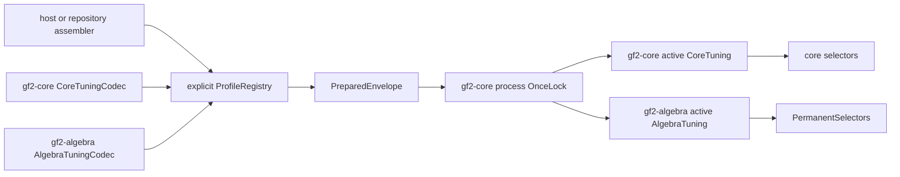

# Design: crate-owned typed tuning sections (3fa7c9d0)

This design fixes the canonical cutover from the flat, core-owned tuning
profile to profile format 2: one generic envelope and process-wide resolution
authority in `gf2-core`, with typed selector sections owned by the crate that
owns each algorithm. It supersedes the durable ownership decision in
`dev/active/7d824b2f/design.md` D4 without rewriting that historical record.

The architecture is owner-approved. The independent architecture review
recorded on issue `3fa7c9d0` passed after the design direction added
freeze-site diagnostics, subprocess-isolated one-shot tests, per-section
resolution provenance, assembly provenance, and explicit section-version
rejection. This document makes that reviewed direction implementation-exact.

## Success Criteria

- [hard] REQ-01: Profile format 2 has a generic deterministic envelope in
  `gf2-core`, stable section IDs, safe erased typed codecs, explicit registry
  construction, and one atomic install-or-freeze authority.
- [hard] REQ-02: Full and subset loading, missing and skipped sections, late
  installation, resolution provenance, and one-shot subprocess tests have
  exact observable semantics.
- [hard] REQ-03: Core and algebra selector vocabulary, defaults, validation,
  codecs, accessors, baked values, and calibration components have exactly one
  crate-appropriate owner and preserve the inward dependency edge.
- [hard] REQ-04: Envelope assembly evidence and per-section measurement
  evidence compose without conflation; versions, features, artifact storage,
  and calibration locking have explicit contracts.
- [hard] REQ-05: The active flat profile and historical baked anchor migrate
  without relabeling evidence, and the final tree contains no flat reader,
  flat artifact, core permanent alias, or compatibility authority.

## 1. Decision and boundaries

`gf2-core` owns two different things, kept visibly separate:

1. the generic profile mechanism: envelope identities, canonical JSON,
   registry construction, erased codec storage, validation policy, skipped
   records, process-wide install/freeze, resolution diagnostics, and assembly
   provenance; and
2. `CoreTuning`, the typed section containing selectors for algorithms that
   `gf2-core` owns.

`gf2-algebra` owns `AlgebraTuning`, including `PermanentSelectors` and the
parallel-permanent chunk extent. It depends on the generic mechanism through
the existing `gf2-algebra -> gf2-core` edge. `gf2-core` never names an algebra
type, field, range, default, codec, receipt, or calibration action.



The envelope is not a new semantic owner. It carries opaque section documents
and process policy. Each typed codec is the sole authority that can interpret
its section document.

## 2. Stable identities and Rust API

### 2.1 Public mechanism API in `gf2-core`

The names and signatures below are normative pseudocode. Implementation may
split them across `tuning/envelope.rs`, `registry.rs`, and `active.rs`, but it
does not merge the typed core section back into the generic types.

```rust
pub const PROFILE_FORMAT_VERSION: u32 = 2;

#[derive(Clone, Copy, Debug, Eq, Ord, PartialEq, PartialOrd)]
pub struct SectionId(&'static str);

impl SectionId {
    pub const fn from_static(id: &'static str) -> Self;
    pub const fn as_str(self) -> &'static str;
}
pub trait TuningSection: Clone + Send + Sync + 'static {
    const ID: SectionId;
    type Selectors: Send + Sync + 'static;
    fn conservative() -> &'static Self;
    fn selectors(&self) -> &Self::Selectors;
}
#[cfg(feature = "tuning-profile")]
pub trait SectionCodec<T: TuningSection>: Send + Sync + 'static {
    const SCHEMA_VERSION: u32;
    fn decode_body(body: CanonicalValue) -> Result<T, SectionError>;
    fn encode_body(section: &T) -> Result<CanonicalValue, SectionError>;
}
#[cfg(feature = "tuning-profile")]
pub struct ProfileRegistryBuilder { /* BTreeMap<SectionId, erased codec> */ }
#[cfg(feature = "tuning-profile")]
impl ProfileRegistryBuilder {
    pub fn new() -> Self;
    pub fn register<T, C>(self) -> Result<Self, RegistryError>
    where
        T: TuningSection,
        C: SectionCodec<T>;
    pub fn build(self) -> Result<ProfileRegistry, RegistryError>;
}
#[cfg(feature = "tuning-profile")]
impl ProfileRegistry {
    pub fn from_json(&self, text: &str, mode: LoadMode)
        -> Result<PreparedEnvelope, ProfileError>;
    pub fn to_json(&self, envelope: &EnvelopeAssembly)
        -> Result<String, ProfileError>;
}
#[track_caller]
pub fn active_section<T: TuningSection>() -> ActiveSection<'static, T>;
#[track_caller]
pub fn install(prepared: PreparedEnvelope) -> Result<(), AlreadyResolved>;
pub struct ActiveSection<'a, T> {
    pub section: &'a T,
    pub resolution: SectionResolution<'a>,
}
```

`CanonicalValue` is a profile-private, deterministic JSON value exposed to
codecs only through constructors and typed serde adapters. It stores object
members in `BTreeMap<String, CanonicalValue>`, rejects duplicate keys, rejects
floating-point numbers, and serializes without insignificant whitespace.
Selectors are integral today; excluding floats avoids platform-dependent
spellings from entering digests.

`SectionId::from_static` validates at compile time or panics in a const context
unless the ID is non-empty lowercase kebab-case path components separated by
one `/`. IDs are wire identities, never Rust type names. The initial IDs are:

| Owner | Typed section | Stable section ID | Section schema |
|---|---|---|---|
| `gf2-core` | `CoreTuning` | `gf2-core/selectors` | 1 |
| `gf2-algebra` | `AlgebraTuning` | `gf2-algebra/permanent` | 1 |

Changing an ID is section removal plus addition and requires an envelope
migration. Changing the meaning, unit, comparison direction, or type of a
field increments that owning section's schema version. Adding an optional
field that defaults conservatively does not increment the envelope version;
the owning codec decides whether its own schema version must change.

### 2.2 Safe type erasure

`register::<T, C>()` constructs a private `TypedErasedCodec<T, C>`. Its erased
decode returns `Arc<dyn Any + Send + Sync>` and its encode performs
`Any::downcast_ref::<T>()`. Both are safe standard-library operations. A
registry entry also stores `TypeId::of::<T>()`; build rejects duplicate IDs,
duplicate type IDs, and an empty registry.

No raw pointer, transmute, unchecked downcast, linker registration, inventory
crate, mutable global, or `unsafe` block is used. This is mandatory because
production unsafe code is isolated to the two kernel crates. A downcast
mismatch is `ProfileError::RegistryInvariant`, not a panic.

The registry is explicit. A core-only consumer registers only `CoreTuning`.
A repository composite tool registers both types. There is no ambient plugin
registration and no dependency from the mechanism to a section owner.

### 2.3 Crate-owned typed APIs

`gf2-core` defines:

```rust
pub struct CoreTuning { selectors: CoreSelectors }
pub struct CoreSelectors { /* the 37 core fields, grouped as today */ }
pub struct CoreTuningCodec;

impl TuningSection for CoreTuning {
    const ID: SectionId = SectionId::from_static("gf2-core/selectors");
    type Selectors = CoreSelectors;
    fn conservative() -> &'static Self { /* names core-owned constants */ }
    fn selectors(&self) -> &CoreSelectors;
}

#[must_use]
pub fn active() -> ActiveSection<'static, CoreTuning> {
    gf2_core::tuning::active_section::<CoreTuning>()
}
```

The existing family accessors (`bit_matrix()`, `m4rm()`, `polynomial()`, and
the other core families) remain methods on `CoreSelectors` or `CoreTuning`.
`CoreTuning` contains no `permanent` member.

`gf2-algebra` defines:

```rust
pub mod tuning {
    pub const CHUNK_SUBSETS: usize = 1 << 16;
    pub struct PermanentSelectors { gray_chunk_subsets: usize }
    pub struct AlgebraTuning { permanent: PermanentSelectors }
    pub struct AlgebraTuningCodec;
    impl PermanentSelectors {
        pub fn try_new(gray_chunk_subsets: usize) -> Result<Self, SectionError>;
        pub fn gray_chunk_subsets(&self) -> usize;
    }
    impl TuningSection for AlgebraTuning {
        const ID: SectionId =
            SectionId::from_static("gf2-algebra/permanent");
        type Selectors = PermanentSelectors;
        fn conservative() -> &'static Self { &CONSERVATIVE }
        fn selectors(&self) -> &PermanentSelectors;
    }
    #[must_use]
    pub fn active() -> ActiveSection<'static, AlgebraTuning> {
        gf2_core::tuning::active_section::<AlgebraTuning>()
    }
}
```

The real constant lives beside the algorithm in
`gf2-algebra::permanent::parallel_bipedal3`; the module may re-export it as
`gf2_algebra::tuning::CHUNK_SUBSETS`, but there is one declaration. Its range
is $1 \le t \le \texttt{usize::MAX}$, validated only by
`AlgebraTuningCodec`/`PermanentSelectors::try_new`.

## 3. Profile-format-2 wire contract

### 3.1 Example composite document

```json
{
  "profile_format_version": 2,
  "profile_id": "fraktaali-2026-08-25",
  "assembly": {
    "kind": "assembled",
    "assembled_at": "2026-08-25T19:00:00Z",
    "source_revision": "0123456789abcdef0123456789abcdef01234567",
    "source_dirty": false,
    "tool": "dev/tools/tuning-profile-compose",
    "tool_sha256": "aaaaaaaaaaaaaaaaaaaaaaaaaaaaaaaaaaaaaaaaaaaaaaaaaaaaaaaaaaaaaaaa",
    "content_sha256": "bbbbbbbbbbbbbbbbbbbbbbbbbbbbbbbbbbbbbbbbbbbbbbbbbbbbbbbbbbbbbbbb"
  },
  "sections": {
    "gf2-algebra/permanent": {
      "schema_version": 1,
      "measurement": {
        "kind": "calibrated",
        "measured_at": "2026-08-25T17:30:00Z",
        "source_revision": "0123456789abcdef0123456789abcdef01234567", "source_dirty": false,
        "harness": "crates/gf2-algebra/benches/tuning_calibration.rs",
        "harness_schema": "algebra-tuning-calibration-v1",
        "binary_sha256": "cccccccccccccccccccccccccccccccccccccccccccccccccccccccccccccccc",
        "receipt": "dev/benchmarks/tuning_profiles/algebra-receipt.md"
      },
      "selectors": {
        "permanent": { "gray_chunk_subsets": 65536 }
      }
    },
    "gf2-core/selectors": {
      "schema_version": 1,
      "measurement": { "kind": "inherited" },
      "selectors": {
        "bit_backend": { "simd_min_words": 8 },
        "polynomial": {
          "karatsuba_min_degree": 32, "karatsuba_max_out_len": 128,
          "div_rem_fast_min_len": 2048, "subproduct_min_len": 4096,
          "interpolate_fast_min_points": 16
        }
      }
    }
  }
}
```

The abbreviated core `selectors` object above illustrates the shape; a
committed conservative core section is the complete deterministic projection
of all 37 core fields. A calibrated section may omit unmeasured fields; its
codec resolves those fields to crate-owned conservative defaults.

### 3.2 Deterministic encoding and digests

The encoder pins top-level field order to
`profile_format_version`, `profile_id`, `assembly`, `sections`; assembly field
order to the example above; and section wrapper field order to
`schema_version`, `measurement`, `selectors`. All extensible maps, including
`sections`, selector-family maps, and selector maps, are `BTreeMap`s and emit
lexicographically. Output is UTF-8, compact JSON, with one trailing newline.

`assembly.content_sha256` is SHA-256 over the canonical compact encoding of
the three-member value
`{profile_format_version, profile_id, sections}`. It intentionally excludes
the complete `assembly` object, avoiding a self-digest and keeping assembly
metadata distinct from the payload identity. Parsing recomputes and compares
the digest before any codec runs.

A skipped record is:

```rust
pub struct SkippedSection {
    pub id: OwnedSectionId,
    pub canonical_raw_sha256: Sha256,
}
```

Its digest is SHA-256 over that section wrapper's canonical raw JSON value,
including `schema_version`, `measurement`, and `selectors`, but not the ID map
key. Canonical raw means the generic parser reorders object keys and validates
JSON without asking a section codec to understand the section. Skipped bytes
therefore remain attributable even when the codec or schema is unknown.

## 4. Registry validation and load modes

```rust
pub enum LoadMode {
    StrictFull,
    ExplicitSubset { required: BTreeSet<SectionId> },
}
```

Both modes first reject malformed JSON, duplicate keys, an envelope version
other than 2, an invalid identity/provenance token, or a mismatched content
digest. Validation then follows this table.

| Condition | `StrictFull` | `ExplicitSubset` |
|---|---|---|
| Required IDs | Exactly every ID registered in this registry | Exactly the caller's non-empty `required` set |
| Required ID not registered | Impossible by construction | `UnregisteredRequiredSection` |
| Required section absent | `MissingRequiredSection` | `MissingRequiredSection` |
| Wire IDs | Must equal the registry ID set exactly | Required IDs plus any number of skipped IDs |
| Unknown wire ID | `UnexpectedSection` | Record ID + canonical raw SHA-256; do not decode |
| Registered, present, not required | Not applicable | Record as skipped; do not decode |
| Registered, absent, not required | Not applicable | No skipped record; later access defaults |
| Required section schema unsupported | Reject before selector decoding | Reject before selector decoding |
| Skipped section schema unsupported | Not applicable | Allowed and recorded by raw digest |
| Any required codec/range error | Reject whole envelope | Reject whole envelope |

The subset set is canonicalized as a `BTreeSet`; duplicate caller IDs are a
construction error before parsing. No implicit "all known" subset exists.
Callers spell out every section whose semantics they intend to accept.

The two absence cases are intentionally asymmetric:

- An installed envelope that contains no entry for section $S$ permits access
  to $S$ and yields `T::conservative()` with `DefaultedMissing`. Absence makes
  no claim about $S$.
- An installed envelope that contains $S$ but whose subset load skipped it
  makes access to $S$ fatal. The document made a claim, and silently replacing
  that claim with a default would erase operator intent and provenance.

This is not partial application. Every required section validates before a
`PreparedEnvelope` exists; installation moves the whole prepared value into
the one process cell.

## 5. Install, freeze, access, and errors

### 5.1 One process state machine

```rust
static PROCESS_TUNING: OnceLock<ProcessTuning> = OnceLock::new();

enum ProcessTuning {
    Installed {
        at: ResolutionSite,
        profile_id: ProfileId,
        registered: BTreeSet<SectionId>,
        sections: BTreeMap<SectionId, ErasedSection>,
        skipped: BTreeMap<SectionId, SkippedSection>,
        assembly: AssemblyProvenance,
    },
    FrozenBeforeInstall {
        at: ResolutionSite,
    },
}
```

`T::conservative()` returns a crate-owned static reference, so missing and
pre-install defaults need no allocation, lock, or second cache. Installed
erased sections are owned by the process cell for the rest of the process.

Both `install` and `active_section` are `#[track_caller]`. The transition out
of `Unresolved` stores the caller's file, line, and column as `ResolutionSite`
with cause `Installed` or `FirstAccess { section_id }`. A late install is a
hard, inspectable error:

```rust
pub struct AlreadyResolved {
    pub first_resolution: ResolutionSite,
}
```

It is never downgraded to a warning, boolean, or idempotent success. A
calibration producer propagates it from `main`, prints the first-resolution
site, emits no artifact, and exits nonzero.

### 5.2 Per-section resolution provenance

```rust
pub enum SectionResolution<'a> {
    Installed {
        profile_id: &'a ProfileId,
        section_id: SectionId,
        measurement: &'a MeasurementProvenance,
    },
    DefaultedMissing {
        profile_id: &'a ProfileId,
        section_id: SectionId,
    },
    FrozenBeforeInstall {
        section_id: SectionId,
        first_resolution: ResolutionSite,
    },
}
```

| Process state and section | Access result | Resolution |
|---|---|---|
| Installed and decoded | Typed installed section | `Installed` |
| Installed and absent | Owning type's conservative section | `DefaultedMissing` |
| Installed and skipped | Fatal `SkippedSectionAccess` with ID and digest | No value |
| Installed but type was not registered | Fatal `UnregisteredSectionAccess` | No value |
| Frozen before any install | Owning type's conservative section | `FrozenBeforeInstall` |
| Type/ID mismatch | Fatal registry invariant | No value |

"Fatal" means a dedicated panic from `active_section` because production
selection accessors cannot return `Result` without infecting every algorithm
API. The panic payload implements `Display` and contains the stable ID and
skipped digest; tests assert the typed payload, not prose formatting.

No public reset API and no test-only alternate global exists. Resettable state
would test a different lifecycle from production.

## 6. Provenance, features, storage, and composition

### 6.1 Two evidence layers

`AssemblyProvenance` describes only the act that combined section documents:
timestamp, source revision/dirty bit, composer repo-relative path and binary
digest, and `content_sha256`. It never says that a selector was measured.

Each section wrapper contains `MeasurementProvenance` owned semantically by
that section codec:

```rust
pub enum MeasurementProvenance {
    Inherited,
    Calibrated {
        measured_at: Rfc3339Utc,
        source_revision: GitRevision,
        source_dirty: bool,
        harness: RepoRelPath,
        harness_schema: HarnessSchema,
        binary_sha256: Sha256,
        toolchain: String,
        host: String,
        cpu_model: String,
        cpu_features: Vec<String>,
        os_kernel: String,
        governor: String,
        receipt: RepoRelPath,
    },
}
```

Common token types remain in `gf2-core`; a codec may add section-specific
measurement fields inside its body. Composition copies section provenance
unchanged. It cannot promote `Inherited` to `Calibrated`, rewrite a receipt,
or merge two measurements into one section without that section owner's
calibration component doing so.

Envelope version rejection happens before registry logic. For each required
section, the erased adapter reads only `schema_version`, compares it to
`C::SCHEMA_VERSION`, and returns `UnsupportedSectionSchemaVersion { id,
found, supported }` before calling `decode_body`. Envelope and section errors
are distinct enum variants and tests.

### 6.2 Feature and dependency layout

| Crate/area | Feature | Dependencies | Default? | Contents |
|---|---|---|---|---|
| `gf2-core` | always | standard library | yes | IDs, typed-section trait, process cell, active access, conservative core values |
| `gf2-core` | `tuning-profile` | optional `serde`, `serde_json`, `sha2` | no | canonical JSON, registry/codecs, envelope validation, digesting |
| `gf2-algebra` | always | existing `gf2-core` | yes | `AlgebraTuning`, `PermanentSelectors`, range/default/accessor, baked constants |
| `gf2-algebra` | `tuning-profile` | `gf2-core/tuning-profile`, optional `serde` | no | `AlgebraTuningCodec`, section calibration serialization |
| repository dev tool | explicit features | both crate profile features | n/a | composite assembly and validation |

The existing algebra `serde` feature may share the dependency, but
`tuning-profile` is separately named and non-default; enabling selector codecs
does not promise serde support for unrelated packed types. No production crate
gains a reverse dependency, a build script, environment lookup, filesystem
scan, or build-time profile input.

### 6.3 Storage and calibration composition

Crate-owned component artifacts live under:

- `crates/gf2-core/data/tuning-sections/<section-id-safe-name>.json` for core;
- `crates/gf2-algebra/data/tuning-sections/<section-id-safe-name>.json` for
  algebra.

Repository-level complete envelopes live at
`dev/reference_data/tuning-profiles/<profile-id>.json`. They are composite
evidence, not packaged input auto-discovered by a library. The conservative
developer example may also be projected there; crate-level tests compare
their own conservative component to their compiled table.

Each crate owns a calibration component that returns a validated typed section
plus `MeasurementProvenance`; it neither installs a process profile nor writes
a composite artifact. A dev-only repository composer invokes selected
components, builds one registry, assembles the envelope, validates its digest,
and writes one absent output path atomically.

The outer invocation acquires `dev/scripts/ccx1-bench-flock.sh` once for the
whole composite run. Inner core/algebra components never acquire the lock.
Core-only calibration uses the same outer wrapper and registers only the core
codec. Calibration remains an explicit `GF2_BENCH=1` action and never a Cargo
build side effect.

## 7. Canonical migration and current inventory

### 7.1 Current production data and historical evidence

The current files have distinct evidentiary roles:

| Current path | Current identity | Format-2 disposition |
|---|---|---|
| `crates/gf2-core/data/tuning-profiles/conservative.json` | Flat complete inherited projection | Replace it with `dev/reference_data/tuning-profiles/conservative.json`, a clean format-2 inherited, core-only envelope; no algebra claim |
| `crates/gf2-core/data/tuning-profiles/gf2-5ecc9bf8-calibration-e202c080.json` | Exact calibrated v1 bytes, SHA-256 `674eea65379d1c814cd54584ad1ea4517fc3f2adbef3d5229d58593e9aad63bb` | Move exact bytes to `dev/archive/3fa7c9d0/tuning-profiles/` only while a baked/evidence reader needs them; never relabel them format 2 |
| `dev/benchmarks/tuning_profiles/2026-08-20-host-calibration.md` | Measurement receipt quoting the v1 output | Preserve every existing byte and append a supersession section pointing to the new artifact |

The clean intermediate production envelope is inherited and core-only even
though its core values equal today's conservative table. It does not borrow
the old calibration's identity, host, timestamp, harness digest, or receipt.
It is production data only until `389aa4de` performs a new run and emits a
calibrated format-2 core section.

At the format-2 cutover, `389aa4de`'s five-field core sweep is expected to omit
32 of the 37 core fields. This is a migration expectation, not a maintained
schema constant; the harness derives and prints the complement from the core
codec. `a83583e0` owns twelve extent sweeps split as 11 core fields plus one
algebra field, so it consumes both calibration components through the composer.

Baked-value tests do not treat the inherited intermediate envelope as
calibration. Until a new measured section supersedes the anchor, each baked
test cites the historical artifact path and SHA-256 above together with its
unchanged receipt. Once the last such reader moves to new measurement, the
exact old bytes may move to `dev/archive/` or be removed if Git history plus
the receipt citation is sufficient; the receipt itself is never rewritten.

### 7.2 Symbol and reader cutover inventory

| Current authority/reader | Required final state |
|---|---|
| `gf2_core::tuning::TuningProfile` flat struct | Split into generic envelope/process types and `CoreTuning`; no flat alias |
| `SelectorFamilies` aggregate | Rename/scope to `CoreSelectors`; remove `permanent` member |
| `PermanentSelectors` in `gf2-core` | Delete; define only in `gf2-algebra::tuning` |
| `PERMANENT_GRAY_CHUNK_SUBSETS_DEFAULT` in `gf2-core` | Delete; `CHUNK_SUBSETS` in algebra is the declaration |
| `ProfileFamily::Permanent` and permanent field vocabulary in core | Delete from core error/schema vocabulary |
| `TuningProfile::permanent()` | Delete with no deprecated forwarding method |
| Flat `from_json`/`to_json` and serde mirror structs in `tuning/mod.rs` | Replace by envelope registry plus core codec |
| `ACTIVE: OnceLock<TuningProfile>` | Replace once by `PROCESS_TUNING`; no parallel algebra cell |
| `parallel_bipedal3::permanent_chunk_len` | Read `gf2_algebra::tuning::active()` |
| Two algebra installed-profile integration binaries | Rebuild through the named subprocess helper and algebra codec |
| Core unit tests enumerating permanent alongside core families | Move permanent range/round-trip/default cases to algebra; core canonical inventory has only core fields |
| `tuning_calibration.rs` flat builder/omission/serializer | Emit a core component; schema complement is registry/section aware |
| `tuning_calibration_harness.rs` and committed-profile tests | Read format 2, assert envelope and section versions separately |
| `tuning/baked.rs` profile reader | Read measured core section or cite historical anchor; algebra baked values stay in algebra |
| Every `crates/gf2-core/tests/tuning_profile_*` binary | Use core typed builders/codec and the shared fresh-subprocess helper where install order matters |
| `scripts/cargo-ci.sh` baked step | Invoke crate-owned baked witnesses; no flat-profile grep or parser |

The prose sweep includes module rustdoc in `gf2-core::tuning`,
`parallel_bipedal3.rs`'s chunk-tuning section and `CHUNK_SUBSETS` rustdoc, the
two permanent integration-test module docs, `220cab0b` and `7d824b2f`,
`389aa4de/receipt-notes.md`, current calibration harness docs, classification
rows that name core ownership, and the epic progress/handoff decision record.
Historical documents receive append-only amendments; permanent crate rustdoc
describes only the resulting present-tense API.

The final static sweep fails on active production matches for:

```text
PERMANENT_GRAY_CHUNK_SUBSETS_DEFAULT
gf2_core::tuning::PermanentSelectors
TuningProfile::permanent
selectors.permanent
root "schema_version":1 followed by root "profile_id" at a profile reader
crates/gf2-core/data/tuning-profiles/*.json
```

The historical archive and appended supersession citations are explicitly
excluded by path. There is no temporary v1 reader, dual-write, re-export,
deprecated alias, or `#[allow(dead_code)]` compatibility residue on final
main.

### 7.3 Dependent issue amendments

| Issue/design | Amendment or dependency |
|---|---|
| `220cab0b` | Append that format 2 supersedes its flat artifact/API while preserving install-based, non-ambient resolution and explicit calibration principles |
| `7d824b2f` | Append that this design supersedes D4/D5 for ownership; per-field mechanism and amortisation decisions remain |
| `389aa4de` | Depend on the format-2 cutover; use the core component, expect derived 32/37 omissions, emit calibrated core measurement provenance, and append receipt supersession |
| `eaae1b56` | Sweep only core-owned threshold fields in the core component; it never writes algebra vocabulary |
| `a83583e0` | Split its twelve extents into 11 core plus one algebra and compose them under the one outer lock |
| `dbd8787d` | Use the core typed steering/component for its three seam fields and preserve section-local omission rules |

`eaae1b56`, `a83583e0`, and `dbd8787d` remain downstream of the format-2
cutover through their calibration/assembly dependencies. The tracker DAG, not
this table, remains sequencing authority.

## 8. Test matrix

### 8.1 Named subprocess helper

All order-sensitive integration tests use one helper named
`fresh_tuning_process(case: FreshProcessCase)`. The parent launches the current
test binary with one private case token and `--exact fresh_process_child`, the
child performs exactly one lifecycle scenario, writes a structured JSON result
to stdout, and exits. The child case is never run in the ordinary in-process
test path. No reset hook, serial-test mutex, alternate global, or fork-after-
threads technique is accepted.

| Area | Case | Expected observation |
|---|---|---|
| Registry | duplicate stable ID/type | build error before parsing |
| Envelope | version 1, 3, max | explicit unsupported envelope version |
| Section | required core/algebra version 0, 2, max | reject before selector decode |
| Determinism | keys reordered on input | one pinned output and stable content digest |
| Raw JSON | duplicate key or float | reject before codec |
| Strict full | exact core+algebra | both installed |
| Strict full | either required section absent | `MissingRequiredSection` |
| Strict full | unknown extra section | `UnexpectedSection` |
| Subset | required core present, algebra present but not required | algebra skipped record has canonical digest; algebra access is fatal |
| Subset | required core present, algebra absent | algebra access returns conservative with `DefaultedMissing` |
| Subset | required ID absent/unregistered | load error |
| Freeze | core access before install | core conservative, `FrozenBeforeInstall`, caller site captured |
| Late install | after first access | hard `AlreadyResolved` carries same site |
| Install order | install before access | `Installed` for present sections |
| Missing | install core-only then algebra access | algebra conservative and `DefaultedMissing` |
| Calibration | intentional early access | nonzero exit and no output file |
| Ownership | algebra chunk values 3 and 4,000,000 | production callee observes each; permanent output identical |
| Defaults | no install | every selector equals its crate-owned declaration |
| Baked | default and `gf2_tuning_baked` | crate selection sites use crate-owned constants and cited measured anchor |
| Features | each crate default/no-default/all profile features | codecs absent by default, active typed access always present |

Semantic family route tests remain beside their owning crate. The envelope
suite tests stable external representation exactly once; other tests assert
relationships rather than repeating complete field inventories.

## 9. Hot-path cost shape

`active_section::<T>()` performs one acquire load from the process `OnceLock`,
one lookup by stable `SectionId` in a small immutable `BTreeMap`, and, for an
installed value, one safe `Any` downcast. It never allocates or locks.
Selection code reads the returned typed section once at the existing
non-recursive public-operation boundary and threads values through inner loops,
preserving `7d824b2f` §2.3 and its ratified amortisation rule.

Baked selectors perform none of these operations. Each baked constant remains
in its algorithm-owning crate and its selection site remains a compile-time
choice. The envelope is evidence for baked values, not their runtime source.

If profiling later shows the ID lookup material, a safe typed cache may memoize
a pointer only after calling the central accessor; it may not introduce a
second install/freeze authority. That optimization is outside this cutover and
requires benchmark evidence.

## 10. Ordered implementation plan

1. Add generic stable IDs, canonical value/digest support, registry builder,
   envelope wire types, load modes, and exhaustive parser tests in `gf2-core`
   behind the non-default feature. Do not change selection readers yet.
2. Add `PROCESS_TUNING`, tracked resolution sites, typed active access,
   resolution provenance, fatal skipped access, and the single subprocess
   helper; establish failing lifecycle tests before replacing `ACTIVE`.
3. Define `CoreTuning`/`CoreSelectors` and `CoreTuningCodec`; convert core
   selectors, builders, core route tests, and core calibration component.
4. Define `AlgebraTuning`, `PermanentSelectors`, codec, range, active accessor,
   and calibration component in `gf2-algebra`; move `CHUNK_SUBSETS` ownership
   and permanent tests in the same change.
5. Add the dev-only composer and repository composite validation under the
   outer host lock. Cover core-only and core+algebra assembly.
6. Replace the active conservative flat file with the clean inherited
   format-2 core-only envelope. Preserve exact v1 calibrated bytes at a
   historical path only while cited readers need them; update baked readers
   to name the historical digest rather than infer calibration from the new
   envelope.
7. Convert all remaining flat readers, committed fixtures, CI baked witnesses,
   and calibration omission derivation. Delete v1 serde mirrors and flat API
   in the same cutover; do not land an intermediate compatibility reader.
8. Append supersession amendments to `220cab0b`, `7d824b2f`, the host receipt,
   and the epic decision record. Amend the four dependent issue contracts and
   dependency edges under their own JIT-state commits.
9. Run the final symbol/artifact/prose sweep, crate feature matrix, focused
   subprocess suite, workspace CI contract, and independent code/doc review.
   Any defect found is fixed in the cutover or tracked before completion.

Steps 1 and 2 may be one mechanism issue. Steps 3 and 4 can be separate worker
issues after the mechanism API is fixed, but the canonical cutover step that
deletes v1 does not merge until both owners and every reader are ready.

## 11. Rejected alternatives

| Alternative | Reason rejected |
|---|---|
| Keep permanent vocabulary in `gf2-core` | Violates algorithm ownership and library-first generality even though the dependency arrow remains legal |
| Add a second algebra profile/global | Creates two authorities and cannot give one atomic process configuration |
| Add a neutral production tuning crate | Forces a new dependency below `gf2-core`, contrary to its no-workspace-production-dependency boundary |
| Make the envelope enum know every section | Reintroduces core ownership of outward crate vocabulary and requires core releases for algebra additions |
| Linker/inventory registration | Ambient, platform-sensitive registration obscures the exact accepted section set |
| Raw `serde_json::Value` at access sites | Erases typed validation and moves parsing to algorithm crates' hot paths |
| Unsafe erased storage | Forbidden outside kernel crates and unnecessary with `Any` |
| Silently default a skipped present section | Erases an explicit document claim and its provenance |
| Reject every absent registered section | Prevents core-only profiles and future crate composition; absence is the designed conservative-default signal |
| Accept v1 and v2 in one production reader | Leaves a compatibility authority with no removal need after an atomic repository cutover |
| Relabel the v1 calibrated artifact as v2 | Falsifies the measured bytes, harness identity, and schema the receipt records |
| Copy v1 calibrated values into the inherited intermediate envelope | Makes inherited data appear measured and detaches values from their original provenance |
| Dynamically read baked constants from the envelope | Changes compile-time/hot-loop mechanisms fixed by `7d824b2f` |
| Let each calibration component lock independently | Risks deadlock or interleaving and fails to hold one host exclusion across the composite run |

## 12. Review notes and risks

The owner decision is DEC-W in the epic progress record. It supersedes D4,
DEC-B10 item 2, and DEC-B11: algorithm owners own vocabulary, defaults,
validation, codec, baked values, and calibration logic; core owns the generic
mechanism and its own section. The recorded independent review passed after
two ownership/blocking corrections and three provenance/versioning
corrections. Those corrections are represented explicitly in §§2, 4, 5, and
6 rather than left as review-history prose.

| Risk | Containment |
|---|---|
| First selection happens before intended install | `#[track_caller]` freeze record, hard late-install error, producer nonzero exit, subprocess tests |
| Subset load hides an unhandled section | Present-but-skipped access is fatal and includes canonical raw digest |
| Envelope provenance is mistaken for measurement | Separate types and wire locations; composer copies section measurement unchanged |
| Unknown schema reaches selector decoding | Envelope check precedes registry; section adapter checks version before codec body |
| Canonical JSON/digest drifts | One pinned representation suite, `BTreeMap`s, duplicate/float rejection, fixed field order |
| Old receipt loses its evidentiary meaning | Preserve receipt and exact artifact bytes where needed; append supersession only |
| Core/algebra counts become stale prose | Counts are migration expectations; tools derive inventories from codecs and print them |
| Generic access adds material overhead | One read per public operation, values threaded inward; profile before any cache change |
| Feature unification accidentally enables codecs | Both crates name non-default `tuning-profile`; feature-matrix tests inspect the public surface |

## 13. Criterion map

| Criterion | Design sections | Verification anchor |
|---|---|---|
| REQ-01 | §§1–4 | API pseudocode, stable-ID table, safe erasure, canonical JSON, registry/load validation |
| REQ-02 | §§4–5, §8 | asymmetry table, state machine, tracked error, resolution enum, fresh-process matrix |
| REQ-03 | §§1–2.3, §§7.2–7.3 | crate-owned API, symbol/reader/prose inventory, dependency amendments |
| REQ-04 | §§3, 6, 8 | JSON example, digest rule, two provenance layers, version rejection, feature/storage layout, composite lock |
| REQ-05 | §7, §10 | clean inherited envelope, exact v1 digest treatment, append-only supersession, ordered no-compatibility cutover |
