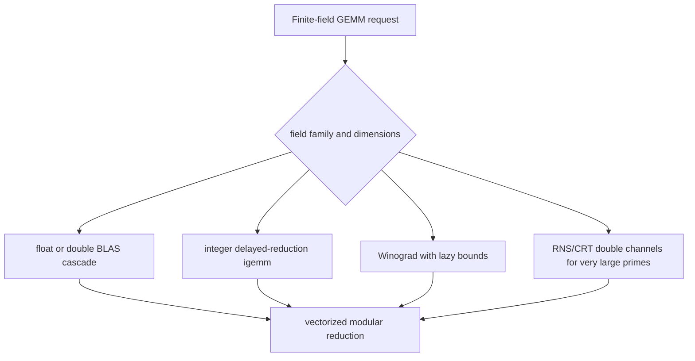

# Finite-field dense linear algebra SOTA catch-up plan

**Issue:** 615db3b9
**Type:** task
**Priority:** normal

## Problem Statement

Issue `615db3b9` was opened as a GF(251) follow-up after `cc5de315` accepted GF(251) as aspirational: fflas-ffpack reaches roughly 128-138 Gop/s at n in {256, 1024} by routing GF(251) through a float-modular OpenBLAS cascade, while gf2-core's current AVX2 byte-packed path reaches roughly 59-71 Gop/s. The issue should now be treated as the planning and dispatch point for a broader finite-field dense linear algebra SOTA catch-up effort, not as a GF(251)-only cleanup task.

The goal is not merely to copy fflas-ffpack. The target is a research-grade Rust implementation that can match fflas on its strong GF(p) lanes, exceed it where gf2 has domain-specific leverage, and keep the high-level `FieldMatrix` API composable.

## Success Criteria

Current issue criteria should be tightened to make the expanded scope explicit:

- [hard] A design document attached to the issue identifies the highest-leverage route toward fflas-like GF(251) performance at n in {256, 1024}, comparing at least: in-Rust f32/FMA cascade, optional BLAS-backed cascade, Goto/BLIS-style panelized integer micro-kernel, AVX-512/VNNI follow-up, and "external BLAS dependency out of default build" as an explicit policy option.
- [hard] The design records what gf2 already implements for dense finite-field linear algebra, with file paths and evidence docs for GF(p), GF(2), GF(2^m), GF(p^n), and downstream operations.
- [hard] The design includes reproducible GF(251) benchmark evidence at n in {256, 1024} using the same pinned/reference methodology as `cc5de315`, and identifies any fresh measurements still needed before implementation.
- [hard] The design and all child implementation issues preserve gf2's MIT licensing: fflas-ffpack source may be used only as a behavioral/performance reference, not copied, translated, linked into the default build, or used as a source-code template.
- [hard] The design expands the SOTA catch-up scope beyond GF(251) into actionable workstreams for GF(p) prime families, GF(2), GF(2^m), extension fields, and downstream dense LA operations that inherit GEMM improvements.
- [hard] The plan defines a proposed JIT breakdown with dependency order, expected gates, benchmark criteria, and non-regression requirements.
- [hard] Any production implementation spawned from this plan preserves correctness for GF(7), GF(31), GF(251), Mersenne31, Fp<65537>, the medium-prime band, and selected GF(2^m) fields, and does not regress already-passing GF(p) cells by more than 5% under same-session measurement.

## Status update - 2026-05-06 (post-e24f7839 close)

`e24f7839` (panelized GF(2^m) GEMM) closed in this session with a per-cell maturity-marker amendment user-approved via Path A. Concrete state at HEAD `0022a5f`:

- **GF(2^32) at n in {64, 256, 1024}: PASS [hard].** The new panelized I_TILE=4 kernel reaches 1.6-1.9 Gop/s on Zen 3 (5.7x-6.7x of NTL `mat_GF2E`). Evidence: `dev/bench_results/2026-05-06-e24f7839-gf2pow32-panelized.csv` and `dev/bench_results/2026-05-06-e24f7839-panelized-gf2m-gemm.md` § 3.
- **GF(2^16) at n in {64, 256}: PASS [hard].** Already passing pre-panelization; ratios improved 43x->149x and 11x->36x.
- **GF(2^16) at n=1024: [aspirational].** Ratio 0.614, 8.5% below the 0.667 threshold. Single-core VPCLMULQDQ ceiling at the 3-CLMUL Barrett chain depth on AVX2 without GFNI/AVX-512 (per `fb271c41` evaluation, those are out of scope on Zen 3 host class).
- **GF(2^8) at n in {64, 256, 1024}: [aspirational].** Ratios 0.393, 0.060, 0.015. Structural algorithmic gap: M4RIE uses Method of Four Russians / Newton-John (O(n^3/log n)) while gf2-core panelized GEMM is per-element CLMUL (O(n^3)).

The deeper algorithmic catch-up for these 4 [aspirational] cells (GF(2^8) Newton-John, GF(2^16) n=1024 GFNI/AVX-512 ZMM follow-up) is now scoped to this plan's eventual breakdown (Phase 3 below). The amendments are recorded in `e24f7839` and parent story `2c7548ae` issue descriptions.

GF(2^m) closure for epic `97bf0879` therefore proceeds without these cells; the epic-level `[hard]` GF(2^m) criterion is satisfied per the per-cell maturity marker amendments.

## What gf2 already has

### Dense matrix layer

The central dense matrix multiply entry point is `crates/gf2-core/src/field/matrix.rs::gemm`. It:

1. checks shapes and materializes a zero output,
2. transposes `B` once so every output dot product reads both operands contiguously,
3. dispatches whole-GEMM small-prime SIMD through `F::try_simd_gemm_classical`,
4. pre-packs medium-prime operands for `F::try_fp_simd_dot_packed_u16`,
5. tries the GF(2^m) batch-dot hook `F::try_gf2m_u64_batch_dot_product`,
6. otherwise falls back to `field::vec::dot_product_slices`, which chunks by `F::max_unreduced_additions()`.

Relevant files:

- `crates/gf2-core/src/field/matrix.rs`
- `crates/gf2-core/src/field/traits.rs`
- `crates/gf2-core/src/field/vec.rs`
- `crates/gf2-core/src/field/winograd.rs`

The Strassen-Winograd path already exists in `field/winograd.rs`. It uses Dumas-Pernet theorem-4 bound propagation and falls back to the classical GEMM base case when delayed-reduction headroom is insufficient. This means a better base-case GEMM compounds through Winograd rather than replacing it.

### GF(p) fast paths

Prime-field SIMD dispatch is concentrated in `crates/gf2-core/src/gfp/simd_ops.rs`:

```text
if P == 65537            -> dedicated Fermat-prime Fp<65537> kernels
if P == 2^31 - 1         -> dedicated Mersenne31 kernels
if P <= 251              -> small-prime byte/16-bit AVX2 Candidate C whole-GEMM path
if 252 <= P < 65536      -> medium-prime u16 AVX2 dot path
otherwise                -> generic Montgomery fallback
```

Small-prime kernels live in:

- `crates/gf2-kernels-simd/src/fp_small.rs`
- `crates/gf2-kernels-simd/src/fp_small_f32.rs`
- `crates/gf2-kernels-simd/src/x86/fp_small.rs`
- `crates/gf2-kernels-simd/src/x86/fp_small_f32.rs`

Current facts:

- Candidate C is the selected production path for all `P <= 251`.
- Candidate F, the in-Rust AVX2+FMA f32 cascade, is implemented and compiled, but not selected. `N_THRESH_PRIME = 252` makes `select_f32_path` false for all in-scope small primes because a 5-trial Zen 3 sweep found Candidate C faster by about 5-10% at measured cells.
- GF(251) remains below the 1.5x-of-fflas threshold because fflas uses a float/OpenBLAS cascade, not because gf2 lacks a SIMD path.

Authoritative GF(p) evidence:

- `dev/bench_results/2026-05-06-7a106fe4-gfp-parity-evidence.md`
- `dev/plans/small_prime_kernel_strategy.md`
- `dev/bench_results/2026-05-05-9e12659b-medium-prime-gemm.md`

Key GF(251) rows:

| field | n | gf2 Gop/s | fflas Gop/s | gf2/fflas | status |
|---|---:|---:|---:|---:|---|
| GF(251) | 256 | 58.98 | 128.48 | 0.459 | aspirational |
| GF(251) | 1024 | 70.89 | 138.32 | 0.512 | aspirational |

Already-passing or protected lanes:

- GF(7), GF(31), and most small primes pass at n in {256, 1024}; n=64 overhead is tracked separately by `27bb2f75`.
- Medium primes mostly pass. GF(32749)/n=64 misses by 0.18% due to `K_PANEL=2` drain overhead; other medium-prime cells pass.
- Mersenne31 and Fp<65537> have dedicated dispatch that must remain above generic branches.

### GF(2)

GF(2) has M4RM/RREF work and benchmark evidence against M4RI, but small-n matmul cells (n=64, n=256) still miss the 1.5x threshold (per § 1.1 of the predecessor scorecard).

Implementation files:

- `crates/gf2-core/src/bitvec.rs` — dense bit storage.
- `crates/gf2-core/src/bitslice.rs` — bit-slice views.
- `crates/gf2-core/src/matrix.rs` — `BitMatrix` row-major bit-packed matrix and basic ops.
- `crates/gf2-core/src/sparse.rs` — CSR/CSC sparse GF(2) matrices.
- `crates/gf2-core/src/alg/m4rm.rs` — M4RM multiplication.
- `crates/gf2-core/src/alg/gauss.rs` — Gauss-Jordan inversion.
- `crates/gf2-core/src/alg/rref.rs` — RREF.
- `crates/gf2-core/src/alg/matmul.rs` — matmul dispatch entry.
- `crates/gf2-core/src/alg/strassen.rs` — Strassen path for GF(2).
- `crates/gf2-kernels-simd/src/` — SIMD kernels invoked from `alg/`.

Authoritative GF(2) evidence:

- `dev/bench_results/2026-05-06-111a3967-gf2-parity-evidence.md` — Wave-6/7 M4RM parity rollup.
- `dev/bench_results/2026-05-06-380e041a-m4ri-gray-schedule.md` — Gray-code schedule study against M4RI.
- `dev/bench_results/2026-05-04-0fd48627-gf2-m4ri-profile.md` — perf-stat profile against M4RI.

### GF(2^m)

GF(2^m) has the largest dense GEMM gap among supported field families:

- GF(2^8) is about 5x behind M4RIE at n=64, about 29x behind at n=256, and about 134x behind at n=1024.
- GF(2^16) wins at n=64 and n=256, but loses by about 5x at n=1024.
- GF(2^32) is about 3-5x behind NTL across n in {64, 256, 1024}.

Current GF(2^m) GEMM uses per-output-cell packing/export plus batch carry-less multiply, not matrix-level Four-Russians/Gray-code panelization. Existing issue `e24f7839` is already in progress for panelized GF(2^m) GEMM and should be treated as the primary owner of this gap, not duplicated.

Implementation files:

- `crates/gf2-core/src/gf2m/mod.rs` — module entry and dispatch.
- `crates/gf2-core/src/gf2m/field.rs` — `Gf2m<m, T>` element type.
- `crates/gf2-core/src/gf2m/wide.rs`, `wide_config.rs` — wide-storage backing for m > 32.
- `crates/gf2-core/src/gf2m/uint_ext.rs` — sealed storage-width trait.
- `crates/gf2-core/src/gf2m/mul_raw.rs` — raw carry-less multiplication.
- `crates/gf2-core/src/gf2m/barrett.rs` — Barrett-reduction tables.
- `crates/gf2-core/src/gf2m/batch.rs` — `try_gf2m_u64_batch_dot_product` hook used by `field/matrix.rs::gemm`.
- `crates/gf2-core/src/gf2m/generation.rs` — generation/sampling helpers used by benches/tests.
- `crates/gf2-core/src/primitive_polys.rs` — primitive polynomials for m in 2..16.

Authoritative GF(2^m) evidence:

- `dev/bench_results/2026-05-06-a1172cea-gf2m-scorecard.md` — pre-panelization scorecard.
- `dev/plans/m4rie_promotion_evidence.md` — M4RIE reference promotion analysis.
- `dev/bench_results/2026-05-04-507b0036-m4rie-reference.csv` — M4RIE reference numbers.
- `dev/bench_results/2026-05-06-a1172cea-ntl-gf2pow32-large.csv` — NTL GF(2^32) reference at large n.
- `dev/bench_results/2026-05-06-e24f7839-panelized-gf2m-gemm.md` — post-`e24f7839` panelized GEMM evidence (GF(2^32) PASS, GF(2^16) n=1024 + GF(2^8) all-n aspirational).
- `dev/bench_results/2026-05-06-e24f7839-gf2pow32-panelized.csv` and `2026-05-06-e24f7839-gf2m-panelized.csv` — raw bench CSVs.

### Extension fields GF(p^n)

Implementation files:

- `crates/gf2-core/src/gfpn/mod.rs` — module entry, `ExtConfig` trait.
- `crates/gf2-core/src/gfpn/ext_config.rs` — extension configuration trait surfaces.
- `crates/gf2-core/src/gfpn/quadratic.rs` — `QuadraticExt<C>` arithmetic.
- `crates/gf2-core/src/gfpn/cubic.rs` — `CubicExt<C>` arithmetic.
- `crates/gf2-core/src/gfpn/batch.rs` — batch-dot helpers for extension elements.
- `crates/gf2-kernels-simd/src/fp65537.rs` — Fp<65537> base-field kernels reused by extension matmul.

Authoritative GF(p^n) evidence:

- `dev/plans/gfpn_groundwork_analysis.md` — tower-extension design analysis and benchmarking groundwork.
- `dev/plans/cubic_ext.md` — `CubicExt` design notes.
- `dev/bench_results/2026-05-04-c3e79272-charpoly-minpoly-refs.md` — extension-field-adjacent charpoly/minpoly reference selection.
- `dev/bench_results/2026-05-04-5dea7457-reference-extension.csv` — extension reference benchmark CSV.

`FieldMatrix<QuadraticExt<_>>` and `FieldMatrix<CubicExt<_>>` currently inherit generic matrix multiply rather than a matrix-level Karatsuba decomposition into accelerated base-field GEMMs. Phase 4 of this plan addresses that.

### Downstream dense LA

Downstream dense LA exists across triangular solve/multiply, PLE, RREF/rank, determinant, charpoly/minpoly, and expression/fusion layers. The SOTA catch-up work should make downstream operations inherit optimized GEMM through blocked algorithms rather than optimizing each operation independently.

Implementation files:

- `crates/gf2-core/src/field/triangular.rs` — triangular solve / triangular multiply (TRSM / TRMM).
- `crates/gf2-core/src/field/ple.rs` — PLE / LU factorisation.
- `crates/gf2-core/src/field/inverse.rs` — `FieldMatrix::invert`.
- `crates/gf2-core/src/field/charpoly.rs` — characteristic / minimum polynomial.
- `crates/gf2-core/src/field/poly.rs`, `poly_interpolate.rs` — polynomial helpers backing charpoly/minpoly.
- `crates/gf2-core/src/field/winograd.rs` — Winograd recursive GEMM with Dumas-Pernet bound propagation.
- `crates/gf2-core/src/field/expr.rs`, `batch_ops.rs` — expression-template / fusion layer.
- `crates/gf2-core/src/field/sparse_matrix.rs` — `SparseFieldMatrix` and sparse RREF entry.
- `crates/gf2-core/src/field/extension_wiedemann.rs` — block-Wiedemann variant for extension fields.

Authoritative downstream-LA evidence:

- `dev/bench_results/2026-05-07-4eb105f7-dense-la-parity-evidence.md` — dense LA parity rollup vs fflas-ffpack.
- `dev/bench_results/2026-05-04-3b762764-dense-la-post-gemm.md` — post-GEMM inheritance check across downstream ops.
- `dev/bench_results/2026-05-07-73ec5da3-ple-trsm-tuning.md` — PLE/TRSM tuning evidence.
- `dev/bench_results/2026-05-07-7e41400f-invert-solve-det.md` — invert/solve/det Wave-9 parity.
- `dev/bench_results/2026-05-07-d1a5fea8-invert-inplace.md` — in-place invert evidence.
- `dev/bench_results/2026-05-07-d1dd266c-minpoly-tuning.md` — minpoly tuning + Wave-12 panel-kernel inline.
- `dev/bench_results/2026-05-04-c3e79272-charpoly-reference.csv`, `minpoly-reference.csv` — charpoly/minpoly reference CSVs.

## FFLAS-FFPACK techniques to catch up with

There is a local checkout at `/home/vkaskivuo/Projects/fflas-ffpack`; future implementation agents may inspect that copy as a behavioral and performance reference rather than relying on summaries. The most relevant local files are:

- `/home/vkaskivuo/Projects/fflas-ffpack/fflas-ffpack/fflas/fflas_bounds.inl` — `DotProdBoundClassic` and delayed-reduction headroom formulas.
- `/home/vkaskivuo/Projects/fflas-ffpack/fflas-ffpack/fflas/fflas_fgemm/fgemm_classical.inl` — lazy fgemm splitting by `H.MaxDelayedDim`, `FloatDomain`/`DoubleDomain` specializations that call `cblas_sgemm`/`cblas_dgemm`, and `ZRing<int64_t>` routing to `igemm_`.
- `/home/vkaskivuo/Projects/fflas-ffpack/fflas-ffpack/fflas/fflas_igemm/` — Eigen-inspired integer GEMM packing and micro-kernel code.
- `/home/vkaskivuo/Projects/fflas-ffpack/fflas-ffpack/fflas/fflas_simd.h` and `fflas/fflas_simd/` — SIMD reduction macros and 128/256/512-bit lane abstractions, including `NORML_MOD` and `FLOAT_MOD`.
- `/home/vkaskivuo/Projects/fflas-ffpack/fflas-ffpack/field/rns-double.h` and `field/rns-double.inl` — RNS/CRT double-channel machinery, including CRT basis changes implemented via `cblas_dgemm`.

### License and provenance guardrails

gf2 is MIT-licensed, while fflas-ffpack is copyleft-licensed. Treat the local fflas checkout as a benchmark/reference implementation only:

- Do not copy, transliterate, or mechanically port fflas-ffpack source code, comments, constants tables, autotuning tables, or micro-kernel structure into gf2.
- Do not add fflas-ffpack, Givaro, or FFPACK as a dependency of the gf2 default build.
- If a future optional accelerator links to an external BLAS, link to a permissively licensed BLAS provider or a system BLAS through a feature-gated abstraction; do not route production gf2 through fflas-ffpack itself.
- Implement algorithms from public mathematical descriptions, papers, ISA manuals, and gf2-owned prototypes. Keep implementation notes phrased as independently derived algorithms and cite papers/specs rather than source-line recipes when possible.
- For any workstream that needs close study of fflas internals, use a clean-room split: one agent may write a factual behavior/performance specification, and a separate implementation agent should implement from that specification plus public references without re-reading fflas source.
- Every child issue spawned from this plan should include a success criterion that no fflas-ffpack code or derived source-level structure was introduced.

The important fflas-ffpack pattern is not a single kernel; it is a dispatch architecture:



Most relevant techniques:

1. Float/double modular cascade: convert residues to `f32` or `f64`, call BLAS GEMM in chunks that fit mantissa exactness, reduce outputs modulo p.
2. Exact delayed-reduction bounds: for p and k, ensure `k * (p - 1)^2` fits the accumulator exactly.
3. Goto/BLIS-style packing: pack A/B panels into cache-friendly buffers and run a register-blocked micro-kernel.
4. Vectorized output reduction: apply FLOAT_MOD/NORML_MOD-style reductions over full vectors, not scalar `% p` per output.
5. Lazy Winograd composition: propagate bounds through recursive subproblems and use the optimized base case.
6. RNS/CRT only where hardware and prime size justify it. On current AVX2-only Zen 3, prior gf2 research recommends deferring RNS until AVX-512 IFMA is a target.

For GF(251), the exact f32 bound is:

$$
k_{\max} = \left\lfloor \frac{2^{24}}{(251 - 1)^2} \right\rfloor = 268.
$$

Thus n=256 fits in one f32 chunk, while n=1024 needs four chunks. Double precision is effectively unlimited for these sizes. This is why an f32/sgemm-like cascade is the highest-leverage GF(251) route.

## Recommended strategy

### Phase 0: Reconfirm the benchmark baseline

Before implementation, the GF(251)-route prototype work needs a single pinned baseline. This section separates measurements that already exist in the repository from measurements that must be re-collected before prototype dispatch.

#### Already-available measurements (no fresh collection needed)

These come from `cc5de315`'s closure trail and the post-`97bf0879` scorecard, all collected with CCX-pinned 5-trial methodology on the 5900X reference host:

- **GF(251)/n in {256, 1024}** Candidate C vs fflas — `dev/bench_results/2026-05-06-7a106fe4-gfp-parity-evidence.md` and the predecessor scorecard `dev/bench_results/2026-05-08-2cfc4372-sota-scorecard.md` § 1.1 (`58.98 / 70.89 Gop/s` for gf2, `128.48 / 138.32 Gop/s` for fflas).
- **GF(251)/n=64, n=4096** Candidate C vs fflas — same scorecard § 1.1 (`A7` amendment rows, including the n=4096 row).
- **GF(7), GF(31), GF(127)/n in {64, 256, 1024}** non-regression controls — same scorecard § 1.1 plus `dev/bench_results/2026-05-06-7a106fe4-gfp-parity-evidence.md`; GF(7)/GF(31)/n=64 cells are `A6` / `A5` aspirational amendments owned by `27bb2f75`.
- **GF(257), GF(32749), GF(65521)/n in {64, 256, 1024}** medium-prime controls — `dev/bench_results/2026-05-05-9e12659b-medium-prime-gemm.md` and predecessor scorecard § 1.1 (GF(65521) rows are PASS [hard] per `[E14]` § 1.2; GF(32749)/n=64 misses by 0.18%).
- **Mersenne31, Fp<65537>/n in {256, 1024}** exact-dispatch controls — same scorecard § 1.1.

#### Fresh measurements still needed before prototype dispatch

These are not yet in the repository and must be collected before Phase 1 prototype work begins. Use the `cc5de315` methodology: pinned reference container, canonical seeds, CCX-pinned 5-trial gf2 measurement, no concurrent cargo/criterion jobs.

- **GF(241)/n in {256, 1024}.** No GF(241) measurement exists. The cell is needed because GF(241) shares the byte-prime float-modular failure mode with GF(251); without this cell, the prototypes cannot demonstrate that improvements generalize across the byte-prime family.
- **Single-trial-vs-5-trial drift baseline on the reference host at HEAD.** The current host environment has shifted since `cc5de315`'s closure (`HEAD = 8a800a9d` at the time of writing); a single 5-trial GF(251) re-run at HEAD is needed to confirm the cited Gop/s numbers still hold within the 5% non-regression band before prototype work begins. Otherwise prototype-vs-baseline deltas conflate prototype effect with host drift.
- **GF(127)/n in {256, 1024} as an additional small-prime control.** GF(127) is not currently in the `cc5de315` scorecard but is in this plan's control list because it spans the boundary between byte-prime and medium-prime dispatch tiers; the cell is needed to verify that a GF(251) prototype change does not regress GF(127).

This list is the work of child issue #1 ("Refresh GF(251) and control-lane benchmarks") in the proposed JIT breakdown below.

### Phase 1: Decide the GF(251) breakthrough route by prototype

Prototype three routes behind non-default dispatch toggles and compare them against the Phase 0 baseline:

1. **In-Rust f32/FMA cascade refresh.** Rework the existing Candidate F around the precise GF(251) target: k-chunking at 268, vectorized output reduction, lower pack cost, and comparison at n=256/1024 rather than broad all-prime dispatch. This avoids a C dependency and keeps unsafe code in `gf2-kernels-simd`.
2. **Optional BLAS-backed cascade.** Implement or prototype an optional `blas`/`external-blas` feature, or an out-of-tree benchmark harness, that packs `Fp<P>` to f32 and calls a single-threaded `sgemm` provider. This is the closest apples-to-apples fflas route. It should not become a default dependency without explicit user approval.
3. **Pure integer Goto/BLIS-style micro-kernel.** Add explicit A/B panel packing and a register-blocked AVX2 micro-kernel for byte/word-fits-in-u16 primes. This is likely 1-2x slower than OpenBLAS but is the most appropriate long-term default if the project wants self-contained Rust kernels.

Decision rule:

- If optional BLAS gives a decisive win but the in-house routes stay below the 0.667 ratio, record BLAS as an optional accelerator/reference lane and keep the default build self-contained.
- If in-Rust f32 or integer panelized kernels clear GF(251) within 1.5x of fflas at n in {256, 1024}, prefer the self-contained route for production.
- If neither clears the threshold, split a focused architecture issue before continuing broad downstream work.

### Phase 2: Generalize GF(p) without regressing existing wins

After the GF(251) route is chosen:

- Keep exact-prime dispatch ordering unchanged: Fp<65537>, then Mersenne31, then family paths.
- Revisit `N_THRESH_PRIME` only with new data; Candidate C currently wins on Zen 3 for p <= 251.
- Complete or coordinate with `27bb2f75` for n <= 128 overhead reduction.
- Consider a medium-prime cleanup only if the GF(32749)/n=64 0.18% gap becomes worth addressing; it should not distract from GF(251) and GF(2^m).
- Make vectorized modular reduction a reusable primitive for f32/double cascade output and integer-panel outputs.

### Phase 3: Coordinate the GF(2) and GF(2^m) SOTA gap

`e24f7839` closed 2026-05-06 with a per-cell maturity-marker amendment (see Status update above). It addressed the per-call-overhead and panelization-headroom aspects: GF(2^32) cells now PASS at 5.7x-6.7x of NTL, and GF(2^16) at small n stays PASS. Three structural-algorithmic gaps remain and are the cross-family deliverable for this plan:

- **GF(2^8) at n in {64, 256, 1024}** — Method of Four Russians / Newton-John panelization with byte-level PSHUFB tables. The reference algorithm is M4RIE's `mzed_mul`; gf2 must implement it independently from public references (per License and provenance guardrails above).
- **GF(2^16) at n=1024** — either a precomputed Barrett table for m=16 (64K entries) or a GFNI/AVX-512 ZMM follow-up routed through Zen-4+ host classes. `fb271c41` evaluated and deferred GFNI/AVX-512 to Zen-4+; revisit when that host class is targeted.
- **GF(2): M4RM table-size and XOR-loop review** — including k=16 table feasibility and AVX-512 VPTERNLOGD follow-up when hardware exists. Wave-7 closed the n in {1024, 4096} matmul cells against M4RI within 1.5x; the n=4096 margin is narrow (32.331 ms vs 32.867 ms threshold) and warrants a future perf-gate.

Each item above is a candidate Phase-3 child issue when `615db3b9` breaks down.

### Phase 4: Extension-field matrix GEMM

Once base GF(p) GEMM has a high-throughput route, add matrix-level extension-field decompositions:

- Quadratic extensions: compute multiplication using 3 base-field GEMMs via Karatsuba rather than 4 generic component products.
- Cubic extensions: use the existing tower arithmetic strategy but lift it to matrix-level batch GEMM.
- For `QuadraticExt<Fp<65537>>` and `CubicExt<Fp<65537>>`, route base GEMMs through existing Fp<65537> acceleration where applicable.

This should be a separate story or task cluster, because the trait design and correctness tests are non-trivial.

### Phase 5: Downstream dense LA inheritance

After GEMM improvements land, verify downstream operations inherit the speedup:

- triangular solve/multiply (`field/triangular.rs`),
- PLE/LU/rank/determinant,
- RREF/echelon,
- charpoly/minpoly,
- expression-template/fusion paths.

The implementation should prefer blocked algorithms that call optimized GEMM or GEMM-like submul kernels, rather than one-off operation-specific micro-optimizations.

### Phase 6: Benchmark gates and evidence

Every implementation issue spawned from this plan should include:

- correctness tests against scalar/reference implementations,
- property tests for field axioms and matrix identities,
- same-session non-regression against already-passing GF(p) cells,
- pinned-reference evidence for any SOTA claim,
- updated assembly artefacts when SIMD source changes,
- documentation explaining dispatch and exactness bounds.

## Proposed JIT breakdown

```mermaid
graph TD
    A[615db3b9: finite-field LA SOTA plan] --> B[GF251 baseline refresh]
    B --> C[GF251 f32/FMA cascade prototype]
    B --> D[GF251 optional BLAS reference prototype]
    B --> E[GF251 integer panel micro-kernel prototype]
    C --> F[Select GF251 production route]
    D --> F
    E --> F
    F --> G[Generalize GF(p) dispatch and reductions]
    F --> H[Extension-field GEMM design]
    I[e24f7839: panelized GF(2^m) GEMM] --> J[Cross-family dense LA scorecard]
    G --> J
    H --> J
    J --> K[Downstream LA inheritance pass]
```

Suggested child work items:

1. **Refresh GF(251) and control-lane benchmarks.**
   - Type: task.
   - Gates: `cargo-ci`, `code-review`, `doc-review`.
   - Output: CSV + evidence doc for GF(251)/GF(241) and non-regression controls.

2. **Prototype in-Rust GF(251) f32/FMA cascade.**
   - Type: task.
   - Depends on benchmark refresh.
   - Success: bit-exact GF(251) GEMM, measured n=256/1024 ratios, no production dispatch change unless it wins, and no fflas-derived source code or source-level structure.

3. **Prototype optional BLAS-backed GF(251) cascade.**
   - Type: task or research task.
   - Depends on benchmark refresh.
   - Success: proof-of-route with exactness bounds, single-threaded BLAS policy, explicit dependency recommendation, and no dependency on fflas-ffpack/Givaro.

4. **Prototype pure integer panelized GF(251) micro-kernel.**
   - Type: task.
   - Depends on benchmark refresh.
   - Success: independently designed panel packing + register-blocked kernel evidence against Candidate C and fflas, with provenance notes showing the implementation came from public GEMM/ISA principles rather than fflas source.

5. **Select and wire the GF(251) production route.**
   - Type: story checkpoint.
   - Depends on the three prototypes.
   - Success: one selected default path, optional accelerators documented, issue criteria updated from prototype data.

6. **Generalize GF(p) reductions and dispatch policy.**
   - Type: task.
   - Depends on route selection.
   - Success: reusable vectorized reduction primitive and preserved dispatch ordering.

7. **Design extension-field GEMM decomposition.**
   - Type: task.
   - Depends on route selection.
   - Success: approved design for quadratic/cubic extension GEMM via base-field GEMMs.

8. **Publish cross-family dense LA SOTA scorecard.**
   - Type: task.
   - Depends on selected GF(p) route and `e24f7839`.
   - Success: unified table for GF(p), GF(2), GF(2^m), extension fields, and downstream ops.

## Risks and Open Questions

- **External BLAS dependency.** An optional BLAS-backed route is the most direct way to match fflas, but should not be enabled in the default build without explicit approval.
- **Candidate F prior result.** The existing in-Rust f32/FMA cascade lost to Candidate C on Zen 3 broad sweeps. A successful GF(251)-focused retry must reduce pack/reduction overhead or use a different chunking/micro-kernel shape.
- **Benchmark noise.** Existing evidence uses pinned multi-trial runs because single sessions have shown large drift. Do not use single-shot benchmarks to change dispatch.
- **AVX-512/VNNI.** Promising but not actionable on the current Zen 3 host. Any AVX-512 issue must include an MSRV 1.95 intrinsic feasibility check before dispatch.
- **GF(2^m) scale.** GF(2^8) has a much larger gap than GF(251). Project planning should not over-focus on fflas/GF(p) while the M4RIE gap remains open.
- **Downstream inheritance.** Downstream operations only catch up if they are blocked around GEMM/submul kernels. A fast standalone GEMM is necessary but not sufficient.

## Scope boundary: AVX-512 / VNNI / GFNI / ZMM

AVX-512 and its sub-families (VNNI, GFNI, VPCLMULQDQ-512, ZMM lanes) are **not in scope** for this plan or epic `026fc832`. The 5900X reference host has no AVX-512 hardware, so any AVX-512 route is not measurable here. All deferred AVX-512 work — including the Phase 1 "AVX-512/VNNI follow-up" route comparison and the Phase 3 "GFNI/AVX-512 ZMM follow-up for GF(2^16)/n=1024" — belongs under epic `7f809931` ("SIMD and platform expansion"), which already houses:

- `c7c0e991` — AVX-512 VPCLMULQDQ (512-bit) + GF2P8AFFINEQB GFNI kernels for GF(2^m)
- `f8d230ef` — AVX-512 ZMM bipedal-3 kernel for permanent_bipedal3

In-scope alternatives for the AVX-512-dependent cells listed in Phase 3:

- **GF(2^16) at n=1024:** in-scope path is a precomputed Barrett table for m=16 (64K entries) on AVX2. The GFNI/AVX-512 ZMM follow-up is out-of-scope and belongs as a child of `c7c0e991` under epic `7f809931`.
- **Phase 1 route comparison:** the in-scope route set is now {in-Rust f32/FMA cascade, optional BLAS-backed cascade, Goto/BLIS-style panelized integer micro-kernel, "external BLAS dependency out of default build" policy}. The AVX-512/VNNI option is recorded only as future-host context, not as an actionable route under this plan.

## References

- `dev/bench_results/2026-05-06-7a106fe4-gfp-parity-evidence.md`
- `dev/plans/small_prime_kernel_strategy.md`
- `dev/bench_results/2026-05-05-9e12659b-medium-prime-gemm.md`
- `dev/bench_results/2026-05-06-a1172cea-gf2m-scorecard.md`
- `dev/plans/fflas_ffpack_analysis.md`
- `dev/plans/sota_reference_acceptance_protocol.md`
- Dumas, Giorgi, Pernet, "Dense Linear Algebra over Word-Size Prime Fields", ACM TOMS 35(3), 2009, arXiv:cs/0601133
- Goto and van de Geijn, "Anatomy of High-Performance Matrix Multiplication", ACM TOMS 34(3), 2008
