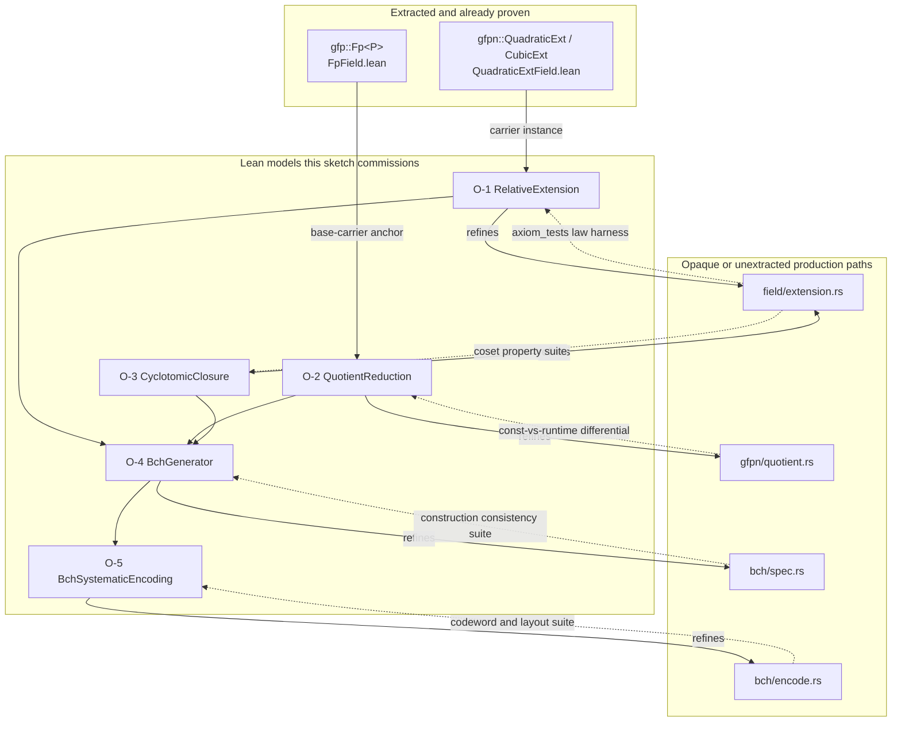

# Formal-proof sketch: the algebraic foundations (issue `64fd3afd`)

> **Diátaxis Type:** Explanation (design input for epic `ae03bcd0`)

This sketch fixes, for each of the five proof obligations of epic `ae03bcd0`,
the exact production path, the lemma statements a Lean worker proves, the
binding mode (direct extraction or abstract model plus refinement), the proof
strategy, and the assumptions each obligation rests on. It is the artifact
`AGENTS.md` requires before proof code, and it discharges the plan's
`lean-refinement-boundary` contract by assigning the mode per obligation.

Five sections, one per downstream issue, so each later worker implements exactly
one section. Facts about the tree are cited rather than restated.

**Citation convention.** A citation of the form `` `path:NNN` `` names a line in
this repository. A bare `` `:NNN` `` continues the file most recently named in
the same sentence, list item, or table row, or else the file the sentence
introducing the table names. Paths beginning `Mathlib/` are
relative to the Mathlib checkout the proofs pin, `v4.30.0-rc2`
(`proofs/lakefile.lean`, `proofs/lean-toolchain`); every Mathlib identifier and
line in this sketch is verified against that revision.

## Notation

| Symbol | Meaning |
|---|---|
| $p$ | field characteristic |
| $B$, $E$ | base field and extension field, $B \subseteq E$ |
| $q = \lvert B \rvert$ | base-field cardinality |
| $d_B = [B : \mathbb{F}_p]$ | absolute base degree |
| $r = [E : B]$ | relative degree |
| $\iota_{B \to E}$ | the embedding $B \hookrightarrow E$ |
| $\varphi_B$ | relative Frobenius $x \mapsto x^{q}$ on $E$ |
| $\mathrm{idx}(a)$ | canonical index of $a$, the base-$p$ value of its coordinate vector |
| $n$, $\delta$, $b$ | code length, designed distance, first root exponent |
| $\alpha$ | element of $E$ of exact multiplicative order $n$ |
| $T$ | the closed defining set, a subset of $\mathbb{Z}/n\mathbb{Z}$ |
| $g$ | the generator polynomial over $B$ |
| $k = n - \deg g$ | code dimension |
| $\rho = n - k$ | redundancy (also written $r$ in the encoder's own prose) |

The canonical prime-coordinate convention (base coordinate varying fastest) and
the canonical index $\mathrm{idx}$ are the ones fixed by
[extension-design.md](../ae03bcd0-general-bch/extension-design.md).

## The extraction surface decides every binding

`scripts/verify-lean.sh` is authoritative. Its `gf2-core` Charon invocation
starts from `gf2_core::gfp`, `gf2_core::gfpn`, and `gf2_core::gf2m::mul_raw`,
and marks `gf2_core::field`, `gf2_core::gfpn::quotient`, `gf2_core::gfpn::batch`,
and the remaining modules opaque. Its second invocation extracts
`gf2_algebra::packed::{bipedal3,packed5,packed7}` and `gf2_algebra::gray`.
No invocation names `gf2-coding`.

| Production module | Status under `scripts/verify-lean.sh` | Consequence |
|---|---|---|
| `gf2_core::gfp` | `--start-from`, transparent | extracted; `Fp
` arithmetic is proof-bound today |
| `gf2_core::gfpn::quadratic`, `::cubic` | transparent under `--start-from 'gf2_core::gfpn'` | extracted; tower arithmetic is proof-bound today |
| `gf2_core::field` (contains `crates/gf2-core/src/field/extension.rs`) | `--opaque 'gf2_core::field'` | bodies absent from the LLBC |
| `gf2_core::gfpn::quotient` | `--opaque 'gf2_core::gfpn::quotient'` | bodies absent from the LLBC |
| `gf2_coding::bch::spec`, `::encode` | in no Charon invocation | absent from the pipeline entirely |

Every one of the five obligations therefore binds by **abstract model plus
refinement**. Decision D-08 of the [epic plan](../ae03bcd0-general-bch/plan.md)
rejects expanding the extraction pipeline inside this epic, so the sketch takes
the surface as given rather than proposing new `--start-from` roots.

Two obligations carry a genuine partial extraction anchor, because their models
are parameterised over a base carrier that *is* extracted:

- Obligation **O-1** instantiates its relative-extension model at the extracted
  `QuadraticExt` / `CubicExt` carriers, whose `Field` structure is already
  proven in `proofs/Gf2Core/Proofs/QuadraticExtField.lean:48` and
  `proofs/Gf2Core/Proofs/CubicExtField.lean`. The Frobenius laws are then
  theorems about extracted arithmetic; only the witness plumbing
  (`embed`, `try_restrict`, the certificate projections) stays refinement-bound.
- Obligation **O-2** instantiates its quotient model at the extracted `FpVal P`
  base carrier, whose ring equivalence with `ZMod P` is
  `proofs/Gf2Core/Proofs/FpField.lean:136` (`fpValRingEquiv`) and whose field
  instance is `proofs/Gf2Core/Proofs/FpField.lean:150`.

## Obligation map

| Obligation | Downstream issue | Lean module the issue lands | Primary production path |
|---|---|---|---|
| O-1 extension embedding, restriction, relative Frobenius | `41090b8d` | `proofs/Gf2Core/Proofs/RelativeExtension.lean` | `crates/gf2-core/src/field/extension.rs` |
| O-2 quotient reduction preserves the represented element | `32f53280` | `proofs/Gf2Core/Proofs/QuotientReduction.lean` | `crates/gf2-core/src/gfpn/quotient.rs` |
| O-3 $q$-cyclotomic seed closure | `d7749931` | `proofs/Gf2Core/Proofs/CyclotomicClosure.lean` | `crates/gf2-core/src/field/extension.rs` |
| O-4 generator base-field membership and root correctness | `b1bd75ca` | `proofs/Gf2Core/Proofs/BchGenerator.lean` | `crates/gf2-coding/src/bch/spec.rs` |
| O-5 systematic encoding correctness | `94597a51` | `proofs/Gf2Core/Proofs/BchSystematicEncoding.lean` | `crates/gf2-coding/src/bch/encode.rs` |

All five modules live under `proofs/Gf2Core/Proofs/` and reach the build through
one added import line each in `proofs/Gf2Core.lean`, the serialized "Lean root"
D-13 names (lead decision, 2026-09-01). The coding-side models are pure Lean over
Mathlib and over the core-side models, so they compile inside the existing
`Gf2Core` target, and `scripts/lake-build-strict.sh:47` already fails the
`lake-build` gate on a `sorry` anywhere under `Gf2Core/Proofs/`.
`proofs/lakefile.lean` and `scripts/lake-build-strict.sh` stay as they are.

The partition follows the issue titles literally. Two boundary calls that the
titles leave open:

- **Conjugate orbits belong to O-1, minimal polynomials to O-4.** `conjugates`
  (`crates/gf2-core/src/field/extension.rs:2329`) is a pure relative-Frobenius
  fact, so its cyclicity lemma sits with the Frobenius laws. `minimal_polynomial`
  (`crates/gf2-core/src/field/extension.rs:2390`) matters for the claim that the
  generator lies in $B[T]$ and vanishes at the requested roots, so it sits with
  the generator obligation that consumes it.
- **Deterministic generator selection is out of the five.** `canonical_generator`
  (`crates/gf2-core/src/field/extension.rs:1867`) and `element_of_exact_order`
  (`:1934`) are named by no downstream issue. O-4 takes "$\alpha$ has exact order
  $n$" as a hypothesis, discharged in production by
  `validate_length_divides_unit_group`
  (`crates/gf2-coding/src/bch/spec.rs:694`) and the `has_exact_order` check
  (`crates/gf2-core/src/field/extension.rs:1678`). Register row **A-07** tracks
  this.

## What "model plus refinement" means here, concretely

The plan's `lean-refinement-boundary` contract admits "an abstract Lean model
plus tested refinement to the optimized Rust path". Left at that, the phrase is
unfalsifiable. This sketch narrows it to an auditable discipline, and every
obligation section below applies it:

1. **One model, stated over Mathlib.** The Lean model is a definition over
   Mathlib's algebraic hierarchy, parameterised so that the extracted carriers
   are legal instantiations wherever the extraction surface permits.
2. **A lemma-to-check register.** Every model lemma names one **refinement
   anchor**: an executable Rust check that decides the same statement on the
   production path. The anchor is either an existing test cited by function name
   and line, or a test the Lean issue must add, named in this sketch.
3. **The anchor is cited in the Lean source.** Each lemma's doc comment names
   its anchor by path and function, following the precedent of
   `proofs/Gf2Algebra/Proofs/Packed7Correctness.lean:162-186`, where a Path-B
   axiom carries its cited source and its exhaustive Rust cross-validation in
   the doc comment.
4. **A lemma without an anchor is a defect, not a gap.** Review rejects a landed
   lemma whose anchor row is empty.

This is weaker than extraction and the sketch says so plainly: a passing Rust
property test plus a Lean theorem about the model does not compose into a
theorem about the machine code. What the discipline buys is that the model and
the production path are pinned to the *same statements*, so a divergence shows
up as a red test rather than as an unnoticed drift. Register row **A-01** tracks
the residual.

---

## O-1 — Extension embedding, restriction, and relative-Frobenius laws

Downstream issue `41090b8d`.

### 1. Production path

`crates/gf2-core/src/field/extension.rs`:

| Item | Line | Role |
|---|---|---|
| `trait FieldExtension` | 2541 | the relation $B \subseteq E$ as a value |
| `FieldExtension::certificate` | 2548 | evidence projection |
| `FieldExtension::base_zero` | 2554 | the single required element witness |
| `FieldExtension::embed` | 2558 | $\iota_{B \to E}$ |
| `FieldExtension::try_restrict` | 2562 | partial inverse of `embed` |
| `FieldExtension::base_degree`, `ext_degree`, `relative_degree` | 2580, 2585, 2592 | $d_B$, $d_E$, $r$ |
| `FieldExtension::base_order`, `ext_order`, `ext_unit_group_order` | 2597, 2602, 2607 | $\lvert B\rvert$, $\lvert E\rvert$, $\lvert E^{*}\rvert$ |
| `FieldExtension::relative_frobenius` | 2637 | $\varphi_B^{k}$, by iterating $\varphi_p$ exactly $d_B (k \bmod r)$ times |
| `FieldExtension::contains` | 2652 | membership as the Frobenius fixed-point test |
| `FieldExtension::restrict` | 2661 | `try_restrict` with a typed error |
| `conjugates` | 2329 | the orbit of $x$ under $\varphi_B$ |
| `relative_trace`, `relative_norm` | 2439, 2486 | $\mathrm{Tr}_{E/B}$, $\mathrm{N}_{E/B}$ |
| `restrict_invariant` | 2507 | the panicking helper the orbit lemmas must justify |
| `ensure_extension_element` | 2497 | the identity precondition on derived operations |

Witnesses: `BinaryPrimeExt` (2764, with `new` at 2806, `embed` at 2891,
`try_restrict` at 2899), `ConstExt` (3004, `embed` at 3092, `try_restrict` at
3096), `TrivialExt` (3124, `embed` at 3159, `try_restrict` at 3163), and the
runtime quotient witness `QuotientField`
(`crates/gf2-core/src/gfpn/quotient.rs:150`, aliased `QuotientExt` at `:203`).

Supporting identity surface: `trait FieldIdentity`
(`crates/gf2-core/src/field/extension.rs:1003`) with `write_prime_coords` (1021)
and `from_prime_coords` (1036); `FieldId` (621); `ExtensionCertificate` (1418).

### 2. Lemma statements

The model is a bundled relative extension: fields $B$ and $E$ with
`[Field B] [Field E] [Finite E] [Algebra B E]`, $\iota = $ `algebraMap B E`,
$r = $ `Module.finrank B E`, $q = $ `Nat.card B`, and
$\varphi_B(x) = x^{q}$.

**L1.1 (embedding).** $\iota$ is an injective ring homomorphism:

$$
\iota(0)=0,\quad \iota(1)=1,\quad \iota(a+b)=\iota(a)+\iota(b),\quad
\iota(ab)=\iota(a)\iota(b),\quad \iota(a)=\iota(b) \Rightarrow a=b .
$$

**L1.2 (orders and degrees).**

$$
\lvert E\rvert = q^{\,r},\qquad \lvert E^{*}\rvert = \lvert E\rvert - 1,\qquad
[E:\mathbb{F}_p] = d_B \cdot r .
$$

**L1.3 (Frobenius is a $B$-algebra endomorphism).** $\varphi_B$ is additive and
multiplicative on $E$, and fixes the image of $\iota$ pointwise:

$$
\varphi_B(x+y)=\varphi_B(x)+\varphi_B(y),\quad
\varphi_B(xy)=\varphi_B(x)\varphi_B(y),\quad
\varphi_B(\iota(a))=\iota(a) .
$$

**L1.4 (period).** $\varphi_B^{\,r} = \mathrm{id}_E$ and
$\varphi_B^{\,k} = \varphi_B^{\,k \bmod r}$ for every $k \in \mathbb{N}$.

**L1.5 (fixed field).** The load-bearing statement, because `contains` decides
membership by this test alone:

$$
\{\, x \in E \;:\; \varphi_B(x) = x \,\} \;=\; \iota(B) .
$$

**L1.6 (restriction round trip).** For every $a \in B$,
$\iota(a)$ satisfies $\varphi_B(\iota(a)) = \iota(a)$ and its preimage is
$a$; for every $x$ with $\varphi_B(x)=x$ there is exactly one $a$ with
$\iota(a)=x$. Corollary: `contains(x)` holds exactly when `try_restrict(x)`
answers, which is the law
`check_membership_matches_restriction` decides in Rust.

**L1.7 (iteration count).** $\varphi_B^{\,k}(x) = x^{\,p^{\,d_B k}}$. This is the
statement that the production loop — $d_B \cdot (k \bmod r)$ applications of
`pow(characteristic)` — computes $\varphi_B^{\,k}$, without ever forming $q^{k}$.

**L1.8 (conjugate orbit).** For $x \in E$, let
$\ell = \min\{\, i > 0 : \varphi_B^{\,i}(x) = x \,\}$. Then

$$
\ell \mid r, \qquad
\varphi_B^{\,i}(x) = \varphi_B^{\,j}(x) \iff i \equiv j \pmod{\ell},
$$

so the orbit $x, \varphi_B(x), \ldots, \varphi_B^{\,\ell-1}(x)$ has $\ell$
distinct members and the first repeat occurs at index $0$. This discharges both
assertions in `conjugates` (`:2336` first-repeat-is-zero, `:2346`
orbit-within-$r$) as unreachable.

**L1.9 (trace and norm land in $B$).**
$\mathrm{Tr}_{E/B}(x) = \sum_{i<r} \varphi_B^{\,i}(x)$ and
$\mathrm{N}_{E/B}(x) = \prod_{i<r} \varphi_B^{\,i}(x)$ are $\varphi_B$-fixed,
hence in $\iota(B)$ by L1.5. This discharges the `restrict_invariant` panic
(`:2510`) for `relative_trace` and `relative_norm`.

**L1.10 (trivial extension).** $r = 1 \Rightarrow \iota$ is bijective and
$\varphi_B = \mathrm{id}_E$. Corpus row N4 needs this case, and `TrivialExt`
implements it.

### 3. Binding

**Abstract model plus refinement**, with an extracted-carrier instance.

*Extracted instance.* L1.1–L1.4 and L1.10 are stated once for the abstract model
and instantiated at the extracted `QuadraticExt` / `CubicExt` carriers, using
the existing `Field` instance `proofs/Gf2Core/Proofs/QuadraticExtField.lean:48`
(and its cubic counterpart) plus the order theorem
`proofs/Gf2Core/Proofs/QuadraticExtField.lean:89`
(`order_eq_base_squared`). Those instances need `[Finite BF]` as an added
hypothesis, since `ValidExtConfig`
(`proofs/Gf2Core/Proofs/ExtDefs.lean:65`) carries no finiteness.

*Refinement anchors.* The shared conformance harness in
`crates/gf2-core/src/field/axiom_tests.rs` already decides the same law set on
the production witnesses:

| Lemma | Refinement anchor |
|---|---|
| L1.1 | `check_embedding_homomorphism` (`crates/gf2-core/src/field/axiom_tests.rs:1549`), `check_embedding_injective` (`:1573`) |
| L1.2 | `check_extension_structure` (`:1498`, the $\lvert E\rvert = \lvert B\rvert^{r}$ and degree-product assertions at `:1512-1530`) |
| L1.3, L1.4 | `check_relative_frobenius` (`:1643`) |
| L1.5 | `check_relative_frobenius` (`:1679`, the `phi_x == x` versus `contains(x)` assertion) |
| L1.6 | `check_restriction_round_trip` (`:1588`), `check_membership_matches_restriction` (`:1610`) |
| L1.7 | `test_extension_laws_gf9_in_gf81` (`:2042`) and `tower_relative_frobenius_takes_two_absolute_steps` (`crates/gf2-core/src/field/extension.rs:4404`), the two cases with $d_B > 1$ |
| L1.8 | `assert_minimal_polynomial_properties` (`crates/gf2-core/src/field/extension.rs:4104`) and `const_ext_relative_frobenius_agrees_with_the_conjugate` (`:4391`) |
| L1.9 | `assert_trace_norm_laws` (`crates/gf2-core/src/field/extension.rs:4133`) |
| L1.10 | `test_extension_laws_trivial_fp7` (`crates/gf2-core/src/field/axiom_tests.rs:2124`), `trivial_ext_is_the_identity_on_every_operation` (`crates/gf2-core/src/field/extension.rs:4416`) |

The harness entry point is `test_extension_laws`
(`crates/gf2-core/src/field/axiom_tests.rs:1458`); sixteen witnesses are
registered between `:1983` and `:2148`, covering `BinaryPrimeExt`,
`QuotientField`, `ConstExt` over both binomial and general-quotient
declarations, and `TrivialExt`. **No new Rust test is required for O-1.**

### 4. Proof strategy

Prove L1.5 first; everything else is short or already a Mathlib one-liner.

- **L1.1, L1.3** — `map_add`, `map_mul` on `algebraMap`, plus
  `RingHom.injective` for a field homomorphism. `frobenius`
  (`Mathlib/Algebra/CharP/Lemmas.lean:321`) with `frobenius_def`
  (`Mathlib/Algebra/CharP/Frobenius.lean:32`) supplies additivity of
  $x \mapsto x^{p}$; $\varphi_B = \varphi_p^{\,d_B}$ then follows by
  `iterate_frobenius` (`Mathlib/Algebra/CharP/Frobenius.lean:36`), which is also
  exactly L1.7.
- **L1.2** — `Module.card_eq_pow_finrank`
  (`Mathlib/FieldTheory/Finiteness.lean:92`) gives $\lvert E\rvert = q^{r}$.
- **L1.4** — from L1.7 and `FiniteField.pow_card`
  (`Mathlib/FieldTheory/Finite/Basic.lean:230`) applied at $E$:
  $x^{\lvert E\rvert} = x$ and $\lvert E\rvert = q^{r}$.
- **L1.5 — the one real proof.** Containment $\iota(B) \subseteq \mathrm{Fix}$
  is `FiniteField.pow_card` at $B$ pushed through $\iota$. Equality is a
  counting argument: $\mathrm{Fix}$ is the root set of $X^{q} - X$ in $E$, whose
  cardinality is at most $\deg = q$ by `Polynomial.card_roots'`
  (`Mathlib/Algebra/Polynomial/Roots.lean:79`) together with
  `FiniteField.X_pow_card_sub_X_natDegree_eq`
  (`Mathlib/FieldTheory/Finite/Basic.lean:427`); and $\lvert\iota(B)\rvert = q$
  by L1.1. A subset of size $q$ inside a set of size at most $q$ is the whole
  set. The alternative route through `IsGalois.fixedField_fixingSubgroup`
  (`Mathlib/FieldTheory/Galois/Basic.lean:315`) and the finite-field Galois
  results in `Mathlib/FieldTheory/Finite/Extension.lean` (notably
  `exists_forall_apply_eq_pow` at `:141`) is available but pulls in more
  instance plumbing; the counting argument is the recommended first attempt.
- **L1.6** — L1.5 plus injectivity.
- **L1.8** — the orbit is the image of the cyclic group generated by
  $\varphi_B$ acting on $x$; $\ell = $ the order of the stabiliser quotient, and
  $\ell \mid r$ by Lagrange with L1.4. Frame it as `orderOf` inside
  `Function.End E` restricted to the orbit, or directly as
  `Nat.find` over $\{i>0 : \varphi_B^{i}(x)=x\}$ with `Nat.find_min'` and
  `Nat.dvd_of_mod_eq_zero` for the divisibility.
- **L1.9** — expand $\varphi_B(\sum_i \varphi_B^{i}(x))$, use L1.3 and reindex
  by L1.4; the sum is invariant, so L1.5 applies. Same for the product.
- **L1.10** — $r=1$ makes `Module.finrank B E = 1`, so `algebraMap` is
  surjective; $\varphi_B = \varphi_B^{\,r} = \mathrm{id}$ by L1.4.

Expected hard step: the finiteness and `CharP` instance plumbing needed to get
`FiniteField.*` lemmas to fire at both $B$ and $E$ simultaneously. Budget the
instance setup, not the mathematics.

### 5. Assumptions

- **A-01** (refinement adequacy) applies to every lemma; the anchor table above
  is this obligation's discharge of it.
- **A-02** ($\mathrm{ExtConfig}$ non-residues) is carried as an explicit Lean
  hypothesis (`ValidExtConfig`), never as an axiom, for the extracted-carrier
  instantiation.
- **A-03** (caller-trusted fast paths): the lemmas are stated for witnesses
  built through the deciding constructors. `BinaryPrimeExt::from_certificate_unchecked`
  (`crates/gf2-core/src/field/extension.rs:2852`) and
  `ConstExt::from_certificate_unchecked` (`:3050`) are outside the model's
  hypotheses.
- **A-04** (extraction fidelity) and **A-05** (`sorry` policy) apply as
  repository-wide rows.
- Nothing else. The `restrict_invariant` and `conjugates` panics are discharged
  by L1.8 and L1.9 rather than assumed.

---

## O-2 — Quotient reduction preserves the represented element

Downstream issue `32f53280`.

### 1. Production path

`crates/gf2-core/src/gfpn/quotient.rs`:

| Item | Line | Role |
|---|---|---|
| `QuotientField` | 150 | runtime descriptor and extension witness |
| `QuotientField::new` | 251 | deciding constructor |
| `QuotientField::from_certificate` | 291 | certificate-consuming constructor |
| `QuotientField::from_certificate_unchecked` | 357 | caller-trusted fast path |
| `QuotientField::element` | 426 | reduction of an arbitrary coefficient vector |
| `QuotientField::element_from_remainder` | 543 | pad a reduced polynomial to $r$ slots |
| `QuotientField::element_at_canonical_index` | 554 | $\iota^{-1}$ |
| `QuotientField::indeterminate`, `order`, `elements` | 459, 491, 530 | derived surface |
| `canonicalize_modulus`, `canonicalize_coefficient` | 597, 619 | monicity and coefficient-identity validation |
| `checked_degrees`, `build_field` | 633, 673 | size and identity checks |
| `QuotientElement::multiply` | 896 | convolve to $2r-1$, then fold high terms |
| `QuotientElement::inverse_euclid` | 925 | inversion through the shared Euclid routine |
| `QuotientElement::frobenius` | 865 | absolute Frobenius by iterated `pow` |
| `euclid_inverse` | 950 | the single extended-Euclid implementation both carriers use |
| `ConstQuotientConfig` | 1294 | compile-time declaration, implicit leading one |
| `ConstQuotient::reduce` | 1378 | compile-time counterpart of `QuotientField::element` |
| `ConstQuotient::modulus`, `from_remainder` | 1398, 1536 | modulus materialization and padding |
| `ConstQuotient::multiply` | 1551 | Horner scheme, no $2R-1$ buffer |
| `ConstQuotient::extension`, `extension_unchecked`, `runtime_field` | 1464, 1511, 1530 | deciding, trusting, and bridging constructors |

`FieldPoly::div_rem` (`crates/gf2-core/src/field/poly.rs:1779`) is the division
both reduction paths call.

### 2. Lemma statements

The model: a field $B$, a monic $f \in B[X]$ with $\deg f = r \ge 1$, the
quotient $Q = B[X]/(f)$, the coefficient-vector space $B^{r}$, the padding map
$\widehat{\cdot} : B^{r} \to B[X]$, and the class map
$\kappa = \pi \circ \widehat{\cdot} : B^{r} \to Q$.

**L2.1 (reduction is the residue).** For every $a \in B[X]$,

$$
a \;-\; \widehat{\rho(a)} \;\in\; (f), \qquad \deg \widehat{\rho(a)} < r,
$$

where $\rho(a)$ is the stored vector `QuotientField::element` returns. In one
line: $\kappa(\rho(a)) = a + (f)$.

**L2.2 (canonical representatives).** $\kappa$ is a bijection $B^{r} \to Q$, and
$\rho$ is the identity on vectors already of length $r$. One class, one stored
vector; hence `QuotientElement`'s derived `PartialEq` on coefficients
(`crates/gf2-core/src/gfpn/quotient.rs:773`) decides equality in $Q$.

**L2.3 (reduction is a ring homomorphism).** For all $a, b \in B[X]$,

$$
\rho(a+b) = \rho(a) \oplus \rho(b), \qquad
\rho(ab) = \rho(a) \otimes \rho(b),
$$

where $\oplus$ and $\otimes$ are the stored-vector operations. For $\otimes$
this is precisely the claim that the fold in `QuotientElement::multiply`
(`:907-917`) — for each high index $h \ge r$ with leading coefficient $c$,
subtract $c \cdot f_i$ at offset $h-r+i$ — computes the residue of the
convolution.

**L2.4 (the two carriers agree).** For equal declarations, the Horner scheme in
`ConstQuotient::multiply` (`:1551`) — shift the accumulator by one degree,
rewrite $x^{R} \equiv -\sum_{i<R} f_i x^{i}$, then add a scalar multiple of the
right operand — computes the same vector as `QuotientElement::multiply`, and
`ConstQuotient::reduce` the same vector as `QuotientField::element`.

**L2.5 (inversion).** For $f$ irreducible and $v \not\equiv 0 \pmod f$,
`euclid_inverse` returns $u$ with $\deg u < r$ and $u v \equiv 1 \pmod f$.

**L2.6 (field structure and its converse).** $f$ irreducible $\Rightarrow$ $Q$ is
a field with $\lvert Q \rvert = \lvert B \rvert^{r}$. $f$ reducible
$\Rightarrow$ $Q$ has a nonzero non-unit. The converse is what makes the GIGO
contract of `extension_unchecked` (`:1511`) a stated consequence rather than an
unexamined caveat.

**L2.7 (canonical coordinates).** Two halves, anchored separately below.
*Flattening:* the coordinate vector of $\kappa(c)$ is the concatenation
$[\mathrm{coords}(c_0), \ldots, \mathrm{coords}(c_{r-1})]$, so coordinate index
$i\,d_B + j$ carries the $j$-th base coordinate of $c_i$. *Canonical index:*
$\mathrm{idx}(\kappa(c)) = \sum_k \mathrm{coord}_k \, p^{k}$, so
`write_prime_coords` and `element_at_canonical_index` (`:554`) are mutually
inverse.

**L2.8 (Frobenius on the quotient).** `QuotientElement::frobenius(k)` computes
$x \mapsto x^{\,p^{\,k \bmod d}}$ for $d$ the absolute degree, and agrees with
`FieldExtension::relative_frobenius` at $k$ a multiple of $d_B$.

### 3. Binding

**Abstract model plus refinement**, with an extracted base-carrier anchor.

*Extracted anchor.* The model is parameterised over the base field $B$ and is
instantiated twice: once at an abstract Mathlib `Field`, and once at the
extracted `FpVal P` carrier through `fpValRingEquiv`
(`proofs/Gf2Core/Proofs/FpField.lean:136`) and the field instance at `:150`.
The second instantiation makes the base-field arithmetic underneath the quotient
extraction-bound. Its scope limit is real: `FpVal`'s field instance carries the
hypothesis $P \ne 2$, inherent to Montgomery arithmetic
(`proofs/README.md:13`), so the anchored instantiation covers odd prime bases
only. Register row **A-06** tracks it.

*Refinement anchors*, in `crates/gf2-core/src/gfpn/quotient.rs` unless a row
names another file:

| Lemma | Refinement anchor |
|---|---|
| L2.1 | `reduction_is_invariant_under_multiples_of_the_modulus` (`crates/gf2-core/src/gfpn/quotient.rs:2541`), see below |
| L2.2 | `identity_is_structural_across_instances_and_presentations` (`crates/gf2-core/src/gfpn/quotient.rs:2236`) |
| L2.3 | `assert_forms_agree` addition and multiplication cases (`crates/gf2-core/src/gfpn/quotient.rs:2351-2353`); field-law coverage via `test_quotient_gf125_field_axioms` and siblings (`crates/gf2-core/src/field/axiom_tests.rs:1793-1805`) |
| L2.4 | `assert_forms_agree` (`crates/gf2-core/src/gfpn/quotient.rs:2290`), driven by `const_and_runtime_forms_agree_on_gf16` (`:2370`), `..._on_gf125` (`:2375`), `..._on_gf81_over_gf9` (`:2380`) |
| L2.5 | `sampled_nonzero_elements_have_multiplicative_inverses` (`crates/gf2-core/src/gfpn/quotient.rs:2267`), `assert_forms_agree`'s `inv` case (`:2354`) |
| L2.6 | `validating_construction_rejects_reducible_modulus` (`:2051`), `const_validation_rejects_a_reducible_declaration` (`:2387`), and the axiom-harness registrations that build every in-tree declaration through `ConstQuotient::extension` (`crates/gf2-core/src/field/axiom_tests.rs:1816-1843`) |
| L2.7, flattening half | `assert_forms_agree`'s coordinate-agreement case (`crates/gf2-core/src/gfpn/quotient.rs:2336-2348`), `const_quotient_coordinates_round_trip_through_the_runtime_carrier` (`:2474`), and `tower_coordinates_vary_the_base_coordinate_fastest` (`crates/gf2-core/src/field/extension.rs:3543`) for the $d_B > 1$ ordering |
| L2.7, canonical-index half | `canonical_index_decodes_to_its_prime_coordinates` (`crates/gf2-core/src/gfpn/quotient.rs:2581`), see below |
| L2.8 | `frobenius_has_absolute_and_relative_orders` (`:2147`) |

**Anchor tests for O-2**, both in `crates/gf2-core/src/gfpn/quotient.rs`'s own
`#[cfg(test)] mod tests`:

> `reduction_is_invariant_under_multiples_of_the_modulus`
> (`crates/gf2-core/src/gfpn/quotient.rs:2541`) — a proptest drawing a
> coefficient vector $a$ of length up to $2r$ and a cofactor $h$ of length up to
> $r$, asserting `field.element(a) == field.element(a + h·f)` after polynomial
> multiplication and addition in `FieldPoly<F>`, and asserting the returned
> vector has exactly `relative_degree()` entries. Registered for GF(16),
> GF(125), and GF(81) over GF(9), matching the three existing differential
> rows.

> `canonical_index_decodes_to_its_prime_coordinates` (`:2581`) — for `gf16()` (`:2046`),
> `ConstGf125::runtime_field()` (`:2010`), and `ConstGf81::runtime_field()`
> (`:2013`), enumerate `elements()` and assert that the element at position $i$
> writes exactly `field_id().degree()` coordinates, each below $p$, satisfying
> $\sum_k c_k p^{k} = i$; assert the enumeration holds $\lvert E \rvert$ distinct
> members. It follows the shape of
> `canonical_index_of_a_gf2m_element_is_its_stored_value`
> (`crates/gf2-core/src/field/extension.rs:3529`), which pins the same
> correspondence for the GF(2^m) carrier.

The first test is the executable form of L2.1, which no current test decides:
`QuotientField::element`'s existing coverage checks a single worked reduction
(`:422-423`) rather than the invariance property. The second closes the
canonical-index half of L2.7. `element_at_canonical_index` (`:554`) is private
and reachable only through `elements()` (`:530`), and the successful uses of
`elements()` — the module doctest (`:525`), the coordinate round trip (`:2474`),
and the GF(9) alphabet in `crates/gf2-coding/src/bch/encode.rs:869` — assert
element count, zero at index 0, and coordinate round trips, never that position
$i$ decodes the base-$p$ digits of $i$. The two remaining callers
(`crates/gf2-core/src/gfpn/quotient.rs:2197`, `:2227`) exercise only the
oversize error paths.

### 4. Proof strategy

- **L2.1, L2.2** — Mathlib's monic division API does all the work:
  `Polynomial.modByMonic_add_div`
  (`Mathlib/Algebra/Polynomial/Div.lean:260`) gives
  $a \bmod_m f + f \cdot (a /_m f) = a$, and
  `Polynomial.degree_modByMonic_lt` (`:147`) the degree bound. Bijectivity of
  $\kappa$ is then existence (from `modByMonic`) plus uniqueness (two
  representatives of degree $< r$ differing by a multiple of $f$ have difference
  of degree $< r$ divisible by $f$, hence zero).
- **L2.3** — `modByMonic` is a ring hom onto the quotient by
  `Polynomial.modByMonic_eq_sub_mul_div` (`:238`) plus `Ideal.Quotient.mk`
  properties. The production-shaped statement — the explicit high-to-low fold —
  is a separate induction on the high index, decreasing: each iteration
  subtracts $c \cdot x^{h-r} f$, which is in $(f)$, and reduces the degree of
  the working polynomial by at least one. State it as a loop invariant
  "the working polynomial is congruent to the input and its degree is below
  $h$", and conclude at $h = r$.
- **L2.4** — the Horner form is the same induction run in the opposite
  direction. Define $\mathrm{acc}_j$ = the accumulator after processing index
  $j$, prove $\mathrm{acc}_j \equiv \sum_{i \ge j} a_i x^{\,i-j} \cdot b
  \pmod f$ with $\deg \mathrm{acc}_j < r$, by downward induction on $j$. The
  step is exactly "shift, rewrite $x^{R}$, add $a_j b$". Both L2.3 and L2.4 then
  reduce to L2.1 applied to the same product.
- **L2.5** — Bezout in the Euclidean domain $B[X]$: `EuclideanDomain.gcd_eq_gcd_ab`
  and $\gcd(f, v) = 1$ from irreducibility of $f$ and $f \nmid v$. Reduce the
  Bezout coefficient by `modByMonic` to get $\deg u < r$.
- **L2.6** — `AdjoinRoot.instField` / `Ideal.Quotient.field` under
  `Irreducible f`; cardinality by $B$-linear independence of
  $1, x, \ldots, x^{r-1}$ and `Module.card_eq_pow_finrank`. The converse: a
  proper factorization $f = f_1 f_2$ makes $\pi(f_1)$ a nonzero non-unit.
- **L2.7** — a straightforward `Finset.sum` reindexing over
  `Nat.digits`-style base-$p$ decomposition; the only subtlety is that the
  production `element_at_canonical_index`
  (`crates/gf2-core/src/gfpn/quotient.rs:554-566`) divides by the
  characteristic $d_E$ times and the model must match that exact order.
- **L2.8** — `iterate_frobenius` again, plus L1.4 at $d = [E:\mathbb{F}_p]$.

Expected hard step: L2.3's production-shaped fold. The abstract statement is
free; the statement *about the loop the Rust code runs* needs the invariant
spelled out, and it is the lemma most likely to expose an off-by-one in the
offset `high - degree` (`crates/gf2-core/src/gfpn/quotient.rs:912`).

### 5. Assumptions

- **A-01** applies; the anchor table, including the two O-2 anchor tests, is the discharge.
- **A-06** (odd-prime base for the extracted anchor) is this obligation's own
  row. The abstract instantiation covers $p = 2$; only the extraction anchor
  does not.
- **A-03**: `from_certificate_unchecked`
  (`crates/gf2-core/src/gfpn/quotient.rs:357`) and `extension_unchecked`
  (`:1511`) sit outside the model's hypotheses. L2.6's converse is what makes
  their documented GIGO behaviour a theorem-backed statement.
- **A-04**, **A-05** as repository-wide rows.

---

## O-3 — $q$-cyclotomic seed closure

Downstream issue `d7749931`.

### 1. Production path

`crates/gf2-core/src/field/extension.rs`:

| Item | Line | Role |
|---|---|---|
| `cyclotomic_cosets_mod` | 2221 | the pure form: orbits of $i \mapsto qi$ on $\mathbb{Z}/n\mathbb{Z}$ |
| `cyclotomic_cosets` | 2129 | the same, with $q$ derived from the extension |
| `cyclotomic_closure` | 2162 | select the cosets meeting a seed set |
| `base_order_mod` | 2281 | $q \bmod n = p^{d_B} \bmod n$ without materializing $q$ |
| `CosetPartition` | 1988 | the returned partition |
| `CosetPartition::cosets` | 2014 | outer order by least element, inner order by orbit |
| `CosetPartition::defining_set` | 2036 | the sorted union |
| `CosetPartition::contains`, `coset_of` | 2065, 2090 | membership queries |
| `modular_mul` | 1686 | the $\mathbb{Z}/n\mathbb{Z}$ multiplication |
| `modular_pow_usize` | 1712 | the exponentiation `base_order_mod` calls |
| `gcd_u64` | 1728 | the coprimality decision |

### 2. Lemma statements

The model: $n \ge 1$, $q$ with $\gcd(q,n)=1$, and the map
$\mu_q : \mathbb{Z}/n\mathbb{Z} \to \mathbb{Z}/n\mathbb{Z}$, $i \mapsto qi$.

**L3.1 ($\mu_q$ is a permutation).**
$\gcd(q,n) = 1 \iff \mu_q$ is bijective. The forward direction justifies the
precondition; the reverse justifies rejecting $\gcd \ne 1$ with
`FieldError::NonCoprimeCyclotomicParameters` rather than returning a partition
that is not one.

**L3.2 (orbits partition).** The orbits of $\langle \mu_q \rangle$ partition
$\mathbb{Z}/n\mathbb{Z}$: every residue lies in exactly one, and the union is
everything.

**L3.3 (an orbit is a cycle from any member).** For $c \in \mathbb{Z}/n\mathbb{Z}$
let $\ell_c = \min\{\, t > 0 : q^{t} c \equiv c \,\}$. Then
$\{\, q^{t} c : 0 \le t < \ell_c \,\}$ has exactly $\ell_c$ distinct members and
$q^{\ell_c} c \equiv c$. This is the statement that the two passes of
`cyclotomic_cosets_mod` agree: the counting pass's `coset_len` (`:2254-2262`)
equals the length of the vector the emitting pass pushes (`:2266-2271`).

**L3.4 (determinism).** Cosets are emitted in increasing order of their least
member, and each coset lists the $\mu_q$-orbit starting at that least member.
Equivalently: the scan index at which a coset is first entered is its minimum,
so the outer ordering and the inner starting point are both determined by the
partition alone, not by scan order.

**L3.5 (closure is the least closed superset).** For $S \subseteq \mathbb{Z}$,
let $\bar S = \{\, s \bmod n : s \in S \,\}$ and

$$
\mathrm{cl}_q(S) \;=\; \bigcup_{s \in \bar S} \mathrm{orb}_{\mu_q}(s) .
$$

Then $\mathrm{cl}_q(S) \supseteq \bar S$, $\mu_q(\mathrm{cl}_q(S)) = \mathrm{cl}_q(S)$,
and $\mathrm{cl}_q(S) \subseteq U$ for every $\mu_q$-closed $U \supseteq \bar S$.
Least-closed-superset is exactly the property issue `d7749931` names.

**L3.6 (seed normalization).** $\mathrm{cl}_q(S) = \mathrm{cl}_q(\bar S)$, so
duplicate seeds and seeds outside $[0,n)$ have no effect. This matches the
`seed % n == member` selection at `crates/gf2-core/src/field/extension.rs:2182`.

**L3.7 ($q$ from the extension).**
$\lvert B \rvert \bmod n = p^{\,d_B} \bmod n$, and modular exponentiation
computes it without forming $\lvert B \rvert$. This is what lets the surface
serve a $\mathrm{GF}(2^{127})$ base.

**L3.8 (the partition's derived views).** `defining_set` is the sorted union of
the cosets and is duplicate-free; `contains(e)` holds exactly when $e$ is in
some coset; `coset_of(e)` returns the unique index of the coset containing $e$.

### 3. Binding

**Abstract model plus refinement.** The whole of
`crates/gf2-core/src/field/extension.rs` sits behind
`--opaque 'gf2_core::field'`, so no extraction anchor exists. The model is
tighter here than anywhere else in the sketch: the production functions are pure
`u64` arithmetic on $\mathbb{Z}/n\mathbb{Z}$ with no field carrier, so the Lean
model over `ZMod n` transcribes the code rather than abstracting it, and the only
gap between model and code is the `u64`/`usize` representation.

*Refinement anchors*, all in `crates/gf2-core/src/field/extension.rs`:

| Lemma | Refinement anchor |
|---|---|
| L3.1 | `cyclotomic_cosets_reject_invalid_moduli_and_non_coprime_parameters` (`:4018`) |
| L3.2 | `assert_coset_partition_properties` (`:3890`), the disjoint-cover assertions |
| L3.3 | `assert_coset_partition_properties` (`:3890`), the orbit-shape assertions |
| L3.4 | `cyclotomic_coset_order_is_deterministic` (`:4041`), `cyclotomic_cosets_match_the_worked_binary_vector_and_pure_form` (`:3935`) |
| L3.5 | `iterative_closure` (`:3917`) as the naive oracle, driven by `prop_binary_cyclotomic_closure_laws` (`:3976`) and `prop_nonbinary_cyclotomic_closure_laws` (`:3997`); `cyclotomic_closure_selects_complete_seed_cosets` (`:3956`) |
| L3.6 | `prop_binary_cyclotomic_closure_laws` (`:3976`), which draws seeds outside $[0,n)$ |
| L3.7 | `cyclotomic_coset_order_is_deterministic` (`:4041`) and `prop_nonbinary_cyclotomic_closure_laws` (`:3997`) pin $d_B = 1$, where $q$ is the characteristic itself; `extension_base_primitive_construction_derives_a_base_field_generator` (`crates/gf2-coding/src/bch/spec.rs:1209`) pins $d_B = 2$ indirectly, through a defining set the test checks closed under $q = 9$ over a $\mathrm{GF}(9)$ base; `base_order_mod_matches_the_hand_computed_multiplier` (`:4062`) pins $d_B = 2$ and $d_B = 64$ directly, see below |
| L3.8 | `assert_coset_partition_properties` (`crates/gf2-core/src/field/extension.rs:3890`) |

`iterative_closure` (`:3917`) deserves the emphasis: it is an independent
fixed-point implementation of the closure, and the property tests compare the
production result against it. That is the strongest refinement evidence in the
whole sketch — a differential test against a second implementation, not merely a
law check. It covers L3.2 through L3.6 completely.

L3.7 is the exception. Both cyclotomic witnesses in
`crates/gf2-core/src/field/extension.rs` have a prime base:
`prop_binary_cyclotomic_closure_laws` (`:3976`) uses `BinaryPrimeExt` over
$\mathrm{GF}(2)$, and `prop_nonbinary_cyclotomic_closure_laws` (`:3997`) and
`cyclotomic_coset_order_is_deterministic` (`:4041`) use
`ConstExt<QuadraticExt<Gf49Config>>`, whose base is $\mathrm{GF}(7)$. Both have
$d_B = 1$, so they exercise `base_order_mod` only where $p^{d_B} = p$ and the
exponentiation is trivial. The one existing $d_B > 1$ exercise is indirect and
lives in the other crate.

**Anchor test for L3.7**, in `crates/gf2-core/src/field/extension.rs`'s own
`#[cfg(test)] mod tests`:

> `base_order_mod_matches_the_hand_computed_multiplier`
> (`crates/gf2-core/src/field/extension.rs:4062`) — for each of a set of $n$
> coprime to the characteristic, asserts
> `cyclotomic_cosets(&ext, n) == cyclotomic_cosets_mod(q, n)` for the
> hand-computed $q = p^{d_B} \bmod n$, over two witnesses the surrounding
> module builds: `ConstExt::<Gf81>::new()` (`:4064`, over the `Gf81` alias at
> `:4165`), whose base $\mathrm{GF}(9)$ gives $p = 3$, $d_B = 2$, and
> $q \equiv 9$; and
> `TrivialExt::new(Gf2mField_::<u128>::new(64, (1u128 << 64) | 0x1b).zero())`
> (`:4083`, the field of `:3620`), whose base $\mathrm{GF}(2^{64})$ gives
> $d_B = 64$ and $q = 2^{64}$, one past `u64::MAX`.

The second witness is the one that matters: it is the only case in which
`base_order_mod`'s reason for existing — computing $\lvert B \rvert \bmod n$
without materializing $\lvert B \rvert$ — is load-bearing rather than
incidental.

### 4. Proof strategy

Work in `ZMod n` throughout; move to `Fin n` only for the ordering lemmas.

- **L3.1** — `ZMod.isUnit_iff_coprime` (or `Nat.Coprime` plus
  `ZMod.unitOfCoprime`) makes $q$ a unit exactly under coprimality;
  multiplication by a unit is bijective, and a non-unit annihilates a nonzero
  residue, giving the reverse direction.
- **L3.2** — the orbits of a group action partition the carrier. Frame $\mu_q$
  as the action of the cyclic subgroup $\langle q \rangle \le (\mathbb{Z}/n)^{*}$
  on $\mathbb{Z}/n$ by multiplication, and use `MulAction.orbit` with
  `MulAction.orbit_eq_iff` / the `orbitRel` setoid. This is the step that makes
  L3.2 and L3.3 nearly free.
- **L3.3** — $\ell_c$ is the order of the stabiliser quotient;
  `MulAction.card_orbit_mul_card_stabilizer_eq_card_group` plus
  `orderOf` gives distinctness and the return-to-start.
- **L3.4** — the least member of an orbit is well defined (`Finset.min'` on a
  nonempty finite set), and the scan visits residues in increasing order, so the
  representative at which a coset is first entered is its minimum. Prove it as
  "the scan marks visited exactly the union of orbits of already-seen
  representatives", an induction on the scan index. This is the only lemma that
  needs the loop shape rather than the algebra.
- **L3.5** — closure under $\mu_q$ is immediate from L3.2; minimality is: any
  $\mu_q$-closed $U$ containing $s$ contains $\mu_q^{t}(s)$ for all $t$ by
  induction, hence contains $\mathrm{orb}(s)$.
- **L3.6** — `ZMod.natCast_self_eq_zero` and the fact that
  $\mathbb{Z} \to \mathbb{Z}/n$ identifies $s$ with $s \bmod n$.
- **L3.7** — `Nat.pow_mod` and `Nat.card` of a field of degree $d_B$ over
  $\mathbb{F}_p$; the model statement is
  $\lvert B \rvert \equiv p^{d_B} \pmod n$, and L1.2 supplies
  $\lvert B \rvert = p^{d_B}$.
- **L3.8** — sortedness and duplicate-freeness of the union follow from L3.2;
  uniqueness of `coset_of` is L3.2 restated.

Expected hard step: L3.4. Every other lemma is Mathlib group-action machinery;
L3.4 is a statement about the specific two-pass scan and needs its own
invariant.

### 5. Assumptions

- **A-01** applies; the anchor table is the discharge, with `iterative_closure`
  as an independent oracle for L3.2 through L3.6 and
  `base_order_mod_matches_the_hand_computed_multiplier` for L3.7.
- **A-08** (representation bound): the production functions reject $n$ that
  exceeds `usize` with `FieldError::CyclotomicModulusTooLarge` and reject $n=0$
  with `FieldError::InvalidCyclotomicModulus`. The model assumes $n \ge 1$ and
  is representation-free; the rejection paths are outside it.
- **A-04**, **A-05** as repository-wide rows.

---

## O-4 — Generator base-field membership and root correctness

Downstream issue `b1bd75ca`.

### 1. Production path

`crates/gf2-coding/src/bch/spec.rs`:

| Item | Line | Role |
|---|---|---|
| `BchSpec` | 279 | the three independent-input flavors |
| `BchCode` | 416 | the constructed code |
| `BchCode::construct` | 483 | the only construction path: normalize, close, derive, assemble |
| `normalize` | 578 | flavor dispatch |
| `normalize_primitive` | 602 | primitive length, root, consecutive seeds |
| `normalize_root_seeds` | 633 | arbitrary seed sets, reduced modulo $n$ |
| `primitive_length` | 659 | $n = \lvert E^{*}\rvert$ |
| `validate_length_coprime_to_characteristic` | 678 | $\gcd(n,q)=1$ via $\gcd(n,p)=1$ |
| `validate_length_divides_unit_group` | 694 | $n \mid \lvert E^{*}\rvert$ |
| `resolve_root` | 716 | canonical or explicit $\alpha$ of exact order $n$ |
| `multiplicative_order` | 750 | exact order by dividing out certificate primes |
| `consecutive_seeds` | 803 | $b, b+1, \ldots, b+\delta-2$ modulo $n$ |
| `derive_generator` | 835 | coset minimal polynomials, `FieldPoly::lcm`, divisibility check |
| `cyclic_polynomial` | 866 | $x^{n} - 1$ over $B$ |
| `assemble` | 884 | dimension, sorted defining set, witnessed bound, radius |
| `witness_longest_run` | 929 | the canonical longest cyclic run |
| `BchDistanceBound` | 369 | the witnessed bound's accessors |

Supporting core functions: `minimal_polynomial`
(`crates/gf2-core/src/field/extension.rs:2390`), `conjugates` (`:2329`),
`FieldPoly::from_roots` (`crates/gf2-core/src/field/poly.rs:1455`),
`FieldPoly::lcm` (`:1934`), `FieldPoly::div_rem` (`:1779`),
`FieldPoly::eval` (`:1144`).

### 2. Lemma statements

The model extends O-1's: $B \subseteq E$ finite, $\alpha \in E$ of exact
multiplicative order $n$ with $\gcd(n,q)=1$, and $T \subseteq \mathbb{Z}/n\mathbb{Z}$
a $\mu_q$-closed set (O-3's output). Write $m_x$ for the minimal polynomial of
$x \in E$ over $B$ and $C$ for a set of coset representatives of $T$.

**L4.1 (minimal polynomial).** For $x \in E$ with conjugate orbit
$x, \varphi_B(x), \ldots, \varphi_B^{\ell-1}(x)$ of length $\ell$ (O-1's L1.8),
the polynomial

$$
m_x(T) \;=\; \prod_{i=0}^{\ell-1}\bigl(T - \varphi_B^{\,i}(x)\bigr)
$$

satisfies: (a) $m_x$ is monic of degree $\ell$; (b) every coefficient is
$\varphi_B$-fixed, hence in $\iota(B)$; (c) $m_x(x) = 0$; (d) $m_x$ agrees with
Mathlib's `minpoly B x` after transport along $\iota$.

Part (b) is what discharges `restrict_invariant` at
`crates/gf2-core/src/field/extension.rs:2398` — the coefficient restriction
inside `minimal_polynomial` never panics.

**L4.2 (generator membership).**

$$
g \;=\; \mathrm{lcm}\bigl\{\, m_{\alpha^{c}} \;:\; c \in C \,\bigr\}
$$

is monic and lies in $B[T]$. This is the "base-field membership" half of the
issue title, and follows from L4.1(a,b) plus closure of $B[T]$ under `lcm`.

**L4.3 (root correctness).** For every $j \in T$,

$$
g(\alpha^{j}) = 0 ,
$$

evaluating $\iota_* g$ in $E$. This is the "root correctness" half.

**L4.4 (the bridge lemma).** For every $j$,

$$
\varphi_B\bigl(\alpha^{j}\bigr) \;=\; \alpha^{\,jq \bmod n} .
$$

Conjugation on powers of $\alpha$ is $\mu_q$ on exponents. This is the linchpin:
it is what ties O-3's combinatorics to O-4's field statement, and it is where
$\mathrm{ord}(\alpha) = n$ is used.

**L4.5 (divisibility).** $g \mid T^{n} - 1$ in $B[T]$. This is the invariant
`derive_generator` re-checks at runtime (`crates/gf2-coding/src/bch/spec.rs:855-862`) and reports as
`BchError::GeneratorNotDivisorOfCyclicPolynomial`.

**L4.6 (degree and dimension).** $\deg g = \lvert T \rvert$ and
$k = n - \lvert T \rvert$. Together with L4.5 this gives $0 \le k \le n$, which
is what makes the `checked_sub` at `crates/gf2-coding/src/bch/spec.rs:901`
total.

**L4.7 (witnessed run).** `witness_longest_run` returns
$(\text{start}, \text{run})$ such that: every exponent
$\text{start}+i \bmod n$ for $i < \text{run}$ lies in $T$; if
$\text{run} < n$ then $\text{start}-1 \bmod n \notin T$ and
$\text{start}+\text{run} \bmod n \notin T$; no cyclic run of consecutive members
of $T$ is longer than $\text{run}$; and among ties, $\text{start}$ is least.
The reported bound is $\text{run} + 1$ and the radius is
$\lfloor \text{run}/2 \rfloor$.

**L4.8 (consecutive flavors).** For `PrimitiveNarrowSense` and
`PrimitiveFirstRoot`, $T = \mathrm{cl}_q(\{b, b+1, \ldots, b+\delta-2\})$, so
$\text{run} \ge \delta - 1$ and the reported bound is at least $\delta$.

**Explicitly out of scope: the BCH bound itself.** L4.7 and L4.8 characterise
the *witnessed run*, a combinatorial property of $T$. The step from "$T$ contains
$\delta-1$ cyclic-consecutive exponents" to "the code's minimum distance is at
least $\delta$" is the classical BCH bound, a Vandermonde argument that none of
the five downstream issues names. It is out of scope for `b1bd75ca` by lead
decision and carries a tracked follow-up issue of its own; register row **A-09**
and risk **R-02** record that.

### 3. Binding

**Abstract model plus refinement.** `gf2-coding` appears in no Charon
invocation in `scripts/verify-lean.sh`, so no part of this obligation can be
extraction-bound without expanding the pipeline, which D-08 forbids inside this
epic.

*Refinement anchors*, in `crates/gf2-coding/src/bch/spec.rs`:

| Lemma | Refinement anchor |
|---|---|
| L4.1 | `assert_minimal_polynomial_properties` (`crates/gf2-core/src/field/extension.rs:4104`), driven by `prop_binary_minimal_polynomial_and_relative_laws` (`:4171`), `prop_odd_prime_...` (`:4195`), `prop_odd_tower_minimal_polynomial` (`:4208`) |
| L4.2 | `prime_base_primitive_construction_derives_a_base_field_generator` (`crates/gf2-coding/src/bch/spec.rs:1189`), `extension_base_primitive_construction_derives_a_base_field_generator` (`:1209`) — both assert `base_field_id()` against the intended base |
| L4.3 | **new test required**, see below |
| L4.4 | covered indirectly by the closure assertion in `assert_construction_is_consistent` (`:1086-1092`); the new L4.3 test decides it directly |
| L4.5 | `generator_divides_cyclic_polynomial` (`:1031`) via `assert_construction_is_consistent` (`:1059`), and `binary_generators_divide_the_cyclic_polynomial` (`:1179`) |
| L4.6 | `assert_construction_is_consistent` (`:1067`, `:1078`) |
| L4.7 | `assert_witnessed_run_is_maximal` (`:1098`), `the_witnessed_run_is_present_and_maximal_in_the_defining_set` (`:1353`) |
| L4.8 | `narrow_sense_is_the_first_root_flavor_at_exponent_one` (`:1257`), `first_root_flavor_witnesses_the_run_it_actually_has` (`:1232`), `primitive_narrow_sense_agrees_with_the_current_binary_generators` (`:1147`) |

**Test the Lean issue must add**, in `crates/gf2-coding/src/bch/spec.rs`'s
`#[cfg(test)] mod tests`:

> `the_generator_vanishes_at_every_defining_set_root` — for each of the binary,
> $\mathrm{GF}(5)$, and $\mathrm{GF}(9)$-base codes the suite already builds
> (`binary_narrow_sense` at `:999`, `gf25` at `:1017`, `gf81_over_gf9` at
> `:1023`), lift the generator's base coefficients into $E$ with
> `FieldExtension::embed`, build the `FieldPoly<X::Ext>`, and assert
> `eval(root.pow(j)).is_zero()` for every $j$ in `code.defining_set()`.
> Assert the contrapositive on at least one exponent outside the defining set,
> so the test distinguishes the generator from the zero polynomial.

This is the single most important missing check in the tree: nothing today
decides that the constructed generator actually vanishes at the requested roots.
`assert_construction_is_consistent` (`:1059`) decides degree, divisibility, and
exponent-set closure, all of which a wrong-but-plausible generator could
satisfy.

### 4. Proof strategy

Order the work L4.4, L4.1, L4.2, L4.3, L4.5, L4.6, L4.7, L4.8. L4.4 first,
because the rest reads as combinatorics once it is available.

- **L4.4** — $\varphi_B(\alpha^{j}) = (\alpha^{j})^{q} = \alpha^{jq}$, and
  $\alpha^{jq} = \alpha^{jq \bmod n}$ because $\alpha^{n} = 1$ by
  $\mathrm{ord}(\alpha) = n$. Mathlib: `pow_mul`, `pow_eq_pow_iff_modEq` or
  `orderOf_dvd_iff_pow_eq_one`.
- **L4.1** — (a) `Polynomial.monic_prod_of_monic` over `X - C _` factors;
  (c) the $i=0$ factor vanishes at $x$; (b) apply $\varphi_B$ to the product and
  use L1.3 and L1.8 to see that $\varphi_B$ permutes the factors cyclically, so
  the product is $\varphi_B$-invariant, hence coefficientwise fixed, hence in
  $\iota(B)$ by L1.5; (d) `minpoly.dvd`
  (`Mathlib/FieldTheory/Minpoly/Field.lean:72`) from (b,c) gives
  `minpoly B x ∣ m_x`, and the reverse divisibility comes from the fact that
  every conjugate is a root of `minpoly B x` (apply $\varphi_B$ to
  `minpoly.aeval`, `Mathlib/FieldTheory/Minpoly/Basic.lean:88`), so the $\ell$
  distinct conjugates all divide it; monicity and degree equality close it.
- **L4.2** — `lcm` of monic polynomials in the `NormalizedGCDMonoid` structure
  of $B[T]$; membership is inherited because the whole computation happens in
  $B[T]$ once L4.1(b) puts each factor there.
- **L4.3** — Given $j \in T$, L3.2 puts $j$ in the orbit of some $c \in C$, so
  $j = q^{t} c \bmod n$ for some $t$. By L4.4 iterated,
  $\alpha^{j} = \varphi_B^{\,t}(\alpha^{c})$, which is a conjugate of
  $\alpha^{c}$, hence a root of $m_{\alpha^{c}}$ by L4.1. Since
  $m_{\alpha^{c}} \mid g$ by L4.2, $g(\alpha^{j}) = 0$. Note that evaluation of
  a $B$-coefficient polynomial at a point of $E$ is `Polynomial.aeval` along
  $\iota$, and the divisibility transports by `map_dvd`.
- **L4.5** — $T^{n} - 1 = \prod_{j<n} (T - \alpha^{j})$ in $E[T]$, because the
  $\alpha^{j}$ are $n$ distinct roots ($\mathrm{ord}(\alpha)=n$) of a degree-$n$
  polynomial, and separability holds because $\gcd(n,p)=1$ makes the derivative
  $nT^{n-1}$ nonzero and coprime to $T^n - 1$. By L4.3 the roots of $g$ are
  among the $\alpha^{j}$ and are distinct, so $g \mid T^{n}-1$ in $E[T]$; both
  polynomials lie in $B[T]$ and $g$ is monic, so the division has $B$
  coefficients and the divisibility descends. Mathlib: `Polynomial.Monic.dvd_of_...`
  via `modByMonic` — the descent is `Polynomial.map_modByMonic` for the monic
  divisor.
- **L4.6** — $\deg g = \sum_{c \in C} \ell_c = \lvert T \rvert$ because the
  minimal polynomials of distinct cosets are coprime (distinct root sets, all
  separable), so `lcm` is the product. $k = n - \deg g$ by definition and
  $\deg g \le n$ by L4.5.
- **L4.7** — pure `Fin n` combinatorics over the membership predicate: define
  runs as maximal intervals in the cyclic order, show the scan's guard
  `present[start] && !present[start-1]` selects exactly the run starts, and that
  taking the first strict maximum yields the least tie. The $\lvert T\rvert = n$
  and $T = \emptyset$ branches (`crates/gf2-coding/src/bch/spec.rs:930-943`) are
  separate base cases because they have no run boundary.
- **L4.8** — the consecutive seeds are in $T$ by L3.5, so the run through them
  has length at least $\delta - 1$; L4.7's maximality gives the bound.

Expected hard steps: L4.5's separability-and-descent argument, and L4.6's
coprimality of distinct coset minimal polynomials. Both are standard but neither
is a one-liner in Mathlib's finite-field API.

### 5. Assumptions

- **A-01** applies; the anchor table plus the new root-vanishing test is the
  discharge.
- **A-07** ($\alpha$ has exact order $n$): the model takes this as a hypothesis.
  Production discharges it through `validate_length_divides_unit_group` (`:694`)
  plus `resolve_root` (`:716`), which either derives $\alpha$ through
  `element_of_exact_order` — whose result is checked by `has_exact_order`
  (`crates/gf2-core/src/field/extension.rs:1678`) — or checks a caller-supplied
  root with `multiplicative_order` (`crates/gf2-coding/src/bch/spec.rs:750`). Determinism of the canonical
  generator is not part of this obligation.
- **A-09** (BCH bound out of scope), as stated above.
- **A-10** (representation bounds): $n$ that exceeds `u64` or `usize`, and
  orders that exceed the factorization procedure's range, are rejected with
  typed errors (`crates/gf2-coding/src/bch/spec.rs:667`, `:851`, `:894`). The model is representation-free.
- **A-04**, **A-05** as repository-wide rows.

---

## O-5 — Systematic encoding correctness

Downstream issue `94597a51`.

### 1. Production path

`crates/gf2-coding/src/bch/encode.rs`:

| Item | Line | Role |
|---|---|---|
| module documentation | 1–124 | the reference specification $p = -(x^{n-k} m \bmod g)$, $c = x^{n-k} m + p$ |
| `SystematicLayout` | 152 | the two declared layouts |
| `SystematicPlan` | 177 | generator, dimensions, symbol witness, layout |
| `SystematicPlan::redundancy` | 197 | $\rho = n - k = \deg g$ |
| `SystematicPlan::internal_coordinate`, `user_coordinate` | 225, 243 | checked layout maps |
| `SystematicPlan::internal_at`, `user_at` | 298, 314 | the arithmetic maps and their inverses |
| `SystematicPlan::message_at` | 329 | the user coordinate carrying message degree $d$ |
| `SystematicPlan::low_coefficients` | 338 | $g_0, \ldots, g_{\rho-1}$ |
| `SystematicPlan::validate_lengths` | 261 | buffer-shape decision |
| `SystematicPlan::to_coordinate_map` | 290 | materialized permutation |
| `trait SystematicKernel` | 362 | the one recurrence, two representations |
| `SystematicKernel for FieldVec<F>` | 389 | the field-generic shift register |
| `SystematicKernel for BitVec` | 443 | the packed `u64` shift register |
| `BchCode::systematic_plan` | 516 | plan construction |
| `BchCode::encode_systematic_into` | 545 | caller-buffer entry point |
| `BchCode::encode_systematic` | 566 | allocating entry point |
| `BchCode::systematic_message` | 590 | message read-back |
| `validate_symbol_field` | 621 | runtime symbol-identity decision |
| `BlockEncoder::encode_into` | 654 | default-layout entry point |

### 2. Lemma statements

The model: a field $B$, a monic $g \in B[T]$ with $\deg g = \rho$, $n$ with
$\rho \le n$, $k = n - \rho$, and a message
$m = \sum_{i<k} m_i T^{i} \in B[T]$ with $\deg m < k$.

**L5.1 (parity specification).** Let

$$
p \;=\; -\bigl(T^{\rho} m \bmod_m g\bigr), \qquad c \;=\; T^{\rho} m + p .
$$

Then $\deg p < \rho$, $g \mid c$, and $\deg c < n$.

**L5.2 (uniqueness).** $p$ is the unique polynomial of degree below $\rho$ with
$g \mid T^{\rho} m + p$. Consequently, any $c$ with $\deg c < n$, $g \mid c$,
and coefficients at degrees $\rho, \ldots, n-1$ equal to $m_0, \ldots, m_{k-1}$
is exactly the $c$ of L5.1.

L5.2 is the reason the existing Rust suite is already adequate for this
obligation: `assert_encodes_a_codeword`
(`crates/gf2-coding/src/bch/encode.rs:811`) decides "$g$ divides the codeword
polynomial" and "the message survives in the systematic coordinates", and L5.2
says those two properties *determine* the parity. No parity-specific test is
needed.

**L5.3 (the shift-register recurrence).** Define, for $0 \le j \le k$,

$$
s_j \;=\; \Bigl(T^{\rho} \sum_{i \ge j} m_i T^{\,i-j}\Bigr) \bmod_m g .
$$

Then $s_k = 0$ and, for $j < k$,

$$
s_j \;=\; \bigl(T \cdot s_{j+1} \;+\; T^{\rho} m_j\bigr) \bmod_m g .
$$

Writing $s_{j+1} = \sum_{i<\rho} R_i T^{i}$ and
$\text{fb} = R_{\rho-1} + m_j$, one step is

$$
s_j \;=\; -\,\text{fb}\cdot g_0 \;+\; \sum_{i=1}^{\rho-1}\bigl(R_{i-1} - \text{fb}\cdot g_i\bigr) T^{i},
$$

which is exactly the update at
`crates/gf2-coding/src/bch/encode.rs:406-411`. Hence the register after the
loop holds $s_0 = T^{\rho} m \bmod_m g$, and the written parity symbol
$-R_i$ (`:423`) is the coefficient of $T^{i}$ in $p$.

**L5.4 (layout bijections).** Each declared layout is a bijection of
$\{0, \ldots, n-1\}$ carrying $\{0,\ldots,k-1\}$ onto $\{\rho,\ldots,n-1\}$ and
$\{k,\ldots,n-1\}$ onto $\{0,\ldots,\rho-1\}$:

$$
\text{internal}_{\text{asc}}(u) = (u + \rho) \bmod n, \qquad
\text{user}_{\text{asc}}(i) = (i + k) \bmod n,
$$

$$
\text{internal}_{\text{desc}}(u) = n - 1 - u, \qquad
\text{user}_{\text{desc}}(i) = n - 1 - i .
$$

Both are mutually inverse, and both satisfy the systematic property: $u < k
\Rightarrow \text{internal}(u) \ge \rho$. The descending case needs
$n-1-u \ge n-k = \rho$, which is $u \le k-1$.

**L5.5 (message placement and survival).** With
$\text{message\_at}(d) = \text{user}(\rho + d)$, the encoder's read at
`crates/gf2-coding/src/bch/encode.rs:405` and its write at `:414-416` are
consistent: user coordinate $u < k$ carries message symbol $m_u$, and the
internal coefficient at degree $\text{internal}(u)$ is $m_u$. Therefore
`systematic_message` — a copy of the first $k$ user coordinates
(`:604-609`) — recovers $m$ under every declared layout.

**L5.6 (the packed path agrees).** Over $\mathbb{F}_2$, negation is the identity
and subtraction is XOR, so the `BitVec` kernel's word-level update
(`:474-483`) computes the same register as L5.3: the shift moves each $R_{i-1}$
to position $i$, the `tail` mask (`:465-469`, `:478`) clears bits at degrees
$\ge \rho$ in the top word so the next feedback bit reads $R_{\rho-1}$ alone,
and the conditional XOR with the packed low coefficients applies
$-\text{fb}\cdot g_i$ for all $i$ at once.

**L5.7 (degenerate cases).** $\rho = 0 \Rightarrow g = 1$, $k = n$, and $c = m$;
the recurrence is skipped (`:403`, `:454`). $k = 0 \Rightarrow m$ is empty and
$c = 0$.

### 3. Binding

**Abstract model plus refinement.** As with O-4, `gf2-coding` is outside the
extraction pipeline.

*Refinement anchors*, in `crates/gf2-coding/src/bch/encode.rs`:

| Lemma | Refinement anchor |
|---|---|
| L5.1, L5.2 | `assert_encodes_a_codeword` (`:811`) with `internal_polynomial` (`:789`), driven by `prop_binary_encoding_produces_codewords` (`:841`), `prop_prime_base_encoding_produces_codewords` (`:854`), `prop_extension_base_encoding_produces_codewords` (`:867`) |
| L5.3 | the same three property tests, plus `binary_encoding_agrees_with_the_legacy_encoder` (`:880`), a byte-identity differential against the pre-existing encoder at six pinned parameter points |
| L5.4 | `the_layout_mapping_is_a_bijection_placing_the_message_first` (`:970`), `the_layout_materializes_as_a_coordinate_map` (`:1002`), `out_of_range_coordinates_are_typed_errors` (`:990`) |
| L5.5 | `every_declared_layout_round_trips_over_each_base_field` (`:1059`), `the_declared_layouts_present_one_internal_codeword` (`:1020`) |
| L5.6 | `the_packed_path_agrees_with_the_field_generic_reference` (`:902`), `the_packed_path_holds_at_the_word_boundaries` (`:934`) |
| L5.7 | `the_full_space_code_encodes_the_identity_under_the_default_layout` (`:1081`), `the_zero_dimensional_code_rejects_a_nonempty_message` (`:1097`) |

`binary_encoding_agrees_with_the_legacy_encoder` (`:880`) and
`the_packed_path_agrees_with_the_field_generic_reference` (`:902`) are true
differential tests against independent implementations, so this obligation's
refinement evidence is the strongest of the three coding-side obligations.
**No new Rust test is required for O-5.**

### 4. Proof strategy

- **L5.1** — `Polynomial.modByMonic_add_div`
  (`Mathlib/Algebra/Polynomial/Div.lean:260`) and
  `Polynomial.degree_modByMonic_lt` (`:147`), directly.
- **L5.2** — if $p, p'$ both work then $g \mid p - p'$ and
  $\deg(p-p') < \rho = \deg g$, so $p = p'$. The corollary about $c$ is the same
  argument applied to $c - (T^{\rho}m + p)$.
- **L5.3 — the main proof.** Downward induction on $j$ from $k$ to $0$. The
  step is: $T \cdot s_{j+1} + T^{\rho} m_j \equiv T^{\rho}\sum_{i \ge j} m_i
  T^{i-j} \pmod g$ by the definition of $s_{j+1}$, and reducing once keeps the
  degree below $\rho$. The closed-form update is then obtained by writing
  $T \cdot s_{j+1} = \sum_{i<\rho} R_i T^{i+1}$, splitting off the $T^{\rho}$
  term, and substituting $T^{\rho} \equiv -\sum_{i<\rho} g_i T^{i}$, valid
  because $g$ is monic of degree $\rho$. Represent the register as
  `Fin ρ → B` or as a `List B` of length $\rho$ and prove the loop body
  transformation as a single lemma, then lift it with `List.foldr` induction.
- **L5.4** — arithmetic on `Fin n`. Ascending: `Nat.add_mod` and the
  observation that $\rho + k = n$ makes the two rotations inverse. Descending:
  the map is an involution. The systematic property is the inequality chain
  above.
- **L5.5** — compose L5.4 with the indexing identity
  $\text{message\_at}(\text{internal}(u) - \rho) = u$ for $u < k$, which is
  `user_at ∘ internal_at = id` restricted.
- **L5.6** — instantiate the model at $B = \mathbb{F}_2$ and prove a bit-vector
  refinement: define the packed register as a function
  $\{0,\ldots,\rho-1\} \to \mathbb{F}_2$ read out of the word array by
  $i \mapsto (\text{reg}[i/64] \gg (i \bmod 64)) \land 1$, and show the word
  update induces the L5.3 update on that function. The masking step is where
  the $\rho \bmod 64 = 0$ case must be handled separately, matching the branch
  at `crates/gf2-coding/src/bch/encode.rs:465-469`.
- **L5.7** — `Polynomial.modByMonic` by a degree-zero monic is zero; the $k=0$
  case makes the message sum empty.

Expected hard steps: L5.3's closed-form update (the algebra is easy, the
index bookkeeping is not) and L5.6's bit-level readout function. Budget L5.6
generously — it is the only lemma in the sketch that reasons about machine word
representation, and the word-boundary branch is exactly where the production
code needed its own dedicated test (`:934`).

### 5. Assumptions

- **A-01** applies; the anchor table is the discharge, with two independent-
  implementation differentials carrying most of the weight.
- **A-11** (buffer and identity validation out of model): `validate_lengths`
  (`crates/gf2-coding/src/bch/encode.rs:261`) and `validate_symbol_field`
  (`:621`) decide caller-error conditions
  the model excludes by typing — the model's message has exactly $k$
  coefficients over $B$ by construction.
- **A-04**, **A-05** as repository-wide rows.
- L5.2 discharges what would otherwise be an assumption: that the existing
  codeword-and-survival tests pin the parity. It is a theorem in the sketch, not
  a hope.

---

## Assumptions register

Every assumption any obligation rests on, with its justification and its
tracking status. Nothing outside this table is assumed by any section above.

| Id | Assumption | Where it bites | Justification and tracking |
|---|---|---|---|
| A-01 | Model-to-production correspondence is by named refinement anchor, not by extraction | O-1 … O-5 | Forced by the extraction surface: `gf2_core::field` and `gf2_core::gfpn::quotient` are `--opaque` and `gf2-coding` is unextracted, and D-08 forbids expanding the pipeline in this epic. Discharged per lemma by the anchor tables, which name an executable Rust check for every lemma. Precedent: the Path-B axiom-plus-exhaustive-test pattern at `proofs/Gf2Algebra/Proofs/Packed7Correctness.lean:162-186`. Each Lean lemma's doc comment cites its anchor. |
| A-02 | `ExtConfig` non-residues are declared, not verified | O-1's extracted-carrier instance | Pre-existing gap recorded as `CertificateBasis::Declared` (`crates/gf2-core/src/field/extension.rs:1366`) and as risk R-01 of [extension-design.md](../ae03bcd0-general-bch/extension-design.md), a separate register from this sketch's. Carried in Lean as the explicit hypothesis `ValidExtConfig` (`proofs/Gf2Core/Proofs/ExtDefs.lean:65`), never as an axiom. Partly closed in production for the quotient form: every in-tree `ConstQuotientConfig` is decided through `ConstQuotient::extension` in the axiom harness (`crates/gf2-core/src/field/axiom_tests.rs:1816-1843`). |
| A-03 | Caller-trusted constructors are outside every model | O-1, O-2 | `BinaryPrimeExt::from_certificate_unchecked` (`crates/gf2-core/src/field/extension.rs:2852`), `ConstExt::from_certificate_unchecked` (`:3050`), `QuotientField::from_certificate_unchecked` (`crates/gf2-core/src/gfpn/quotient.rs:357`), `ConstQuotient::extension_unchecked` (`:1511`). All are the named trust path under `@/inv/caller-trusted-fast-paths`, all document GIGO, and O-2's L2.6 converse states what "garbage out" means precisely. Lemmas are scoped to the deciding constructors. |
| A-04 | Charon and Aeneas translate Rust to Lean faithfully | every obligation with an extracted anchor | The pipeline's foundational assumption, pre-existing and repository-wide; documented in `docs/lean4-verification-pipeline.md`. Not introduced by this sketch. |
| A-05 | Extraction-artefact `sorry`s are tolerated; hand-written proof `sorry`s are not | every obligation | `scripts/fix-aeneas-dupes.py:276` injects `set_option warn.sorry false` into the generated `proofs/Gf2Core/Funs.lean`; `scripts/lake-build-strict.sh:47` fails the `lake-build` gate on `declaration uses 'sorry'` in `Gf2Core/Proofs/` and `Gf2Algebra/Proofs/`. All five modules of this sketch land under `Gf2Core/Proofs/`, so the filter covers each of them as landed. |
| A-06 | The extracted base-carrier anchor for O-2 covers odd primes only | O-2 | `FpVal`'s field instance requires $P \ne 2$, inherent to Montgomery arithmetic with $R = 2^{64}$ (`proofs/README.md:13`). The abstract instantiation of the same model covers $p = 2$; only the extraction anchor is restricted. |
| A-07 | $\alpha$ has exact multiplicative order $n$ | O-4 | Hypothesis of the model. Production discharges it through `validate_length_divides_unit_group` (`crates/gf2-coding/src/bch/spec.rs:694`), `resolve_root` (`:716`), `multiplicative_order` (`:750`), and `has_exact_order` (`crates/gf2-core/src/field/extension.rs:1678`). Determinism of `canonical_generator` (`:1867`) is named by no downstream issue and is not claimed. |
| A-08 | Cyclotomic parameters are in the representable range | O-3 | $n = 0$ and $n$ beyond `usize` are rejected with `FieldError::InvalidCyclotomicModulus` and `FieldError::CyclotomicModulusTooLarge` (`crates/gf2-core/src/field/extension.rs:2222-2243`). The model assumes $n \ge 1$ and is representation-free. |
| A-09 | The classical BCH bound is out of scope | O-4 | L4.7 and L4.8 characterise the witnessed run; the step to a minimum-distance claim is a separate Vandermonde argument named by no downstream issue. `BchDistanceBound::minimum_distance_lower_bound` (`crates/gf2-coding/src/bch/spec.rs:394`) is defined as run length plus one, which the sketch does prove. The Vandermonde step is out of scope for `b1bd75ca` by lead decision and carries a tracked follow-up issue of its own. |
| A-10 | Code parameters are in the representable range | O-4 | `CodeError::UnsupportedSize` at `crates/gf2-coding/src/bch/spec.rs:667`, `:851`, `:894`; `FieldError::UnsupportedSize` at `:663`. The model is representation-free. |
| A-11 | Buffer shape and symbol identity are decided outside the model | O-5 | `SystematicPlan::validate_lengths` (`crates/gf2-coding/src/bch/encode.rs:261`) and `validate_symbol_field` (`:621`) reject caller errors; the model's message is $k$ coefficients over $B$ by typing. |

## Risks and open questions

**R-01 — Footprint delta the manifest does not record.** The epic manifest
records `touches 1` for each of the five `lean-*` tasks, matching D-13's "Lean
root chain". Each obligation in fact lands one new Lean module under
`proofs/Gf2Core/Proofs/` *and* edits one import line in `proofs/Gf2Core.lean`,
so the recorded footprint is one file short per task. The decided layout confines
the delta to exactly those two files.

**R-02 — The BCH bound is a separate obligation.** A-09 records that the step
from the witnessed run to a minimum-distance claim is out of scope for
`b1bd75ca`. `BchDistanceBound` names its accessor
`minimum_distance_lower_bound` (`crates/gf2-coding/src/bch/spec.rs:394`), so the
claim reaches the public API while the Vandermonde argument behind it stays
unproven across these five issues. A tracked follow-up issue owns that argument,
alongside the other follow-ups `followup-tracking` creates.

**R-03 — Four Rust tests are prerequisites of three obligations.** O-2's
are `reduction_is_invariant_under_multiples_of_the_modulus` and
`canonical_index_decodes_to_its_prime_coordinates`
(`crates/gf2-core/src/gfpn/quotient.rs:2541`, `:2581`); O-3's is
`base_order_mod_matches_the_hand_computed_multiplier`
(`crates/gf2-core/src/field/extension.rs:4062`); O-4 adds
`the_generator_vanishes_at_every_defining_set_root`. Each is small and each
belongs in the owning module's `#[cfg(test)]` block per
`@/inv/shared-test-contracts`. The O-4 test is the most consequential: nothing
in the tree currently decides that the constructed generator vanishes at the
requested roots, which is half of `b1bd75ca`'s own title. The other three close
anchor gaps that research review R1 found in the first draft of this sketch —
a canonical-index correspondence with no assertion behind it, and a
`base_order_mod` claim whose cited evidence had $d_B = 1$.

**R-04 — Proof-effort asymmetry across the five issues.** O-1 and O-3 lean
heavily on existing Mathlib machinery and should land quickly. O-4 and O-5 carry
the genuinely long proofs (L4.5's separability descent, L5.3's recurrence,
L5.6's bit-level readout). The issues are serialized `41090b8d` →
`32f53280` → `d7749931` → `b1bd75ca` → `94597a51`, so the heavy work lands last
and cannot be parallelized against the light work. The lead may want to reorder
the chain to start the coding-side obligations earlier, at the cost of O-4
temporarily depending on unproven O-1 lemmas — which is acceptable because the
dependency is by lemma statement, and the statements are fixed here.
