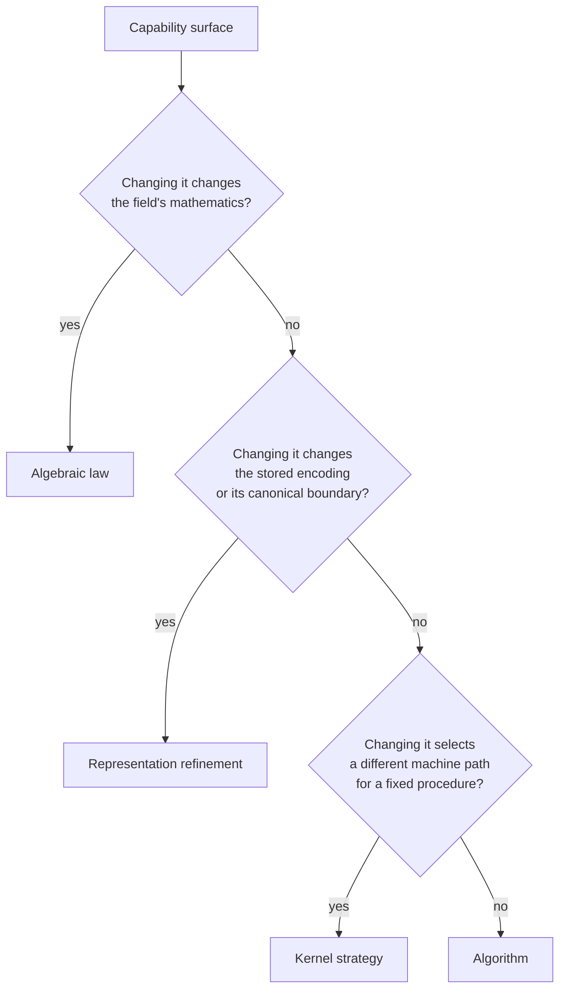

# Field-capability classification (6dc81018)

Every field-capability surface in the workspace holds exactly one of four
classes — algebraic law, algorithm, representation refinement, kernel strategy
— and one canonical abstraction. This document fixes those assignments, marks
every selection constant profile-scoped or out of scope, and gives every
parallel variant a cutover action or a named tracked exception.

This is the `capability-classification` contract of the [plan](plan.md). The
cited inventory it decides over is the [investigation](investigation.md); the
citations below name defining code re-derived against the tree at anchor commit
`2f2cbb37`, and §6 records where a re-derived citation differs from the
investigation's.

## 1. Classes and the assignment rule

| Class | What it holds | What changes when it changes |
|---|---|---|
| Algebraic law | Statements true of the field for every representation and every host: the operator set, characteristic, identities, inverses, order. | The mathematics, and every proof resting on it. |
| Algorithm | A procedure computing a law-defined result from law-level operations, host-independently. | Operation count, not the result. |
| Representation refinement | The encoding of an element or accumulator, together with the boundary that decodes it canonically. | Storage and the encode/decode boundary; observable values stay fixed. |
| Kernel strategy | Which machine path executes a fixed algorithm, and the state that selects it. | Execution path and cost; results stay equal across paths under `backend-behavioral-equivalence`. |

A surface takes the class of the thing that breaks when the surface changes.
The rule is applied in the order below, so a surface that satisfies two tests
lands in the earlier class.

Two consequences are load-bearing for the rest of this document. A threshold
that picks between procedures with equal results is kernel strategy, never an
algebraic law, even when it lives on a trait. A bound that limits the domain on
which a procedure is defined is part of that procedure, so it stays with the
algorithm or the representation and never enters a tuning profile.

## 2. Capability-surface classification

Each surface appears in exactly one subsection.

### 2.1 Algebraic law

| Capability surface | Defining code | Canonical abstraction | Why this class |
|---|---|---|---|
| Field-law trait: operator set, `Characteristic`, inverse contract | `crates/gf2-core/src/field/traits.rs:44` | `FiniteField` | The operator and identity contract holds for every carrier and host. |
| Context-free identities and order | `crates/gf2-core/src/field/traits.rs:995` | `ConstField` | `zero`, `one`, `order`, `order_log2` are field facts stated without a runtime field handle. |
| Executable statement of the laws | `crates/gf2-core/src/field/axiom_tests.rs:114` and `:236` | `test_field_axioms` / `test_const_field_axioms` | `finite-field-laws` binds every implementation to this one harness. |
| Production `FiniteField` carriers | `crates/gf2-core/src/gf2m/field.rs:1319`, `gf2m/wide.rs:1355`, `gfp/mod.rs:511`, `gfp/specialized.rs:986`, `gfpn/quadratic.rs:582`, `gfpn/cubic.rs:633` | `FiniteField` | Each is one carrier satisfying the law surface. |
| Production `ConstField` carriers | `crates/gf2-core/src/gfp/mod.rs:972`, `gfp/specialized.rs:1105`, `gfpn/quadratic.rs:702`, `gfpn/cubic.rs:757`, `gf2m/wide.rs:1818` | `ConstField` | Same laws with a context-free carrier. `Gf2mElement_` carries a runtime field handle and therefore implements `FiniteField` alone. |
| Test-only carriers `OpCount` and `RuntimeFp7` | `crates/gf2-core/src/field/batch_ops.rs:670`, `crates/gf2-algebra/src/permanent/ryser.rs:495` | `FiniteField` | Instruments that satisfy the law surface to observe generic algorithms; they are not shipped field families. |

### 2.2 Algorithm

| Capability surface | Defining code | Canonical abstraction | Why this class |
|---|---|---|---|
| Derived operations `square`, `pow`, `frobenius` | `crates/gf2-core/src/field/traits.rs:1039`, blanket impl `:1135` | `FiniteFieldExt` | Procedures over the law surface; the blanket implementation keeps one definition per operation, so this is not a second capability hierarchy. |
| Batch inversion | `crates/gf2-core/src/field/batch_ops.rs:115`, `:157`, `:210`, `:275`, `:309`, core `:363`; re-export `field/mod.rs:64` | `batch_inverse_core`, reached through the five free functions | One Montgomery-trick procedure bounded by `FiniteField`; the entry points differ in ownership and zero policy, not in algorithm. |
| GF($2^m$) multiplication procedures: table log/exp, CLMUL with Barrett reduction, schoolbook | `crates/gf2-core/src/gf2m/field.rs:1105`, `:1121`, `:1141`, `:1170` | `Gf2mElement_`'s `Mul` implementation | Every tier computes the same product; the tiers differ in operation count. Their ordering is kernel strategy (§2.4). |
| Wide carry-less multiply over limb arrays | `crates/gf2-core/src/gf2m/wide.rs:2052` | `clmul_wide_slice` | Scalar limb-wise procedure over the wide representation. |
| Polynomial multiplication, division, and batch evaluation | `crates/gf2-core/src/field/poly.rs:1006`, `:2531`, `:2869`, `:3209`, `:1381`, `:3254` | `FieldPoly` methods with the free `mul_fast` dispatcher | Schoolbook, Karatsuba, NTT, Newton division, and subproduct-tree evaluation agree on results; the crossovers pick cost. |
| Interpolation | `crates/gf2-core/src/field/poly_interpolate.rs:163` and `:223` | the `interpolate_auto` family | Same result below and above the dispatcher's crossover. |
| Dense linear algebra: Gauss–Jordan and M4RM inversion, blocked inversion, TRSM/TRMM, PLE, Winograd, blocked GEMM | `crates/gf2-core/src/alg/gauss.rs:65`, `:116`, `:225`; `field/inverse.rs:552`; `field/triangular.rs:298`, `:430`; `field/ple.rs:539`, `:1157`; `field/winograd.rs:162`; `field/matrix.rs:2587` | the `FieldMatrix` operations and their free functions | Recursion, blocking, and panel schedules change traffic and operation count, not the decomposition they produce. |
| Characteristic polynomial: cubic chain, Keller–Gehrig, Wiedemann | `crates/gf2-core/src/field/charpoly.rs:2123`, `:2176`, `:2285`, `:2656` | `FieldMatrix::charpoly` and the free `charpoly` | Alternative procedures for one polynomial. |
| Law-level permanent | `crates/gf2-algebra/src/permanent/ryser.rs:92` | `permanent_ryser<F: FiniteField>` | The only permanent algorithm expressed over field laws alone. |
| Lane-encoded permanents: single-word, multiword, $\mathbb{F}_5$, $\mathbb{F}_7$, parallel | `crates/gf2-algebra/src/permanent/bipedal3.rs:178`, `:407`, `:545`; `bipedal3_multiword.rs:150`; `bipedal5.rs:108`; `bipedal7.rs:110`; `parallel_bipedal3.rs:102` | the per-family `permanent_*` free functions | Gray-code procedures specialised to a lane encoding; they consume the encoding, they do not define it. |
| Lane-product reduction | `crates/gf2-algebra/src/packed/bipedal3.rs:1626` | `Bipedal3Vec::fold_mul`, inherent | D1b keeps this reduction off the trait; the inherent method is its single definition. |

### 2.3 Representation refinement

| Capability surface | Defining code | Canonical abstraction | Why this class |
|---|---|---|---|
| Delayed-reduction accumulator | `crates/gf2-core/src/field/traits.rs:70` | `FiniteField::Wide` | Names the accumulator encoding a carrier uses before reduction; `Wide = Self` for binary fields, a double-width integer for prime fields. |
| Extension-tower accumulators | `crates/gf2-core/src/gfpn/quadratic.rs:584`, `gfpn/cubic.rs:635` | `QuadraticExtWide` / `CubicExtWide` | Accumulator encodings propagated through the tower. |
| Prime-field storage form and its canonical boundary | contract `crates/gf2-core/src/gfp/mod.rs:93-109`, `new` `:167`, `value` `:190`, crate-private raw access `:214` and `:230`, constants `gfp/montgomery.rs:8-23` | `Fp
`'s `new`/`value` boundary | Montgomery, canonical, and bitwise storage are invisible at the API; only the boundary decodes. |
| Lane-parallel element encoding | `crates/gf2-algebra/src/packed/mod.rs:88`, `LANES` `:104`, `splat` `:162` | `PackedField` (gf2-algebra) | Encodes several `F` lanes in one machine word, with equality defined by canonical decode. |
| Lane-parallel vector encoding | `crates/gf2-algebra/src/packed/mod.rs:374` | `PackedFieldVec` (gf2-algebra) | Adds the zero-tail-padding invariant to the lane encoding. |
| Bipedal $\mathbb{F}_3$ encoding with alternative-zero canonicalisation | `crates/gf2-algebra/src/packed/bipedal3.rs:482` and `:1863`, decode `:723`, encode `:775`, tail mask `:1577` | `Bipedal3` / `Bipedal3Vec` | The redundant zero codeword decodes canonically at the public boundary. |
| Packed $\mathbb{F}_5$ encoding with reserved-codepoint decode | `crates/gf2-algebra/src/packed/packed5.rs:428` and `:989`, equality `:223`, decode `:680`, encode `:726`, tail mask `:831` | `Packed5` / `Packed5Vec` | Codepoints 5..=7 decode to zero; writes are canonical. |
| Packed $\mathbb{F}_7$ encoding with reserved-codepoint decode | `crates/gf2-algebra/src/packed/packed7.rs:581` and `:1056`, equality `:996`, decode `:778`, encode `:809`, tail mask `:886` | `Packed7` / `Packed7Vec` | Same boundary for the $\mathbb{F}_7$ encoding. |
| One-lane reference encoding | `crates/gf2-algebra/src/packed/scalar.rs:92` and `:203`, decode `:135`, encode `:145` | `ScalarPackedFp3` / `ScalarPackedFp3Vec` | A deliberately trivial encoding that serves as the correctness oracle for the packed contract. |

### 2.4 Kernel strategy

| Capability surface | Defining code | Canonical abstraction | Why this class |
|---|---|---|---|
| SIMD function tables and their accessors | module `crates/gf2-core/src/lib.rs:81`, tables `:100-115`, accessors `:145`, `:160`, `:173`, `:367`; disabled-feature mirror `:388` | the `crate::simd::maybe_*` accessors | One safe `OnceLock<Option<_>>` table per kernel family; the accessor is the selection authority every core caller shares. |
| Bit-buffer execution strategies | `crates/gf2-core/src/kernels/backend.rs:12`, scalar implementation `kernels/scalar/logical.rs:18` and `:23` | `Backend` | One trait over interchangeable bit-buffer execution paths. |
| Safe SIMD wrapper | `crates/gf2-core/src/kernels/simd/mod.rs:17`, detection `:26`, implementation `:34` | `SimdBackend` | Calls safe function pointers only, keeping unsafe inside the kernel crate per `unsafe-kernel-isolation`. |
| Bit-buffer backend selector | `crates/gf2-core/src/kernels/backend.rs:63` and `:95` | `select_backend_for_size` | A size predicate choosing between scalar and SIMD execution. |
| Deprecated bit-buffer kernel surface | `crates/gf2-core/src/kernels/mod.rs:41`, bridge impl `:57`, selector `:81` | `Backend` | A parallel surface over the same operations; disposition in §5. |
| Accelerator hooks on the field trait | `crates/gf2-core/src/field/traits.rs:339`, `:372`, `:396`, `:411`, `:444`, `:474`, `:510`, `:536`, `:556`, `:594`, `:614`, `:651`, `:683`, `:722`, `:961`, `:986` | the `#[doc(hidden)]` `try_*` / `has_*` hook family on `FiniteField` | Each hook offers an accelerated path and defaults to `None`/`false`, leaving the law-level path to the caller. |
| Trait-associated algorithm thresholds | `crates/gf2-core/src/field/traits.rs:825`, `:858`, `:892`, `:926` | the same `FiniteField` trait | Per-field selection between procedures with equal results; scope disposition in §4.3. |
| Prime-field PLE panel width override | `crates/gf2-core/src/gfp/mod.rs:903` | `Fp
`'s `PLE_PANEL_COLS` | Chooses a panel kernel by field family. |
| GF($2^m$) cached strategy state and priority ladder | `crates/gf2-core/src/gf2m/field.rs:169`, selection `:268-310`, table build `:401`, ordering `:1103-1190` | `FieldParams_` together with the `Mul` ladder | Per-field cached function pointers plus a fixed tier order over the §2.2 procedures. |
| Prime-field route selectors | `crates/gf2-core/src/gfp/simd_ops.rs:562` and `:1621` | `select_f32_path` / `select_f64_path` | Predicates over $P$ and $n$ choosing a packed float route. |
| Kernel feature detection | `crates/gf2-kernels-simd/src/lib.rs:102`, `gf2m.rs:78`, `gf2m_batch.rs:79`, `gf2m_wide.rs:85`, `gf2m_gemm.rs:72` | each module's `detect*` returning `Option<FnTable>` | Runtime CPU-feature probes; the returned table is what the core accessors cache. |
| SoA parallel scheduling | `crates/gf2-core/src/compute/field.rs:33`, entry points `:52`, `:94`, `:154`, `:201` | `should_parallelize_soa_batch` guarding the SoA batch entry points | Chooses a chunked parallel schedule; results stay seed-identical under `deterministic-seeded-execution`. |

Two facts about this class are recorded here because later sections depend on
them. No GFNI path exists in production; the evaluation that stopped at
AVX2/CLMUL is
`dev/archive/97bf0879-gf2-core-sota-performance/plans/fb271c41/gf2m_avx512_gfni_evaluation.md:17-29`,
so there is no GFNI surface to classify. Every inspected production dispatch
path carries an explicit fallback contract — hook defaults at
`crates/gf2-core/src/field/traits.rs:351-380` and `:623-694`, the schoolbook
tier at `gf2m/field.rs:1170`, the scalar wide path at `gf2m/wide.rs:2052` — but
the universal form of that statement is unverified, as the
[investigation](investigation.md) §4 records. Profile-driven selection inherits the same
obligation: a profile entry selects among paths that already have a tested
fallback, and it never removes one.

## 3. Packed lane ownership

`gf2-algebra` owns `PackedField` and `PackedFieldVec`. `gf2-core` neither
declares nor consumes them. This is the recorded D1a/D1b boundary and it is not
reopened here.

The rationale stands on three facts. D1a assigns every packed and permanent
public type to `gf2-algebra` and fixes the dependency edges that follow,
at `dev/archive/ae82bd73-gf2-algebra-permanent/plans/6e20133d/d1a_gf2_algebra_boundary.md:1-40`;
D1b names the same home for the trait surface and settles its shape — `LANES`
as an associated const, `splat` as a trait method, `fold_mul` deliberately
inherent, `Eq` as canonical-decode equality — at
`dev/archive/ae82bd73-gf2-algebra-permanent/plans/9fe275d3/d1b_packed_field_api.md:14-39`,
`:111-157`, `:159-189`, and `:192-218`. The shipped surface matches: the traits
are at `crates/gf2-algebra/src/packed/mod.rs:88` and `:374`, and the module
documentation names `gf2-algebra` as their home at `:1-12`.

The boundary is also the only assignment `crate-dependency-direction` permits.
`gf2-core` has no production dependency on `gf2-algebra`, so a lane trait
declared in `gf2-algebra` cannot be consumed from `gf2-core` without a reverse
edge; moving the traits into `gf2-core` would relocate a lane representation
that has no `gf2-core` consumer, while `gf2-algebra`'s inward use of
`gf2-core::FiniteField` at `crates/gf2-algebra/src/packed/mod.rs:22` is exactly
the permitted direction.

One consequence for change control: the W6 freeze is a documentation-only
checkpoint with no source-level checker, and says so at
`dev/archive/ae82bd73-gf2-algebra-permanent/plans/8c902184/gf_api_freeze_w6.md:135-142`.
Uniqueness of the declaration is therefore maintained by the dispositions in
§5, not by a gate.

## 4. Selection-constant scope

Every constant the investigation inventories appears in exactly one subsection
below. Profile-scoped means the value is a host-tuning crossover a versioned
tuning profile can carry; pilot, follow-on, and deferred distinguish when it
migrates. Out of scope means the value is not a host-tuning crossover at all
and stays in source.

### 4.1 Profile-scoped — pilot

The two families the plan's cutover covers.

| Constant | Defining code | Reason |
|---|---|---|
| `_SIMD_THRESHOLD` = 8 | `crates/gf2-core/src/kernels/backend.rs:96` | Buffer-size crossover between the scalar and SIMD bit-buffer backends; the pilot's bit-backend family. |
| `KARATSUBA_THRESHOLD` = 32 | `crates/gf2-core/src/field/poly.rs:2147` | Schoolbook-to-Karatsuba crossover; the pilot's polynomial family. |
| `SUBPRODUCT_THRESHOLD` = 4096 | `crates/gf2-core/src/field/poly.rs:2192` | Horner-to-subproduct-tree crossover for batch evaluation. |
| `NTT_THRESHOLD` = 128 | `crates/gf2-core/src/field/poly.rs:2711` | Karatsuba-to-NTT crossover in the `mul_fast` dispatcher. |
| `DIV_REM_THRESHOLD` = 2048 | `crates/gf2-core/src/field/poly.rs:2909` | Schoolbook-to-Newton crossover in `div_rem_auto`. |

### 4.2 Profile-scoped — follow-on

Host-tuning crossovers outside the pilot families; they migrate after the pilot
under the schema's extensibility rule.

| Constant | Defining code | Reason |
|---|---|---|
| `MATVEC_SIMD_MIN_WORDS` = 8 | `crates/gf2-core/src/matrix.rs:13` | Row-stride crossover into the SIMD matvec path. |
| `TRANSPOSE_CACHE_TILE_THRESHOLD_BLOCKS` = 16 | `crates/gf2-core/src/matrix.rs:1177` | Block count at which the transpose switches to the cache-tiled schedule. |
| `MACRO_TILE_BLOCKS` = 8 | `crates/gf2-core/src/matrix.rs:1115` | Macro-tile extent of that schedule, sized to the cache. |
| `SOA_PARALLEL_CHUNK_LEN` = 16 KiB | `crates/gf2-core/src/compute/field.rs:23` | Parallel chunk length for SoA batch arithmetic. |
| `SOA_PARALLEL_MIN_LEN` = $2 \times$ chunk | `crates/gf2-core/src/compute/field.rs:29` | Length below which the parallel schedule loses to serial execution. |
| `M4RM_DEFAULT_TABLE_BYTES` = 64 KiB | `crates/gf2-core/src/alg/m4rm.rs:27` | Gray-table budget for the default tier, a cache-residency figure. |
| `M4RM_SMALL_N_MAX_K` = 8 | `crates/gf2-core/src/alg/m4rm.rs:65` | Panel width cap of the sub-wide production tier (`choose_k_block_small_n`); admitted in place of `M4RM_DEFAULT_MAX_K`, re-derived at `f9befb21` by design `7d824b2f` §7.1. |
| `M4RM_MID_TABLE_BYTES` = 128 KiB | `crates/gf2-core/src/alg/m4rm.rs:34` | Table budget for the mid tier. |
| `M4RM_WIDE_TABLE_BYTES` = 256 KiB | `crates/gf2-core/src/alg/m4rm.rs:42` | Table budget for the wide tier. |
| `M4RM_WIDE_MAX_K` = 9 | `crates/gf2-core/src/alg/m4rm.rs:43` | Panel width cap for the wide tier. |
| `M4RM_TILED_MIN_STRIDE_WORDS` | `crates/gf2-core/src/alg/m4rm.rs:58` | Stride at which the register-tiled C-update starts winning. |
| `M4RM_WIDE_TIER_MIN_STRIDE_WORDS` = 16 | `crates/gf2-core/src/alg/m4rm.rs:96` | Stride at which the wide-row schedule replaces the small-$n$ heuristic. |
| `INVERT_M4RI_THRESHOLD` = 8 | `crates/gf2-core/src/alg/gauss.rs:29` | Size at which the Gray-table setup amortises; documented as a perf knob, not a correctness boundary. |
| `BLOCKED_INVERT_THRESHOLD` = 16 | `crates/gf2-core/src/field/inverse.rs:85` | Size at which blocked inversion replaces the direct path. |
| `TRSM_BLOCKED_PANEL_SIZE` = 64 | `crates/gf2-core/src/field/triangular.rs:243` | Row-panel width for blocked triangular solve. |
| `PLE_PANEL_RECURSIVE_BASE` = 128 | `crates/gf2-core/src/field/ple.rs:642` | Column window above which the PLE panel recurses. |
| `BLOCKED_BACK_SUB_MIN_DIM` = 128 | `crates/gf2-core/src/field/ple.rs:1684` | Dimension at which blocked back-substitution engages. |
| `GEMM_ROW_TILE` = 32 | `crates/gf2-core/src/field/matrix.rs:2504` | Row tile of the blocked classical GEMM. |
| `GEMM_COL_TILE` = 64 | `crates/gf2-core/src/field/matrix.rs:2508` | Column tile of the same. |
| `GEMM_AXPY_FAST_PATH_THRESHOLD` = $16^3$ | `crates/gf2-core/src/field/matrix.rs:2976` | Work volume above which the AXPY fast path is taken. |
| `CHUNK` = 256 | `crates/gf2-core/src/field/vec.rs:1022` | SIMD chunk length for `FieldVec` element-wise work. |
| `KG_DISPATCH_MIN_N` = `usize::MAX` | `crates/gf2-core/src/field/charpoly.rs:276` | Size at which the Keller–Gehrig route activates; the sentinel disables the route on measured evidence, and the value stays a host crossover. |
| `INTERPOLATE_THRESHOLD` = 16 | `crates/gf2-core/src/field/poly_interpolate.rs:115` | Naive-to-subproduct crossover for interpolation; a polynomial-domain crossover in a module outside the pilot's named family. |
| `N_THRESH_PRIME` = 251 | `crates/gf2-core/src/gfp/simd_ops.rs:537` | Prime bound admitting the packed f32 route. |
| $n \ge 512$ guard in `select_f32_path` | `crates/gf2-core/src/gfp/simd_ops.rs:571` | Size at which f32 pack cost amortises. |
| $n \ge 512$ guard in `select_f64_path` | `crates/gf2-core/src/gfp/simd_ops.rs:1628` | Same crossover for the f64 cascade. |
| `CHUNK_SUBSETS` = $2^{16}$ | `crates/gf2-algebra/src/permanent/parallel_bipedal3.rs:49` | Gray-walk chunk size for the parallel permanent, chosen by sweep. |

### 4.3 Profile-scoped — deferred

These four are host-tuning crossovers and belong in a profile, and they are
excluded from the pilot cutover.

| Constant | Defining code | Reason |
|---|---|---|
| `WINOGRAD_THRESHOLD` = 128 | `crates/gf2-core/src/field/traits.rs:825` | Classical-to-Winograd GEMM crossover, per field. |
| `TRI_BASE_THRESHOLD` = 8 | `crates/gf2-core/src/field/traits.rs:858` | Base-case size for triangular solve, per field. |
| `PLE_BASE_COLS` = 1 | `crates/gf2-core/src/field/traits.rs:892` | PLE base-case column count; a performance-dependent field-level knob. |
| `PLE_PANEL_COLS` | `crates/gf2-core/src/field/traits.rs:926`, `Fp
` override `crates/gf2-core/src/gfp/mod.rs:903` | Panel-dispatch column window; the override's 256/128/1 field-family values are the same knob resolved per prime. |

The exclusion has one cause. These constants are associated constants on
`FiniteField`, which is an extraction root for the Lean proof surface, and
trait-associated thresholds have already caused single-source-of-truth
synchronization defects between Rust and the generated proofs — recorded at
`dev/archive/97bf0879-gf2-core-sota-performance/active/97bf0879-handoff-10.md:41`,
which also records that a sweep selected the `TRI_BASE_THRESHOLD` value. The
selected `PLE_BASE_COLS` value carries the same measured provenance at
`dev/archive/97bf0879-gf2-core-sota-performance/bench_results/2026-05-07-4eb105f7-dense-la-parity-evidence.md:146`,
and the constants' place in the PLE/TRSM recursion is described at
`dev/archive/97bf0879-gf2-core-sota-performance/bench_results/73ec5da3/2026-05-07-73ec5da3-ple-trsm-tuning.md:45-50`.
Moving them to profile data changes the trait surface that extraction reads, so
the pilot keeps proof-surface churn out of the cutover. Their migration
requires the proof surface to be re-derived or the constants to be read through
a non-extracted seam; either resolution is separate work, and until it lands the
values stay where they are defined.

### 4.4 Out of scope

| Constant | Defining code | Reason |
|---|---|---|
| `M4RM_TILE_ROWS` = 8 | `crates/gf2-core/src/alg/m4rm.rs:46` | Fixes the tiled kernel's row-accumulator ABI (`crates/gf2-core/src/alg/m4rm.rs:66`); changing it changes a function signature, not a selection. |
| `M4RM_TILE_WORDS` = 4 | `crates/gf2-core/src/alg/m4rm.rs:48` | Register-tile width fixed by one YMM's four u64 lanes; a kernel shape, not a crossover. |
| `KG_MAX_RETRIES` = 8 | `crates/gf2-core/src/field/charpoly.rs:285` | Reliability policy: it bounds the randomized-failure probability, not execution cost. |
| `WIEDEMANN_MAX_RETRIES` = 8 | `crates/gf2-core/src/field/charpoly.rs:1341` | Reliability policy for the Wiedemann attempt class. |
| `WIEDEMANN_DETERMINISTIC_VERIFY_N` = 32 | `crates/gf2-core/src/field/charpoly.rs:1679` | Verification-scope policy fixing which sizes get the deterministic sweep. |
| `PackedField::LANES` | `crates/gf2-algebra/src/packed/mod.rs:104` | Representation bound: the lane count an encoding defines, not a tunable. |
| $n \le 63$ single-word permanent bound | `crates/gf2-algebra/src/permanent/bipedal3.rs:416` | Algorithm-domain limit of the single-u64 Gray counter. |
| `N_MAX_MULTIWORD` = 255 | `crates/gf2-algebra/src/permanent/bipedal3_multiword.rs:64` | Algorithm-domain limit of the `[u64; 4]` Gray counter. |
| `gf2-coding` decoder and simulation thresholds | `crates/gf2-coding/src/product/mod.rs:710-765` | Protocol and configuration parameters of the coding domain; no finite-field backend crossover exists in that crate. |
| `gf2-coding` GPU demapper controls | `crates/gf2-coding/src/modem/gpu_demapper.rs:1-26` | A prototype supporting a separately tracked measurement; not a field-kernel selector. |
| `B2_GRAY_TILE_WORDS` = 8 | `crates/gf2-core/src/alg/m4rm.rs:25` | Kernel shape, not a selection input: an accumulator array dimension, the literal match arms choosing the tiled builders, and the kernel-crate builder ABI stride. Re-derived at `f9befb21` by design `7d824b2f` §7.1. |
| `B2_GRAY_MAX_TILES` = 4 | `crates/gf2-core/src/alg/m4rm.rs:26` | Kernel shape: it bounds the register-accumulator array and is enumerated by the same match arms; its one comparison is derived from that shape. Re-derived at `f9befb21` by design `7d824b2f` §7.1. |
| `M4RM_DEFAULT_MAX_K` = 8 | `crates/gf2-core/src/alg/m4rm.rs:33` | Test fixture: `#[cfg_attr(not(test), allow(dead_code))]`, read only by the legacy-schedule comparison test; its §4.2 role is served by `M4RM_SMALL_N_MAX_K`. Re-derived at `f9befb21` by design `7d824b2f` §7.1. |
| `L1D_BYTES` = 32 KiB | `crates/gf2-algebra/src/permanent/bipedal3_multiword.rs:73` | Documented host assumption read by no execution path; its only use derives `MAX_MATRIX_BYTES_FOR_L1`. Re-derived at `f9befb21` by design `7d824b2f` §7.1. |
| `MAX_MATRIX_BYTES_FOR_L1` | `crates/gf2-algebra/src/permanent/bipedal3_multiword.rs:85` | Compile-time static assertion over the fixed algorithm domain `N_MAX_MULTIWORD`; changing it changes no selection. Re-derived at `f9befb21` by design `7d824b2f` §7.1. |

## 5. Cutover dispositions

| Variant | Defining code | Disposition | Action or tracked exception |
|---|---|---|---|
| Research-stub declarations of `PackedField` and `PackedFieldVec`, with stub implementations and zero-returning `fold_mul` | `dev/archive/packed_field_stub/src/lib.rs:80`, `:331`, `:774`, `:968`, `:938` | Superseded by the production traits at `crates/gf2-algebra/src/packed/mod.rs:88` and `:374`. | Executed: archived at `dev/archive/packed_field_stub` with a pointer to the production home; its D1b design-record linkage is preserved. Issue `7f818151`. |
| Deprecated bit-buffer kernel surface: the `Kernel` trait, its `ScalarBackend` bridge, and `select_kernel()` | `crates/gf2-core/src/kernels/mod.rs:41`, `:57`, `:81` (anchor-commit tree) | Superseded by `Backend` and `select_backend_for_size`. | Executed: all three removed by issue `a6636671` (commit `a8d07ab2`), no consumer remaining; `canonical-cutover` is satisfied for this surface. |
| Inherent arithmetic wrappers `add_inherent`, `sub_inherent`, `mul_inherent`, `neg_inherent` on the three packed element types | `crates/gf2-algebra/src/packed/bipedal3.rs:417`, `:436`, `:455`, `:473`; `packed5.rs:363`, `:382`, `:401`, `:419`; `packed7.rs:516`, `:535`, `:554`, `:572` | Retained parallel surface over the trait methods, each a verbatim tail call with no algorithmic divergence (`crates/gf2-algebra/src/packed/bipedal3.rs:387-405`). | Named tracked exception `packed-inherent-proof-targets`: the wrappers exist so Charon extraction has a fixed surface free of trait-dispatch indirection, per `dev/archive/ae82bd73-gf2-algebra-permanent/plans/a0c0a45f/d2_lean_bipedal3_sketch.md:1-20`. Convergence condition: extraction of a trait-generic algorithm succeeds, which issue `34d85cb9` establishes or falsifies. |
| Legacy SIMD multiply tier inside the GF($2^m$) ladder | `crates/gf2-core/src/gf2m/field.rs:1155` | Retained tier below the combined and split CLMUL-with-Barrett tiers; it is a strategy alternative under the one canonical ladder, not a second abstraction. | No cutover. Its position becomes profile data when the trait-adjacent selection families migrate (§4.2); the tier order stays a single ordering in one place. |
| Wide-kernel compatibility detectors `detect()` and `detect_571()` alongside `detect_wide()` | `crates/gf2-kernels-simd/src/gf2m_wide.rs:98` and `:104` against `:85` | Retained projections: both are `detect_wide().map(...)` with no independent detection logic, and both have live callers in the crate's tests and in `crates/gf2-core/benches/gf2m_wide_mul.rs:115`. | Named tracked exception `wide-kernel-detect-projections`: they remain pure projections of `detect_wide`. Acquiring independent feature-detection logic in either is a defect, since `crates/gf2-core/src/lib.rs:369` caches only `detect_wide`. |

No other parallel declaration of a classified surface exists in the tree: the
packed traits are declared exactly twice, in `gf2-algebra` and in the research
stub, and the remaining research crates consume the production traits directly
(`dev/research/permanent-sampling-feas/src/gray_update.rs:19`,
`dev/research/permanent_wave_gpu/src/wave.rs:15`,
`dev/research/permanent_wave_gpu/src/f5_candidates.rs:14`).

## 6. Citation notes

Each row above cites code re-read at the anchor commit. Where a re-derived
citation differs materially from the investigation's, the difference is
recorded here so the two documents can be reconciled.

| Subject | Investigation | This document |
|---|---|---|
| Wide and GEMM kernel selection guards | `x86/gf2m_wide.rs:333-344` and `x86/gf2m_gemm.rs:241-246` | Those lines are test helpers. Production detection is `crates/gf2-kernels-simd/src/gf2m_wide.rs:85` and `gf2m_gemm.rs:72`. |
| SoA parallel constants | `CHUNK_LEN` and `MIN_LEN` at `compute/field.rs:17-36` | The constants are named `SOA_PARALLEL_CHUNK_LEN` (`:23`) and `SOA_PARALLEL_MIN_LEN` (`:29`). |
| Batch-operation re-export | `field/mod.rs:65-66` | The re-export spans `crates/gf2-core/src/field/mod.rs:64-68`. |
| `splat` | `packed/mod.rs:155-158` | The method signature is at `crates/gf2-algebra/src/packed/mod.rs:162`. |
| `SelectedBackend` | `kernels/backend.rs:82-102` | The enum is at `crates/gf2-core/src/kernels/backend.rs:63`; `select_backend_for_size` is at `:95`. |
| Wide scalar fallback | `gf2m/wide.rs:2064-2113` | `clmul_wide_slice` is defined at `crates/gf2-core/src/gf2m/wide.rs:2052`. |
