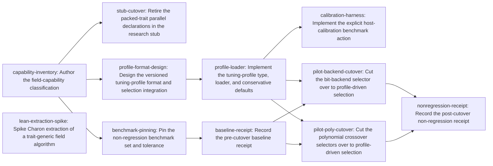

# Plan: Reconcile field capability traits and profile-driven kernel dispatch (6dc81018)

> Planning node: 663965f6. Authoritative graph:
> [breakdown.json](breakdown.json).

## Outcome and criterion approach

| Criterion | Approach | Evidence / open gap |
|---|---|---|
| REQ-01 | A single classification document assigns every capability surface and selection constant to one of four classes (algebraic law, algorithm, representation refinement, kernel strategy) and names its canonical abstraction and cutover disposition. The investigation already carries the cited inventory; the document synthesizes it into decisions. | [Investigation](investigation.md) §1, §6 |
| REQ-02 | The gf2-core / gf2-algebra boundary is already deliberately resolved: gf2-algebra owns the packed lane traits (D1a decision), and the only parallel declaration in the tree is the historical research stub. The classification records the ownership rationale; the stub's declarations are retired by archival. No trait relocation is planned. | Investigation §1 claim 2, §2 |
| REQ-03 | A versioned, committed tuning profile with an embedded conservative default table becomes the data source for selection at existing safe boundaries. Delivered as: format design → loader with defaults → explicit calibration action → per-family pilot cutovers (bit-backend selector; polynomial crossovers). The format design and calibration bind to the pilot families, with an explicit schema extensibility rule for later families; full migration of the remaining profile-scoped constants is deliberately follow-on work. | Investigation §1 claims 4/6 (threshold inventory), §5 |
| REQ-04 | A pinned benchmark set with a tolerance predeclared before any cutover measurement, delivered as three separated deliverables: procedure/tolerance definition, pre-cutover baseline receipt, post-cutover comparison receipt, each with full provenance per the repository's receipt conventions. | Investigation §5 (receipt conventions) |
| REQ-05 | Generic extraction was already falsified once (generic Ryser: no monomorphisation from a non-generic start root). The manifest therefore carries only the feasibility spike on a small trait-generic target (`batch_inverse<F>`). A documented successful extraction triggers a follow-up planning round adding the approved-sketch and proof-implementation issues (sketch approved before proof code per the proof discipline); a falsification escalates the criterion to the owner. REQ-05 completes only through that follow-up. | Investigation §1 claim 7, §2 (RyserBounded record) |

## Shared architectural contracts

### `dispatch-authority` [plan-fixed] — profile is data at existing safe boundaries

The tuning profile is versioned, committed data consumed at the existing safe
selection boundaries: the OnceLock function-table accessors in
`crates/gf2-core/src/lib.rs`, field-constructor strategy caching, and
algorithm-selector constants. It introduces no new crate dependency edges; the
packed lane traits remain owned by gf2-algebra per the recorded D1a boundary
decision; calibration is an explicit benchmark action and never a build side
effect. (Investigation §5, §6.)

### `capability-classification` [implementation-produced] — the four-class inventory

Produced by `capability-inventory`. Assigns each capability surface and
selection constant a class, canonical abstraction, and cutover disposition, and
marks each constant profile-scoped or out of scope. Consumed by the profile
design, the stub cutover, benchmark pinning, and proof factoring.

### `tuning-profile-format` [implementation-produced] — versioned profile schema

Produced by `profile-format-design`. Fixes the profile schema, version rule,
committed storage location, loader API, conservative-default and unknown-host
policy, and the calibration workflow with provenance fields. Consumed by the
loader, the calibration harness, and the pilot cutovers.

### `nonregression-procedure` [implementation-produced] — pinned set and tolerance

Produced by `benchmark-pinning`. Names the pinned benchmarks covering the pilot
selector families, the predeclared tolerance, and the runnable procedure.
Consumed by the baseline-receipt task.

### `nonregression-benchmarks` [implementation-produced] — the pre-cutover baseline

Produced by `baseline-receipt` by executing the pinned procedure unmodified
before the cutover. Consumed by the pilot cutovers and the post-cutover receipt.

## Generated decomposition overview

<!-- jit:breakdown-overview:begin -->
| Key | Title | Type | Outcome | Contracts | Sources | Footprint | Landing | Depends on |
|---|---|---|---|---|---|---|---|---|
| capability-inventory | Author the field-capability classification | task | Capability surfaces and selection constants classified; canonical abstraction and cutover named per capability | — | REQ-01, REQ-02, INV-CLAIM-1, INV-CLAIM-2, INV-CLAIM-3, INV-CLAIM-4, INV-CLAIM-6, INV-CLAIM-8, INV-ARCH | creates 1 | — | — |
| stub-cutover | Retire the packed-trait parallel declarations in the research stub | task | Research stub's parallel packed-trait declarations retired; production declaration unique outside dev/archive | capability-classification | REQ-02, INV-CLAIM-2, INV-PRIMITIVES | touches 2 | — | capability-inventory |
| profile-format-design | Design the versioned tuning-profile format and selection integration | task | Tuning-profile schema, storage, loader API, defaults policy, and calibration workflow fixed by design | capability-classification, dispatch-authority | REQ-03, INV-CLAIM-4, INV-CLAIM-6, INV-ARCH | creates 1 | — | capability-inventory |
| profile-loader | Implement the tuning-profile type, loader, and conservative defaults | task | Profile type, parser, and embedded conservative defaults land in gf2-core without selector behavior change | tuning-profile-format | REQ-03, INV-CLAIM-6 | creates 1, touches 1 | — | profile-format-design |
| calibration-harness | Implement the explicit host-calibration benchmark action | task | Explicit calibration action emits a loader-valid, provenance-stamped host profile | tuning-profile-format | REQ-03, INV-CLAIM-6 | creates 1, touches 1 | — | profile-loader |
| benchmark-pinning | Pin the non-regression benchmark set and tolerance | task | Pinned benchmark procedure and predeclared tolerance committed before any cutover measurement | capability-classification | REQ-04, INV-CLAIM-6, INV-PRIOR-ART | creates 1, touches 1 | — | capability-inventory |
| baseline-receipt | Record the pre-cutover baseline receipt | task | Committed pre-cutover baseline receipt from the pinned procedure | nonregression-procedure | REQ-04, INV-PRIOR-ART | creates 1 | — | benchmark-pinning |
| pilot-backend-cutover | Cut the bit-backend selector over to profile-driven selection | task | Bit-backend selector consumes the profile; default-profile behavior identical by construction | tuning-profile-format, nonregression-benchmarks, dispatch-authority | REQ-03, INV-CLAIM-4, INV-CLAIM-6 | touches 1 | — | profile-loader, baseline-receipt |
| pilot-poly-cutover | Cut the polynomial crossover selectors over to profile-driven selection | task | Polynomial crossover selectors consume the profile; default-profile behavior identical by construction | tuning-profile-format, nonregression-benchmarks, dispatch-authority | REQ-03, INV-CLAIM-4, INV-CLAIM-6 | touches 1 | — | profile-loader, baseline-receipt |
| nonregression-receipt | Record the post-cutover non-regression receipt | task | Committed post-cutover receipt against the pinned baseline within the predeclared tolerance | nonregression-benchmarks | REQ-04, INV-PRIOR-ART | creates 1 | — | pilot-backend-cutover, pilot-poly-cutover |
| lean-extraction-spike | Spike Charon extraction of a trait-generic field algorithm | task | Extraction feasibility of a trait-generic algorithm established with recorded evidence either way | — | REQ-05, INV-CLAIM-7, INV-PRIOR-ART | creates 2, uncertain | — | — |

<!-- jit:breakdown-overview:end -->

## Material risks and owner decisions

| Risk / decision | Resolution and rationale |
|---|---|
| Generic Lean extraction may be infeasible (already falsified for generic Ryser). | Chosen: this manifest carries only the bounded spike on `batch_inverse<F>`; the conditional proof work is planned after the spike resolves, and a failure escalates the epic's REQ-05 to the owner with recorded evidence. Rejected: pre-created conditional proof tasks (dependency edges release on any terminal state, so a falsified spike would still unlock proof work); rejected: authoring proofs first (repeats the falsified path blind); rejected: silently weakening REQ-05 (falsification-preserved). |
| REQ-03 scope: "kernel and backend selection consume a profile" spans ~40 constants across many families. | Chosen: mechanism plus a two-family pilot (bit-backend selector, polynomial crossovers) with defaults equal to current constants; the classification marks the remaining constants for follow-on migration. Rejected: whole-inventory migration in one epic (unbounded, unreviewable). |
| Packed-trait ownership could be reopened by "one canonical abstraction" pressure. | Chosen: keep gf2-algebra ownership per the recorded D1a boundary decision; only the research stub's parallel declarations are retired. Rejected: moving lane traits into gf2-core (violates the recorded boundary and adds no consumer). |
| Trait-associated threshold constants have a recorded Lean SSOT synchronization hazard. | Chosen: exclude them from the pilot cutover; classification records their disposition. Rejected: including them in the pilot (couples cutover to proof-surface churn). |
| Deviation from skill default: manifest and plan authored in-session rather than by a dispatched synthesizer sub-agent. | Chosen because the decomposition consumed session-held decisions (forum-agreed scope, criterion history); recorded per the skill's autonomous-defaults rule. |
| Baseline/receipt hosts. | Calibration and receipts run only on a prepared uncontended benchmark host under the lock wrapper, per repository benchmark policy. |

## Investigation sources

- [Investigation](investigation.md) — claim classifications, threshold inventory,
  complete consumer sweep, primitive verification, and boundary analysis remain
  there.

Manifest source-ID universe (validation runs with exactly these IDs):

| Source ID | Meaning |
|---|---|
| REQ-01..REQ-05 | The container's hard criteria (`jit issue show 6dc81018`) |
| INV-CLAIM-1..INV-CLAIM-8 | Investigation §1, claims 1–8 |
| INV-PRIOR-ART | Investigation §2 (prior-art sweep) |
| INV-CONSUMERS | Investigation §3 (consumer sweep) |
| INV-PRIMITIVES | Investigation §4 (primitive verification) |
| INV-ARCH | Investigation §5–§6 (architecture fit and invariant check) |
