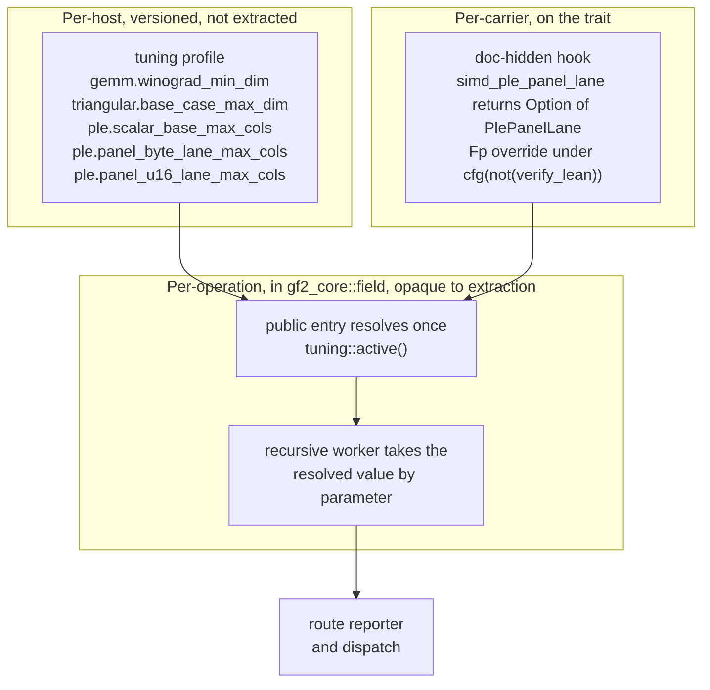

# Design: the proof-surface seam for the trait-associated selectors (7d7c647c)

This design fixes how the four trait-associated tuning constants of
[classification](../6dc81018-field-capability-dispatch/classification.md) §4.3 —
`WINOGRAD_THRESHOLD`, `TRI_BASE_THRESHOLD`, `PLE_BASE_COLS` and
`PLE_PANEL_COLS` — reach their read sites once they live in the versioned
tuning profile, and what the Lean extraction surface holds afterwards.

It executes owner decision DEC-T (2026-08-23), which rules that the four
migrate inside epic `6dc81018` through a non-extracted read seam designed
first
(`dev/active/6dc81018-field-capability-dispatch/progress.json:785`). It is an
additive amendment to the standing profile design
[`dev/active/220cab0b/design.md`](../220cab0b/design.md) and reuses the field
kinds, mechanism rule, and test conventions of the follow-on design
[`dev/active/7d824b2f/design.md`](../7d824b2f/design.md) without restating
them.

Every extraction claim below is verified by running the pinned Charon and
Aeneas pair on the tree at the worktree anchor
`9ebcb29ff1ff583a77fa587c1fe0b83a65ca8249`. §2 and §3 cite the probe that
establishes each; §9 indexes them. Every code citation is re-derived by
reading the tree at that anchor.

---

## 1. Problem statement

The four constants are associated constants on `FiniteField`
(`crates/gf2-core/src/field/traits.rs:825`, `:858`, `:892`, `:926`), the
extraction root of the Lean proof surface, with one per-prime override on
`Fp
` (`crates/gf2-core/src/gfp/mod.rs:903`). Classification §4.3 defers
them from the pilot cutover for one reason: moving them changes the trait
surface extraction reads, and trait-associated thresholds have already caused
Rust-to-Lean synchronization defects.

That hazard is not historical. **A third instance of it stands in the tree
today.** Commit `66c4759b` (2026-04-24) set the Rust default to
`WINOGRAD_THRESHOLD = 128` and touched neither `scripts/` nor `proofs/`, while
`scripts/fix-aeneas-sorrys.py:546` substitutes `ok 32#usize` into the generated
instance dictionaries and `proofs/Gf2Core/Funs.lean:1372` and `:2310` carry
that `32`. Probe AS1 reproduces the substitution from a fresh extraction at the
anchor (`probes/excerpts/tree-summary.txt`, `AS1_lean` block), so the divergence
is a property of the current pipeline rather than of a stale committed file.
The two earlier instances are the `TRI_BASE_THRESHOLD` R3 failure recorded at
`dev/archive/97bf0879-gf2-core-sota-performance/active/97bf0879-handoff-10.md:41`
and the `PLE_PANEL_COLS` `.default`-sibling workaround recorded at
`scripts/verify-lean.sh:49-52`.

The defect has one mechanism. Aeneas emits each constant's trait default as an
*axiom* and each instance dictionary entry as a *reference* to it; the
committed post-processing then rewrites the reference to a literal it carries
by hand. `scripts/fix-aeneas-sorrys.py:543-554` carries the literals for
`WINOGRAD_THRESHOLD` and `TRI_BASE_THRESHOLD`, applying them once per instance
dictionary, and `scripts/fix-aeneas-dupes.py:178-185` inlines the literals for
`PLE_BASE_COLS` and `PLE_PANEL_COLS`. Each hand-carried literal is a second
definition of a value whose source of truth is the Rust constant, which
`@/inv/single-source-prose` does not admit.

So the seam has a sharper job than "keep the surface still". It has to end the
class of defect that made §4.3 defer the constants in the first place, and it
has to be verified against the pinned pair rather than argued.

---

## 2. What the extraction surface holds today

Two Charon invocations reach these constants, and both are probed.

| Invocation | Roots | Trait module | Probe |
|---|---|---|---|
| The committed pipeline (`scripts/verify-lean.sh:103-131`), which produces `proofs/Gf2Core/` | `gf2_core::gfp`, `gf2_core::gfpn`, `gf2_core::gf2m::mul_raw` | `--opaque 'gf2_core::field'` | S1 / AS1 |
| The extraction chain of record, X3/AX3 of `dev/active/e6ea0dde/record.md:101-138` | `FiniteFieldExt::square`, `FiniteFieldExt::frobenius` | `--opaque 'gf2_core::field'` plus `--include` on `FiniteFieldExt` | X1 / AX1 |

`AX1_lean/Types.lean` is byte-identical to the record's committed
`dev/active/e6ea0dde/extraction/AX3_lean/Types.lean` after normalising the
generated module prefix, so the control confirms this worktree reproduces the
record's toolchain behaviour exactly.

Under both invocations the four constants reach the tree in exactly three
places, and in no other:

1. **Structure fields.** The extracted `FiniteField` trait is a Lean
   `structure` whose first four fields are the constants, typed
   `Result Std.Usize` (`proofs/Gf2Core/Types.lean:75-78`, reproduced at
   `probes/AS1_lean/Types.lean:75-78` and `probes/AX1_lean/Types.lean:74-77`).
2. **Axioms.** Each trait default becomes a `@[trait_default]` axiom in
   `FunsExternal_Template.lean` (`probes/AS1_lean/FunsExternal_Template.lean:213-247`).
3. **Instance-dictionary entries.** Each of the two extracted `FiniteField`
   instances supplies four entries; the `Fp
` override additionally emits its
   own per-prime definition
   (`probes/AS1_lean/Funs.lean:1197-1208`, `:1371-1378`, `:2336-2343`).

Three properties of that footprint decide the design.

**No extracted definition projects them.** The read sites are
`field/winograd.rs:163`, seven guards in `field/triangular.rs`, and three in
`field/ple.rs`; all live under `gf2_core::field`, which both invocations mark
`--opaque`. The constants are therefore declaration noise in the extracted
tree: present because the trait declares them, read by nothing.

**No proof obligation rests on them.** The obligation sketch states this
directly: the refinement obligations rest on the dictionary's arithmetic
fields, "never on `WINOGRAD_THRESHOLD`, `TRI_BASE_THRESHOLD`, `PLE_BASE_COLS`
or `PLE_PANEL_COLS`, which are declared in the extracted structure but
referenced by no lemma"
(`dev/active/1ac74567/proof-sketch.md:900-907`). The lemma statements project
`corecloneCloneInst.clone`, `coreopsarithMulInst.mul`,
`FiniteFieldInst.characteristic` and the dictionary's `pow`
(`dev/active/1ac74567/proof-sketch.md:149`, `:165`, `:555`, `:587`). A grep for
the four names over `proofs/` returns hits only in the four generated files.

**They are the sole reason the two instance dictionaries are recursive.**
Aeneas emits each default's reference with the instance itself as argument —
`WINOGRAD_THRESHOLD := field.traits.FiniteField.WINOGRAD_THRESHOLD.default
(gfp.Fp.Insts.Gf2_coreFieldTraitsFiniteFieldU64U128 P)` — so both instances are
emitted as the self-referential `impl_def` rather than a plain `def`
(`probes/AS1_lean/Funs.lean:1369`, `:2333`).

---

## 3. The seam

### 3.1 Shape

The seam has three parts, and each removes one way a tuning value can reach
the extracted surface.

**Part 1 — the constants leave the trait.** `FiniteField` no longer declares
them. The values live in the profile; each read site's public entry resolves
its value once through `tuning::active()` and threads it into the recursion,
which is the runtime mechanism 7d824b2f §2.2 defines and §2.3 constrains.

**Part 2 — the per-carrier residue becomes a tag, not a number.** The one
genuinely per-field value, `PLE_PANEL_COLS`, splits into a *lane class* the
carrier declares and a *width* the host declares (§4.3). The carrier's half is
a `#[doc(hidden)] fn simd_ple_panel_lane() -> Option<PlePanelLane>` replacing
the boolean `has_simd_ple_panel_base()` at `traits.rs:986`, with the `Fp
`
override carrying `#[cfg(not(verify_lean))]` exactly as the sixteen existing
accelerator hooks do (`crates/gf2-core/src/gfp/mod.rs:652-963`).

**Part 3 — the seam module stays off the surface.** `gf2_core::tuning`
(`crates/gf2-core/src/lib.rs:57`) occurs in zero generated files under every
probed invocation, baseline and post-seam. It is off the surface by
reachability today, and the cutover pins it there by adding
`--opaque 'gf2_core::tuning'` to both invocations, so a later widening of the
start set cannot pull a tuning literal into the tree.

### 3.2 What the trait keeps

`FiniteField` keeps every law-level item, every accelerator hook, and the two
non-tuning value items `max_unreduced_additions` and
`theorem_4_operand_bound`. `theorem_4_operand_bound` is not a host crossover:
it bounds the operands the delayed-reduction accumulator admits, so it stays,
along with its own hand-carried literal in
`scripts/fix-aeneas-sorrys.py:555-560`. That literal is out of this design's
scope and §7 records it.

### 3.3 What the extraction sees afterwards — verified

Probe S2/AS2 applies the constants' removal to the committed pipeline's
invocation; probe S3/AS3 applies the complete post-seam shape, adding the
`PlePanelLane` tag and its hook with the `Fp
` override under
`#[cfg(not(verify_lean))]`. Probe X2/AX2 applies the removal to the chain of
record. The tree transformation is committed at
`probes/make-seam-tree.py` and reverts to the anchor tree.

| Claim | Verified by | Result |
|---|---|---|
| Charon still exits 0 on the committed invocation | `logs-trimmed/S2.log`, `S3.log` | exit 0, both |
| Aeneas behaves as at the anchor on the committed invocation | `logs-trimmed/AS2.log`, `AS3.log` | exit 1 with complete files, matching the anchor's documented partial-file behaviour (`scripts/verify-lean.sh:216-218`) |
| Charon and Aeneas both exit 0 on the chain of record | `logs-trimmed/X2.log`, `AX2.log` | exit 0, both |
| `Types.lean` loses exactly the four structure fields | `probes/excerpts/AS1-to-AS2.diff`, `AX1-to-AX2.diff` | the four fields, plus `Source:` line-number metadata; nothing else |
| `FunsExternal_Template.lean` loses exactly the four axioms | `probes/excerpts/tree-summary.txt` | 31 axioms to 27 on the committed invocation; on the chain of record the file is **not written at all**, its four axioms having been its entire content |
| `Funs.lean` loses exactly the eight dictionary entries and the per-prime override | `probes/excerpts/AS1-to-AS2.diff` | those items, the two `impl_def` becoming plain `def`, and `Source:` metadata; nothing else |
| The remaining tree is unchanged in size and shape | `probes/excerpts/tree-summary.txt` | 13 structures before and after; 20 `sorry` before and after; 277 defs to 278, the net of two `impl_def` becoming `def` and one override def leaving |
| The chain of record's tree becomes self-contained | `probes/AX2_lean/Funs.lean` | the `import …FunsExternal` line and the `noncomputable section` marker both disappear |
| The lane tag and its hook add nothing | `probes/excerpts/AS2-to-AS3.diff` | AS3 differs from AS2 in `Source:` line numbers only; `PlePanelLane` and `simd_ple_panel_lane` occur in no generated file |
| The hand-carried literals disappear | `probes/excerpts/tree-summary.txt` | the committed post-processing patches 6 trait default fields at AS1 and 2 at AS2/AS3, and writes no tuning literal |
| The record's own blocker is untouched | `probes/excerpts/tree-summary.txt` | the six colliding structure field names are the same set before and after |
| The intermediate hoist state (§8's task U2) is surface-neutral | probe S4/AS4, `probes/make-hoist-tree.py` | a trait default whose body names a crate-private constant instead of a literal yields a tree identical to the baseline except for three `Source:` references in axiom docstrings, and the post-processing still patches the same six fields; the default's body is never translated, because `gf2_core::field` is opaque and Aeneas emits the default as an axiom regardless |

Two contingency claims cover a future widening of the extraction, verified on
the minimal probe crate `probes/seam-shape/`:

- **M2** — with the read site extracted and `--opaque 'seam_shape::tuning'`,
  the profile read becomes `axiom tuning.winograd_min_dim : Result Std.Usize`
  and the caller's body reads `let i ← tuning.winograd_min_dim`. The value is
  uninterpreted, which is the correct proof-surface treatment of a knob: an
  obligation over the driver holds for every value the host can install.
- **M3** — the same tree *without* the opacity translates the seam function's
  body and puts the literal back into `Funs.lean`
  (`def tuning.winograd_min_dim : Result Std.Usize := do ok 128#usize`). The
  `--opaque` pin of part 3 is therefore load-bearing rather than defensive.

One probe result corrects a plausible assumption and is recorded so nobody
rebuilds the design on it. **M4** shows that a defaulted trait method nothing
calls and an associated constant nothing reads both survive into the extracted
structure when the trait's module is transparent. The sixteen accelerator
hooks are absent from the real trees not because they are methods, but because
`gf2_core::field` is opaque and their `Fp` overrides carry
`#[cfg(not(verify_lean))]`, so nothing supplies or projects them; **M5**
confirms that under an opaque trait module only projected items survive at all.
Part 2's invisibility rests on that mechanism, and AS3 verifies it directly for
the hook this design adds.

### 3.4 Why the extraction chain of record is unaffected

The chain of record is X3/AX3 of `dev/active/e6ea0dde/record.md`, whose subject
is `FiniteFieldExt::square` and `frobenius`. Three facts make the seam inert
for it.

Its REQ-01 result stands: X2 and AX2 both exit 0 with the constants gone, as
X3 and AX3 do with them present. Its REQ-02 finding stands unchanged: the
blocker is six repeated field names arising from bounds on `Self`,
`Self::Characteristic` and `Self::Wide`
(`dev/active/e6ea0dde/record.md:206-219`), and probe AX2 emits the same six.
Its REQ-03 result stands: the sketch's lemma statements project
`corecloneCloneInst`, `coreopsarithMulInst`, `characteristic` and `pow`
(`dev/active/e6ea0dde/record.md:347`), none of which the seam touches.

The seam improves the record's position in one respect it is worth naming.
`AX2_lean` carries no `FunsExternal_Template.lean`, because the four constants
were that file's entire content. The rename step the record's elaboration
harness performs between Aeneas and Lean
(`dev/active/e6ea0dde/record.md:186-189`) has nothing left to rename, and the
generated tree stops being `noncomputable`.

---

## 4. The four constants as profile fields

### 4.1 Field table

Each field joins a family that the follow-on design's task `T1` already creates:
`gemm` (7d824b2f §3.7), `triangular` (§3.5), `ple` (§3.6). Every field is
`usize` in the schema and in the accessor, and every conservative default is
defined by naming an in-source constant rather than restating a literal
(220cab0b §2.5, §5 condition 4). Paths are relative to `crates/gf2-core/src/`
unless stated.

| Constant | Family.field | Kind | Range | Default names | Read site | Mechanism | Prepare |
|---|---|---|---|---|---|---|---|
| `WINOGRAD_THRESHOLD` = 128, `field/traits.rs:825` | `gemm.winograd_min_dim` | threshold | $0 \le t$ | `WINOGRAD_MIN_DIM_DEFAULT`, hoisted into `field/winograd.rs` | `field/winograd.rs:163`, `gemm_winograd` | runtime | new module-level `pub(crate) const` |
| `TRI_BASE_THRESHOLD` = 8, `field/traits.rs:858` | `triangular.base_case_max_dim` | threshold | $1 \le t$ | `TRI_BASE_MAX_DIM_DEFAULT`, hoisted into `field/triangular.rs` | `field/triangular.rs:848`, `:911`, `:1092`, `:1147`, `:1198`, `:1309`, `:1445` | runtime, resolved once and threaded | new module-level `pub(crate) const` |
| `PLE_BASE_COLS` = 1, `field/traits.rs:892` | `ple.scalar_base_max_cols` | threshold | $1 \le t$ | `PLE_SCALAR_BASE_MAX_COLS_DEFAULT`, hoisted into `field/ple.rs` | `field/ple.rs:596`, `:920` | runtime, resolved once and threaded | new module-level `pub(crate) const` |
| `PLE_PANEL_COLS`, `field/traits.rs:926`, override `gfp/mod.rs:903` | `ple.panel_byte_lane_max_cols` | threshold | $1 \le t$ | `fp_small_panel::KC` = 256, `crates/gf2-kernels-simd/src/x86/fp_small_panel.rs:102` | `field/ple.rs:653` | runtime, resolved once and threaded | widen `KC` from `pub(crate)` to `pub` and re-export it from the kernel crate root |
| (same) | `ple.panel_u16_lane_max_cols` | threshold | $1 \le t$ | a new `fp_medium_ple::KC_U16` = 128 | `field/ple.rs:653` | runtime, resolved once and threaded | the u16 blocking factor exists only as prose (`fp_medium_ple.rs:201`, `:268`) and as the `128` literal at `gfp/mod.rs:911`; name it once in the kernel crate first |

All five are `_max_` fields except `winograd_min_dim`. The operator each
substitution preserves is `min(m,k,n) >= t` for Winograd, `m <= t` for the
triangular base case, and `win <= t` for the two PLE guards.

### 4.2 Range derivations

Each floor comes from the read site's own arithmetic, as 7d824b2f §2.1
requires.

`gemm.winograd_min_dim` admits $t = 0$. `gemm_winograd_with_threshold` clamps
its own base case to `threshold.max(2)`
(`field/winograd.rs:261`), so $t \in \{0, 1, 2\}$ all fire the base case only
below dimension 2, and $t = \texttt{usize::MAX}$ disables Winograd entirely — the sentinel
220cab0b §2.1 admits for a `_min_` field.

`triangular.base_case_max_dim` floors at 1. At $t = 0$ and $m = 1$ the guard
at `field/triangular.rs:848` does not fire, `h = m / 2 = 0`, and the recursion
re-enters on the same one-row block: the driver does not terminate.

`ple.scalar_base_max_cols` floors at 1 for the same reason. At $t = 0$ and
$\text{win} = 1$, `field/ple.rs:596` does not fire, `h = win / 2 = 0`, and the
right-half recursion at `:669` re-enters on the same one-column window.

The two panel fields floor at 1 because a zero-wide panel dispatches a kernel
with no pivots to find. Their meaningful lower bound is
`ple.scalar_base_max_cols`, below which the panel branch is unreachable — the
`PLE_PANEL_COLS >= PLE_BASE_COLS` invariant the design record states as R4
(`dev/archive/026fc832-gf2-core-sota-stretch/active/2e8c5a29/2e8c5a29-panelized-ple-design.md:405-408`).
That relation stays a documented performance expectation rather than a loader
check, following 7d824b2f §7.2's disposition of the same situation for
`trsm_blocked_min_dim` and `trsm_panel_rows`: violating it makes the panel
branch dead, not wrong, because `field/ple.rs:596` has already returned. The
`debug_assert!` at `:613-616` moves to the resolve point and compares the two
resolved values.

### 4.3 The per-field question and its answer

A profile is per-host; the constants are per-field-type. The mapping is
smaller than it looks, and the reason is worth stating exactly.

Three of the four have **no override anywhere in the workspace**. A grep for
the four names across `crates/` finds definitions only at
`field/traits.rs:825`, `:858`, `:892`, `:926` and `gfp/mod.rs:903`. Their
rustdoc offers per-field override guidance (`traits.rs:813-819`, `:847-853`,
`:882-891`) that no carrier has ever taken up, and their measured provenance is
a sweep on one field on one host (§4.4). They are host crossovers that happen
to be declared per field, so they become plain per-host profile fields with no
mapping at all.

`PLE_PANEL_COLS` is the real case, and its variation is a property of the
*kernel*, not of the field. The override resolves three ways
(`gfp/mod.rs:903-918`): 256 for $P \le 251$, 128 for $252 \le P < 65536$, and 1
otherwise. The first two are the two panel kernels' L1d cache-blocking factors,
`KC` and `KC_U16`; the third is not a width but a disabling sentinel, and it is
redundant, because `has_simd_ple_panel_base()` already returns false for
$P \ge 65536$ — `fp_ple_panel_base_available::
()` admits only the medium-
eligible and small-eligible primes
(`crates/gf2-core/src/gfp/simd_ops.rs:2951-2956`) — and the read site at
`field/ple.rs:653` conjoins the two.

So the live variation is two values, one per kernel lane class. The seam splits
the constant accordingly: the carrier declares *which* kernel it registers, the
host declares *how wide* each kernel's window may be. The carrier's half is the
`PlePanelLane` tag of §3.1 part 2, which carries no number and never reaches
the extracted surface; the host's half is the two profile fields of §4.1.

This is also the answer for any future carrier. A GF($2^m$) family that gains a
panel kernel declares its lane class and inherits that class's host-tuned
width; it does not acquire a trait constant.

### 4.4 Measured provenance carried forward

Each field's rustdoc names the receipt behind its default. The cutover moves
these citations from the trait constants' rustdoc to the profile fields'
rustdoc and to the conservative table's entry, and the tuning receipt records
them the way 220cab0b §2.7 records the pilot's.

| Value | Provenance |
|---|---|
| `WINOGRAD_THRESHOLD` = 128 | Sweep over $\{32, 64, 128, 256, 512, 1024\}$ against a classical baseline at $n = 2048$ on Mersenne-31, `crates/gf2-core/benches/strassen_threshold_results.md:29-53`; 32, 64 and 128 tie within single-run noise at $1.75$–$1.81\times$ and 128 is selected for the shorter recursion tree and L2-resident blocks. Both Mersenne-31 and `Gf2mWide<1, Gf2m8>` cross over at $\approx 128$ (`:56-58`). Landed by `66c4759b`. |
| `TRI_BASE_THRESHOLD` = 8 | Criterion sweep over $\{4, 8, 16, 32, 64\}$ on `Fp<MERSENNE_31>` at $n \in \{256, 1024\}$ for `trsm_upper`, `trsm_lower` and `pluq`, on an AMD Ryzen 9 5900X (Zen 3) with `rustc 1.95.0`: `dev/archive/97bf0879-gf2-core-sota-performance/bench_results/73ec5da3/2026-05-07-73ec5da3-ple-trsm-tuning.md:26-33` for the host and `:79-110` for the sweep tables and the selection. Recorded again at `.../active/97bf0879-handoff-10.md:41`. |
| `PLE_BASE_COLS` = 1 | Same Criterion session; values 1, 4, 8 and 16 evaluated, with 8 producing a $\approx 80\,\%$ regression on `pluq/Fp_M31/uniform/256` because the Mersenne-31 blocked GEMM amortises its delayed `u128` reduction and the schoolbook leaf does not: `dev/archive/97bf0879-gf2-core-sota-performance/bench_results/2026-05-07-4eb105f7-dense-la-parity-evidence.md:146`. |
| `PLE_PANEL_COLS` = 256, byte lanes | `KC = 256` is the byte-lane panel kernel's L1d-fit blocking factor, derived at `crates/gf2-kernels-simd/src/x86/fp_small_panel.rs:98-102`; route-C measurement at `dev/bench_results/2026-05-24-fc182ed5-route-c-integer-panel-aggregate.csv`. |
| `PLE_PANEL_COLS` = 128, u16 lanes | `KC_U16 = 128`, half the byte-lane factor for the 2× lane-density gap, on the 5900X reference host: `dev/bench_results/2026-05-27-68db401b-fp-medium-ple.md:30-31` with the host at `:8`. |

Two of these receipts sit in `dev/archive/`, so the cutover cites the archive
path rather than the `dev/bench_results/` path the constants' current rustdoc
uses; three rustdoc citations in the tree are already stale for that reason
(`field/traits.rs:836`, `:872`; `field/ple.rs:641` and `:753` cite
`dev/bench_results/6823c8a0/…`, which now lives under
`dev/archive/026fc832-gf2-core-sota-stretch/bench_results/6823c8a0/`). The
cutover's stale-text sweep repairs them.

### 4.5 Read patterns, route reporters, and test obligations

All five fields take the runtime mechanism: every read site sits behind a
public entry point that allocates at least one output matrix and performs
$O(n^2)$ or more work, so each clears the amortisation screening rule 7d824b2f
§5.3 predeclares. None of the values appears as an array length, a match
pattern, a loop step, or a predicate over a const generic, so none takes the
bake mechanism.

Every read site is inside a recursion, so obligation 3 of 7d824b2f §2.3 —
resolve once at a non-recursive entry and pass the value by parameter — governs
all of them. Winograd already has the shape: `gemm_winograd` at
`field/winograd.rs:163` resolves and calls `gemm_winograd_with_threshold`,
which threads the value through the whole recursion. The other three need the
`*_resolved` split the polynomial family uses.

| Family | Selection boundary | Resolve-once position | Route reporter the dispatcher calls | Test obligation |
|---|---|---|---|---|
| `gemm` | `field/winograd.rs:261`, `gemm_winograd_with_threshold` | `gemm_winograd`, `field/winograd.rs:162` | `winograd_route(m, k, n) -> WinogradRoute` | installed-profile route files above and below the boundary; the existing bit-exactness property tests in `field/winograd.rs` keep running on the conservative table |
| `triangular` | the seven `*_inner` guards | the nine public entries `trsm_upper` `:298`, `trsm_lower` `:360`, `trsm_upper_blocked` `:430`, `trsm_lower_blocked` `:495`, `trmm_upper` `:560`, `trmm_lower` `:618`, `trtri_upper` `:681`, `trtri_lower` `:734`, `trtrm` `:815` | `triangular_route(m) -> TriangularRoute` | installed-profile route files on both sides of the boundary for one `trsm`, one `trmm` and one `trtri` entry; a review check that each `*_inner` takes the threshold by parameter |
| `ple` (scalar base) | `field/ple.rs:596`, `:920` | `ple_in_place`, `field/ple.rs:539` | `ple_base_route(win) -> PleBaseRoute` | installed-profile route files at the boundary and its neighbours |
| `ple` (panel lanes) | `field/ple.rs:653` | the same resolve point | `ple_panel_route(lane, win) -> PlePanelRoute` | one installed-profile route file per lane class, asserting the reported route at the lane's width and one column above it; the existing `Fp` width assertions at `field/ple.rs:3358-3370` are rewritten to read the profile |

Three rules from 7d824b2f §4 govern those tests unchanged: the route comes from
production code the dispatcher itself calls, mathematical equivalence between
arms is not evidence of routing, and one installed profile per test binary
because `install` is one-shot per process.

The `ple` reporter takes the lane explicitly because the width it reports
depends on the carrier's kernel class, and the class comes from
`F::simd_ple_panel_lane()`. That keeps the reporter callable from a test
without a field type in hand while leaving the dispatcher's own call
`ple_panel_route(F::simd_ple_panel_lane(), win)`.

---

## 5. Key decisions

### D1 — The constants leave the trait rather than being read through it

**Chosen:** delete the four associated constants from `FiniteField` and read
their values from the profile at the drivers' public entries.

**Rejected: keep the constants and have the drivers consult the profile
first**, falling back to `F::WINOGRAD_THRESHOLD` when nothing is installed.
This leaves two authorities for one value, which `@/inv/convention-convergence`
forbids, and it changes nothing about the extraction surface: the axioms, the
structure fields, the dictionary entries and every hand-carried literal remain,
so the defect class §1 describes survives the migration untouched.

**Rejected: keep the constants and gate them with `#[cfg(not(verify_lean))]`,**
the mechanism the sixteen accelerator hooks use. The cfg suppresses an
*override*, not a declaration: the trait would still declare the constants,
extraction would still emit the four axioms and the dictionary entries, and the
post-processing would still substitute literals for them. Probe S2 is what
distinguishes the two, and only removal clears the surface.

**Rejected: re-derive the proof surface to carry the values.** Classification
§4.3 offers this as the alternative resolution. It is strictly more work for a
strictly worse outcome: it would make four host-tuning knobs into proof-visible
constants, so every host recalibration would become a proof-surface change.

The cost of removal is that a future carrier cannot override a threshold at the
type level. §4.3 shows nothing does today, and the lane-tag mechanism covers
the one case that genuinely varies per carrier.

### D2 — `PLE_PANEL_COLS` splits into a carrier-declared lane and a host-declared width

**Chosen:** a `#[doc(hidden)] fn simd_ple_panel_lane() -> Option<PlePanelLane>`
hook replacing the boolean `has_simd_ple_panel_base()`, plus two profile fields.

**Rejected: one profile field, `ple.panel_max_cols`.** The two lane widths are
different physical facts. `KC = 256` and `KC_U16 = 128` are each a panel's
L1d-fit bound at its own lane density
(`fp_small_panel.rs:98-102`, `dev/bench_results/2026-05-27-68db401b-fp-medium-ple.md:30-31`),
and the u16 kernel additionally asserts a hard `tail_len <= 256` bound at
`crates/gf2-kernels-simd/src/x86/fp_medium_ple.rs:270-273`. A single field
either overshoots one kernel's budget or undershoots the other's.

**Rejected: a profile field keyed by prime.** The prime is not a host property,
and a per-prime map in a per-host artifact would make the schema carry a fact
whose source of truth is the kernel dispatch table.

**Rejected: keep the width on the kernel side and drop the profile field.**
The blocking factor is a cache-residency figure, which is the plainest kind of
host property, and 220cab0b's whole premise is that such figures belong in the
profile.

The cost is a public enum and one more hook. Both are small, and the hook
replaces a boolean rather than adding to the hook family's count.

### D3 — The seam module is pinned opaque, not merely unreachable

**Chosen:** add `--opaque 'gf2_core::tuning'` to both invocations in
`scripts/verify-lean.sh` as part of the cutover.

**Rejected: rely on reachability.** `gf2_core::tuning` occurs in no generated
file today, and would not occur after the cutover either, because the drivers
that read it are under the opaque `gf2_core::field`. But probe M3 shows what a
reachable transparent seam produces: the literal back in `Funs.lean`. The
epic's cost of unverified extraction assumptions is the argument for pinning
the property rather than inheriting it from an invocation's current start set.

The cost is two lines in the pipeline script and the obligation to keep them
when the start set changes.

### D4 — Each default names a constant in the module that owns the value

**Chosen:** the three uniform defaults are hoisted into their own selector
modules (`field/winograd.rs`, `field/triangular.rs`, `field/ple.rs`); the two
lane widths name constants in `gf2-kernels-simd`, where the blocking factors
are derived.

**Rejected: name the trait constants.** They are what the cutover removes.

**Rejected: restate the literals in `CONSERVATIVE`.** 220cab0b §5 condition 4
forbids it, and the divergence in §1 is exactly what a restated literal
produces.

Naming `KC` from `gf2-core` requires widening it from `pub(crate)` to `pub` and
re-exporting it, and requires giving the u16 factor a name for the first time.
That work is a `@/inv/single-source-prose` repair on its own terms: today
`gfp/mod.rs:907` and `:911` restate both blocking factors as bare literals
while the kernels state them in prose.

### D5 — The route reporters are public, per the follow-on convention

**Chosen:** four `#[must_use] pub fn *_route(..)` reporters the dispatchers
themselves call, following 7d824b2f D6 and the polynomial cutover's shape at
`crates/gf2-core/src/field/poly.rs:2177`.

**Rejected: reuse the existing `Fp` width assertions as the routing evidence.**
`field/ple.rs:3358-3370` and `field/triangular.rs:1679-1681` assert associated-
constant *values*, not routes. After the cutover the constants are gone and
those assertions have nothing to read; a value assertion against the profile
accessor would also be the literal-value assertion
`@/inv/semantic-test-assertions` confines to one canonical suite.

### D6 — The standing extensibility rule changes at its source

**Chosen:** 220cab0b gains an appended amendment for issue `7d7c647c` recording
that §5 condition 1's inadmissibility of the classification's §4.3 constants is
discharged, and §4.3 of that design is rewritten to name the seam rather than
the exclusion. Classification §4.3 gains the same pointer.

**Rejected: state the discharge only here.** 220cab0b §4.3 and §5 condition 1
name the four constants as inadmissible in present tense
(`dev/active/220cab0b/design.md:682-691`, `:697-701`). Leaving them saying that
while this design migrates them is the stale-text defect AGENTS.md's sweep rule
and `@/inv/present-tense-prose` both name, and a second statement of the
convention here is the private parallel variant
`@/inv/convention-convergence` forbids. This is the pattern 7d824b2f already
followed (`dev/active/220cab0b/design.md:836`).

---

## 6. What the seam does to the post-processing scripts

The cutover removes every hand-carried literal for these four constants, and
the removal is mechanical.

| Script site | Today | After the cutover |
|---|---|---|
| `scripts/fix-aeneas-sorrys.py:543-547` | rewrites `WINOGRAD_THRESHOLD :=` to `ok 32#usize` | deleted; the pattern matches nothing |
| `scripts/fix-aeneas-sorrys.py:548-554` | rewrites `TRI_BASE_THRESHOLD :=` to `ok 8#usize` | deleted |
| `scripts/fix-aeneas-dupes.py:179` | inlines `PLE_BASE_COLS` as `ok 1#usize` | deleted |
| `scripts/fix-aeneas-dupes.py:180-184` | inlines `PLE_PANEL_COLS` as `ok 1#usize` | deleted |
| `scripts/verify-lean.sh:49-52` | documents the `PLE_PANEL_COLS` `.default`-sibling workaround | deleted |
| `proofs/Gf2Core/FunsExternal.lean:96-99` | two hand-written axioms for the `WINOGRAD_THRESHOLD` and `TRI_BASE_THRESHOLD` defaults | deleted; that file is hand-maintained and never regenerated (`scripts/verify-lean.sh:308-313`) |

`patch_trait_default_fields` keeps its `theorem_4_operand_bound` rewrite, so the
committed post-processing patches two trait default fields instead of six —
the count probes AS2 and AS3 both report.

The regenerated `proofs/Gf2Core/` and `proofs/Gf2Algebra/` trees are part of
the cutover's diff, and `./scripts/verify-lean.sh` followed by
`(cd proofs && lake build)` is its gate.

---

## 7. Findings, risks and open questions

### 7.1 A live synchronization defect, recorded

`WINOGRAD_THRESHOLD` is 128 in Rust (`field/traits.rs:825`, set by `66c4759b`
on 2026-04-24) and 32 in the generated proofs (`proofs/Gf2Core/Funs.lean:1372`,
`:2310`) because `scripts/fix-aeneas-sorrys.py:546` carries the pre-`66c4759b`
literal. Probe AS1 reproduces the substitution from a fresh extraction at the
anchor.

The divergence is inert for correctness: no lemma reads the field
(`dev/active/1ac74567/proof-sketch.md:900-907`), and the Rust dispatch never
consults the Lean value. It is nonetheless the third instance of the defect
class that made classification §4.3 defer these constants, and it is
`@/inv/no-deferred-defects` work. The cutover resolves it by deleting the
substitution rather than by correcting the literal, so this design does not
file a separate repair; §8's task U8 owns it, and if the epic's sequencing
delays U8 beyond this epic the finding needs its own tracked issue.

### 7.2 `PLE_PANEL_COLS` selects nothing at today's conservative values

At `field/ple.rs:645-657` the panel dispatch is reached only when the preceding
guard `has_simd_ple_panel_base() && win > PLE_PANEL_RECURSIVE_BASE` does not
fire, so any carrier with a panel kernel arrives at `:653` with
$\text{win} \le 128$. Both live widths — 256 and 128 — are at least 128, so
`win <= F::PLE_PANEL_COLS` is a tautology there, and the third arm's value 1 is
unreachable because `has_simd_ple_panel_base()` is false for $P \ge 65536$.

The constant is therefore inert *at the conservative default of the
recursive-base width*, not inert in general: `PLE_PANEL_RECURSIVE_BASE` becomes
`ple.panel_base_max_cols` under 7d824b2f §3.6 with range $1 \le t$, and a
profile that raises it above a lane's width makes that lane's ceiling bind
again. The two fields express a real relation — the tuned sub-panel width
against the kernel's L1d-fit ceiling — that no artifact states today.

This design migrates the constant as REQ-02 directs and records the finding
under `@/inv/falsification-preserved`. Open question 1 puts the alternative to
the owner.

### 7.3 Risks

| Risk | Assessment and mitigation |
|---|---|
| The seam changes the generated proof tree, and the epic has twice paid for unverified extraction claims. | Every claim in §3.3 is a probe result on the pinned pair at the anchor, on both invocations of record, with the commands committed as `.cmd` files and the logs as `logs-trimmed/`. The tree transformation is committed and reversible. The remaining unverified step is `lake build` on the regenerated tree, which §8's task U8 runs as its gate. |
| Nine public triangular entry points each need a resolve-once split, which is the largest mechanical change in the cutover. | The split is the shape `field/poly.rs:2177-2182` already ships, and the review check is structural: `tuning::active()` appears once per public entry and never inside a `*_inner`. U6 is scoped to that family alone. |
| Removing an associated constant from a public trait is a breaking change for any external implementor. | `FiniteField` has no external implementor the workspace knows of, and the constants carry no `#[doc(hidden)]`, so the change is public API. It belongs in the epic's API-change record; open question 3 asks the owner whether a deprecation cycle is wanted. |
| The two panel-width fields are non-sweepable by the standing crossover rule, so committed profiles omit them. | They are threshold fields with two reachable arms, but the arms are reachable only on an AVX2 host with a registered panel kernel, and forcing the non-panel arm needs a steering mechanism `389aa4de` does not provide. They join 7d824b2f §5.2's omission list under 220cab0b §5 condition 5 until a later sweep measures them. |
| `KC` becomes `pub` in `gf2-kernels-simd` so `gf2-core`'s conservative table can name it. | It widens the kernel crate's public surface by one integer constant whose value is already documented. The alternative, restating 256 in `gf2-core`, is the defect D4 exists to remove. |
| Installing a panel width above a kernel's own bound. | The u16 kernel asserts `tail_len <= 256` at `crates/gf2-kernels-simd/src/x86/fp_medium_ple.rs:270-273`, so an over-wide profile trips a kernel assertion rather than corrupting a result. U3's range validation caps each lane field at its kernel's asserted bound, which is a per-field range and needs no cross-field rule. |

### 7.4 Open questions for the epic lead

1. **Fold or keep `PLE_PANEL_COLS`.** §7.2 shows it discriminates nothing at
   today's values. Migrating it as two lane fields follows REQ-02 literally and
   makes the ceiling explicit; deleting it and letting `ple.panel_base_max_cols`
   carry the whole cap is the `@/inv/canonical-cutover` reading. This design
   takes the first and asks the owner to confirm.
2. **Sequencing against `7d824b2f` T1.** All five fields join families that
   7d824b2f's T1 creates, so this seam's schema task cannot start before it.
   Confirm that T1 lands first rather than this design duplicating the family
   objects.
3. **Public-API treatment.** Removing four associated constants from
   `FiniteField` is a breaking change to a public trait. Confirm that the epic
   takes it directly rather than through a deprecation cycle.
4. **Reporter naming.** `ple.panel_base_max_cols` (7d824b2f §3.6, the tuned
   sub-panel width) and `ple.panel_byte_lane_max_cols` (this design, the
   kernel's ceiling) are adjacent names for different knobs. Confirm the pair
   or direct a rename at the schema's source.

---

## 8. Implementation breakdown

Each task is worker-sized: one family or one mechanism, one coherent diff, its
own gates. `cargo-ci` and `code-review` gate every task; `doc-review` gates the
tasks that write or rewrite prose. `7d824b2f` T1 is the one external
dependency, and it creates the three family objects these fields join.

| Key | Scope (one line) | Depends on | Gates |
|---|---|---|---|
| U1 | Name the two panel blocking factors once: widen `fp_small_panel::KC` to `pub` and re-export it, introduce `fp_medium_ple::KC_U16 = 128` with the rustdoc derivation the module states in prose today, and point both at their receipts. No `gf2-core` change. | — | cargo-ci, code-review, doc-review |
| U2 | Hoist the three uniform defaults into module-level `pub(crate) const`s in `field/winograd.rs`, `field/triangular.rs` and `field/ple.rs`, with each trait default naming its hoisted constant rather than restating the literal, carrying the rustdoc and provenance citations across and repairing the three stale receipt paths. The trait still declares all four constants and every read site still reads them, so behaviour is unchanged and the extraction surface is unchanged as probe S4 verifies. | — | cargo-ci, code-review, doc-review |
| U3 | Extend the tuning schema with the five fields, their ranges, vocabulary entries, `CONSERVATIVE` entries naming the constants U1 and U2 provide, the JSON round trip, and the regenerated `conservative.json`. No selector site changes. | `7d824b2f` T1, U1, U2 | cargo-ci, code-review, doc-review |
| U4 | Introduce `PlePanelLane` and `simd_ple_panel_lane()`, retire `has_simd_ple_panel_base()`, and move the `Fp
` override to the new hook under `#[cfg(not(verify_lean))]`. Dispatch behaviour is unchanged: the driver still gates on `lane.is_some()`. | — | cargo-ci, code-review, doc-review |
| U5 | Cut `gemm.winograd_min_dim` over: resolve once in `gemm_winograd`, add `winograd_route`, add the boundary route files. `gemm_winograd_with_threshold` already takes the value by parameter. | U3 | cargo-ci, code-review, doc-review |
| U6 | Cut `triangular.base_case_max_dim` over: split each of the seven `*_inner` drivers into a resolved worker taking the threshold by parameter, resolve once at each of the nine public entries, add `triangular_route`, add the route files, and rewrite the module dispatch tables at `field/triangular.rs:75`, `:145`, `:254`, `:522`, `:641` to name the profile field. | U3 | cargo-ci, code-review, doc-review |
| U7 | Cut the three `ple` fields over: resolve once in `ple_in_place`, thread the scalar base and the resolved lane width through `ple_in_place_window` and `ple_in_place_window_no_panel`, move the `PLE_PANEL_COLS >= PLE_BASE_COLS` `debug_assert!` to the resolve point, add `ple_base_route` and `ple_panel_route`, rewrite the width assertions at `field/ple.rs:3358-3370` as route observations, and update the module walkthrough at `field/ple.rs:55-62`. | U3, U4 | cargo-ci, code-review, doc-review |
| U8 | Remove the four constants from `FiniteField` and the `PLE_PANEL_COLS` override from `Fp
`; delete the four hand-carried literal substitutions from `scripts/fix-aeneas-{sorrys,dupes}.py`, the two orphan axioms from `proofs/Gf2Core/FunsExternal.lean`, and the workaround note from `scripts/verify-lean.sh`; add `--opaque 'gf2_core::tuning'` to both invocations there; regenerate `proofs/Gf2Core/` and `proofs/Gf2Algebra/` and commit the regenerated trees. | U5, U6, U7 | cargo-ci, code-review, doc-review, plus `./scripts/verify-lean.sh` and `(cd proofs && lake build)` |
| U9 | Amend the conventions at their source: 220cab0b gains the `7d7c647c` amendment discharging §5 condition 1 and rewrites its §4.3; classification §4.3 records the executed migration and points at this design. | U8 | doc-review |
| U10 | Extend the calibration sweep to `gemm.winograd_min_dim`, `triangular.base_case_max_dim` and `ple.scalar_base_max_cols`, reusing `389aa4de`'s profile-steering mechanism, and record each outcome — measured, tie, non-monotone, or uncalibrated — in the calibration receipt. The two panel-lane fields stay omitted until a steering mechanism reaches the non-panel arm. | `389aa4de`, U5, U6, U7 | cargo-ci, code-review, doc-review |

U1, U2 and U4 are mutually independent and change no behaviour; U5, U6 and U7
form one wave behind U3; U8 is the single task that moves the extraction
surface, and it moves it exactly as §3.3 verifies.

Two obligations ride on every cutover task beyond its code, both from 7d824b2f
§8: the structural read-pattern check — `tuning::active()` once per public
entry, never inside a recursion — and the stale-text sweep, so each migrated
constant's rustdoc becomes a default-definition statement naming the profile
field that holds the live value.

---

## 9. Probe index

All commands are committed as `.cmd` files under
`dev/active/7d7c647c/probes/` and executed through `probes/run.sh`, which
prints the command file into the log before running it, so the text quoted here
is byte-identical to what ran. Toolchain identities captured at run time are in
`probes/excerpts/toolchain-versions.txt`: `charon 0.1.217` on
`nightly-2026-06-01`, `aeneas 5220259c`, `rustc 1.95.0`, Lean
`v4.30.0-rc2`. `.llbc` files are not committed; `.gitignore:62` excludes them
and they regenerate from the `.cmd` files. `AS1_lean/` is the committed gf2-core
baseline tree; `AS2_lean/`, `AS3_lean/` and `AS4_lean/` are each 99 % identical
to it, so `probes/.gitignore` excludes them and `probes/excerpts/AS1-to-AS2.diff`,
`AS2-to-AS3.diff` and `AS1-to-AS4.diff` carry their complete deltas.

| Run | What it establishes |
|---|---|
| S1 / AS1 | Baseline on the committed pipeline's invocation; reproduces `proofs/Gf2Core/`'s pre-post-processing surface and the live `32` substitution |
| S2 / AS2 | The same invocation with the four constants off the trait |
| S3 / AS3 | The same invocation with the complete post-seam shape, tag and hook included |
| S4 / AS4 | The same invocation on the intermediate hoist state, where the trait defaults name module constants |
| X1 / AX1 | Baseline on the chain of record; `Types.lean` byte-identical to the record's `AX3_lean` |
| X2 / AX2 | The chain of record with the constants off the trait |
| M1–M5 | The minimal shape probe `probes/seam-shape/`: const read (M1), opaque seam read (M2), transparent seam read (M3), unread const and uncalled defaulted method under a transparent trait (M4), opaque trait module with a concrete root (M5) |

| Path | Contents |
|---|---|
| `probes/run.sh` | Runner: executes one `.cmd` file, tees to `logs/<run>.log` |
| `probes/make-seam-tree.py` | Applies and reverts the post-seam source shape |
| `probes/make-hoist-tree.py` | Applies and reverts the intermediate hoist shape |
| `probes/seam-shape/` | The minimal extraction-shape probe crate |
| `probes/logs-trimmed/` | Trimmed log per run, each opening with its command and closing with `exit=`/`elapsed=` |
| `probes/excerpts/tree-summary.txt` | Per-tree structure, definition, axiom and `sorry` counts, colliding field names, tuning-constant occurrences, and the post-processing substitutions each tree attracts |
| `probes/excerpts/*.diff` | The surface deltas §3.3 cites, one complete diff per changed tree |
| `probes/{versions,tree-summary,trim-logs,surface-diffs}.sh` | Regenerate the derived artifacts above |

---

## 10. Criterion coverage

The criteria are stated once, on issue `7d7c647c`. This table maps each to the
section that meets it.

| Criterion | Where it is met | What meets it |
|---|---|---|
| REQ-01 | §2, §3 | §2 states what the surface holds today and that no extracted definition or lemma reads it; §3 fixes the three-part seam, tabulates what the surface holds afterwards with the probe that verifies each claim on the pinned pair, and shows the chain of record's three results all stand. |
| REQ-02 | §4 | §4.1 gives each constant its family, field name, kind, range, conservative default naming an in-source constant, read site and mechanism; §4.2 derives every range from the read site's arithmetic; §4.3 answers the per-field-to-per-host mapping; §4.4 carries the measured provenance forward; §4.5 names the route reporter and test obligation per family. |
| REQ-03 | §8 | Ten worker-sized tasks with one-line scopes, dependencies and gates, ordered into three independent preparation tasks, a schema task, three family cutovers, the single surface-moving task with its Lean gates, the convention amendment, and the calibration extension. |
