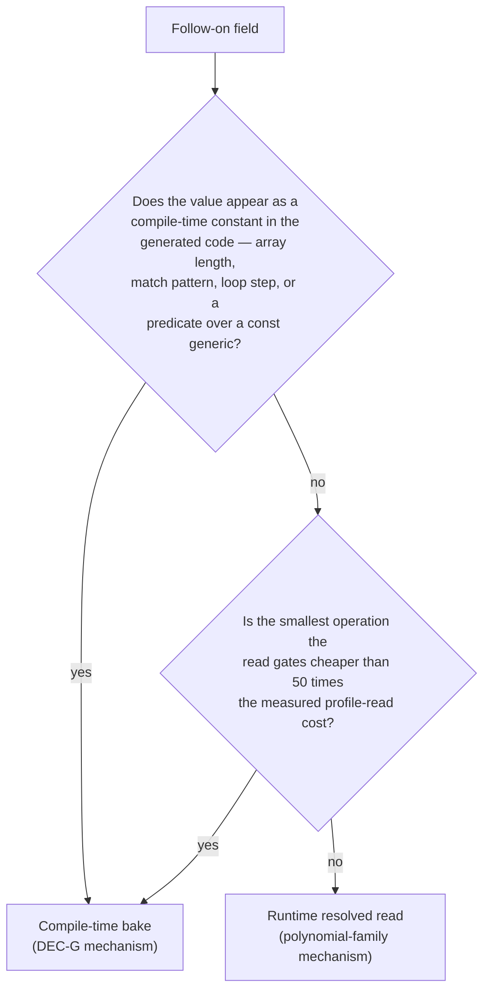

# Design: follow-on selector migration to the tuning profile (7d824b2f)

This design admits every profile-scoped follow-on selection constant of the
[classification](../6dc81018-field-capability-dispatch/classification.md) §4.2
into the versioned tuning profile. It is an additive amendment to the standing
design [`dev/active/220cab0b/design.md`](../220cab0b/design.md), taken under
that document's §5 extensibility rule: it adds families and fields, changes no
existing field's name, meaning, unit, operator, or type, and therefore leaves
`schema_version` at its current value (220cab0b §2.2 rule 1).

Every code citation is re-derived by reading the tree at worktree anchor
`f9befb215fab3a0affdfc31ad16da2146aca0948`. Where a re-derived citation differs
materially from the classification's, §7.1 records the difference, following the
convention the classification uses for the same purpose in its own §6.

## 1. Problem statement

Two selector families take their values from the tuning profile: the bit
backend and the polynomial crossovers, which 220cab0b §4.1 and §4.2
integrate. The classification's §4.2 inventory holds twenty-seven further
selection rows that select between behaviourally equivalent execution paths or
size a schedule to the host's cache and register file — the inventory as
re-derived by this design's §7.1, whose five reclassified rows the
classification's §4.4 now records. Each is compiled into the library, so a
host whose cache hierarchy, vector width, or core count moves a crossover has no
way to say so short of editing and rebuilding.

Three properties of the pilot's measured record constrain any solution, and all
three are decided evidence rather than open questions.

- **A profile read on a few-nanosecond call path costs more than the tolerance
  allows.** The first post-cutover receipt attributes 0.337867 ns/call at
  `bit_backend/popcount/words=1` to resolving `simd_min_words` through
  `tuning::active()`, and a threshold cache reduces but does not remove it
  (0.395 ns/call, ratio 1.206586 against $\tau_{\text{cell}} = 1.05$). Both figures are
  recorded in 220cab0b §4.1's `c42720ce` and DEC-G amendments.
- **The compile-time bake removes that cost entirely.** DEC-G holds the
  bit-backend threshold in a committed module selected by the declared cfg
  `gf2_tuning_baked` (`crates/gf2-core/src/kernels/backend.rs:83-89`,
  `crates/gf2-core/src/tuning/baked.rs:7`), with the repository CI script
  executing the baked routing witnesses as a required scoped step
  (`scripts/cargo-ci.sh:235`).
- **A recursion resolves its threshold once.** The polynomial family reads
  `tuning::active()` once per public call and threads the resolved value into
  the recursive worker (`crates/gf2-core/src/field/poly.rs:2723` and `:3017`,
  with the public route reporters at `:2177`, `:2260`, `:2840` and `:3076`
  delegating to `*_resolved` helpers). The sixth post-cutover receipt reports
  `RESULT: PASS` at all thirty-four pinned cells under that pattern
  (`dev/benchmarks/tuning_profiles/2026-08-22-post-cutover-receipt-6.md`).

The migration therefore has to decide, per constant, which of those two
mechanisms carries its value, and it has to do so from the constant's read site
rather than from its family name.

## 2. Field kinds and the mechanism rule

### 2.1 Two field kinds

220cab0b §2.1 fixes one field kind: a **threshold field**, whose name carries
the comparison operator as a `_min_`/`_max_` suffix, and whose cutover is a
substitution of the constant by the profile accessor with the operator
untouched.

The §4.2 inventory contains a second kind. A constant such as `GEMM_ROW_TILE`
(`crates/gf2-core/src/field/matrix.rs:2504`) or `SOA_PARALLEL_CHUNK_LEN`
(`crates/gf2-core/src/compute/field.rs:23`) participates in no comparison: it is
a loop step, a chunk length, a byte budget, or a panel-width cap sized to the
host's cache. This design names that kind an **extent field**, and gives it the
naming rule that carries the same checkable property as the operator suffix:

| Kind | Name shape | Cutover is checkable because |
|---|---|---|
| Threshold | `<subject>_min_<unit>` / `<subject>_max_<unit>` | the comparison operator is unchanged by the substitution |
| Extent | `<subject>_<unit>` — `_words`, `_bytes`, `_blocks`, `_len`, `_cols`, `_rows`, `_tile`, `_k`, `_subsets` | the surrounding arithmetic is unchanged by the substitution |

An extent field states an admissible range for exactly the same reason a
threshold does, and the range is derived from the read site's own arithmetic:
a chunk length of zero makes `par_chunks_mut` panic, a macro-tile of zero makes
the transpose's outer walk stop advancing, and a panel cap below two makes
`usize::clamp` panic on an inverted interval. §3 states the derivation per
field.

This generalises 220cab0b §5 condition 3, which names only the `_min_`/`_max_`
suffix. The generalisation is additive: every existing field keeps its name and
its operator, and every new threshold field still carries the suffix. The
convention's source restates the two-kind rule in 220cab0b's appended
amendment for issue `7d824b2f`, so it keeps one form.

### 2.2 The mechanism rule (REQ-02)

A field's value reaches its read site by one of two mechanisms, and the read
site decides which.

**Compile-time bake.** The value is a `const` in the selector's own module,
defined as the conservative default under `#[cfg(not(gf2_tuning_baked))]` and as
the committed calibrated profile's value under `#[cfg(gf2_tuning_baked)]`,
exactly as `crates/gf2-core/src/kernels/backend.rs:85-89` holds
`SIMD_MIN_WORDS`. The default build's generated code is identical to today's,
because the constant resolves to the same literal. The runtime profile still
carries, validates, and exposes the field; installing it does not move the
boundary. That is the contract DEC-G already states for
`bit_backend.simd_min_words`, and this design reuses it verbatim rather than
inventing a second inert-field convention.

**Runtime resolved read.** The value is read once per public operation through
`tuning::active()`, at a non-recursive, non-looping entry position, and passed
by parameter into any recursion or loop below it. This is the polynomial
family's shape: `mul_dispatch` at `crates/gf2-core/src/field/poly.rs:2723`
takes the resolved `karatsuba_min_degree` as a parameter and the recursion
forwards it.

**The $50\times$ floor.** The screening question in the diagram is answered
against a measured numerator: the pilot's attributed profile-read cost of
0.34–0.40 ns/call (§1). A read whose gated operation costs at least $50\times$
that — about 20 ns, which is the scale of a single heap allocation —
contributes at most 2 % of that operation, inside the pinned procedure's
predeclared $\tau_{\text{cell}}$ of 5 %. §5.3 applies the floor per family and
§7.2 records it as an open question for the owner, because it is an argument
from a measured numerator rather than a fresh measurement.

### 2.3 Read-pattern obligations

Every runtime-read family satisfies four structural obligations, all checkable
by reading the diff at `code-review`:

1. `tuning::active()` appears exactly once per public entry point, and never
   inside a loop body, a recursive function, or a per-row or per-panel helper.
2. The selector's decision is expressed by a `#[must_use] pub fn <op>_route(..)
   -> <Op>Route` reporter that reads `active()` and delegates to a private
   `<op>_route_resolved(threshold, ..)`, and **the dispatcher itself calls one
   of those two functions**. No dispatcher re-implements the comparison.
3. A recursion or loop that needs the value takes it as a parameter from the
   resolved entry point.
4. The comparison operator and the surrounding arithmetic are byte-for-byte
   what they are today; the substitution replaces the constant's name and
   nothing else.

Obligation 2 is what makes the route-observation tests of §4 possible without a
test-local copy of the comparison, and it is the shape
`crates/gf2-core/src/field/poly.rs:2177-2197` already ships.

## 3. Schema extension (REQ-01)

Eleven new family objects join `selectors`, and the existing `polynomial`
family gains one field. Twenty-eight fields carry the twenty-seven §4.2 rows,
one of those rows splitting into a threshold and an extent field (D3). §7.1
records the re-derivation that moved five rows of the classification's
original follow-on inventory to its §4.4, one of them replaced in §4.2 by the
live constant that serves its role.

Every field is `usize` in the schema and in the accessor, following 220cab0b
§2.1. Every conservative default is **defined by naming the existing in-source
constant**, never by restating its literal (220cab0b §2.5 and §5 condition 4);
the "Default names" column is that constant, and the "Prepare" column states
the visibility or hoisting change the naming needs. Paths are relative to
`crates/gf2-core/src/` unless stated.

### 3.1 `bit_matrix` — `matrix.rs`

| Field | Range | Default names | Read site | Frequency | Mechanism | Prepare |
|---|---|---|---|---|---|---|
| `matvec_simd_min_words` | $0 \le t$ | `MATVEC_SIMD_MIN_WORDS` = 8, `matrix.rs:13` | `matrix.rs:1329`, `BitMatrix::matvec` | per-operation | bake | drop the `#[cfg(feature = "simd")]` gate at `:12` from the default constant, keeping it on the selection; widen to `pub(crate)` |
| `transpose_simple_max_blocks` | $0 \le t$ | `TRANSPOSE_CACHE_TILE_THRESHOLD_BLOCKS` = 16, `matrix.rs:1177` | `matrix.rs:1117-1118`, `BitMatrix::transpose_blocked` | per-operation | runtime | widen the associated const to `pub(crate)` |
| `transpose_macro_tile_blocks` | $1 \le t$ | `MACRO_TILE_BLOCKS` = 8, `matrix.rs:1115` | `matrix.rs:1139` and `:1142` | per-operation | runtime | hoist out of the function body to a module-level `pub(crate) const` |

`transpose_simple_max_blocks` is a `_max_` field: `matrix.rs:1117-1118` selects
the simple two-level block loop when both block counts are **at or below** the
value, so the operator the substitution preserves is `<=`.

`transpose_macro_tile_blocks` is codegen-neutral as a runtime value: it sets the
end of a `while` walk whose inner driver `transpose_inner_loop` already takes
runtime block ranges at `matrix.rs:1120` and `:1143`. Its floor is 1 because at
$t = 0$ the walk's `br_end` equals `br_macro` and the loop stops advancing.

### 3.2 `soa_batch` — `compute/field.rs`

| Field | Range | Default names | Read site | Frequency | Mechanism | Prepare |
|---|---|---|---|---|---|---|
| `parallel_min_len` | $0 \le t$ | `SOA_PARALLEL_MIN_LEN`, `compute/field.rs:29` | `compute/field.rs:36`, `should_parallelize_soa_batch` | per-operation | runtime | already `pub` |
| `parallel_chunk_len` | $1 \le t$ | `SOA_PARALLEL_CHUNK_LEN` = 16 KiB, `compute/field.rs:23` | `compute/field.rs:73-77`, `:104-108`, `:176-181`, `:212-217` | per-operation | runtime | already `pub` |

The chunk length's floor is 1 because `par_chunks_mut` panics on a zero chunk.
The two fields are independent: `SOA_PARALLEL_MIN_LEN` is defined as twice the
chunk length in source, and the conservative table reproduces that by naming the
constant, but an installed profile may set them freely. The relation is a
performance choice, not a correctness one, so the loader does not cross-validate
them.

### 3.3 `m4rm` — `alg/m4rm.rs`

| Field | Range | Default names | Read site | Frequency | Mechanism | Prepare |
|---|---|---|---|---|---|---|
| `wide_tier_min_stride_words` | $0 \le t$ | `M4RM_WIDE_TIER_MIN_STRIDE_WORDS` = 16, `:96` | `:84`, `choose_k_block` | per-operation | runtime | widen to `pub(crate)` |
| `tiled_min_stride_words` | `M4RM_TILE_WORDS` $\le t$ | `M4RM_TILED_MIN_STRIDE_WORDS` = `M4RM_TILE_WORDS` = 4, `:58` | `:694`, `use_register_tiled_schedule`, called at `:605` | per-operation | runtime | widen to `pub(crate)` |
| `default_table_bytes` | $0 \le t$ | `M4RM_DEFAULT_TABLE_BYTES` = 64 KiB, `:27` | `:127`, `production_table_budget` | per-operation | runtime | widen to `pub(crate)` |
| `mid_table_bytes` | $0 \le t$ | `M4RM_MID_TABLE_BYTES` = 128 KiB, `:34` | `:125` | per-operation | runtime | widen to `pub(crate)` |
| `wide_table_bytes` | $0 \le t$ | `M4RM_WIDE_TABLE_BYTES` = 256 KiB, `:42` | `:123` | per-operation | runtime | widen to `pub(crate)` |
| `wide_max_k` | $1 \le t$ | `M4RM_WIDE_MAX_K` = 9, `:43` | `:85` | per-operation | runtime | widen to `pub(crate)` |
| `small_n_max_k` | $2 \le t$ | `M4RM_SMALL_N_MAX_K` = 8, `:65` | `:117`, `choose_k_block_small_n` | per-operation | runtime | widen to `pub(crate)` |

Every read reaches `choose_k_block` (`:82`), which `multiply` calls once at
`:585` for a matrix product costing $O(m k n / 64)$ word operations, so a single
resolved read per multiplication is the whole cost.

The ranges come from the arithmetic at the read sites.
`tiled_min_stride_words` cannot fall below `M4RM_TILE_WORDS` because the
$8\times4$ register tile needs that many full words to fire once, which the constant's own
rustdoc at `:49-57` states and which its definition `= M4RM_TILE_WORDS` encodes;
`M4RM_TILE_WORDS` is classification §4.4 kernel shape and stays in source, so
the profile's floor cites it rather than a literal. The table budgets admit 0
because `choose_k_block_with_limit` degrades to a one-row panel there
(`:151-161`). `wide_max_k` floors at 1 because `:141` returns a zero panel width
at $t = 0$, and `small_n_max_k` floors at 2 because `:117` passes it as the
upper bound of a `clamp(2, ..)`, which panics on an inverted interval.

### 3.4 `dense_inverse` — `alg/gauss.rs`, `field/inverse.rs`

| Field | Range | Default names | Read site | Frequency | Mechanism | Prepare |
|---|---|---|---|---|---|---|
| `m4ri_min_dim` | $0 \le t$ | `INVERT_M4RI_THRESHOLD` = 8, `alg/gauss.rs:29` | `alg/gauss.rs:70`, `invert` | per-call | runtime | already `pub` |
| `blocked_min_dim` | $1 \le t$ | `BLOCKED_INVERT_THRESHOLD` = 16, `field/inverse.rs:85` | `field/inverse.rs:181` | per-call | runtime | widen to `pub(crate)` |

`blocked_min_dim` floors at 1 because the blocked driver reads `a.get(0, 0)`
on the strength of $n \ge 1$, which `field/inverse.rs:648` records.

### 3.5 `triangular` — `field/triangular.rs`

| Field | Range | Default names | Read site | Frequency | Mechanism | Prepare |
|---|---|---|---|---|---|---|
| `trsm_blocked_min_dim` | $0 \le t$ | `TRSM_BLOCKED_PANEL_SIZE` = 64, `field/triangular.rs:243` | `field/inverse.rs:419` and `:431` | per-call | runtime | already `pub` |
| `trsm_panel_rows` | $1 \le t$ | same constant | `field/inverse.rs:423` and `:435`, as the `block_size` argument | per-call | runtime | already `pub` |

One source constant serves two roles at the same call sites: it gates the
blocked path and it supplies that path's panel width. D3 (§6) splits it into a
threshold field and an extent field so both keep the naming rule of §2.1, with
the shared default preserving today's behaviour exactly. The panel width is
codegen-neutral as a runtime value because `trsm_upper_blocked` and
`trsm_lower_blocked` already take it as a parameter
(`field/triangular.rs:399`, `:466`).

### 3.6 `ple` — `field/ple.rs`

| Field | Range | Default names | Read site | Frequency | Mechanism | Prepare |
|---|---|---|---|---|---|---|
| `panel_base_max_cols` | $1 \le t$ | `PLE_PANEL_RECURSIVE_BASE` = 128, `field/ple.rs:642` | `field/ple.rs:643`, and passed at `:650` | per-recursion-node | runtime, resolved once and threaded | hoist out of the function body to a module-level `pub(crate) const` |
| `blocked_back_sub_min_dim` | $0 \le t$ | `BLOCKED_BACK_SUB_MIN_DIM` = 128, `field/ple.rs:1684` | `field/ple.rs:1701`, `try_blocked_back_sub` | per-call | runtime | already `pub(crate)` |

`panel_base_max_cols` is a `_max_` field: `field/ple.rs:643` recurses when the
window is **strictly above** the value, so the value is the widest window the
panel base handles directly and the preserved operator is `win > t`. Its read
site sits inside `ple_in_place_window`, which recurses at `field/ple.rs:669`
and `:723`, so the resolved value is threaded as the Karatsuba recursion threads
`karatsuba_min_degree` (220cab0b §4.2). Its floor is 1 because a zero-wide
sub-panel makes no progress.

### 3.7 `gemm` — `field/matrix.rs`, `field/expr.rs`

| Field | Range | Default names | Read site | Frequency | Mechanism | Prepare |
|---|---|---|---|---|---|---|
| `row_tile` | $1 \le t$ | `GEMM_ROW_TILE` = 32, `field/matrix.rs:2504` | `field/matrix.rs:2699`, `:2808`, `:3061`, `:3277`; `field/expr.rs:505`, `:564`, `:638` | per-panel-setup | bake | already `pub(crate)` |
| `col_tile` | $1 \le t$ | `GEMM_COL_TILE` = 64, `field/matrix.rs:2508` | `field/matrix.rs:2701`, `:2810`, `:3063`, `:3279`; `field/expr.rs:507`, `:566`, `:640` | per-panel-setup | bake | already `pub(crate)` |
| `axpy_fast_path_min_volume` | $0 \le t$ | `GEMM_AXPY_FAST_PATH_THRESHOLD` = $16^3$, `field/matrix.rs:2976` | `field/matrix.rs:2978` | per-call | runtime | hoist out of the function body to a module-level `pub(crate) const` |

Both tiles are the step of `step_by` in seven blocked loops across two modules,
so they are compile-time constants in the generated nest and take the bake
mechanism. `step_by` panics on a zero step, which is the ranges' floor. The
bake also keeps the constants nameable from the tests that size operands
relative to them (`field/matrix.rs:4504-4510`, `:4606-4609`), so those tests
follow the baked value without change.

`axpy_fast_path_min_volume` gates on the work volume $m k n$, so its own value
bounds the operation it gates from below; a single read per call is the
cheapest possible placement.

### 3.8 `field_vec` — `field/vec.rs`

| Field | Range | Default names | Read site | Frequency | Mechanism | Prepare |
|---|---|---|---|---|---|---|
| `dot_chunk_len` | $1 \le t$ | `CHUNK` = 256, `field/vec.rs:1022` | `field/vec.rs:1023-1025` as stack-array lengths, `:1032` as the walk step | per-operation | bake | hoist out of `try_simd_dot_product` to a module-level `pub(crate) const` |

The value is the length of three stack buffers, so only a compile-time constant
can carry it without moving the scratch to the heap, which the read site's own
comment at `field/vec.rs:1010-1011` exists to avoid. The bake mechanism admits
it; a runtime read cannot.

### 3.9 `charpoly` — `field/charpoly.rs`

| Field | Range | Default names | Read site | Frequency | Mechanism | Prepare |
|---|---|---|---|---|---|---|
| `keller_gehrig_min_dim` | $0 \le t \le \texttt{usize::MAX}$ | `KG_DISPATCH_MIN_N` = `usize::MAX`, `field/charpoly.rs:276` | `field/charpoly.rs:1095` | per-call | runtime | already `pub` |

Both endpoints are meaningful and no value is reserved, per 220cab0b §2.1,
which cites this very constant as the repository's existing use of
`usize::MAX` to disable a route.

### 3.10 `polynomial` — one field added to the existing family

| Field | Range | Default names | Read site | Frequency | Mechanism | Prepare |
|---|---|---|---|---|---|---|
| `interpolate_fast_min_points` | $1 \le t$ | `INTERPOLATE_THRESHOLD` = 16, `field/poly_interpolate.rs:115` | `field/poly_interpolate.rs:163`, `interpolate_auto`; `:223`, `interpolate_auto_two_adic` | per-call | runtime | already `pub` |

The constant is a polynomial-domain crossover, so it joins the family that
already holds the polynomial crossovers rather than opening a further object;
220cab0b §2.2 rule 1 admits a new field to an existing family on the same terms
as a new family. Both entry points move together, for the reason 220cab0b §8
gives for `SUBPRODUCT_THRESHOLD`: cutting one leaves two public entry points
selecting on different authorities.

### 3.11 `prime_route` — `gfp/simd_ops.rs`

| Field | Range | Default names | Read site | Frequency | Mechanism | Prepare |
|---|---|---|---|---|---|---|
| `f32_min_prime` | $0 \le t$ | `N_THRESH_PRIME` = 251, `gfp/simd_ops.rs:537` | `gfp/simd_ops.rs:571`, `select_f32_path` | per-call, const-folded per monomorphisation | bake | widen to `pub(crate)`; the baked module declares it at the `u64` type the read site needs |
| `f32_min_cols` | $0 \le t$ | the `n >= 512` bound at `gfp/simd_ops.rs:571` | same line | per-call | bake | name the literal as a module-level `pub(crate) const` first |
| `f64_min_cols` | $0 \le t$ | the `n >= 512` bound at `gfp/simd_ops.rs:1628` | same line | per-call | bake | name the literal as a module-level `pub(crate) const` first |

`select_f32_path` and `select_f64_path` are `const fn` over a const-generic
prime `P` (`gfp/simd_ops.rs:562` and `:1621`), so the whole predicate folds at
monomorphisation. All three values live in those two predicates and take the
bake mechanism together: a runtime read in either would end the `const fn` and
put a load and a branch in front of every prime-field GEMM dispatch.

Two rows here name a literal rather than a constant, so their cutover hoists
and names the literal first, exactly as `f35daec0` hoisted `_SIMD_THRESHOLD`
into `SIMD_MIN_WORDS_DEFAULT` before the bit-backend cutover consumed it
(220cab0b §2.5).

### 3.12 `permanent` — `crates/gf2-algebra/src/permanent/parallel_bipedal3.rs`

| Field | Range | Default names | Read site | Frequency | Mechanism | Prepare |
|---|---|---|---|---|---|---|
| `gray_chunk_subsets` | $1 \le t$ | `CHUNK_SUBSETS` = $2^{16}$, `parallel_bipedal3.rs:49` | `parallel_bipedal3.rs:103`, `permanent_bipedal3_parallel` | per-call | runtime | already `pub` |

`gf2-algebra` depends on `gf2-core` (`crates/gf2-algebra/Cargo.toml:16`), so it
reads `gf2_core::tuning::active()` with no new edge and no reverse edge, which
is what `@/inv/crate-dependency-direction` requires. The chunk is already a
runtime argument of `permanent_bipedal3_parallel_with_chunk`
(`parallel_bipedal3.rs:107-110`), so the read is codegen-neutral. D4 (§6)
records why the family object lives in `gf2-core`'s schema.

### 3.13 Loader consequences

The extension adds, in `crates/gf2-core/src/tuning/mod.rs`:

- eleven selector structs with private fields and validating `try_new`
  constructors, one per new family, plus one accessor added to
  `PolynomialSelectors`;
- eleven accessors on `TuningProfile` beside `bit_backend()` and
  `polynomial()` (`:550`, `:555`);
- eleven `ProfileFamily` variants (`:249`) and twenty-eight `ProfileField`
  variants (`:270`), so every range error names a closed-vocabulary family and
  field rather than a string, per `@/inv/semantic-types`;
- twenty-eight entries in `TuningProfile::CONSERVATIVE` (`:519`), each naming
  its in-source constant;
- the matching `serde` structs, each `Default` and each field `Option`, so an
  absent family object and an absent field both resolve to the conservative
  default through the `unwrap_or` shape at `:608-621`.

`deny_unknown_fields` behaviour, whole-document rejection, and the
`AlreadyResolved` install discipline are unchanged (220cab0b §2.1, §2.4).
`crates/gf2-core/data/tuning-profiles/conservative.json` is regenerated as the
projection of the extended `CONSERVATIVE`, and the committed calibrated profile
`gf2-5ecc9bf8-calibration-e202c080.json` keeps loading unchanged because every
new field is absent from it and therefore inherits its default — which is the
property 220cab0b §2.2 rule 1 exists to provide.

## 4. Read patterns and route-observation obligations (REQ-02)

| Family | Mechanism | Selection boundary | Route reporter the dispatcher calls | Test obligation |
|---|---|---|---|---|
| `bit_matrix` | bake (matvec), runtime (transpose) | `BitMatrix::matvec` `matrix.rs:1325`; `transpose_blocked` `:1102` | `matvec_route(stride_words)`, `transpose_route(row_blocks, col_blocks)` | baked routing witness under `#![cfg(gf2_tuning_baked)]` for matvec, asserting a profile install does not move it; installed-profile route file per transpose arm |
| `soa_batch` | runtime | `should_parallelize_soa_batch` `compute/field.rs:33` | `soa_parallel_route(len)` | installed-profile route files above and below the boundary, plus a determinism witness that a changed `parallel_chunk_len` leaves results identical |
| `m4rm` | runtime | `choose_k_block` `alg/m4rm.rs:82`, `use_register_tiled_schedule` `:693` | `m4rm_schedule_route(k, n)` reporting tier and panel width | installed-profile route files at the tier boundaries; the existing legacy-schedule comparison at `alg/m4rm.rs:1384-1395` continues to run on the conservative table |
| `dense_inverse` | runtime | `invert` `alg/gauss.rs:65` | `invert_route(n)` | installed-profile route files on both sides of each of the two thresholds |
| `triangular` | runtime | the two guards at `field/inverse.rs:419` and `:431` | `trsm_route(n)` | installed-profile route files, plus a witness that the panel width reaches `trsm_*_blocked` |
| `ple` | runtime, threaded | `ple_in_place_window` `field/ple.rs:643`; `try_blocked_back_sub` `:1701` | `ple_panel_route(win)`, `back_sub_route(m, n)` | installed-profile route files; a review check that the recursion takes the threshold by parameter |
| `gemm` | bake (tiles), runtime (volume) | `field/matrix.rs:2978` | `gemm_axpy_route(m, k, n)` | baked tile witness under the cfg; installed-profile route files for the volume threshold |
| `field_vec` | bake | `try_simd_dot_product` `field/vec.rs:1013` | none — the chunk selects no arm | baked witness that the chunk length reaches the walk, plus the existing dot-product equivalence suite |
| `charpoly` | runtime | `field/charpoly.rs:1095` | `charpoly_route(n)` | installed-profile route file enabling the Keller–Gehrig arm at a small dimension and asserting the result equals the cubic arm's |
| `polynomial` | runtime | `field/poly_interpolate.rs:163`, `:223` | `interpolate_route(points_len)` | installed-profile route file covering both entry points |
| `prime_route` | bake | `select_f32_path`, `select_f64_path` | `prime_gemm_route::
(m, k, n)` | baked routing witness under the cfg asserting the moved prime and column bounds |
| `permanent` | runtime | `permanent_bipedal3_parallel` `parallel_bipedal3.rs:103` | `permanent_chunk_len()` | installed-profile witness that the chunk reaches `_with_chunk`, plus a determinism witness across chunk lengths |

Three rules govern those tests, and all three are the shape the pilot's
polynomial tests already take
(`crates/gf2-core/tests/tuning_profile_polynomial_install.rs`).

- **The route comes from production code the dispatcher itself calls.** A test
  never re-implements the comparison; it calls the same `*_route` reporter the
  dispatcher calls, per `@/inv/semantic-test-assertions`.
- **Mathematical equivalence is not evidence of routing.** Every arm computes
  the same result, so a test that only compares two algorithms' outputs
  observes nothing about selection. A route test asserts the reported route at
  the boundary and its neighbours, and separately asserts the dispatcher's
  result equals the forced arm's where a public forced-arm entry point exists.
- **One installed profile per test binary.** `install` is one-shot per process
  (`crates/gf2-core/src/tuning/mod.rs:680`), so each installed profile gets its
  own integration-test file, following
  `crates/gf2-core/tests/backend_selection_profile.rs` and
  `backend_selection_profile_above.rs`.

Baked families add their test targets to the CI script's baked step at
`scripts/cargo-ci.sh:235`, which names each target explicitly.

## 5. Calibration, sweepability, and behaviour preservation (REQ-03)

### 5.1 The sweepability test

The explicit calibration action
(`crates/gf2-core/benches/tuning_calibration.rs`) measures both arms of a
crossover across a size grid straddling the conservative default and takes the
smallest grid point at which the asymptotic arm wins monotonically, keeping the
default on a tie or a non-monotone sweep (220cab0b §2.7). A field is sweepable
by that action when three conditions hold:

1. it is a **threshold** field — an extent field has no two arms to compare, so
   the crossover rule is undefined for it;
2. **both arms are reachable at every grid point**, either through two public
   entry points or, for a runtime field, through the profile-steered technique
   that issue `389aa4de` builds: one child process installs a minimal value and
   takes one arm, another installs a maximal value and takes the other, and both
   come off the same public entry point;
3. **a size grid straddling the conservative default exists**.

Condition 2 makes every sweepable follow-on field depend on `389aa4de`, which
owns the steering mechanism for `karatsuba_min_degree`. This design adds no
second steering mechanism, per `@/inv/convention-convergence`.

### 5.2 The split

| Sweepable (11) | Non-sweepable, omitted from committed profiles (17) |
|---|---|
| `bit_matrix.transpose_simple_max_blocks` | `bit_matrix.matvec_simd_min_words` — both arms private (`matvec_scalar`, `matvec_simd`) and the field is baked, so no runtime steering reaches them |
| `soa_batch.parallel_min_len` | `bit_matrix.transpose_macro_tile_blocks` — extent |
| `m4rm.wide_tier_min_stride_words` | `soa_batch.parallel_chunk_len` — extent |
| `m4rm.tiled_min_stride_words` | `m4rm.default_table_bytes`, `mid_table_bytes`, `wide_table_bytes`, `wide_max_k`, `small_n_max_k` — extents |
| `dense_inverse.m4ri_min_dim` | `triangular.trsm_panel_rows` — extent |
| `dense_inverse.blocked_min_dim` | `gemm.row_tile`, `gemm.col_tile` — extents, and baked |
| `triangular.trsm_blocked_min_dim` | `field_vec.dot_chunk_len` — extent, and baked |
| `ple.panel_base_max_cols` | `charpoly.keller_gehrig_min_dim` — the default is `usize::MAX`, so no grid straddles it, and re-enabling a route disabled on recorded measured evidence is a decision, not a sweep outcome |
| `ple.blocked_back_sub_min_dim` | `prime_route.f32_min_prime` — its grid is a set of primes selected by a type parameter, not a size grid |
| `gemm.axpy_fast_path_min_volume` | `prime_route.f32_min_cols` — the public toggle `set_route_a_gf251_enabled` (`gfp/simd_ops.rs:623`) forces route A on but cannot force it off at $n \ge 512$, so no grid point offers both arms across the default |
| `polynomial.interpolate_fast_min_points` — both arms are public (`interpolate`, `interpolate_fast`), so it needs no steering | `prime_route.f64_min_cols` — no equivalent toggle exists |
|  | `permanent.gray_chunk_subsets` — extent |

Every non-sweepable field is recorded under 220cab0b §5 condition 5: until a
sweep covers it, a committed profile **omits the key** and the loader resolves
it to the conservative default. That is the `karatsuba_min_degree` precedent,
whose omission the calibration receipt records at
`dev/benchmarks/tuning_profiles/2026-08-20-host-calibration.md:170` and `:296`.
A committed profile that carried an uncalibrated value would be a
`@/inv/benchmark-backed-performance` defect.

Twelve of the seventeen are non-sweepable because they are extents, not because
nothing can measure them. §8's task T13 designs the protocol that can, as a new
predeclared measurement rule rather than an amendment to the standing crossover
rule.

### 5.3 Behaviour preservation

The migration preserves observable behaviour by construction, on three legs.

**Defaults equal the source constants.** Every conservative-table entry is
defined by naming the constant that holds today's value (§3), never by
restating a literal, so a drift between the profile and the source is a
compile error rather than a silent divergence. `conservative.json` is a
projection of that table, tied to it by the round-trip test 220cab0b §2.5
already installs.

**Nothing is installed by default.** `active()` resolves to `CONSERVATIVE`
when no caller installs a profile (`crates/gf2-core/src/tuning/mod.rs:662`),
and no library path reads the environment or the filesystem (220cab0b D2). The
existing tests that size operands from a threshold constant therefore keep
passing unchanged, and every test that installs a profile derives its sizes
from the installed profile's accessors.

**Cost is bounded per mechanism.** A baked field's default build generates the
same code it generates today, because `#[cfg(not(gf2_tuning_baked))]` resolves
the constant to the same literal; there is no runtime read to measure. A
runtime field adds one `tuning::active()` read per public operation at a site
whose smallest gated operation clears the $50\times$ floor of §2.2:
`transpose`, `multiply`, `invert`, `trsm`, `ple`, `charpoly`, `interpolate`,
and the SoA and permanent entry points each allocate at least one output buffer
before doing $O(n)$ or more work, and `gemm_axpy`'s gate compares against the
work volume itself.

**No follow-on family therefore needs a new non-regression receipt.** The
pinned selector non-regression procedure, its plan
(`dev/benchmarks/tuning_profiles/selector-non-regression-plan-v1.md`), its
layout-attribution verdicts, and its committed receipts are pilot-scoped and
stand as taken; this design neither extends nor modifies them. The rule under which the
follow-on cutovers proceed without new measurement is predeclared here, before
any cutover lands:

> **Amortisation screening rule.** A runtime profile read is admitted without
> new measurement when (a) it occurs at most once per public operation, at a
> non-recursive, non-looping entry position, and (b) the smallest operation it
> gates performs at least one heap allocation or at least $t$ word-level
> operations, where $t$ is the field's own value. A read that fails either
> clause takes the bake mechanism instead. The rule's numerator is the pilot's
> attributed read cost of 0.34–0.40 ns/call (§1) and its bound is $2\,\%$
> against the pinned procedure's predeclared $\tau_{\text{cell}} = 5\,\%$.

§7.2 records the owner ratification this rule needs, and §8's task T14 is the
new predeclared non-regression protocol to run instead, should the owner
require measurement rather than the screening rule.

## 6. Key decisions

### D1 — Two mechanisms, chosen by read site rather than by family

**Chosen:** the mechanism rule of §2.2. A value that appears as a compile-time
constant in generated code, or whose gated operation is too cheap to absorb a
load, is baked; everything else is a runtime resolved read.

**Rejected: one runtime mechanism for all follow-on fields.** It cannot carry
`field_vec.dot_chunk_len` at all (a stack-array length), it would end the
`const fn` prime-route predicates, and it would put a load into the GEMM tile
nest — the three cases the pilot's measured record warns about most directly.

**Rejected: bake everything.** It is the cheapest runtime and needs no
screening rule, but it makes a fresh calibration require a rebuild for every
family, which is exactly the property 220cab0b D1 rejected option C for. It
would also leave `install()` governing one family forever, so the profile would
stop being a runtime artifact for most of the crate.

The residual cost of the split is that a reader must consult the field's row to
know which mechanism carries it. §3's Mechanism column and the schema's own
rustdoc carry that fact next to the field, which is where the reader is.

### D2 — Extent fields join the schema rather than staying in source

**Chosen:** admit extent fields with a unit-suffix naming rule and a documented
range (§2.1).

**Rejected: restrict the profile to threshold fields.** Twelve of the
twenty-eight fields are extents — cache budgets, tile widths, chunk
lengths — and they are host properties in the plainest sense: a table budget of
64 KiB is a statement about L1. Excluding them would leave the epic's
"remaining profile-scoped constants" half-migrated and would make the profile
an incomplete description of the host, which is the condition this issue
exists to end.

The cost is that the standing extensibility rule's condition 3 names only the
operator suffix, so this design generalises it. The generalisation adds a kind;
it changes no existing field, and 220cab0b's appended amendment for issue
`7d824b2f` restates it at the convention's source.

### D3 — `TRSM_BLOCKED_PANEL_SIZE` splits into a threshold and an extent

**Chosen:** `triangular.trsm_blocked_min_dim` and `triangular.trsm_panel_rows`,
both defaulting to the one source constant.

**Rejected: a single dual-role field.** Its name could carry either the
operator suffix or the unit suffix, not both, so one of its two read sites
would violate the naming rule and the substitution at that site would stop
being checkable by reading the diff.

The split adds a degree of freedom nothing has measured: a profile can gate the
blocked path at one dimension and give it a different panel width. That is a
tuning choice with no correctness consequence — the callee accepts any panel
width of at least one row — and the shared default keeps the two values equal
until a calibration says otherwise.

### D4 — The `permanent` family lives in `gf2-core`'s schema

**Chosen:** `gf2-core` declares the family and its accessor; `gf2-algebra`
reads `gf2_core::tuning::active().permanent()`.

**Rejected: a second profile type in `gf2-algebra`.** Two profile mechanisms,
two loaders, two conservative tables, and two calibration outputs for one
concept is the private parallel variant `@/inv/convention-convergence` forbids.

**Rejected: leaving `CHUNK_SUBSETS` in source.** It is a §4.2 profile-scoped
crossover and the epic owner ruled that the §4.2 set migrates inside this epic.

The cost is that `gf2-core`'s schema names a family whose only consumer is a
higher crate. It adds no dependency edge in either direction: a family object
is data, the loader validates its range without knowing what reads it, and the
consuming crate already depends inward on `gf2-core`.

### D5 — The baked module grows one constant per baked field

**Chosen:** `crates/gf2-core/src/tuning/baked.rs` gains one `pub(crate) const`
per baked field, each with the same drift test the bit-backend constant carries
(`crates/gf2-core/src/tuning/baked.rs:22-32`): the baked value equals the
committed calibrated profile's value for that field, or the conservative
default when that profile omits the field.

**Rejected: a generated module.** A build script or code generator would make
the profile a build input, which 220cab0b D1 option C rejects, and `gf2-core`
declares no build script.

Until a calibration emits a follow-on field, its baked constant equals its
conservative default, so the `gf2_tuning_baked` build routes exactly as the
default build for that field. That is the honest state — the mechanism is
wired, the value is unmeasured — and the drift test states it.

### D6 — Route reporters are public API

**Chosen:** each family exposes a `pub fn <op>_route(..)` the dispatcher itself
calls, following `crates/gf2-core/src/field/poly.rs:2177`.

**Rejected: `#[doc(hidden)]` test hooks.** A hidden hook that only tests call
is a second selection authority in waiting, and the crate already carries the
public-reporter convention from the polynomial cutover.

The cost is public API surface: twelve reporters and their route enums. Each is
a small, documented, `#[must_use]` function whose rustdoc names the profile
field it reads, which is also the projection that keeps the module dispatch
tables from restating threshold values (`@/inv/single-source-prose`).

## 7. Risks, classification findings, and open questions

### 7.1 Rows re-derived out of the follow-on inventory

Five rows of the classification's original §4.2 inventory do not survive
inspection at their cited code. Each is recorded here with its evidence, none
is migrated, and the classification's §4.4 carries each disposition.

| Original §4.2 row | Evidence at the anchor | Disposition |
|---|---|---|
| `B2_GRAY_TILE_WORDS` = 8, `alg/m4rm.rs:25` | The value is an array dimension and a match pattern, not a selection input: accumulators are typed `[[0u64; B2_GRAY_TILE_WORDS]; TILES]` at `:350`, `:383`, `:433`, and the tiled builders are chosen by the literal match arms `(1, B2_GRAY_TILE_WORDS)` … `(4, B2_GRAY_TILE_WORDS)` at `:311-320`. The eight-word tile is also the kernel crate's builder ABI: `:283-289` dispatches `m4rm_gray_build4_fn` at stride 4 and its eight-word sibling at stride 8. | Kernel shape, the class classification §4.4 assigns `M4RM_TILE_WORDS` and `M4RM_TILE_ROWS`. Stays in source. |
| `B2_GRAY_MAX_TILES` = 4, `alg/m4rm.rs:26` | It bounds the register-accumulator array `[[0u64; B2_GRAY_TILE_WORDS]; B2_GRAY_MAX_TILES]` at `:433` and is enumerated by the same four match arms. Its one comparison, `stride_words <= B2_GRAY_MAX_TILES * B2_GRAY_TILE_WORDS` at `:306`, is derived from that shape. | Kernel shape. Stays in source. |
| `M4RM_DEFAULT_MAX_K` = 8, `alg/m4rm.rs:33` | It carries `#[cfg_attr(not(test), allow(dead_code))]` at `:32` and its one reader is the legacy-schedule comparison inside the test module at `:1389`. Its own rustdoc at `:28-31` names it the retained reference schedule and points at `choose_k_block_small_n` as the production path. | Test fixture, not a production selector. The role the §4.2 row describes — the panel-width cap of the sub-wide tier — is served by `M4RM_SMALL_N_MAX_K` at `:65`, which §3.3 admits in its place. |
| `L1D_BYTES` = 32 KiB, `permanent/bipedal3_multiword.rs:73` | Its only use is the derivation of `MAX_MATRIX_BYTES_FOR_L1` at `:85`. No execution path reads either. | A documented host assumption. Changing it changes no selection; it can only break the build. Stays in source. |
| `MAX_MATRIX_BYTES_FOR_L1`, `permanent/bipedal3_multiword.rs:85` | Its one read is the compile-time sanity check `const _: () = { assert!(matrix_bytes_for_n(N_MAX_MULTIWORD) <= MAX_MATRIX_BYTES_FOR_L1); }` at `:97-100`. `N_MAX_MULTIWORD` is classification §4.4 algorithm-domain scope. | A static assertion over a fixed algorithm domain. Stays in source. |

A sixth row's citation shifts without changing its disposition: §4.2 describes
`CHUNK` at `field/vec.rs:1022` as the "SIMD chunk length for `FieldVec`
element-wise work", while the constant is function-local to
`try_simd_dot_product` and sizes that method's stack scratch. It remains a
host-tuning value and §3.8 admits it under the bake mechanism.

### 7.2 Risks and open questions

| Risk | Assessment and mitigation |
|---|---|
| The amortisation screening rule (§5.3) admits twenty-one runtime reads on an argument from a measured numerator, not on a fresh measurement. The pilot's history shows a sub-nanosecond boundary cost defeating three successive arguments. | The pilot's excursion cell pays 0.395 ns at ratio 1.206586, so the operation it burdens is about 2 ns; every site admitted here allocates an output buffer or performs at least $t$ word operations before returning, so the two are two orders of magnitude apart. The rule is predeclared before any cutover and is falsifiable: a cutover whose review cannot show the floor takes the bake mechanism. Open question 1 asks the owner to ratify it, and §8 T14 is the protocol to run instead. |
| Adjacent literals in migrated code stay in source, so a family is half-described by its profile. `production_table_budget` selects its tier on the unclassified bounds `stride_words >= 64` and `>= 32` (`alg/m4rm.rs:122-128`), `choose_k_block_with_limit` caps the panel at `usize::BITS - 1` (`:145`), and `build_gray_table_flat` gates its SIMD builders on `stride_words == 4` and `== 8` (`:283`, `:288`). | Classification §4.2 does not mark them, and 220cab0b §5 condition 1 admits only what the classification marks profile-scoped. They stay in source, and open question 2 asks whether the classification is amended to cover them. |
| The extent-field kind generalises 220cab0b §5 condition 3, which names only the operator suffix. | The generalisation is additive and changes no existing field, and `@/inv/convention-convergence`'s source-level change is executed: 220cab0b carries an appended amendment for issue `7d824b2f` restating the two-kind rule, so the convention keeps one form at its source. |
| A profile can set `trsm_blocked_min_dim` and `trsm_panel_rows` inconsistently, or `soa_batch.parallel_min_len` below `parallel_chunk_len`. | Both are performance choices with no correctness consequence; the callees accept any admissible value. The loader validates per-field ranges and does not invent cross-field relations, so no clamping or partial application enters (220cab0b §2.1). |
| Baking seven fields means a fresh calibration requires a rebuild before they take effect. | The accepted D1 trade, already taken for `bit_backend.simd_min_words` by DEC-G. The affected families are the ones whose values cannot be runtime at all or whose read sites cannot absorb a load. |
| Installing `soa_batch.parallel_chunk_len` or `permanent.gray_chunk_subsets` changes a parallel work partition, which `@/inv/deterministic-seeded-execution` constrains. | Both partitions carry exact integer arithmetic and both modules state schedule-only equivalence (`compute/field.rs:46-50`, `permanent/parallel_bipedal3.rs:3-22`). §4's test obligations add a determinism witness for each: results are identical across installed chunk lengths. |
| `gf2-core`'s schema names a family owned by a higher crate. | D4 records the alternatives. No dependency edge moves; open question 3 puts the layering question to the owner. |
| A follow-on family lands its schema field but its cutover slips, leaving a field nothing reads. | 220cab0b §8 already answers this: an absent field resolves to the default and is inert. §8 keeps schema and cutover in separate tasks deliberately, and T1 changes no selector site, so the intermediate state is a validated, unread field. |

Open questions for the epic lead:

1. **Ratify the amortisation screening rule of §5.3**, which admits the
   twenty-one runtime cutovers without a new pinned receipt — or direct T14,
   the new predeclared non-regression protocol, to run first.
2. **Amend the classification** for the unclassified sibling literals named in
   §7.2. (The five-row reclassification of §7.1 is executed: the
   classification's §4.2 and §4.4 carry it.)
3. **Confirm the `permanent` family's placement** in `gf2-core`'s schema (D4).
4. **Confirm the sweep-extension sequencing**: every sweepable follow-on field
   depends on `389aa4de`, which is `Ready` and not yet done, so T12 cannot
   start before it lands.

## 8. Implementation breakdown (REQ-04)

Each task is worker-sized: one family or one mechanism, one coherent diff, its
own gates. `cargo-ci` and `code-review` gate every task; `doc-review` gates the
tasks that write or rewrite prose. Dependencies are stated as task keys, and
`389aa4de` is the one external dependency.

| Key | Scope (one line) | Depends on | Gates |
|---|---|---|---|
| T1 | Extend the tuning schema with the eleven follow-on family objects, the `polynomial` field, their ranges, vocabulary entries, `CONSERVATIVE` entries naming each in-source constant, JSON round trip, and the regenerated `conservative.json`; no selector site changes and no visibility changes outside what `CONSERVATIVE` needs. | — | cargo-ci, code-review, doc-review |
| T2 | Extend `crate::tuning::baked` with the seven baked follow-on constants, their rustdoc, and their drift tests, and hoist and name the `512` literals and the `CHUNK` scratch length as module-level constants; no selection-site wiring — each family's cutover task wires its own sites. | T1 | cargo-ci, code-review, doc-review |
| T3 | Cut `bit_matrix` over: bake `matvec_simd_min_words` behind the cfg, move `transpose_simple_max_blocks` and `transpose_macro_tile_blocks` to runtime resolved reads, add both route reporters and their tests, and add the baked matvec witness to the CI baked step. | T1, T2 | cargo-ci, code-review, doc-review |
| T4 | Cut `soa_batch` over: resolved read at `should_parallelize_soa_batch`, chunk length threaded into the four parallel entry points, route reporter, boundary route files, and the chunk-length determinism witness. | T1 | cargo-ci, code-review, doc-review |
| T5 | Cut `m4rm` over: five resolved reads reaching `choose_k_block` and `use_register_tiled_schedule`, the schedule route reporter, tier-boundary route files, and the rustdoc sweep across `alg/m4rm.rs:20-106`. | T1 | cargo-ci, code-review, doc-review |
| T6 | Cut `dense_inverse` over: two resolved reads, the `invert` route reporter, and route files on both sides of each threshold. | T1 | cargo-ci, code-review, doc-review |
| T7 | Cut `triangular` over: the split threshold and panel-width fields at both `field/inverse.rs` guards, the route reporter, and the panel-width witness. | T1 | cargo-ci, code-review, doc-review |
| T8 | Cut `ple` over: hoist `PLE_PANEL_RECURSIVE_BASE`, resolve once at the panel entry and thread it through `ple_in_place_window`, move `blocked_back_sub_min_dim` to a resolved read, add both reporters and their route files. | T1 | cargo-ci, code-review, doc-review |
| T9 | Cut `gemm` over: the baked tiles' selection sites and the resolved read for `axpy_fast_path_min_volume`, with its reporter, route files, and the baked tile witness in the CI baked step. | T1, T2 | cargo-ci, code-review, doc-review |
| T10 | Cut `charpoly` and `polynomial.interpolate_fast_min_points` over: resolved reads at the three sites, two reporters, route files including the Keller–Gehrig-enabled arm, and the dispatch-table rustdoc sweep in `field/poly_interpolate.rs:1-120` and `field/poly.rs:63-130`. | T1 | cargo-ci, code-review, doc-review |
| T11 | Cut `permanent` over in `gf2-algebra`: resolved read at `permanent_bipedal3_parallel`, chunk-length witness, and the determinism witness across chunk lengths. | T1 | cargo-ci, code-review, doc-review |
| T12 | Extend the calibration action's sweep to the eleven sweepable follow-on fields, reusing `389aa4de`'s profile-steering mechanism, and record each field's outcome — measured, tie, non-monotone, or uncalibrated — in the calibration receipt. | `389aa4de`, T3–T11 | cargo-ci, code-review, doc-review |
| T13 | Design and implement a predeclared **extent-sweep protocol**: an argmin search over a parameter grid at fixed operand sizes, with the default kept on a tie or a non-monotone curve, the full grid recorded in the receipt, and the twelve extent fields as its scope. | T1 | cargo-ci, code-review, doc-review |
| T14 | *Conditional on open question 1.* Predeclare a follow-on non-regression protocol — pinned cells covering the runtime-read families at sizes straddling each default, tolerance fixed before any measurement — and record its baseline and post-cutover receipts. It neither modifies nor re-runs the pilot's frozen procedure. | T1 | cargo-ci, doc-review |
| T15 | Cut `prime_route` and `field_vec` over: wire the `#[cfg(gf2_tuning_baked)]` selection inside `select_f32_path`/`select_f64_path` and at the dot-product scratch length, add the `prime_gemm_route::
` reporter, and add both baked witnesses to the CI baked step. | T1, T2 | cargo-ci, code-review, doc-review |

T3 through T11 and T15 are mutually independent and form one implementation
wave behind T1 and T2. T12 and T13 are measurement work and land after the
cutovers they describe. T14 exists only if the owner declines the screening rule; if it is
directed, it precedes T3–T11 rather than following them, because a
non-regression baseline is taken before the change it measures.

Every cutover task carries the same three obligations beyond its code: the
structural read-pattern check of §2.3, the route-observation tests of §4, and
the stale-text sweep AGENTS.md requires — each migrated constant's rustdoc
states its default-definition role and names the profile field holding the live
value, and the module-level dispatch tables that name a constant as the
selection authority are rewritten to name the field.

## 9. Criterion coverage

The criteria are stated once, on issue `7d824b2f`. This table maps each to the
section that meets it.

| Criterion | Where it is met | What meets it |
|---|---|---|
| REQ-01 | §3, §7.1 | Twelve family subsections give every admitted field its name, type, admissible range with its derivation, conservative default named at its in-source constant, read site, frequency, and mechanism; §7.1 records the re-derivation behind the classification's five §4.4 dispositions. |
| REQ-02 | §2.2, §2.3, §4 | The mechanism rule assigns each field a compile-time bake or a resolved read at a non-recursive entry; four structural obligations keep the read out of loops and recursion; the per-family table names the route reporter and the test obligation. |
| REQ-03 | §5 | A three-condition sweepability test splits the twenty-eight fields into eleven sweepable and seventeen recorded under the standing omission rule, and the behaviour-preservation argument rests on defaults naming the source constants, nothing installed by default, and a per-mechanism cost bound. |
| REQ-04 | §8 | Fifteen worker-sized tasks with one-line scopes, dependencies, and gates, ordered into a schema step, a bake step, ten independent family cutovers, and the measurement work. |

## Amendment A1 (2026-08-23, DEC-B12, appended by issue aec4b6c8's cutover)

§4's `dense_inverse` row names one reporter, `invert_route(n)` at
`alg/gauss.rs`, for a family whose §3.4 subsection lists two read sites in
two modules over two unrelated types: `alg::gauss::invert` (`BitMatrix`,
gated by `m4ri_min_dim`) and `field::inverse::FieldMatrix::inv` (generic
`FieldMatrix<F>`, gated by `blocked_min_dim`). Per §2.3's structural
obligation — each dispatcher calls a reporter at its own entry — the
cutover carries a second reporter, `inv_route`/`InvRoute`, in
`field/inverse.rs` beside the existing `invert_route` in `alg/gauss.rs`.
Both dispatchers report; the §4 test obligation (installed-profile route
files on both sides of each of the two thresholds) is unchanged. Ratified
as lead decision DEC-B12.

## Amendment A2 (2026-08-23, DEC-B13/DEC-B14 + errata, appended by issue aa904331's cutover)

DEC-B13 (ratified deviation): migrating `choose_k_block`,
`choose_k_block_small_n`, `production_table_budget` and
`use_register_tiled_schedule` to resolved-value parameters (§2.3
obligation 1) forced mechanical call-site updates in five pre-existing
`alg::m4rm` unit tests — an added first argument via an explicit
`conservative_m4rm()` helper. No assertion, expected value, feature gate
or `required-features` changed.

DEC-B14 (reporter extension): §4's m4rm row gives the reporter the
signature `m4rm_schedule_route(k, n)`, which cannot express
`use_register_tiled_schedule`'s row-count input, leaving the
§5.2-sweepable `tiled_min_stride_words` without route observation. The
cutover factors the stride comparison into a shared predicate
(`stride_admits_tiled_schedule`) called by both the dispatcher and the
reporter, surfaced as `M4rmScheduleRoute::tiled_stride_admitted()`. The
row half of the gate (`>= M4RM_TILE_ROWS` full rows) is kernel shape and
stays outside the reporter; its rustdoc says so.

Errata: §8's T5 row says "five resolved reads" where §3.3 and the task's
REQ-01 correctly say seven; §3.3's closing line "Every read reaches
`choose_k_block`" contradicts its own table row for
`tiled_min_stride_words` (read site `use_register_tiled_schedule`). The
table rows are authoritative.

## Amendment A3 (2026-08-23, DEC-B15, appended by issue 19424a0f's cutover)

Baked-field naming, harmonized across the follow-on cutovers (t3, t9,
t15): the design-fixed plain names (`N_THRESH_PRIME`, `F32_MIN_COLS`,
`F64_MIN_COLS`, `DOT_CHUNK_LEN`, `MATVEC_SIMD_MIN_WORDS`,
`GEMM_ROW_TILE`, `GEMM_COL_TILE`, …) remain the conservative in-source
constants that §3's "Default names" and the schema's CONSERVATIVE
entries reference; each baked selection site reads a cfg-selected
indirection constant named `<NAME>_SELECTED` (`gf2_tuning_baked` →
`crate::tuning::baked::<NAME>`, otherwise the conservative constant).
DEC-G's earlier bit-backend pair (`SIMD_MIN_WORDS_DEFAULT` /
`SIMD_MIN_WORDS`) predates this rule and stays as landed.

Recorded limitation (surfaced by t15, inherent to D5): while every baked
constant equals its conservative default, no test can distinguish a
selection site wired to the conservative constant from one wired to the
baked constant; only a value divergence is detectable. The baked
witnesses take their expected boundaries from the committed calibrated
profile via `TuningProfile::from_json`, so they follow a future
calibration without naming literals.

## Amendment A4 (2026-08-23, DEC-B16/DEC-B17, appended by issue 389aa4de's harness phase)

DEC-B16: §5.1 condition 2 (and issue 389aa4de's Background) described the
karatsuba forced-arm mechanism as installing the admissible-range
endpoints — minimal for the Karatsuba arm, maximal for schoolbook. The
minimal forcing times an algorithm production never executes: the
Karatsuba arm recurses on the same installed threshold, so at
`karatsuba_min_degree = 1` it descends to the degree-0 base case instead
of splitting once over production base cases. Measured on the harness
smoke run, that artifact loses to schoolbook at every grid point
(2.9–12.3×) and would freeze the conservative default regardless of the
machine, while 5ecc9bf8's production-arm receipt shows the faithful arm
crossing over near degree 32–64. The amended mechanism forces
`karatsuba_min_degree` equal to the grid point for the asymptotic arm
(schoolbook keeps `usize::MAX`), so the timed arm is the one dispatch
runs when that threshold is chosen. REQ-01's contract — both arms via an
installed profile, no new public API — is unchanged.

DEC-B17: the harness's behavioural identity token bumps to
`tuning-calibration-v2` (child-process timing for the karatsuba field;
omission set computed as the schema complement, 33 unswept keys), per
`@/inv/behavioral-evidence-validity`. No committed profile carries a
`harness_schema`, so no committed artifact is invalidated.
