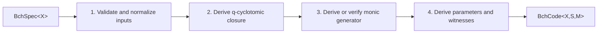

# BCH construction, code traits, and compatibility boundary (issue `7a3a6738`)

> **Diátaxis Type:** Explanation (design input for epic `ae03bcd0`)

This document fixes the `bchspec-model` and `block-code-traits` contracts from
the [epic plan](plan.md). It consumes the approved
[`field-extension-api`](extension-design.md) without introducing another field,
extension, identity, or conversion abstraction. The exhaustive evidence and
consumer paths remain in the [investigation](investigation.md); this document
classifies those paths by family instead of copying their volatile inventory.

## Problem statement

The exported BCH constructors accept dependent values as if they were
independent inputs. `BchCode::new` accepts $n$, $k$, $t$, and a splitting
field, stores the supplied $k$ and $t$, and derives a generator only for binary
primitive narrow-sense codes. `BchCode::from_generator` accepts the same
dependent values beside a supplied generator. Both surfaces can therefore
represent inconsistent mathematics, and their validation uses panics. The
concrete facts and source anchors are recorded in
[investigation claim 1](investigation.md#claim-classification-numbered-verdicts).

The shared coding interfaces also encode binary storage into their meaning.
`BlockEncoder` accepts and returns `BitVec`, `GeneratorMatrixAccess` returns
`BitMatrix`, and parity-check matrices appear through unrelated inherent
methods. That surface cannot express a code over an arbitrary finite field,
cannot select another symbol representation, and gives generic algorithms no
common parity-check contract. BCH additionally places an unconditional matrix
cache behind a mutex even though matrix access itself does not require caching
([investigation claims 3 and 4](investigation.md#claim-classification-numbered-verdicts)).

The design establishes these single sources of truth:

- `BchSpec<X>` contains only independent construction inputs, where `X` is the
  approved `FieldExtension` witness relating the base field $B$ and splitting
  field $E$.
- `BchCode::construct` is the only validation and derivation path. Convenience
  constructors only form a `BchSpec` and call it.
- Static traits associate a symbol field, symbol-sequence representation, and
  matrix representation with each code. `BitVec` and `BitMatrix` remain the
  packed representation of codes over `Fp<2>`.
- Runtime exploration uses explicit erased handles layered over the static
  traits. Type erasure never enters a static encoding or matrix hot path.
- One named compatibility boundary contains the bit-only traits and inherent
  parity access needed by families outside the BCH cutover. It has a version,
  an owner, and a mechanical removal condition as required by
  `@/inv/canonical-cutover`.

## BchSpec model

### Algebraic vocabulary

Let $B = \mathrm{GF}(q)$ be the code-symbol field, let $E$ be a splitting
field, and let `X: FieldExtension<Base = B, Ext = E>` be the witness. This is
the exact `FieldExtension` from [extension-design.md](extension-design.md):
construction uses `base_zero`, `base_id`, `ext_id`, `embed`, `try_restrict`,
`relative_frobenius`, `element_of_exact_order`, `canonical_generator`,
`minimal_polynomial`, and `cyclotomic_closure`. It does not define a BCH-local
field descriptor or an alternative notion of field identity.

For length $n$, a selected element $\beta \in E$ has exact multiplicative
order $n$. A root exponent $i$ names $\beta^i$, with exponents in
$\{0,\ldots,n-1\}$. An input seed set $S$ expands to its $q$-cyclotomic
closure

$$
Z(S) = \bigcup_{s \in S}\{s q^j \bmod n : j \ge 0\}.
$$

The code is the cyclic ideal generated by the unique monic polynomial
$g(x) \in B[x]$ having the roots indexed by $Z(S)$. Coordinate $i$ maps to
$x^i$ inside the algebra. User-facing systematic ordering is a separate
coordinate map and does not alter this construction convention.

### Exact public types

`BchSpec` has exactly five top-level variants, matching the five
independent-input constructions in the planning brief. The non-primitive and
seed-set variants use a nested selector because “derive the canonical root”
and “use this explicit root” select one semantic role, not two construction
algorithms.

```rust
use gf2_core::field::extension::FieldExtension;
use gf2_core::field::FieldPoly;
use core::num::NonZeroU64;

/// A nonzero caller-supplied cyclic-code length.
#[derive(Clone, Copy, Debug, PartialEq, Eq, PartialOrd, Ord, Hash)]
#[repr(transparent)]
pub struct BchLength(NonZeroU64);

/// A nonzero requested classical BCH bound.
#[derive(Clone, Copy, Debug, PartialEq, Eq, PartialOrd, Ord, Hash)]
#[repr(transparent)]
pub struct DesignedDistance(NonZeroU64);

/// An exponent of the selected order-n root. Its range is checked against
/// the construction's length.
#[derive(Clone, Copy, Debug, PartialEq, Eq, PartialOrd, Ord, Hash)]
#[repr(transparent)]
pub struct RootExponent(u64);

impl TryFrom<u64> for BchLength {
    type Error = BchError;
    fn try_from(value: u64) -> Result<Self, Self::Error>;
}

impl TryFrom<u64> for DesignedDistance {
    type Error = BchError;
    fn try_from(value: u64) -> Result<Self, Self::Error>;
}

impl From<u64> for RootExponent {
    fn from(value: u64) -> Self;
}

impl BchLength { pub const fn get(self) -> u64; }
impl DesignedDistance { pub const fn get(self) -> u64; }
impl RootExponent { pub const fn get(self) -> u64; }

/// How a construction obtains the element whose exact order is `length`.
#[derive(Clone, Debug, PartialEq, Eq)]
pub enum RootSelection<E> {
    /// Derive the reproducible element returned by
    /// `element_of_exact_order(extension, length)`.
    Canonical,
    /// Validate this supplied element as an element of the splitting field
    /// with exact multiplicative order `length`.
    Explicit(E),
}

/// Independent inputs for one BCH construction over `X::Base`.
#[derive(Clone, Debug, PartialEq, Eq)]
pub enum BchSpec<X>
where
    X: FieldExtension,
{
    /// Primitive narrow-sense BCH code. The length is `|E*|`, the root is
    /// `canonical_generator(extension)`, and the first root exponent is the
    /// residue of one modulo the derived length.
    PrimitiveNarrowSense {
        extension: X,
        designed_distance: DesignedDistance,
    },

    /// Primitive BCH code with a caller-selected first consecutive root.
    /// The length and root are derived as in `PrimitiveNarrowSense`.
    PrimitiveFirstRoot {
        extension: X,
        first_root: RootExponent,
        designed_distance: DesignedDistance,
    },

    /// Consecutive roots at a proper non-primitive length.
    NonPrimitiveConsecutive {
        extension: X,
        length: BchLength,
        root: RootSelection<X::Ext>,
        first_root: RootExponent,
        designed_distance: DesignedDistance,
    },

    /// Arbitrary, not-necessarily-closed root exponents.
    RootSeeds {
        extension: X,
        length: BchLength,
        root: RootSelection<X::Ext>,
        seeds: Box<[RootExponent]>,
    },

    /// A monic generator presented with coefficients in the splitting-field
    /// carrier. Construction checks that every coefficient restricts to B.
    GeneratorPolynomial {
        extension: X,
        length: BchLength,
        generator: FieldPoly<X::Ext>,
    },
}
```

The semantic newtypes prevent a length, root exponent, and bound from being
interchanged (`@/inv/semantic-types`). Their underlying `u64` is intentional:
the values participate in modular and multiplicative-order arithmetic whose
approved core helpers use `u64`. `BchLength` and `DesignedDistance` reject zero
at conversion; the constructed in-memory dimensions use `usize`, through one
checked conversion that reports the coding error layer's `UnsupportedSize`.
`RootExponent` cannot validate its contextual upper bound alone, so
construction requires every exponent to be less than $n$ rather than silently
reducing it modulo $n$.

The independent inputs and derived values are fixed as follows.

| Variant | Supplied independent inputs | Derived values |
|---|---|---|
| `PrimitiveNarrowSense` | extension witness and $\delta$ | $n=|E^*|$, canonical generator $\beta$, $b=1\bmod n$, seeds $b,\ldots,b+\delta-2$ |
| `PrimitiveFirstRoot` | extension witness, $b$, and $\delta$ | $n=|E^*|$, canonical generator $\beta$, consecutive seeds |
| `NonPrimitiveConsecutive` | extension witness, proper divisor $n<|E^*|$, root selection, $b$, and $\delta$ | canonical $\beta$ when selected, consecutive seeds |
| `RootSeeds` | extension witness, $n$, root selection, and unclosed seed set $S$ | canonical $\beta$ when selected and $Z(S)$ |
| `GeneratorPolynomial` | extension witness, $n$, and a monic polynomial in the `X::Ext` carrier | canonical order-$n$ $\beta$, restricted polynomial in $B[x]$, and the root set found by evaluating at all $\beta^i$ |

No variant accepts $k$, a correction radius, a closed defining set, a
generator beside roots, a primitive length beside the splitting field, or a
field order beside the extension witness. Those values are dependent and have
one derivation.

`designed_distance` accepts $1 \le \delta \le n+1$. The value $\delta=1$
supplies no consecutive roots and denotes the full-space code. A consecutive
run covering all $n$ root exponents denotes the zero-dimensional code. Seed
sets may likewise be empty or close to the full residue set. Duplicate seeds
are set duplicates and disappear during canonical sorting; out-of-range seeds
are errors. `NonPrimitiveConsecutive` requires $n<|E^*|`; primitive constructions use
the two primitive variants, which keeps their independent-input contract
unambiguous.

`GeneratorPolynomial` accepts coefficients in `X::Ext`, rather than
`X::Base`, so coefficient restriction is an observable validation step even
for runtime carriers whose Rust element type covers several fields. The
validated stored generator is `FieldPoly<X::Base>`. A nonzero scalar multiple
is not normalized silently: the supplied polynomial must already be monic.

### Canonical constructed value

Representation types are static parameters and contain no algebraic state.
The code stores the extension witness, the validated order-$n$ root, the
base-field generator, and all derived parameters once.

```rust
pub struct BchCode<X, S, M>
where
    X: FieldExtension,
    S: SymbolSequence<X::Base>,
    M: SymbolMatrix<X::Base>,
{
    extension: X,
    root: X::Ext,
    length: usize,
    dimension: usize,
    generator: FieldPoly<X::Base>,
    defining_set: Box<[RootExponent]>,
    distance_bound: BchDistanceBound,
    correction_radius: usize,
    representation: core::marker::PhantomData<fn() -> (S, M)>,
}

#[derive(Clone, Debug, PartialEq, Eq)]
pub struct BchDistanceBound {
    /// Start of the canonical longest cyclic consecutive run. `None` only
    /// for the empty defining set.
    first_root: Option<RootExponent>,
    consecutive_root_count: usize,
    minimum_distance_lower_bound: usize,
}

impl<X, S, M> BchCode<X, S, M>
where
    X: FieldExtension,
    S: SymbolSequence<X::Base>,
    M: SymbolMatrix<X::Base>,
{
    pub fn construct(spec: BchSpec<X>) -> Result<Self, BchError>;

    pub fn primitive_narrow_sense(
        extension: X,
        designed_distance: DesignedDistance,
    ) -> Result<Self, BchError>;

    pub fn primitive(
        extension: X,
        first_root: RootExponent,
        designed_distance: DesignedDistance,
    ) -> Result<Self, BchError>;

    pub fn consecutive_roots(
        extension: X,
        length: BchLength,
        root: RootSelection<X::Ext>,
        first_root: RootExponent,
        designed_distance: DesignedDistance,
    ) -> Result<Self, BchError>;

    pub fn from_root_seeds(
        extension: X,
        length: BchLength,
        root: RootSelection<X::Ext>,
        seeds: impl Into<Box<[RootExponent]>>,
    ) -> Result<Self, BchError>;

    pub fn from_generator(
        extension: X,
        length: BchLength,
        generator: FieldPoly<X::Ext>,
    ) -> Result<Self, BchError>;
}
```

Every convenience method above is exactly
`Self::construct(BchSpec::<corresponding variant> { ... })`; it contains no
validation, generator construction, parameter derivation, caching, or fallback
logic.

Automatic field selection (ruling R-32) reuses those methods rather than
adding a parallel constructor family. `gf2_core::field::modulus_select`
declares

```rust
pub trait SelectExtension: FieldExtension + Sized {
    fn select(base: Self::Base, degree: usize) -> Result<Self, ModulusSelectionError>;
}
```

implemented for `QuotientField<B>` and `BinaryPrimeExt<V>` through the
deterministic registry-then-verified-search policy of that module, and
`BchError::ModulusSelection(ModulusSelectionError)` carries its failure. The
four variants whose inputs lie in the base field have `_auto` counterparts
bounded by `X: SelectExtension` that take the base witness and relative degree
and are exactly `Self::<explicit method>(X::select(base, degree)?, ...)` with
`RootSelection::Canonical` where a root selection is needed:
`primitive_narrow_sense_auto`, `primitive_auto`, `consecutive_roots_auto`, and
`from_root_seeds_auto`. `from_generator` has no automatic form because its
generator coefficients live in the splitting-field carrier; callers compose
`X::select` with it.

The bound records the longest cyclic consecutive run in the closed defining
set. Ties select the least starting exponent, which makes the witness
reproducible. If the run has length $r$, the classical BCH bound is
$d_{\min} \ge r+1$ and the implied radius is $\lfloor r/2\rfloor$. The empty
set records `first_root = None`, $r=0$, lower bound $1$, and radius $0$. The
full set records start $0$, $r=n$, lower bound $n+1$, and radius
$\lfloor n/2\rfloor$; the distance statement is vacuous for a code containing
no nonzero word but remains a valid witnessed lower bound. Public prose calls
this value a lower bound, never the actual minimum distance.

### Validation and derivation pipeline

All variants enter one four-stage pipeline. A branch selects data, but no
variant owns a second constructor.



#### 1. Validate and normalize inputs

The stage performs every check that can fail before algebraic derivation:

1. Read $B$, $E$, $q$, and the relative-extension certificate from `X`. The
   extension certificate is reused; BCH does not re-prove the field relation.
2. Derive primitive $n=|E^*|$ or validate supplied $n>0$. Report an unsupported
   size when $n$ does not fit the core order helpers or an in-memory `usize`.
3. Validate $\gcd(n,q)=1$ and $n\mid |E^*|$. `NonPrimitiveConsecutive` additionally
   validates $n<|E^*|$.
4. Obtain $\beta$. Primitive variants use `canonical_generator(&extension)`;
   `RootSelection::Canonical` uses
   `element_of_exact_order(&extension, n)`; `RootSelection::Explicit` checks
   `field_id() == extension.ext_id()` and proves exact order $n$. The generator
   variant derives the canonical order-$n$ element.
5. Validate every caller-supplied exponent against $0\le i<n$, validate
   $1\le\delta\le n+1$, and expand a consecutive request to its unclosed seed
   sequence using overflow-free modular addition.
6. For an explicit polynomial, validate a common `ext_id` across all
   coefficients, nonzero and monic form, coefficient-wise restriction through
   `X::try_restrict`, and exact divisibility by $x^n-1$ after restriction.

Every failure is a `BchError` that composes the core `FieldError` and the
coding-general `CodeError`. No invalid-input branch panics; a panic denotes an
internal invariant broken after this stage.

#### 2. Derive q-cyclotomic closure

Root-based variants call the approved
`cyclotomic_closure(&extension, n, seeds)` and store its sorted defining set.
The explicit-generator variant evaluates the restricted polynomial at
$\beta^i$ for every $i\in\{0,\ldots,n-1\}$, collects exactly the zero
evaluations, and verifies that the resulting set equals its own computed
$q$-cyclotomic closure. Failure of that equality is an internal-invariant
error after coefficient restriction, because a polynomial over $B$ has a
Frobenius-stable root set.

#### 3. Derive or verify the generator

For root-based variants, choose one representative from each coset and compute
its monic `minimal_polynomial(&extension, &beta.pow(representative))` in
`FieldPoly<X::Base>`. Combine the factors with the public `FieldPoly::lcm`.
The empty product is $1$; the full defining set yields $x^n-1$. The result is
checked once for exact divisibility into $x^n-1$.

For `GeneratorPolynomial`, the restricted monic polynomial is the candidate.
Construction independently rebuilds the polynomial from the derived coset
factors and requires equality with the candidate. This single check pins root
correctness, coefficient restriction, and absence of repeated or missing
factors. No BCH-private polynomial GCD, LCM, or minimal-polynomial helper
exists.

#### 4. Derive parameters and witnesses

Let $r=\deg g$. Construction derives $k=n-r$, including $k=n$ for $g=1$ and
$k=0$ for $g=x^n-1$. It then finds the canonical longest cyclic consecutive
run, constructs `BchDistanceBound`, derives the correction radius, and stores
the sorted defining set and exact-order root. The representation marker adds no
runtime data. Accessors expose $n$, $k$, $g$, the defining set, the bound, the
radius, the base/splitting identities, and the root by reference or copy as
appropriate; no accessor accepts a replacement value.

## Static and erased type split

### Static code types

`BchCode<X, S, M>` and all derived codes use static dispatch. `X` fixes the
base/splitting-field relation, `S` fixes symbol-sequence storage, and `M` fixes
matrix storage. The common aliases are:

```rust
pub type DenseBchCode<X> = BchCode<
    X,
    gf2_core::field::FieldVec<<X as FieldExtension>::Base>,
    gf2_core::field::matrix::FieldMatrix<<X as FieldExtension>::Base>,
>;

pub type BinaryBchCode<V = u64> = BchCode<
    gf2_core::field::extension::BinaryPrimeExt<V>,
    gf2_core::BitVec,
    gf2_core::BitMatrix,
>;
```

`DenseBchCode<X>` is the field-generic reference representation.
`BinaryBchCode` reads and writes packed words directly and never converts
through `FieldVec<Fp<2>>` or `FieldMatrix<Fp<2>>`. Monomorphization selects the
representation and encoder kernels without a virtual call. BCH uses `M` for
both its generator and parity-check associated types; the shared traits permit
other code families to choose distinct matrix representations. Canonical-matrix
access binds `M` to `MatrixFill`, the materialization contract the
representation-contracts section fixes, whose provided bodies make an empty
implementation a complete opt-in for any `SymbolMatrix`.

Shortening, puncturing, and one-symbol extension are code wrappers, not
`BchSpec` variants or flags:

```rust
pub struct Shortened<C> { mother: C, map: CoordinateMap, /* derivation data */ }
pub struct Punctured<C> { mother: C, map: CoordinateMap, /* rank data */ }
pub struct Extended<C> { mother: C, map: CoordinateMap }

pub enum ShortenedDerivation { SystematicRestriction, RankDerived }
```

Each wrapper implements the canonical traits with the mother code's `Symbol`
and `Symbols`, plus its generator/parity matrix representation where that
capability survives the transformation. Its coordinate map composes back to
the mother, and its dimension comes from rank where required. These wrappers
contain no BCH-specific logic and accept any compatible linear code, satisfying
`@/inv/library-first-generality`.

`Shortened<C>` carries two derivations of the same code, reported by
`Shortened::derivation`. `SystematicRestriction` applies when the mother
reports both `is_systematic` and `has_canonical_message_order` — message
symbol $i$ is coordinate $i$ — and every removed coordinate is below $k$.
Coordinate $s$ of a mother codeword is then message symbol $s$, so the
shortened code is the mother's restricted to the messages that vanish on the
removed positions: dimension $k - |S|$, length $n - |S|$, information set
$0..k - |S|$, and a construction cost of $O(n)$ beyond the mother's own, with
no generator materialized, no nullspace solved, and nothing reduced to RREF.
Encoding writes the message at the kept message positions of a zero mother
message, delegates to the mother's encoder, and deletes the removed
coordinates, so it costs one mother encode and $O(n)$ symbol moves rather
than the $O(kn)$ of a dense product. Matrix access materializes one
mother-sized buffer and copies the kept rows and columns out of it. Without
that condition the wrapper takes `RankDerived`: it materializes the mother
generator, solves the nullspace of the removed-coordinate constraints, and
reduces the result to RREF, whose rank is the derived dimension and whose
pivots are the information set. Both derivations agree on every observable,
and the DVB-T2 rows are constructible only through the first: their $16215
\times 16383$ and $65343 \times 65535$ mothers put a dense generator out of
reach.

`has_canonical_message_order` is the layout half of the systematic report on
`GeneratorMatrixAccess`: `is_systematic` answers for whatever message
coordinate order a code records, and this answers whether that order is the
canonical $0..k$. Its default reports the canonical order, so only a code
recording another one — `LinearBlockCode::hamming`, whose message
coordinates are the columns of $H$ that are not powers of two — implements
it. A shortening wrapper needs both before it may read a coordinate below $k$
as a message coordinate.

### Runtime-erased handles

Erasure is a leaf adapter over a fully constructed static code. It does not
erase `BchSpec`, perform construction, select a field, or supply a dynamic
alternative to `FieldExtension`. Four capability handles preserve the four
static trait boundaries:

```rust
#[derive(Clone, Copy, Debug, PartialEq, Eq, Hash)]
pub struct RepresentationId(core::any::TypeId);

pub struct ErasedSymbols {
    field_id: gf2_core::field::extension::FieldId,
    representation: RepresentationId,
    value: std::sync::Arc<dyn core::any::Any + Send + Sync>,
}

pub struct ErasedMatrix {
    field_id: gf2_core::field::extension::FieldId,
    representation: RepresentationId,
    value: std::sync::Arc<dyn core::any::Any + Send + Sync>,
}

#[derive(Clone)]
pub struct ErasedBlockCode { /* Arc<object-safe metadata vtable> */ }

#[derive(Clone)]
pub struct ErasedBlockEncoder { /* metadata plus encode vtable */ }

#[derive(Clone)]
pub struct ErasedGeneratorMatrixAccess { /* metadata plus generator vtable */ }

#[derive(Clone)]
pub struct ErasedParityCheckMatrixAccess { /* metadata plus parity vtable */ }
```

The exact public operations are:

```rust
impl ErasedBlockCode {
    pub fn new<C>(code: C) -> Self
    where
        C: block::BlockCode + Send + Sync + 'static,
        C::Symbol: Send + Sync + 'static,
        C::Symbols: Send + Sync + 'static;

    pub fn field_id(&self) -> &FieldId;
    pub fn symbol_representation(&self) -> RepresentationId;
    pub fn k(&self) -> usize;
    pub fn n(&self) -> usize;
    pub fn downcast_ref<C: 'static>(&self) -> Option<&C>;
}

impl ErasedBlockEncoder {
    pub fn new<C>(encoder: C) -> Self
    where
        C: block::BlockEncoder + Send + Sync + 'static,
        C::Symbol: Send + Sync + 'static,
        C::Symbols: Send + Sync + 'static;

    pub fn code(&self) -> &ErasedBlockCode;
    pub fn encode(&self, message: &ErasedSymbols)
        -> Result<ErasedSymbols, CodeError>;
}

impl ErasedGeneratorMatrixAccess {
    pub fn new<C>(code: C) -> Self
    where
        C: block::GeneratorMatrixAccess + Send + Sync + 'static,
        C::Symbol: Send + Sync + 'static,
        C::Symbols: Send + Sync + 'static,
        C::GeneratorMatrix: Send + Sync + 'static;

    pub fn code(&self) -> &ErasedBlockCode;
    pub fn matrix_representation(&self) -> RepresentationId;
    pub fn generator_matrix(&self) -> Result<ErasedMatrix, CodeError>;
}

impl ErasedParityCheckMatrixAccess {
    pub fn new<C>(code: C) -> Self
    where
        C: block::ParityCheckMatrixAccess + Send + Sync + 'static,
        C::Symbol: Send + Sync + 'static,
        C::Symbols: Send + Sync + 'static,
        C::ParityCheckMatrix: Send + Sync + 'static;

    pub fn code(&self) -> &ErasedBlockCode;
    pub fn matrix_representation(&self) -> RepresentationId;
    pub fn parity_check_matrix(&self) -> Result<ErasedMatrix, CodeError>;
}
```

`ErasedSymbols` and `ErasedMatrix` have typed constructors from a static code
and checked `downcast_ref`/`downcast` operations. A vtable call validates both
`FieldId` and `RepresentationId` before downcasting. Mismatches return
`CodeError::FieldMismatch` or `CodeError::RepresentationMismatch`; the
`RepresentationId` newtype keeps the runtime sentinel semantic rather than
passing raw names (`@/inv/semantic-types`). It is process-local and never
serves as a serialization identity. Matrix serialization continues to use
`FieldId` plus `ElementRepr` from the extension design.

Static code is the default for libraries, simulations, benchmarks, and
kernels. Erased handles are opt-in for REPLs, configuration-driven experiments,
heterogeneous collections, and bindings. No static trait accepts an erased
value, so erasure overhead cannot leak into a monomorphized path.

## Canonical trait surface

The canonical traits live under `gf2_coding::traits::block`. This module path
avoids a name collision with the version-1 compatibility re-exports while the
boundary exists. The definitions remain in place when the boundary disappears;
only their root re-exports change.

### Representation contracts

```rust
pub trait SymbolSequence<F>: Clone + core::fmt::Debug + Eq + 'static
where
    F: FieldIdentity,
{
    fn zeroed(len: usize, zero: &F) -> Self;
    fn len(&self) -> usize;
    fn is_empty(&self) -> bool { self.len() == 0 }
    fn get(&self, index: usize) -> Option<F>;
    fn set(&mut self, index: usize, value: F) -> Result<(), CodeError>;
}

pub trait SymbolMatrix<F>: Clone + core::fmt::Debug + Eq + 'static
where
    F: FieldIdentity,
{
    fn zeroed(rows: usize, cols: usize, zero: &F) -> Self;
    fn rows(&self) -> usize;
    fn cols(&self) -> usize;
    fn get(&self, row: usize, col: usize) -> Option<F>;
    fn set(&mut self, row: usize, col: usize, value: F)
        -> Result<(), CodeError>;
}
```

These traits describe storage behavior only. They do not duplicate field
arithmetic, `FieldVec`, `FieldMatrix`, `BitVec`, or `BitMatrix`. The canonical
implementations are:

- `SymbolSequence<F> for FieldVec<F>` and
  `SymbolMatrix<F> for FieldMatrix<F>` for every `F: FieldIdentity`;
- `SymbolSequence<Fp<2>> for BitVec` and
  `SymbolMatrix<Fp<2>> for BitMatrix`, mapping `false` to zero and `true` to
  one without allocating an unpacked intermediate.

The packed implementations preserve canonical little-endian bit indexing:
symbol $i$ uses word $i\mathbin{\gg}6$ and mask
$1\mathrm{u64}\ll(i\mathbin{\&}63)$, and tail padding remains zero
(`@/inv/canonical-bit-indexing`). Shape and index failures use `CodeError`.

`SymbolMatrix` describes storage; `MatrixFill` describes canonical-matrix
materialization over that storage:

```rust
pub trait MatrixFill<F>: SymbolMatrix<F>
where
    F: FieldIdentity,
{
    /// Writes G = [I_k | P]; `dimension` is k.
    fn fill_generator(
        &mut self,
        generator: &FieldPoly<F>,
        dimension: usize,
        zero: &F,
    ) { /* provided */ }

    /// Writes H = [-P^T | I_{n-k}].
    fn fill_parity_check(
        &mut self,
        generator: &FieldPoly<F>,
        dimension: usize,
        zero: &F,
    ) { /* provided */ }
}
```

Both bodies are provided: they run the parity recurrence one coordinate at a
time through `SymbolMatrix::get` and `SymbolMatrix::set`, so every
representation opts in with an empty implementation. The two canonical
implementations override them as a performance choice: `FieldMatrix<F>` with a
row-slice path, and `BitMatrix` with the packed word-level path K-09's
associated-type specialization names, which single-coordinate accessors cannot
express. The caller checks the output shape, so an implementation writes only
in-range coordinates, overwrites every coordinate, and cannot fail.

### Block-code and encoder contracts

```rust
pub trait BlockCode {
    type Symbol: FieldIdentity;
    type Symbols: SymbolSequence<Self::Symbol>;

    /// A runtime witness for the code-symbol field B.
    fn symbol_zero(&self) -> Self::Symbol;
    fn k(&self) -> usize;
    fn n(&self) -> usize;

    fn redundancy(&self) -> usize { self.n() - self.k() }
    fn symbol_field_id(&self) -> FieldId { self.symbol_zero().field_id() }
}

pub trait BlockEncoder: BlockCode {
    /// Allocation-free encoding into an already sized `n()`-symbol buffer.
    fn encode_into(
        &self,
        message: &Self::Symbols,
        codeword: &mut Self::Symbols,
    ) -> Result<(), CodeError>;

    /// Allocating convenience that delegates to `encode_into`.
    fn encode(&self, message: &Self::Symbols)
        -> Result<Self::Symbols, CodeError>
    {
        let mut codeword = Self::Symbols::zeroed(self.n(), &self.symbol_zero());
        self.encode_into(message, &mut codeword)?;
        Ok(codeword)
    }
}
```

The `BlockCode` conformance laws require $k\le n$, require
`symbol_zero().field_id()` to be the field identity of every symbol accepted or
produced through the associated representation, and require `Symbols::zeroed`
to produce exactly the requested length in that field. Violating one of these
laws is an implementor defect and therefore an internal invariant, not an input
error branch.

`encode_into` checks `message.len() == k()`, `codeword.len() == n()`, field
identity where the representation carries runtime field elements, and any
layout-specific precondition before writing output. A mismatch returns
`CodeError`; it does not partially report success. The allocating method is
the only default allocation. Batch/workspace APIs in `bch/encode.rs` reuse the
same `encode_into` implementation, keeping the shared trait small for the
streaming/batch unification story.

### Generator and parity-check contracts

```rust
pub trait GeneratorMatrixAccess: BlockCode {
    type GeneratorMatrix: SymbolMatrix<Self::Symbol>;

    /// Writes the canonical `k() x n()` generator matrix into `out`.
    fn generator_matrix_into(&self, out: &mut Self::GeneratorMatrix)
        -> Result<(), CodeError>;

    /// Allocating, uncached materialization convenience.
    fn generator_matrix(&self) -> Result<Self::GeneratorMatrix, CodeError> {
        let mut out = Self::GeneratorMatrix::zeroed(
            self.k(),
            self.n(),
            &self.symbol_zero(),
        );
        self.generator_matrix_into(&mut out)?;
        Ok(out)
    }

    /// Tests whether columns `0..k()` form the identity in the exposed user
    /// layout. Implementations may override with an equivalent cheap fact.
    fn is_systematic(&self) -> Result<bool, CodeError>;
}

pub trait ParityCheckMatrixAccess: BlockCode {
    type ParityCheckMatrix: SymbolMatrix<Self::Symbol>;

    /// Row count of the exposed full-rank parity-check representation.
    fn parity_check_rows(&self) -> usize { self.redundancy() }

    /// Writes `parity_check_rows() x n()` into `out`.
    fn parity_check_matrix_into(&self, out: &mut Self::ParityCheckMatrix)
        -> Result<(), CodeError>;

    /// Allocating, uncached materialization convenience.
    fn parity_check_matrix(&self) -> Result<Self::ParityCheckMatrix, CodeError> {
        let mut out = Self::ParityCheckMatrix::zeroed(
            self.parity_check_rows(),
            self.n(),
            &self.symbol_zero(),
        );
        self.parity_check_matrix_into(&mut out)?;
        Ok(out)
    }
}
```

The generator matrix uses the user layout, so row $i$ is the encoding of
message basis vector $i$. The parity-check matrix satisfies
$G H^{\mathsf T}=0$ and is full row rank; consequently canonical BCH and dense
linear-code implementations return `parity_check_rows() == n() - k()`.
Families exposing a redundant sparse check matrix remain on the compatibility
boundary until their migration decides whether the sparse operational matrix
or a full-rank materialization is the canonical trait value.

Neither matrix trait implies storage or caching. `*_matrix_into` is the
allocation-free contract, `*_matrix` allocates on each call, and the explicit
opt-in cache is `CachedMatrices<C>` in `bch/matrix.rs`. The wrapper implements
only matrix-access traits already implemented by `C` and caches each successful
materialization independently; failures are not cached. A type that never
exposes a parity-check capability does not implement
`ParityCheckMatrixAccess`. A type such as `LinearBlockCode`, whose availability
depends on the constructed value, implements it and returns a typed
`CodeError::CapabilityUnavailable` for a value without $H$; it does not return
an ambiguous `Option`.

The packed specialization is expressed by the stable marker trait:

```rust
pub trait BinaryBlockCode:
    BlockCode<Symbol = Fp<2>, Symbols = BitVec>
{}

impl<T> BinaryBlockCode for T
where
    T: BlockCode<Symbol = Fp<2>, Symbols = BitVec>,
{}

pub trait BinaryGeneratorMatrixAccess:
    BinaryBlockCode + GeneratorMatrixAccess<GeneratorMatrix = BitMatrix>
{}

impl<T> BinaryGeneratorMatrixAccess for T
where
    T: BinaryBlockCode + GeneratorMatrixAccess<GeneratorMatrix = BitMatrix>,
{}

pub trait BinaryParityCheckMatrixAccess:
    BinaryBlockCode + ParityCheckMatrixAccess<ParityCheckMatrix = BitMatrix>
{}

impl<T> BinaryParityCheckMatrixAccess for T
where
    T: BinaryBlockCode + ParityCheckMatrixAccess<ParityCheckMatrix = BitMatrix>,
{}
```

Thus binary algorithms can state `C: BinaryBlockCode` and receive the exact
packed symbol behavior of the bit-specific surface. Matrix consumers add
`BinaryGeneratorMatrixAccess` or `BinaryParityCheckMatrixAccess` and receive
`BitMatrix` directly. General algorithms state the corresponding canonical
trait and use its associated representation. Generator and parity matrices may
choose different representations, which admits a dense generator beside a
sparse parity-check implementation without changing the code-symbol storage.
There is one canonical trait set, with specialization by associated types
rather than a parallel binary algorithm contract
(`@/inv/convention-convergence`).

## Compatibility boundary

### Name and version

The sole compatibility boundary is **`binary-code-v1`**, version **1**, at
`gf2_coding::traits::compat::binary_v1`. It contains the two bit-only traits
whose signatures are already consumed across the tree:

```rust
pub mod compat {
    pub mod binary_v1 {
        pub const BINARY_CODE_COMPAT_VERSION: u16 = 1;

        pub trait BlockEncoder {
            fn k(&self) -> usize;
            fn n(&self) -> usize;
            fn encode(&self, message: &BitVec) -> BitVec;
        }

        pub trait GeneratorMatrixAccess {
            fn k(&self) -> usize;
            fn n(&self) -> usize;
            fn generator_matrix(&self) -> BitMatrix;
            fn is_systematic(&self) -> bool;
        }
    }
}

// Source-compatible shims while binary-code-v1 exists.
pub use compat::binary_v1::{BlockEncoder, GeneratorMatrixAccess};
```

The root re-exports keep paths such as `crate::traits::BlockEncoder` and
object-safe uses such as `&dyn BlockEncoder` compiling unchanged. Migrated
packed implementations implement `traits::block` and receive a blanket
`binary_v1` adapter that preserves the version-1 allocating return values and
panic-on-invalid-length behavior. An unmigrated family keeps its direct v1
implementation. A migration removes that direct implementation before the
blanket adapter applies, preventing overlap.

There is no version-1 parity trait because none exists in the consumed surface.
The inherent `parity_check` methods of boundary families are explicitly part
of `binary-code-v1` policy: they remain usable by those families, but canonical
generic consumers may depend only on
`traits::block::ParityCheckMatrixAccess`. No additional code family or public
API may enter `binary-code-v1`.

The v1 adapter is the only place allowed to convert a canonical `CodeError`
into version-1 panic behavior. It contains no encoder, matrix-construction, or
field logic of its own. A semantic change belongs in the canonical trait
implementation and is observed through the adapter.

### Removal condition

JIT story `3931ac6f` (Unify streaming and batch encode/decode trait interfaces)
owns removal after epic `ae03bcd0`. `binary-code-v1` is removed, rather than
versioned to v2, exactly when all of these conditions hold:

1. Every family marked **boundary** in the consumer table implements and uses
   `traits::block`, including canonical parity-check access where applicable.
2. Repository searches find no use of `traits::compat::binary_v1`, the root
   `traits::BlockEncoder`/`traits::GeneratorMatrixAccess` shims, direct v1 impl,
   or boundary-admitted inherent parity access outside the compatibility module
   and its removal tests.
3. The shared binary behavioral suites pass through the canonical packed
   specialization for every migrated family, including object-erased workflows
   that replace `&dyn BlockEncoder`.
4. Story `3931ac6f` records those checks in its completion evidence and deletes
   the compatibility module and root shims in the same cutover.

The condition is tracked, finite, and mechanically auditable. It does not use
a date or a release guess, and the module does not acquire unrelated helpers.

## Consumer-family mapping

The tables cover every family grouping in the investigation's
[`BchCode`, trait, matrix-I/O, and GF(2^m) primitive inventories](investigation.md#consumer-inventory).
Individual paths remain cited there as the single source of truth
(`@/inv/single-source-prose`). “Canonical” means the family migrates inside
epic `ae03bcd0`; “boundary” means its bit-only coding interface stays inside
`binary-code-v1` until the removal condition.

### BCH and direct consumers

| Consumer family | Disposition | Canonical target and scope |
|---|---|---|
| BCH construction, encoding, decoding, and module exports | Canonical | `BchSpec<X>`, `BchCode<X,S,M>`, `traits::block`, and the binary alias replace the redundant constructor and bit-bound code surface. |
| Extended BCH code type | Canonical | `Extended<BinaryBchCode<_>>` replaces `ExtendedBchCode`; the type-specific wrapper is absent at final BCH cutover. |
| DVB-T2 BCH definitions and BCH/LDPC concatenation | Canonical | Standards constructors form the corresponding spec and declare their user-coordinate layout; their outer encoder uses packed canonical traits. |
| GRAND, fading, and product eBCH library paths | Canonical for BCH/eBCH use | These paths consume `Extended<C>` plus canonical parity access. Their unrelated binary family abstractions remain boundary entries below. |
| Component-code BCH paths in BCJR, GLDPC, OSD, product, and simulation support | Canonical for BCH use | BCH instances and generic matrix consumers use `traits::block`; non-BCH component implementations remain on their family row below. |
| gf2-coding BCH binaries and examples | Canonical | Construction and encoding use the static packed alias; exploratory configuration may opt into erased handles. |
| gf2-coding BCH/eBCH/DVB-T2 integration and reference tests | Canonical | Tests pin canonical construction, packed behavior, layouts, and the generic extension wrapper. |
| BCH Criterion benchmarks | Canonical | Benchmarks use the static packed code and canonical matrix access; no erased handle appears in a measured path. |
| gf2-sim BCH/eBCH campaigns, protocol tests, and GPU syndrome workflows | Canonical | Simulation remains a thin consumer of the packed static code; configuration-only heterogeneity may erase above the measured path. |
| gf2-kernels-hip BCH field and CPU/GPU cross-check tests | Canonical | Tests receive canonical BCH parameters and preserve the binary HIP behavioral contract; the kernel crate does not implement coding traits. |
| BCH documentation, campaigns, reference data, presentations, and active development references | Canonical reference sweep | Permanent prose names the canonical surface; immutable evidence keeps its recorded provenance rather than being reclassified as canonical output. Historical JIT events and archives remain historical records. |

### Shared trait and parity consumers

| Consumer family | Disposition | Boundary or canonical treatment |
|---|---|---|
| `LinearBlockCode` | Canonical immediately | Implements all four `traits::block` capabilities with `Fp<2>`, `BitVec`, and `BitMatrix`; the v1 blanket adapter preserves version-1 calls. Its optional stored $H$ yields a typed unavailable error when no canonical parity matrix can be produced. |
| BCH and generic extension wrappers | Canonical immediately | Implement all four capabilities with the selected static representations. |
| CRC codes | Boundary | Direct v1 encoder/generator impls and inherent parity access remain in `binary-code-v1`. |
| DRM codes | Boundary | Direct v1 encoder/generator impls, `ProductComponent`, and inherent parity access remain in `binary-code-v1`. |
| LDPC mother codes and encoders, including IRA and Richardson–Urbanke paths | Boundary | Bit-only encode/generator uses remain v1. Sparse or redundant parity semantics receive an explicit canonical decision during their later migration. |
| DVB-T2 LDPC code, cache, and concatenation utilities | Boundary for LDPC; canonical for BCH outer use | The BCH outer path migrates; the LDPC coding traits and `.gf2` cache remain v1/specialized. |
| 5G NR rate-matched LDPC | Boundary | `Nr5gRateMatchedCode` retains the v1 encoder surface. |
| QC-GLDPC code | Boundary for its own encoder/matrix surface | Direct v1 impls remain; any BCH/eBCH component it consumes migrates canonically. |
| DVB-T2 BICM FEC wrapper | Boundary for its object-safe encoder role | `&dyn binary_v1::BlockEncoder` remains valid; its internal BCH outer encoder is canonical. An erased canonical encoder replaces the trait object at boundary removal. |
| Product-code `ProductComponent` abstraction | Boundary for non-BCH components | Existing CRC/DRM components retain inherent packed parity; the eBCH component becomes `Extended<C>` with canonical parity access. |
| GRAND generic binary-code integration | Boundary for non-BCH codes | BCH/eBCH calls migrate; general CRC/DRM/linear integrations retain v1 until their family migration. |
| BCJR parity-matrix consumers | Boundary for non-BCH matrices | BCH/eBCH paths consume canonical parity access; other packed inherent matrices retain v1 policy. |
| OSD generator-matrix adapter | Canonical for BCH and `LinearBlockCode`; boundary for other providers | Canonical generic bounds cover the immediate paths; a small v1 adapter covers unmigrated binary providers. |
| Simulation runners, checkpoint helpers, and local test fixtures implementing `BlockEncoder` | Boundary | Their object-safe and mock bit-only contracts remain v1; BCH values passed through them use the v1 blanket adapter. |
| Coding binaries, examples, benches, and tests concerned only with CRC/DRM/LDPC/product families | Boundary | Their source paths and behavior stay unchanged until the owning family migrates. |
| gf2-sim NR-5G stage/bench and LDPC GPU consumers | Boundary | They consume LDPC-family v1 behavior and do not acquire BCH-specific adapters. |
| SIMD kernel crate | Canonical kernel substrate | It remains an isolated kernel provider selected beneath canonical static encoding and implements no coding trait. |

### Adjacent inventories with no code-trait cutover

| Inventory family | Disposition | Reason |
|---|---|---|
| `BitMatrix` `.gf2` format and LDPC encoding-cache round trip | Boundary with the LDPC family | D-10 leaves the existing binary format intact. New `FieldMatrix` persistence is a separate format; BCH matrices do not use the LDPC cache. |
| Adjacent bit-vector/sparse I/O modules, I/O tests, docs, and analysis script | Boundary with the LDPC family | They support the LDPC binary format and require no BCH API dependency. |
| BCH calls to GF(2^m) primitive-element and minimal-polynomial operations | Canonical | BCH uses `canonical_generator`, `element_of_exact_order`, and extension-level `minimal_polynomial`; it carries no private duplicate. |
| gf2-core GF(2^m) generation, canonical tests, benches, example, and primitive-polynomial docs | Canonical field foundation; no call-site cutover | These are field-library consumers, not coding-trait consumers. Shared agreement tests pin the approved extension helpers against them on their common domain. |
| HIP field test using `primitive_element` | Canonical field fixture; no call-site cutover | The test exercises field-table upload, not BCH construction or a coding trait. |
| Proof-generated and historical references named by the investigation | Canonical reference policy | Generated proof data regenerates only when its owning proof task changes; historical artifacts retain their recorded API context. |

This classification is exhaustive by investigation heading and family.
Additional matches found during implementation join the matching family row;
they do not create a private compatibility mechanism.

## Module layout preallocation

The module map follows the authoritative manifest footprints in
[breakdown.json](breakdown.json). Files shared by several tasks form one
dependency-ordered chain; tasks in the same wave use disjoint files.

### Canonical traits and error surface

| Path | Owning task or ordered chain | Contents |
|---|---|---|
| `crates/gf2-coding/src/traits.rs` | `generic-traits-core` → `type-erased-handles` → `matrix-materialize` → `@/issue/203ee826` | `traits::block`, representation adapters, `BinaryBlockCode`, then erased handles, then matrix-access defaults, then the message-order report the shortening wrapper reads; `traits::compat::binary_v1` and root shims live here. |
| `crates/gf2-coding/src/linear.rs` | `generic-traits-core` → `@/issue/203ee826` | Immediate `LinearBlockCode` canonical implementations and v1-adapter coverage, including the recorded message-coordinate order its Hamming constructor uses. |
| `crates/gf2-coding/src/error.rs` | `coding-error-surface` | Coding-general `CodeError`, including shape, index, field, representation, unsupported-size, and capability errors. |
| `crates/gf2-coding/src/bch/error.rs` | `coding-error-surface` | `BchError` composing `FieldError` and `CodeError` with construction-specific validation failures. |
| `crates/gf2-coding/src/lib.rs` | `coding-error-surface`, then `cutover-components` | Declares and re-exports the coding-general error module; the later consumer cutover updates code exports after the error surface is stable. |

The three writers of `traits.rs` are dependency-ordered by the epic DAG, so
no parallel wave writes the file concurrently. `coding-error-surface` lands
before `generic-traits-core`, because the exact trait signatures name
`CodeError`; both tasks otherwise write disjoint implementation files. The
`lib.rs` declaration touch is a necessary addition to the manifest footprint
and precedes the dependency-distant `cutover-components` touch. The lead
records the ordering and footprint addition before dispatch rather than
letting either worker create a local error alias.

### BCH construction, matrices, and encoding

| Path | Owning task or ordered chain | Contents |
|---|---|---|
| `crates/gf2-coding/src/bch/spec.rs` | `bch-construct-core` → `bch-construct-seedset` → `bch-construct-generator` → `bch-construct-nonprimitive` → `bch-convenience-ctors` | `RootSelection`, `BchSpec`, static `BchCode`, bound witness, the single pipeline, then variant support and delegating conveniences. |
| `crates/gf2-coding/src/bch/matrix.rs` | `matrix-materialize` → `genmatrix-perf` → `@/issue/203ee826` | Uncached allocating/caller-buffer generator and parity materialization, explicit `CachedMatrices<C>` wrapper, then optimized kernels behind the same traits. |
| `crates/gf2-coding/src/bch/encode.rs` | `systematic-encode` → `encode-batch-workspace` → `encode-dispatch` | Scalar systematic reference, allocation-free/workspace and ordered batch APIs, then profile-driven family selection. |
| `crates/gf2-coding/src/bch/mod.rs` | `coding-error-surface` → `bch-construct-core` → `systematic-encode` → `cutover-removal` | Declares `bch::error`, then the spec/encoding modules and canonical re-exports, then removes superseded `core`/`extended` exports. The dependencies serialize these small edits. |
| `crates/gf2-kernels-simd/src/bch_encode.rs` | `avx2-batch-kernels` | Safe-dispatchable BCH batch kernels with scalar equivalence; no coding-domain type enters the kernel crate. |

Construction never writes `encode.rs` or `matrix.rs`; encoding and matrix
materialization therefore run in parallel after their shared prerequisites.
The `bch/mod.rs` declaration touch is the second necessary manifest-footprint
addition for `coding-error-surface`; its direct dependent
`bch-construct-core` writes the file only after that task completes.

### Derived-code transformations

| Path | Owning task or ordered chain | Contents |
|---|---|---|
| `crates/gf2-coding/src/transform/coordinate_map.rs` | `coordinate-provenance` | Composable derived-to-mother coordinate maps and compact regular representations. |
| `crates/gf2-coding/src/transform/mod.rs` | `shorten-transform` → `puncture-transform` → `extend-transform` → `@/issue/203ee826` | `Shortened<C>`, shared rank/information-set machinery, `Punctured<C>`, and `Extended<C>` in dependency order, then the `ShortenedDerivation` split that gives `Shortened<C>` its systematic restriction. |

`coordinate_map.rs` is complete before `transform/mod.rs` starts. The three
wrapper implementations share one file only along a serial chain, while BCH
construction and encoding use disjoint modules.

### Consumer migration files

| Migration task | Disjoint file group |
|---|---|
| `decoder-outcomes` → `hip-equivalence` | `crates/gf2-coding/src/bch/core.rs` serially; HIP equivalence also owns `crates/gf2-sim/tests/gpu_bch_syndrome_byte_identity.rs`. |
| `ebch-migration` | `crates/gf2-coding/src/grand/sogrand.rs`, `crates/gf2-coding/src/grand/orbgrand.rs`, `crates/gf2-coding/src/fading.rs`, `crates/gf2-coding/src/product/mod.rs`, `crates/gf2-coding/src/product/chase_pyndiah.rs` |
| `cutover-dvbt2` | `crates/gf2-coding/src/bch/dvb_t2/mod.rs`, `crates/gf2-coding/src/bch/dvb_t2/generators.rs`, `crates/gf2-coding/src/bch/dvb_t2/params.rs`, `crates/gf2-coding/src/ldpc/dvb_t2/concat.rs`, `crates/gf2-coding/src/dvb_t2_bicm_harness.rs` |
| `cutover-components` | `crates/gf2-coding/src/bcjr/mod.rs`, `crates/gf2-coding/src/gldpc/mod.rs`, `crates/gf2-coding/src/osd/generator.rs`, `crates/gf2-coding/src/simulation.rs`, `crates/gf2-coding/src/lib.rs` |
| `cutover-bins-examples` | `crates/gf2-coding/src/bin/sim_runner.rs`, `crates/gf2-coding/src/bin/check_encoding.rs`, `crates/gf2-coding/examples/dvb_t2_bch_demo.rs`, `crates/gf2-coding/examples/block_code_intro.rs` |
| `cutover-test-suite` | `crates/gf2-coding/tests/bch_tests.rs`, `crates/gf2-coding/tests/dvb_t2_bch_verification.rs`, `crates/gf2-coding/tests/ebch_128_64_reference.rs`, `crates/gf2-coding/tests/backend_integration.rs`, `crates/gf2-coding/tests/grand_phase1_smoke.rs`, `crates/gf2-coding/tests/bch_primitive_verification.rs` |
| `cutover-benches` | `crates/gf2-coding/benches/bch_parallel.rs`, `crates/gf2-coding/benches/batch_operations.rs` |
| `cutover-sim` | `crates/gf2-sim/src/bin/ebch_osd_awgn_campaign.rs`, `crates/gf2-sim/src/bin/gpu_bch_syndrome_throughput.rs`, `crates/gf2-sim/tests/ebch_osd_campaign_cli.rs`, `crates/gf2-sim/tests/gpu_byte_identity.rs`, `crates/gf2-sim/tests/osd_campaign_protocol.rs` |
| `cutover-hip-tests` | `crates/gf2-kernels-hip/tests/gpu_cpu_crosscheck.rs`, `crates/gf2-kernels-hip/tests/gpu_bch_syndrome_field.rs` |
| `cutover-removal` | `crates/gf2-coding/src/bch/core.rs`, `crates/gf2-coding/src/bch/extended.rs`, and final `crates/gf2-coding/src/bch/mod.rs` cleanup after every consumer group |
| `legacy-reference-sweep` | `crates/gf2-coding/README.md`, `docs/SYSTEMATIC_ENCODING_CONVENTION.md`, `docs/PARALLELIZATION.md`, `crates/gf2-core/docs/PRIMITIVE_POLYNOMIALS.md` |

The direct migration groups are file-disjoint and may run in parallel after
their graph prerequisites. `cutover-removal` is the join point and owns the
only deletion of superseded BCH types. Documentation paths not in the manifest
are reported to the lead as footprint findings rather than edited ad hoc.

## Key decisions

**K-01 — Five `BchSpec` variants, with a nested root selector.** Separate
top-level variants match the five independent construction families from the
planning brief. A nested `RootSelection` makes canonical versus explicit
order-$n$ roots explicit without duplicating the non-primitive and seed-set
pipeline. Rejected: one bag-of-options struct, which admits meaningless input
combinations, and a variant per root-selection cross product, which duplicates
the same semantic construction.

**K-02 — Primitive length and root are derived.** A primitive code's length is
$|E^*|$ and its root is the approved canonical generator. Accepting either as
input reintroduces redundant state. Non-primitive length remains independent,
and an explicit root is valid only through `RootSelection::Explicit` with an
exact-order check.

**K-03 — Explicit generators enter in the extension carrier.** This permits a
runtime, checked coefficient-restriction boundary and makes “coefficient lies
in $B$” observable. The stored generator is in `FieldPoly<X::Base>`. Rejected:
accepting only `FieldPoly<X::Base>`, which makes the required restriction check
unexpressible for standards data already represented in $E$.

**K-04 — Closure precedes generator derivation.** One deterministic
$q$-cyclotomic closure is the source of coset representatives, generator
factors, root metadata, and the bound witness. Rejected: iterating consecutive
roots and relying on repeated LCM calls to imply closure without exposing the
defining set.

**K-05 — The bound is a witnessed lower bound.** The stored start and run
length explain why the bound holds. Empty and complete defining sets have
explicit conventions, so valid boundary codes need no sentinel code path.
Hartmann–Tzeng, Roos, and actual minimum-distance computation stay outside the
model.

**K-06 — Representation is static and orthogonal to construction.** `BchSpec`
does not mention `BitVec`, `FieldVec`, `BitMatrix`, or `FieldMatrix`.
`BchCode<X,S,M>` selects them at compile time, enabling both field-generic
reference behavior and packed binary performance from the same mathematical
code. Rejected: storing an enum of representations inside each code.

**K-07 — Each capability owns exactly its representation association.**
`BlockCode` owns `Symbol` and `Symbols`; generator and parity access each own a
matrix associated type. Encoding refines `BlockCode` without adding a second
word type. This lets a code expose dense and sparse matrices for different
roles while keeping its symbol field unique. Rejected: generic parameters
repeated on every method, which make bounds noisy and permit a code value to
claim incompatible symbol representations, and `Option<Matrix>`, which
conflates unsupported capability with a failed materialization.

**K-08 — Matrix access is uncached by contract.** Caller-buffer methods are
the primitive operation, allocating methods delegate, and caching is an
explicit wrapper. This removes synchronization from read-only code metadata
and makes allocation visible. Rejected: returning an internal reference, which
forces storage, and unconditional lazy caching, which changes memory and lock
behavior for every implementation.

**K-09 — Packed binary storage is an associated-type specialization.**
`BinaryBlockCode` recognizes exactly `Fp<2>` plus `BitVec`; the two binary
matrix markers refine the canonical access traits with `BitMatrix`. No
unpack/repack step appears. Rejected: a second permanent binary trait hierarchy.

**K-10 — Erasure follows capabilities.** Separate erased handles correspond to
metadata, encoding, generator access, and parity access. Each wraps a static
implementation and validates `FieldId` plus a semantic `RepresentationId`.
Rejected: making the canonical traits object-safe by deleting associated
types, and a dynamic field-element model parallel to `FieldIdentity`.

**K-11 — `binary-code-v1` is the only migration exception.** Its versioned
module, root shims, admitted inherent parity methods, family list, and tracked
removal condition form one boundary. Rejected: per-family adapters scattered
through consumers or a compatibility version without an owner and deletion
test.

**K-12 — Shared files are serial chains; parallel waves own disjoint files.**
The layout follows the manifest rather than creating extra modules after
dispatch. `traits.rs`, `spec.rs`, `encode.rs`, `matrix.rs`, and
`transform/mod.rs` each have one ordered writer chain. Consumer migration
groups share no files until the removal join.

## Success Criteria

- [hard] REQ-01: A design document fixes the `BchSpec` variant set with exact independent inputs, the construct/derivation pipeline stages, and the static/erased type split.
- [hard] REQ-02: The document fixes the field-generic block-code, encoder, generator-matrix, and parity-check trait surface with its `BitVec`/`BitMatrix` specializations, and names the compatibility boundary (name, version, removal condition) for unmigrated families.
- [hard] REQ-03: The document maps each current consumer family from the linked investigation inventory to immediate migration or the boundary, and preallocates the new module layout.

## Risks and open questions

**R-01 — exact-order factorization limit.** Canonical root selection inherits
the approved extension design's need to factor $|E^*|$. The epic corpus is
inside the feasible range and `OrderFactorizationUnavailable` is typed. A
larger exploratory field can fail construction without divergence or an
unbounded search. No API decision remains open.

**R-02 — non-tower cross-presentation embeddings.** The extension design
constructs splitting fields as relative towers. A caller presenting an
isomorphic $E$ whose `FieldId` does not reach $B$ receives the approved
`NotATower`/identity error. Whether a later project adds pinned-root embeddings
remains open outside this epic; `BchSpec` needs no change because it consumes a
`FieldExtension` witness.

**R-03 — redundant sparse parity checks.** LDPC-family matrices often expose
operational sparse checks rather than a canonical full-rank dense matrix. The
family stays in `binary-code-v1`, and story `3931ac6f` decides its canonical
matrix representation during migration. This does not block BCH, dense linear
codes, or the parity-check trait signature fixed here.

**R-04 — erased downcasts are process-local.** `RepresentationId` uses
`TypeId`, so erased values do not cross a process or serialization boundary.
Exploratory persistence uses canonical matrix serialization with `FieldId` and
`ElementRepr`; no erased container is serializable. A language binding may add
its own canonical-coordinate conversion above the erased handle without
changing static traits.

**R-05 — external consumers are not enumerable from the repository.** The
versioned v1 path gives external binary consumers one explicit transition
surface. Removal follows the tracked repository condition and a release-level
API decision by the owner; no untracked alias or constructor remains after
that cutover.
