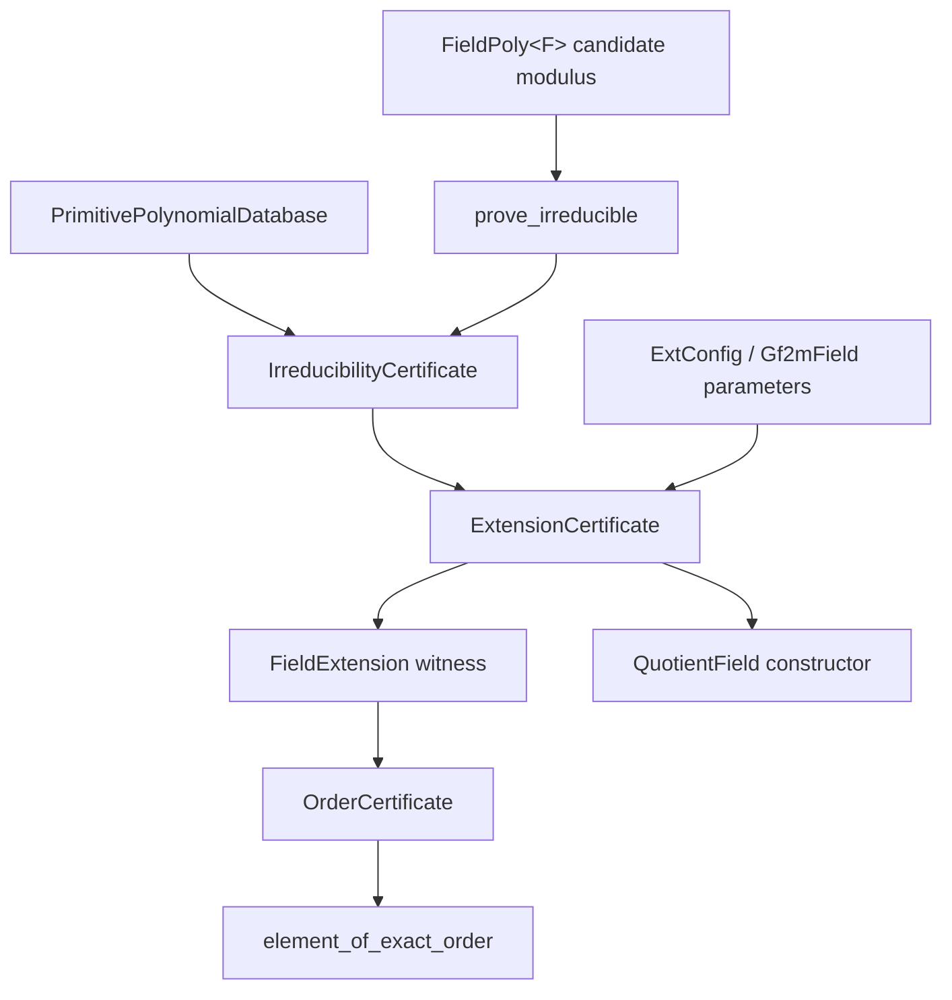
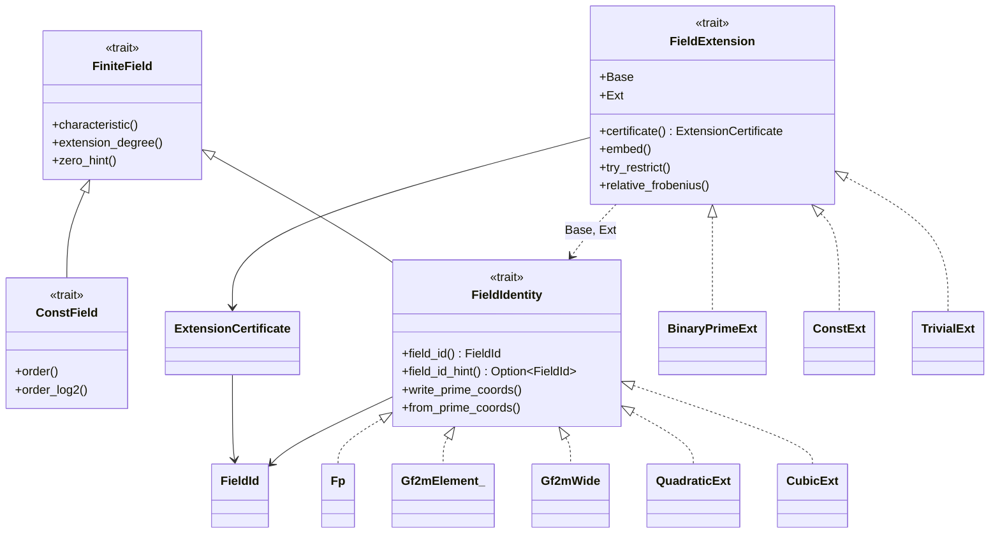

# Relative field-extension abstraction and field identity (issue `ad6778e8`)

> **Diátaxis Type:** Explanation (design input for epic `ae03bcd0`)

This document fixes the canonical relative finite-field extension abstraction
for `gf2-core` and the stable algebraic field identity that serialization
validation and automatic field selection share. It is the producer of the
`field-extension-api` and `field-identity` contracts declared in the
[epic plan](plan.md); `extension-trait`, `exact-order`, `minpoly-subfield`,
`cyclotomic-closure`, `irreducibility-validation`, `quotient-ext-runtime`,
`quotient-ext-const`, `conway-registry`, and `fieldmatrix-serialization`
implement against it.

Facts about the current tree are cited rather than restated; the exhaustive
inventory is in [investigation.md](investigation.md), claims 5–8 and
"Primitive verification".

## Problem statement

`gf2-core` carries three unrelated presentations of "one field sits inside
another", and no relation between them.

- `ExtConfig` fixes a binomial modulus $x^2 - \beta$ or $x^3 - \beta$ through
  an associated non-residue constant and an associated `BaseField`
  (`crates/gf2-core/src/gfpn/ext_config.rs:62,71,78`). The relationship is
  encoded in the *type* `QuadraticExt<C>` / `CubicExt<C>`
  (`crates/gf2-core/src/gfpn/quadratic.rs:229`,
  `crates/gf2-core/src/gfpn/cubic.rs:250`) and is reachable only through the
  inherent `from_base` embeddings
  (`quadratic.rs:373`, `cubic.rs:386`).
- `Gf2mField_<V>` carries $m$ and the defining polynomial in a runtime
  `Arc<FieldParams_<V>>` (`crates/gf2-core/src/gf2m/field.rs:152,169`), and
  its elements carry that same `Arc` (`field.rs:206`). Nothing expresses
  $\mathrm{GF}(2) \subset \mathrm{GF}(2^m)$; there is no membership test,
  no restriction, and no subfield accessor (investigation claim 5).
- `FiniteFieldExt::frobenius` is the *absolute* Frobenius $x \mapsto x^{p^k}$
  on a single field (`crates/gf2-core/src/field/traits.rs:1103`), not a
  relative $\mathrm{Gal}(E/B)$ generator.

Four consequences block the epic:

1. Generator assembly needs the minimal polynomial of an extension element
   over an *arbitrary* base field; the only implementation is specialized to
   $\mathrm{GF}(2)$ and returns coefficients in $\mathrm{GF}(2^m)$
   (`crates/gf2-core/src/gf2m/field.rs:1012`).
2. Non-primitive lengths need an element of exact multiplicative order $n$;
   the only generator source requires log/exp tables and therefore $m \le 16$
   (`field.rs:401,444`).
3. Compile-time and runtime presentations of the same field will coexist
   (`quotient-ext-const` versus `quotient-ext-runtime`), and nothing today
   decides whether two carriers denote the same field.
4. Persisted `FieldMatrix` data is meaningless without a field tag: the
   current `.gf2` header carries a type tag and dimensions but no field
   identity (`crates/gf2-core/src/io/format.rs:85`), and equal field
   *cardinality* does not make coefficient encodings comparable — the epic's
   own conformance protocol says so for corpus rows N3 and N4
   ([plan.md](plan.md), `evidence-protocol`).

The design must therefore supply one relation, one identity, and one
conversion rule, and it must subsume `ExtConfig` and `Gf2mField_` semantics
instead of shadowing them (`@/inv/convention-convergence`).

## Design

Everything below lands in `gf2-core` (`@/inv/crate-dependency-direction`),
compiles at Rust 1.95 (`crates/gf2-core/Cargo.toml:10`), and uses no `unsafe`.

### Canonical prime coordinates

Every construct in this design rests on one definition, because identity,
conversion, serialization, and deterministic selection all need the same
canonical coordinates.

Let $F$ be a field of characteristic $p$ with $d = [F : \mathbb{F}_p]$.

- If $F$ is the prime field $\mathbb{F}_p$, then $d = 1$ and the coordinate
  vector of $a$ is $[\hat{a}]$, where $\hat{a} \in [0, p)$ is the canonical
  representative.
- If $F = B[x]/(f)$ with $r = \deg f \ge 2$, $d_B = [B : \mathbb{F}_p]$, and
  $\xi$ the class of $x$, then $d = r\,d_B$ and every $a \in F$ is uniquely
  $a = \sum_{i=0}^{r-1} a_i \xi^{i}$ with $a_i \in B$. The coordinate vector
  of $a$ is the concatenation
  $[\,\mathrm{coords}(a_0),\ \ldots,\ \mathrm{coords}(a_{r-1})\,]$.

Coordinate index $i\,d_B + j$ therefore carries the $j$-th base coordinate of
$a_i$: **the base coordinate varies fastest**. Equivalently, the
$\mathbb{F}_p$-basis is $\{\, b_j \xi^{i} \,\}$ ordered lexicographically by
$(i, j)$.

The **canonical index** of $a$ is

$$
\iota(a) \;=\; \sum_{k=0}^{d-1} c_k\, p^{k},
\qquad c_k \in [0, p),
$$

which is a bijection $F \to [0, |F|)$. For $\mathrm{GF}(2^m)$, $\iota$ is
exactly the stored integer value of `Gf2mElement_` (`field.rs:206`), and for
$\mathrm{GF}(p)$ it is `Fp::value()` (`crates/gf2-core/src/gfp/mod.rs:190`).
$\iota$ is the tie-break for every deterministic selection rule in the epic.

### Algebraic field identity

`FieldId` is a hash-consed algebraic description of a field presentation. It
answers "which field is this, exactly", and nothing else.

```rust
/// Canonical algebraic identity of a finite field presentation.
///
/// Two carriers denote the same field exactly when their `FieldId`s are
/// equal. Cloning is an `Arc` bump; equality and hashing are structural.
#[derive(Clone, Debug, PartialEq, Eq, Hash)]
pub struct FieldId(Arc<FieldIdRepr>);

#[derive(Debug, PartialEq, Eq, Hash)]
enum FieldIdRepr {
    Prime { characteristic: u64 },
    Quotient { base: FieldId, modulus: ModulusId, basis: Basis },
}

/// Which $\mathbb{F}_p$-basis the coordinates of a quotient field name.
#[derive(Clone, Copy, Debug, PartialEq, Eq, Hash)]
#[non_exhaustive]
pub enum Basis {
    /// Powers of the class of `x`, base coordinate varying fastest.
    Polynomial,
}

/// A monic modulus over a named base field, in canonical coordinates.
#[derive(Clone, Debug, PartialEq, Eq, Hash)]
pub struct ModulusId {
    /// Flattened coefficients $c_0, \ldots, c_r$, each `base_degree` wide.
    coeffs: Arc<[u64]>,
    degree: usize,
    base_degree: usize,
}

impl ModulusId {
    /// Validates length, monicity, and coordinate range against `base`.
    pub fn new(base: &FieldId, coeffs: Vec<u64>) -> Result<Self, FieldError>;
    pub fn degree(&self) -> usize;
    pub fn coefficient(&self, i: usize) -> &[u64];
    pub fn coefficients(&self) -> &[u64];
}

impl FieldId {
    pub fn prime(characteristic: u64) -> Result<Self, FieldError>;
    pub fn quotient(base: FieldId, modulus: ModulusId, basis: Basis)
        -> Result<Self, FieldError>;

    pub fn characteristic(&self) -> u64;
    /// Absolute degree $[F : \mathbb{F}_p]$.
    pub fn degree(&self) -> usize;
    /// $|F|$, or `None` when it exceeds `u128::MAX`.
    pub fn order(&self) -> Option<u128>;
    /// $|F^{*}| = |F| - 1$, or `None` when it exceeds `u128::MAX`.
    pub fn unit_group_order(&self) -> Option<u128>;
    pub fn base(&self) -> Option<&FieldId>;
    /// `true` when `self` reaches `base` by following `base()` zero or more
    /// times.
    pub fn is_tower_over(&self, base: &FieldId) -> bool;
    /// Bytes per canonical coordinate: $\lceil \mathrm{bitlen}(p-1)/8 \rceil$.
    pub fn coordinate_width(&self) -> usize;

    pub fn encode(&self) -> Vec<u8>;
    pub fn decode(bytes: &[u8]) -> Result<Self, FieldError>;
}
```

Three normalization rules make the representation canonical, so that
structural equality is the identity predicate:

1. **Degree-one quotients collapse.** `FieldId::quotient` with
   $\deg f = 1$ returns the base identity. $B[x]/(x - c)$ has
   $\mathbb{F}_p$-basis $\{1\}$ and the same coordinates as $B$, so the
   collapse is coordinate-preserving. This is what keeps
   `Gf2mField::new(1, 0b11)` (a legal call — `field.rs:249` only rejects
   $m = 0$ and $m \ge$ `V::BITS`) from aliasing $\mathrm{GF}(2)$ under a
   second name.
2. **Moduli are monic and reduced.** `ModulusId::new` rejects a non-monic
   leading coefficient and any coordinate outside $[0, p)$.
3. **Degrees are minimal by construction.** A modulus of degree $r \ge 2$ is
   stored with all $r + 1$ coefficients, including the leading $1_B$, so
   decoding is self-delimiting given the base.

`FieldId` equality means **presentation** equality, not abstract isomorphism.
$\mathbb{F}_2[x]/(x^4+x+1)$ and $\mathbb{F}_4[y]/(y^2+y+\omega)$ are
isomorphic and carry different `FieldId`s. That is deliberate: the coordinates
a matrix file stores are basis-dependent, so identity has to pin the basis for
a load to be sound. Equal `FieldId` implies a canonical isomorphism; unequal
`FieldId` implies nothing about abstract isomorphism. `conway-registry` exists
to make automatic selection produce *the same* presentation every time, which
is what turns this conservative predicate into a usable one.

#### Wire encoding

`FieldId::encode` is hand-written, not `serde`-derived, because the `io`
feature is optional (`crates/gf2-core/src/lib.rs:47`) and a `serde`
representation is not a stability contract.

| Field | Bytes |
|---|---|
| encoding version | `u8`, `FIELD_ID_ENCODING_VERSION = 1` |
| node tag | `u8`: `0x01` prime, `0x02` quotient |
| prime node | `u64` little-endian characteristic |
| quotient node | base node, then `u8` basis tag, then `u32` little-endian $r$, then $r+1$ coefficients |
| coefficient | $d_B$ coordinates |
| coordinate | `coordinate_width()` bytes, little-endian |

`coordinate_width()` is derived from the characteristic already decoded, and
$d_B$ from the base node already decoded, so the stream is self-delimiting.
For $p = 2$ the width is one byte, so a $\mathrm{GF}(2^{256})$ modulus encodes
in $257$ bytes.

`FieldId` deliberately exposes no digest. Hashing belongs to
`fieldmatrix-serialization`, which owns the BLAKE3 dependency the format
needs; a digest here would pull that dependency into every `gf2-core` build.

### Identity on the element types

Field identity attaches to a *value*, because half the crate's fields carry
their parameters at runtime. The shape mirrors the existing static escape
hatches `zero_hint` (`traits.rs:163`) and `cardinality_log2_hint`
(`traits.rs:196`): a method for the general case, a static hint that only
context-free fields answer.

```rust
/// A finite field that knows its algebraic identity and its canonical
/// $\mathbb{F}_p$-coordinates.
pub trait FieldIdentity: FiniteField<Characteristic = u64> {
    /// Identity of the field this element belongs to.
    fn field_id(&self) -> FieldId;

    /// Identity determinable from the type alone. `ConstField` carriers
    /// override this; runtime-context carriers keep the `None` default.
    fn field_id_hint() -> Option<FieldId> {
        None
    }

    /// Appends this element's canonical coordinates to `out`, which the
    /// implementation clears first. Exactly `field_id().degree()` values,
    /// each in $[0, p)$.
    fn write_prime_coords(&self, out: &mut Vec<u64>);

    /// Rebuilds an element of *this element's* field from canonical
    /// coordinates. `self` is the field witness; its value is ignored.
    fn from_prime_coords(&self, coords: &[u64]) -> Result<Self, FieldError>;
}
```

The `Characteristic = u64` bound is satisfied by every carrier in the crate
(`gfp/mod.rs:512`, `gf2m/field.rs:1320`, `gf2m/wide.rs:1357`, and
`gfpn/quadratic.rs:583` / `gfpn/cubic.rs:634`, which forward their base's), and
it matches the bound `FiniteFieldExt::frobenius` already requires
(`traits.rs:1103`).

Two laws tie the new surface to the existing one instead of duplicating it;
both are conformance cases, not comments:

$$
x.\mathrm{field\_id}().\mathrm{degree}() = x.\mathrm{extension\_degree}(),
\qquad
x.\mathrm{field\_id}().\mathrm{characteristic}() = x.\mathrm{characteristic}()
$$

for `extension_degree` at `traits.rs:109` and `characteristic` at
`traits.rs:99`.

Implementations for the existing carriers:

| Carrier | `field_id()` | `field_id_hint()` |
|---|---|---|
| `Fp<P>` (`gfp/mod.rs:134`) | `Prime { P }` | `Some(Prime { P })` |
| `Gf2mElement_<V>` (`gf2m/field.rs:206`) | `Quotient` over `Prime { 2 }` with the $m+1$ bits of `primitive_polynomial()` (`field.rs:338`) | `None` |
| `Gf2mWide<N, Cfg>` (`gf2m/wide.rs:114`) | from `Cfg::M` and `Cfg::MODULUS` (`wide_config.rs:101,109`) | `Some(..)` |
| `QuadraticExt<C>` (`gfpn/quadratic.rs:229`) | `Quotient` over `C::BaseField`'s id with modulus $[-\beta, 0, 1]$ | `Some(..)` |
| `CubicExt<C>` (`gfpn/cubic.rs:250`) | `Quotient` over `C::BaseField`'s id with modulus $[-\beta, 0, 0, 1]$ | `Some(..)` |

The `QuadraticExt` and `CubicExt` rows are the concrete sense in which this
design **subsumes** `ExtConfig`: the non-residue $\beta$
(`ext_config.rs:78`) *is* the modulus, so no parallel configuration concept
appears. `Gf2mField_`'s existing equality — $m$ and defining polynomial only
(`field.rs:190`) — is already identity equality, so `field_id` agrees with it.

### The extension trait surface

An extension is a **value**, not a type-level relation. That is forced: for
`Gf2mElement_<V>` the base and the extension can even share a Rust type while
denoting different fields, and the embedding needs the runtime
`Arc<FieldParams_<V>>` to produce elements at all.

```rust
/// The relation "$E$ is an extension of $B$", witnessed by a value.
///
/// Implementors are cheap to clone. Equality compares the certificate and
/// any runtime field parameters the witness carries.
pub trait FieldExtension: Clone + Debug + Eq {
    /// Element type of the base field $B$.
    type Base: FieldIdentity;
    /// Element type of the extension field $E$.
    type Ext: FieldIdentity;

    // ----- required -----

    /// Evidence that this pair is a valid extension.
    fn certificate(&self) -> &ExtensionCertificate;

    /// The zero of $B$. The single required element witness; every other
    /// witness derives from it.
    fn base_zero(&self) -> Self::Base;

    /// The image of $x \in B$ under the field embedding $B \hookrightarrow E$.
    fn embed(&self, x: &Self::Base) -> Self::Ext;

    /// The preimage of $x$ under `embed`, or `None` when $x \notin B$.
    fn try_restrict(&self, x: &Self::Ext) -> Option<Self::Base>;

    // ----- provided: structure -----

    fn base_id(&self) -> &FieldId { self.certificate().base_id() }
    fn ext_id(&self) -> &FieldId { self.certificate().ext_id() }
    fn characteristic(&self) -> u64 { self.base_id().characteristic() }
    fn base_degree(&self) -> usize { self.base_id().degree() }
    fn ext_degree(&self) -> usize { self.ext_id().degree() }

    /// $r = [E : B]$. Exact division; the certificate guarantees
    /// $d_B \mid d_E$.
    fn relative_degree(&self) -> usize { self.certificate().relative_degree() }

    fn base_order(&self) -> Option<u128> { self.base_id().order() }
    fn ext_order(&self) -> Option<u128> { self.ext_id().order() }
    fn ext_unit_group_order(&self) -> Option<u128> {
        self.ext_id().unit_group_order()
    }

    // ----- provided: element witnesses -----

    fn base_one(&self) -> Self::Base { self.base_zero().one_like() }
    fn ext_zero(&self) -> Self::Ext { self.embed(&self.base_zero()) }
    fn ext_one(&self) -> Self::Ext { self.embed(&self.base_one()) }

    // ----- provided: Galois -----

    /// $\varphi_B^{\,k}(x) = x^{|B|^{k}}$, the $k$-th power of the
    /// generator of $\mathrm{Gal}(E/B)$.
    ///
    /// $k$ is reduced modulo $r$ first, since $\varphi_B^{\,r}$ is the
    /// identity on $E$. The implementation iterates the absolute Frobenius
    /// $d_B \cdot (k \bmod r)$ times, so $|B|$ never has to fit in a `u64`.
    fn relative_frobenius(&self, x: &Self::Ext, k: u32) -> Self::Ext {
        let steps = self.base_degree() * (k as usize % self.relative_degree());
        let p = self.characteristic();
        let mut y = x.clone();
        for _ in 0..steps {
            y = y.pow(p);
        }
        y
    }

    /// $x \in B$, decided as $\varphi_B(x) = x$.
    fn contains(&self, x: &Self::Ext) -> bool {
        self.relative_frobenius(x, 1) == *x
    }

    /// `try_restrict`, with a typed error instead of `None`.
    fn restrict(&self, x: &Self::Ext) -> Result<Self::Base, FieldError> {
        self.try_restrict(x).ok_or(FieldError::NotInBase)
    }
}
```

Semantics fixed by this surface, each one a conformance case in the shared
harness:

- **Embedding.** `embed` is an injective ring homomorphism:
  `embed(a + b) == embed(a) + embed(b)`, `embed(a * b) == embed(a) * embed(b)`,
  `embed(base_one())` is one, and `embed(a) == embed(b)` implies `a == b`.
- **Membership and restriction agree.** `contains(x)` is `true` exactly when
  `try_restrict(x)` is `Some`. The default `contains` relies on the theorem
  that the fixed field of $\varphi_B$ on $E$ is precisely $B$; an implementor
  that overrides one method overrides neither law.
- **Round trip.** `try_restrict(&embed(&a)) == Some(a)` for every $a \in B$,
  and `embed(&restrict(x)?) == x` for every $x$ with `contains(x)`.
- **Relative degree and order.** $|E| = |B|^{r}$, and
  `ext_degree() == base_degree() * relative_degree()`.
- **Frobenius.** `relative_frobenius(x, 0) == x`,
  `relative_frobenius(x, r) == x`, `relative_frobenius` is additive and
  multiplicative, and its fixed set is the image of `embed`.
- **Trivial extension.** $r = 1$ is legal and required — the epic's corpus row
  N4 has base $\mathrm{GF}(2^8)$ and splitting field $\mathrm{GF}(2^8)$. Then
  `embed` and `try_restrict` are identities and `relative_frobenius` is the
  identity for every $k$.

`FieldExtension` is not object-safe (associated types, `Sized` receivers).
Static dispatch is the whole point; a type-erased handle is a separate,
later concern and does not constrain this surface.

#### Concrete witnesses the foundation supplies

```rust
/// $\mathrm{GF}(2) \subset \mathrm{GF}(2^m)$, runtime extension.
/// `Base = Fp<2>`, `Ext = Gf2mElement_<V>`.
#[derive(Clone, Debug, PartialEq, Eq)]
pub struct BinaryPrimeExt<V: UintExt = u64> { /* Gf2mField_<V>, cert */ }

impl<V: UintExt> BinaryPrimeExt<V> {
    pub fn new(field: Gf2mField_<V>) -> Result<Self, FieldError>;
    pub fn field(&self) -> &Gf2mField_<V>;
}

/// A compile-time field presented as a simple extension of a compile-time
/// base. `QuadraticExt<C>` and `CubicExt<C>` implement it by forwarding to
/// their existing inherent `from_base`.
pub trait ConstSimpleExtension: ConstField + FieldIdentity {
    type ConstBase: ConstField + FieldIdentity;
    fn from_base(x: Self::ConstBase) -> Self;
    fn try_into_base(self) -> Option<Self::ConstBase>;
    fn modulus_id() -> ModulusId;
}

/// Witness for any `ConstSimpleExtension`; zero-sized apart from the
/// certificate.
#[derive(Clone, Debug, PartialEq, Eq)]
pub struct ConstExt<E: ConstSimpleExtension> { /* cert, PhantomData<E> */ }

impl<E: ConstSimpleExtension> ConstExt<E> {
    pub fn new() -> Self;
}

/// The trivial extension $E = B$ over any identity-carrying field.
#[derive(Clone, Debug, PartialEq, Eq)]
pub struct TrivialExt<F: FieldIdentity> { /* witness element, cert */ }

impl<F: FieldIdentity> TrivialExt<F> {
    pub fn new(witness: F) -> Self;
}
```

`ConstSimpleExtension::from_base` is the existing `QuadraticExt::from_base`
(`gfpn/quadratic.rs:373`) and `CubicExt::from_base` (`gfpn/cubic.rs:386`)
promoted to a trait method; `try_into_base` is the check that the higher
coefficients vanish. `quotient-ext-runtime` adds a fourth witness for the
runtime quotient field, and `quotient-ext-const` makes its compile-time form
a `ConstSimpleExtension`, so no new witness shape is needed there.

### Validation certificates

A certificate is evidence that a check has already run. Constructors that
need a validated fact take a certificate instead of re-deriving it, which is
what makes repeated construction cheap.



```rust
/// Evidence that $B \subseteq E$ with the recorded structure.
#[derive(Clone, Debug, PartialEq, Eq)]
pub struct ExtensionCertificate(Arc<ExtensionCertificateRepr>);

impl ExtensionCertificate {
    /// The trivial extension $E = B$.
    pub fn trivial(id: FieldId) -> Self;

    /// Validates that the characteristics agree and that `ext` reaches
    /// `base` through its base chain, then records the pair.
    pub fn from_parts(base: FieldId, ext: FieldId, basis: CertificateBasis)
        -> Result<Self, FieldError>;

    pub fn base_id(&self) -> &FieldId;
    pub fn ext_id(&self) -> &FieldId;
    pub fn relative_degree(&self) -> usize;
    pub fn basis(&self) -> CertificateBasis;

    /// Cheap reuse predicate: does this certificate already cover the pair?
    pub fn matches(&self, base: &FieldId, ext: &FieldId) -> bool;
}

/// What the extension's validity rests on.
#[derive(Clone, Copy, Debug, PartialEq, Eq, Hash)]
pub enum CertificateBasis {
    /// $E = B$.
    Identity,
    /// The modulus was decided irreducible by `prove_irreducible`.
    Proved,
    /// The modulus comes from the repository's verified polynomial registry.
    Registry,
    /// The modulus is an `ExtConfig` implementor's declared contract, taken
    /// on trust at the type level.
    Declared,
}

/// Evidence that an element has exact multiplicative order $n$, carrying the
/// factorization that made the check possible.
#[derive(Clone, Debug, PartialEq, Eq)]
pub struct OrderCertificate(Arc<OrderCertificateRepr>);

impl OrderCertificate {
    pub fn order(&self) -> u64;
    /// Distinct prime factors of `order()`, ascending.
    pub fn prime_factors(&self) -> &[u64];
    pub fn field_id(&self) -> &FieldId;

    /// Derives a certificate for a divisor `n` of `order()` by filtering the
    /// stored factorization. This is the reuse path: factoring
    /// $|E^{*}|$ once serves every $n \mid |E^{*}|$.
    pub fn divisor(&self, n: u64) -> Option<OrderCertificate>;
}
```

`irreducibility-validation` adds, in its own file:

```rust
#[derive(Clone, Debug, PartialEq, Eq)]
pub struct IrreducibilityCertificate(Arc<IrreducibilityCertificateRepr>);

impl IrreducibilityCertificate {
    pub fn base_id(&self) -> &FieldId;
    pub fn modulus(&self) -> &ModulusId;
    pub fn method(&self) -> IrreducibilityMethod;
    /// Promotes irreducibility evidence to extension evidence.
    pub fn extension_certificate(&self) -> ExtensionCertificate;
}

#[derive(Clone, Copy, Debug, PartialEq, Eq, Hash)]
pub enum IrreducibilityMethod { Rabin, DistinctDegree, Registry }

/// Decides irreducibility of `f` over the field witnessed by `witness`.
pub fn prove_irreducible<F: FieldIdentity>(
    f: &FieldPoly<F>,
    witness: &F,
) -> Result<IrreducibilityCertificate, FieldError>;
```

`extension_certificate` calls `ExtensionCertificate::from_parts` with
`CertificateBasis::Proved`. `from_parts` is public precisely so that
`irreducibility.rs`, which lands after `extension.rs`, needs no
`pub(crate)` hook planted in advance — a hook nothing calls would trip
`clippy -D warnings` in the interval.

Reuse contract, stated so implementers do not have to guess:

- Certificates are `Clone`, `Arc`-backed, and carry `FieldId`s. Deciding
  whether a held certificate covers a new construction is `matches`, an
  identity comparison, never a re-derivation.
- `Registry` certificates come from `PrimitivePolynomialDatabase`
  (`crates/gf2-core/src/primitive_polys.rs:47,79,192,249`) without re-running
  Rabin's test (`gf2m/field.rs:734`).
- `Declared` certificates record that nothing was checked. That is honest
  about `ExtConfig`, whose $\beta$ is trusted rather than verified; see
  Risks.

### Derived helpers

REQ-03 asks which operations sit on the trait and which do not. The rule is:
**a method is on the trait only when a carrier can implement it better than
the generic algorithm can, or when the generic algorithm cannot express it at
all.** Everything else is a free function, so that there is exactly one
implementation and `@/inv/shared-test-contracts` has one target.

| Operation | Placement | Why |
|---|---|---|
| `certificate`, `base_zero`, `embed`, `try_restrict` | trait, required | Carrier-specific; not derivable |
| `base_id`, `ext_id`, `characteristic`, `*_degree`, `*_order`, `relative_degree` | trait, provided | Pure projections of the certificate; no carrier can improve them |
| `base_one`, `ext_zero`, `ext_one`, `restrict` | trait, provided | One-line derivations kept adjacent to their primitives |
| `contains`, `relative_frobenius` | trait, provided | A carrier with a table-backed or structural shortcut may override; the laws pin the meaning either way |
| `conjugates`, `minimal_polynomial`, `relative_trace`, `relative_norm` | free function | One correct algorithm from `relative_frobenius` and `restrict`; a per-carrier override would be a divergence risk with no upside |
| `canonical_generator`, `element_of_exact_order` | free function | Determinism is the contract; a carrier-specific answer would break it |
| `cyclotomic_cosets`, `cyclotomic_closure` | free function | Arithmetic in $\mathbb{Z}/n\mathbb{Z}$; touches no element type |
| `convert_element` | free function | Relates two carriers, so it belongs to neither |

```rust
/// The orbit $\{\, x,\ \varphi_B(x),\ \ldots \,\}$, in ascending $k$, stopping
/// at the first repeat. Its length is the degree of `minimal_polynomial`.
pub fn conjugates<X: FieldExtension>(ext: &X, x: &X::Ext) -> Vec<X::Ext>;

/// The monic minimal polynomial of `x` over $B$: the product
/// $\prod_i (T - \varphi_B^{\,i}(x))$ over the conjugate orbit, restricted
/// coefficient-wise to $B$.
pub fn minimal_polynomial<X: FieldExtension>(
    ext: &X,
    x: &X::Ext,
) -> Result<FieldPoly<X::Base>, FieldError>;

/// $\mathrm{Tr}_{E/B}(x) = \sum_{i=0}^{r-1} \varphi_B^{\,i}(x)$.
pub fn relative_trace<X: FieldExtension>(ext: &X, x: &X::Ext)
    -> Result<X::Base, FieldError>;

/// $\mathrm{N}_{E/B}(x) = \prod_{i=0}^{r-1} \varphi_B^{\,i}(x)$.
pub fn relative_norm<X: FieldExtension>(ext: &X, x: &X::Ext)
    -> Result<X::Base, FieldError>;

/// The canonical generator of $E^{*}$: the element of least canonical index
/// $\iota$ whose multiplicative order is exactly $|E^{*}|$.
pub fn canonical_generator<X: FieldExtension>(ext: &X)
    -> Result<(X::Ext, OrderCertificate), FieldError>;

/// $g^{\,|E^{*}|/n}$ for the canonical generator $g$; an element of exact
/// order `n`.
pub fn element_of_exact_order<X: FieldExtension>(ext: &X, n: u64)
    -> Result<(X::Ext, OrderCertificate), FieldError>;

/// $q$-cyclotomic cosets modulo `n`, where $q = |B| \bmod n$ is computed
/// from the extension by modular exponentiation, so $|B|$ need not fit a
/// `u64`.
pub fn cyclotomic_cosets<X: FieldExtension>(ext: &X, n: u64)
    -> Result<CosetPartition, FieldError>;

/// The closure of `seeds` under multiplication by $q$, partitioned into
/// cosets.
pub fn cyclotomic_closure<X: FieldExtension>(ext: &X, n: u64, seeds: &[u64])
    -> Result<CosetPartition, FieldError>;

/// Pure form for callers that already hold $q \bmod n$.
pub fn cyclotomic_cosets_mod(q_mod_n: u64, n: u64)
    -> Result<CosetPartition, FieldError>;

#[derive(Clone, Debug, PartialEq, Eq)]
pub struct CosetPartition { /* n, q_mod_n, cosets */ }

impl CosetPartition {
    /// Each coset ascending; cosets ordered by least element.
    pub fn cosets(&self) -> &[Vec<u64>];
    /// The sorted union.
    pub fn defining_set(&self) -> Vec<u64>;
    pub fn contains(&self, exponent: u64) -> bool;
    pub fn coset_of(&self, exponent: u64) -> Option<usize>;
}
```

#### The deterministic selection rule

`canonical_generator` scans canonical indices $\iota = 2, 3, 4, \ldots$ and
returns the first element whose multiplicative order is exactly
$N = |E^{*}|$, checked as $g^{N} = 1$ and $g^{N/q} \ne 1$ for every prime
$q \mid N$. Indices $0$ and $1$ are skipped: index $0$ is the zero element and
index $1$ is one, whose order is $1$. When $N = 1$ the generator is one.

This rule is not new — it is `Gf2mField::find_primitive_element`
(`gf2m/field.rs:607`) stated field-generically: that function already scans
candidates from $2$ upward and returns the first primitive one, and for
$\mathrm{GF}(2^m)$ the canonical index of an element *is* its stored value.
Hence, for a table-backed field, `canonical_generator` and
`Gf2mField::primitive_element` (`field.rs:444`) return the same element, which
is a required agreement case for `exact-order`. When the modulus is primitive
the scan stops at index $2$ — the class of $x$ — so the rule costs one order
check in the common case.

`element_of_exact_order(n)` requires $n \mid N$ and returns $g^{N/n}$, whose
order is exactly $n$. Determinism follows from determinism of $g$. The
expensive input is the factorization of $N$, which the returned
`OrderCertificate` carries so that repeated calls on the same field skip it.

### Compile-time and runtime forms: equivalence and conversion

Three propositions define "the same field, two carriers". All three are
differential-suite obligations for `quotient-ext-const`.

1. **Identity agreement.**
   `<E as FieldIdentity>::field_id_hint() == Some(runtime_witness.field_id())`.
2. **Coordinate agreement.** `write_prime_coords` produces equal vectors for
   corresponding elements.
3. **Observable equivalence.** `convert_element` commutes with $+$, $-$,
   $\times$, inversion, `pow`, `relative_frobenius`, `minimal_polynomial`,
   and `canonical_generator`.

```rust
/// Transports `src` into the field witnessed by `dst_witness`.
///
/// Fails with `FieldError::IdentityMismatch` unless the two identities are
/// equal. On success the result has the same canonical coordinates as `src`.
pub fn convert_element<S, D>(src: &S, dst_witness: &D) -> Result<D, FieldError>
where
    S: FieldIdentity,
    D: FieldIdentity;

/// `convert_element` with `D::zero()` as the witness.
pub fn convert_into_const<S, D>(src: &S) -> Result<D, FieldError>
where
    S: FieldIdentity,
    D: ConstField + FieldIdentity;
```

Because `FieldId` pins the basis, `convert_element` is the *identity map on
coordinate vectors*, and it is the unique basis-preserving isomorphism between
two carriers of equal identity. No search, no isomorphism-finding, no
ambiguity — which is why identity had to be presentation identity rather than
abstract isomorphism class.

### Element wire representation, and why identity excludes it

`FieldId` says *which field*. `ElementRepr` says *how the bytes of one element
are laid out*. They version independently, and neither contains the other.

```rust
/// How one field element is packed into bytes.
#[derive(Clone, Copy, Debug, PartialEq, Eq, Hash)]
#[non_exhaustive]
pub enum ElementRepr {
    /// Canonical coordinates, each in `coord_width` little-endian bytes,
    /// in canonical order.
    PrimeCoordsLe { coord_width: u8 },
}
```

The `FieldMatrix` header carries `field_id` (versioned by
`FIELD_ID_ENCODING_VERSION`) and `element_repr` (versioned by
`ELEMENT_REPR_VERSION`) as separate, independently validated fields, alongside
the existing header machinery (`crates/gf2-core/src/io/format.rs:7,85`).
Consequences the format inherits:

- Two files with equal `field_id` and different `element_repr` hold matrices
  over the *same* field; a loader converts packings without touching identity.
- Adding or changing a packing bumps `ELEMENT_REPR_VERSION` and leaves every
  stored identity valid.
- Load validation compares `field_id` for equality against the destination
  carrier's identity and reports a typed mismatch; it never infers a field
  from element widths. This is what closes the failure the epic's evidence
  protocol names for corpus rows N3 and N4, where two fields of equal size
  have incomparable coefficient encodings.

### Errors

One core-owned error type for the algebra layer, `semantic-types`-shaped: no
raw strings outside the parse boundary, one variant per distinguishable
condition.

```rust
#[derive(Clone, Debug, PartialEq, Eq)]
#[non_exhaustive]
pub enum FieldError {
    CharacteristicMismatch { base: u64, ext: u64 },
    CharacteristicOutOfRange { characteristic: u64 },
    DegreeNotDivisible { base_degree: usize, ext_degree: usize },
    NotATower { base: FieldId, ext: FieldId },
    IdentityMismatch { expected: FieldId, found: FieldId },
    NotInBase,
    NonMonicModulus,
    ModulusDegreeTooSmall { degree: usize },
    CoordinateCountMismatch { expected: usize, found: usize },
    CoordinateOutOfRange { index: usize, value: u64, characteristic: u64 },
    ReducibleModulus { witness: FactorWitness },
    NoElementOfOrder { requested: u64, unit_group_order: u128 },
    OrderFactorizationUnavailable { order: u128 },
    UnsupportedSize { degree: usize, characteristic: u64 },
    EncodingVersionUnsupported { found: u8 },
    MalformedEncoding,
}

/// Which shape of factor the irreducibility decision found.
#[derive(Clone, Copy, Debug, PartialEq, Eq, Hash)]
#[non_exhaustive]
pub enum FactorWitness {
    /// The polynomial has a root in the base field.
    BaseFieldRoot,
    /// The distinct-degree step split off a factor of this degree.
    DistinctDegreeSplit { degree: usize },
    /// The greatest-common-divisor step produced a proper factor.
    ProperFactor { degree: usize },
}
```

`FieldError` implements `Display` and `std::error::Error`.
`FieldError::CharacteristicOutOfRange` mirrors `Fp<P>`'s const assertions
($1 < p \le 2^{63}$, `gfp/mod.rs:145`); primality of $p$ stays the caller's
contract, exactly as `Fp<P>` already documents.
`UnsupportedSize` is the typed error `quotient-ext-runtime` REQ-03 requires
for materialization beyond `usize`/`u128`.

`fieldmatrix-serialization` reports format-level failures through the existing
`IoError` (`crates/gf2-core/src/io/error.rs:7`), adding variants for identity
and representation mismatch and wrapping `FieldError` where an algebraic
failure surfaces during load.

### Type relationships



## Key decisions

**K-01. An extension is a value, not a type-level relation.** Rejected:
`trait Extends<B>: FiniteField`. `Gf2mElement_<V>` carries its field in an
`Arc` (`gf2m/field.rs:206`), so one Rust type covers every
$\mathrm{GF}(2^m)$; a type relation cannot distinguish
$\mathrm{GF}(2^4) \subset \mathrm{GF}(2^8)$ from an unrelated pair, and it
cannot produce an element without a runtime witness. The witness-value shape
also leaves room, without a trait change, for a future embedding defined by a
pinned root rather than by tower structure.

**K-02. Identity is presentation identity.** Rejected: keying identity on
$(p, d)$, the abstract isomorphism class. Coordinates are basis-dependent, so
two presentations of $\mathrm{GF}(2^4)$ store different bytes for the same
abstract element; a load validated only on cardinality would silently
reinterpret data. The epic's own conformance protocol makes the same point for
corpus rows N3 and N4. The cost — unequal identities for isomorphic fields —
is paid by `conway-registry` making automatic selection reproducible.

**K-03. Identity attaches to a value, with a static hint.** Rejected: an
associated `const FIELD_ID` or a `field_id()` associated function. Runtime
fields have no compile-time identity. The method-plus-`field_id_hint` shape
reproduces the crate's existing escape-hatch convention (`traits.rs:163,196`)
rather than inventing a second one.

**K-04. `ExtConfig` is subsumed, not replaced.** The non-residue $\beta$
(`ext_config.rs:78`) is read as the modulus $x^{2} - \beta$ or $x^{3} - \beta$
when building `QuadraticExt` / `CubicExt` identities, and the inherent
`from_base` methods become the `ConstSimpleExtension` implementation. No
parallel configuration concept appears, so `@/inv/convention-convergence`
holds. Likewise `relative_norm` and `relative_trace` must agree with the
existing inherent `QuadraticExt::norm` (`quadratic.rs:346`) and
`CubicExt::norm` (`cubic.rs:352`); the inherent methods stay as fast paths and
the agreement is a conformance case.

**K-05. `ExtConfig` cannot express the general case, and that is why the
runtime quotient exists.** A binomial cubic over $\mathrm{GF}(5)$ is never
irreducible: cubing is a bijection on $\mathbb{F}_5^{*}$ because
$\gcd(3, 4) = 1$, so $x^{3} - \beta$ has a root for every $\beta$. The epic's
corpus row N2 needs $\mathrm{GF}(5^3)$, so the general polynomial quotient is
a requirement, not a generalization for its own sake. This design fixes the
contract; `quotient-ext-runtime` implements it.

**K-06. Relative Frobenius iterates the absolute Frobenius.** Rejected:
`pow(|B|^k)`. $|B|$ can exceed `u64` for a $\mathrm{GF}(2^{127})$ base, and
`FiniteFieldExt::pow` takes a `u64` (`traits.rs:1057`). Iterating
$\varphi_p$ exactly $d_B \cdot (k \bmod r)$ times is always well defined,
never overflows, and needs no new arithmetic.

**K-07. Membership defaults to the Frobenius fixed-point test.** The fixed
field of $\varphi_B$ on $E$ is exactly $B$, so `contains` has a correct
generic default and only `try_restrict` — which must produce a `Base` value —
stays required. Rejected: requiring both, which invites implementations that
disagree.

**K-08. Certificates are values with identity, not type-state.** Rejected: a
phantom type-state parameter proving validation. Runtime-configured fields
cannot carry proofs in types, and the epic needs one certificate shape usable
from both forms. Certificates carry `FieldId`s so reuse is decided by
comparison (`matches`) rather than re-derivation.

**K-09. Degree-one quotient steps normalize away.** Without the rule,
`Gf2mField::new(1, 0b11)` and `Fp<2>` denote $\mathrm{GF}(2)$ under two
different identities, and every identity comparison involving $\mathrm{GF}(2)$
becomes presentation-dependent. The collapse is coordinate-preserving, so it
costs nothing.

**K-10. The canonical generator rule is the existing scan, generalized.**
Rejected: a random search with a seed, and "any element of order $n$". The
epic requires reproducible splitting fields across hosts and versions
(`@/inv/deterministic-seeded-execution`); the least-canonical-index rule is
deterministic, needs no RNG, and reproduces
`Gf2mField::find_primitive_element` (`gf2m/field.rs:607`) on its domain.

**K-11. Identity encoding is hand-written.** Rejected: `serde`. The `io`
feature is optional (`lib.rs:47`), the identity is needed with or without it,
and a `serde` representation is not a stability contract. Rejected also: a
digest-only identity — it would pull a hashing dependency into every build and
make mismatch diagnostics unreadable.

**K-12. Minimal polynomials are free functions returning `FieldPoly<Base>`.**
The existing `Gf2mElement_::minimal_polynomial` returns coefficients in
$\mathrm{GF}(2^m)$ (`gf2m/field.rs:1012`). The generic operation returns
coefficients in $B$, which is what generator assembly needs. The agreement
obligation for `minpoly-subfield` is therefore stated as: for every
$x \in \mathrm{GF}(2^m)$, `embed(new.coeff(i)) == old.coeff(i)` at every
index $i$, and the degrees are equal.

## Module layout

Paths follow the epic manifest's recorded footprints so parallel waves stay
disjoint (`plan.md`, D-13). New content that the manifest does not already
place is assigned below to a task that already owns the file.

| Path | Task | Contents |
|---|---|---|
| `crates/gf2-core/src/field/extension.rs` | `extension-trait` creates | `FieldId`, `Basis`, `ModulusId`, `FieldIdentity`, `FieldExtension`, `ExtensionCertificate`, `OrderCertificate`, `CertificateBasis`, `FieldError`, `FactorWitness`, `ElementRepr`, `convert_element`, and the `FieldIdentity` impls for `Fp`, `Gf2mElement_`, `Gf2mWide`, `QuadraticExt`, `CubicExt`, plus `BinaryPrimeExt`, `ConstSimpleExtension`, `ConstExt`, `TrivialExt` |
| ″ | `exact-order` touches | `canonical_generator`, `element_of_exact_order` |
| ″ | `minpoly-subfield` touches | `conjugates`, `minimal_polynomial`, `relative_trace`, `relative_norm` |
| ″ | `cyclotomic-closure` touches | `CosetPartition`, `cyclotomic_cosets`, `cyclotomic_closure`, `cyclotomic_cosets_mod` |
| `crates/gf2-core/src/field/irreducibility.rs` | `irreducibility-validation` creates | `IrreducibilityCertificate`, `IrreducibilityMethod`, `prove_irreducible` |
| `crates/gf2-core/src/field/modulus_select.rs` | `conway-registry` creates | generic modulus selection over `FieldId` bases; the registry adapter |
| `crates/gf2-core/src/field/mod.rs` | `extension-trait` touches | `pub mod extension;` and re-exports beside the existing `pub use traits::{...}` (`field/mod.rs:75`) |
| ″ | `irreducibility-validation`, `conway-registry` touch | their `pub mod` lines |
| `crates/gf2-core/src/field/axiom_tests.rs` | `extension-trait` touches | the extension-law conformance cases, beside the existing field-law harness |
| `crates/gf2-core/src/gfpn/quotient.rs` | `quotient-ext-runtime` creates; `quotient-ext-const` touches | runtime and compile-time polynomial quotient fields |
| `crates/gf2-core/src/gfpn/mod.rs` | `quotient-ext-runtime` touches | `pub mod quotient;` and re-exports |
| `crates/gf2-core/src/primitive_polys.rs` | `conway-registry` touches | the binary registry becomes an adapter behind `modulus_select` |
| `crates/gf2-core/src/io/field_matrix.rs` | `fieldmatrix-serialization` creates | the versioned, checksummed, identity-carrying format |
| `crates/gf2-core/src/io/mod.rs` | `fieldmatrix-serialization` touches | `pub mod field_matrix;` |

Placement rules that keep the waves disjoint:

- All `FieldIdentity` implementations for existing carriers live *inside*
  `field/extension.rs`. Both the trait and the types are local to the crate,
  so no `impl` block needs to sit in `gfp/mod.rs`, `gf2m/field.rs`,
  `gf2m/wide.rs`, `gfpn/quadratic.rs`, or `gfpn/cubic.rs`. This keeps
  `extension-trait`'s footprint exactly as recorded and leaves those files
  free for unrelated work.
- `extension.rs` accumulates four tasks in one dependency chain
  (`extension-trait` → `exact-order` → `minpoly-subfield` →
  `cyclotomic-closure`), so it is written serially, never concurrently. It
  ends up comparable in size to `field/poly.rs` and `field/charpoly.rs`,
  which is the crate's norm.
- `irreducibility-validation` runs concurrently with the `exact-order` chain
  and writes only `field/irreducibility.rs`, so no edit collides. Its only
  dependency on the chain's file is a call to the already-public
  `ExtensionCertificate::from_parts`.
- Per-operation property tests live in `#[cfg(test)] mod tests` inside the
  file that owns the operation. Only the shared extension *laws* go to
  `field/axiom_tests.rs`, and only `extension-trait` writes them, so the
  shared harness has exactly one writer.

## Worked examples

### $\mathrm{GF}(2) \subset \mathrm{GF}(2^4)$

The field of corpus row B1 ($n = 15$, $\delta = 7$).

```rust
let field = Gf2mField::new(4, 0b10011).with_tables();   // x^4 + x + 1
let ext = BinaryPrimeExt::new(field.clone())?;
```

| Quantity | Value |
|---|---|
| `base_id()` | `Prime { characteristic: 2 }` |
| `ext_id()` | `Quotient { base: Prime{2}, modulus: [1,1,0,0,1], basis: Polynomial }` |
| `base_degree()`, `ext_degree()`, `relative_degree()` | $1$, $4$, $4$ |
| `base_order()`, `ext_order()`, `ext_unit_group_order()` | $2$, $16$, $15$ |
| `Base`, `Ext` | `Fp<2>`, `Gf2mElement` |

- `embed(&Fp::<2>::new(1))` is `field.one()`; `embed` of zero is
  `field.zero()`.
- `contains(x)` reduces to $x^{2} = x$, true exactly for
  `field.element(0)` and `field.element(1)`.
- `relative_frobenius(x, k)` is $x^{2^{k}}$, with $k$ taken modulo $4$.
- `canonical_generator(&ext)` scans $\iota = 2$ first. Since $x^4+x+1$ is
  primitive, `field.element(2)` — the class of $x$ — has order $15$ and the
  scan stops there, matching `field.primitive_element()`.
- `element_of_exact_order(&ext, 5)` returns $g^{15/5} = g^{3}$, that is
  `field.element(0b1000)`, of order exactly $5$.
- `minimal_polynomial(&ext, &field.element(2))` collects the conjugate orbit
  $\{\alpha, \alpha^{2}, \alpha^{4}, \alpha^{8}\}$ and returns the
  `FieldPoly<Fp<2>>` with coefficients $[1,1,0,0,1]$, that is $T^4 + T + 1$.
  Embedding those coefficients reproduces the existing
  `Gf2mElement::minimal_polynomial` result coefficient by coefficient.
- `cyclotomic_cosets(&ext, 15)` computes $q = 2 \bmod 15$ and returns
  $\{0\}$, $\{1,2,4,8\}$, $\{3,6,12,9\}$, $\{5,10\}$, $\{7,14,13,11\}$,
  ordered by least element with each coset ascending.

### $\mathrm{GF}(5) \subset \mathrm{GF}(5^3)$

The field of corpus row N2 ($n = 31$, $\delta = 4$), and the case
`ExtConfig` structurally cannot express (K-05).

Take $f(T) = T^{3} + T + 1$ over $\mathbb{F}_5$. It has no root there —
$f(0) = 1$, $f(1) = 3$, $f(2) = 1$, $f(3) = 1$, $f(4) = 4$ — and a cubic
without roots is irreducible.

```rust
let base = Fp::<5>::zero();
let modulus = FieldPoly::new(vec![
    Fp::<5>::new(1), Fp::<5>::new(1), Fp::<5>::new(0), Fp::<5>::new(1),
]);
let cert = prove_irreducible(&modulus, &base)?;      // IrreducibilityMethod::Rabin
let ext = QuotientExt::from_certificate(cert)?;      // quotient-ext-runtime
```

| Quantity | Value |
|---|---|
| `base_id()` | `Prime { characteristic: 5 }` |
| `ext_id()` | `Quotient { base: Prime{5}, modulus: [1,1,0,1], basis: Polynomial }` |
| `base_degree()`, `ext_degree()`, `relative_degree()` | $1$, $3$, $3$ |
| `base_order()`, `ext_order()`, `ext_unit_group_order()` | $5$, $125$, $124 = 2^{2}\cdot 31$ |

- `embed(a)` is the constant polynomial $a$; coordinates $[\hat a, 0, 0]$.
- `contains(y)` reduces to $y^{5} = y$.
- `relative_frobenius(y, k)` is $y^{5^{k}}$, with $k$ taken modulo $3$.
- `element_of_exact_order(&ext, 31)` returns $g^{124/31} = g^{4}$, and the
  `OrderCertificate` carries the factorization $\{2, 31\}$ of $124$, which the
  next call for any other divisor of $124$ reuses through
  `OrderCertificate::divisor`.
- `minimal_polynomial` of an element outside $\mathbb{F}_5$ has degree $3$,
  with coefficients in `FieldPoly<Fp<5>>`.

### Tower case: $\mathrm{GF}(3^2) \subset \mathrm{GF}(3^4)$

Corpus row N3 has base $\mathrm{GF}(9)$ and splitting field
$\mathrm{GF}(3^4)$, so `base_degree() > 1` and the coordinate flattening rule
becomes visible.

Let $B = \mathbb{F}_3[u]/(u^{2}+1)$, irreducible because $-1$ is a non-square
modulo $3$, and let $E = B[y]/(g)$ with $g$ of degree $2$ over $B$. Then
$d_B = 2$, $r = 2$, $d_E = 4$, $|E| = 81$, $|E^{*}| = 80$, and $10 \mid 80$ as
row N3 requires.

An element $(c_{00} + c_{01}u) + (c_{10} + c_{11}u)\,y$ has coordinate vector
$[c_{00}, c_{01}, c_{10}, c_{11}]$: base coordinate fastest, so index
$i \cdot 2 + j$ carries $c_{ij}$. `ext_id()` nests —
`Quotient { base: Quotient { base: Prime{3}, modulus: [1,0,1] }, modulus: [g_0, g_1, g_2] }` —
with each $g_i$ a two-coordinate $\mathbb{F}_3$ vector.

This also fixes how splitting fields over a non-prime base are built: **in
relative tower presentation**, $E = B[y]/(g)$, so `ext_id().base()` is
literally `base_id()` and the embedding is structural. Presenting $E$ directly
as $\mathbb{F}_3[z]/(h)$ of degree $4$ would give a different `FieldId` in
which $B$ is a subfield but not a tower step, and the embedding would need a
pinned root of $u^2+1$ inside $E$. The foundation constructs the relative
presentation and never needs that; see Risks.

## Success criteria

- [hard] REQ-01: A design document in the epic's dev/active directory defines
  the extension trait surface (embedding, checked membership and restriction,
  relative degree, relative Frobenius, field-order relationships, validation
  certificates), citing the existing types it must cover.
- [hard] REQ-02: The document fixes the algebraic field-identity
  representation, its distinctness from element wire representation, and the
  equivalence/conversion semantics between compile-time and runtime forms of
  the same field.
- [hard] REQ-03: The document names which operations belong on the trait
  versus derived helpers, with a worked GF(2)/GF(2^m) and GF(p)/GF(p^r)
  example each, and preallocates the module layout for the foundation tasks
  that follow.

## Risks and open questions

**R-01 — `ExtConfig` implementors are trusted, not verified (blocking
concern under `@/inv/convention-convergence`).** Nothing checks that
$x^{2} - \beta$ or $x^{3} - \beta$ is irreducible for a declared
`NON_RESIDUE` (`ext_config.rs:78`); a wrong $\beta$ makes `QuadraticExt<C>` a
non-field that still satisfies the `ConstField` bounds. This design records
the gap honestly as `CertificateBasis::Declared` rather than papering over it,
but the gap is real and pre-existing. Recommended resolution:
`irreducibility-validation` adds a test-only conformance case running
`prove_irreducible` over every in-tree `ExtConfig` implementor, so `Declared`
certificates are checked in CI even though they are unchecked at runtime.
**The lead decides whether that case is in scope for
`irreducibility-validation` or a separate tracked issue.**

**R-03 — footprint additions the manifest does not record.** Three tasks need
files outside their recorded footprints: `extension-trait` needs
`crates/gf2-core/src/field/axiom_tests.rs` for the extension-law cases its own
REQ-03 requires; `fieldmatrix-serialization` needs
`crates/gf2-core/src/io/error.rs` for the new `IoError` variants and
`crates/gf2-core/Cargo.toml` for the BLAKE3 dependency the format's checksum
requires, which `gf2-core` does not currently carry. None collides with
another task's files, but the lead should record them before dispatch.

**R-04 — cross-presentation embedding is out of scope.** An embedding
$B \hookrightarrow E$ where $E$ is not presented as a tower over $B$ requires
finding a canonical root of $B$'s modulus in $E$. The foundation constructs
splitting fields in relative tower presentation, so it never needs this, and
the witness-value design (K-01) admits such an implementation later without a
trait change. **Open: does any epic consumer bring two independently
presented fields?** The corpus does not, on the tower-presentation reading of
row N3, but `conway-registry`'s selection policy should confirm it constructs
relative presentations when the base is non-prime.

**R-05 — factoring $|E^{*}|$ bounds the deterministic selection rule.**
`canonical_generator` needs the prime factorization of $N = |E| - 1$. For the
epic's corpus ($m \le 8$ binary, $|E| \le 125$ nonbinary) this is trivial, and
`OrderCertificate` amortizes it. For large fields it can fail;
`FieldError::OrderFactorizationUnavailable` reports that rather than looping.
No epic requirement pushes past the feasible range, but the limit is real and
should not be discovered during implementation.

**R-06 — identity construction allocates.** `field_id()` builds a fresh
`FieldId` per call. Identity is not on any arithmetic hot path, so the
foundation does not cache. If profiling later shows it matters, the cache
belongs in `FieldParams_` (`gf2m/field.rs:169`) as a `OnceLock<FieldId>`,
which is a footprint change to `gf2m/field.rs` and therefore a separate,
tracked decision rather than something an implementer adds silently.

**R-07 — `Basis` has one variant.** `Basis::Polynomial` is the only basis the
crate implements, so the enum looks redundant today. It is present because
identity must pin basis semantics for a load to be sound, and a normal-basis
carrier would otherwise silently share an identity with a polynomial-basis
one. It is `#[non_exhaustive]`, and no unimplemented variant is declared.
