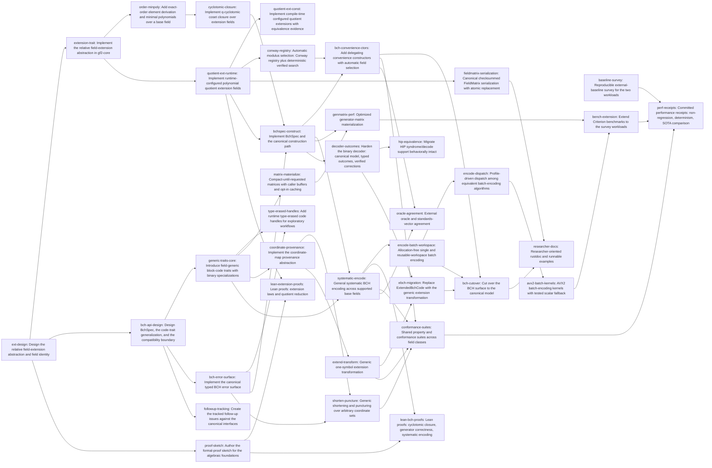

# Plan: Harden and generalize BCH codes over finite fields (ae03bcd0)

> Planning node: 2aa2279e. Authoritative graph:
> [breakdown.json](breakdown.json).

## Outcome and criterion approach

| Criterion | Approach | Evidence / open gap |
|---|---|---|
| REQ-01 | One approved extension design, then a gf2-core trait with validation certificates, plus exact-order and minimal-polynomial-over-subfield operations on it | [Investigation](investigation.md) claims 5, 7 |
| REQ-02 | Runtime quotient extension defines the pair's semantics; compile-time form proves observable equivalence; deterministic Conway/search selection extends the existing registry | Investigation claims 6, 8 |
| REQ-03 | `BchSpec` variants carry only independent inputs; one construct path derives closure, generator, $k$, bound, radius; convenience constructors delegate | Investigation claim 1; [brief](../../plans/ae03bcd0-general-bch/planning-brief.md) API shape |
| REQ-04 | Validation set and typed-error surface (`bch-error-contract`) shared by every new public boundary | Investigation claim 1 |
| REQ-05 | Coordinate-map abstraction first; shorten/puncture derive dimension by rank; extension is the zero-sum coordinate | Investigation claim 14 |
| REQ-06 | Trait surface fixed in the API design, implemented once with binary specializations and a named compatibility boundary; erased handles layered on top | Investigation claims 3, consumer inventory |
| REQ-07 | Semantics first (canonical cyclic coordinates, explicit layout maps), then allocation-free/workspace APIs, then family dispatch | Investigation claim 13 |
| REQ-08 | Compact-until-requested access with caller buffers and opt-in caching; new checksummed atomic `FieldMatrix` format with identity-validated load | Investigation claims 4, 10, primitive verification |
| REQ-09 | Decoder migrates to the canonical model with verified typed outcomes and a fast/diagnostic split; HIP path pinned by existing byte-identity suites | Investigation claims 2, 11 |
| REQ-10 | eBCH consumers migrate to the generic extension; then one cutover sweep against the complete cited consumer inventory | Investigation consumer inventory |
| REQ-11 | One shared conformance suite over GF(2)/GF(p)/GF(p^r) including transformations; oracle agreement per the evidence protocol | Investigation open unknowns (oracle gap) |
| REQ-12 | Approved sketch assigns each obligation to extraction or model-plus-refinement per the refinement boundary; two Lean tasks implement it | Investigation claim 12 |
| REQ-13 | Survey pins baselines and workloads; benches extend existing Criterion targets; receipts follow the evidence protocol | Investigation claim 15, prior art (SOTA matrix) |
| REQ-14 | Aspirational comparison rows in the same receipts, reported either way | Evidence protocol |
| REQ-15 | Docs land last over the stable surface, distance-bound terminology observed | Brief (terminology) |
| REQ-16 | Follow-up issues authored once the interface design is approved | Brief (follow-ups) |

## Shared architectural contracts

### `field-extension-api` [implementation-produced] — relative extension abstraction

One gf2-core abstraction for "E extends B": embedding, checked membership and
restriction, relative degree, relative Frobenius, order relationships, reusable
validation certificates. Producer: the `ext-design` document (via
`produces_contracts`); `extension-trait` implements it. Grounding:
[investigation](investigation.md) claim 5.

### `field-identity` [implementation-produced] — stable canonical field identity

One canonical, version-stable identity for a field (base, modulus, representation)
shared by serialization validation and automatic selection; equal for
compile-time and runtime forms of the same field. Producer: `ext-design`.

### `quotient-extension-api` [implementation-produced] — arbitrary quotient extensions

Representation, reduction, inversion, Frobenius, base embedding, and identity
semantics of polynomial quotient fields; the runtime form is the reference.
Producer: `quotient-ext-runtime`.

### `bchspec-model` [implementation-produced] — canonical construction description

`BchSpec` variant set (primitive narrow-sense; primitive arbitrary first root;
non-primitive with derived or explicit $n$-th root of unity; seed set with
derived closure; explicit generator) and the construct/derivation pipeline
stages. Producer: `bch-api-design`.

### `block-code-traits` [implementation-produced] — field-generic code interfaces

Block-code, encoder, generator-matrix, and parity-check traits generic over
symbol field and representation, with packed `BitVec`/`BitMatrix`
specializations and the named, versioned compatibility boundary for unmigrated
families. Producer: `bch-api-design`; implemented by `generic-traits-core`.

### `bch-error-contract` [implementation-produced] — typed error surface

One structured error surface across construction, transformation, matrix,
serialization-interop, and decoding boundaries; panics only for violated
internal invariants. Producer: `bch-error-surface`.

### `coordinate-map-api` [implementation-produced] — derived-code provenance

Composable coordinate maps from derived to mother coordinates with compact
regular representations. Producer: `coordinate-provenance`.

### `matrix-serialization-format` [implementation-produced] — FieldMatrix persistence

Versioned format: field identity + element representation header, checksummed
payload (BLAKE3 per the checkpoint precedent), write-temp/sync/rename
replacement (per `gf2-sim`'s atomic-write pattern), typed load validation.
Producer: `fieldmatrix-serialization`. No code-specific metadata in files.

### `systematic-layout` [plan-fixed] — coordinate conventions

Internal cyclic representation maps coordinate $i \leftrightarrow x^i$.
Default systematic user layout is `[message | parity]` through an explicit,
zero-cost coordinate mapping; standards adapters declare their transmission
ordering explicitly. Generator matrices, transformations, and encoding APIs
preserve the mapping.

### `evidence-protocol` [plan-fixed] — conformance and performance evidence

Representative corpus (predeclared): binary primitive narrow-sense
$(15, 5)$, $(127, 64)$ with $\delta = 21$, $(255, 223)$; DVB-T2 normal-frame
BCH parameters; nonbinary rows over $\mathrm{GF}(3)$ and $\mathrm{GF}(5)$ with
non-primitive $n$, $\mathrm{GF}(9)$ as a $\mathrm{GF}(p^r)$ base, and the
$n = q - 1$ Reed–Solomon-parameter row over $\mathrm{GF}(2^8)$ (oracle-rich by
construction). Oracle candidates: SageMath `codes.BCHCode` and GAP/Guava, both
pinned by version; authoritative vectors: DVB-T2 verification vectors already
in-tree plus published generator tables. Statistical acceptance for
"no measurable regression": 95% bootstrap confidence interval of the
throughput ratio (new/old) excludes ratios below $0.98$ on every predeclared
workload; hosts follow the receipt conventions of the SOTA target matrix
(uncontended, pinned toolchain, committed seeds/revision/host). Oracle gaps
for a corpus row are recorded explicitly, never silently skipped.

### `lean-refinement-boundary` [plan-fixed] — proof binding modes

Obligations bind either by direct extraction (raw bounded paths transparent to
the current Charon/Aeneas surface) or by an abstract Lean model plus tested
refinement to the optimized Rust path; runtime field-carrying code and
`FieldPoly` remain opaque, per the extraction surface recorded in the
investigation (claim 12). The approved sketch assigns the mode per obligation;
no untracked assumptions.

## Generated decomposition overview

<!-- jit:breakdown-overview:begin -->
| Key | Title | Type | Outcome | Contracts | Sources | Footprint | Landing | Depends on |
|---|---|---|---|---|---|---|---|---|
| ext-design | Design the relative field-extension abstraction and field identity | task | Relative-extension abstraction and stable field identity fixed by an approved design | — | REQ-01, REQ-02, INV-UNKNOWNS, INV-CLAIMS, D-06 | creates 1 | extension-foundations | — |
| extension-trait | Implement the relative field-extension abstraction in gf2-core | task | gf2-core exposes the canonical relative extension abstraction with reusable validation certificates | field-extension-api | REQ-01, INV-CLAIMS, INV-ARCH | creates 1, touches 1 | extension-foundations | ext-design |
| order-minpoly | Add exact-order element derivation and minimal polynomials over a base field | task | Exact-order-$n$ elements and minimal polynomials over arbitrary base fields are reusable gf2-core operations | field-extension-api | REQ-01, INV-CLAIMS, INV-PRIMITIVES | touches 2 | extension-foundations | extension-trait |
| cyclotomic-closure | Implement q-cyclotomic coset closure over extension fields | task | Seed sets close deterministically under q-cyclotomic conjugacy with coset partitions | — | REQ-03, REQ-04, INV-CLAIMS | touches 1 | extension-foundations | order-minpoly |
| quotient-ext-runtime | Implement runtime-configured polynomial quotient extension fields | task | Runtime polynomial quotient extensions construct with eager validation and stable identity | field-extension-api, field-identity | REQ-02, INV-CLAIMS, D-06 | creates 1, touches 1 | extension-foundations | extension-trait |
| quotient-ext-const | Implement compile-time configured quotient extensions with equivalence evidence | task | Compile-time quotient extensions match the runtime form observably | quotient-extension-api, field-identity | REQ-02, INV-CLAIMS | touches 2 | extension-foundations | quotient-ext-runtime |
| conway-registry | Automatic modulus selection: Conway registry plus deterministic verified search | task | Automatic modulus selection is deterministic: Conway where defined, verified search otherwise | quotient-extension-api | REQ-02, INV-CLAIMS, INV-PRIORART | touches 1 | extension-foundations | quotient-ext-runtime |
| bch-api-design | Design BchSpec, the code-trait generalization, and the compatibility boundary | task | BchSpec variants, generic trait surface, and compatibility boundary fixed by an approved design | — | REQ-03, REQ-06, REQ-10, BRIEF-API, INV-CONSUMERS, D-03 | creates 1 | code-traits | ext-design |
| generic-traits-core | Introduce field-generic block-code traits with binary specializations | task | Field-generic code traits exist with binary specializations and a named compatibility boundary | block-code-traits | REQ-06, REQ-10, INV-CLAIMS, INV-CONSUMERS, D-03, BRIEF-WIRING | touches 2 | code-traits | bch-api-design |
| type-erased-handles | Add runtime type-erased code handles for exploratory workflows | task | Type-erased handles run exploratory workflows over any static code type | block-code-traits, bch-error-contract | REQ-06, BRIEF-API | touches 1 | code-traits | generic-traits-core, bch-error-surface |
| matrix-materialize | Compact-until-requested matrices with caller buffers and opt-in caching | task | Matrices stay compact until requested, with caller buffers and opt-in caching | block-code-traits | REQ-08, INV-CLAIMS | touches 1 | code-traits | generic-traits-core |
| fieldmatrix-serialization | Canonical checksummed FieldMatrix serialization with atomic replacement | task | FieldMatrix round-trips through a checksummed, atomic, identity-validated format | field-identity | REQ-08, INV-PRIMITIVES, D-06, D-10 | creates 1, touches 1 | code-traits | quotient-ext-runtime |
| bch-error-surface | Implement the canonical typed BCH error surface | task | One typed error surface spans the new public BCH-stack boundaries | bchspec-model | REQ-04, BRIEF-API, INV-CLAIMS | creates 1 | bch-construction | bch-api-design |
| bchspec-construct | Implement BchSpec and the canonical construction path | task | Each BchSpec flavor constructs through one validated, deriving canonical path | bchspec-model, bch-error-contract, field-extension-api, quotient-extension-api | REQ-03, REQ-04, BRIEF-API, BRIEF-BOUNDS, INV-CLAIMS, D-02 | creates 1, touches 1 | bch-construction | cyclotomic-closure, quotient-ext-runtime, bch-error-surface |
| bch-convenience-ctors | Add delegating convenience constructors with automatic field selection | task | Convenience constructors delegate to the canonical path with automatic or explicit fields | bchspec-model | REQ-03, BRIEF-TERMINOLOGY, BRIEF-API | touches 1 | bch-construction | bchspec-construct, conway-registry |
| coordinate-provenance | Implement the coordinate-map provenance abstraction | task | Each derived code carries a composable coordinate map to its mother code | block-code-traits | REQ-05, BRIEF-HELPERS | creates 1 | derived-codes | generic-traits-core |
| shorten-puncture | Generic shortening and puncturing over arbitrary coordinate sets | task | Arbitrary-coordinate shortening and puncturing derive dimension by rank with provenance | coordinate-map-api, bch-error-contract | REQ-05, BRIEF-HELPERS, INV-CLAIMS | creates 1 | derived-codes | coordinate-provenance, bch-error-surface |
| extend-transform | Generic one-symbol extension transformation | task | One-symbol zero-sum extension works generically and matches legacy eBCH semantics | coordinate-map-api | REQ-05, INV-CLAIMS, D-05 | touches 1 | derived-codes | coordinate-provenance |
| systematic-encode | General systematic BCH encoding across supported base fields | task | General systematic encoding works over each supported base field with explicit layouts | bchspec-model, block-code-traits, systematic-layout | REQ-07, INV-CLAIMS, BRIEF-API | touches 1 | encoding | bchspec-construct, generic-traits-core |
| encode-batch-workspace | Allocation-free single and reusable-workspace batch encoding | task | Allocation-free single and workspace batch encoding match the allocating paths | bch-error-contract | REQ-07, BRIEF-DISPATCH | touches 1 | encoding | systematic-encode |
| encode-dispatch | Profile-driven dispatch among equivalent batch-encoding algorithms | task | Profile-driven dispatch selects among equivalent encoding families over a scalar reference | bchspec-model | REQ-07, REQ-13, BRIEF-DISPATCH, D-04 | touches 1 | encoding | encode-batch-workspace |
| avx2-batch-kernels | AVX2 batch-encoding kernels with tested scalar fallback | task | AVX2 batch encoding is bit-identical to scalar with a tested fallback | systematic-layout | REQ-13, REQ-14, INV-CLAIMS, INV-ARCH, D-09 | creates 1 | encoding | encode-dispatch |
| genmatrix-perf | Optimized generator-matrix materialization | task | Generator-matrix materialization is optimized for packed binary and generic fields | block-code-traits | REQ-13, REQ-08, INV-PRIORART | touches 1 | encoding | matrix-materialize, bchspec-construct |
| decoder-outcomes | Harden the binary decoder: canonical model, typed outcomes, verified corrections | task | The binary decoder returns verified typed outcomes with fast and diagnostic paths | bchspec-model, bch-error-contract | REQ-09, BRIEF-DIAGNOSTIC, INV-CLAIMS | touches 1 | decoder | bchspec-construct |
| hip-equivalence | Migrate HIP syndrome/decode support behaviorally intact | task | HIP syndrome/decode support behaves equivalently on the canonical model | bch-error-contract | REQ-09, INV-CLAIMS, INV-UNKNOWNS | touches 2 | decoder | decoder-outcomes |
| ebch-migration | Replace ExtendedBchCode with the generic extension transformation | task | Generic extension replaces ExtendedBchCode for each consumer with outcomes unchanged | coordinate-map-api | REQ-10, INV-CONSUMERS, D-05 | touches 3 | cutover | extend-transform, decoder-outcomes |
| bch-cutover | Cut over the BCH surface to the canonical model | task | The superseded BCH surface is gone with each direct consumer on the canonical model | bchspec-model, block-code-traits | REQ-10, INV-CONSUMERS, D-02 | touches 2 | cutover | bch-convenience-ctors, encode-batch-workspace, ebch-migration |
| proof-sketch | Author the formal-proof sketch for the algebraic foundations | task | Each proof obligation has a named path, lemma, strategy, and binding mode approved | lean-refinement-boundary, field-extension-api | REQ-12, INV-CLAIMS, D-08 | creates 1 | verification | ext-design |
| lean-extension-proofs | Lean proofs: extension laws and quotient reduction | task | Extension-law and quotient-reduction lemmas pass the proof gates | lean-refinement-boundary | REQ-12, D-08 | touches 1 | verification | proof-sketch, quotient-ext-runtime |
| lean-bch-proofs | Lean proofs: cyclotomic closure, generator correctness, systematic encoding | task | Closure, generator-correctness, and encoding lemmas pass the proof gates | lean-refinement-boundary | REQ-12, D-08 | touches 1 | verification | proof-sketch, systematic-encode |
| conformance-suites | Shared property and conformance suites across field classes | task | One shared conformance suite passes over GF(2), GF(p), and GF(p^r) | bchspec-model, coordinate-map-api | REQ-11, D-02, INV-PRIMITIVES | creates 1 | verification | bch-convenience-ctors, shorten-puncture, extend-transform, systematic-encode |
| oracle-agreement | External oracle and standards-vector agreement | task | Representative results agree with two named external oracles and standards vectors | evidence-protocol | REQ-11, D-07, INV-UNKNOWNS | creates 2 | verification | bch-convenience-ctors, systematic-encode |
| baseline-survey | Reproducible external-baseline survey for the two workloads | task | The strongest external baselines and representative workloads are pinned reproducibly | evidence-protocol | REQ-13, REQ-14, D-07, INV-PRIORART, INV-UNKNOWNS | creates 1 | performance | — |
| bench-extension | Extend Criterion benchmarks to the survey workloads | task | Criterion benches cover both predeclared workloads on the canonical model | evidence-protocol | REQ-13, D-02, INV-CLAIMS | touches 1 | performance | avx2-batch-kernels, genmatrix-perf |
| perf-receipts | Committed performance receipts: non-regression, determinism, SOTA comparison | task | Committed receipts show non-regression, determinism, fallback coverage, and the SOTA comparison | evidence-protocol | REQ-13, REQ-14, D-07 | creates 1 | performance | baseline-survey, bench-extension, conformance-suites |
| researcher-docs | Researcher-oriented rustdoc and runnable examples | task | Researchers have runnable examples and rustdoc for the full canonical surface | systematic-layout, matrix-serialization-format | REQ-15, BRIEF-TERMINOLOGY | touches 2 | docs | bch-cutover, fieldmatrix-serialization |
| followup-tracking | Create the tracked follow-up issues against the canonical interfaces | task | The three follow-up issues exist against the canonical interfaces | bchspec-model | REQ-16, BRIEF-API | uncertain | docs | bch-api-design |

<!-- jit:breakdown-overview:end -->

## Material risks and owner decisions

| Risk / decision | Resolution and rationale |
|---|---|
| D-01 flat decomposition | Chosen flat tasks with landing groups, matching prior epic manifests; rejected story containers as adding tier without review value |
| D-02 external prerequisites | `8f51d6cf` re-homes to `bchspec-construct` (public LCM), `3243bc1f` to `conformance-suites` (pre-cutover baseline), `88ca7d2f` to `bench-extension`; all three stay in current narrow scope as protective baselines, expansion subsumed by the new children |
| D-03 shared trait-cutover child | Story `3931ac6f` gets a dependency edge onto `generic-traits-core` at breakdown; no `3931ac6f` → epic edge (owner-approved graph shape) |
| D-04 encoding families | Dispatch seam is required with ≥1 scalar reference and ≥2 registered families; the full family set is survey/profile-selected, not mandated (interview said "such as"); rejected mandating all three families as evidence-free scope |
| D-05 eBCH disposition | `ExtendedBchCode` is replaced by the generic extension transform and removed; its consumers migrate in `ebch-migration` (REQ-10 treats eBCH as a direct consumer) |
| D-06 field identity | One stable identity shared by serialization and selection, fixed in `ext-design`; rejected per-format ad-hoc identity |
| D-07 evidence protocol | Corpus, oracles, statistics, and hosts predeclared in the plan-fixed contract above so REQ-11/13/14 are verifiable |
| D-08 refinement boundary | Extraction vs model-plus-refinement fixed as plan contract; sketch assigns per obligation; rejected expanding the extraction pipeline inside this epic |
| D-09 MSRV verification | AVX2 design verified during planning: `cargo +1.95 check -p gf2-kernels-simd` passes with the existing CLMUL primitives the kernels reuse |
| D-10 matrix format | New `FieldMatrix` format with BLAKE3 checksum and atomic rename; legacy `.gf2` BitMatrix format untouched (sole production round trip is the LDPC cache) |
| Oracle availability | External nonbinary BCH oracles are unverified (investigation open unknown); mitigated by the RS-parameter corpus row and explicit gap recording in `oracle-agreement` |
| Table-backed hot path | Current BCH speed depends on `with_tables` ($m \le 16$); non-regression receipts measure like-for-like table-backed configurations, and the generic path must not add table costs to the binary hot path |
| Cutover breadth | The consumer inventory is large; mitigated by the complete cited inventory in the investigation and the named compatibility boundary for non-BCH families |

## Investigation sources

- [Investigation](investigation.md) — claim classifications, complete consumer
  inventories, primitive verification, architecture fit; exhaustive lists live
  there.
- [Planning brief](../../plans/ae03bcd0-general-bch/planning-brief.md) — owner
  decisions the epic contract does not carry (API shape, dispatch, diagnostics,
  helpers, wiring, terminology).
