# Plan: Harden and generalize BCH codes over finite fields (ae03bcd0)

> Planning node: 2aa2279e. Authoritative graph:
> [breakdown.json](breakdown.json).

## Outcome and criterion approach

| Criterion | Approach | Evidence / open gap |
|---|---|---|
| REQ-01 | One approved extension design, then a gf2-core trait with validation certificates, plus exact-order and minimal-polynomial-over-subfield operations on it | [Investigation](investigation.md) claims 5, 7 |
| REQ-02 | Runtime quotient extension defines the pair's semantics; compile-time form proves observable equivalence; deterministic Conway/search selection extends the existing registry | Investigation claims 6, 8 |
| REQ-03 | `BchSpec` variants carry only independent inputs; one construct path derives closure, generator, $k$, bound, radius; convenience constructors delegate | Investigation claim 1; [brief](../../plans/ae03bcd0-general-bch/planning-brief.md) API shape |
| REQ-04 | Validation set plus the layered `error-surface` contract: core-owned IO errors, coding-general code/transform errors, BCH errors composing them | Investigation claim 1 |
| REQ-05 | Coordinate-map abstraction first; shorten/puncture derive dimension by rank; extension is the zero-sum coordinate | Investigation claim 14 |
| REQ-06 | Trait surface fixed in the API design, implemented once with binary specializations and a named compatibility boundary; erased handles layered on top | Investigation claims 3, consumer inventory |
| REQ-07 | Semantics first (canonical cyclic coordinates, explicit layout maps), then allocation-free/workspace APIs, then family dispatch | Investigation claim 13 |
| REQ-08 | Compact-until-requested access with caller buffers and opt-in caching; new checksummed atomic `FieldMatrix` format with identity-validated load | Investigation claims 4, 10, primitive verification |
| REQ-09 | Decoder migrates to the canonical model with verified typed outcomes and a fast/diagnostic split; HIP path pinned by existing byte-identity suites | Investigation claims 2, 11 |
| REQ-10 | Staged consumer migrations (eBCH library paths, gf2-coding library, gf2-coding tooling, external crates) followed by a final deletion sweep, each against the cited inventory | Investigation consumer inventory |
| REQ-11 | One shared conformance suite over GF(2)/GF(p)/GF(p^r) including transformations; oracle agreement per the evidence protocol | Investigation open unknowns (oracle gap) |
| REQ-12 | Sketch lands after the semantic production paths exist so it can name exact files and functions; five sequenced Lean tasks implement its obligation groups | Investigation claim 12 |
| REQ-13 | Survey (upstream of dispatch, kernels, and benches) fixes the workload-selection contract; receipts compare against the pinned pre-cutover baseline | Investigation claim 15, prior art (SOTA matrix) |
| REQ-14 | Aspirational comparison rows in the same receipts, reported either way | Evidence protocol |
| REQ-15 | Docs land last over the stable surface, distance-bound terminology observed | Brief (terminology) |
| REQ-16 | Follow-up issues authored once the interface design is approved | Brief (follow-ups) |

## Shared architectural contracts

### `field-extension-api` [implementation-produced] — relative extension abstraction

One gf2-core abstraction for "E extends B": embedding, checked membership and
restriction, relative degree, relative Frobenius, order relationships, reusable
validation certificates. Producer: the `ext-design` document (via
`produces_contracts`); `extension-trait` implements it. Grounding:
[investigation](investigation.md) claim 5.

### `field-identity` [implementation-produced] — algebraic field identity

One canonical, version-stable *algebraic* identity for a field — characteristic,
base tower, modulus, basis semantics — shared by serialization validation and
automatic selection, and equal for compile-time and runtime forms of the same
field. Element wire representation is not part of the identity; serialized
headers version it separately. Producer: `ext-design`.

### `quotient-extension-api` [implementation-produced] — arbitrary quotient extensions

Representation, reduction, inversion, Frobenius, base embedding, and identity
semantics of polynomial quotient fields; the runtime form is the reference.
Producer: `quotient-ext-runtime`.

### `bchspec-model` [implementation-produced] — canonical construction description

`BchSpec` variant set (primitive narrow-sense; primitive arbitrary first root;
non-primitive with derived or explicit $n$-th root of unity; seed set with
derived closure; explicit generator) and the construct/derivation pipeline
stages. Producer: `bch-api-design`.

### `block-code-traits` [implementation-produced] — field-generic code interfaces

Block-code, encoder, generator-matrix, and parity-check traits generic over
symbol field and representation, with packed `BitVec`/`BitMatrix`
specializations and the named, versioned compatibility boundary for unmigrated
families. Producer: `bch-api-design`; implemented by `generic-traits-core`.

### `error-surface` [implementation-produced] — layered typed error surface

Error ownership follows crate direction: gf2-core owns field and matrix-IO
error types; gf2-coding owns the coding-general layer (transform coordinates,
buffer/shape mismatches, dynamic type mismatches) plus BCH construction and
decoding errors that compose or wrap the general layers. Generic APIs never
expose BCH-specific types; panics only for violated internal invariants.
Producer: `coding-error-surface`.

### `coordinate-map-api` [implementation-produced] — derived-code provenance

Composable coordinate maps from derived to mother coordinates with compact
regular representations. Producer: `coordinate-provenance`.

### `matrix-serialization-format` [implementation-produced] — FieldMatrix persistence

Versioned format: field identity + element representation header, checksummed
payload (BLAKE3 per the checkpoint precedent), write-temp/sync/rename
replacement (per `gf2-sim`'s atomic-write pattern), typed load validation.
Producer: `fieldmatrix-serialization`. No code-specific metadata in files.

### `systematic-layout` [plan-fixed] — coordinate conventions

Internal cyclic representation maps coordinate $i \leftrightarrow x^i$.
Default systematic user layout is `[message | parity]` through an explicit,
zero-cost coordinate mapping; standards adapters declare their transmission
ordering explicitly. Generator matrices, transformations, and encoding APIs
preserve the mapping.

### `evidence-protocol` [plan-fixed] — conformance and performance evidence

Conformance corpus, fully predeclared (all primitive rows narrow-sense,
$b = 1$, first consecutive root $\alpha^1$, default `[message | parity]`
layout, splitting-field moduli by the deterministic registry/search policy):

| Row | Base field | $n$ | $\delta$ | Splitting field |
|---|---|---|---|---|
| B1 | $\mathrm{GF}(2)$ | 15 | 7 | $\mathrm{GF}(2^4)$ |
| B2 | $\mathrm{GF}(2)$ | 127 | 21 | $\mathrm{GF}(2^7)$ |
| B3 | $\mathrm{GF}(2)$ | 255 | 9 | $\mathrm{GF}(2^8)$ |
| B4 | $\mathrm{GF}(2)$ | DVB-T2 normal-frame parameters as pinned by the in-tree verification vectors | — | per standard |
| N1 | $\mathrm{GF}(3)$ | 13 | 5 | $\mathrm{GF}(3^3)$ |
| N2 | $\mathrm{GF}(5)$ | 31 | 4 | $\mathrm{GF}(5^3)$ |
| N3 | $\mathrm{GF}(9)$ | 10 | 3 | $\mathrm{GF}(3^4)$ |
| N4 | $\mathrm{GF}(2^8)$ | 255 | 33 | $\mathrm{GF}(2^8)$ (Reed–Solomon parameters) |

Fixture messages are generated deterministically from seed `0xAE03BCD0` with
the repository's standard seeded test RNG, lengths equal to each row's derived
$k$. Oracles (both required on every corpus row; a row an oracle cannot
produce is a blocking finding, not a recordable gap): SageMath
`codes.BCHCode` and GAP with GUAVA `BCHCode(n, b, delta, F)` — both
documented for general finite base fields with $\gcd(n, q) = 1$; exact oracle
versions are recorded in `oracle-provenance.md` at fixture generation.
Authoritative vectors: the in-tree DVB-T2 verification vectors. For rows with
a $\mathrm{GF}(p^r)$ base (N3, N4), the provenance pins the explicit
base-field isomorphism and coefficient canonicalization used to compare
serialized coefficients across SageMath, GUAVA, and gf2 — equal field size
alone does not make coefficient encodings comparable.

Performance acceptance ("no statistically measurable regression"): the
one-sided lower 95% bootstrap confidence bound (10,000 resamples over
Criterion's collected samples, Criterion defaults otherwise) of the
throughput ratio new/baseline is at or above $0.98$ on every selected
workload. The baseline is the pre-cutover receipt at its pinned revision
(D-11). Exact benchmark codes, batch sizes, matrix dimensions, cache state,
and worker counts are fixed by the survey's `workload-selection` contract
before optimization work begins. Hosts follow the receipt conventions of the
SOTA target matrix (uncontended, pinned toolchain, committed
seeds/revision/host).

#### Amendment 1 (2026-09-02, `3f7edef1`) — sampling rule

The protocol above fixes the corpus rows, the message seed, the two oracles,
and the authoritative vectors. This amendment predeclares the sampling the
conformance suites draw under them, so the counts are a protocol input rather
than an implementation choice.

- **Messages per corpus row.** Four seeded messages for a row of length at most
  4096 and two above it, keeping the committed fixture proportionate to the row
  it carries.
- **Coordinate comparison.** Rows of length at most 4096 are compared symbol by
  symbol together; a longer row is compared in its own case. Both run in the
  fast tier, and the threshold is a fixture-size and runtime bound with no
  mathematical content: a row's agreement claim does not depend on which side
  of it the row falls.
- **Shortened DVB-T2 payloads.** Three seeded payloads of the standard's
  $K_{\mathrm{bch}}$ witness that shortening leaves the mother code's parity
  unchanged.
- **Standards vectors.** The ETSI DVB-T2 verification and validation reference
  streams, set VV001-CR35, are compared exhaustively rather than sampled: every
  block of every frame the set carries, its test point 04 payload encoded
  through the canonical mother code and asserted equal to its test point 05
  block.

### `workload-selection` [implementation-produced] — selected baselines and workloads

The survey's concrete completion of the evidence protocol: selected external
baseline per workload (library, version, build flags), exact benchmark codes,
batch sizes, matrix dimensions, cache state, worker counts, and the encoding
algorithm families to register, fixed before any optimization task consumes
them. Producer: `baseline-survey`.

### `lean-refinement-boundary` [plan-fixed] — proof binding modes

Obligations bind either by direct extraction (raw bounded paths transparent to
the current Charon/Aeneas surface) or by an abstract Lean model plus tested
refinement to the optimized Rust path; runtime field-carrying code and
`FieldPoly` remain opaque, per the extraction surface recorded in the
investigation (claim 12). The approved sketch assigns the mode per obligation;
no untracked assumptions.

## Generated decomposition overview

<!-- jit:breakdown-overview:begin -->
| Key | Title | Type | Outcome | Contracts | Sources | Footprint | Landing | Depends on |
|---|---|---|---|---|---|---|---|---|
| ext-design | Design the relative field-extension abstraction and field identity | task | Relative-extension abstraction and algebraic field identity fixed by an approved design | — | REQ-01, REQ-02, INV-UNKNOWNS, INV-CLAIMS, D-06 | creates 1 | extension-foundations | — |
| extension-trait | Implement the relative field-extension abstraction in gf2-core | task | gf2-core exposes the canonical relative extension abstraction with reusable validation certificates | field-extension-api | REQ-01, INV-CLAIMS, INV-ARCH | creates 1, touches 1 | extension-foundations | ext-design |
| exact-order | Deterministic derivation of elements with exact multiplicative order | task | Exact-order elements derive deterministically for supported extension fields | field-extension-api | REQ-01, REQ-03, INV-CLAIMS, INV-PRIMITIVES | touches 1 | extension-foundations | extension-trait |
| minpoly-subfield | Minimal polynomials of extension elements over an arbitrary base field | task | Minimal polynomials over arbitrary base fields are a reusable gf2-core operation | field-extension-api | REQ-01, INV-CLAIMS | touches 1 | extension-foundations | exact-order |
| cyclotomic-closure | Implement q-cyclotomic coset closure over extension fields | task | Seed sets close deterministically under q-cyclotomic conjugacy with coset partitions | — | REQ-03, REQ-04, INV-CLAIMS | touches 1 | extension-foundations | minpoly-subfield |
| irreducibility-validation | Generic irreducibility validation with reusable certificates | task | Irreducibility validates completely with reusable certificates | field-extension-api | REQ-02, INV-CLAIMS | creates 1 | extension-foundations | extension-trait |
| quotient-ext-runtime | Implement runtime-configured polynomial quotient extension fields | task | Runtime polynomial quotient extensions construct with certificate-backed validation and stable identity | field-extension-api, field-identity | REQ-02, INV-CLAIMS, D-06 | creates 1, touches 1 | extension-foundations | irreducibility-validation |
| quotient-ext-const | Implement compile-time configured quotient extensions with equivalence evidence | task | Compile-time quotient extensions match the runtime form observably | quotient-extension-api, field-identity | REQ-02, INV-CLAIMS | touches 2 | extension-foundations | quotient-ext-runtime |
| conway-registry | Automatic modulus selection: Conway registry plus deterministic verified search | task | Automatic modulus selection is deterministic: Conway where defined, verified search otherwise | quotient-extension-api | REQ-02, INV-CLAIMS, INV-PRIORART | creates 1, touches 1 | extension-foundations | quotient-ext-runtime |
| bch-api-design | Design BchSpec, the code-trait generalization, and the compatibility boundary | task | BchSpec variants, generic trait surface, and compatibility boundary fixed by an approved design | — | REQ-03, REQ-06, REQ-10, BRIEF-API, INV-CONSUMERS, D-03 | creates 1 | code-traits | ext-design |
| generic-traits-core | Introduce field-generic block-code traits with binary specializations | task | Field-generic code traits exist with binary specializations and a named compatibility boundary | block-code-traits | REQ-06, REQ-10, INV-CLAIMS, INV-CONSUMERS, D-03, BRIEF-WIRING | touches 2 | code-traits | bch-api-design |
| coding-error-surface | Implement the layered typed error surface for coding APIs | task | A layered typed error surface spans the new coding-side boundaries | bchspec-model | REQ-04, BRIEF-API, INV-CLAIMS, INV-ARCH | creates 2 | bch-construction | bch-api-design |
| type-erased-handles | Add runtime type-erased code handles for exploratory workflows | task | Type-erased handles run exploratory workflows over any static code type | block-code-traits, error-surface | REQ-06, BRIEF-API | touches 1 | code-traits | generic-traits-core, coding-error-surface |
| matrix-materialize | Reference matrix materialization: compact access, caller buffers, opt-in caching | task | Canonical BCH matrices materialize compactly with caller buffers and opt-in caching | block-code-traits, error-surface | REQ-08, INV-CLAIMS | creates 1, touches 1 | code-traits | type-erased-handles, bch-construct-core |
| fieldmatrix-serialization | Canonical checksummed FieldMatrix serialization with atomic replacement | task | FieldMatrix round-trips through a checksummed, atomic, identity-validated format | field-identity | REQ-08, INV-PRIMITIVES, D-06, D-10 | creates 1, touches 1 | code-traits | quotient-ext-runtime |
| bch-construct-core | Implement BchSpec and the consecutive-root construction path | task | Primitive consecutive-root BchSpecs construct through one validated, deriving path | bchspec-model, error-surface, field-extension-api, quotient-extension-api | REQ-03, REQ-04, BRIEF-API, INV-CLAIMS, D-02 | creates 1, touches 1 | bch-construction | cyclotomic-closure, quotient-ext-runtime, coding-error-surface |
| bch-construct-seedset | Construction from arbitrary seed sets, including boundary codes | task | Seed-set BchSpecs construct through the canonical path with boundary codes included | bchspec-model, error-surface | REQ-03, REQ-04, INV-CLAIMS | touches 1 | bch-construction | bch-construct-core |
| bch-construct-generator | Construction from explicitly supplied generator polynomials | task | Explicit-generator BchSpecs verify and construct through the canonical path | bchspec-model, error-surface | REQ-03, REQ-04, INV-CLAIMS | touches 1 | bch-construction | bch-construct-seedset |
| bch-construct-nonprimitive | Construction at non-primitive lengths with both root conventions | task | Non-primitive BchSpecs construct with derived or explicit roots of unity | bchspec-model, error-surface | REQ-03, INV-CLAIMS | touches 1 | bch-construction | bch-construct-generator |
| bch-convenience-ctors | Add delegating convenience constructors with automatic field selection | task | Convenience constructors delegate to the canonical path with automatic or explicit fields | bchspec-model | REQ-03, BRIEF-TERMINOLOGY, BRIEF-API | touches 1 | bch-construction | bch-construct-nonprimitive, conway-registry |
| coordinate-provenance | Implement the coordinate-map provenance abstraction | task | Each derived code carries a composable coordinate map to its mother code | block-code-traits | REQ-05, BRIEF-HELPERS | creates 1 | derived-codes | generic-traits-core |
| shorten-transform | Generic shortening over arbitrary coordinate sets | task | Arbitrary-coordinate shortening derives dimension by rank with provenance | coordinate-map-api, error-surface | REQ-05, BRIEF-HELPERS, INV-CLAIMS | creates 1 | derived-codes | coordinate-provenance, coding-error-surface |
| puncture-transform | Generic puncturing over arbitrary coordinate sets | task | Arbitrary-coordinate puncturing derives dimension by rank with provenance | coordinate-map-api, error-surface | REQ-05, INV-CLAIMS | touches 1 | derived-codes | shorten-transform |
| extend-transform | Generic one-symbol extension transformation | task | One-symbol zero-sum extension works generically and matches legacy eBCH semantics | coordinate-map-api | REQ-05, INV-CLAIMS, D-05 | touches 1 | derived-codes | puncture-transform |
| systematic-encode | General systematic BCH encoding across supported base fields | task | General systematic encoding works over each supported base field with explicit layouts | bchspec-model, block-code-traits, systematic-layout | REQ-07, INV-CLAIMS, BRIEF-API | creates 1, touches 1 | encoding | bch-construct-core, generic-traits-core |
| encode-batch-workspace | Allocation-free single, workspace batch, and parallel batch encoding | task | Allocation-free and parallel batch encoding match the allocating paths deterministically | error-surface | REQ-07, BRIEF-DISPATCH, INV-CLAIMS | touches 1 | encoding | systematic-encode |
| encode-dispatch | Profile-driven dispatch among equivalent batch-encoding algorithms | task | Profile-driven dispatch selects among equivalent encoding families over a scalar reference | bchspec-model, workload-selection | REQ-07, REQ-13, BRIEF-DISPATCH, D-04 | touches 1 | encoding | encode-batch-workspace, baseline-survey |
| avx2-batch-kernels | AVX2 batch-encoding kernels with complete feature detection and tested scalar fallback | task | AVX2 batch encoding is bit-identical to scalar with complete feature detection | systematic-layout, workload-selection | REQ-13, REQ-14, INV-CLAIMS, INV-ARCH, D-09 | creates 1 | encoding | encode-dispatch |
| genmatrix-perf | Optimize the reference generator-matrix materialization | task | Generator-matrix materialization is optimized for packed binary and generic fields | block-code-traits, workload-selection | REQ-13, REQ-08, INV-PRIORART | touches 1 | encoding | matrix-materialize, encode-dispatch |
| decoder-outcomes | Harden the binary decoder: canonical model, typed outcomes, verified corrections | task | The binary decoder returns verified typed outcomes with fast and diagnostic paths | bchspec-model, error-surface | REQ-09, BRIEF-DIAGNOSTIC, INV-CLAIMS | touches 1 | decoder | bch-construct-core |
| hip-equivalence | Migrate HIP syndrome/decode support behaviorally intact | task | HIP syndrome/decode support behaves equivalently on the canonical model | error-surface | REQ-09, INV-CLAIMS, INV-UNKNOWNS | touches 2 | decoder | decoder-outcomes |
| ebch-migration | Migrate library eBCH consumers to the generic extension | task | Generic extension replaces ExtendedBchCode in the gf2-coding library paths | coordinate-map-api | REQ-10, INV-CONSUMERS, D-05 | touches 5 | cutover | extend-transform, decoder-outcomes |
| cutover-dvbt2 | Migrate the DVB-T2 BCH consumers to the canonical model | task | The DVB-T2 family runs on the canonical BCH model | bchspec-model, block-code-traits | REQ-10, INV-CONSUMERS, D-02 | touches 5 | cutover | bch-convenience-ctors, encode-batch-workspace |
| cutover-components | Migrate the component-code BCH consumers to the canonical model | task | The component codes run on the canonical BCH model | bchspec-model, block-code-traits | REQ-10, INV-CONSUMERS, D-02 | touches 5 | cutover | bch-convenience-ctors, encode-batch-workspace, ebch-migration |
| cutover-bins-examples | Migrate gf2-coding binaries and examples | task | The gf2-coding binaries and examples run on the canonical model | bchspec-model | REQ-10, INV-CONSUMERS | touches 4 | cutover | cutover-dvbt2, cutover-components |
| cutover-test-suite | Migrate gf2-coding integration tests | task | The gf2-coding integration tests run on the canonical model | bchspec-model | REQ-10, INV-CONSUMERS | touches 6 | cutover | cutover-dvbt2, cutover-components |
| cutover-benches | Migrate gf2-coding benchmarks | task | The gf2-coding benches run on the canonical model | bchspec-model | REQ-10, INV-CONSUMERS, D-11 | touches 2 | cutover | cutover-dvbt2, cutover-components |
| cutover-sim | Migrate gf2-sim BCH consumers | task | The gf2-sim consumers run on the canonical BCH model | bchspec-model | REQ-10, INV-CONSUMERS | touches 5 | cutover | cutover-dvbt2, cutover-components, hip-equivalence |
| cutover-hip-tests | Migrate gf2-kernels-hip BCH test consumers | task | The HIP kernel tests run on the canonical BCH model | bchspec-model | REQ-10, INV-CONSUMERS | touches 2 | cutover | hip-equivalence |
| cutover-removal | Delete the superseded BCH code surface | task | The superseded BCH code surface is deleted | bchspec-model | REQ-10, INV-CONSUMERS, D-02 | touches 3 | cutover | cutover-bins-examples, cutover-test-suite, cutover-benches, cutover-sim, cutover-hip-tests |
| legacy-reference-sweep | Sweep stale prose references to the removed BCH surface | task | Stale prose references to the removed surface are gone | bchspec-model | REQ-10, INV-CONSUMERS | touches 4 | cutover | cutover-removal |
| proof-sketch | Author the formal-proof sketch for the algebraic foundations | task | Each proof obligation has a named path, lemma, strategy, and binding mode approved | lean-refinement-boundary, field-extension-api | REQ-12, INV-CLAIMS, D-08, D-12 | creates 1 | verification | systematic-encode |
| lean-ext-laws | Lean proofs: extension embedding, restriction, and relative Frobenius laws | task | Extension-law lemmas pass the proof gates | lean-refinement-boundary | REQ-12, D-08 | touches 1 | verification | proof-sketch |
| lean-quotient-reduction | Lean proofs: quotient reduction preserves the represented element | task | Quotient-reduction lemmas pass the proof gates | lean-refinement-boundary | REQ-12, D-08 | touches 1 | verification | lean-ext-laws |
| lean-closure | Lean proofs: q-cyclotomic seed closure | task | Cyclotomic-closure lemmas pass the proof gates | lean-refinement-boundary | REQ-12, D-08 | touches 1 | verification | lean-quotient-reduction |
| lean-generator | Lean proofs: generator base-field membership and root correctness | task | Generator-correctness lemmas pass the proof gates | lean-refinement-boundary | REQ-12, D-08 | touches 1 | verification | lean-closure |
| lean-encoding | Lean proofs: systematic encoding correctness | task | Encoding-correctness lemmas pass the proof gates | lean-refinement-boundary | REQ-12, D-08 | touches 1 | verification | lean-generator |
| conformance-suites | Shared property and conformance suites across field classes | task | One shared conformance suite passes over the three base-field classes | bchspec-model, coordinate-map-api, evidence-protocol | REQ-11, D-02, D-07, INV-PRIMITIVES | creates 1 | verification | bch-convenience-ctors, extend-transform, matrix-materialize, systematic-encode |
| oracle-agreement | External oracle and standards-vector agreement | task | Corpus results agree with both named external oracles and standards vectors | evidence-protocol | REQ-11, D-07, INV-UNKNOWNS | creates 2 | verification | bch-convenience-ctors, systematic-encode |
| baseline-survey | Reproducible external-baseline survey and workload selection | task | The strongest external baselines and exact workloads are pinned reproducibly | evidence-protocol | REQ-13, REQ-14, D-04, D-07, INV-PRIORART, INV-UNKNOWNS | creates 1 | performance | — |
| bench-extension | Extend Criterion benchmarks to the selected workloads | task | Criterion benches cover both selected workloads on the canonical model | workload-selection | REQ-13, D-02, INV-CLAIMS | touches 1 | performance | avx2-batch-kernels, genmatrix-perf, cutover-benches |
| perf-receipts | Committed performance receipts: non-regression, determinism, SOTA comparison | task | Committed receipts show non-regression, determinism, fallback coverage, and the SOTA comparison | evidence-protocol, workload-selection | REQ-13, REQ-14, D-07, D-11 | creates 1 | performance | bench-extension, conformance-suites |
| researcher-docs | Researcher-oriented rustdoc and runnable examples | task | Researchers have runnable examples and rustdoc for the full canonical surface | systematic-layout, matrix-serialization-format | REQ-15, BRIEF-TERMINOLOGY | touches 2 | docs | legacy-reference-sweep, fieldmatrix-serialization, avx2-batch-kernels, genmatrix-perf |
| followup-tracking | Create the tracked follow-up issues against the canonical interfaces | task | The three follow-up issues exist against the canonical interfaces | bchspec-model | REQ-16, BRIEF-API | uncertain | docs | bch-api-design |

```mermaid
flowchart LR
    N0["ext-design: Design the relative field-extension abstraction and field identity"]
    N1["extension-trait: Implement the relative field-extension abstraction in gf2-core"]
    N2["exact-order: Deterministic derivation of elements with exact multiplicative order"]
    N3["minpoly-subfield: Minimal polynomials of extension elements over an arbitrary base field"]
    N4["cyclotomic-closure: Implement q-cyclotomic coset closure over extension fields"]
    N5["irreducibility-validation: Generic irreducibility validation with reusable certificates"]
    N6["quotient-ext-runtime: Implement runtime-configured polynomial quotient extension fields"]
    N7["quotient-ext-const: Implement compile-time configured quotient extensions with equivalence evidence"]
    N8["conway-registry: Automatic modulus selection: Conway registry plus deterministic verified search"]
    N9["bch-api-design: Design BchSpec, the code-trait generalization, and the compatibility boundary"]
    N10["generic-traits-core: Introduce field-generic block-code traits with binary specializations"]
    N11["coding-error-surface: Implement the layered typed error surface for coding APIs"]
    N12["type-erased-handles: Add runtime type-erased code handles for exploratory workflows"]
    N13["matrix-materialize: Reference matrix materialization: compact access, caller buffers, opt-in caching"]
    N14["fieldmatrix-serialization: Canonical checksummed FieldMatrix serialization with atomic replacement"]
    N15["bch-construct-core: Implement BchSpec and the consecutive-root construction path"]
    N16["bch-construct-seedset: Construction from arbitrary seed sets, including boundary codes"]
    N17["bch-construct-generator: Construction from explicitly supplied generator polynomials"]
    N18["bch-construct-nonprimitive: Construction at non-primitive lengths with both root conventions"]
    N19["bch-convenience-ctors: Add delegating convenience constructors with automatic field selection"]
    N20["coordinate-provenance: Implement the coordinate-map provenance abstraction"]
    N21["shorten-transform: Generic shortening over arbitrary coordinate sets"]
    N22["puncture-transform: Generic puncturing over arbitrary coordinate sets"]
    N23["extend-transform: Generic one-symbol extension transformation"]
    N24["systematic-encode: General systematic BCH encoding across supported base fields"]
    N25["encode-batch-workspace: Allocation-free single, workspace batch, and parallel batch encoding"]
    N26["encode-dispatch: Profile-driven dispatch among equivalent batch-encoding algorithms"]
    N27["avx2-batch-kernels: AVX2 batch-encoding kernels with complete feature detection and tested scalar fallback"]
    N28["genmatrix-perf: Optimize the reference generator-matrix materialization"]
    N29["decoder-outcomes: Harden the binary decoder: canonical model, typed outcomes, verified corrections"]
    N30["hip-equivalence: Migrate HIP syndrome/decode support behaviorally intact"]
    N31["ebch-migration: Migrate library eBCH consumers to the generic extension"]
    N32["cutover-dvbt2: Migrate the DVB-T2 BCH consumers to the canonical model"]
    N33["cutover-components: Migrate the component-code BCH consumers to the canonical model"]
    N34["cutover-bins-examples: Migrate gf2-coding binaries and examples"]
    N35["cutover-test-suite: Migrate gf2-coding integration tests"]
    N36["cutover-benches: Migrate gf2-coding benchmarks"]
    N37["cutover-sim: Migrate gf2-sim BCH consumers"]
    N38["cutover-hip-tests: Migrate gf2-kernels-hip BCH test consumers"]
    N39["cutover-removal: Delete the superseded BCH code surface"]
    N40["legacy-reference-sweep: Sweep stale prose references to the removed BCH surface"]
    N41["proof-sketch: Author the formal-proof sketch for the algebraic foundations"]
    N42["lean-ext-laws: Lean proofs: extension embedding, restriction, and relative Frobenius laws"]
    N43["lean-quotient-reduction: Lean proofs: quotient reduction preserves the represented element"]
    N44["lean-closure: Lean proofs: q-cyclotomic seed closure"]
    N45["lean-generator: Lean proofs: generator base-field membership and root correctness"]
    N46["lean-encoding: Lean proofs: systematic encoding correctness"]
    N47["conformance-suites: Shared property and conformance suites across field classes"]
    N48["oracle-agreement: External oracle and standards-vector agreement"]
    N49["baseline-survey: Reproducible external-baseline survey and workload selection"]
    N50["bench-extension: Extend Criterion benchmarks to the selected workloads"]
    N51["perf-receipts: Committed performance receipts: non-regression, determinism, SOTA comparison"]
    N52["researcher-docs: Researcher-oriented rustdoc and runnable examples"]
    N53["followup-tracking: Create the tracked follow-up issues against the canonical interfaces"]
    N0 --> N1
    N1 --> N2
    N2 --> N3
    N3 --> N4
    N1 --> N5
    N5 --> N6
    N6 --> N7
    N6 --> N8
    N0 --> N9
    N9 --> N10
    N9 --> N11
    N10 --> N12
    N11 --> N12
    N12 --> N13
    N15 --> N13
    N6 --> N14
    N4 --> N15
    N6 --> N15
    N11 --> N15
    N15 --> N16
    N16 --> N17
    N17 --> N18
    N18 --> N19
    N8 --> N19
    N10 --> N20
    N20 --> N21
    N11 --> N21
    N21 --> N22
    N22 --> N23
    N15 --> N24
    N10 --> N24
    N24 --> N25
    N25 --> N26
    N49 --> N26
    N26 --> N27
    N13 --> N28
    N26 --> N28
    N15 --> N29
    N29 --> N30
    N23 --> N31
    N29 --> N31
    N19 --> N32
    N25 --> N32
    N19 --> N33
    N25 --> N33
    N31 --> N33
    N32 --> N34
    N33 --> N34
    N32 --> N35
    N33 --> N35
    N32 --> N36
    N33 --> N36
    N32 --> N37
    N33 --> N37
    N30 --> N37
    N30 --> N38
    N34 --> N39
    N35 --> N39
    N36 --> N39
    N37 --> N39
    N38 --> N39
    N39 --> N40
    N24 --> N41
    N41 --> N42
    N42 --> N43
    N43 --> N44
    N44 --> N45
    N45 --> N46
    N19 --> N47
    N23 --> N47
    N13 --> N47
    N24 --> N47
    N19 --> N48
    N24 --> N48
    N27 --> N50
    N28 --> N50
    N36 --> N50
    N50 --> N51
    N47 --> N51
    N40 --> N52
    N14 --> N52
    N27 --> N52
    N28 --> N52
    N9 --> N53
```

<!-- jit:breakdown-overview:end -->

## Material risks and owner decisions

| Risk / decision | Resolution and rationale |
|---|---|
| D-01 flat decomposition | Chosen flat tasks with landing groups, matching prior epic manifests; rejected story containers as adding tier without review value |
| D-02 external prerequisites | `8f51d6cf` re-homes to `bch-construct-core` (public LCM), `3243bc1f` to `conformance-suites` (pre-cutover baseline), `88ca7d2f` to `bench-extension`; all three stay in current narrow scope as protective baselines, expansion subsumed by the new children |
| D-03 shared trait-cutover child | Story `3931ac6f` waits on the whole epic via a `3931ac6f` → `ae03bcd0` dependency edge (owner-approved 2026-08-31, superseding the earlier edge onto `generic-traits-core`): the trait-interface unification starts only after this epic stops reshaping the encode/decode surface |
| D-04 encoding families | Dispatch seam is required with ≥1 scalar reference and ≥2 registered families; the family set comes from the survey's `workload-selection` contract, upstream of dispatch, kernels, and benches; rejected mandating all three interview-named families as evidence-free scope |
| D-05 eBCH disposition | `ExtendedBchCode` is replaced by the generic extension transform and removed; its consumers migrate in `ebch-migration` (REQ-10 treats eBCH as a direct consumer) |
| D-06 field identity | One stable identity shared by serialization and selection, fixed in `ext-design`; rejected per-format ad-hoc identity |
| D-07 evidence protocol | Corpus, oracles, statistics, and hosts predeclared in the plan-fixed contract above so REQ-11/13/14 are verifiable |
| D-08 refinement boundary | Extraction vs model-plus-refinement fixed as plan contract; sketch assigns per obligation; rejected expanding the extraction pipeline inside this epic |
| D-09 MSRV verification | AVX2 design verified during planning: `cargo +1.95 check -p gf2-kernels-simd` passes with the existing CLMUL primitives the kernels reuse |
| D-10 matrix format | New `FieldMatrix` format with BLAKE3 checksum and atomic rename; legacy `.gf2` BitMatrix format untouched (sole production round trip is the LDPC cache) |
| D-11 stale prerequisite amended | `88ca7d2f` re-scoped from "create benches" (false premise — benches exist) to "pin the pre-cutover baseline receipt"; the receipt is the non-regression comparison point |
| D-12 sketch after semantics | The proof sketch must name exact production files and functions, so it lands after `systematic-encode` rather than at planning start; rejected an early abstract sketch as double review for no binding value |
| D-13 shared-file serialization | Tasks touching the same file are ordered by dependency edges (extension.rs chain, traits.rs chain, transform/mod.rs chain, bch/encode.rs chain, Lean root chain) so parallel waves write disjoint files |
| Oracle domain risk | Both oracles are required on every corpus row; the corpus was chosen inside both oracles' documented domains ($\gcd(n,q)=1$, general finite base fields), and a row an oracle cannot produce is a blocking finding to escalate, not a gap to record |
| Table-backed hot path | Current BCH speed depends on `with_tables` ($m \le 16$); non-regression receipts measure like-for-like table-backed configurations, and the generic path must not add table costs to the binary hot path |
| Cutover breadth | The consumer inventory is large; mitigated by the complete cited inventory in the investigation and the named compatibility boundary for non-BCH families |

## Investigation sources

The manifest's `source_refs` resolve in this declared universe:

- `REQ-01`…`REQ-16` — the epic contract's success criteria (issue `ae03bcd0`).
- `D-01`…`D-13` — the rows of the Material risks and owner decisions table
  above.
- `INV-*` — sections of [investigation.md](investigation.md):
  `INV-CLAIMS` = "Claim classification", `INV-CONSUMERS` = "Consumer
  inventory", `INV-PRIORART` = "Prior art", `INV-PRIMITIVES` = "Primitive
  verification", `INV-ARCH` = "Architecture fit", `INV-UNKNOWNS` = "Open
  unknowns". Exhaustive consumer and file inventories live there.
- `BRIEF-*` — sections of the
  [planning brief](../../plans/ae03bcd0-general-bch/planning-brief.md):
  `BRIEF-API` = "API shape", `BRIEF-DISPATCH` = "Encoding architecture",
  `BRIEF-DIAGNOSTIC` = the decoder-diagnostic bullet of "API shape",
  `BRIEF-HELPERS` = the count-based-conveniences bullet of "API shape",
  `BRIEF-WIRING` = "Breakdown wiring", `BRIEF-TERMINOLOGY` = the
  designed-distance bullet of "Construction semantics", `BRIEF-BOUNDS` = the
  stronger-bounds exclusion bullet of "Construction semantics".
