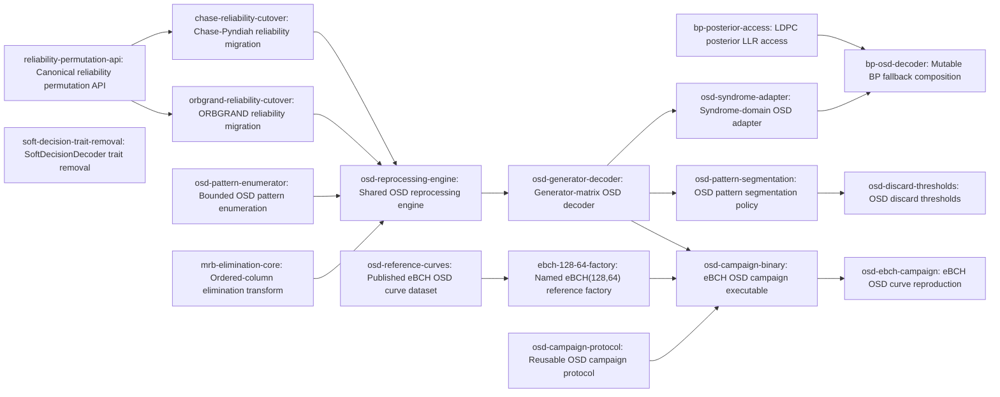

# Plan: Ordered-statistics decoding as the generator-matrix and syndrome soft-decision baseline (b7157be6)

> Planning node: 312200e4. Authoritative graph:
> [breakdown.json](breakdown.json).

## Outcome and criterion approach

| Criterion | Approach | Evidence / open gap |
|---|---|---|
| REQ-01 | Establish ordered $\mathrm{GF}(2)$ elimination with right-hand-side transforms and canonical reliability ordering before a shared MRB engine serves the generator-matrix adapter. | [Investigation: primitive verification](investigation.md#primitive-verification); Fossorier1995 and Yue2022 resolve in the citation registry. The implemented scope is the D-06 generator-matrix baseline. |
| REQ-02 | Pin the published eBCH $(128,64)$ curve and its source-fixed construction constraints, expose a reusable seeded campaign library, bind it through a thin CLI, and compare receipted BER intervals against the pinned published series. | [Investigation: claim classification](investigation.md#claim-classification); [external review, OSD paragraph](../aed96ef9-finite-blocklength-bounds/external-review-2026-08-07.md). The pinned source fixes dimensions and systematic convention; the primitive polynomial is a recorded decision (D-21). |
| REQ-03 | Correct a failed BP hard word through the syndrome equation using posterior reliability magnitudes, then expose mutable BP-first composition with explicit lifecycle results. | [Investigation: BP and syndrome facts](investigation.md#bp-and-syndrome-facts); Roffe2020 resolves in the citation registry. |
| REQ-04 | Layer implementation-produced segmentation and discard policy over the exhaustive baseline while preserving deterministic counter semantics. | [Investigation: convention-convergence inventory](investigation.md#convention-convergence-inventory); Yue2022 resolves in the citation registry. |

## Shared architectural contracts

### `mrb-elimination` [plan-fixed] — Ordered-column elimination with row transform

`gf2-core` accepts a complete column-preference permutation and returns the reduced matrix, selected independent columns in preference order, rank, and invertible applied row transform $\mathbf{U}$ with $\mathbf{R}=\mathbf{U}\mathbf{A}$. The result applies $\mathbf{U}$ to a conforming right-hand side so the transformed system remains equivalent. Rank deficiency is valid and deterministic; nonzero transformed entries aligned with zero reduced rows identify an inconsistent right-hand side outside the reachable row space. Malformed permutations and dimensions return documented errors. The operation contains no coding or LLR policy. See the [dense-matrix findings](investigation.md#dense-matrix-and-generator-primitives).

### `reliability-permutation` [plan-fixed] — Canonical magnitude ordering

The core primitive sorts indices of an `f32` magnitude slice by the total order on magnitude plus original index. Ascending and descending accessors change only magnitude direction and retain ascending original-index ties. Infinite magnitudes order naturally; any NaN causes a documented panic. An `Llr` convenience wrapper delegates through `Llr::magnitude()`, so ORBGRAND, Chase-Pyndiah, and OSD share the convention without sharing an input representation. `Llr::hard_decision` remains the sign-to-bit rule. See `crates/gf2-coding/src/llr.rs:62-91` and the [convergence inventory](investigation.md#convention-convergence-inventory).

### `soft-decision-surface` [plan-fixed] — Canonical decoder traits

`SoftDecoder` remains the immutable soft-input surface for decoders whose call does not mutate algorithm state. `IterativeSoftDecoder` remains the mutable BP-style surface. The zero-implementor and zero-consumer `SoftDecisionDecoder` declaration is absent after cutover, and stateful BP composition does not promise an immutable `SoftDecoder` path. See `crates/gf2-coding/src/traits.rs:242-365` and `crates/gf2-coding/src/ldpc/core.rs:1301-1371`.

### `osd-config` [plan-fixed] — Exhaustive baseline policy

`OsdConfig` fixes order $m$ plus an optional candidate cap. The unchecked conceptual bound is $\sum_{i=0}^{m}\binom{k}{i}$ and the implementation computes it with checked arithmetic. Work metadata includes rank, eliminations, generated patterns, tested candidates, and a termination reason distinguishing exhaustive completion, cap exhaustion, cancellation, and inconsistent transformed input. The default is exhaustive order-$m$ search. Segmentation and discard fields are not part of this contract.

### `osd-syndrome-domain` [plan-fixed] — Failed-word syndrome correction

For parity-check matrix $\mathbf{H}$, failed hard word $\mathbf{y}$, and posterior LLRs $L_i$, the adapter forms $\mathbf{s}=\mathbf{H}\mathbf{y}^{\mathsf T}$ and solves $\mathbf{H}\mathbf{e}^{\mathsf T}=\mathbf{s}$. Elimination prefers columns in ascending posterior magnitude, aligning pivots with the least reliable coordinates; for rank $r$, error patterns enumerate the $n-r$ free coordinates up to order $m$, and each pattern determines $\mathbf{e}$ uniquely by pivot back-substitution. Order 0 is the all-zero free pattern. Candidates rank by the magnitude-only cost $\sum_i e_i|L_i|$ with ties broken deterministically in enumeration order; the adapter returns $\mathbf{y}\oplus\mathbf{e}$ for the lowest-cost valid tested candidate after verifying zero syndrome, which equals the global cost minimum over order-$m$ patterns only in uncapped exhaustive configuration. Ordered elimination applies its row transform to $\mathbf{s}$; rank-deficient consistent systems remain searchable, while a transformed syndrome outside the reachable row space returns an explicit inconsistent termination with no corrected word. Dimension and NaN behavior are documented.

### `posterior-llr-access` [plan-fixed] — Read-only BP posterior surface

`LdpcDecoder::posterior_llrs(&self) -> &[Llr]` returns one current belief per variable. After mutable iterative decoding it is the posterior used for the latest successful or failed hard word, including a syndrome failure passed to post-processing. Before decoding and after `reset` it reflects the documented initialized state. The accessor exposes no mutable decoder internals. See the [BP findings](investigation.md#bp-and-syndrome-facts).

### `ebch-reference` [implementation-produced] — Published-source eBCH identity

The reference-data producer records every construction constraint the pinned published source fixes — dimensions, minimum distance, and per-block systematic convention — and states that primitive polynomial and field representation are not source-determined. The factory records its polynomial choice as a campaign decision with no external warrant (published curves are invariant under that permutation-equivalent choice, per D-21). `ExtendedBchCode::ebch_128_64()` consumes the recorded identity.

### `osd-reference-curve` [implementation-produced] — Published curve dataset

The machine-readable dataset identifies the exact pinned-source (Fossorier 1994 dissertation) page, figure, series, source-fixed eBCH constraints, BI-AWGN/BPSK convention, $E_b/N_0$ axis, BER metric, OSD order, the published reprocessing list order — the source's candidate enumeration order, with tie policy recorded as source-undefined and therefore an implementation decision — digitization precision, and Yue2022 cross-check. It records the Fossorier1995 article as closed-access and unverified, and distinguishes source values from the campaign's order-1 control.

### `bp-osd-composition` [implementation-produced] — Mutable BP-first result

The composition owns a mutable BP decode lifecycle consistent with `IterativeSoftDecoder` and returns an inherent result with deciding stage, BP iterations, OSD work, final syndrome status, and termination reason. BP success returns its hard word. BP syndrome failure passes that failed word plus posterior LLRs to `osd-syndrome-domain`; the composition never treats signed LLRs as an error-domain vector and never promises BP through the immutable hard-decision-only `SoftDecoder` implementation. The produced contract fixes pre-decode, repeated-decode, failure, and `reset` state semantics.

### `osd-campaign-receipt` [implementation-produced] — Resumable statistical evidence

The `gf2-sim` library producer defines only OSD-specific cell payload, receipt fields, and orchestration over the canonical mechanisms: persistence composes `gf2_sim::checkpoint` (`CheckpointPayload`, `CheckpointWriter`, `CheckpointReader`), confidence intervals come from `gf2_stats::intervals` with a named method and level, and provenance reuses the campaign schema's existing semantic types; if reuse forces them out of their current module, they move to a shared `gf2-sim` module in the same change, a relocation disclosed as footprint uncertainty on the producing leaf. Stable per-cell identity derives deterministic seeds; receipts carry samples, bit- and block-error counts with the derived BER and BLER, the named intervals for both rates, OSD work, termination, configuration, behavioral identity, and runtime-observed git/toolchain/hardware provenance. The contract pins the reproduction comparison rule before the campaign runs: each matched point's published value lies within the receipt's stated interval, widened by the recorded digitization precision, at the named level. Resume skips completed cells and preserves interrupted, censored, exhausted, or contradictory results. Thin executables only bind domain configuration to this API.

### `osd-complexity-policy` [implementation-produced] — Segmentation and discard semantics

The segmentation producer defines deterministic segment boundaries, policy representation, threshold metric surface, disabled-policy equivalence, and segment/elimination/pattern/candidate counters over the baseline engine. The discard-threshold consumer applies the produced comparisons without changing `OsdConfig`; disabled thresholds preserve exhaustive results and active thresholds are reported as policy-bounded approximation.

## Generated decomposition overview

<!-- jit:breakdown-overview:begin -->
| Key | Title | Type | Outcome | Contracts | Sources | Footprint | Landing | Depends on |
|---|---|---|---|---|---|---|---|---|
| mrb-elimination-core | Ordered-column elimination transform | task | Ordered $\mathrm{GF}(2)$ elimination returns basis metadata plus a reusable row transform. | mrb-elimination | REQ-01, D-02, D-05, D-15, INV-CONVENTIONS, INV-PRIMITIVES, INV-ARCH, EXTREV-OSD | creates 1, touches 2 | osd-core | — |
| reliability-permutation-api | Canonical reliability permutation API | task | The LLR module exposes one index-stable magnitude permutation for soft-decision algorithms. | reliability-permutation | REQ-01, D-07, D-08, D-18, INV-CONVENTIONS, INV-PRIMITIVES | creates 1, touches 1 | reliability-convention | — |
| orbgrand-reliability-cutover | ORBGRAND reliability migration | task | ORBGRAND consumes the canonical reliability permutation with unchanged query semantics. | reliability-permutation | D-07, D-08, D-18, INV-CONVENTIONS, INV-CONSUMERS | touches 1 | reliability-convention | reliability-permutation-api |
| chase-reliability-cutover | Chase-Pyndiah reliability migration | task | Chase-Pyndiah consumes canonical reliability plus hard-decision semantics with unchanged SISO results. | reliability-permutation | D-07, D-08, D-18, INV-CONVENTIONS, INV-CONSUMERS | touches 1 | reliability-convention | reliability-permutation-api |
| soft-decision-trait-removal | SoftDecisionDecoder trait removal | task | `SoftDecisionDecoder` is absent from the canonical decoder trait surface. | soft-decision-surface | D-07, D-18, INV-CONVENTIONS, INV-CONSUMERS | touches 1 | decoder-traits | — |
| osd-pattern-enumerator | Bounded OSD pattern enumeration | task | Bounded OSD enumeration exposes checked caps plus deterministic termination metadata. | osd-config | REQ-01, D-03, D-09, D-16, D-17, INV-CONVENTIONS, INV-PRIORART, EXTREV-OSD | creates 2, touches 1 | osd-engine | — |
| osd-reprocessing-engine | Shared OSD reprocessing engine | task | The reusable OSD engine ranks MRB candidates behind a semantic adapter boundary. | mrb-elimination, reliability-permutation, osd-config | REQ-01, D-02, D-05, D-06, D-09, D-15, D-16, D-18, INV-CLAIMS, INV-PRIORART, INV-PRIMITIVES, INV-ARCH, EXTREV-OSD | creates 1, touches 2 | osd-engine | mrb-elimination-core, osd-pattern-enumerator, orbgrand-reliability-cutover, chase-reliability-cutover |
| osd-generator-decoder | Generator-matrix OSD decoder | task | `GeneratorMatrixAccess` codes expose order-$m$ OSD through `SoftDecoder` with bounded ML conformance. | mrb-elimination, reliability-permutation, osd-config, soft-decision-surface | REQ-01, D-02, D-05, D-06, D-08, D-09, D-14, D-16, INV-CLAIMS, INV-PRIORART, INV-PRIMITIVES, INV-ARCH, EXTREV-OSD | creates 1, touches 1 | osd-engine | osd-reprocessing-engine |
| osd-syndrome-adapter | Syndrome-domain OSD adapter | task | The syndrome adapter returns the lowest-cost valid tested correction of the failed hard word. | mrb-elimination, reliability-permutation, osd-config, osd-syndrome-domain | REQ-03, D-02, D-05, D-09, D-15, D-16, D-20, INV-PRIORART, INV-ARCH, INV-CONSUMERS, EXTREV-OSD | creates 1, touches 1 | osd-engine | osd-generator-decoder |
| bp-posterior-access | LDPC posterior LLR access | task | `LdpcDecoder` exposes its latest posterior belief slice with defined reset semantics. | posterior-llr-access | REQ-03, D-10, D-20, INV-CLAIMS, INV-PRIMITIVES, INV-CONSUMERS | creates 1, touches 1 | bp-osd-integration | — |
| bp-osd-decoder | Mutable BP fallback composition | task | A mutable BP-first surface returns stage-specific fallback results with explicit lifecycle state. | osd-config, osd-syndrome-domain, posterior-llr-access, soft-decision-surface, bp-osd-composition | REQ-03, D-02, D-10, D-16, D-20, INV-CLAIMS, INV-CONSUMERS, EXTREV-OSD | creates 1, touches 1 | bp-osd-integration | osd-syndrome-adapter, bp-posterior-access |
| osd-reference-curves | Published eBCH OSD curve dataset | task | A cited dataset pins the published OSD curve plus the eBCH construction identity. | ebch-reference, osd-reference-curve | REQ-02, D-01, D-03, D-11, D-13, D-17, INV-CLAIMS, INV-PRIORART, EXTREV-OSD | creates 2 | osd-campaign | — |
| ebch-128-64-factory | Named eBCH(128,64) reference factory | task | The named eBCH $(128,64)$ factory matches the published-source construction fixture. | ebch-reference, osd-reference-curve | REQ-02, D-01, D-11, D-17, INV-CLAIMS, INV-PRIMITIVES, EXTREV-OSD | creates 2, touches 1 | osd-campaign | osd-reference-curves |
| osd-campaign-protocol | Reusable OSD campaign protocol | task | `gf2-sim` exposes a reusable seeded campaign protocol with versioned resumable receipts. | osd-campaign-receipt | REQ-02, D-03, D-12, D-13, D-19, INV-CLAIMS, INV-ARCH, INV-CONSUMERS, EXTREV-OSD | creates 2, touches 1, uncertain | osd-campaign | — |
| osd-campaign-binary | eBCH OSD campaign executable | task | A thin `gf2-sim` executable drives the pinned eBCH OSD protocol. | ebch-reference, osd-config, osd-campaign-receipt | REQ-02, D-01, D-03, D-12, D-13, D-19, INV-CLAIMS, INV-ARCH, INV-CONSUMERS, EXTREV-OSD | creates 2, touches 1 | osd-campaign | osd-campaign-protocol, ebch-128-64-factory, osd-generator-decoder |
| osd-ebch-campaign | eBCH OSD curve reproduction | simulation | A committed receipt demonstrates the order-2 curve comparison with stated uncertainty. | osd-reference-curve, osd-campaign-receipt | REQ-02, D-01, D-03, D-13, INV-CLAIMS, INV-PRIORART, EXTREV-OSD | creates 10 | osd-campaign | osd-campaign-binary |
| osd-pattern-segmentation | OSD pattern segmentation policy | task | Segmented OSD search emits deterministic boundaries plus explicit work counters. | osd-config, osd-complexity-policy | REQ-04, D-04, D-09, D-16, D-17, INV-CONVENTIONS, INV-PRIORART | touches 3 | osd-complexity | osd-generator-decoder |
| osd-discard-thresholds | OSD discard thresholds | task | Thresholded OSD search skips segmented candidates under explicit counter semantics. | osd-config, osd-complexity-policy | REQ-04, D-04, D-09, D-16, D-17, INV-CONVENTIONS, INV-PRIORART | touches 1 | osd-complexity | osd-pattern-segmentation |

<!-- jit:breakdown-overview:end -->

## Material risks and owner decisions

| Risk / decision | Resolution and rationale |
|---|---|
| D-01 | Chosen: pinned Fossorier 1994 dissertation series [Fossorier1994] for eBCH $(128,64)$ BI-AWGN/BPSK, BER versus $E_b/N_0$, OSD order 2, order 1 control, cross-checked with Yue2022; rejected: another code family, an unpinned construction, or an invented figure identifier. Amended by D-21. |
| D-02 | Chosen: one MRB elimination and reprocessing engine with generator-codeword and syndrome-error adapters; rejected: independent decoders or an adapter that conflates domains. The syndrome path serves downstream cce5da8c. |
| D-03 | Chosen: seeded, receipted, resumable curve reproduction with uncertainty; rejected: fast-tier statistical assertions. Fast tests cover deterministic semantics. |
| D-04 | Chosen: optional pattern segmentation and discard thresholds at normal priority outside the baseline hard path; rejected: an unbounded optimization study or a hard-criterion blocker. |
| D-05 | Chosen: `gf2-core` owns ordered-column elimination beside `alg::rref`, while `gf2-coding` owns reliability and decoder semantics; rejected: a coding-local eliminator. |
| D-06 | Chosen: “any linear block code” means generic over `GeneratorMatrixAccess`; rejected: convolutional streaming or codes without that surface. |
| D-07 | Chosen: canonical reliability consumers replace their private sorters and Chase-Pyndiah replaces its sign test, while the unused soft-decoder trait is removed; rejected: retained aliases or parallel forms. |
| D-08 | Chosen: the `Llr` module owns stable index ordering over magnitudes through a raw-`f32` primitive plus wrapper; rejected: consumer-private ordering. |
| D-09 | Chosen: OSD owns bounded Hamming-weight enumeration through $m$ with cap and cancellation metadata; rejected: forcing GRAND's logistic-weight iterator into mismatched semantics. A third budgeted-enumeration family triggers shared-contract extraction. |
| D-10 | Chosen: public posterior LLR access and BP-first composition retain stage, iteration, candidate, syndrome, and termination metadata; rejected: channel-only fallback or generic-result metadata loss. |
| D-11 | Chosen: a named eBCH $(128,64)$ factory plus canonical fixture consumes the published-source identity; rejected: ad hoc campaign-only construction. |
| D-12 | Chosen: a dedicated `gf2-sim` campaign executable follows checkpoint and provenance conventions; rejected: extending the gf2-coding `sim_runner` registry. |
| D-13 | Chosen: committed JSON plus README provenance carries per-point counts and binomial intervals emitted under the campaign contract; rejected: hand-authored or unreceipted claims. |
| D-14 | Chosen: rename the container and its bracket nodes to the generator-matrix and syndrome baseline framing, following the external review; the plan title mirrors the renamed epic and D-06 fixes the matching scope. Rejected: retaining the earlier title, which two independent reviews flagged as overclaiming. |
| D-15 | Chosen: ordered-column elimination returns its row transform for identical right-hand-side transformation, with rank-deficient and inconsistent-syndrome behavior; rejected: transform-free elimination that forces a private solver. |
| D-16 | Chosen: the enumerator creates `osd/mod.rs` and `patterns.rs`; subsequent engine, generator, syndrome, and BP leaves create one submodule each and touch `mod.rs` only for wiring. The generator-to-syndrome edge serializes the landing surface and carries no semantic dependency. Complexity leaves touch engine/pattern files, plus `mod.rs` only for additive re-export wiring of their public policy surface; rejected: parallel shared-file writers or a separate integration leaf. |
| D-17 | Chosen: published-source work produces `ebch-reference`, baseline `osd-config` contains only order, optional cap, checked bound, counters, termination, and exhaustive default, and segmentation produces `osd-complexity-policy`; rejected: plan-fixed empirical identity or optional complexity fields in the baseline config. |
| D-18 | Chosen: one total reliability order supports ascending and descending access, stable index ties, natural infinities, and NaN panic; ORBGRAND and Chase-Pyndiah migrate separately before OSD, while trait removal is independent. Rejected: a finite-only contract or mixed cutover leaf. |
| D-19 | Chosen: a reusable `gf2-sim` protocol library owns schemas, seeding, intervals, resumability, and provenance while a thin executable binds the eBCH campaign; rejected: schema logic inside the CLI. |
| D-20 | Chosen: BP+OSD exposes mutable decoding with an inherent result, consumes the failed hard word plus posterior LLRs, solves $\mathbf{H}\mathbf{e}^{\mathsf T}=\mathbf{H}\mathbf{y}^{\mathsf T}$ by magnitude cost, and defines reset lifecycle; rejected: signed-LLR error input or immutable BP composition. |
| D-21 | Owner-approved amendment (2026-08-24): the Fossorier1995 article is closed-access and unobtainable, so the open Fossorier 1994 dissertation (same author, algorithm, code, channel; sha256-pinned) is the authoritative source pin; the published metric is BER, so the campaign compares receipted BER intervals (BLER recorded alongside); the source fixes no primitive polynomial, so construction identity is a recorded campaign decision in the factory. Rejected: retaining the unmeetable article pin, or a BLER-only comparison with no published counterpart. |
| RISK-01: Published-curve digitization fidelity | Pin the exact source series, method, precision, construction, and discrepancies before code or campaign consumers proceed. |
| RISK-02: Posterior API exposes mutable internals | Return a read-only slice with explicit pre-decode and reset semantics, and verify it matches the latest hard word. |
| RISK-03: Core elimination becomes OSD-specific | Require a complete ordered column permutation, generic $\mathrm{GF}(2)$ result fields, reusable right-hand-side transformation, and no LLR types. |
| RISK-04: Shared landing files conflict | Dependency chains serialize each writer set: `mod.rs` follows enumerator → engine → generator → syndrome → BP; `engine.rs` follows engine → generator → segmentation → discard; `patterns.rs` follows enumerator → engine → generator → segmentation. Landing groups remain integration metadata, and the generator-to-syndrome edge is landing-surface serialization. |

## Investigation sources

- [Investigation](investigation.md) — grounding, exhaustive consumers, and file inventories remain there.
- [External review](../aed96ef9-finite-blocklength-bounds/external-review-2026-08-07.md) — the OSD paragraph supplies the shared-engine, bounded-search, pinned-reference, and receipted-campaign constraints.

### Source identifier universe

Every `planning.source_refs` identifier in [breakdown.json](breakdown.json) resolves here:

- `REQ-01`…`REQ-04` — the container's success criteria on epic b7157be6.
- `D-01`…`D-20` — the rows of the decisions table above.
- `INV-CLAIMS`, `INV-CONVENTIONS`, `INV-PRIORART`, `INV-PRIMITIVES`, `INV-ARCH`, `INV-CONSUMERS` — the [investigation](investigation.md) sections "Claim classification", "Convention-convergence inventory", "Prior art", "Primitive verification", "Architecture fit", and "Consumers and integration points".
- `EXTREV-OSD` — the OSD paragraph of the [external review](../aed96ef9-finite-blocklength-bounds/external-review-2026-08-07.md).
