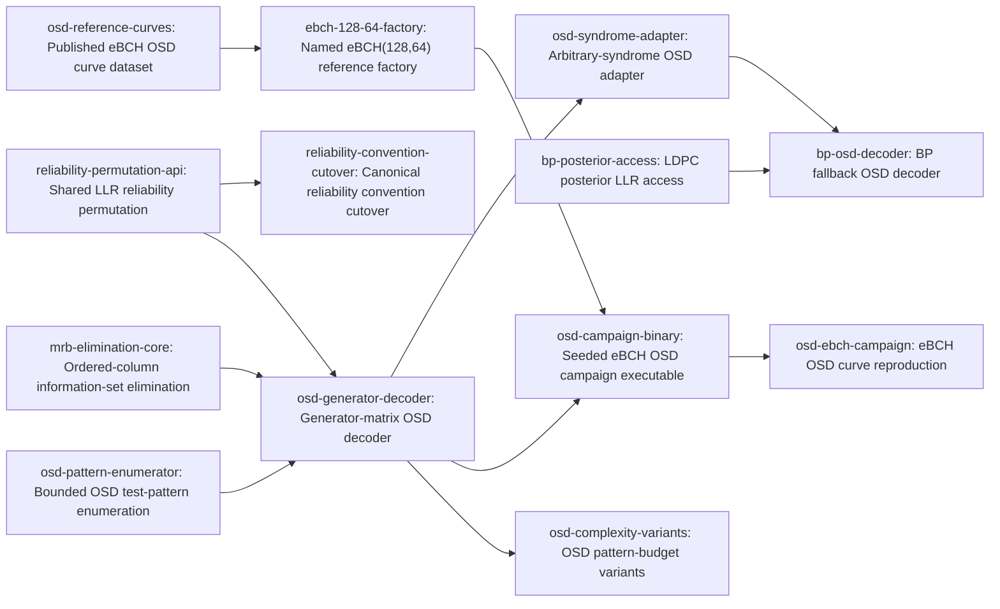

# Plan: Ordered-statistics decoding as the universal soft-decision baseline (b7157be6)

> Planning node: 312200e4. Authoritative graph:
> [breakdown.json](breakdown.json).

## Outcome and criterion approach

| Criterion | Approach | Evidence / open gap |
|---|---|---|
| REQ-01 | Compose core ordered-column elimination, canonical LLR reliability, bounded Hamming-weight patterns, and separate generator-domain OSD behind `GeneratorMatrixAccess` and `SoftDecoder`. | [Investigation: primitive verification](investigation.md#primitive-verification); Fossorier1995 and Yue2022 resolve in the [citation registry](../../../.jit/references.toml). |
| REQ-02 | Pin the exact published eBCH $(128,64)$ target before adding its named factory, then run a seeded resumable BI-AWGN/BPSK order-2 campaign with order 1 as control and compare BLER confidence intervals. | [Investigation: BCH and campaign findings](investigation.md#claim-classification); [external review, OSD paragraph](../aed96ef9-finite-blocklength-bounds/external-review-2026-08-07.md). The exact published figure remains an output of the reference-data task. |
| REQ-03 | Reuse the OSD engine through an arbitrary-syndrome parity-check adapter, expose final BP posterior LLRs, and compose BP-first fallback with stage-specific metadata and a bounded LDPC test. | [Investigation: BP and syndrome facts](investigation.md#bp-and-syndrome-facts); Roffe2020 resolves in the [citation registry](../../../.jit/references.toml). |
| REQ-04 | Add optional pattern segmentation and discarding thresholds over the engine budget model, with deterministic elimination and pattern counters. | [Investigation: convention-convergence analysis](investigation.md#convention-convergence-inventory); Yue2022 resolves in the [citation registry](../../../.jit/references.toml). |

## Shared architectural contracts

### `mrb-elimination` [plan-fixed] — Ordered-column information-set elimination

`gf2-core` exposes `rref_with_column_order(matrix: &BitMatrix, column_order: &[usize]) -> Result<OrderedRrefResult, OrderedRrefError>`. `column_order` is a complete permutation of matrix columns from most to least preferred; the result contains `reduced: BitMatrix`, `information_set: Vec<usize>` in selection order, and `rank: usize`. The operation rejects duplicate, missing, or out-of-range columns and carries no coding or LLR policy. This fixes the extension point identified in the [investigation](investigation.md#dense-matrix-and-generator-primitives).

### `reliability-permutation` [plan-fixed] — Canonical finite-LLR ordering

`reliability_permutation(llrs: &[Llr]) -> Vec<usize>` requires finite inputs, documents its non-finite panic, returns indices in ascending $|\mathrm{LLR}|$, and breaks equal magnitudes by original index. `Llr::hard_decision` remains the sole sign-to-bit rule. OSD, ORBGRAND, and Chase-Pyndiah consume this API.

### `osd-config` [plan-fixed] — Bounded OSD policy and work metadata

`OsdConfig` fixes order $m$, an optional candidate budget, and optional segmentation and discard policies. The engine computes the checked cap $\sum_{i=0}^{m} \binom{k}{i}$ and reports rank, eliminations, generated/tested/discarded patterns, candidates, and an `OsdTermination` reason that distinguishes completion, budget exhaustion, and cancellation. Default policy performs exhaustive order-$m$ search within the configured budget.

### `posterior-llr-access` [plan-fixed] — Read-only BP posterior surface

`LdpcDecoder::posterior_llrs(&self) -> &[Llr]` returns a length-$n$ read-only view of current beliefs. After either iterative decode surface it is exactly the posterior used for the returned hard decision; before first decode and after reset it reflects the documented zero-initialized state.

### `ebch-reference` [plan-fixed] — Named eBCH $(128,64)$ identity

`ExtendedBchCode::ebch_128_64() -> Self` follows the existing named-constructor family. Its primitive polynomial and systematic generator/parity-check identity come from the pinned reference data and a committed canonical fixture; the public constructor always returns $n=128$ and $k=64$.

### `osd-reference-curve` [implementation-produced] — Published curve dataset

The machine-readable dataset identifies the exact Fossorier1995 page, figure, series, eBCH construction, BI-AWGN/BPSK convention, $E_b/N_0$ axis, BLER metric, OSD order, digitization precision, and Yue2022 cross-check. It distinguishes source values from the campaign's order-1 control.

### `bp-osd-composition` [implementation-produced] — BP-first fallback result

The composed decoder implements `SoftDecoder`, runs syndrome-guided OSD only after BP syndrome failure, and exposes a composition-specific result with deciding stage, BP iterations, OSD candidates, final syndrome status, and termination reason. The trait result remains compatible with the existing generic decoder surface.

### `osd-campaign-receipt` [implementation-produced] — Resumable statistical evidence

The `gf2-sim` executable defines versioned checkpoint and JSON receipt schemas with deterministic per-cell seeds, completed-cell identity, sample and error counts, BLER, binomial confidence intervals, OSD work counters, configuration and behavioral identity, and runtime-observed git/toolchain/hardware provenance. Resume skips completed cells and preserves censored or contradictory results.

## Generated decomposition overview

<!-- jit:breakdown-overview:begin -->
| Key | Title | Type | Outcome | Contracts | Sources | Footprint | Landing | Depends on |
|---|---|---|---|---|---|---|---|---|
| mrb-elimination-core | Ordered-column information-set elimination | task | Dense GF(2) elimination selects an information set from an explicit column preference and returns deterministic rank metadata. | mrb-elimination | REQ-01, D-02, D-05, INV-CONVENTIONS, INV-PRIMITIVES, INV-ARCH, EXTREV-OSD | creates 1, touches 2 | osd-core | — |
| reliability-permutation-api | Shared LLR reliability permutation | task | The LLR module exposes one deterministic finite-input reliability permutation for soft-decision decoders. | reliability-permutation | REQ-01, D-07, D-08, INV-CONVENTIONS, INV-PRIMITIVES | creates 1, touches 1 | reliability-convention | — |
| reliability-convention-cutover | Canonical reliability convention cutover | task | ORBGRAND and Chase-Pyndiah consume canonical LLR helpers with no superseded soft-decoder abstraction. | reliability-permutation | REQ-01, D-07, D-08, INV-CONVENTIONS, INV-CONSUMERS | touches 3 | reliability-convention | reliability-permutation-api |
| osd-pattern-enumerator | Bounded OSD test-pattern enumeration | task | OSD enumerates Hamming-weight patterns through order m with checked candidate caps and explicit termination metadata. | osd-config | REQ-01, D-03, D-04, D-09, INV-CONVENTIONS, INV-PRIORART, EXTREV-OSD | creates 3, touches 1 | osd-engine | — |
| osd-reference-curves | Published eBCH OSD curve dataset | task | A cited dataset pins the exact Fossorier1995 eBCH OSD curve and records a Yue2022 cross-check without invented metadata. | osd-reference-curve | REQ-02, D-01, D-03, D-11, D-13, INV-CLAIMS, INV-PRIORART, EXTREV-OSD | creates 2 | osd-campaign | — |
| ebch-128-64-factory | Named eBCH(128,64) reference factory | task | The named eBCH(128,64) factory fixes polynomial and systematic-form identity against a checked fixture. | ebch-reference, osd-reference-curve | REQ-02, D-01, D-11, INV-CLAIMS, INV-PRIMITIVES, EXTREV-OSD | creates 2, touches 1 | osd-campaign | osd-reference-curves |
| osd-generator-decoder | Generator-matrix OSD decoder | task | Order-m OSD implements SoftDecoder for GeneratorMatrixAccess codes with exhaustive-ML equivalence on bounded fixtures. | mrb-elimination, reliability-permutation, osd-config | REQ-01, D-02, D-05, D-06, D-08, D-09, INV-CLAIMS, INV-PRIORART, INV-PRIMITIVES, INV-ARCH, EXTREV-OSD | creates 2, touches 1 | osd-engine | mrb-elimination-core, reliability-permutation-api, osd-pattern-enumerator |
| osd-syndrome-adapter | Arbitrary-syndrome OSD adapter | task | A parity-check-domain adapter reuses the OSD engine to solve arbitrary syndromes with deterministic candidate metadata. | mrb-elimination, reliability-permutation, osd-config | REQ-03, D-02, D-05, D-09, INV-PRIORART, INV-ARCH, INV-CONSUMERS, EXTREV-OSD | creates 2, touches 1 | osd-engine | osd-generator-decoder |
| bp-posterior-access | LDPC posterior LLR access | task | LdpcDecoder exposes the latest posterior belief slice with documented decode-lifecycle semantics. | posterior-llr-access | REQ-03, D-10, INV-CLAIMS, INV-PRIMITIVES, INV-CONSUMERS | creates 1, touches 1 | bp-osd-integration | — |
| bp-osd-decoder | BP fallback OSD decoder | task | The composed SoftDecoder invokes syndrome-guided OSD only after BP failure and reports stage-specific work metadata. | osd-config, posterior-llr-access, bp-osd-composition | REQ-03, D-02, D-10, INV-CLAIMS, INV-CONSUMERS, EXTREV-OSD | creates 2, touches 1 | bp-osd-integration | osd-syndrome-adapter, bp-posterior-access |
| osd-campaign-binary | Seeded eBCH OSD campaign executable | task | The gf2-sim executable emits resumable seeded BLER receipts with binomial intervals and runtime-observed provenance. | ebch-reference, osd-config, osd-campaign-receipt | REQ-02, D-01, D-03, D-12, D-13, INV-CLAIMS, INV-ARCH, INV-CONSUMERS, EXTREV-OSD | creates 2, touches 1 | osd-campaign | ebch-128-64-factory, osd-generator-decoder |
| osd-ebch-campaign | eBCH OSD curve reproduction | simulation | A committed campaign receipt tests order-2 BLER overlap with the pinned Fossorier1995 curve at stated confidence. | osd-reference-curve, osd-campaign-receipt | REQ-02, D-01, D-03, D-13, INV-CLAIMS, INV-PRIORART, EXTREV-OSD | creates 2 | osd-campaign | osd-campaign-binary |
| osd-complexity-variants | OSD pattern-budget variants | task | Segmented pattern search applies configured discard thresholds while reporting elimination and candidate counters. | osd-config | REQ-04, D-04, D-09, INV-CONVENTIONS, INV-PRIORART | creates 2, touches 1 | osd-engine | osd-generator-decoder |

<!-- jit:breakdown-overview:end -->

## Material risks and owner decisions

| Risk / decision | Resolution and rationale |
|---|---|
| D-01 | Chosen: Fossorier1995 eBCH $(128,64)$ BI-AWGN/BPSK BLER versus $E_b/N_0$, OSD order 2, order 1 control, cross-checked with Yue2022; rejected: another code family, an unpinned construction, or an invented figure identifier. |
| D-02 | Chosen: one MRB elimination/reliability engine with generator-codeword and arbitrary-syndrome parity-check adapters; rejected: independent decoders or one adapter that conflates the domains. The parity-check path serves downstream cce5da8c. |
| D-03 | Chosen: seeded, receipted, resumable curve reproduction with uncertainty; rejected: fast-tier statistical assertions. Fast tests cover deterministic semantics only. |
| D-04 | Chosen: bounded pattern segmentation and discarding work at normal priority outside the hard path; rejected: an unbounded optimization study or a hard-criterion blocker. |
| D-05 | Chosen: `gf2-core` owns ordered-column elimination beside `alg::rref`, while `gf2-coding` owns reliability and decoder semantics; rejected: a coding-local eliminator. `mrb-elimination` is plan-fixed. |
| D-06 | Chosen: “any linear block code” means generic over `GeneratorMatrixAccess`; rejected: convolutional streaming or codes without that surface. |
| D-07 | Chosen: the shared reliability landing removes ORBGRAND and Chase-Pyndiah private sorters, Chase's sign test, and the dead `SoftDecisionDecoder` trait in scope; rejected: retained aliases or parallel forms. |
| D-08 | Chosen: the `Llr` module owns ascending-magnitude index ordering with stable index ties and a finite-input contract; rejected: consumer-private or unstable ordering. |
| D-09 | Chosen: OSD owns bounded Hamming-weight enumeration through $m$ with budget and cancellation metadata; rejected: forcing GRAND's logistic-weight iterator into mismatched semantics. Named exception: a third budgeted-enumeration family triggers extraction of a shared budgeted-subset contract. |
| D-10 | Chosen: public posterior LLR access and a BP-first composed `SoftDecoder` with stage, BP-iteration, and OSD-candidate metadata; rejected: channel-only fallback or metadata loss in a generic result. `bp-osd-composition` is implementation-produced. |
| D-11 | Chosen: a named eBCH $(128,64)$ factory plus canonical fixture pins polynomial, dimensions, and systematic form; rejected: ad hoc campaign-only construction. |
| D-12 | Chosen: a dedicated `gf2-sim` campaign executable following current checkpoint and provenance conventions; rejected: extending the legacy `gf2-coding` `sim_runner` registry. |
| D-13 | Chosen: committed JSON plus README provenance with per-point counts and binomial intervals emitted under the campaign contract, reviewed by the research gate; rejected: hand-authored or unreceipted performance claims. |
| RISK-01: Published-curve digitization fidelity | Pin the exact source series, method, precision, and construction before code or campaign consumers proceed; preserve Yue2022 discrepancies explicitly. |
| RISK-02: Posterior API exposes mutable internals | Return a read-only slice with defined before-decode and reset lifecycle semantics; verify it is the state used for the final hard decision. |
| RISK-03: Core elimination becomes OSD-specific | Require a complete ordered column permutation, generic GF(2) result fields, no LLR types, and equivalence to existing RREF semantics. |
| RISK-04: Concurrent `gf2-coding` execution conflicts | Dependency edges serialize shared surfaces, landing groups identify integration clusters, and the execution lead checks active edits before assigning overlapping module/export footprints. |

## Investigation sources

- [Investigation](investigation.md) — grounding, exhaustive consumers, and file inventories remain there.
- [External review](../aed96ef9-finite-blocklength-bounds/external-review-2026-08-07.md) — the OSD paragraph supplies the shared-engine, bounded-search, pinned-reference, and receipted-campaign constraints.
