# Plan: Empirical permanent statistics of random matrices over small prime fields (b8206228)

> Planning node: 912f1008. Authoritative graph:
> [breakdown.json](breakdown.json).

## Outcome and criterion approach

| Criterion | Approach | Evidence / open gap |
|---|---|---|
| REQ-01 | Credited twice, for two different things. The completed feasibility study issue delivers it and carries `satisfies:REQ-01` with a direct epic dependency edge. In-manifest, the preregistration protocol carries the same label for its contribution: it takes the study's campaign design and binds it to one campaign's cell universe, sample sizes, error budget and failure rules, revising it where measurement since has moved. The study's envelope, frontier and unresolved orderings are also cited as design input by the frozen manifest and the backend re-measurement. | `dev/studies/b488f02c/feasibility-study.md` (GO verdict; §4.6 envelope and frontier, §7.2 sampling plan, §4.4 unresolved ordering); `.jit/config.toml` `satisfies` namespace ("the label denotes contribution, not sole delivery"); investigation C13 on the label and edge the external credit depends on. |
| REQ-02 | Split by layer rather than by feature: a narrow crate owns the reproducible sampler, the interval and exact-test estimators, and the pooling accumulator; the simulation crate owns scheduling, checkpointed resume, backend policy, same-matrix determinant evaluation, and the standing acceptance checks. The checkpoint mechanism is generalised at its source rather than copied. | Study §5 G1–G3, G7; investigation C1 (no domain-separated production sampler), C2 (Wilson only, no accumulator), C3 (no permanent campaign runner; the modulation campaign binary is the structural precedent), C9 (the composite loop's module has no tests), §4a (version convergence for `rand_chacha`), §4b (checkpoint mechanism reusable, schema not), C11 (the determinant routine exists and sits below the algebra layer). |
| REQ-03 | Four stages, each with one writer: the layout and manifest schema land before the freeze; three field arms execute only frozen cells and write only their own field's files; a finalizer pools field summaries and checksums the raw data; the analysis pipeline is built and tested against fixtures, then run against the finalized dataset to materialise the published curves and tables; the report carries every interpretive sentence. | Study §7.4 (storage), §7.6 (prior-art delta), §4.6 (envelope and frontier); investigation C4 (no manifest or checksum convention exists; the proposed location conflicts with the declared purpose of `dev/campaigns`); RCA RC1 (interpretive prose in generated receipts) and RC2 (self-hash without build-state guard). |
| REQ-04 | Correctness and rates are separated: the predicate ships with an exhaustive-enumeration oracle and independent brute-force conformance, a companion leaf estimates the observable small-$k$ rates against their known values with a cost receipt, and the re-sited exact anchors validate the sampler and estimator against exactly known zero fractions. | Study §5 G5 (predicate decomposes into square permanents; the theorem's regime is unreachable by sampling); investigation C5 (no rank routine in-tree), C10 (existing anchors live in an issue-scoped area and are archival candidates); RCA RC5 (hard-criterion literalism). |
| REQ-05 | Aspirational: a preregistered likelihood comparison of deviation shapes computed on counts, and a permanent-versus-determinant zero-fraction figure from the same matrices. Both consume the finalized dataset and produce their own artefacts, so neither blocks the hard contract. | Study §7.5 (analysis method, superseded by the campaign protocol — see decisions), §7.4 (REQ-05 is a zero-fraction comparison, distinct from the separate whole-distribution uniformity work); investigation C11. |
| REQ-06 | Aspirational, split so the design is falsifiable: the estimator's proposal, weighting, unbiasedness argument and validation plan are fixed in a design document, a second leaf builds it and demonstrates unbiasedness and interval coverage against exactly known cases, and a final leaf produces the preregistered beyond-reach estimate as its own receipted artefact. | Study §5 G5 part 3 (in-regime estimation is a rare-event follow-up, out of scope for the pipeline check); investigation C5. |

## Shared architectural contracts

### `stream-purpose-namespace` [plan-fixed] — Campaign stream addressing

Matrices are addressed by a 32-byte ChaCha20 seed block of four little-endian
`u64` words — campaign root, $q$, $n$, and a fourth word — as
`dev/studies/b488f02c/feasibility-study.md` §7.3 fixes it, with the fourth word's
encoding pinned here rather than left to the implementer: its **top 8 bits hold
the purpose tag and its low 56 bits hold the stream index**, and derivation
asserts the stream index is below $2^{56}$. The map from
$(\text{root}, q, n, \text{purpose}, \text{stream})$ to seed block is therefore
injective by construction, and purposes cannot collide however long a campaign
runs. Distinct purposes are reserved for validation draws, timing fixtures,
campaign cells, and rare-event draws. Shard $s$ of cell $(q,n)$ uses stream
$\mathrm{base}(q,n) + s$ within its purpose; the draw-to-entry mapping is
$A[k / n][k \bmod n]$, row-major, before any packed constructor reorders it.
Separation is a property of addresses and generator state, never of output
values: two disjoint streams may legitimately draw the same small matrix, so
tests assert distinct derived seed blocks, divergent generator output, and
committed golden vectors. The prototype derivation is
`dev/research/permanent-sampling-feas/src/sampler.rs:97-104`.

### `shard-record-format` [plan-fixed] — Per-shard record schema

One shard record carries its stream address, the matrix count drawn, the
permanent zero count, the histogram of permanent values over the $q$ residue
classes, and the determinant companion expressed as a sample count with a zero
count or as an explicit not-evaluated state — extending the shape the
feasibility harness emits
(`dev/research/permanent-sampling-feas/src/protocol.rs:315-343`) with the
companion quantity. The absent state is load-bearing: a numeric zero would be
indistinguishable from a cell that evaluated every matrix and found none
singular. Records carry counts and states only; estimates, intervals and
verdicts are computed by the acceptance layer and land in summaries. Matrices are never stored: they are regenerable from the
address, so storage stays $O(\text{shards})$ and a whole cell costs tens of
kilobytes. Records carry mechanical provenance only.

### `checkpoint-payload-api` [implementation-produced] — Generic checkpoint payload

The crash-safe write path in `crates/gf2-sim/src/checkpoint/mod.rs` — PID-tagged
temporary file, fsync, rename, directory fsync, blake3 configuration-hash gate,
version-rejecting reader — becomes generic over a serialisable payload and a
configuration-hash provider. Callers supply a payload type and a hash source;
resume against a differing configuration stays a hard error.

### `campaign-dataset-layout` [implementation-produced] — Published dataset schema

The versioned on-disk form of a campaign, rooted at
`dev/simulation_results/permanent-zero-fraction/<campaign-id>/`: root manifest,
per-shard records under `shards/q<q>/n<nn>/`, one summary per field under
`summaries/`, a pooled `summary.csv`, and `checksums.sha256`. Two structural
rules travel with it. **One writer per path**: field-scoped paths are written
only by that field's execution and campaign-scoped paths only by finalization, so
concurrent field executions never write one file. **Raw versus derived**: the
checksum set covers raw data only — manifest, shard records, field summaries,
pooled summary — while reports, figures and fit outputs are derived artefacts
outside it, since a checksum file covering documents that quote it could never be
closed. Records and summaries carry permanent and determinant quantities side by
side, and each cell's recorded terminal state. The manifest schema enumerates
seeds, stream purposes, grid with per-cell $N$, shard identities, per-cell
backend, git revision, toolchain, accelerator runtime, and hardware, satisfying
`@/inv/claims-trace-to-artifacts`, which no existing in-tree convention does.
Source identity and integrity are defined separately, since they are a rule about
the emitting build rather than a shape on disk.

### `workspace-rng-dependency` [implementation-produced] — Converged random-number dependency

`rand_chacha` and `rand_core` are declared once in `[workspace.dependencies]` at
0.9, and every workspace member consumes them through `workspace = true`. Two
consumers are named rather than left divergent. `gf2-kernels-hip` is excluded
from the workspace (`Cargo.toml`, `exclude`) because it needs ROCm to build, so
it has no workspace parent to inherit from and pins the same 0.9 versions
explicitly with the exclusion cited as the reason. `gf2-coding`'s optional
`rand_chacha = "0.3"` belongs to the `rand` 0.8 ecosystem and is a named
exception under `@/inv/convention-convergence`, with the tracked convergence
condition that it migrates when `gf2-coding` moves to `rand` 0.9. The version
choice is forced: `StdRng` carries no cross-version reproducibility guarantee,
so a published dataset seeded through it stops being regenerable after a
dependency bump, while `ChaCha20Rng::from_seed` is stable.

### `dataset-provenance-rule` [implementation-produced] — Source identity and integrity

What makes a published dataset traceable and verifiable. The emitting binary
embeds the revision it was built from; emission requires that revision to equal
`HEAD` and no tracked file to differ outside the active campaign's output
subtree, so expected raw and derived files under the frozen campaign id are
permitted while changed source, build metadata, protocol, or root manifest
refuse. A clean-tree rule cannot be used: the dataset lives in the repository, so
the first shard written would deadlock the second emission. `checksums.sha256`
covers the raw set only, and the root manifest's content hash is taken over a
canonical serialisation with the hash field omitted, or held in a sidecar, so a
reader recomputes it rather than trusting it.

### `acceptance-test-protocol` [implementation-produced] — Preregistered decision rules

The estimand, the fixed sample size per cell, the cell universe and its
multiplicity accounting, the global error budget split across the permanent-floor
family and the determinant family, the exact binomial tests that take every
acceptance decision, the two admissible terminal states of a cell, the
halt-and-preserve rule with its predeclared retry policy, the backend-selection
rule, and the exclusion rules — all fixed before any campaign matrix is drawn.

### `campaign-root-manifest` [implementation-produced] — Frozen campaign instance

The immutable instance of the layout's root manifest for one campaign id: the
complete $(q,n)$ cell universe, $N$ per cell, the multiplicity count, the stream
purpose namespace with each purpose's tag, shard identities, whether the
determinant companion runs at each cell, and the backend selected per cell, bound
to a content hash taken over a canonical serialisation with the hash field
omitted, or kept as a sidecar, so a reader can recompute it and a later
modification is detectable rather than silent.

### `finalized-campaign-dataset` [implementation-produced] — Verified campaign instance

A campaign dataset that has passed finalization: every manifest cell carries a
terminal record, per-shard records agree with the field summaries that pooled
them, the pooled `summary.csv` exists, and `checksums.sha256` verifies over the
raw set. This is the object every analysis, figure and report consumes, so an
analysis can state which dataset checksum it was produced from.

## Generated decomposition overview

<!-- jit:breakdown-overview:begin -->
| Key | Title | Type | Outcome | Contracts | Sources | Footprint | Landing | Depends on |
|---|---|---|---|---|---|---|---|---|
| rng-dependency-migration | Workspace convergence of the rand 0.9 ecosystem | task | rand_chacha/rand_core 0.9 declared once at workspace level, with gf2-sim inheriting and gf2-kernels-hip pinned to match | — | REQ-02, INV-4a | touches 3 | — | — |
| rng-exception-record | Named exception record for the rand 0.8 holdout | task | The gf2-coding rand 0.3 holdout stands as a named, cited exception with a tracked convergence condition | workspace-rng-dependency | INV-4a | touches 2 | — | rng-dependency-migration |
| stats-crate-foundation | Empty gf2-stats workspace member crate | task | An empty gf2-stats workspace member builds with gf2-core as its only in-workspace dependency and its identity stated | workspace-rng-dependency | REQ-02, C1 | creates 3, touches 1 | — | rng-exception-record |
| stats-sampler | Uniform $\mathbb{F}_q$ matrix sampler with domain-separated streams | task | Production ChaCha20 rejection sampler in gf2-stats, addressing matrices by campaign root, field, size, purpose and stream | stream-purpose-namespace, workspace-rng-dependency | REQ-02, G1, C1 | creates 2, touches 2 | — | stats-crate-foundation |
| stats-wilson-interval | Wilson score interval estimator | task | A Wilson score interval estimator checked against an independent computation of its own definition | — | REQ-02, G2, C2 | creates 1, touches 1 | — | stats-sampler |
| stats-clopper-pearson | Clopper-Pearson interval estimator with coverage demonstration | task | A Clopper-Pearson estimator checked by independent inversion, with empirical coverage demonstrated at small counts | — | REQ-02, G2, C2 | touches 1 | — | stats-wilson-interval |
| stats-exact-tests | Preregistered exact binomial tests for campaign cells | task | Exact one-sided floor test and two-sided determinant test with a result interface that stays correct where tails underflow | — | REQ-02, G2, C2 | creates 1, touches 1 | — | stats-clopper-pearson |
| shard-accumulator | Checkpointable streaming shard accumulator | task | Streaming accumulator whose shard commits are atomic, duplicate-rejecting, order-independent when pooled, and exactly replayable after interruption | stream-purpose-namespace, shard-record-format | REQ-02, G2, C2, INV-6 | creates 1, touches 1 | — | stats-exact-tests |
| checkpoint-generalization | Generic checkpoint payload mechanism | task | Simulation checkpoint writer and reader carry any serialisable payload behind a config-hash provider, with resume behaviour unchanged | — | REQ-02, INV-4b, INV-6, C3 | touches 1 | — | — |
| checkpoint-caller-migration | Existing pipeline migrated onto the generic checkpoint | task | The modulation campaign binary runs on the generic checkpoint form with both pinned crash-safety tests unchanged | checkpoint-payload-api | REQ-02, INV-4b | touches 2 | — | checkpoint-generalization |
| dataset-schema | Versioned dataset layout and record schemas | task | Versioned dataset home with a root manifest schema, record schemas, a writer-role partition and a raw-versus-derived boundary | shard-record-format, stream-purpose-namespace | REQ-03, G4, C4, RC1, INV-5 | creates 3, touches 1 | — | — |
| dataset-provenance-integrity | Source identity and integrity for published datasets | task | Build-state guard, a source-identity rule that survives an in-repository dataset, and an integrity file with a recomputable manifest hash | campaign-dataset-layout | REQ-03, G4, C4, RC2, INV-5 | creates 1, touches 2 | — | dataset-schema |
| driver-orchestration | Campaign driver scheduling and shard emission | task | Campaign binary enumerates manifest work items, runs the composite loop, and emits schema-conformant shards deterministically | stream-purpose-namespace, shard-record-format, campaign-dataset-layout, dataset-provenance-rule, workspace-rng-dependency | REQ-02, G3, C3, C9, INV-6 | creates 2, touches 2 | — | shard-accumulator, dataset-provenance-integrity |
| driver-resume-quarantine | Checkpointed resume, determinism, and quarantine for the campaign driver | task | Interrupted campaign runs resume to results identical to uninterrupted ones, with changed configurations refused and failures quarantined | checkpoint-payload-api, campaign-dataset-layout | REQ-02, G3, C9, INV-4b, INV-6 | creates 1, touches 2 | — | driver-orchestration, checkpoint-generalization |
| determinant-integration | Determinant companion evaluated on the campaign's matrices | task | Determinant of each drawn matrix evaluated in the campaign loop, with per-shard and per-cell determinant counts or a not-evaluated state | shard-record-format, campaign-dataset-layout | REQ-02, REQ-03, C11, INV-6 | creates 1, touches 1 | — | driver-resume-quarantine |
| driver-batch-parallel | Batch-parallel processor path for campaign shards | task | A batch-parallel path evaluates a shard's matrices across threads for q in {3,5,7} with input-order results | — | REQ-02, G7, C7, INV-6 | creates 1, touches 1 | — | determinant-integration |
| driver-cpu-backends | Processor backend selection for campaign cells | task | Per-cell backend read from the frozen manifest, with scalar, batch-parallel, intra-matrix and generic Ryser paths reachable | campaign-dataset-layout | REQ-02, G7, G8, C8, INV-6 | creates 1, touches 1 | — | driver-batch-parallel |
| driver-gpu-backend | Accelerator execution for campaign cells | task | Accelerator launches sized from measured cost under an exclusive host lock, halting cleanly where the device is absent | campaign-dataset-layout | REQ-02, G7, G8, C8, INV-6 | creates 1, touches 2 | — | driver-cpu-backends |
| backend-conformance-suite | Shared behavioural conformance suite across campaign backends | task | One standing suite certifies per-matrix agreement of the five campaign backends against the generic reference routine | — | REQ-02, INV-6 | creates 1 | — | driver-gpu-backend |
| acceptance-checks | Standing acceptance tests for campaign cells | task | Per-cell exact binomial floor and determinant tests under one global error budget, halting on failure under a predeclared retry rule | acceptance-test-protocol, campaign-dataset-layout, shard-record-format | REQ-02, INV-6, C11 | creates 1, touches 1 | — | backend-conformance-suite, protocol-draft |
| avx2-batched-impl | Four-matrix batched AVX2 single-word path for $\mathbb{F}_3$ permanents | enhancement | Four matrices per AVX2 register through the batched bipedal type, conforming to the scalar kernel on the shared behavioural suite | — | G6, C6, INV-6 | creates 1, touches 4 | — | — |
| avx2-dispatch-migration | Dispatcher routing and prose sweep for the $\mathbb{F}_3$ permanent path | enhancement | Single-matrix callers routed to the scalar kernel, with same-file rustdoc and assembly artefacts corrected alongside the code | — | G6, C6, RC4, INV-6 | touches 2 | — | avx2-batched-impl |
| avx2-narrative-sweep | Cross-file narrative sweep for the $\mathbb{F}_3$ permanent selection | task | Example headers, benchmark group labels and crate status prose brought into agreement with the new single-matrix selection | — | G6, C6, RC4, INV-6 | touches 6 | — | avx2-dispatch-migration |
| avx2-batched-receipt | Benchmark receipt for the batched $\mathbb{F}_3$ permanent path | task | Committed receipt reporting the batched path's measured per-matrix rate against the scalar and single-matrix AVX2 kernels | — | G6, C6, INV-6 | creates 2, touches 1 | — | avx2-narrative-sweep |
| determinant-calibration | Timing receipt for the determinant companion at campaign sizes | task | Committed receipt timing the finite-field determinant at campaign sizes against measured permanent cost at the same sizes | — | REQ-02, C11, INV-6 | creates 3, touches 1 | — | — |
| backend-remeasurement | Re-measurement of contested backend orderings before the freeze | task | Twelve replicated executions of four named configurations, settling the contested q=3 n=28 ordering and confirming each frontier rate | — | REQ-01, REQ-02, C12, INV-6 | creates 2 | — | — |
| protocol-draft | Scientific preregistration protocol for the campaign | task | Preregistration fixing estimands, cell universe, error budget, backend rule, exclusion rules and validation plan before the first campaign draw | stream-purpose-namespace | REQ-01, REQ-02, REQ-03, REQ-05, RC5, INV-6 | creates 1 | — | — |
| preregistration-freeze | Frozen root manifest for the campaign | task | Immutable root manifest fixing the cell universe, per-cell N, multiplicity, stream purposes, shard identities and backends before the first draw | campaign-dataset-layout, acceptance-test-protocol, stream-purpose-namespace | REQ-01, REQ-03, INV-6, INV-7 | creates 1, uncertain | — | dataset-provenance-integrity, determinant-calibration, backend-remeasurement, protocol-draft |
| rank-predicate | Permanental rank-deficiency predicate with exact validation | task | Permanental rank-deficiency predicate over row submatrices, agreeing with an independent oracle on exhaustive enumeration | — | REQ-04, G5, C5, RC5 | creates 2, touches 1 | — | avx2-batched-impl |
| rank-event-estimation | Observable-event rate estimates for permanental rank deficiency | simulation | Estimated deficiency rates at k=1 and k=2 against their known values, with a measured mean evaluation cost per matrix | stream-purpose-namespace | REQ-04, G5, C5 | creates 2, touches 1 | — | exact-anchors |
| exact-anchors | Exact enumeration anchors for the smallest cells | task | Re-runnable exact zero-fraction enumeration for the smallest cells, with sampler and estimator checked against the exact values | stream-purpose-namespace | REQ-04, C10, INV-7, RC5 | creates 3, touches 2 | — | stats-clopper-pearson, rank-predicate, determinant-calibration |
| arm-q5 | Campaign arm for $q = 5$ | simulation | Executes the frozen q=5 cells to a recorded terminal state each, emitting shard records and this field's summary | campaign-root-manifest, acceptance-test-protocol, campaign-dataset-layout, shard-record-format, stream-purpose-namespace, checkpoint-payload-api | REQ-03, INV-6 | creates 2 | — | preregistration-freeze, acceptance-checks, exact-anchors |
| arm-q7 | Campaign arm for $q = 7$ | simulation | Executes the frozen q=7 cells from the resampled n=20 cell onward, each to a recorded terminal state, with this field's summary | campaign-root-manifest, acceptance-test-protocol, campaign-dataset-layout, shard-record-format, stream-purpose-namespace, checkpoint-payload-api | REQ-03, INV-6 | creates 2 | — | preregistration-freeze, acceptance-checks, exact-anchors |
| arm-q3-reproduction | Campaign arm for $q = 3$ as reproduction | simulation | Executes the frozen q=3 cells as an independent reproduction, each to a recorded terminal state, with published counterparts recorded | campaign-root-manifest, acceptance-test-protocol, campaign-dataset-layout, shard-record-format, stream-purpose-namespace, checkpoint-payload-api | REQ-03, INV-6 | creates 2 | — | preregistration-freeze, acceptance-checks, exact-anchors |
| campaign-finalization | Deterministic finalization of a completed campaign dataset | task | Post-arm finalizer pooling field summaries into the campaign summary and checksumming the raw data set deterministically | campaign-dataset-layout, dataset-provenance-rule, campaign-root-manifest | REQ-03, C4, RC1, INV-6 | creates 3, touches 1 | — | arm-q5, arm-q7, arm-q3-reproduction |
| curve-generation | Curve and table generation pipeline | task | Reusable pipeline turning any published-format dataset into per-cell estimate tables, interval columns, curves and prior-art comparisons | campaign-dataset-layout, shard-record-format | REQ-03, INV-6 | creates 2, touches 1 | — | stats-clopper-pearson, dataset-provenance-integrity |
| curve-materialization | Published zero-fraction curves and tables for the three fields | task | Curve and table artifacts for q=3, q=5 and q=7 materialized from the finalized dataset by the analysis pipeline | finalized-campaign-dataset, campaign-dataset-layout | REQ-03, INV-6 | creates 2 | — | campaign-finalization, curve-generation |
| interpretive-report | Analysis report on the measured zero-fraction curves | task | Report assessing the measured curves against the proved floor at the measured sizes, published beside the dataset with conditional novelty claims | finalized-campaign-dataset, campaign-root-manifest, acceptance-test-protocol | REQ-03, C12, INV-6 | creates 1 | — | curve-materialization |
| model-fit | Convergence-shape model comparison for the deviation term | task | Preregistered likelihood comparison of geometric against polynomial deviation shapes on observed counts, standing as its own artefact | finalized-campaign-dataset, acceptance-test-protocol | REQ-05, INV-6 | creates 2 | — | campaign-finalization |
| perm-det-figure | Permanental against determinantal zero-fraction comparison figure | task | Figure comparing measured permanent and determinant zero fractions from the same matrices, with exact finite-size values overlaid | finalized-campaign-dataset, campaign-dataset-layout | REQ-05, C11 | creates 1, touches 1 | — | curve-materialization |
| rare-event-design | Preregistered rare-event estimator design | task | Estimator design fixing proposal distribution, weighting, unbiasedness argument and validation plan before any estimator code exists | campaign-root-manifest, acceptance-test-protocol, stream-purpose-namespace | REQ-06, G5 | creates 1 | — | preregistration-freeze, rank-predicate |
| rare-event-validation | Rare-event estimator with demonstrated unbiasedness and coverage | task | Estimator built to the preregistered design, with unbiasedness and interval coverage shown against exactly known cases | stream-purpose-namespace, campaign-root-manifest | REQ-06, C5 | creates 1, touches 1 | — | rare-event-design, campaign-finalization |
| rare-event-estimate | Preregistered rare-event estimate beyond direct sampling | task | One receipted estimate at the preregistered beyond-reach target, with variance and effective sample size, or a recorded unusable outcome | stream-purpose-namespace, campaign-root-manifest | REQ-06, C5 | creates 1 | — | rare-event-validation |

```mermaid
flowchart LR
    N0["rng-dependency-migration: Workspace convergence of the rand 0.9 ecosystem"]
    N1["rng-exception-record: Named exception record for the rand 0.8 holdout"]
    N2["stats-crate-foundation: Empty gf2-stats workspace member crate"]
    N3["stats-sampler: Uniform $\mathbb{F}_q$ matrix sampler with domain-separated streams"]
    N4["stats-wilson-interval: Wilson score interval estimator"]
    N5["stats-clopper-pearson: Clopper-Pearson interval estimator with coverage demonstration"]
    N6["stats-exact-tests: Preregistered exact binomial tests for campaign cells"]
    N7["shard-accumulator: Checkpointable streaming shard accumulator"]
    N8["checkpoint-generalization: Generic checkpoint payload mechanism"]
    N9["checkpoint-caller-migration: Existing pipeline migrated onto the generic checkpoint"]
    N10["dataset-schema: Versioned dataset layout and record schemas"]
    N11["dataset-provenance-integrity: Source identity and integrity for published datasets"]
    N12["driver-orchestration: Campaign driver scheduling and shard emission"]
    N13["driver-resume-quarantine: Checkpointed resume, determinism, and quarantine for the campaign driver"]
    N14["determinant-integration: Determinant companion evaluated on the campaign's matrices"]
    N15["driver-batch-parallel: Batch-parallel processor path for campaign shards"]
    N16["driver-cpu-backends: Processor backend selection for campaign cells"]
    N17["driver-gpu-backend: Accelerator execution for campaign cells"]
    N18["backend-conformance-suite: Shared behavioural conformance suite across campaign backends"]
    N19["acceptance-checks: Standing acceptance tests for campaign cells"]
    N20["avx2-batched-impl: Four-matrix batched AVX2 single-word path for $\mathbb{F}_3$ permanents"]
    N21["avx2-dispatch-migration: Dispatcher routing and prose sweep for the $\mathbb{F}_3$ permanent path"]
    N22["avx2-narrative-sweep: Cross-file narrative sweep for the $\mathbb{F}_3$ permanent selection"]
    N23["avx2-batched-receipt: Benchmark receipt for the batched $\mathbb{F}_3$ permanent path"]
    N24["determinant-calibration: Timing receipt for the determinant companion at campaign sizes"]
    N25["backend-remeasurement: Re-measurement of contested backend orderings before the freeze"]
    N26["protocol-draft: Scientific preregistration protocol for the campaign"]
    N27["preregistration-freeze: Frozen root manifest for the campaign"]
    N28["rank-predicate: Permanental rank-deficiency predicate with exact validation"]
    N29["rank-event-estimation: Observable-event rate estimates for permanental rank deficiency"]
    N30["exact-anchors: Exact enumeration anchors for the smallest cells"]
    N31["arm-q5: Campaign arm for $q = 5$"]
    N32["arm-q7: Campaign arm for $q = 7$"]
    N33["arm-q3-reproduction: Campaign arm for $q = 3$ as reproduction"]
    N34["campaign-finalization: Deterministic finalization of a completed campaign dataset"]
    N35["curve-generation: Curve and table generation pipeline"]
    N36["curve-materialization: Published zero-fraction curves and tables for the three fields"]
    N37["interpretive-report: Analysis report on the measured zero-fraction curves"]
    N38["model-fit: Convergence-shape model comparison for the deviation term"]
    N39["perm-det-figure: Permanental against determinantal zero-fraction comparison figure"]
    N40["rare-event-design: Preregistered rare-event estimator design"]
    N41["rare-event-validation: Rare-event estimator with demonstrated unbiasedness and coverage"]
    N42["rare-event-estimate: Preregistered rare-event estimate beyond direct sampling"]
    N0 --> N1
    N1 --> N2
    N2 --> N3
    N3 --> N4
    N4 --> N5
    N5 --> N6
    N6 --> N7
    N8 --> N9
    N10 --> N11
    N7 --> N12
    N11 --> N12
    N12 --> N13
    N8 --> N13
    N13 --> N14
    N14 --> N15
    N15 --> N16
    N16 --> N17
    N17 --> N18
    N18 --> N19
    N26 --> N19
    N20 --> N21
    N21 --> N22
    N22 --> N23
    N11 --> N27
    N24 --> N27
    N25 --> N27
    N26 --> N27
    N20 --> N28
    N30 --> N29
    N5 --> N30
    N28 --> N30
    N24 --> N30
    N27 --> N31
    N19 --> N31
    N30 --> N31
    N27 --> N32
    N19 --> N32
    N30 --> N32
    N27 --> N33
    N19 --> N33
    N30 --> N33
    N31 --> N34
    N32 --> N34
    N33 --> N34
    N5 --> N35
    N11 --> N35
    N34 --> N36
    N35 --> N36
    N36 --> N37
    N34 --> N38
    N36 --> N39
    N27 --> N40
    N28 --> N40
    N40 --> N41
    N34 --> N41
    N41 --> N42
```

<!-- jit:breakdown-overview:end -->

## Material risks and owner decisions

Standing decisions in force for this epic. Each row states what holds and why;
where a decision supersedes the design SSOT, both the superseding rule and the
superseded text are named, since the study's record stands unedited.

| Risk / decision | Resolution and rationale |
|---|---|
| REQ-01's two halves | The feasibility study issue delivers REQ-01 and carries the credit: `satisfies:REQ-01` plus a direct dependency edge from the epic. Its campaign-design half is then carried forward in-manifest by the preregistration protocol, which also carries `satisfies:REQ-01` under the repository's contribution semantics — the `satisfies` namespace records contribution, not sole delivery. A design that fixed an envelope is not finished until it binds a specific campaign's cell universe, sample sizes, error budget and failure rules, and until it is revised where measurement since has moved. |
| Backend re-measurement has a fixed universe | Four configurations and no others: the unresolved $q{=}3$, $n{=}28$ pair (accelerator at $M{=}1024$ against intra-matrix rayon), and each field's frontier selection — $(q{=}5, n{=}24)$ on batch rayon and $(q{=}7, n{=}20)$ on the accelerator at $M{=}1024$. Those frontier rates are what every per-cell sample size was derived from. Twelve interleaved executions per configuration: the recorded worst-case cross-execution disagreement of $1.80\%$ implies a per-execution standard deviation near $1.27\%$, so twelve puts the standard error of a difference of means near $0.52\%$ and the contested $1.6\%$ gap about three standard errors out. Interleaving rather than blocking keeps thermal drift from being confounded with the configuration. Configurations outside the list are out of scope: a backend enters the selectable set only once a committed measurement covers it at the cells where it would be chosen, which for accelerator configurations retained by the separate accelerator study means that study's receipts. Every backend named in the frozen table therefore has a committed measurement at the cells where it is chosen. |
| Prose sweeps split by locality, not by topic | Rustdoc inside a file a change edits moves with that change, because a reader must never find a comment contradicting the code beside it. Prose in other files — example headers, benchmark group labels, crate status text — is a separate sweep with a different file set and a different reviewer. Both are required by `@/inv/single-source-prose`; splitting them by locality keeps each change reviewable without weakening either. |
| Sampler and statistics placement | A new narrow workspace crate `gf2-stats` depending only on `gf2-core`. The `rand_chacha` promotion to `[workspace.dependencies]` at 0.9 per `@/inv/convention-convergence` — three `rand_chacha` majors and two `rand` majors coexist in-tree today — lands in a prerequisite migration leaf — `gf2-sim`'s direct pins replaced by workspace references, `gf2-kernels-hip` pinned explicitly because the workspace excludes it and it cannot inherit — with the named-exception record (`gf2-coding`'s optional 0.3 pin, tracked to migrate when that crate moves to `rand` 0.9, per `@/inv/convention-convergence`) and the empty crate foundation as separate atomic leaves behind it, so the sampler leaf implements one module against a settled dependency ground. Rejected: `gf2-core`, where Wilson and Clopper-Pearson estimators have no home; `gf2-algebra`, where a statistics layer strains the crate's stated identity. |
| Driver placement and checkpointing | The campaign driver is a binary in `gf2-sim` beside `dvb_t2_awgn_campaign.rs`, taking the inward `gf2-sim → gf2-algebra` edge that `@/inv/crate-dependency-direction` permits; the campaign's accelerator reach requires `gf2-sim`'s `hip` feature to forward to `gf2-algebra/hip`, which it does not today, and the accelerator leaf owns that wiring. The checkpoint writer and reader are generalised over a serialisable payload at their source rather than copied, with the existing caller migrated behind the generic foundation as its own leaf. Rejected: a named exception for a second implementation, which the invariant permits but which buys nothing. The study's G3 argument is narrowed to the campaign *schema*, which is genuinely a distinct abstraction. |
| Dataset location | `dev/simulation_results/permanent-zero-fraction/<campaign-id>/`, diverging from study §7.4's `dev/campaigns/...`. Both are declared permanent areas, but `dev/index.md:42` classifies `dev/campaigns` as campaign *definitions* and `dev/index.md:46` classifies `dev/simulation_results` as campaign *outputs*; `dev/campaigns` holds only configuration files and nothing writes into it. The divergence is restated in the dataset-schema issue body. |
| Batched AVX2 $\mathbb{F}_3$ path is built here | The four-matrix batched single-word path the rustdoc promises is delivered in this epic, not deferred: `Bipedal3x4 = BatchedBipedalLike<Config3>` exists at `crates/gf2-kernels-simd/src/bipedal/bipedal3.rs:183` and nothing evaluates four permanents through it. The unsafe batched kernel lands in the kernel crate beside the existing AVX2 permanent kernel per `@/inv/unsafe-kernel-isolation`; the algebra crate adds only the safe entry point and glue. It lands as four leaves, and this decision fixes their shape: the batched path with its conformance suite; the dispatcher routing, which binds the same-file rustdoc correction and the sibling assembly regeneration to the code change because `@/inv/single-source-prose` and the `asm-artefact-present` gate require them in the same change, and which publishes no benchmark; the narrative sweep owning every cross-file prose and benchmark-label correction; and the committed rate receipt owning all benchmark publication. Implementation, selection, documentation and measurement are separately testable, and no leaf carries another's deliverable class beyond what the named invariant and gate force into it. |
| The batched path is not a campaign backend candidate | No edge runs from the arms or the freeze to it. It helps where one bipedal word suffices, and at those sizes composite throughput is dominated by drawing and packing rather than the kernel (study §4.4: composite falls to about half of eval-only at $q{=}3$, $n{=}12$), while the frontier cells go to intra-matrix rayon and the accelerator. Gating the freeze on a new kernel would buy schedule risk for no measured gain. |
| Rank predicate placement | `gf2-algebra`, which owns permanent algorithms, rather than the campaign driver as study §5 G5 suggests: the predicate is a permanent algorithm over existing square kernels and carries no statistical machinery. The anchor and rank-rate validations do drive the production sampler and estimators inside algebra-crate tests, so the algebra crate takes a dev-only dependency on `gf2-stats` — no production edge, preserving `@/inv/crate-dependency-direction` — owned by the exact-anchors leaf. |
| Determinant companion: counts here, verdicts there | The evaluation leaf produces determinant sample counts, zero counts, and an explicit not-evaluated state, and nothing more; estimates, intervals and exact-test verdicts belong to the acceptance layer, which depends on it. One code path turns counts into decisions. The not-evaluated state is required rather than optional: a numeric zero for a cell that ran without the companion is indistinguishable from a cell that evaluated its matrices and found none singular, and would silently enter any pooled estimate. |
| The companion runs on the same matrices | The determinant is evaluated inside the composite loop on the identical drawn entries, not on an independent sample. An independently drawn companion would test a different pipeline than the one producing the published permanent counts, leaving the shared draw, pack and address path — where this problem family's recorded defects occurred — unchecked. |
| Dataset lifecycle and checksum boundary | Each field execution writes only its own shard paths and field summary; a finalizer is the sole writer of campaign-scoped paths and refuses a dataset with any cell in no terminal state. `checksums.sha256` covers raw data only — manifest, shard records, field summaries, pooled summary — while reports, figures and fit outputs are derived and outside it, since a checksum file covering documents that quote it could never close. |
| Source identity at emission | The emitting binary's embedded revision must equal `HEAD`, and no tracked file may differ outside the active campaign's output subtree; expected raw and derived files under the frozen campaign id are permitted, while changed source, build or dependency manifest, protocol, or root manifest refuses. A clean-tree rule would deadlock, since the dataset lives in the repository and the first shard dirties the tree. The root manifest's content hash is taken over a canonical serialisation omitting the hash field, or held in a sidecar, so a reader can recompute it. |
| Analysis tooling separates from published artefacts | The curve and table pipeline is fixture-tested with no dependency on any arm; a materialisation leaf runs it against the finalized dataset and commits the per-field curve and table artefacts that REQ-03 asks for. A pipeline that could produce curves is not a curve, and the report depends on the materialised artefacts rather than on the tooling. |
| Stream address encoding | The fourth seed word carries the purpose tag in its top 8 bits and the stream index in its low 56 bits, with the bound asserted at derivation, so the address map is injective by construction; golden derivation vectors are committed. Separation is asserted at the address, seed and generator-state level and never as "two streams share no matrix" — at $q{=}3$, $n{=}2$ there are only $81$ matrices, so collisions are expected and testing for their absence would assert something false. |
| Estimator correctness contracts | Each interval estimator is validated against an independent computation of its own definition — Clopper-Pearson additionally by an empirical coverage check — never against containing the other, which follows from construction and evidences nothing. The two estimators are separate leaves in one module, Wilson then Clopper-Pearson, because each is independently testable. |
| One global error budget across both test families | The family-wise $\alpha$ is allocated *across* the permanent-floor family and the determinant family — for example $0.025$ each — rather than spending a separate $5\%$ budget on each. This supersedes study §7.2 and §6, which read as two independent families and so understate total false-alarm exposure; the study text stands unedited per `@/inv/falsification-preserved` and the campaign protocol governs. |
| Acceptance decisions are exact, not normal-approximation | Decisions use exact binomial tests: one-sided against the composite null $\Pr[\mathrm{per}=0] \ge 1/q$ evaluated at $p = 1/q$, and two-sided against the exactly known $1 - \prod_{i=1}^{n}(1-q^{-i})$. The critical values $z = 3.16$ and $z = 3.36$ from study §7.2 and §6 remain valid for sizing and appear nowhere in a decision path. The exact tests report on a log scale or as a threshold comparison, because an exact tail at $N = 2 \times 10^{7}$ legitimately underflows double precision and a plain probability would flush to zero indistinguishably from a real disagreement. |
| Retry after a halt is predeclared | Rerunning a halted cell until it passes spends the error budget silently. The protocol fixes what may be rerun, how many attempts are permitted, and how a rerun charges the budget; the driver refuses a rerun outside that rule, and halted cells stay in the dataset with their pooled counts and halt reason but no completed estimate or verdict. |
| Convergence-shape comparison is a likelihood on counts | The model comparison is computed from the observed zero counts under their binomial sampling distribution, not by weighted least squares on $\hat p$ compared by AIC. This supersedes study §7.5, whose text stands. The comparison produces its own artefact and the hard report never waits on it, since an aspirational result cannot block a hard one. |
| A cell has two terminal states | Executed at its preregistered $N$ with a verdict recorded, or halted under the predeclared rule with the halt and cause recorded. A cell in neither state satisfies no criterion, so a campaign cannot be closed by omission, while a campaign that halts under its own rule closes honestly as a recorded falsification. Halting a cell whose manifest names an unavailable backend is the explicit-failure arm of `@/inv/accelerator-safe-fallback`, not a breach: the invariant's tested-safe-fallback rule governs library capability dispatch, which the campaign does not change, and a substituted backend would corrupt the frozen selection the dataset records. |
| REQ-04 separates correctness from rates | The predicate leaf delivers the production predicate, the exhaustive-enumeration oracle and cross-implementation conformance; a companion simulation leaf delivers the small-$k$ event-rate estimates and the measured mean evaluation cost. Both credit REQ-04. The aspirational rare-event work splits the same way: a preregistered design, then an implementation whose unbiasedness and coverage are demonstrated against it, then a receipted estimate artefact. |
| Accelerator-contingent cells are predeclared | The cell universe covers the core processor-feasible grid *and* any accelerator-contingent extension cells, either inside the multiplicity accounting or in an explicitly gatekept second family whose entry condition is fixed before any draw. Cells discovered after the freeze require a restated adjustment under a new campaign id, per study §7.2. |
| Backend measurement scope | The in-tree re-measurement leaf measures exactly four named configurations — $(q{=}3, n{=}28)$ on the accelerator at $M{=}1024$ and on intra-matrix rayon, $(q{=}5, n{=}24)$ on batch rayon, $(q{=}7, n{=}20)$ on the accelerator at $M{=}1024$ — and its receipt names that set; configurations outside the list are out of scope, and a backend enters the selectable set only once a committed measurement covers it at the cells where it would be chosen, which for accelerator configurations retained by the separate accelerator study means that study's receipts. Either way, every backend named in the frozen table has a committed measurement at the cells where it is chosen. |
| Landing order on shared files | Where two leaves would edit one file, the graph orders them rather than leaving concurrent writers. The workspace converges the RNG dependency first, the exception record follows it, and the crate foundation follows the record, so the three writers of the root manifest land in one ordered chain; the statistics crate then registers sampler, then the Wilson interval, then Clopper-Pearson, then exact tests, then accumulator; the driver's scheduler takes orchestration, then resume-and-quarantine, then determinant evaluation, then the batch-parallel path, then processor backend selection, then the accelerator, then the shared conformance suite, which the acceptance layer and every campaign arm sit behind; the algebra permanent module takes the batched AVX2 path, then the rank predicate, then the exact anchors, then the rank-event estimates; the AVX2 chain runs implementation, dispatcher, narrative sweep, receipt, so the receipt measures through benchmark groups that are already correctly labelled; the three writers of the algebra crate manifest land in order — determinant cost receipt, exact anchors, rank-event estimates; the checkpoint mechanism generalises first and its one existing caller migrates behind it; and rare-event validation follows finalization, which is also the sensible scientific order. |
| External dependency edges | Two edges the lead wires after batch-create, since `depends_on` takes in-file keys only: `preregistration-freeze` → `0de41c82` (the accelerator study, whose retained candidates the backend table may name), and `interpretive-report` → `76dfd2ff` (S3/S5 receipt requalification, which clears the live `ROADMAP.md:86` contradiction the report would otherwise have to explain). Wiring them makes the container's existing direct edges `b8206228` → `0de41c82` and `b8206228` → `76dfd2ff` transitively redundant, so the lead removes those two direct edges in the same operation (`jit dep add --reduce` or `jit validate --fix`), keeping the graph transitively reduced. |
| Aspirational criteria markers | Issues covering REQ-05 and REQ-06 carry `[aspirational]` on every one of their own criteria and a `satisfies:REQ-05` or `satisfies:REQ-06` label, so aspirational coverage is visible in the graph; the label denotes contribution to the named criterion, not a commitment to a hard outcome. Their outcomes are bounded by achievable precision — two deviation-shape families are distinguishable only while $\lvert\delta(n)\rvert$ exceeds a few standard errors, expected around $n \lesssim 14$–$16$ — so an inconclusive result is a recorded result. |
| Plan-review verdict of record | The plan-review PASS recorded on this bracket's planning node is the verdict of record (owner decision, 2026-08-09). Breakdown review judges the created graph against the approved manifest and does not demand a plan-review rerun; scaffold or shared-template repairs made after that pass are state hygiene, amend neither the plan nor the manifest, and do not reopen plan review. |
| Ordering carried by implied paths | The repository requires a transitively reduced graph, so several ordering intentions travel through longer paths rather than direct edges: the arms reach the dataset layout through the freeze; the report reaches the arms through materialisation and finalization; the model comparison and rare-event validation reach the protocol and the estimators through finalization; the acceptance layer reaches the exact tests and the determinant evaluation through the driver chain; the driver and finalization reach the dataset schema through the provenance leaf; and the batched-path receipt reaches the dispatcher change through the narrative sweep that corrects the benchmark labels it measures through. |

## Investigation sources

- [Investigation](investigation.md) — exhaustive consumers, file inventories, and
  claim-by-claim verdicts remain there.
- Design SSOT: `dev/studies/b488f02c/feasibility-study.md` — envelope §4.6,
  sampling plan §7.2, seeding §7.3, storage §7.4, analysis §7.5, prior-art delta
  §7.6.
- Review cost analysis: `dev/sessions/2026-08-08-b488f02c-review-rca.md`.
- Standing decisions: `dev/sessions/2026-08-07-research-frontier-handoff.md`.
- Recorded literature search:
  `dev/studies/b488f02c/literature-search-2026-08-08.md`.

Source identifiers used in `planning.source_refs`: `REQ-01`–`REQ-06` are the
epic's success criteria; `G1`–`G8` are the feasibility study's §5 gaps;
`C1`–`C13` are the investigation's §1 claim verdicts; `RC1`–`RC5` are the RCA's
root causes; `INV-4a`, `INV-4b`, `INV-5`, `INV-6` and `INV-7` are the
investigation sections carrying obligations that are not numbered claims
(dependency convergence, checkpoint machinery, architecture fit, invariant
obligations, and decided open questions). `C13` is resolved outside the manifest
by the REQ-01 credit recorded above; `RC3` is a review-process finding with no
issue-shaped remedy here.
