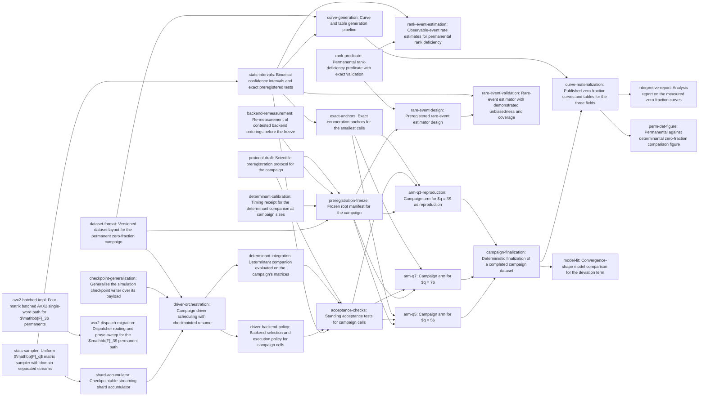

# Plan: Empirical permanent statistics of random matrices over small prime fields (b8206228)

> Planning node: 912f1008. Authoritative graph:
> [breakdown.json](breakdown.json).

## Outcome and criterion approach

| Criterion | Approach | Evidence / open gap |
|---|---|---|
| REQ-01 | Credited outside this manifest: the completed feasibility study carries the `satisfies:REQ-01` label and a direct epic dependency edge, so no issue is planned for it. | `dev/studies/b488f02c/feasibility-study.md` (GO verdict); investigation C13 records that both the label and the edge were missing and had to be applied before breakdown. |
| REQ-02 | Split by layer rather than by feature: a narrow crate owns the reproducible sampler, the interval and exact-test estimators, and the pooling accumulator; the simulation crate owns scheduling, checkpointed resume, backend policy, same-matrix determinant evaluation, and the standing acceptance checks. The checkpoint mechanism is generalised at its source rather than copied. | Study §5 G1–G3, G7; investigation C1 (no domain-separated production sampler), C2 (Wilson only, no accumulator), C3 (no permanent campaign runner; the modulation campaign binary is the structural precedent), C9 (the composite loop's module has no tests), §4a (version convergence for `rand_chacha`), §4b (checkpoint mechanism reusable, schema not), C11 (the determinant routine exists and sits below the algebra layer). |
| REQ-03 | Four stages, each with one writer: the layout and manifest schema land before the freeze; three field arms execute only frozen cells and write only their own field's files; a finalizer pools field summaries and checksums the raw data; the analysis pipeline is built and tested against fixtures, then run against the finalized dataset to materialise the published curves and tables; the report carries every interpretive sentence. | Study §7.4 (storage), §7.6 (prior-art delta), §4.6 (envelope and frontier); investigation C4 (no manifest or checksum convention exists; the proposed location conflicts with the declared purpose of `dev/campaigns`); RCA RC1 (interpretive prose in generated receipts) and RC2 (self-hash without build-state guard). |
| REQ-04 | Correctness and rates are separated: the predicate ships with an exhaustive-enumeration oracle and independent brute-force conformance, a companion leaf estimates the observable small-$k$ rates against their known values with a cost receipt, and the re-sited exact anchors validate the sampler and estimator against exactly known zero fractions. | Study §5 G5 (predicate decomposes into square permanents; the theorem's regime is unreachable by sampling); investigation C5 (no rank routine in-tree), C10 (existing anchors live in an issue-scoped area and are archival candidates); RCA RC5 (hard-criterion literalism). |
| REQ-05 | Aspirational: a preregistered likelihood comparison of deviation shapes computed on counts, and a permanent-versus-determinant zero-fraction figure from the same matrices. Both consume the finalized dataset and produce their own artefacts, so neither blocks the hard contract. | Study §7.5 (analysis method, superseded on the fitting method — see decisions), §7.4 (REQ-05 is a zero-fraction comparison, distinct from the separate whole-distribution uniformity work); investigation C11. |
| REQ-06 | Aspirational, split so the design is falsifiable: the estimator's proposal, weighting, unbiasedness argument and validation plan are fixed in a design document, and a second leaf builds it and demonstrates unbiasedness and interval coverage against exactly known cases. | Study §5 G5 part 3 (in-regime estimation is a rare-event follow-up, out of scope for the pipeline check); investigation C5. |

## Shared architectural contracts

### `stream-purpose-namespace` [plan-fixed] — Campaign stream addressing

Matrices are addressed by a 32-byte ChaCha20 seed block of four little-endian
`u64` words — campaign root, $q$, $n$, and a fourth word — as
`dev/studies/b488f02c/feasibility-study.md` §7.3 fixes it, with the fourth word's
encoding pinned here rather than left to the implementer: its **top 8 bits hold
the purpose tag and its low 56 bits hold the stream index**, and derivation
asserts the stream index is below $2^{56}$. The map from
$(\text{root}, q, n, \text{purpose}, \text{stream})$ to seed block is therefore
injective by construction, and purposes cannot collide however long a campaign
runs. Distinct purposes are reserved for validation draws, timing fixtures,
campaign cells, and rare-event draws. Shard $s$ of cell $(q,n)$ uses stream
$\mathrm{base}(q,n) + s$ within its purpose; the draw-to-entry mapping is
$A[k / n][k \bmod n]$, row-major, before any packed constructor reorders it.
Separation is a property of addresses and generator state, never of output
values: two disjoint streams may legitimately draw the same small matrix, so
tests assert distinct derived seed blocks, divergent generator output, and
committed golden vectors. The prototype derivation is
`dev/research/permanent-sampling-feas/src/sampler.rs:97-104`.

### `shard-record-format` [plan-fixed] — Per-shard record schema

One shard record carries its stream address, the matrix count drawn, the
permanent zero count, the histogram of permanent values over the $q$ residue
classes, and the determinant zero count over the same matrices — extending the
shape the feasibility harness emits
(`dev/research/permanent-sampling-feas/src/protocol.rs:315-343`) with the
companion quantity. Matrices are never stored: they are regenerable from the
address, so storage stays $O(\text{shards})$ and a whole cell costs tens of
kilobytes. Records carry mechanical provenance only.

### `checkpoint-payload-api` [implementation-produced] — Generic checkpoint payload

The crash-safe write path in `crates/gf2-sim/src/checkpoint/mod.rs` — PID-tagged
temporary file, fsync, rename, directory fsync, blake3 configuration-hash gate,
version-rejecting reader — becomes generic over a serialisable payload and a
configuration-hash provider. Callers supply a payload type and a hash source;
resume against a differing configuration stays a hard error.

### `campaign-dataset-layout` [implementation-produced] — Published dataset schema

The versioned on-disk form of a campaign, rooted at
`dev/simulation_results/permanent-zero-fraction/<campaign-id>/`: root manifest,
per-shard records under `shards/q<q>/n<nn>/`, one summary per field under
`summaries/`, a pooled `summary.csv`, and `checksums.sha256`. Two structural
rules travel with it. **One writer per path**: field-scoped paths are written
only by that field's execution and campaign-scoped paths only by finalization, so
concurrent field executions never write one file. **Raw versus derived**: the
checksum set covers raw data only — manifest, shard records, field summaries,
pooled summary — while reports, figures and fit outputs are derived artefacts
outside it, since a checksum file covering documents that quote it could never be
closed. Records and summaries carry permanent and determinant quantities side by
side, and each cell's recorded terminal state. The manifest schema enumerates
seeds, stream purposes, grid with per-cell $N$, shard identities, per-cell
backend, git revision, toolchain, accelerator runtime, and hardware, satisfying
`@/inv/claims-trace-to-artifacts`, which no existing in-tree convention does.

### `acceptance-test-protocol` [implementation-produced] — Preregistered decision rules

The estimand, the fixed sample size per cell, the cell universe and its
multiplicity accounting, the global error budget split across the permanent-floor
family and the determinant family, the exact binomial tests that take every
acceptance decision, the two admissible terminal states of a cell, the
halt-and-preserve rule with its predeclared retry policy, the backend-selection
rule, and the exclusion rules — all fixed before any campaign matrix is drawn.

### `campaign-root-manifest` [implementation-produced] — Frozen campaign instance

The immutable instance of the layout's root manifest for one campaign id: the
complete $(q,n)$ cell universe, $N$ per cell, the multiplicity count, the stream
purpose namespace with each purpose's tag, shard identities, whether the
determinant companion runs at each cell, and the backend selected per cell, bound
to a content hash so later modification is detectable.

### `finalized-campaign-dataset` [implementation-produced] — Verified campaign instance

A campaign dataset that has passed finalization: every manifest cell carries a
terminal record, per-shard records agree with the field summaries that pooled
them, the pooled `summary.csv` exists, and `checksums.sha256` verifies over the
raw set. This is the object every analysis, figure and report consumes, so an
analysis can state which dataset checksum it was produced from.

## Generated decomposition overview

<!-- jit:breakdown-overview:begin -->
| Key | Title | Type | Outcome | Contracts | Sources | Footprint | Landing | Depends on |
|---|---|---|---|---|---|---|---|---|
| stats-sampler | Uniform $\mathbb{F}_q$ matrix sampler with domain-separated streams | task | Production ChaCha20 rejection sampler in a new gf2-stats crate, addressing matrices by campaign root, field, size, purpose and stream | stream-purpose-namespace | REQ-02, G1, C1, INV-4a | creates 5, touches 1 | — | — |
| stats-intervals | Binomial confidence intervals and exact preregistered tests | task | Wilson and Clopper-Pearson intervals plus exact binomial tests with log-scale results for the permanent floor and the exact determinant value | — | REQ-02, G2, C2 | creates 1, touches 1 | — | stats-sampler |
| shard-accumulator | Checkpointable streaming shard accumulator | task | Streaming accumulator whose shard commits are atomic, duplicate-rejecting, order-independent when pooled, and exactly replayable after interruption | stream-purpose-namespace, shard-record-format | REQ-02, G2, C2, INV-6 | creates 1, touches 1 | — | stats-sampler |
| checkpoint-generalization | Generalise the simulation checkpoint writer over its payload | task | Simulation checkpoint writer and reader carry any serialisable payload behind a config-hash provider, with resume behaviour unchanged | — | REQ-02, INV-4b, INV-6, C3 | touches 3 | — | — |
| dataset-format | Versioned dataset layout for the permanent zero-fraction campaign | task | Versioned dataset home with a root manifest schema, per-shard records, per-field summaries and a raw-data checksum boundary | shard-record-format, stream-purpose-namespace | REQ-03, G4, C4, RC1, RC2, INV-5 | creates 3, touches 1 | — | — |
| driver-orchestration | Campaign driver scheduling with checkpointed resume | task | Campaign binary in the simulation crate schedules cell and shard work, resumes from checkpoints, and emits field-scoped dataset files | stream-purpose-namespace, shard-record-format, checkpoint-payload-api, campaign-dataset-layout | REQ-02, G3, C3, C9, INV-6 | creates 3, touches 2 | — | shard-accumulator, checkpoint-generalization, dataset-format |
| determinant-integration | Determinant companion evaluated on the campaign's matrices | task | Determinant of each drawn matrix evaluated in the campaign loop, with per-cell determinant zero counts and exact-test verdicts recorded | shard-record-format, campaign-dataset-layout | REQ-02, REQ-03, C11, INV-6 | creates 1, touches 1 | — | driver-orchestration |
| driver-backend-policy | Backend selection and execution policy for campaign cells | task | Per-cell backend selection from the frozen manifest, with batch-parallel execution, capped accelerator launches, and exclusive device access | campaign-dataset-layout | REQ-02, G7, G8, C7, C8, INV-6 | creates 1, touches 1 | — | driver-orchestration |
| acceptance-checks | Standing acceptance tests for campaign cells | task | Per-cell exact binomial floor and determinant tests under one global error budget, halting on failure under a predeclared retry rule | acceptance-test-protocol, campaign-dataset-layout, shard-record-format | REQ-02, INV-6, C11 | creates 1, touches 1 | — | stats-intervals, driver-backend-policy, determinant-integration, protocol-draft |
| avx2-batched-impl | Four-matrix batched AVX2 single-word path for $\mathbb{F}_3$ permanents | enhancement | Four matrices per AVX2 register through the batched bipedal type, conforming to the scalar kernel on the shared behavioural suite | — | G6, C6, INV-6 | creates 1, touches 2, uncertain | — | — |
| avx2-dispatch-migration | Dispatcher routing and prose sweep for the $\mathbb{F}_3$ permanent path | enhancement | Single-matrix callers routed to the measured-faster kernel, with stale prose, benchmark labels and assembly artefacts corrected in the same change | — | G6, C6, RC4, INV-6 | creates 1, touches 5 | — | avx2-batched-impl |
| determinant-calibration | Timing receipt for the determinant companion at campaign sizes | task | Committed receipt timing the finite-field determinant at campaign sizes against measured permanent cost at the same sizes | — | REQ-02, C11, INV-6 | creates 3, touches 1 | — | — |
| backend-remeasurement | Re-measurement of contested backend orderings before the freeze | task | Replicated measurements settling the contested q=3 n=28 ordering across the in-tree backend set, receipted for the campaign backend table | — | REQ-02, C12, INV-6 | creates 1, touches 1 | — | — |
| protocol-draft | Scientific preregistration protocol for the campaign | task | Preregistration fixing estimands, cell universe, error budget, backend rule, exclusion rules and validation plan before the first campaign draw | stream-purpose-namespace | REQ-02, REQ-03, REQ-05, RC5, INV-6 | creates 1 | — | — |
| preregistration-freeze | Frozen root manifest for the campaign | task | Immutable root manifest fixing the cell universe, per-cell N, multiplicity, stream purposes, shard identities and backends before the first draw | campaign-dataset-layout, acceptance-test-protocol, stream-purpose-namespace | REQ-03, INV-6, INV-7 | creates 1, uncertain | — | dataset-format, determinant-calibration, backend-remeasurement, protocol-draft |
| rank-predicate | Permanental rank-deficiency predicate with exact validation | task | Permanental rank-deficiency predicate over row submatrices, agreeing with an independent oracle on exhaustive enumeration | — | REQ-04, G5, C5, RC5 | creates 2, touches 1 | — | — |
| rank-event-estimation | Observable-event rate estimates for permanental rank deficiency | simulation | Estimated deficiency rates at k=1 and k=2 against their known values, with a measured mean evaluation cost per matrix | stream-purpose-namespace | REQ-04, G5, C5 | creates 2, touches 1 | — | rank-predicate, stats-intervals |
| exact-anchors | Exact enumeration anchors for the smallest cells | task | Re-runnable exact zero-fraction enumeration for the smallest cells, with sampler and estimator checked against the exact values | stream-purpose-namespace | REQ-04, C10, INV-7, RC5 | creates 3, touches 1 | — | stats-intervals |
| arm-q5 | Campaign arm for $q = 5$ | simulation | Executes the frozen q=5 cells to a recorded terminal state each, emitting shard records and this field's summary | campaign-root-manifest, acceptance-test-protocol, campaign-dataset-layout, shard-record-format, stream-purpose-namespace, checkpoint-payload-api | REQ-03, INV-6 | creates 2 | — | preregistration-freeze, acceptance-checks, exact-anchors |
| arm-q7 | Campaign arm for $q = 7$ | simulation | Executes the frozen q=7 cells from the resampled n=20 cell onward, each to a recorded terminal state, with this field's summary | campaign-root-manifest, acceptance-test-protocol, campaign-dataset-layout, shard-record-format, stream-purpose-namespace, checkpoint-payload-api | REQ-03, INV-6 | creates 2 | — | preregistration-freeze, acceptance-checks, exact-anchors |
| arm-q3-reproduction | Campaign arm for $q = 3$ as reproduction | simulation | Executes the frozen q=3 cells as an independent reproduction, each to a recorded terminal state, with published counterparts recorded | campaign-root-manifest, acceptance-test-protocol, campaign-dataset-layout, shard-record-format, stream-purpose-namespace, checkpoint-payload-api | REQ-03, INV-6 | creates 2 | — | preregistration-freeze, acceptance-checks, exact-anchors |
| campaign-finalization | Deterministic finalization of a completed campaign dataset | task | Post-arm finalizer pooling field summaries into the campaign summary and checksumming the raw data set deterministically | campaign-dataset-layout, campaign-root-manifest | REQ-03, C4, RC1, INV-6 | creates 3, touches 1 | — | arm-q5, arm-q7, arm-q3-reproduction |
| curve-generation | Curve and table generation pipeline | task | Reusable pipeline turning any published-format dataset into per-cell estimate tables, interval columns, curves and prior-art comparisons | campaign-dataset-layout, shard-record-format | REQ-03, INV-6 | creates 2, touches 1 | — | stats-intervals, dataset-format |
| curve-materialization | Published zero-fraction curves and tables for the three fields | task | Curve and table artifacts for q=3, q=5 and q=7 materialized from the finalized dataset by the analysis pipeline | finalized-campaign-dataset, campaign-dataset-layout | REQ-03, INV-6 | creates 2 | — | campaign-finalization, curve-generation |
| interpretive-report | Analysis report on the measured zero-fraction curves | task | Report assessing the measured curves against the proved floor at the measured sizes, published beside the dataset with conditional novelty claims | finalized-campaign-dataset, campaign-root-manifest, acceptance-test-protocol | REQ-03, C12, INV-6 | creates 1 | — | curve-materialization |
| model-fit | Convergence-shape model comparison for the deviation term | task | Preregistered likelihood comparison of geometric against polynomial deviation shapes on observed counts, standing as its own artefact | finalized-campaign-dataset, acceptance-test-protocol | REQ-05, INV-6 | creates 2 | — | campaign-finalization |
| perm-det-figure | Permanental against determinantal zero-fraction comparison figure | task | Figure comparing measured permanent and determinant zero fractions from the same matrices, with exact finite-size values overlaid | finalized-campaign-dataset, campaign-dataset-layout | REQ-05, C11 | creates 1, touches 1 | — | curve-materialization |
| rare-event-design | Preregistered rare-event estimator design | task | Estimator design fixing proposal distribution, weighting, unbiasedness argument and validation plan before any estimator code exists | campaign-root-manifest, acceptance-test-protocol, stream-purpose-namespace | REQ-06, G5 | creates 1 | — | preregistration-freeze, rank-predicate |
| rare-event-validation | Rare-event estimator with demonstrated unbiasedness and coverage | task | Estimator built to the preregistered design, with unbiasedness and interval coverage shown against exactly known cases | stream-purpose-namespace, campaign-root-manifest | REQ-06, C5 | creates 1, touches 1 | — | rare-event-design, stats-intervals |

<!-- jit:breakdown-overview:end -->

## Material risks and owner decisions

| Risk / decision | Resolution and rationale |
|---|---|
| Crate placement for sampler and statistics (investigation §4d, six options) | Owner decision: a new narrow workspace crate `gf2-stats` depending only on `gf2-core`, with `rand_chacha` promoted to `[workspace.dependencies]` at 0.9 in the same change per `@/inv/convention-convergence` (three `rand_chacha` majors and two `rand` majors coexist in-tree today). Rejected: `gf2-core` extension, because Wilson and Clopper–Pearson estimators have no home in a finite-field crate; `gf2-algebra` module, because an orchestration-adjacent statistics layer strains that crate's stated identity. |
| Driver placement and the checkpoint mechanism (investigation §6) | Owner decision: the campaign driver is a binary in `gf2-sim` beside `dvb_t2_awgn_campaign.rs`, adding the inward `gf2-sim → gf2-algebra` edge that `@/inv/crate-dependency-direction` permits; the checkpoint writer and reader are generalised over a serialisable payload at their source rather than copied. Rejected: a named exception for a second checkpoint implementation, which the invariant permits but which buys nothing here. The study's G3 sentence is thereby narrowed to the campaign *schema*, which is genuinely a distinct abstraction. |
| Dataset location (investigation C4) | Owner decision: `dev/simulation_results/permanent-zero-fraction/<campaign-id>/`, a deliberate documented divergence from study §7.4's `dev/campaigns/...`. Both are declared permanent documentation areas, but `dev/index.md:42` classifies `dev/campaigns` as campaign *definitions* and `dev/index.md:46` classifies `dev/simulation_results` as campaign *outputs*; `dev/campaigns` today holds only configuration files and nothing writes into it. The divergence and its rationale are restated in the dataset-format issue body. |
| G6 fix shape (investigation C6) | Owner decision, unchanged: the four-matrix batched AVX2 single-word $\mathbb{F}_3$ path the rustdoc already promises is **built in this epic**, not deferred and not replaced by a bare dispatcher flip. `Bipedal3x4 = BatchedBipedalLike<Config3>` exists at `crates/gf2-kernels-simd/src/bipedal/bipedal3.rs:183` and nothing evaluates four permanents through it. Advisor-review correction: the work is split for sizing into the batched path with its conformance suite, and the dispatcher routing with its receipt, prose sweep (`bipedal3.rs:26`, `:349`, the S3 example header, the `s1_n36_speedup.rs` bench group label per `@/inv/single-source-prose`) and assembly regeneration. Both touch `crates/gf2-kernels-simd/src/x86`, so both carry `asm-artefact-present`. |
| Whether the batched AVX2 path is a campaign backend candidate | Synthesizer judgment: no, and therefore no dependency edge from the arms or the freeze to it. The batched single-word path helps where one bipedal word suffices, and at those sizes the composite rate is dominated by drawing and packing rather than by the kernel (study §4.4: composite falls to about half of eval-only at $q=3$, $n=12$), while the frontier cells are won by intra-matrix rayon and the accelerator. Making the freeze wait on a new kernel would buy schedule risk for no measured gain. The capability still lands in this epic; it is simply not on the campaign's critical path. |
| Placement of the permanental rank predicate | Synthesizer judgment: `gf2-algebra`, which owns permanent algorithms, rather than the campaign driver as study §5 G5 suggests — the predicate is a permanent algorithm over existing square kernels and belongs with them under `@/inv/convention-convergence`. After the advisor-review split the predicate itself carries no statistical machinery, so the crate takes no dependency, production or development, on the statistics crate. |
| Advisor correction — the determinant companion had no producer | The earlier decomposition tested and plotted determinant zero counts that nothing computed. A dedicated leaf now evaluates `FieldMatrix::det` inside the composite loop on the *same* drawn matrices, and the shard record, accumulator, summary and dataset-layout contracts carry the determinant zero count and per-cell verdict. Same-matrix evaluation is the point: an independently drawn determinant sample would leave the shared draw, pack and address path — where this problem family's recorded defects actually occurred — unchecked. Cost measurement stays a separate leaf that changes no evaluation path. |
| Advisor correction — dataset lifecycle and checksum cycle | Three arms writing one pooled summary made every arm a writer of one file, and a checksum set including reports and figures could never close, since those artefacts quote the checksums. Resolved by per-field summaries written only by that field's execution, a finalizer that is the sole writer of campaign-scoped paths, and an explicit raw-versus-derived boundary in the layout contract. The finalizer also refuses a dataset with a cell in no terminal state, so an incomplete run cannot be published as a complete one. |
| Advisor correction — the hard curve deliverable was tooling only | REQ-03 asks for published curves, and a pipeline that could produce them is not a curve. The pipeline stays a reusable, fixture-tested leaf with no dependency on any arm, and a separate materialisation leaf runs it against the finalized dataset and commits the per-field curve and table artefacts. The report depends on the materialised artefacts rather than on the tooling. |
| Advisor correction — stream separation was underspecified and mis-tested | The seed derivation's purpose handling is now a fixed bit partition (top 8 bits of the fourth word, stream index below $2^{56}$, asserted at derivation) rather than an unspecified salt, and golden derivation vectors are committed. Criteria claiming that two disjoint streams "share no matrix" are removed: at $q=3$, $n=2$ there are only $81$ matrices, so collisions are expected and testing for their absence would assert something false. Separation is tested at the address, seed and generator-state level. |
| Advisor correction — interval and exact-test correctness contract | Clopper–Pearson is validated against an independent inversion of the binomial tail or beta quantiles plus an empirical coverage check, not against containing the Wilson interval, which is a necessary consequence of construction rather than evidence of correctness. And because an exact tail at $N = 2 \times 10^{7}$ legitimately underflows double precision, the exact-test interface reports on a log scale or as a direct threshold comparison, so a correct decision does not depend on a probability that has flushed to zero. |
| Advisor correction — REQ-04 leaf mixed correctness with rates | The predicate leaf now delivers the production predicate, the exhaustive-enumeration oracle and cross-implementation conformance only; a companion simulation leaf delivers the small-$k$ event-rate estimates and the measured mean evaluation cost. Both credit REQ-04. The aspirational rare-event work splits the same way: a preregistered design, then an implementation whose unbiasedness and coverage are demonstrated against it. |
| Advisor correction — arm completion versus falsification | An arm's hard criterion is that every frozen cell reaches a terminal *recorded* state: executed at its preregistered $N$ with a verdict, or halted under the predeclared rule with the halt and its cause recorded. A cell that is simply unreached satisfies nothing, so a campaign cannot be closed by omission, while a campaign that halts under its own rule closes honestly as a recorded falsification. |
| Advisor correction 1 — family-wise error allocation | Binding, and it supersedes study §7.2 on the record: the global $\alpha$ is allocated *across* the permanent-floor family and the determinant family (for example $0.025$ each) rather than spending a separate $5\%$ family-wise budget on each. Study §7.2 and §6 read as two independent families; that understates the campaign's total false-alarm exposure. The study text stands unedited per `@/inv/falsification-preserved`; the campaign protocol supersedes it. |
| Advisor correction 2 — exact tests, not normal approximations | Binding: acceptance decisions use preregistered exact binomial tests — a one-sided test of the composite null $\Pr[\mathrm{per}=0] \ge 1/q$ evaluated at its worst case $p = 1/q$, and a two-sided exact test against the exactly known $1 - \prod_{i=1}^{n}(1-q^{-i})$. The critical values $z = 3.16$ and $z = 3.36$ from study §7.2 and §6 are demoted to planning approximations used for sizing, and appear nowhere in a decision path. |
| Advisor correction 3 — predeclared retry after a halt | Binding: rerunning a halted cell until it passes spends the error budget silently, which is forbidden. The protocol predeclares what may be rerun, how many attempts are permitted, and how a rerun charges the budget; the driver refuses a rerun outside that rule, and halted cells stay in the dataset with their verdicts. |
| Advisor correction 4 — model comparison method | Binding, superseding study §7.5: the convergence-shape comparison is a likelihood computed on the observed counts under their binomial sampling distribution, not weighted least squares on $\hat p$ compared by AIC. The study text stands; the protocol supersedes it. The comparison also produces its own artefact and modifies no other, and the report never waits on it — an aspirational result cannot block a hard one. |
| Predeclared accelerator-contingent cells | The protocol's cell universe covers the core processor-feasible grid *and* any accelerator-contingent extension cells, either inside the multiplicity accounting or in an explicitly gatekept second family whose entry condition is fixed before any draw. Discovering extra cells after the freeze requires a restated adjustment under a new campaign id, per study §7.2. |
| Backend measurement scope | The in-tree re-measurement leaf is restricted to backends present in the workspace when it runs, and says so in its receipt. Accelerator configurations retained by the separate accelerator study arrive through that study's own receipts; the freeze issue carries the obligation that every backend named in the frozen table has a committed measurement at the cells where it is chosen, whichever source it came from. |
| External dependency edges (not expressible in `depends_on`, which takes in-file keys only) | Two edges the lead wires after batch-create: `preregistration-freeze` → `0de41c82` (the accelerator study, a user-directed prerequisite whose retained candidates the backend table may name), and `interpretive-report` → `76dfd2ff` (S3/S5 receipt requalification, which clears the live `ROADMAP.md:86` contradiction the report would otherwise have to explain). |
| REQ-01 credit | Already applied outside this manifest: `b488f02c` carries `satisfies:REQ-01` and a direct dependency edge from the epic. Investigation C13 found both missing and noted that `coverage-preview` fires on the breakdown node as soon as breakdown starts, so this had to be fixed before the node was worked rather than at epic close. |
| Aspirational criteria markers | Issues covering the epic's aspirational REQ-05 and REQ-06 carry `[aspirational]` markers on every one of their own criteria and no `satisfies:` label, since `satisfies:` names hard criteria only. Their outcomes are bounded by achievable precision — two deviation-shape families are distinguishable only while $\lvert\delta(n)\rvert$ exceeds a few standard errors, expected around $n \lesssim 14$–$16$ — so an inconclusive result is a recorded result. |
| Transitive reduction versus stated ordering | Several ordering intentions are carried by implied paths rather than direct edges, because the repository requires a transitively reduced graph and the manifest validator rejects an edge a longer path already implies. The arms reach the dataset layout through the freeze; the report reaches the arms through materialisation and finalization; and the model comparison reaches the protocol through finalization and the freeze, so its direct protocol edge is dropped while the ordering it expresses is unchanged. |

## Investigation sources

- [Investigation](investigation.md) — exhaustive consumers, file inventories, and
  claim-by-claim verdicts remain there.
- Design SSOT: `dev/studies/b488f02c/feasibility-study.md` — envelope §4.6,
  sampling plan §7.2, seeding §7.3, storage §7.4, analysis §7.5, prior-art delta
  §7.6.
- Review cost analysis: `dev/sessions/2026-08-08-b488f02c-review-rca.md`.
- Standing decisions: `dev/sessions/2026-08-07-research-frontier-handoff.md`.
- Recorded literature search:
  `dev/studies/b488f02c/literature-search-2026-08-08.md`.

Source identifiers used in `planning.source_refs`: `REQ-01`–`REQ-06` are the
epic's success criteria; `G1`–`G8` are the feasibility study's §5 gaps;
`C1`–`C13` are the investigation's §1 claim verdicts; `RC1`–`RC5` are the RCA's
root causes; `INV-4a`, `INV-4b`, `INV-5`, `INV-6` and `INV-7` are the
investigation sections carrying obligations that are not numbered claims
(dependency convergence, checkpoint machinery, architecture fit, invariant
obligations, and decided open questions). `C13` is resolved outside the manifest
by the REQ-01 credit recorded above; `RC3` is a review-process finding with no
issue-shaped remedy here.
