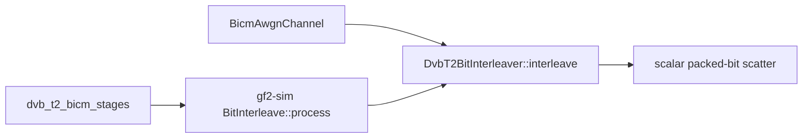

# DVB-T2 bit-interleaver profile

> **Diátaxis Type:** Reference (active research evidence)

This artifact owns the materiality disposition for issue `9fb40c83`. The
protocol-v4 campaign and repeated dynamic profile are scheduled-window work;
the frozen source and harness evidence below is complete, while the numerical
sections and final disposition remain open until those runs produce durable
artifacts.

## Production route and consumers

The selected production route is the safe scalar packed-bit scatter in
`DvbT2BitInterleaver::interleave`: it allocates and zero-initializes one output
`BitVec`, walks the precomputed `forward: Vec<usize>` in input order, tests each
input bit, and sets the mapped output bit when true. There is no SIMD or runtime
dispatch on this route.

The direct BICM harness calls the same method before expanding the returned
`BitVec` into `Vec<bool>` for QAM mapping. The simulation factory places
`BitInterleave` between `DvbT2Encode` and `GrayQamMap`; its `process` method
iterates the batch, calls the same interleaver once per frame, collects the
outputs, and returns a `BitPackedBatch`. The machine-readable source pins,
matched fragments, call edges and logical memory passes are in
[`survey/dvb-source-evidence.json`](survey/dvb-source-evidence.json).

## Frozen experiment

[`dvb-profile-addendum.json`](dvb-profile-addendum.json) freezes ten exploratory
cells before timing:

- Normal and Short FECFRAME paths for both 16-QAM and 64-QAM;
- one warm isolated null cell and one warm whole-stage xdsopl gap cell for each
  MODCOD;
- streaming repetitions of both boundaries for Normal 16-QAM;
- one worker, current native gf2 code, xdsopl `PCTITL` at the pinned comparator
  revision, six paired executions, and no confirmatory or adoption role.

The isolated null launches the byte-identical direct gf2 path as both arms. It
records same-binary noise and the direct scatter cost without inventing a
candidate. The whole-consumer comparison starts and ends at a one-frame
`BitPackedBatch`: xdsopl pays unpack, destructive-input copy, output allocation
and pack within every timed call, and reports unpack, copy and pack separately.
The family ledger begins at the explicit empty genesis state in
[`dvb-profile-trial-ledger.jsonl`](dvb-profile-trial-ledger.jsonl).

The bounded search admits at most two branch-free or packed-word forms, four
hundred production source lines in total, and at most one isolated unsafe SIMD
kernel. A material result still authorizes no implementation. It keeps this
profile open until a Rust 1.95 compile, assembly, semantic oracle and applicable
runtime-gated scalar fallback are recorded and the planning bracket is amended
and re-reviewed.

## Harness evidence

The standalone harness is built with Rust 1.95 in release mode. Its non-timed
gate checks canonical little-endian pack/unpack boundaries, every output
position of all four ETSI permutations against xdsopl, direct versus
`BitInterleave` output, the explicit xdsopl destructive-input adapter, and the
deterministic max-log BICM consumer, and runs the survey workspace's contract
checks, which the repository CI contract does not reach.
[`survey/harness-validation.txt`](survey/harness-validation.txt) is the
committed result, written by the gate itself.

Code reading does not establish the campaign wire, so every arm also runs
through the real `benchmark-ab-runner` on a throwaway family under `target/`,
untimed and without the host mutex.
[`survey/runner-smoke.txt`](survey/runner-smoke.txt) records the handshakes and
parsed result lines that run observed, and
[`survey/smoke-dvb-arms.sh`](survey/smoke-dvb-arms.sh) reproduces it.

The scheduled profile measures four paths for every MODCOD: direct scatter,
the simulation stage, xdsopl at the packed boundary, and the complete
`BicmAwgnChannel` max-log path. Nine sessions provide the order-statistic
interval for each wall-time figure; one session records allocation counts,
hardware counters, hot symbols and instruction annotation. Perf failures remain
as explicit unavailable records with stderr.

## Measurement status

The benchmark-window queue contains one resumable job for this worktree. It
rebuilds and validates the exact source closure, executes the protocol-v4
campaign into `dev/bench_results/c04dd4ac/dvb-interleave-profile/v4-r2-pilot`,
then writes the repeated profile to
`dev/bench_results/c04dd4ac/dvb-interleave-profile/v4-r2-dynamic-profile`.
Each campaign session checkpoints at two cells, and each completed profile
session is recorded in its append-only `repetitions.log`.

An earlier launch, campaign `v4-r1-9fb40c83-dvb-interleave-profile`, aborted on
a procedural defect in its own launch before any result was read, and is voided
under the voided-attempt rule of
[`protocol.md`](../f547c394/protocol.md). Its stage is preserved whole at
[`v4-r1-pilot-abandoned`](../../bench_results/c04dd4ac/dvb-interleave-profile/v4-r1-pilot-abandoned/execution.log)
and
[`v4-voided-profile-attempt.json`](../../bench_results/c04dd4ac/dvb-interleave-profile/v4-voided-profile-attempt.json)
records the campaign, the addendum digest, the defect, the cells measured and
unmeasured and the abort. Its reservation does not enter the chain, so the
family ledger stays empty and `v4-r2` reserves sequence zero on it.

No materiality or candidate disposition is made before those outputs exist.
The accepted protocol-v3 re-measurement remains exploratory context; withdrawn
warm receipts do not confirm a candidate.
