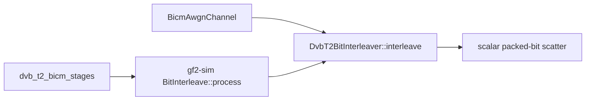

# DVB-T2 bit-interleaver profile

> **Diátaxis Type:** Reference (active research evidence)

This artifact owns the materiality disposition for issue `9fb40c83`. It
attributes the cost of the production DVB-T2 packed-bit scatter inside its real
BICM consumers and closes the bounded search the frozen addendum predeclares.

## Disposition

The scatter is **not material** under the predeclared rule, and this profile
nominates no branch-free or packed-word form.

The rule in [`dvb-profile-addendum.json`](dvb-profile-addendum.json) makes a
whole-stage gap of at least the frozen `material_gap_threshold` in the
comparator's favour the smallest residual worth a bounded feasibility
investigation, and retains the current scatter below it. A cell speedup above
one means xdsopl `PCTITL` [Xdsopl2026] is ahead. The evaluator records every
whole-consumer cell as `regressed`, so no cell reaches the threshold and none
comes near it; the per-cell decisions and intervals are the `Decision` and
`Interval` columns of
[`v4-r2-pilot/acceptance-summary.md`](../../bench_results/c04dd4ac/dvb-interleave-profile/v4-r2-pilot/acceptance-summary.md),
each over the six paired executions its `Pairs` column states. Because the
disposition nominates nothing, REQ-05 permits this profile to complete; the
complexity budget, the two-form nomination limit and the planning-time Rust
1.95 compile, assembly, oracle and runtime-gated fallback record stay unspent.

Withdrawn warm receipts and the accepted protocol-v3 re-measurement are
historical context. Neither confirms a candidate here.

## Production route and consumers

The selected production route is the safe scalar packed-bit scatter in
`DvbT2BitInterleaver::interleave`: it allocates and zero-initializes one output
`BitVec`, walks the precomputed `forward: Vec<usize>` in input order, tests each
input bit, and sets the mapped output bit when true. There is no SIMD or runtime
dispatch on this route. The operation is the ETSI EN 302 755 v1.4.1 section
6.1.3 bit interleave [Etsi2015].

The direct BICM harness calls the same method before expanding the returned
`BitVec` into `Vec<bool>` for QAM mapping. The simulation factory places
`BitInterleave` between `DvbT2Encode` and `GrayQamMap`; its `process` method
iterates the batch, calls the same interleaver once per frame, collects the
outputs, and returns a `BitPackedBatch`. The machine-readable source pins,
matched fragments, call edges and logical memory passes are in
[`survey/dvb-source-evidence.json`](survey/dvb-source-evidence.json), and the
pass sequences are tabulated in the attribution tables.

## Attribution

[`dvb-interleave-profile-tables.md`](dvb-interleave-profile-tables.md) is
written by [`survey/make-dvb-tables.py`](survey/make-dvb-tables.py) from the
receipt, the profile session records and the source-evidence ledger, and is the
authoritative location for every figure below.

- **Isolated cost beside whole-consumer cost.** The isolated scatter and the
  one-frame `BitInterleave::process` that wraps it agree to within the
  same-binary noise the null cells measure, so the stage wrapper adds no
  attributable cost and the whole consumer at that boundary is the scatter. The
  isolated and stage columns are medians over the six pairs of the cells named
  in the same row.
- **Representation conversions.** The gf2 route crosses no representation
  boundary: its arms report zero pack, unpack and batch-fill time in every
  pair. The xdsopl arm pays unpack, a destructive-input copy with output
  allocation, and a pack inside every timed call; those three parts and the
  remainder that holds the `PCTITL` permutation together with the final
  packed-batch wrap are the decomposition table's columns. The remainder is not
  a `PCTITL` figure, because the arm does not time the wrap separately.
- **Memory passes.** The two gf2 routes make the fewest logical passes of the
  four; the xdsopl stage adapter and the full BICM channel each make more. The
  sequences are the memory-pass table.
- **Allocation behavior.** The direct route allocates least per call, the stage
  one allocation more for the batch it returns, and the xdsopl adapter and the
  full BICM channel more still and far more bytes. The counts and bytes per
  call are the `allocations/call` and `bytes/call` columns of
  [`v4-r2-dynamic-profile/profile-summary.md`](../../bench_results/c04dd4ac/dvb-interleave-profile/v4-r2-dynamic-profile/profile-summary.md),
  each an across-session value over that table's nine sessions. The counting
  allocator adds relaxed atomics, so those wall times explain composition only.
- **Call graph and hot symbols.** One symbol,
  `DvbT2BitInterleaver::interleave`, carries almost the whole isolated and
  stage profile, while the BICM channel's largest share belongs to the
  demapper; the per-case top symbol and its sample count are the hot-symbol
  table. The scatter's descriptive share of the full max-log BICM channel is
  the share column of the profile summary, which labels it descriptive and
  gives it no decision interval.
- **Hot instructions.** Within the scatter the samples concentrate on the
  bounds comparison of the permutation index, the loop counter update and
  back edge, and the data-dependent bit test that decides whether an output
  bit is set; the per-instruction shares are the hot-instruction table. In
  the hardware-counter table both FECFRAME lengths execute the same
  instructions per bit, while the Normal rows pay markedly more cycles per
  bit and carry nearly all of the branch misses per bit. The Short frame's
  single repeating fixture is short enough for the predictor to reproduce,
  so the Normal rows are the ones that expose the scatter's data-dependent
  branch cost. Those counters come from one retained session and carry no
  interval.

## Frozen experiment

[`dvb-profile-addendum.json`](dvb-profile-addendum.json) freezes ten exploratory
cells before timing:

- Normal and Short FECFRAME paths for both 16-QAM and 64-QAM;
- one warm isolated null cell and one warm whole-stage xdsopl gap cell for each
  MODCOD;
- streaming repetitions of both boundaries for Normal 16-QAM;
- one worker, current native gf2 code, xdsopl `PCTITL` at the pinned comparator
  revision, six paired executions, and no confirmatory or adoption role.

The isolated null launches the byte-identical direct gf2 path as both arms. It
records same-binary noise and the direct scatter cost without inventing a
candidate. The whole-consumer comparison starts and ends at a one-frame
`BitPackedBatch`: xdsopl pays unpack, destructive-input copy, output allocation
and pack within every timed call, and reports unpack, copy and pack separately.
The family ledger in
[`dvb-profile-trial-ledger.jsonl`](dvb-profile-trial-ledger.jsonl) carries this
campaign's reservation on the genesis state; every cell is exploratory, so the
reservation spends no confirmatory comparison.

The bounded search admits at most two branch-free or packed-word forms, four
hundred production source lines in total, and at most one isolated unsafe SIMD
kernel. A material result still authorizes no implementation.

## Harness evidence

The standalone harness is built with Rust 1.95 in release mode. Its non-timed
gate checks canonical little-endian pack/unpack boundaries, every output
position of all four ETSI permutations against xdsopl, direct versus
`BitInterleave` output, the explicit xdsopl destructive-input adapter, and the
deterministic max-log BICM consumer, and runs the survey workspace's contract
checks, which the repository CI contract does not reach.
[`survey/harness-validation.txt`](survey/harness-validation.txt) is the
committed result, written by the gate itself.

Code reading does not establish the campaign wire, so
[`survey/smoke-dvb-arms.sh`](survey/smoke-dvb-arms.sh) drives all four arms of
every frozen cell with the runner's own request framing, result parser and child
environment, in the validation role: each arm performs one untimed dispatch and
returns no timing window, and the driver refuses an arm that reports one. The
smoke opens no campaign, so it takes no host mutex, reserves nothing in the
family ledger, writes no stage, finalizes no receipt and emits no timing sample,
and it runs outside the benchmark window.
[`survey/runner-smoke.txt`](survey/runner-smoke.txt) is the committed record:
the plan and executable identities, the route each arm selected, the result
lines parsed and the window count.

## Measurement record

The protocol-v4 campaign executes into
[`v4-r2-pilot`](../../bench_results/c04dd4ac/dvb-interleave-profile/v4-r2-pilot/execution.log),
checkpointing at two cells per session. Its execution log opens every frozen
cell, completes every frozen cell at the declared pairs with status `measured`,
and closes with a terminal `complete` record; the acceptance summary accepts the
receipt and qualifies it for no production selection.

The repeated dynamic profile writes to
[`v4-r2-dynamic-profile`](../../bench_results/c04dd4ac/dvb-interleave-profile/v4-r2-dynamic-profile/repetitions.log),
which records each completed session in its append-only log. It measures four
paths for every MODCOD: direct scatter, the simulation stage, xdsopl at the
packed boundary, and the complete `BicmAwgnChannel` max-log path. Nine sessions
provide the order-statistic interval for each wall-time figure; one session
records allocation counts, hardware counters, hot symbols and instruction
annotation.

That session's own annotation step passes an option its `perf` build rejects, so
each case keeps an empty `.annotate.txt` beside the `.err` file that names the
rejected option. The samples themselves are complete, and
[`survey/render-hot-instructions.sh`](survey/render-hot-instructions.sh)
disassembles the pinned executable against them to produce each case's
`.instructions.txt`. That render measures nothing and takes no host mutex, so
it reproduces outside the benchmark window;
[`survey/run-profile.sh`](survey/run-profile.sh) carries the same flags for a
session that renders its listing directly.

One attempt of this family is voided: campaign
`v4-r1-9fb40c83-dvb-interleave-profile` aborts on a procedural defect in its
own launch before any result is read, under the voided-attempt rule of
[`protocol.md`](../f547c394/protocol.md). Its stage is preserved whole at
[`v4-r1-pilot-abandoned`](../../bench_results/c04dd4ac/dvb-interleave-profile/v4-r1-pilot-abandoned/execution.log)
and
[`v4-voided-profile-attempt.json`](../../bench_results/c04dd4ac/dvb-interleave-profile/v4-voided-profile-attempt.json)
records the campaign, the addendum digest, the defect, the cells measured and
unmeasured and the abort. Its reservation does not enter the chain, so `v4-r2`
holds sequence zero.
