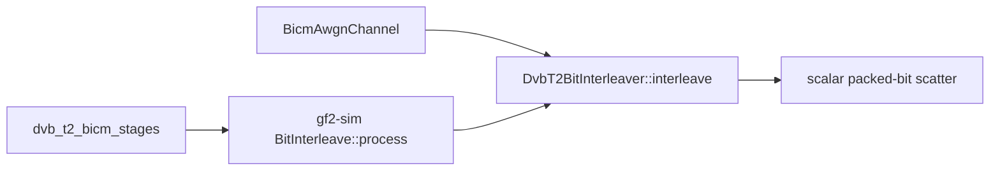

# DVB-T2 bit-interleaver profile

> **Diátaxis Type:** Reference (active research evidence)

This artifact owns the materiality disposition for issue `9fb40c83`. It
attributes the cost of the production DVB-T2 packed-bit scatter inside its real
BICM consumers and closes the bounded search the frozen addendum predeclares.

## Disposition

The scatter is **not material** under the predeclared rule, and this profile
nominates no branch-free or packed-word form.

The rule in [`dvb-profile-addendum.json`](dvb-profile-addendum.json) makes a
whole-stage gap of at least the frozen `material_gap_threshold` in the
comparator's favour the smallest residual worth a bounded feasibility
investigation, and retains the current scatter below it. A cell speedup above
one means xdsopl `PCTITL` [Xdsopl2026] is ahead. The evaluator records every
whole-consumer cell as `regressed`, so no cell reaches the threshold; the
decomposition table adds the margin, with the two arms' intervals disjoint and
the gf2 stage below the comparator in every cell. The per-cell decisions and
intervals are the `Decision` and `Interval` columns of
[`v4-r2-pilot/acceptance-summary.md`](../../bench_results/c04dd4ac/dvb-interleave-profile/v4-r2-pilot/acceptance-summary.md),
each over the six paired executions its `Pairs` column states. Because the
disposition nominates nothing, REQ-05 permits this profile to complete; the
complexity budget, the two-form nomination limit and the planning-time Rust
1.95 compile, assembly, oracle and runtime-gated fallback record stay unspent.

Withdrawn warm receipts and the accepted protocol-v3 re-measurement are
historical context. Neither confirms a candidate here.

## Production route and consumers

The selected production route is the safe scalar packed-bit scatter in
`DvbT2BitInterleaver::interleave`: it allocates and zero-initializes one output
`BitVec`, walks the precomputed `forward: Vec<usize>` in input order, tests each
input bit, and sets the mapped output bit when true. There is no SIMD or runtime
dispatch on this route. The operation is the ETSI EN 302 755 v1.4.1 section
6.1.3 bit interleave [Etsi2015].

The direct BICM harness calls the same method before expanding the returned
`BitVec` into `Vec<bool>` for QAM mapping. The simulation factory places
`BitInterleave` between `DvbT2Encode` and `GrayQamMap`; its `process` method
iterates the batch, calls the same interleaver once per frame, collects the
outputs, and returns a `BitPackedBatch`. The machine-readable source pins,
matched fragments, call edges and logical memory passes are in
[`survey/dvb-source-evidence.json`](survey/dvb-source-evidence.json), and the
pass sequences are tabulated in the attribution tables.

## Attribution

[`dvb-interleave-profile-tables.md`](dvb-interleave-profile-tables.md) is
written by [`survey/make-dvb-tables.py`](survey/make-dvb-tables.py) from the
receipt, the profile session records and the source-evidence ledger, and is the
authoritative location for every figure below. Each table states the samples it
summarises and carries the interval the generator's declared method gives that
sample, or labels the figure descriptive where no interval is available. The
preserved v4-r2 wall-time profile has its
[`provenance record`](../../bench_results/c04dd4ac/dvb-interleave-profile/v4-r2-dynamic-profile-provenance.md).
The fresh nine-repetition perf profile has its own
[`provenance record`](../../bench_results/c04dd4ac/dvb-interleave-profile/v4-r3-dynamic-profile-provenance.md)
and [`session summary`](../../bench_results/c04dd4ac/dvb-interleave-profile/v4-r3-dynamic-profile/profile-summary.md).
The tables use the accepted paired receipt for materiality, the preserved
profile for wall-time composition, and the fresh profile for repeated hardware
counters, hot symbols and instructions.

- **Isolated cost beside whole-consumer cost.** The isolated scatter and the
  one-frame `BitInterleave::process` that wraps it agree to within the
  same-binary noise the null cells measure: their intervals overlap in every
  row of the boundary table, so the stage wrapper adds no attributable cost and
  the whole consumer at that boundary is the scatter. Each column of that table
  is a median over the pairs of one cell with its own interval.
- **Representation conversions.** The gf2 route crosses no representation
  boundary: its rows of the conversion-part table are zero for pack, unpack and
  the input copy, and its remainder is the whole per-call cost. The xdsopl arm
  pays unpack, a destructive-input copy with output
  allocation, and a pack inside every timed call; those three parts and the
  remainder that holds the `PCTITL` permutation together with the final
  packed-batch wrap are the rows of the conversion-part table, each with its own
  interval. The remainder is not a `PCTITL` figure, because the arm does not
  time the wrap separately.
- **Memory passes.** The two gf2 routes make the fewest logical passes of the
  four; the xdsopl stage adapter and the full BICM channel each make more. The
  sequences are the memory-pass table.
- **Allocation behavior and composition.** The direct route allocates least per
  call, the stage one allocation more for the batch it returns, and the xdsopl
  adapter and the full BICM channel more still and far more bytes. The counts
  and bytes per call are an exact per-call census, and the wall time beside them
  an across-session median with its interval, in the across-session table; its
  raw source is the session's own `rep-NN/cases.json` records, which
  [`v4-r2-dynamic-profile/profile-summary.md`](../../bench_results/c04dd4ac/dvb-interleave-profile/v4-r2-dynamic-profile/profile-summary.md)
  renders too. The counting allocator adds relaxed atomics, so those wall times
  explain composition only.
- **Call graph and hot symbols.** The hot-symbol table gives the selected
  production scatter the dominant sampled share in the isolated and simulation
  stage routes, while the full BICM channel's largest sampled share belongs to
  the demapper. Each share has a nine-repetition interval and the underlying
  sample-count range. The scatter-share table divides direct scatter time by
  full max-log BICM time within each of the preserved profile's nine sessions,
  with an interval; its Amdahl ceiling is an estimate. These separate-process
  composition figures do not replace the paired receipt's materiality decision.
- **Hardware counters and hot instructions.** The fresh profile repeats
  perf-stat counters, sampled symbols and instruction annotation in all nine
  sessions. The tables report intervals for counter rates per bit, IPC, symbol
  shares and the selected route's instruction shares. The sampled scatter
  concentrates on the permutation-index comparison, bit test, loop updates
  and back edge. The instruction rows identify the actual executed form,
  including its bounds checks; they neither prove a branch-free candidate
  feasible nor justify nominating one against the whole-consumer result.

## Frozen experiment

[`dvb-profile-addendum.json`](dvb-profile-addendum.json) freezes ten exploratory
cells before timing:

- Normal and Short FECFRAME paths for both 16-QAM and 64-QAM;
- one warm isolated null cell and one warm whole-stage xdsopl gap cell for each
  MODCOD;
- streaming repetitions of both boundaries for Normal 16-QAM;
- one worker, current native gf2 code, xdsopl `PCTITL` at the pinned comparator
  revision, six paired executions, and no confirmatory or adoption role.

The isolated null launches the byte-identical direct gf2 path as both arms. It
records same-binary noise and the direct scatter cost without inventing a
candidate. The whole-consumer comparison starts and ends at a one-frame
`BitPackedBatch`: xdsopl pays unpack, destructive-input copy, output allocation
and pack within every timed call, and reports unpack, copy and pack separately.
The family ledger in
[`dvb-profile-trial-ledger.jsonl`](dvb-profile-trial-ledger.jsonl) carries this
campaign's reservation on the genesis state; every cell is exploratory, so the
reservation spends no confirmatory comparison.

The bounded search admits at most two branch-free or packed-word forms, four
hundred production source lines in total, and at most one isolated unsafe SIMD
kernel. A material result still authorizes no implementation.

## Harness evidence

The standalone harness is built with Rust 1.95 in release mode. Its non-timed
gate checks canonical little-endian pack/unpack boundaries, every output
position of all four ETSI permutations against xdsopl, direct versus
`BitInterleave` output, the explicit xdsopl destructive-input adapter, and the
deterministic max-log BICM consumer, and runs the survey workspace's contract
checks, which the repository CI contract does not reach.
[`survey/harness-validation.txt`](survey/harness-validation.txt) is the
committed result, written by the gate itself.

Code reading does not establish the campaign wire, so
[`survey/smoke-dvb-arms.sh`](survey/smoke-dvb-arms.sh) smokes all four arms of
every frozen cell through the shared `benchmark-ab-runner smoke`, whose contract
`tuning_campaign_support::arm::smoke` states.
[`survey/runner-smoke.txt`](survey/runner-smoke.txt) is the committed record.

## Measurement record

The protocol-v4 campaign executes into
[`v4-r2-pilot`](../../bench_results/c04dd4ac/dvb-interleave-profile/v4-r2-pilot/execution.log),
checkpointing at two cells per session. Its execution log opens every frozen
cell, completes every frozen cell at the declared pairs with status `measured`,
and closes with a terminal `complete` record; the acceptance summary accepts the
receipt and qualifies it for no production selection.

The preserved
[`v4-r2-dynamic-profile`](../../bench_results/c04dd4ac/dvb-interleave-profile/v4-r2-dynamic-profile/repetitions.log)
records nine completed sessions of direct scatter, the simulation stage,
packed-boundary xdsopl and the full max-log BICM channel for every MODCOD. Its
wall-time intervals and allocation census remain in the attribution tables.

The fresh
[`v4-r3-dynamic-profile`](../../bench_results/c04dd4ac/dvb-interleave-profile/v4-r3-dynamic-profile/repetitions.log)
closes with nine completed repetitions. Every repetition records all sixteen
cases, successful counters and hot samples, and instruction listings. The
generated tables carry nine-repetition intervals for counters, hot symbols and
hot instructions. The fresh session's input snapshot verifies against the
measured tree; its executable, build, source, runtime host, invocation, RNG and
sampling closure are in its generated provenance record. The scheduled
orchestration log records the job's successful exit, while the profile's own
append-only log establishes completion.

The preserved v4-r2 session records its executable digest per repetition but
no source or build closure, so
[`survey/make-profile-provenance.py`](survey/make-profile-provenance.py)
reconstructs one from committed objects and publishes it as
[`v4-r2-dynamic-profile-provenance.md`](../../bench_results/c04dd4ac/dvb-interleave-profile/v4-r2-dynamic-profile-provenance.md).
The generator locates the measured tree through the revision the session's host
record carries as informational and accepts that tree only on content: its
committed harness-validation record must state the executable digest every
repetition logs, and its case declaration must hash to the digest the session
records. From that tree the record pins every path of the producing-input
manifest by SHA-256 under one closure identity, quotes the queued command and
the launcher's per-repetition dispatch, and quotes the seeded generator and
window budget the pinned sources fix. The tie between digest and sources is that
committed build record, not a rebuild: the survey workspace's release profile
embeds its checkout location and the measured build ran in another worktree, so
the digest is reproducible nowhere else and no rebuild is attempted. The
generator's docstring states this limit and the rest of the method.

The preserved v4-r2 session contains empty `.annotate.txt` files and stderr
that names an option rejection. Offline annotation of its retained data
succeeds with both command forms, as the
[`review record`](../1a379447-zen3-cpu-performance/reviews/9fb40c83-r4.md)
documents. [`survey/render-hot-instructions.sh`](survey/render-hot-instructions.sh)
produces its instruction listings from those retained samples without a new
measurement. The fresh v4-r3 launcher records its listings in each repetition.

One attempt of this family is voided: campaign
`v4-r1-9fb40c83-dvb-interleave-profile` aborts on a procedural defect in its
own launch before any result is read, under the voided-attempt rule of
[`protocol.md`](../f547c394/protocol.md). Its stage is preserved whole at
[`v4-r1-pilot-abandoned`](../../bench_results/c04dd4ac/dvb-interleave-profile/v4-r1-pilot-abandoned/execution.log)
and
[`v4-voided-profile-attempt.json`](../../bench_results/c04dd4ac/dvb-interleave-profile/v4-voided-profile-attempt.json)
records the campaign, the addendum digest, the defect, the cells measured and
unmeasured and the abort. Its reservation does not enter the chain, so `v4-r2`
holds sequence zero.
