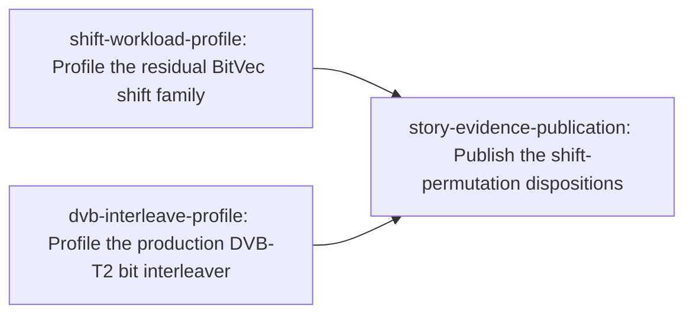

# Plan: Optimize arbitrary-offset shifts and coding permutations (c04dd4ac)

> Planning node: 8ed3ac58. Authoritative graph:
> [breakdown.json](breakdown.json).

## Outcome and criterion approach

| Criterion | Approach | Evidence / open gap |
|---|---|---|
| REQ-01 | Each timed profile freezes a protocol-v4 addendum and ledger reservation before its scheduled benchmark-window run, then publishes an accepted exploratory receipt with complete source, executable, sample, log, checkpoint and runtime provenance. Negative and unavailable outcomes remain durable. | [Measurement contract](../1a379447-zen3-cpu-performance/measurement-contract.md); [protocol](../f547c394/protocol.md) |
| REQ-07 | Workload families remain separate. Residual shifts receive an isolated profile and explicit no-consumer disposition. QC runtime rotation stays inapplicable. The accepted NR no-win remains authoritative while `prepare_llrs` is unchanged. DVB-T2 receives a consumer-backed workload profile. | [Investigation](investigation.md) §Scope, §Exhaustive consumer sweep |
| REQ-08 | This initial breakdown authorizes no intrinsic-specific prototype or production leaf. A material nomination keeps its profile open while planning-time Rust 1.95 compile, assembly, oracle and applicable scalar-fallback evidence is established. The bracket must then be amended and re-reviewed to create candidate leaves, make them depend on the profile and re-home publication behind their sinks. | Investigation §Prior art, feasibility, and fit |
| REQ-09 | The profiles use fixed independent oracles for zero-fill and standards-permutation semantics. Coverage includes offsets 0/1/7/8/63/64/65, overlength shifts, lane crossings, incomplete words, tail padding, aliasing, Normal/Short FECFRAME and 16-/64-QAM order. | Investigation §Scope; `dev/active/eda07788/survey/analysis-output-v3.txt`; `dev/active/eda07788/survey/validation-output-v3-remeasure.txt` |
| REQ-10 | xdsopl `PCTITL` remains the only operation-equivalent DVB comparator. The new profile rebuilds and pins both sides with unpack/copy/pack attribution. AFF3CT's accepted NR no-win is re-used, not repeated, and circular or unmatched operations stay outside the scorecard. | [Prior findings](../eda07788/findings.md) §§1–4; [repaired DVB tables](../../bench_results/eda07788/tables-v3.md) |
| REQ-11 | Shift and DVB profiles report isolated latency/throughput plus actual consumer applicability; DVB additionally reports whole-BICM cost and every representation pass. A no-candidate result retains production. A material candidate blocks profile, publication and story closure until the re-reviewed bracket adds and completes its evidence-backed implementation path. | Investigation §Exhaustive consumer sweep, §Prior art |

## Shared architectural contracts

### `measurement-authority` [plan-fixed] — protocol-complete exploratory profiles

The Zen 3 measurement contract and protocol version 4 are normative. Before
timing, each family freezes an addendum and append-only ledger reservation.
Timed work runs only in a scheduled benchmark window on the prepared host.
Each accepted exploratory receipt pins the producing closure, rebuilt release
executables, semantic fixtures, raw paired samples, bounded append-only log,
checkpoints and runtime-observed host state. Exploratory evidence may nominate
a candidate but never authorizes production. Negative, unavailable and
non-qualifying outcomes remain part of the durable record.

### `semantic-boundaries` [plan-fixed] — distinct operation semantics

`BitVec` shifts are little-endian, zero-filling operations with canonical clean
tails; circular rotation is not equivalent. DVB-T2 bit interleaving is the ETSI
standards permutation over packed bits; xdsopl `PCTITL` is its comparator only
when unpack/copy/pack costs are attributed. NR selection/de-rate matching,
generic puncturing and QC construction are distinct operations. The oracle
matrix covers the boundary cases named under REQ-09 and the existing external
conformance fixtures.

### `family-scope` [plan-fixed] — evidence-driven family disposition

The investigation's exhaustive consumer sweep is authoritative. Residual shifts
have a public primitive but no downstream production consumer, so their current
branch ends at an isolated materiality profile. QC produces construction-time
sparse edges, not a per-frame rotation, so it receives no executable leaf.
AFF3CT NR depuncturing is an accepted no-win and is not remeasured unless
production `prepare_llrs` changes. DVB-T2 BICM is the sole family with both a
production consumer and a measured residual worth profiling.

### `layer-ownership` [plan-fixed] — canonical implementation homes

`gf2-core` owns zero-fill bit storage and safe dispatch, `gf2-coding` owns the
DVB-T2 permutation, and unsafe intrinsic code is permitted only in
`gf2-kernels-simd`. Benchmark adapters and external representations do not enter
public APIs. This breakdown changes no production layer.

### `candidate-bracket-rule` [plan-fixed] — pre-breakdown feasibility barrier

Profiles may name at most two concrete forms within their frozen search budget,
but the initial manifest contains no prototype or production leaf for them. A
no-candidate or no-win profile may close and requires no amendment. A material
nomination keeps its profile open while a planning-time record compiles the form
with Rust 1.95, preserves emitted assembly, proves the semantic oracle and
establishes a tested runtime-gated scalar fallback when capability gating
applies. The bracket is then amended and re-reviewed to create the required
implementation and confirmation leaves, make them depend on the nominating
profile, and re-home publication behind their terminal sinks in the instantiated
dependency graph. Publication and the story remain open until those leaves pass.

### `shift-profile-disposition` [implementation-produced] — residual-shift result

Produced by `shift-workload-profile`. It binds the protocol-complete exploratory
receipt, semantic fixture corpus, runtime paths, latency/throughput tables and
complete consumer result. It is complete only with a no-candidate/no-win result
or after its material nomination has triggered the feasibility-backed bracket
amendment and dependency re-homing required above.

### `dvb-profile-disposition` [implementation-produced] — DVB materiality result

Produced by `dvb-interleave-profile`. It binds the protocol-complete exploratory
receipt, rebuilt gf2/xdsopl arm identities, actual BICM consumers and per-pass
attribution. It is complete only with a no-candidate/no-win result or after at
most two material nominations have triggered the feasibility-backed bracket
amendment and dependency re-homing required above.

## Generated decomposition overview

<!-- jit:breakdown-overview:begin -->
| Key | Title | Type | Outcome | Contracts | Sources | Footprint | Landing | Depends on |
|---|---|---|---|---|---|---|---|---|
| shift-workload-profile | Profile the residual BitVec shift family | simulation | Residual-shift materiality has a protocol-complete disposition | measurement-authority, semantic-boundaries, family-scope, candidate-bracket-rule | REQ-01, REQ-07, REQ-08, REQ-09, REQ-11, INV-CLASSIFICATION, INV-CONSUMERS, INV-ARCHITECTURE, MEASUREMENT-CONTRACT, PROTOCOL-V4 | creates 4, touches 1 | — | — |
| dvb-interleave-profile | Profile the production DVB-T2 bit interleaver | simulation | DVB-T2 interleave materiality has a protocol-complete disposition | measurement-authority, semantic-boundaries, family-scope, layer-ownership, candidate-bracket-rule | REQ-01, REQ-07, REQ-08, REQ-09, REQ-10, REQ-11, INV-CONSUMERS, INV-PRIOR-ART, INV-ARCHITECTURE, EDA07788-FINDINGS, DVB-REPAIR, MEASUREMENT-CONTRACT, PROTOCOL-V4 | creates 4, touches 2 | — | — |
| story-evidence-publication | Publish the shift-permutation dispositions | task | Generated evidence publishes each workload family's current disposition | measurement-authority, semantic-boundaries, family-scope, candidate-bracket-rule, shift-profile-disposition, dvb-profile-disposition | REQ-01, REQ-07, REQ-08, REQ-09, REQ-10, REQ-11, INV-CLASSIFICATION, INV-CONSUMERS, INV-PRIOR-ART, INV-ARCHITECTURE, EDA07788-FINDINGS, DVB-REPAIR, MEASUREMENT-CONTRACT, PROTOCOL-V4 | creates 3 | — | shift-workload-profile, dvb-interleave-profile |

<!-- jit:breakdown-overview:end -->

## Material risks and owner decisions

| Risk / decision | Resolution and rationale |
|---|---|
| Residual AVX2/BMI work could be decomposed before Rust 1.95 feasibility exists. | Chosen: the initial graph ends at the workload disposition. A material nomination keeps the profile open until planning-time compile, assembly, oracle and scalar-fallback evidence supports an amended review that creates the candidate leaves and re-homes publication. Rejected: closing the profile with merely a future-work note. |
| The DVB profile could be mistaken for an informal timing exercise. | Chosen: make it a simulation with a frozen v4 addendum and ledger reservation before timing, exact rebuilt arm pins, scheduled-window execution, raw pairs, durable logs/checkpoints and accepted exploratory receipt. Rejected: profiler output or the repaired v3 exploratory receipt alone as authority. |
| The QC wording suggests a per-frame rotation optimization. | Chosen: preserve QC as inapplicable because production emits sparse coordinates during construction. Rejected: adding a rotation primitive without a consumer, which would create a parallel abstraction and unmatched benchmark. |
| The accepted AFF3CT NR comparison could be repeated without a changed question. | Chosen: retain its no-win and remeasure only if `prepare_llrs` changes. Rejected: another campaign against unchanged production, because it cannot alter adoption and wastes the bounded comparison budget. |
| Older DVB evidence could be mistaken for confirmation. | Chosen: withdrawn warm receipts remain historical, while the repaired exploratory receipt informs cell selection only. The new profile rebuilds and pins exact current arms under protocol v4. Rejected: treating either old collection as candidate confirmation. |
| A profile may nominate a concrete DVB form. | Chosen: the profile, publication and story remain open; the lead applies the bracket amendment, creates and re-homes the implementation/confirmation dependency path, then completes it before publication. Rejected: reporting “not yet decomposed” as a terminal outcome or pre-creating candidate leaves before feasibility is known. |
| Timed work could expand across families without changing a disposition. | Chosen: one exploratory campaign each for shifts and DVB; no QC, generic-puncturing or NR campaign; no candidate pilot, confirmation or holdout in this graph. |

No unresolved user-level architectural choice remains. The conservative defaults
retain current semantics, ownership and production paths. A profile-supported
candidate changes the planning state, not the production state.

## Investigation sources

- [Investigation](investigation.md) — claim classification, exhaustive consumers,
  prior art, primitive verification and architecture fit remain there.
- [Prior shift/permutation findings](../eda07788/findings.md) — comparator mapping,
  preserved negatives and receipt lifecycle.
- [Repaired DVB-T2 evidence tables](../../bench_results/eda07788/tables-v3.md) —
  rebuilt-arm exploratory evidence; old warm sections remain withdrawn.
- [NR de-rate-matching tables](../../bench_results/eda07788/tables-nr-derate.md) —
  accepted AFF3CT no-win retained while `prepare_llrs` is unchanged.

Manifest source-ID universe used by validation:

| Source ID | Meaning |
|---|---|
| REQ-01, REQ-07..REQ-11 | The story's six hard criteria (`jit issue show c04dd4ac`) |
| INV-CLASSIFICATION | Investigation §Scope and classifications |
| INV-CONSUMERS | Investigation §Exhaustive consumer sweep |
| INV-PRIOR-ART | Investigation §Prior art, feasibility, and fit |
| INV-ARCHITECTURE | Investigation architecture-fit and invariant findings |
| MEASUREMENT-CONTRACT | `dev/active/1a379447-zen3-cpu-performance/measurement-contract.md` |
| PROTOCOL-V4 | `dev/active/f547c394/protocol.md` and its v4 amendment |
| EDA07788-FINDINGS | `dev/active/eda07788/findings.md` |
| DVB-REPAIR | Completed warm-pass repair `3e59cb9a` and its repaired exploratory receipt |
