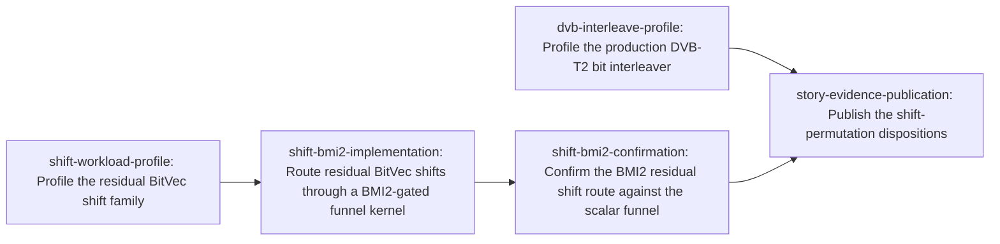

# Plan: Optimize arbitrary-offset shifts and coding permutations (c04dd4ac)

> Planning node: 8ed3ac58. Authoritative graph:
> [breakdown.json](breakdown.json).

## Outcome and criterion approach

| Criterion | Approach | Evidence / open gap |
|---|---|---|
| REQ-01 | Each timed family freezes a protocol-v4 addendum and ledger reservation before its scheduled benchmark-window run, then publishes an accepted receipt with complete source, executable, sample, log, checkpoint and runtime provenance. The candidate's pilot and confirmation carry the production change's pinned before-and-after evidence on one host, with the confirmation addendum derived from the committed pilot receipt. Negative and unavailable outcomes remain durable. | [Measurement contract](../1a379447-zen3-cpu-performance/measurement-contract.md); [protocol](../f547c394/protocol.md) |
| REQ-07 | Workload families remain separate. Residual shifts receive an isolated profile and explicit no-consumer disposition. QC runtime rotation stays inapplicable. The accepted NR no-win remains authoritative while `prepare_llrs` is unchanged. DVB-T2 receives a consumer-backed workload profile. The residual-shift profile's material disposition selects one implementation leaf; the DVB profile's not-material disposition selects none. | [Investigation](investigation.md) §Scope, §Exhaustive consumer sweep; [shift profile](shift-profile.md) §Disposition; [DVB profile](dvb-interleave-profile.md) §Disposition |
| REQ-08 | Each intrinsic-specific form passes the planning-time Rust 1.95 compile and assembly barrier before it reaches a leaf. Both nominated residual-shift forms clear it; the invoker selects the BMI2-gated scalar funnel for implementation and records the AVX2 lane-crossing funnel as feasible and unselected. The selected form's leaf dispatches behind observed capabilities with the present scalar loop as the fallback. | [Feasibility record](shift-feasibility-record.md); Investigation §Prior art, feasibility, and fit |
| REQ-09 | The profiles use fixed independent oracles for zero-fill and standards-permutation semantics, and the candidate's shared behavioural suite holds both its routes to the same independent zero-fill reference. Coverage includes offsets 0/1/7/8/63/64/65, overlength shifts, lane crossings, incomplete words, tail padding, aliasing, Normal/Short FECFRAME and 16-/64-QAM order. | Investigation §Scope; `dev/active/eda07788/survey/analysis-output-v3.txt`; `dev/active/eda07788/survey/validation-output-v3-remeasure.txt` |
| REQ-10 | xdsopl `PCTITL` remains the only operation-equivalent DVB comparator. The new profile rebuilds and pins both sides with unpack/copy/pack attribution. AFF3CT's accepted NR no-win is re-used, not repeated, and circular or unmatched operations stay outside the scorecard. | [Prior findings](../eda07788/findings.md) §§1–4; [repaired DVB tables](../../bench_results/eda07788/tables-v3.md) |
| REQ-11 | Shift and DVB profiles report isolated latency/throughput plus actual consumer applicability; DVB additionally reports whole-BICM cost and every representation pass. The residual-shift kernel lands in the kernel crate and its dispatch in `gf2-core`, and its A/B confirmation reports isolated latency and throughput at the profile's material cells. A not-material profile retains production; a material one blocks publication and story closure until its implementation and confirmation leaves complete. | Investigation §Exhaustive consumer sweep, §Prior art |

## Shared architectural contracts

### `measurement-authority` [plan-fixed] — protocol-complete exploratory profiles

The Zen 3 measurement contract and protocol version 4 are normative. Before
timing, each family freezes an addendum and append-only ledger reservation.
Timed work runs only in a scheduled benchmark window on the prepared host.
Each accepted exploratory receipt pins the producing closure, rebuilt release
executables, semantic fixtures, raw paired samples, bounded append-only log,
checkpoints and runtime-observed host state. Exploratory evidence may nominate
a candidate but never authorizes production. A candidate's confirmatory stage is
a pilot followed by a confirmation whose addendum the canonical freezer derives
from the committed pilot receipt, with both arms the same shipped executable
separated by the test-build lane switch and every cell inside the family's P-20
confirmatory budget. Negative, unavailable and non-qualifying outcomes remain
part of the durable record, and a frozen rule decides retention before the
result is known.

### `semantic-boundaries` [plan-fixed] — distinct operation semantics

`BitVec` shifts are little-endian, zero-filling operations with canonical clean
tails; circular rotation is not equivalent. DVB-T2 bit interleaving is the ETSI
standards permutation over packed bits; xdsopl `PCTITL` is its comparator only
when unpack/copy/pack costs are attributed. NR selection/de-rate matching,
generic puncturing and QC construction are distinct operations. The oracle
matrix covers the boundary cases named under REQ-09 and the existing external
conformance fixtures.

### `family-scope` [plan-fixed] — evidence-driven family disposition

The investigation's exhaustive consumer sweep is authoritative. Residual shifts
have a public primitive but no downstream production consumer, so the family is
measured in isolation and its maintenance cost is the whole cost of any route
added to it. QC produces construction-time sparse edges, not a per-frame
rotation, so it receives no executable leaf. AFF3CT NR depuncturing is an
accepted no-win and is not remeasured unless production `prepare_llrs` changes.
DVB-T2 BICM is the sole family with both a production consumer and a measured
residual worth profiling, and its profile finds that residual not material.

### `layer-ownership` [plan-fixed] — canonical implementation homes

`gf2-core` owns zero-fill bit storage and safe dispatch, `gf2-coding` owns the
DVB-T2 permutation, and unsafe intrinsic code is permitted only in
`gf2-kernels-simd` with an explicit safety contract at every unsafe boundary.
Benchmark adapters and external representations do not enter public APIs. The
one production change in this graph obeys that split: the residual-shift funnel
kernel, its capability-gated scope and its own detected bundle live in
`gf2-kernels-simd`, following the one-bundle-per-kernel-family convention the
crate already uses, while `gf2-core` adds only the safe accessor and the
dispatch consultation, in the shape and behind the non-default `simd` cargo
feature the word-aligned branch already uses. The scalar funnel stays the
fallback.

### `candidate-bracket-rule` [plan-fixed] — feasibility barrier before a candidate leaf

A profile names at most two concrete forms within its frozen search budget, and
no form reaches a leaf on nomination alone. A profile that nominates nothing
closes on its own evidence and adds no leaf. A material nomination holds its
profile open until a planning-time record compiles the form with Rust 1.95,
preserves the emitted assembly, proves the semantic oracle and establishes a
tested runtime-gated scalar fallback where capability gating applies; the bracket
is then amended and re-reviewed so that the selected form gains an implementation
leaf and an A/B confirmation leaf depending on the nominating profile, with
publication re-homed behind the confirmation's sink. A nominated, feasible form
the invoker does not select for implementation stays a recorded outcome with its
reason, never a silent omission.

One family meets that condition. The residual-shift profile nominates an AVX2
lane-crossing funnel and a BMI2-gated scalar funnel; the
[feasibility record](shift-feasibility-record.md) proves both at the MSRV, and
the invoker selects the BMI2 form alone, so this graph carries that form's
implementation and confirmation leaves and the AVX2 form remains feasible,
unselected and recorded. The DVB profile nominates no form, so its branch ends
at that profile. Publication and the story stay open until the selected
candidate's leaves pass.

### `shift-profile-disposition` [implementation-produced] — residual-shift result

Produced by `shift-workload-profile`. It binds the protocol-complete exploratory
receipt, semantic fixture corpus, runtime paths, latency/throughput tables and
complete consumer result. Its disposition is material and nominates two forms, so
the profile completes together with the selected candidate's bracket path: the
material cells it records are the cells the confirmation draws from, and the
empty consumer set it records is the cost side of the argument for maintaining
any route added to this primitive.

### `residual-shift-kernel-route` [implementation-produced] — the gated dispatch surface

Produced by `shift-bmi2-implementation`. It binds the funnel kernel's home in its
own detected bundle in `gf2-kernels-simd`, the `simd` cargo feature and the
runtime capability that select it, the scalar funnel that stays the fallback, the
shared behavioural suite both routes run, the lane witness and the
`test-support`-compiled force switch the confirmation's arms drive, and the
committed assembly artefact for the dispatched path. It authorizes no production
retention: the route ships in order to be measured.

### `shift-candidate-outcome` [implementation-produced] — the candidate's verdict

Produced by `shift-bmi2-confirmation`. It binds the frozen pilot and confirmation
addenda, the family ledger reservations, the accepted receipts, the per-cell
verdicts the acceptance summary records and the retention or removal the frozen
rule produces. A non-qualifying verdict is the outcome rather than a reason to
re-open the rule.

### `dvb-profile-disposition` [implementation-produced] — DVB materiality result

Produced by `dvb-interleave-profile`. It binds the protocol-complete exploratory
receipt, rebuilt gf2/xdsopl arm identities, actual BICM consumers and per-pass
attribution. Its disposition records the packed scatter as not material and
nominates no form, so it completes on its own evidence and leaves the barrier
above unspent; any later nomination re-enters that barrier.

## Generated decomposition overview

<!-- jit:breakdown-overview:begin -->
| Key | Title | Type | Outcome | Contracts | Sources | Footprint | Landing | Depends on |
|---|---|---|---|---|---|---|---|---|
| shift-workload-profile | Profile the residual BitVec shift family | simulation | Residual-shift materiality has a protocol-complete disposition | measurement-authority, semantic-boundaries, family-scope, candidate-bracket-rule | REQ-01, REQ-07, REQ-08, REQ-09, REQ-11, INV-CLASSIFICATION, INV-CONSUMERS, INV-ARCHITECTURE, MEASUREMENT-CONTRACT, PROTOCOL-V4 | creates 4, touches 1 | — | — |
| shift-bmi2-implementation | Route residual BitVec shifts through a BMI2-gated funnel kernel | task | Residual BitVec shifts run a BMI2-gated funnel kernel behind runtime detection | measurement-authority, semantic-boundaries, family-scope, layer-ownership, candidate-bracket-rule, shift-profile-disposition | REQ-07, REQ-08, REQ-09, REQ-11, INV-ARCHITECTURE, MEASUREMENT-CONTRACT, SHIFT-PROFILE, SHIFT-FEASIBILITY | creates 4, touches 4 | — | shift-workload-profile |
| shift-bmi2-confirmation | Confirm the BMI2 residual shift route against the scalar funnel | simulation | The gated residual shift route has a protocol-complete A/B verdict at the profile's material cells | measurement-authority, semantic-boundaries, family-scope, candidate-bracket-rule, shift-profile-disposition, residual-shift-kernel-route | REQ-01, REQ-07, REQ-11, MEASUREMENT-CONTRACT, PROTOCOL-V4, SHIFT-PROFILE | creates 3, touches 3 | — | shift-bmi2-implementation |
| dvb-interleave-profile | Profile the production DVB-T2 bit interleaver | simulation | DVB-T2 interleave materiality has a protocol-complete disposition | measurement-authority, semantic-boundaries, family-scope, layer-ownership, candidate-bracket-rule | REQ-01, REQ-07, REQ-08, REQ-09, REQ-10, REQ-11, INV-CONSUMERS, INV-PRIOR-ART, INV-ARCHITECTURE, EDA07788-FINDINGS, DVB-REPAIR, MEASUREMENT-CONTRACT, PROTOCOL-V4 | creates 4, touches 2 | — | — |
| story-evidence-publication | Publish the shift-permutation dispositions | task | Generated evidence publishes each workload family's current disposition | measurement-authority, semantic-boundaries, family-scope, candidate-bracket-rule, shift-profile-disposition, shift-candidate-outcome, dvb-profile-disposition | REQ-01, REQ-07, REQ-08, REQ-09, REQ-10, REQ-11, INV-CLASSIFICATION, INV-CONSUMERS, INV-PRIOR-ART, INV-ARCHITECTURE, EDA07788-FINDINGS, DVB-REPAIR, MEASUREMENT-CONTRACT, PROTOCOL-V4, SHIFT-PROFILE, SHIFT-FEASIBILITY | creates 3 | — | dvb-interleave-profile, shift-bmi2-confirmation |

<!-- jit:breakdown-overview:end -->

## Material risks and owner decisions

| Risk / decision | Resolution and rationale |
|---|---|
| Residual AVX2/BMI work could be decomposed before Rust 1.95 feasibility exists. | Chosen: a candidate leaf exists only behind the planning-time compile, assembly, oracle and scalar-fallback record, which the residual-shift forms now have, and behind a re-reviewed amendment that also re-homes publication. Rejected: closing a material profile with merely a future-work note. |
| Both nominated residual-shift forms are feasible, and implementing both doubles the kernel surface for one primitive. | Chosen (invoker, 2026-09-18): implement the BMI2-gated scalar funnel only. `BitVec` shifts have no downstream production caller, the BMI2 form is the smallest kernel surface, and the feasibility record ranks it first because it reaches its instructions from the expression the production loop already writes. Rejected: the AVX2 lane-crossing funnel, recorded as nominated, feasible at the MSRV and unselected in this epic rather than dropped; rejected also: implementing both and choosing by measurement, which spends two kernel surfaces and the family's confirmatory budget on a primitive with no consumer. |
| The DVB profile could be mistaken for an informal timing exercise. | Chosen: make it a simulation with a frozen v4 addendum and ledger reservation before timing, exact rebuilt arm pins, scheduled-window execution, raw pairs, durable logs/checkpoints and accepted exploratory receipt. Rejected: profiler output or the repaired v3 exploratory receipt alone as authority. |
| The QC wording suggests a per-frame rotation optimization. | Chosen: preserve QC as inapplicable because production emits sparse coordinates during construction. Rejected: adding a rotation primitive without a consumer, which would create a parallel abstraction and unmatched benchmark. |
| The accepted AFF3CT NR comparison could be repeated without a changed question. | Chosen: retain its no-win and remeasure only if `prepare_llrs` changes. Rejected: another campaign against unchanged production, because it cannot alter adoption and wastes the bounded comparison budget. |
| Older DVB evidence could be mistaken for confirmation. | Chosen: withdrawn warm receipts remain historical, while the repaired exploratory receipt informs cell selection only. The new profile rebuilds and pins exact current arms under protocol v4. Rejected: treating either old collection as candidate confirmation. |
| A profile nominating a concrete form could be reported as "not yet decomposed". | Chosen: a material nomination keeps its profile, publication and story open until the amended bracket's implementation and confirmation leaves complete behind it. Rejected: a terminal "not yet decomposed" outcome, and pre-creating candidate leaves before feasibility is known. |
| Timed work could expand across families without changing a disposition. | Chosen: one exploratory campaign each for shifts and DVB, plus one candidate pilot and confirmation for the selected residual-shift form; no QC, generic-puncturing or NR campaign, and no holdout, since the selector is not calibrated. |
| A shipped candidate route could be retained on an argument made after its measurement. | Chosen: the confirmation's frozen rule decides retention or removal before the result is known, and a non-qualifying verdict removes the dispatched route and retains the scalar funnel. Rejected: keeping a gated route for its assembly or its feasibility alone. |

No unresolved user-level architectural choice remains: the form selection above
is the invoker's. The defaults retain current semantics and layer ownership, and
the single production route this graph adds is gated on an observed capability,
keeps the present scalar funnel as its fallback, and stays only while its
confirmation's frozen rule qualifies it.

## Investigation sources

- [Investigation](investigation.md) — claim classification, exhaustive consumers,
  prior art, primitive verification and architecture fit remain there.
- [Prior shift/permutation findings](../eda07788/findings.md) — comparator mapping,
  preserved negatives and receipt lifecycle.
- [Repaired DVB-T2 evidence tables](../../bench_results/eda07788/tables-v3.md) —
  rebuilt-arm exploratory evidence; old warm sections remain withdrawn.
- [NR de-rate-matching tables](../../bench_results/eda07788/tables-nr-derate.md) —
  accepted AFF3CT no-win retained while `prepare_llrs` is unchanged.
- [Residual-shift workload profile](shift-profile.md) — the material disposition,
  its frozen rule, the material cells and the empty consumer set.
- [Residual-shift feasibility record](shift-feasibility-record.md) — the Rust 1.95
  compile, assembly and fallback evidence for both nominated forms, and the
  toolchain and instruction facts the candidate leaf cites rather than restates.

Manifest source-ID universe used by validation:

| Source ID | Meaning |
|---|---|
| REQ-01, REQ-07..REQ-11 | The story's six hard criteria (`jit issue show c04dd4ac`) |
| INV-CLASSIFICATION | Investigation §Scope and classifications |
| INV-CONSUMERS | Investigation §Exhaustive consumer sweep |
| INV-PRIOR-ART | Investigation §Prior art, feasibility, and fit |
| INV-ARCHITECTURE | Investigation architecture-fit and invariant findings |
| MEASUREMENT-CONTRACT | `dev/active/1a379447-zen3-cpu-performance/measurement-contract.md` |
| PROTOCOL-V4 | `dev/active/f547c394/protocol.md` and its v4 amendment |
| EDA07788-FINDINGS | `dev/active/eda07788/findings.md` |
| DVB-REPAIR | Completed warm-pass repair `3e59cb9a` and its repaired exploratory receipt |
| SHIFT-PROFILE | [`shift-profile.md`](shift-profile.md) and the artifacts its evidence map binds |
| SHIFT-FEASIBILITY | [`shift-feasibility-record.md`](shift-feasibility-record.md) and `survey/residual-shift-feasibility/` |
