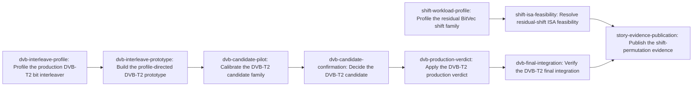

# Plan: Optimize arbitrary-offset shifts and coding permutations (c04dd4ac)

> Planning node: 8ed3ac58. Authoritative graph:
> [breakdown.json](breakdown.json).

## Outcome and criterion approach

| Criterion | Approach | Evidence / open gap |
|---|---|---|
| REQ-01 | Every new timing result uses the shared measurement contract and frozen protocol. Candidate confirmation pins a current pre-change production build; an adopted path receives fresh final-integration evidence. Negative and non-qualifying outcomes remain durable. | [Measurement contract](../1a379447-zen3-cpu-performance/measurement-contract.md); [protocol](../f547c394/protocol.md) |
| REQ-07 | Workload families remain separate. Residual shifts receive an isolated profile and explicit no-consumer disposition. QC runtime rotation stays inapplicable. The accepted NR no-win remains authoritative while `prepare_llrs` is unchanged. DVB-T2 receives the only consumer-backed candidate pipeline. | [Investigation](investigation.md) §Scope, §Exhaustive consumer sweep |
| REQ-08 | No residual-shift production implementation is preplanned. A bounded profile-dependent spike must first compile concrete AVX2 lane-crossing or BMI forms with Rust 1.95 and preserve assembly evidence. DVB prototype work applies the same rule to intrinsic-sensitive constructs. | Investigation §Prior art, feasibility, and fit |
| REQ-09 | The zero-fill and standards-permutation contracts are fixed before candidate work. Shared oracles cover offsets 0/1/7/8/63/64/65, overlength shifts, lane crossings, incomplete words, tail padding, aliasing, Normal/Short FECFRAME and 16-/64-QAM order. | Investigation §Scope; `dev/active/eda07788/survey/analysis-output-v3.txt`; `dev/active/eda07788/survey/validation-output-v3-remeasure.txt` |
| REQ-10 | xdsopl `PCTITL` remains the only operation-equivalent DVB comparator. Its rebuilt arm is measured with explicit unpack/copy/pack costs. AFF3CT's accepted NR no-win is re-used, not repeated, and circular or unmatched operations stay outside the scorecard. | [Prior findings](../eda07788/findings.md) §§1–4; [repaired DVB tables](../../bench_results/eda07788/tables-v3.md) |
| REQ-11 | Shift and DVB profiles report isolated latency/throughput and actual consumer applicability. DVB candidate evidence additionally reports whole-BICM cost and every representation pass. A qualifying candidate lands only in its owning library layer; a no-win keeps production unchanged. | Investigation §Exhaustive consumer sweep, §Prior art |

## Shared architectural contracts

### `measurement-authority` [plan-fixed] — frozen evidence and adoption rules

The Zen 3 measurement contract and protocol version 4 are normative. Timed work
runs only in scheduled benchmark windows on the prepared host. Receipts pin
producing content, release executables, semantic fixtures, addenda, bounded logs,
checkpoints and runtime-observed host state. Exploratory data selects workloads
or settings but never authorizes production. Confirmation applies predeclared
worthwhile-effect, equivalence, material-gap and complexity rules. A production
change additionally requires current before evidence and fresh final-integration
evidence. Accepted `qualifies: false` receipts remain negative evidence.

### `semantic-boundaries` [plan-fixed] — distinct operation semantics

`BitVec` shifts are little-endian, zero-filling operations with canonical clean
tails; circular rotation is not equivalent. DVB-T2 bit interleaving is the ETSI
standards permutation over packed bits; xdsopl `PCTITL` is its comparator only
when unpack/copy/pack costs are attributed. NR selection/de-rate matching,
generic puncturing and QC construction are distinct operations. The oracle
matrix covers the boundary cases named under REQ-09 and the existing external
conformance fixtures.

### `family-scope` [plan-fixed] — evidence-driven family disposition

The investigation's exhaustive consumer sweep is authoritative. Residual shifts
have a public primitive but no downstream production consumer, so their work
ends with an isolated profile and feasibility disposition unless new consumer
evidence triggers a plan amendment. QC produces construction-time sparse edges,
not a per-frame rotation, so it receives no executable leaf. AFF3CT NR
depuncturing is an accepted no-win and is not remeasured unless production
`prepare_llrs` changes. DVB-T2 BICM is the sole family with both a production
consumer and a measured residual worth investigating.

### `layer-ownership` [plan-fixed] — canonical implementation homes

`gf2-core` owns zero-fill bit storage and safe dispatch, `gf2-coding` owns the
DVB-T2 permutation, and unsafe intrinsic code is permitted only in
`gf2-kernels-simd`. Prototype code stays outside production. A selected reusable
primitive lands at its natural library boundary with a tested scalar fallback;
benchmark adapters and external representations do not enter public APIs.

### `shift-profile-disposition` [implementation-produced] — residual-shift profile

Produced by `shift-workload-profile`. It binds the accepted exploratory receipt,
semantic fixture corpus, selected runtime paths, latency/throughput tables and
the observed production-consumer disposition. The ISA feasibility spike and
final publication consume this record; feasibility alone cannot override its
materiality result.

### `dvb-profile-disposition` [implementation-produced] — bounded candidate direction

Produced by `dvb-interleave-profile`. It identifies the measured production hot
path, actual BICM consumers, per-pass attribution, rebuilt arm identities and at
most two profile-supported candidate forms within a fixed search budget. The
prototype and pilot consume the record.

### `dvb-selection-settings` [implementation-produced] — pilot-frozen confirmation input

Produced by `dvb-candidate-pilot`. It binds the candidate identity selected from
exploratory data, pilot-derived resolution, frozen effect margins, complexity
budget, comparison family and exact confirmation cells. A no-selection record is
also a complete value and authorizes no confirmation attempt.

### `dvb-adoption-verdict` [implementation-produced] — production decision

Produced by `dvb-candidate-confirmation`. It names exactly one qualifying
candidate or requires retention of the current implementation. The production
task follows that verdict mechanically; an accepted non-qualifying result never
becomes an adoption.

### `dvb-final-verdict` [implementation-produced] — integrated evidence result

Produced by `dvb-final-integration`. For an adopted candidate it binds fresh
holdout evidence from the actual production route against the pinned before
build. For retention it binds a content-identity proof and launches no redundant
after campaign. The generated story publication consumes this final state.

## Generated decomposition overview

<!-- jit:breakdown-overview:begin -->
| Key | Title | Type | Outcome | Contracts | Sources | Footprint | Landing | Depends on |
|---|---|---|---|---|---|---|---|---|
| shift-workload-profile | Profile the residual BitVec shift family | task | Residual-shift cost and production materiality have a reproducible disposition | measurement-authority, semantic-boundaries, family-scope | REQ-01, REQ-07, REQ-09, REQ-11, INV-CLASSIFICATION, INV-CONSUMERS, MEASUREMENT-CONTRACT, PROTOCOL-V4 | creates 2, touches 1 | — | — |
| shift-isa-feasibility | Resolve residual-shift ISA feasibility | task | Residual-shift ISA feasibility is resolved without an evidence-free production path | semantic-boundaries, layer-ownership, shift-profile-disposition | REQ-08, REQ-09, INV-ARCHITECTURE, INV-CLASSIFICATION | creates 1 | — | shift-workload-profile |
| dvb-interleave-profile | Profile the production DVB-T2 bit interleaver | task | The DVB-T2 scatter cost has a production-grounded profile and bounded candidate direction | measurement-authority, semantic-boundaries, family-scope, layer-ownership | REQ-01, REQ-07, REQ-10, REQ-11, INV-CONSUMERS, INV-PRIOR-ART, EDA07788-FINDINGS, DVB-REPAIR, MEASUREMENT-CONTRACT | creates 2, touches 2 | — | — |
| dvb-interleave-prototype | Build the profile-directed DVB-T2 prototype | task | Profile-authorized DVB-T2 candidates are frozen with semantic and assembly evidence | semantic-boundaries, layer-ownership, dvb-profile-disposition | REQ-08, REQ-09, REQ-11, INV-ARCHITECTURE, INV-CONSUMERS | creates 1 | dvb-interleave-candidate | dvb-interleave-profile |
| dvb-candidate-pilot | Calibrate the DVB-T2 candidate family | simulation | The DVB-T2 candidate family has frozen settings and a pilot-derived selection | measurement-authority, semantic-boundaries, dvb-profile-disposition | REQ-01, REQ-07, REQ-09, REQ-10, REQ-11, PROTOCOL-V4, EDA07788-FINDINGS, DVB-REPAIR | creates 2 | dvb-interleave-candidate | dvb-interleave-prototype |
| dvb-candidate-confirmation | Decide the DVB-T2 candidate | simulation | The pilot-selected DVB-T2 candidate has a frozen adoption verdict | measurement-authority, semantic-boundaries, dvb-selection-settings | REQ-01, REQ-07, REQ-10, REQ-11, MEASUREMENT-CONTRACT, PROTOCOL-V4 | creates 2 | dvb-interleave-candidate | dvb-candidate-pilot |
| dvb-production-verdict | Apply the DVB-T2 production verdict | enhancement | Production DVB-T2 interleaving exactly matches the evidence-backed verdict | semantic-boundaries, layer-ownership, dvb-adoption-verdict | REQ-01, REQ-08, REQ-09, REQ-11, INV-ARCHITECTURE, INV-CONSUMERS | touches 2, uncertain | dvb-interleave-candidate | dvb-candidate-confirmation |
| dvb-final-integration | Verify the DVB-T2 final integration | simulation | The DVB-T2 production verdict has independent final-integration evidence | measurement-authority, semantic-boundaries, dvb-adoption-verdict | REQ-01, REQ-07, REQ-09, REQ-10, REQ-11, MEASUREMENT-CONTRACT, PROTOCOL-V4 | creates 2 | dvb-interleave-candidate | dvb-production-verdict |
| story-evidence-publication | Publish the shift-permutation evidence | task | Generated evidence maps each workload family to its current adoption disposition | measurement-authority, semantic-boundaries, family-scope, shift-profile-disposition, dvb-final-verdict | REQ-01, REQ-07, REQ-08, REQ-09, REQ-10, REQ-11, INV-CLASSIFICATION, INV-CONSUMERS, INV-PRIOR-ART, INV-ARCHITECTURE, EDA07788-FINDINGS, DVB-REPAIR | creates 3 | — | shift-isa-feasibility, dvb-final-integration |

<!-- jit:breakdown-overview:end -->

## Material risks and owner decisions

| Risk / decision | Resolution and rationale |
|---|---|
| Residual AVX2/BMI work could become instruction-driven rather than consumer-driven. | Chosen: profile the current public operation first, then permit only an isolated Rust 1.95/assembly feasibility spike. Rejected: a pre-created production SIMD leaf, because the exhaustive sweep finds no downstream production consumer and REQ-07 requires materiality. |
| The QC wording suggests a per-frame rotation optimization. | Chosen: preserve QC as inapplicable because production emits sparse coordinates during construction. Rejected: adding a rotation primitive without a consumer, which would create a parallel abstraction and an unmatched benchmark. |
| The accepted AFF3CT NR comparison could be repeated without a changed question. | Chosen: retain its no-win and remeasure only if `prepare_llrs` changes. Rejected: another campaign against unchanged production, because it cannot alter adoption and wastes the bounded comparison budget. |
| Older DVB evidence could be mistaken for confirmation. | Chosen: withdrawn warm receipts remain historical, while the repaired exploratory receipt informs profiling only. Candidate work rebuilds exact arms and produces fresh protocol-v4 evidence. Rejected: treating either old collection as candidate confirmation. |
| A pilot may select no candidate. | Chosen: the produced settings contract supports an explicit no-selection value. Downstream work then records retention without spending a confirmatory attempt or running a holdout. Rejected: forcing confirmation or production change after a no-win. |
| Candidate implementation could cross ownership boundaries. | Chosen: DVB ordering remains in `gf2-coding`; only a genuinely general primitive may land in `gf2-core`, and unsafe code remains isolated to `gf2-kernels-simd`. Rejected: importing benchmark adapters or xdsopl representations into the public API. |
| Multiple candidate campaigns could exceed the useful search budget. | Chosen: profile first, cap the prototype set at two, run one pilot, confirm at most one candidate, and run a holdout only after adoption. Rejected: open-ended search or remeasurement of families whose disposition cannot change. |

No unresolved user-level architectural choice remains. The conservative defaults
retain current semantics, ownership and production paths unless qualifying
evidence authorizes the single DVB-T2 candidate.

## Investigation sources

- [Investigation](investigation.md) — claim classification, exhaustive consumers,
  prior art, primitive verification and architecture fit remain there.
- [Prior shift/permutation findings](../eda07788/findings.md) — comparator mapping,
  preserved negatives and receipt lifecycle.
- [Repaired DVB-T2 evidence tables](../../bench_results/eda07788/tables-v3.md) —
  rebuilt-arm exploratory evidence; old warm sections remain withdrawn.
- [NR de-rate-matching tables](../../bench_results/eda07788/tables-nr-derate.md) —
  accepted AFF3CT no-win retained while `prepare_llrs` is unchanged.

Manifest source-ID universe used by validation:

| Source ID | Meaning |
|---|---|
| REQ-01, REQ-07..REQ-11 | The story's six hard criteria (`jit issue show c04dd4ac`) |
| INV-CLASSIFICATION | Investigation §Scope and classifications |
| INV-CONSUMERS | Investigation §Exhaustive consumer sweep |
| INV-PRIOR-ART | Investigation §Prior art, feasibility, and fit |
| INV-ARCHITECTURE | Investigation architecture-fit and invariant findings |
| MEASUREMENT-CONTRACT | `dev/active/1a379447-zen3-cpu-performance/measurement-contract.md` |
| PROTOCOL-V4 | `dev/active/f547c394/protocol.md` and its v4 amendment |
| EDA07788-FINDINGS | `dev/active/eda07788/findings.md` |
| DVB-REPAIR | Completed warm-pass repair `3e59cb9a` and its repaired exploratory receipt |
