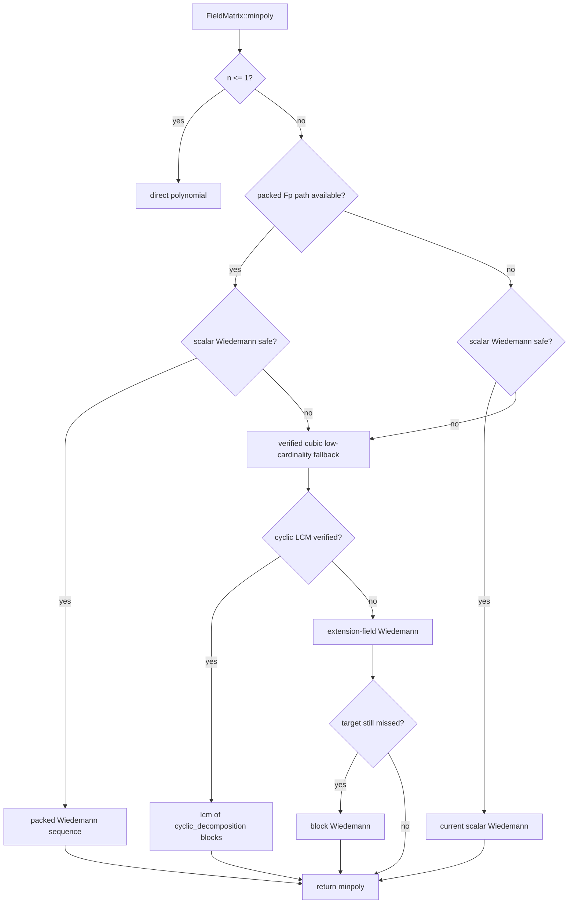

# Minpoly SOTA Implementation Plan

**Issue:** `d1dd266c`
**Type:** `task`
**Priority:** `normal`

## Problem Statement

`d1dd266c` must finish the minimal-polynomial portion of the `gf2-core` SOTA performance epic without relying on unapproved exclusions. The current implementation added a scalar Wiedemann front-end and improved large-field rows, but several hard target rows remain above the accepted fflas-ffpack reference by more than the project contract allows.

The implementation goal is strict: on the current AMD Ryzen 9 5900X Zen 3 host, every in-scope `minpoly` target row must be at or below the 1.5x wall-clock ceiling versus the accepted fflas-ffpack reference, while preserving mathematical correctness and documenting the complexity normalizer used for each algorithmic path.

## Success Criteria

- [hard] `minpoly` target rows meet the 1.5x threshold on this host with no unapproved exclusions.
- [hard] The production `FieldMatrix::minpoly` dispatch uses a mathematically valid non-quartic path for low-cardinality fields where scalar Wiedemann is unsafe.
- [hard] Packed prime-field matvec/minpoly sequence generation is used where scalar row-by-row dot products cannot meet the target rows.
- [hard] Throughput normalization remains aligned with documented complexity per algorithm class.
- [hard] Correctness is verified by adversarial and randomized tests: the returned minimal polynomial annihilates $A$, divides the characteristic polynomial, and matches an independent reference on small matrices.
- [hard] Final evidence records raw wall times, ratios, algorithm class, and normalizer for every target row.

## Reference Targets

The accepted reference is `dev/bench_results/2026-05-04-c3e79272-minpoly-reference.csv`, using the fflas-ffpack `minpoly` rows. The hard ceiling is $1.5 \times$ the fflas wall time.

| Cell | fflas wall time | Hard ceiling |
|---|---:|---:|
| `GF(2^31-1), n=64` | 1.679 ms | 2.519 ms |
| `GF(2^31-1), n=256` | 81.532 ms | 122.298 ms |
| `GF(65521), n=64` | 0.522 ms | 0.783 ms |
| `GF(65521), n=256` | 17.195 ms | 25.792 ms |
| `GF(251), n=64` | 0.135 ms | 0.202 ms |
| `GF(251), n=256` | 1.634 ms | 2.451 ms |
| `GF(7), n=64` | 0.569 ms | 0.854 ms |
| `GF(7), n=256` | 20.290 ms | 30.435 ms |

The previous Wiedemann implementation already closes the `GF(2^31-1)` rows and `GF(65521), n=64`; the remaining plan focuses on closing `GF(65521), n=256`, `GF(251), n=64`, `GF(251), n=256`, and both `GF(7)` rows.

## Current State

The current `FieldMatrix::minpoly` implementation is in `crates/gf2-core/src/field/charpoly.rs`:

- `minpoly_dispatch` uses scalar Wiedemann when the conservative field-cardinality gate passes: $2^{\lfloor \log_2 q \rfloor} > n$.
- Scalar Wiedemann is correct and fast enough for sufficiently large fields, but unsafe as the only Las Vegas path when $q \le n$.
- When the gate fails, the code falls back to `find_max_minpoly_generator`, which computes many per-vector Krylov annihilators and accumulates their LCM. This path is effectively quartic at the target sizes.
- `cyclic_decomposition` already builds a deterministic cubic Krylov decomposition and its documentation states that block-polynomial LCM is the minimal polynomial. This is the most promising immediate replacement for the quartic fallback, but it must be verified before use.
- `FieldMatrix::matvec` currently evaluates rows through slice dot products. Existing packed AVX2 kernels for small and medium primes live in `crates/gf2-kernels-simd/src/{fp_small,fp_medium}.rs` and `crates/gf2-kernels-simd/src/x86/{fp_small,fp_medium}.rs`, but repeated minpoly matvecs still pay avoidable packing/allocation overhead.

## Design

The implementation should combine algorithmic replacement with packed arithmetic. Algorithmic work closes the low-cardinality rows; packed arithmetic closes the constant-factor rows.

### Algorithm policy

Use this decision order:

1. Keep scalar Wiedemann for rows that already pass and for non-packed fields where it remains the best available path.
2. For `Fp
` with `P <= 251` or `252 <= P < 65536`, pack the matrix once per `minpoly` call and keep Krylov vectors in packed canonical form while generating Wiedemann sequences.
3. For fields where scalar Wiedemann is unsafe because $q \le n$, first validate `lcm(cyclic_decomposition(A).poly)` as a deterministic cubic minimal-polynomial path.
4. If cyclic LCM is not valid for all tested/adversarial cases, use extension-field scalar Wiedemann before attempting full block Wiedemann:
   - Embed the base-field matrix in $F_{q^k}$ with $q^k > n$.
   - Run scalar Wiedemann over the extension.
   - Verify the result descends to base-field coefficients and annihilates the original matrix over the base field.
5. Use block Wiedemann only if the cyclic and extension-field paths cannot satisfy correctness and target performance.

### Packed arithmetic policy

The packed path must avoid per-row/per-dot conversion costs inside minpoly sequence generation:

- For `P <= 251`, store the packed dense matrix and vectors as canonical `u8`.
- For `252 <= P < 65536`, store the packed dense matrix and vectors as canonical or raw `u16`, matching the existing kernel contract.
- Use existing AVX2 dot/panel kernels as the initial building blocks.
- Add a dense matvec entry point that computes $y = A x$ from packed matrix and packed vector without materializing `FieldVec<F>` rows.
- Add a scalar projection entry point that computes $s_k = v^T A^k u$ directly from packed vectors.
- Keep a scalar fallback for non-AVX2 hosts and for builds without the `simd` feature.

### Complexity and normalizer policy

`minpoly` no longer has a single honest complexity class across all dispatch arms. Evidence and docs must report the class selected per row:

| Algorithm path | Expected complexity | Normalizer |
|---|---:|---:|
| Scalar Wiedemann | $O(n^3)$ | $n^3$ |
| Packed Wiedemann | $O(n^3)$ | $n^3$ |
| Verified cyclic fallback | $O(n^3)$ | $n^3$ |
| Extension-field Wiedemann | $O(n^3)$ over extension arithmetic | $n^3$ plus field-extension note |
| Block Wiedemann | $O(n^3)$ at target sizes | $n^3$ plus block-size note |
| Legacy per-vector LCM reference | $O(n^4)$ | $n^4$ |

The acceptance evidence should rely on wall-clock ratios for the hard SOTA criterion, with throughput reported as supporting context using the row's actual algorithm normalizer.

## Implementation Steps

1. Establish the strict baseline and acceptance harness.
   - Re-run `charpoly/minpoly_ref` with `RUSTFLAGS="-C target-cpu=native"` and record current medians for all eight rows.
   - Add a small script or checked table in the evidence doc that computes each row's ratio against `dev/bench_results/2026-05-04-c3e79272-minpoly-reference.csv`.

2. Add correctness tests before changing dispatch.
   - Add nilpotent Jordan-block tests over `Fp<7>` and `Fp<251>` for $J_2$, $J_3$, and direct sums such as $J_2 \oplus J_1$.
   - Add randomized small-matrix tests comparing the candidate path to the legacy per-vector LCM reference.
   - Assert that the candidate minimal polynomial annihilates $A$ and divides `charpoly(A)`.

3. Validate the cubic cyclic fallback.
   - Implement an internal test-only helper that returns `lcm(cyclic_decomposition(A).poly)`.
   - Run it against the adversarial and randomized tests.
   - If valid, promote it to the low-cardinality production fallback and retain the legacy quartic path only as a debug/test reference.
   - If invalid, document the counterexample and proceed to extension-field Wiedemann.

4. Add packed medium-prime dense matvec for `GF(65521)`.
   - Reuse `fp_medium_batch_dot` and existing packing helpers.
   - Pack the dense matrix once per minpoly call.
   - Reuse packed scratch vectors for each Wiedemann step.
   - Add tests comparing packed matvec to `FieldMatrix::matvec` across boundary sizes.
   - Benchmark `GF(65521), n=256` against the 25.792 ms ceiling.

5. Add packed small-prime dense matvec and projection for `GF(251)` and `GF(7)`.
   - Reuse `fp_small_batch_dot` / row-panel kernels and canonical `u8` packing.
   - Keep vectors packed during sequence generation.
   - Add boundary tests for lengths `0, 1, 15, 16, 17, 63, 64, 65, 255, 256`.
   - Benchmark `GF(251), n=64` against the 0.202 ms ceiling.

6. Close the low-cardinality rows.
   - Use the verified cubic fallback for `GF(7), n=64`, `GF(7), n=256`, and `GF(251), n=256` if it meets the ceilings.
   - If `GF(251), n=256` misses after cyclic fallback plus packed arithmetic, implement extension-field Wiedemann over a degree-2 extension first.
   - If `GF(7)` misses after cyclic fallback plus packed arithmetic, implement extension-field Wiedemann with the minimum degree that satisfies $7^k > n$, using a safety margin if benchmarks require it.
   - Escalate to block Wiedemann only if extension-field Wiedemann cannot meet both correctness and wall-time targets.

7. Update public documentation and benchmark documentation.
   - Update `FieldMatrix::minpoly` rustdoc to describe expected and worst-case complexity after the legacy quartic path is removed from production dispatch.
   - Update benchmark/evidence documentation so normalizer selection is explicit per algorithm.
   - Update `dev/bench_results/2026-05-07-d1dd266c-minpoly-tuning.md` or add a successor evidence doc with final raw Criterion output and ratios.

8. Pass required gates.
   - Required gates for `d1dd266c`: `code-review`, `cargo-ci`, and `doc-review`.
   - Run the fast project validation commands only; do not run ignored slow tests.

## Testing Approach

Correctness tests:

- Unit tests for packed dense matvec against scalar `FieldMatrix::matvec`.
- Unit tests for scalar projection from packed vectors against `FieldVec::dot_product`.
- Adversarial nilpotent/Jordan tests for minimal polynomial degree.
- Random small-matrix tests over `Fp<7>`, `Fp<251>`, `Fp<65521>`, and `Fp<2^31-1>`.
- Property checks that `mp(A) = 0` and `mp | charpoly(A)`.

Performance tests:

- `RUSTFLAGS="-C target-cpu=native" cargo bench -p gf2-core --bench charpoly --features simd -- charpoly/minpoly_ref`
- Focus first on the failing rows and rerun the full eight-row group for final evidence.
- Record the selected algorithm per row and compare wall time to the hard ceilings in this plan.

Project validation:

- `cargo fmt --all -- --check`
- `cargo nextest run --workspace --all-features --release --profile ci`
- `cargo clippy --workspace --all-targets --all-features -- -D warnings`

## Risks and Open Questions

- `cyclic_decomposition` LCM may not be a valid minimal-polynomial computation for all matrices despite the current documentation. This is the primary correctness risk and must be resolved before dispatch changes.
- `GF(251), n=256` is the hardest target because it combines the low-cardinality algorithm gap with a very aggressive fflas small-prime constant factor.
- Row-by-row SIMD dot hooks are unlikely to be enough for the tight `GF(251)` rows; packing must be amortized across the whole minpoly call.
- Extension-field Wiedemann is lower implementation risk than block Wiedemann, but it requires careful coefficient descent back to the base field.
- Block Wiedemann is closest to the SOTA reference family but has the largest implementation and correctness risk due to matrix minimal-generator machinery.
