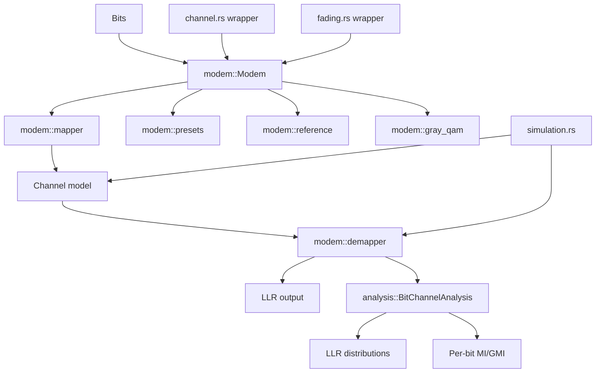
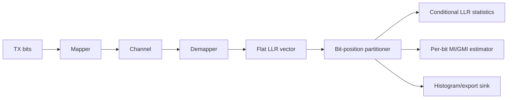

# General Modem Framework and Bit-Channel Analysis Design

**Issue:** `d4851c3d`  
**Type:** `epic`  
**Priority:** `high`  
**Date:** `2026-04-12`

## Problem Statement

`gf2-coding` currently has modem functionality split across `channel.rs`, `modulation.rs`, and `fading.rs`. That fragmentation is tolerable for BPSK and a placeholder QPSK path, but it does not scale to arbitrary constellations, high-performance Gray square QAM, or research-grade bit-channel analysis.

This work introduces a single shared modem implementation that supports arbitrary constellations and labelings, optimized Gray-coded square-QAM presets, and explicit bit-channel analysis. The design must preserve performance: analysis functionality is required, but ordinary simulations must not pay for it when they do not use it.

## Success Criteria

- [ ] The crate exposes an ergonomic modem framework that supports arbitrary constellations and arbitrary bit mappings.
- [ ] Gray-coded square-QAM presets for QPSK, 16-QAM, 64-QAM, and 256-QAM exist and are the optimized default path for common BICM workflows.
- [ ] Existing BPSK/AWGN and QPSK/Rician simulation flows run through framework-backed adapters rather than bespoke modem implementations.
- [ ] Soft-decision demapping is validated against reference formulas and tests for AWGN and the current fading use cases.
- [ ] Bit-channel analysis tools can evaluate per-bit LLR behavior and information metrics without penalizing non-analysis simulation paths.
- [ ] Benchmarks cover generic versus specialized modem paths, and the accelerator interface is ready for SIMD and future GPU backends.
- [ ] The downstream DVB-T2 integration story `003e4088` can consume the new modem surface without bespoke glue.

## Design

### Design goals

1. **Single source of truth** for modem functionality. No parallel bespoke BPSK, QPSK, or simulation-local modem implementations remain after migration.
2. **Two-tier implementation model**: a correctness-first arbitrary-constellation reference path plus an optimized Gray square-QAM fast path.
3. **Bit-channel analysis is first-class**, not an afterthought.
4. **Zero-overhead when analysis is disabled**. Normal simulations must not perform analysis-specific branching, bookkeeping, or allocation in the hot path.
5. **Accelerator-friendly batching**. The public shape must support scalar, SIMD, and future GPU backends without API churn.

### Non-goals

- Replacing channel models with a second unrelated abstraction family
- Adding a second modem implementation only for analysis
- Forcing GPU delivery in the first production milestone

### Architecture overview



### Module layout draft

The design keeps modem functionality under one top-level surface:

```text
crates/gf2-coding/src/
  modem/
    mod.rs
    types.rs          # points, labels, normalization, demap mode
    builder.rs        # validated construction
    mapper.rs         # shared batch mapper traits and dispatch
    demapper.rs       # shared batch demapper traits and dispatch
    reference.rs      # arbitrary-constellation reference path
    gray_qam.rs       # optimized Gray square-QAM path
    analysis.rs       # bit-channel metadata, collectors, MI/GMI estimators
    awgn.rs           # framework-backed AWGN adapter
    fading.rs         # framework-backed fading adapter hooks
```

`channel.rs`, `modulation.rs`, and the existing fading-facing QPSK code become wrappers over `modem/` during migration and are then reduced to thin compatibility surfaces or deleted if the public API no longer needs them.

### Public API draft

The core API should be batch-oriented and explicit about demapper semantics:

```rust
pub enum DemapMethod {
    ExactLogMap,
    MaxLog,
}

pub enum Normalization {
    UnitAverageSymbolEnergy,
    ExplicitEs(f32),
}

pub struct SymbolPoint {
    pub i: f32,
    pub q: f32,
}

pub struct LabelWord {
    pub bits: u16,
    pub width: u8,
}

pub struct BitChannelId {
    pub bit_index: u8,
}

pub struct ModemSpec {
    pub points: Vec<SymbolPoint>,
    pub labels: Vec<LabelWord>,
    pub normalization: Normalization,
}

pub struct DemapInput<'a> {
    pub rx_i: &'a [f32],
    pub rx_q: &'a [f32],
    pub gain_i: Option<&'a [f32]>,
    pub gain_q: Option<&'a [f32]>,
    pub noise_var: &'a [f32],
    pub method: DemapMethod,
}

pub trait BatchMapper {
    fn map_bits(&self, bits: &[bool], out_i: &mut [f32], out_q: &mut [f32]);
}

pub trait BatchSoftDemapper {
    fn demap_llrs(&self, input: DemapInput<'_>, out_llrs: &mut [Llr]);
}
```

### Zero-overhead analysis split

The hot demapper entry point must remain analysis-free. Bit-channel analysis should live behind a separate surface rather than a runtime flag inside the normal demapper loop:

```rust
pub struct BitChannelAnalysisConfig {
    pub histogram_bins: usize,
    pub llr_clip: f32,
    pub collect_histograms: bool,
    pub collect_moments: bool,
    pub estimate_gmi: bool,
}

pub trait BitChannelAnalyzer {
    fn analyze_llrs(
        &mut self,
        bits: &[bool],
        llrs: &[Llr],
        bits_per_symbol: usize,
    );
}

pub fn run_bit_channel_analysis<M: BatchSoftDemapper>(
    modem: &M,
    input: DemapInput<'_>,
    tx_bits: &[bool],
    cfg: &BitChannelAnalysisConfig,
    sink: &mut impl BitChannelAnalyzer,
) {
    // Analysis-only orchestration layer.
}
```

The normal simulation path uses `demap_llrs(...)` directly. Analysis runs use a distinct orchestration layer that may call the same demapper implementation but never injects analysis work into the default hot loop. This is the key design choice that preserves performance.

### Demapper semantics

The design supports both **exact log-MAP** and **max-log**, with **exact log-MAP as the analysis reference**.

For bit position $k$, define the symbol subsets
$\mathcal{X}_{k,0}$ and $\mathcal{X}_{k,1}$ according to the bit labels.
The exact LLR is

$$
L_k(y) =
\log
\frac{\sum_{x \in \mathcal{X}_{k,0}}
\exp\left(-\frac{\lVert y - h x \rVert^2}{N_0}\right)}
{\sum_{x \in \mathcal{X}_{k,1}}
\exp\left(-\frac{\lVert y - h x \rVert^2}{N_0}\right)}.
$$

The max-log approximation is

$$
L_k^{\text{max-log}}(y)
\approx
\frac{1}{N_0}
\left(
\min_{x \in \mathcal{X}_{k,1}} \lVert y - h x \rVert^2
-
\min_{x \in \mathcal{X}_{k,0}} \lVert y - h x \rVert^2
\right).
$$

Design consequences:

1. **Exact log-MAP** must be available for analysis, validation, and reference behavior.
2. **Max-log** must be available as a performance-oriented demapper mode.
3. Analysis results must record which demapper semantics were used.
4. The fast Gray-QAM path may optimize max-log heavily, but it must still validate against the exact reference path.

### Bit-channel analysis design

Bit-channel analysis is not just "extra logging." It is a structured view of the modem as $m$ binary-input subchannels for $M = 2^m$ constellations.



The analysis layer should support:

1. **Per-bit conditional LLR statistics**
   - empirical moments of $L_k$
   - conditional moments of $L_k \mid B_k = 0$ and $L_k \mid B_k = 1$
   - optional histograms or exportable sample summaries

2. **Per-bit information metrics**
   - bitwise mutual information
   - generalized mutual information

3. **Bit identity**
   - each LLR position must map unambiguously back to a bit position within a symbol
   - Gray-QAM presets must expose this identity predictably

For empirical MI, the design can estimate

$$
I(B_k; L_k)
=
1 -
\mathbb{E}
\left[
\log_2
\left(
1 + \exp\left(-(1 - 2B_k)L_k\right)
\right)
\right].
$$

For BICM-style aggregate information, use

$$
\mathrm{GMI} = \sum_{k=0}^{m-1} I(B_k; L_k).
$$

### Gray square-QAM fast path

The optimized Gray-QAM path should use the structure of square constellations instead of treating them as arbitrary point clouds.

Key design points:

1. Construct square-QAM presets from two Gray-coded PAM axes.
2. Keep lookup tables precomputed and cache-friendly.
3. Use batch I/Q slices and caller-provided output buffers.
4. Avoid per-symbol heap allocation.
5. Separate algorithm selection from the public API:
   - generic reference
   - specialized scalar Gray-QAM
   - SIMD-enabled Gray-QAM
   - future GPU batch path

The reference path remains the analysis and validation baseline. The fast path is never a second source of truth for labeling or semantics.

### Simulation integration

`simulation.rs` should consume the modem framework as composition rather than embedding modem behavior.

Design draft:

1. `BpskAwgnChannel` becomes a framework-backed preset wrapper.
2. The current QPSK/Rician flow becomes a framework-backed preset wrapper.
3. Ordinary coded and uncoded simulations call the shared modem path directly.
4. Bit-channel analysis becomes an explicit simulation option that routes to the analysis layer without altering the normal path.

### Migration strategy

Migration is complete only when there is one shared modem implementation.

1. Introduce `modem/` and the new shared construction and demap APIs.
2. Move arbitrary-constellation and Gray-QAM functionality onto that surface.
3. Rewire AWGN and fading integration to call the shared modem implementation.
4. Replace BPSK and QPSK compatibility surfaces with wrappers over the shared implementation.
5. Delete duplicated modem implementations. Do not add deprecation shims.

### GPU and SIMD strategy

CPU scalar plus SIMD are required. GPU remains conditional.

The stable contract for acceleration is the batch demapper shape, not a separate public API. SIMD and GPU backends should consume the same normalized modem metadata and batch-oriented demap requests.

Bit-channel analysis must not force accelerator backends to pay for observability unless an analysis path explicitly requests it.

### Design drafts for concrete responsibilities

| Area | Shared source of truth | Fast path allowed | Analysis role |
|---|---|---|---|
| Constellation geometry | `modem::types` + `modem::builder` | No separate geometry definitions | Reads shared metadata only |
| Arbitrary mapping | `modem::reference` | No | Baseline behavior |
| Gray-QAM mapping/demapping | `modem::gray_qam` using shared metadata | Yes | Validated against reference |
| AWGN integration | `modem::awgn` | Yes, through shared demap contract | Optional sideband only |
| Rician integration | `modem::fading` hooks | Yes, through shared demap contract | Optional sideband only |
| Bit-channel analysis | `modem::analysis` | No second modem implementation | Observes shared outputs |

## Implementation Steps

1. Create the shared modem data model, builder, normalization contract, and batch demapper interface in `crates/gf2-coding/src/modem/`.
2. Implement the arbitrary-constellation reference mapper and exact log-MAP demapper as the correctness baseline.
3. Implement Gray-coded square-QAM presets plus the optimized scalar and SIMD-friendly fast path.
4. Introduce `DemapMethod` selection with exact log-MAP and max-log, and thread it through modem-facing APIs.
5. Add `modem::analysis` with bit-channel identifiers, conditional LLR collectors, histogram/statistics sinks, and MI/GMI estimators.
6. Integrate opt-in bit-channel analysis into simulation orchestration without modifying the default non-analysis hot path.
7. Rewire `channel.rs`, `modulation.rs`, and the current fading-facing QPSK flow onto the shared modem implementation.
8. Delete duplicated modem implementations once the shared path is proven by tests and benchmarks.
9. Add examples and benchmarks that demonstrate presets, custom constellations, and the zero-overhead disabled analysis path.

## Testing Approach

1. **Reference correctness**
   - round-trip tests for arbitrary constellations and labels
   - exact log-MAP tests against brute-force expectations
   - invalid-builder tests for malformed labels or normalization

2. **Fast-path validation**
   - cross-check Gray-QAM fast-path outputs against the reference demapper
   - validate both exact and max-log semantics where supported

3. **Bit-channel analysis**
   - verify that per-bit collectors separate symbol bit positions correctly
   - verify empirical $p(L_k \mid B_k = 0)$ and $p(L_k \mid B_k = 1)$ plumbing on known cases
   - check MI/GMI estimators against controlled synthetic scenarios

4. **Zero-overhead guardrail**
   - benchmark non-analysis runs before and after analysis support exists
   - reject designs that add measurable overhead or extra allocation to the disabled path

5. **Migration coverage**
   - keep BPSK/AWGN and QPSK/Rician regression tests green through the shared implementation
   - confirm no simulation-local modem logic remains

Use the existing project commands, especially `cargo test --workspace --all-features --release`, targeted crate tests, and relevant Criterion benches.

## Risks and Open Questions

- The exact log-MAP reference path may be expensive for large constellations; that is acceptable as long as it is clearly separated from the fast path.
- The current local complex-number representation should remain lightweight unless a strong reason emerges to introduce an external dependency.
- Histogram fidelity, export format, and persistence for analysis outputs are not fully specified here; the current design assumes in-memory collectors plus optional exportable summaries.
- If future GPU work proceeds, analysis support should remain a wrapper over shared demapper outputs rather than a reason to create accelerator-specific analysis semantics.
