# Plan: Vectorize LDPC decoding across frames (ed3d490e)

> Planning node: 2133d15f. Authoritative graph:
> [breakdown.json](breakdown.json).

## Outcome and criterion approach

The story delivers one decoder: the float flooding min-sum decoder with
independent frames in the lanes of an AVX2 register. It reaches callers through
a general batch soft-decoder trait of `gf2-coding`, whose first specialised
implementer it is, over isolated `gf2-kernels-simd` kernels; `gf2-sim` stages
consume the trait. It is calibrated through the offline tuning system and measured under the
[measurement contract](../1a379447-zen3-cpu-performance/measurement-contract.md).
The [candidate decision record](../f63a2464/decision-record.md) closes the
quantized, layered and QC-aware families with no candidate proceeding, so no
such candidate enters the scope and the numerical contract does not change.

The profile this design follows is committed: the
[lever ranking](../../bench_results/3be770d5/tables.md) carries inter-frame
SIMD as a comparator estimate with no gf2 mechanism, and the
[re-sampled profile](../../bench_results/07ca8585/v4-r1-resampled-profile/profile.md)
leaves the shared check-node loop as the dominant named decoder work after the
canonical layout and shared reduction of
[`07ca8585`](../07ca8585/findings.md). Code claims are in
[survey/source-evidence.json](survey/source-evidence.json), cited below by
topic; the register-width forms the kernel needs compile at Rust 1.95 and agree
with the canonical scalar statements in the
[feasibility record](../../bench_results/ed3d490e/intrinsic-feasibility/feasibility.json),
written by [survey/record-intrinsic-feasibility.py](survey/record-intrinsic-feasibility.py)
from the probe crate [survey/intrinsics-probe](survey/intrinsics-probe/src/lib.rs).

| Criterion | Approach | Covered by | Evidence / open gap |
|---|---|---|---|
| REQ-01 | Every production change has a before/after family; each family holds at most the cell count its ledger's first attempt admits; preparation is untimed and each timed run is a queue line; negative outcomes are recorded as evaluated. | `measurement-arms`, the `*-preparation` and `*-collection` entries, `outcome-publication` | Contract `measurement-authority` |
| REQ-07 | This plan is the design; the contracts below fix LLR precision, lane layout, scalar reference, workspace ownership, termination, partial batches, integration points and the numerical contract. A permanent contract page precedes every implementation entry. | `decoder-numerical-contract-page` | Profile and feasibility evidence above |
| REQ-08 | `gf2-coding` owns a batch soft-decoder trait with default paths for every soft decoder and one shared contract function; the LDPC lane decoder, the rate-matched NR decoder and the DVB-T2 concatenated decoder are its specialised implementers; `gf2-kernels-simd` owns the lane kernels; one generic `gf2-sim` stage consumes the trait; the inherent LDPC batch functions are removed. | `batch-soft-decoder-trait`, `lane-kernel-portable`, `ldpc-lane-batch-decoder`, `batch-conformance-suite`, `lane-kernel-avx2`, `batch-decoder-avx2-route`, `batch-worker-pool`, `ldpc-decode-batch-cutover`, `nr-rate-matched-batch-decode`, `dvb-t2-concat-batch-decode`, the `sim-*` entries, `batch-decoding-reference-pages` | Contracts `batch-soft-decoder-trait`, `ldpc-lane-decoder`, `lane-kernel-interface`; ledger topics `decoder-traits`, `implementers`, `stage-boundary` |
| REQ-09 | A lane is a frame, so a frame's result is a function of its own LLRs; one shared suite holds every route to the single-frame decoder, and worker count, scheduling, resume and fallback are asserted. | `batch-soft-decoder-trait`, `batch-conformance-suite`, `lane-kernel-avx2`, `batch-decoder-avx2-route`, `batch-worker-pool`, `sim-batch-determinism` | Contract `float-numerical-contract` |
| REQ-10 | Latency, batch fill, throughput and workspace memory are cells or recorded diagnostics of the before/after and AFF3CT families; batch sizes and core arms are swept; matched and fastest-compatible results stay in separate families and tables. | `measurement-arms`, the before-after and comparator entries, `outcome-publication` | Contract `comparison-arms` |
| REQ-11 | No quantization and no schedule change is introduced; the contract page states their exclusion. | `decoder-numerical-contract-page`, `outcome-publication` | Decision record; DEC-02 |
| REQ-12 | The bounded record is committed and closed; the outcome record sets inter-frame and QC-aware intra-frame cells against their common baseline. | `outcome-publication` | Decision record; DEC-10 |
| REQ-13 | Decode selectors join the coding tuning section; a coding owner producer calibrates them through the offline tuning campaign; a `selector-calibration` family reconfirms the profile on holdout inputs with fill, transposition and workspace costs inside the call. | `decode-selector-family`, `coding-tuning-producer`, the two `campaign-*-coding-owner` entries, the `decoder-calibration-*` and `selector-holdout-*` entries, `decoder-dispatch-verification` | Contract `tuning-owner-mechanism`; DEC-09 |
| REQ-14 | The canonical contract gains a permanent page with the batch clauses; the suite covers random and all-zero codewords, mixed convergence and nonconvergence, signed zero, ties and punctured and filler inputs. | `decoder-numerical-contract-page`, `lane-kernel-portable`, `batch-conformance-suite`, `nr-rate-matched-batch-decode` | [Numerical-contract review](../f63a2464/numerical-contract-review.md) |

## Shared architectural contracts

### `float-numerical-contract` [plan-fixed] — unchanged float contract, bit-exact per frame

The supported LLR precision is f32: `Llr` wraps `f32` (ledger topic
`precision`). The contract is the canonical one of
`LdpcDecoder`: sign by comparison against zero, strict-comparison minima with
the first position kept on a tie, the three min-sum scalings, no channel
scaling and no saturation, strict-comparison hard decision, sequential belief
accumulation over a variable's canonical slots, and syndrome termination after
the variable update (topics `sign-rule`, `minimum-rule`, `scaling-rule`,
`hard-decision`, `accumulation-order`, `termination`). Punctured, truncated and
filler positions are prepared by the rate-matching layer into ordinary
mother-code LLRs (topic `rate-matching`). A lane carries one frame, so nothing
is reassociated, and a frame's posterior bit patterns, hard decisions, iteration
count and flags equal the single-frame decoder's for every batch size and lane
position. Sum-product frames take the single-frame decoder (topic
`sum-product`).

### `lane-layout` [plan-fixed] — eight frames per AVX2 register over canonical edges

One wave is eight frames. Both message directions are arrays indexed by
canonical edge id and then by lane, so a check's edges are one contiguous run
of 32-byte-aligned lane vectors and the variable step reaches an edge through
one slot-to-edge load (topic `layout-canonical`). Channel LLRs and beliefs are
indexed by variable and then by lane. Hard decisions are one byte per variable
whose bit is the lane, so a check's syndrome over eight frames is an exclusive
or of bytes. The lane form mirrors the two-array structure of the single-frame
workspace (topic `workspace`).

### `lane-termination` [plan-fixed] — per-frame termination, idle lanes and partial batches

A frame terminates as the single-frame decoder does. The variable step takes an
active-lane mask and does not write the belief, the outgoing messages or the
hard-decision bit of an inactive lane, so a terminated lane holds its terminal
state while the wave continues and changes no other lane. A wave ends when no
lane is active or the iteration cap is reached. A final wave with fewer than
eight frames leaves its remaining lanes idle from the start at zero LLRs. A
wave whose occupied lanes fall below the `lane_min_frames` selector decodes its
frames on the single-frame route.

### `lane-kernel-interface` [implementation-produced] — lane types and kernel bundle in gf2-kernels-simd

The eight-lane f32 type and a function bundle of the check step and the masked
variable step over lane arrays and canonical layout slices, with a safe
portable implementation that is the kernel-level scalar reference and one
behavioural suite every backend runs. The AVX2 backend is published through
runtime detection and is the only `unsafe` in the story.

### `batch-soft-decoder-trait` [implementation-produced] — general batch soft-decoder trait of gf2-coding

A trait beside `SoftDecoder` and `IterativeSoftDecoder`, in the style of the
modem's `BatchMapper` and `BatchSoftDemapper` (ledger topic
`batch-trait-style`): LLR frames in, caller-provided decoded words and
per-frame outcomes out, input order preserved, by mutable reference because an
implementer may own a workspace, with the implementer's preferred batch
granularity and no steady-state allocation required of an implementer. The two
single-frame entry points differ (topic `decoder-traits`), so there are two
default paths: every `SoftDecoder` is a batch decoder through a per-frame loop
over `decode_soft_with_result`, and an adapter holding an iteration cap covers
every `IterativeSoftDecoder` through `decode_iterative`. For the LDPC and GLDPC
decoders the first path is their hard-decision `decode_soft` (topic
`implementers`), so their batch decoding goes through the adapter or a
specialised implementer. One outcome type serves the crate, and one contract
function, which every implementer runs, asserts order, per-frame equality with
the single-frame decode, batch sizes below, at and above the granularity, an
incomplete final group and mixed convergence. The trait covers soft-decision
decoding of whole block frames; hard-decision decoders, streaming decoders and
batch encoding have their own entry points (topics `decoder-traits`,
`batch-encoding`). Parallel decoding is expressed once over the trait: a pooled
batch decoder owns one inner decoder per worker and implements the trait. A
`gf2-sim` stage processes by shared reference with a default-constructed
scratch (topic `stage-boundary`), so one generic stage builds its decoder in
the scratch from a factory and names no decoder type.

### `ldpc-lane-decoder` [implementation-produced] — LDPC implementer of the batch trait

A single-worker value built from an `LdpcCode`, a `DecoderConfig`, an iteration
cap and the choice of codewords or message bits as decoded words. It owns
every lane array, sized at construction, decodes without steady-state
allocation, exposes each frame's posterior, and reports its route without
decoding and its workspace bytes. Its workspace and kernels are LDPC-specific.
The single-frame `LdpcDecoder` stays the canonical reference and the
single-frame route.

### `decode-selectors` [implementation-produced] — decode family of the coding tuning section

`lane_min_frames`, `lane_max_edges` and `granules_per_task` in the coding-owned
section, with one typed route decision that reads nothing else. The
conservative family selects the single-frame route, as the encode family's
conservative values select the scalar reference.

### `measured-arms` [implementation-produced] — benchmark arms with build identity

The gf2 single-frame and lane arms and the AFF3CT arms of `comparison-arms`,
built once in a workspace of their own, validated against the prepared
per-frame quality record and smoked through the shared runner. Every family
measures these executables by digest.

### `calibrated-decode-profile` [implementation-produced] — committed coding owner envelope

The coding owner envelope the decoder calibration campaign publishes, with its
measurement provenance. A selector the campaign omits keeps its conservative
value.

### `measurement-authority` [plan-fixed] — contract, protocol version 4 and worker brief

The [measurement contract](../1a379447-zen3-cpu-performance/measurement-contract.md),
the [protocol](../f547c394/protocol.md) with its
[version-4 amendment](../f547c394/amendment-v4.md) and the
[worker brief](../1a379447-zen3-cpu-performance/worker-brief.md) govern every
timed cell. Each family has its own append-only ledger and at most the cell
count its first confirmatory attempt admits, recomputed from the tooling. A
timed run is a queue line for the benchmark window; preparation and collection
are separate entries. The steady-state operation and the recorded corpus are
those of [`3be770d5`](../3be770d5/findings.md) and
[`c077a88b`](../c077a88b/findings.md), and each timed execution checks its
per-frame errors against the prepared quality record.

### `comparison-arms` [plan-fixed] — AFF3CT arms the pinned build admits

The comparator is AFF3CT [Cassagne2019] at the pin of
[`c077a88b`](../c077a88b/findings.md). The matched arm is its flooding f32
normalized min-sum decoder. Its horizontal-layered normalized min-sum INTER
modes in f32 and i16 and its float sum-product INTRA mode are fastest-compatible
arms: exploratory, labelled by precision, schedule and update rule, and
selecting nothing, because that survey admits no arm as quality-compatible.
Flooding INTER and normalized min-sum INTRA are unavailable in the pinned build
and carry no samples. srsRAN [Srsran2026] and OpenAirInterface
[OpenAirInterface2026] do not build on the host and xdsopl [Xdsopl2026] exposes
no normalized rule.

### `tuning-owner-mechanism` [plan-fixed] — coding owner of the offline tuning system

Decoder selectors are calibrated as section 2 of the
[core calibration plan](../1a379447-zen3-cpu-performance/63bad95d/calibration-plan.md)
describes the mechanism: an owner producer run by the campaign launcher
publishes a versioned owner envelope, and a protocol family of purpose
`selector-calibration` reconfirms the profile on holdout cells. The coding
section has one wire identity and an owner codec and no producer, and the
campaign driver, composer and validator admit two owners (topics
`tuning-section`, `tuning-owners`). The story adds the coding producer and the
third owner; its campaign measures the coding owner and imports the committed
core and algebra envelopes, so it depends on no core calibration.

## Generated decomposition overview

<!-- jit:breakdown-overview:begin -->
| Key | Title | Type | Outcome | Contracts | Sources | Footprint | Landing | Depends on |
|---|---|---|---|---|---|---|---|---|
| decoder-numerical-contract-page | State the LDPC decoder numerical contract with its batch clauses | task | The float decoder contract with its lane clauses has one permanent statement | float-numerical-contract, lane-termination | REQ-07, REQ-11, REQ-14, CONTRACT-REVIEW-F63A2464, DECISION-RECORD-F63A2464, SOURCE-EVIDENCE | creates 1, touches 2 | — | — |
| lane-kernel-portable | Provide the portable lane kernels of the min-sum decoder | task | Lane kernel bundle with a portable implementation that follows the float contract | float-numerical-contract, lane-layout, lane-termination | REQ-08, REQ-09, REQ-14, SOURCE-EVIDENCE, MSRV-FEASIBILITY, UPDATE-07CA8585 | creates 1, touches 1 | — | decoder-numerical-contract-page |
| decode-selector-family | Carry decoder selectors in the coding tuning section | task | Decode selectors with a typed route decision live in the coding tuning section | tuning-owner-mechanism | REQ-13, CALIBRATION-PLAN-63BAD95D, SOURCE-EVIDENCE | creates 1, touches 6 | — | — |
| batch-soft-decoder-trait | Define the batch soft-decoder trait with its shared contract | task | Batch soft-decoder trait with default paths, one outcome type and a shared contract function | — | REQ-08, REQ-09, SOURCE-EVIDENCE | creates 1, touches 3 | — | — |
| ldpc-lane-batch-decoder | Decode LDPC frame batches in lanes behind the batch decoder trait | task | LDPC lane decoder implements the batch trait with owned workspace and per-frame termination | float-numerical-contract, lane-layout, lane-termination, lane-kernel-interface, decode-selectors, batch-soft-decoder-trait | REQ-08, SOURCE-EVIDENCE, UPDATE-07CA8585 | creates 1, touches 2 | — | lane-kernel-portable, decode-selector-family, batch-soft-decoder-trait |
| batch-conformance-suite | Assert LDPC batch decoding at the posterior level across codes | task | Posterior-level suite holds each LDPC batch route to the single-frame decoder | float-numerical-contract, lane-termination, ldpc-lane-decoder | REQ-08, REQ-09, REQ-14, CONTRACT-REVIEW-F63A2464, MEASUREMENT-CONTRACT | creates 1 | — | ldpc-lane-batch-decoder |
| lane-kernel-avx2 | Vectorize the lane kernels with AVX2 | task | AVX2 lane backend bit-identical to the portable backend behind safety contracts | float-numerical-contract, lane-layout, lane-termination, lane-kernel-interface | REQ-08, REQ-09, MSRV-FEASIBILITY, SOURCE-EVIDENCE | creates 2, touches 2 | — | batch-conformance-suite |
| batch-decoder-avx2-route | Route LDPC batch decoding to the AVX2 lanes by capability | task | LDPC batch decoder selects the AVX2 lane backend by feature with tested fallbacks | ldpc-lane-decoder, lane-kernel-interface, decode-selectors, float-numerical-contract | REQ-08, REQ-09, SOURCE-EVIDENCE | creates 1, touches 4 | — | lane-kernel-avx2 |
| batch-worker-pool | Decode batches across workers through one pooled batch decoder | task | One pooled batch decoder over the trait with worker-count invariant results | batch-soft-decoder-trait, decode-selectors | REQ-08, REQ-09, SOURCE-EVIDENCE | creates 2, touches 1 | — | batch-soft-decoder-trait, decode-selector-family |
| ldpc-decode-batch-cutover | Move callers of the inherent LDPC batch functions to the batch trait | task | Inherent LDPC batch functions removed with each caller on the batch trait | batch-soft-decoder-trait, ldpc-lane-decoder | REQ-08, SOURCE-EVIDENCE | touches 6 | — | batch-decoder-avx2-route, batch-worker-pool |
| nr-rate-matched-batch-decode | Decode rate-matched 5G NR frame batches in lanes | task | Rate-matched NR batch decoder implements the trait with single-frame-equal results | batch-soft-decoder-trait, ldpc-lane-decoder, float-numerical-contract | REQ-08, REQ-14, CONSUMERS-EDA07788, SOURCE-EVIDENCE | touches 2 | — | batch-conformance-suite |
| dvb-t2-concat-batch-decode | Decode DVB-T2 concatenated frame batches in lanes | task | DVB-T2 concatenated batch decoder implements the trait with single-frame-equal results | batch-soft-decoder-trait, ldpc-lane-decoder | REQ-08, SOURCE-EVIDENCE | touches 2 | — | batch-conformance-suite |
| sim-batch-decode-stage | Provide a simulation decode stage over the batch decoder trait | task | Generic gf2-sim decode stage consumes the batch soft-decoder trait | batch-soft-decoder-trait | REQ-08, SOURCE-EVIDENCE | creates 1, touches 1 | — | batch-soft-decoder-trait |
| sim-cpu-ldpc-stage-batch | Decode CPU LDPC stage batches through the batch decode stage | task | CPU LDPC stage is a thin consumer of the batch decode stage | batch-soft-decoder-trait, ldpc-lane-decoder | REQ-08, SOURCE-EVIDENCE | touches 1 | — | sim-batch-decode-stage, batch-decoder-avx2-route |
| sim-nr-decode-stage-batch | Decode NR stage batches through the batch decode stage | task | NR decode stage is a thin consumer of the batch decode stage | batch-soft-decoder-trait | REQ-08, SOURCE-EVIDENCE, CONSUMERS-12FDEB5B | touches 1 | — | sim-batch-decode-stage, nr-rate-matched-batch-decode, batch-decoder-avx2-route |
| sim-dvb-t2-stage-batch | Decode DVB-T2 stage batches through the batch decode stage | task | DVB-T2 decode stage is a thin consumer of the batch decode stage | batch-soft-decoder-trait | REQ-08, SOURCE-EVIDENCE | touches 1 | — | sim-batch-decode-stage, dvb-t2-concat-batch-decode, batch-decoder-avx2-route |
| sim-bler-sweep-batch | Decode BLER sweep slices through the batch decoder trait | task | BLER sweep is a thin consumer of the batch decoder trait | batch-soft-decoder-trait, ldpc-lane-decoder | REQ-08, SOURCE-EVIDENCE, PROFILE-3BE770D5 | touches 1 | — | batch-decoder-avx2-route |
| sim-batch-determinism | Show seeded simulation determinism with batch decoding | task | Batch-decoding pipelines are deterministic across workers, resume and fallbacks | batch-soft-decoder-trait, float-numerical-contract | REQ-09, MEASUREMENT-CONTRACT | touches 3, uncertain | — | sim-cpu-ldpc-stage-batch, sim-nr-decode-stage-batch, sim-dvb-t2-stage-batch |
| measurement-arms | Build the batch decoder benchmark arms | simulation | Validated benchmark arms for the batch decoder with pinned AFF3CT comparators | measurement-authority, comparison-arms, ldpc-lane-decoder | REQ-01, REQ-10, MEASUREMENT-CONTRACT, PROTOCOL-V4, WORKER-BRIEF, COMPARATOR-C077A88B, PROFILE-3BE770D5 | creates 3 | — | batch-decoder-avx2-route |
| before-after-families-preparation | Freeze the before and after decoder families | simulation | Before and after pilot families frozen with ledgers, launcher, smoke record and queue lines | measurement-authority, measured-arms | REQ-01, REQ-10, MEASUREMENT-CONTRACT, PROTOCOL-V4, WORKER-BRIEF, UPDATE-07CA8585 | creates 6, touches 1 | — | measurement-arms |
| comparator-families-preparation | Freeze the AFF3CT comparison families | simulation | AFF3CT matched and fastest-compatible pilot families frozen with queue lines | measurement-authority, comparison-arms, measured-arms | REQ-01, REQ-10, MEASUREMENT-CONTRACT, PROTOCOL-V4, WORKER-BRIEF, COMPARATOR-C077A88B | creates 2, touches 4 | — | before-after-families-preparation |
| before-after-pilot-collection | Collect the before and after pilots | simulation | Accepted before and after pilot receipts with frozen confirmation addenda | measurement-authority | REQ-01, REQ-10, MEASUREMENT-CONTRACT, PROTOCOL-V4, WORKER-BRIEF | creates 3, touches 1 | — | before-after-families-preparation |
| comparator-pilot-collection | Collect the AFF3CT comparison pilots | simulation | Accepted comparison pilot receipts with the matched confirmation addendum frozen | measurement-authority, comparison-arms | REQ-01, REQ-10, MEASUREMENT-CONTRACT, PROTOCOL-V4, WORKER-BRIEF, COMPARATOR-C077A88B | creates 1, touches 2 | — | comparator-families-preparation |
| before-after-confirmation-collection | Collect the before and after confirmations | simulation | Before and after confirmation receipts accepted with outcomes recorded as evaluated | measurement-authority | REQ-01, REQ-10, MEASUREMENT-CONTRACT, PROTOCOL-V4, WORKER-BRIEF | touches 1 | — | before-after-pilot-collection |
| comparator-confirmation-collection | Collect the matched AFF3CT confirmation | simulation | Matched AFF3CT confirmation receipt accepted with its gap recorded as evaluated | measurement-authority, comparison-arms | REQ-01, REQ-10, MEASUREMENT-CONTRACT, PROTOCOL-V4, WORKER-BRIEF | touches 1 | — | comparator-pilot-collection |
| coding-tuning-producer | Produce decode selector measurements from a coding owner harness | task | Coding owner producer measures the decode selector fields under the offline tuning protocol | tuning-owner-mechanism, decode-selectors, ldpc-lane-decoder, batch-soft-decoder-trait | REQ-13, CALIBRATION-PLAN-63BAD95D, SOURCE-EVIDENCE | creates 2, touches 1 | — | batch-decoder-avx2-route, batch-worker-pool |
| campaign-driver-coding-owner | Admit gf2-coding as an owner in the tuning campaign driver | task | Campaign driver with composer handles a measured coding owner beside imported owners | tuning-owner-mechanism | REQ-13, CALIBRATION-PLAN-63BAD95D, SOURCE-EVIDENCE | touches 3 | — | coding-tuning-producer |
| campaign-validator-coding-owner | Accept a coding owner campaign in the tuning campaign validator | task | Independent validator accepts a coding owner campaign stage | tuning-owner-mechanism | REQ-13, CALIBRATION-PLAN-63BAD95D, SOURCE-EVIDENCE | touches 1 | — | campaign-driver-coding-owner |
| decoder-calibration-preparation | Declare the decoder calibration campaign | simulation | Decoder calibration campaign declared with protocol amendment, manifest and queue line | tuning-owner-mechanism, measurement-authority | REQ-01, REQ-13, CALIBRATION-PLAN-63BAD95D, MEASUREMENT-CONTRACT, WORKER-BRIEF | creates 3, touches 1 | — | campaign-validator-coding-owner |
| decoder-calibration-collection | Commit the calibrated decode profile | simulation | Coding owner envelope with calibrated decode selectors committed with its receipt | tuning-owner-mechanism, measurement-authority, decode-selectors | REQ-01, REQ-13, CALIBRATION-PLAN-63BAD95D, MEASUREMENT-CONTRACT, WORKER-BRIEF | creates 2, touches 1 | — | decoder-calibration-preparation |
| selector-holdout-preparation | Freeze the decode selector holdout family | simulation | Selector holdout family frozen with holdout declaration, smoke record and queue line | measurement-authority, calibrated-decode-profile, measured-arms, tuning-owner-mechanism | REQ-01, REQ-13, CALIBRATION-PLAN-63BAD95D, MEASUREMENT-CONTRACT, PROTOCOL-V4, WORKER-BRIEF | creates 2, touches 4 | — | decoder-calibration-collection, comparator-families-preparation |
| selector-holdout-pilot-collection | Collect the decode selector holdout pilot | simulation | Accepted holdout pilot receipt with the confirmation addendum frozen | measurement-authority, calibrated-decode-profile | REQ-01, REQ-13, MEASUREMENT-CONTRACT, PROTOCOL-V4, WORKER-BRIEF | creates 1, touches 2 | — | selector-holdout-preparation |
| selector-holdout-confirmation-collection | Collect the decode selector holdout confirmation | simulation | Holdout confirmation receipt accepted with the profile's outcome recorded as evaluated | measurement-authority, calibrated-decode-profile | REQ-01, REQ-13, MEASUREMENT-CONTRACT, PROTOCOL-V4, WORKER-BRIEF | touches 1 | — | selector-holdout-pilot-collection |
| decoder-dispatch-verification | Verify decoder dispatch under the committed profile | task | Production decode routes observed under the committed, conservative and fallback configurations | calibrated-decode-profile, decode-selectors, ldpc-lane-decoder | REQ-13, CALIBRATION-PLAN-63BAD95D | creates 1, touches 1 | — | decoder-calibration-collection |
| batch-decoding-reference-pages | Describe batch LDPC decoding in the permanent pages | task | Permanent pages state batch decoding routes, selectors and supported configurations | batch-soft-decoder-trait, ldpc-lane-decoder, decode-selectors | REQ-08, REQ-13, SOURCE-EVIDENCE | touches 3 | — | decoder-dispatch-verification, ldpc-decode-batch-cutover |
| lane-profile-preparation | Prepare the profile series of the batch decoder | simulation | Profile series of the batch decoder arms prepared with its queue line | measurement-authority, measured-arms | REQ-01, PROFILE-3BE770D5, MEASUREMENT-CONTRACT, WORKER-BRIEF | creates 1, touches 2, uncertain | — | measurement-arms |
| lane-profile-collection | Summarize the profile series of the batch decoder | simulation | Generated profile summary of the batch decoder arms from the measured series | measurement-authority | REQ-01, PROFILE-3BE770D5, MEASUREMENT-CONTRACT, WORKER-BRIEF | creates 1 | — | lane-profile-preparation |
| outcome-publication | Report the inter-frame decoder outcomes with their limits | task | Outcome record with generated tables, criterion status and residual limits | measurement-authority, comparison-arms, float-numerical-contract | REQ-01, REQ-10, REQ-11, REQ-12, MEASUREMENT-CONTRACT, WORKER-BRIEF, DECISION-RECORD-F63A2464, COMPARATOR-C077A88B, PROFILE-3BE770D5 | creates 3 | — | before-after-confirmation-collection, comparator-confirmation-collection, selector-holdout-confirmation-collection, lane-profile-collection, batch-decoding-reference-pages, sim-batch-determinism, sim-bler-sweep-batch |

```mermaid
flowchart LR
    N0["decoder-numerical-contract-page: State the LDPC decoder numerical contract with its batch clauses"]
    N1["lane-kernel-portable: Provide the portable lane kernels of the min-sum decoder"]
    N2["decode-selector-family: Carry decoder selectors in the coding tuning section"]
    N3["batch-soft-decoder-trait: Define the batch soft-decoder trait with its shared contract"]
    N4["ldpc-lane-batch-decoder: Decode LDPC frame batches in lanes behind the batch decoder trait"]
    N5["batch-conformance-suite: Assert LDPC batch decoding at the posterior level across codes"]
    N6["lane-kernel-avx2: Vectorize the lane kernels with AVX2"]
    N7["batch-decoder-avx2-route: Route LDPC batch decoding to the AVX2 lanes by capability"]
    N8["batch-worker-pool: Decode batches across workers through one pooled batch decoder"]
    N9["ldpc-decode-batch-cutover: Move callers of the inherent LDPC batch functions to the batch trait"]
    N10["nr-rate-matched-batch-decode: Decode rate-matched 5G NR frame batches in lanes"]
    N11["dvb-t2-concat-batch-decode: Decode DVB-T2 concatenated frame batches in lanes"]
    N12["sim-batch-decode-stage: Provide a simulation decode stage over the batch decoder trait"]
    N13["sim-cpu-ldpc-stage-batch: Decode CPU LDPC stage batches through the batch decode stage"]
    N14["sim-nr-decode-stage-batch: Decode NR stage batches through the batch decode stage"]
    N15["sim-dvb-t2-stage-batch: Decode DVB-T2 stage batches through the batch decode stage"]
    N16["sim-bler-sweep-batch: Decode BLER sweep slices through the batch decoder trait"]
    N17["sim-batch-determinism: Show seeded simulation determinism with batch decoding"]
    N18["measurement-arms: Build the batch decoder benchmark arms"]
    N19["before-after-families-preparation: Freeze the before and after decoder families"]
    N20["comparator-families-preparation: Freeze the AFF3CT comparison families"]
    N21["before-after-pilot-collection: Collect the before and after pilots"]
    N22["comparator-pilot-collection: Collect the AFF3CT comparison pilots"]
    N23["before-after-confirmation-collection: Collect the before and after confirmations"]
    N24["comparator-confirmation-collection: Collect the matched AFF3CT confirmation"]
    N25["coding-tuning-producer: Produce decode selector measurements from a coding owner harness"]
    N26["campaign-driver-coding-owner: Admit gf2-coding as an owner in the tuning campaign driver"]
    N27["campaign-validator-coding-owner: Accept a coding owner campaign in the tuning campaign validator"]
    N28["decoder-calibration-preparation: Declare the decoder calibration campaign"]
    N29["decoder-calibration-collection: Commit the calibrated decode profile"]
    N30["selector-holdout-preparation: Freeze the decode selector holdout family"]
    N31["selector-holdout-pilot-collection: Collect the decode selector holdout pilot"]
    N32["selector-holdout-confirmation-collection: Collect the decode selector holdout confirmation"]
    N33["decoder-dispatch-verification: Verify decoder dispatch under the committed profile"]
    N34["batch-decoding-reference-pages: Describe batch LDPC decoding in the permanent pages"]
    N35["lane-profile-preparation: Prepare the profile series of the batch decoder"]
    N36["lane-profile-collection: Summarize the profile series of the batch decoder"]
    N37["outcome-publication: Report the inter-frame decoder outcomes with their limits"]
    N0 --> N1
    N1 --> N4
    N2 --> N4
    N3 --> N4
    N4 --> N5
    N5 --> N6
    N6 --> N7
    N3 --> N8
    N2 --> N8
    N7 --> N9
    N8 --> N9
    N5 --> N10
    N5 --> N11
    N3 --> N12
    N12 --> N13
    N7 --> N13
    N12 --> N14
    N10 --> N14
    N7 --> N14
    N12 --> N15
    N11 --> N15
    N7 --> N15
    N7 --> N16
    N13 --> N17
    N14 --> N17
    N15 --> N17
    N7 --> N18
    N18 --> N19
    N19 --> N20
    N19 --> N21
    N20 --> N22
    N21 --> N23
    N22 --> N24
    N7 --> N25
    N8 --> N25
    N25 --> N26
    N26 --> N27
    N27 --> N28
    N28 --> N29
    N29 --> N30
    N20 --> N30
    N30 --> N31
    N31 --> N32
    N29 --> N33
    N33 --> N34
    N9 --> N34
    N18 --> N35
    N35 --> N36
    N23 --> N37
    N24 --> N37
    N32 --> N37
    N36 --> N37
    N34 --> N37
    N17 --> N37
    N16 --> N37
```

<!-- jit:breakdown-overview:end -->

## Material risks and owner decisions

| Risk / decision | Resolution and rationale |
|---|---|
| DEC-01 precision and rules | Chosen f32 and the min-sum family on the lane route; sum-product stays on the single-frame route. Rejected an f64 lane form, because no f64 decoder exists, and a lane sum-product, because `tanh` and `atanh` have no bit-exact vector form. |
| DEC-02 numerical contract | Chosen the canonical contract unchanged with bit-exact per-frame results, tested at the posterior level. Rejected any tolerance-based equivalence: the decision record admits no changed contract. |
| DEC-03 lane layout | Chosen lane = frame over canonical check-major edges, one register of eight frames per wave. Rejected lanes over a node's own edges, which reassociate the belief sum, and multi-register waves, for which no committed evidence exists. |
| DEC-04 scalar references | Chosen two: `LdpcDecoder` is the canonical reference of results, and a safe portable lane backend is the kernel-level reference and the fallback without AVX2. Rejected a per-frame fallback alone, which leaves lane masking untested on a host without AVX2. |
| DEC-05 selector home and default | Chosen a decode family inside the one coding-owned section, conservative values selecting the single-frame route. Rejected a second coding section, which breaks the one-section-per-owner shape of the campaign tooling, and a private threshold. |
| DEC-06 existing kernel | The horizontal `minsum_fn` kernel is not used: its lanes take the IEEE sign bit, the divergence `39cbde20` owns. |
| DEC-07 batch API | The batch decode API is a general trait of `gf2-coding`, not an LDPC type: contract `batch-soft-decoder-trait`. The LDPC lane decoder is its first specialised implementer, `gf2-sim` stages consume the trait, and `LdpcDecoder::decode_batch` and `decode_batch_with_config` are removed with their callers moved (ledger topic `decode-batch-callers`). Rejected an LDPC-only batch type, which leaves every other soft decoder and every stage with a private loop. |
| DEC-08 wave policy | Fixed waves: a wave lasts until its slowest lane terminates, the wave semantics of AFF3CT's INTER modes [Cassagne2019]. Rejected refilling a terminated lane, which adds a per-lane restart path; the batch-size sweep and the profile series measure what the fixed policy costs. |
| DEC-09 calibration mechanism | `gf2-coding` is the third owner of the offline tuning campaign: its producer, the driver, the composer and the validator. Rejected calibration under the Zen 3 protocol alone, which leaves the coding envelope without the campaign's validator. |
| DEC-10 QC comparison | The outcome record sets inter-frame and QC-aware intra-frame cells against their common canonical baseline from committed receipts, as a descriptive comparison. Rejected a paired cell with the QC prototype arm, which measures again a family the frozen budget closed. |
| Risk: workspace size | A wave holds eight frames of messages per worker, so the lane route can leave the cache where the single-frame route does not. `lane_max_edges` closes the lane route by code size, the multicore family and the profile counters measure it, and workspace bytes are reported. |
| Risk: slowest lane | Under fixed waves a nonconverging frame holds its wave to the iteration cap. The effect is measured, not predicted; DEC-08 names the alternative. |
| Risk: default path semantics | The default batch path of an iterative decoder is its non-iterative `decode_soft`. The trait's rustdoc and the reference pages state it, and the adapter with an iteration cap is the iterative path. |
| Risk: campaign tooling | The third owner changes a driver, a composer and a validator that pin committed campaigns. Each entry requires the committed two-owner campaigns to validate unchanged. |
| Risk: window capacity | The story queues pilots and confirmations of four confirmable families, two exploratory families, one calibration campaign and one profile series; collection entries report which runs are measured and which wait. |
| Re-homed dependencies | None. The planning node's one dependency, `f63a2464`, is complete. |

## Investigation sources

Manifest source identifiers resolve as follows; the criteria `REQ-01` and
`REQ-07` to `REQ-14` are the story's own.

| Source | Location |
|---|---|
| `MEASUREMENT-CONTRACT` | [measurement-contract.md](../1a379447-zen3-cpu-performance/measurement-contract.md) |
| `PROTOCOL-V4` | [protocol.md](../f547c394/protocol.md), [amendment-v4.md](../f547c394/amendment-v4.md) |
| `WORKER-BRIEF` | [worker-brief.md](../1a379447-zen3-cpu-performance/worker-brief.md) |
| `DECISION-RECORD-F63A2464` | [decision-record.md](../f63a2464/decision-record.md), [findings.md](../f63a2464/findings.md), [corrections.md](../f63a2464/corrections.md) |
| `CONTRACT-REVIEW-F63A2464` | [numerical-contract-review.md](../f63a2464/numerical-contract-review.md) |
| `PROFILE-3BE770D5` | [findings.md](../3be770d5/findings.md) |
| `UPDATE-07CA8585` | [findings.md](../07ca8585/findings.md) |
| `COMPARATOR-C077A88B` | [findings.md](../c077a88b/findings.md) |
| `CONSUMERS-EDA07788` | [findings.md](../eda07788/findings.md) |
| `CONSUMERS-12FDEB5B` | [findings.md](../12fdeb5b/findings.md) |
| `CALIBRATION-PLAN-63BAD95D` | [calibration-plan.md](../1a379447-zen3-cpu-performance/63bad95d/calibration-plan.md) |
| `SOURCE-EVIDENCE` | [survey/source-evidence.json](survey/source-evidence.json) |
| `MSRV-FEASIBILITY` | [feasibility.json](../../bench_results/ed3d490e/intrinsic-feasibility/feasibility.json) |
