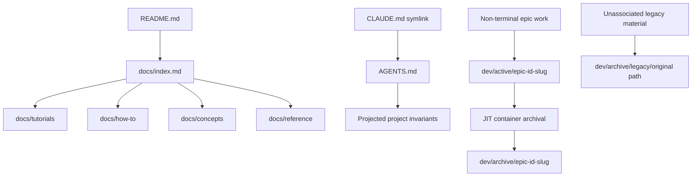

# Documentation Overhaul Planning Brief

**Issue:** fa787f85
**Type:** epic
**Priority:** high
**Date:** 2026-07-14

## Problem Statement

gf2 has extensive technical material, but it does not present a coherent adoption surface for researchers. Permanent guidance, crate overviews, Rustdoc, implementation plans, benchmark receipts, presentations, audit reports, roadmaps, handoffs, and completed-work records occupy overlapping navigation and lifecycle paths. The resulting corpus is difficult to enter, expensive to maintain, and prone to factual drift.

The overhaul rebuilds the permanent documentation from verified current behavior and archives development history through JIT. It does not promote existing prose into the new documentation. It preserves valuable technical artifacts while separating them from the contract presented to researchers adopting the library.

The epic is a direct dependency of the `gf2 1.0 release` milestone. A prerequisite story, `3f29e945`, establishes the addressable documentation contract and enforcement baseline before rewrite or migration work becomes available.

## Investigation Baseline

The pre-epic audit established the following baseline on 2026-07-14:

- The repository tracks 336 Markdown files containing 82,007 lines.
- `dev/active/` contains 108 files and 20,426 lines. Ninety-eight filenames map unambiguously to JIT issues, and every mapped issue is terminal `done`; none is open or in progress.
- `dev/plans/` contains 62 Markdown files and 18,696 lines.
- `dev/bench_results/` contains 73 Markdown files and 20,542 lines.
- `dev/archive/` contains 14 Markdown files and 1,109 lines.
- The current-facing Markdown surface has five detected broken internal links; the full tracked Markdown corpus has sixteen detected link findings.
- Permanent technical guides are split between crate-local documentation directories. Root `docs/` primarily contains presentation decks rather than a product-documentation landing page.
- The root roadmap has an empty in-progress section and lists capabilities as planned that are already present in code or completed JIT work.
- The repository builds Rustdoc in CI but has no gf2 documentation-mechanical gate for Markdown links, citations, or generated projections.

These counts are audit evidence, not permanent product facts. They belong in this planning record and the migration manifest, not in adopter-facing documentation.

## Success Criteria

- [hard] REQ-01: Project-wide addressable documentation invariants define and enforce the researcher audience, adapted Diátaxis placement, current-state-only prose, absence of marketing and future promises, single-source facts, evidence-backed performance claims, concise style, and non-trivial-example policy.
- [hard] REQ-02: The root `AGENTS.md` is the authoritative operational guide and remains at or below 200 lines; `CLAUDE.md` is a symlink to it; any crate-local `AGENTS.md` contains only recursively scoped crate constraints and independently remains at or below 200 lines; `CONTRIBUTING.md` is removed.
- [hard] REQ-03: The root `README.md` is a concise researcher-facing landing page containing gf2's purpose, supported capability map, crate-selection guidance, current installation constraints, an evidence-linked performance summary, and links to permanent documentation without duplicating API walkthroughs.
- [hard] REQ-04: Permanent documentation uses `docs/tutorials/`, `docs/how-to/`, `docs/concepts/`, and `docs/reference/`; it includes concise entry pages for `gf2-core`, `gf2-coding`, `gf2-algebra`, and `gf2-sim`, plus research-grade workflows that exercise advanced supported features.
- [hard] REQ-05: Every permanent page has freshly authored explanatory prose and structure; only independently verified code, commands, equations, identifiers, and empirical data are reused from prior material.
- [hard] REQ-06: Every performance claim links to commit-pinned evidence that identifies hardware, build flags, dataset, baseline, and measurement date; permanent prose contains no unsupported or hand-copied volatile result tables.
- [hard] REQ-07: Rustdoc examples are audited across the workspace; tautological examples for accessors, constants, simple constructors, and direct mappings are removed; retained examples materially clarify non-obvious contracts and compile under the canonical documentation checks; before-and-after example counts and documentation-test timing are recorded.
- [hard] REQ-08: Root and crate roadmaps are inspected for untracked relevant work, that work is represented in JIT where necessary, and the roadmap files are removed as obsolete status duplicates.
- [hard] REQ-09: Presentation decks and their complete asset bundles are preserved with their owning terminal epics, excluded from permanent documentation navigation, and not edited merely to make historical claims current.
- [hard] REQ-10: Every eligible terminal epic's linked documents and supported bundles are archived through JIT container archival into a marker-backed `<short-id>-<human-readable-slug>/` directory with valid rewritten references and verified bytes.
- [hard] REQ-11: Documents belonging to non-terminal epics remain under `dev/active/<epic-short-id>-<slug>/`, are individually linked to their owning issues, and archive as a coherent container when the epic becomes terminal.
- [hard] REQ-12: A legacy document is associated with an issue only through an existing JIT document reference, an unambiguous issue identifier, or unique tagged-commit provenance; unassociated material is preserved under `dev/archive/legacy/<original-relative-path>`.
- [hard] REQ-13: A complete migration manifest classifies every pre-overhaul documentation artifact as a JIT container archive, legacy archive, retained operational asset, deletion, or freshly rewritten topic; a transient progress checker reports migration completeness and is removed after final verification.
- [hard] REQ-14: The final `dev/` top level contains no obsolete documentation buckets; operational research directories consumed by tooling remain, while loose `plans`, `bench_results`, `simulation_results`, and `presentations` paths are eliminated through archival or purpose-specific relocation.
- [hard] REQ-15: JIT documentation policy temporarily manages every legacy source needed for safe archival and ends with only the clean post-overhaul managed and permanent paths configured.
- [hard] REQ-16: An automated documentation-review gate is grounded in the addressable invariants, and a mechanical gate checks links, anchors, citations, and registry projections; Rustdoc and retained examples compile through the Rust CI gate.
- [hard] REQ-17: Permanent documentation contains only supported behavior at overhaul completion; historical narration, migration language, superseded alternatives, speculation, and future promises occur only in archived development artifacts or JIT work items.
- [hard] REQ-18: Existing documentation-remediation tasks are reconciled with this contract: surviving requirements are adapted into the overhaul DAG, and obsolete deliverables are rejected with an explicit resolution only after their relevant requirement is preserved elsewhere.
- [hard] REQ-19: The permanent documentation surface and every executed archive plan finish with no unresolved internal links, anchors, local citations, or addressable-item references.
- [hard] REQ-20: A planning brief linked from this epic records the complete investigation and interview outcome, including every approved scope decision, invariant, archival rule, target structure, enforcement decision, inherited-task disposition, implementation constraint, and deferred breakdown concern.

## Decisions

- D-01: The overhaul epic is a direct dependency of the `gf2 1.0 release` milestone rather than a child of the narrower technical-debt epic.
- D-02: Existing documentation-remediation tasks join the overhaul DAG and retain their technical-debt grouping. Their titles, descriptions, gates, and disposition may be adapted to the new contract.
- D-03: An obsolete deliverable may be rejected with `resolution:obsolete` after every still-relevant obligation is preserved by an overhaul requirement or replacement issue.
- D-04: Source-level Rustdoc remains in scope. Crate- and module-level documentation and user-facing examples are rewritten where needed; technically correct item-level comments remain unless they violate the new invariants.
- D-05: Trivial Rustdoc examples are removed. Accessors, constants, direct mappings, and simple constructors do not receive examples merely to satisfy a coverage convention. Retained examples demonstrate non-obvious behavior or material contracts.
- D-06: The primary audience is researchers evaluating or adopting gf2. The permanent documentation assumes relevant technical competence and does not teach elementary finite-field concepts or the simplest Hamming-code construction.
- D-07: Tutorials are limited to research-grade end-to-end workflows that exercise advanced supported capabilities, such as reproducing performance evidence, configuring standards-based experiments, or evaluating advanced algebra and decoding paths.
- D-08: Performance is a first-class adoption concern. Claims remain concise and non-marketing, link to detailed receipts, and identify the commit, hardware, build flags, workload, baseline, and measurement date.
- D-09: Existing explanatory prose is not promoted verbatim into permanent documentation. Verified code, commands, equations, standard identifiers, and empirical data may be reused after independent verification.
- D-10: The permanent format is repository Markdown plus Rustdoc. A documentation-site generator is not part of this epic.
- D-11: Permanent prose states only current supported behavior. It contains no speculation, future promises, migration narration, implementation history, or comparisons framed as “now A rather than former B.”
- D-12: Experimental or incomplete capabilities appear only when they provide usable current behavior. Limitations belong in reference material; planned work remains in JIT.
- D-13: `CONTRIBUTING.md` is removed. Root `AGENTS.md` becomes the authoritative operational guide, and `CLAUDE.md` becomes a symlink to it.
- D-14: Every `AGENTS.md` has an absolute hard limit of 200 lines. Crate-local files exist only for genuinely crate-specific recursively scoped constraints and do not restate root policy.
- D-15: The root README becomes a concise researcher-facing landing page with a brief statement of what gf2 strives to be, a supported capability map, crate-selection guidance, current installation constraints, evidence-linked performance highlights, and links into permanent documentation.
- D-16: Installation documentation follows the current-state rule without exception. It describes only dependency and publishing mechanisms available at overhaul completion.
- D-17: Permanent documentation uses an adapted Diátaxis layout: `tutorials/`, `how-to/`, `concepts/`, and `reference/`. This placement rule is itself a project invariant.
- D-18: `gf2-core`, `gf2-coding`, `gf2-algebra`, and `gf2-sim` each receive a concise adopter-facing entry page. SIMD and HIP kernel crates are documented through acceleration and integration guidance as implementation backends.
- D-19: Root and crate roadmaps are inspected for relevant untracked work and then removed because JIT is the sole work-status system.
- D-20: Presentation decks are valuable historical artifacts. They move with their owning terminal epics, retain their asset bundles, and remain outside permanent documentation navigation.
- D-21: Archival is performed by terminal epic using JIT's dependency-aware container archival. The archive directory is marker-backed and named with the epic short ID and human-readable slug.
- D-22: Completed leaf documents inside a non-terminal epic remain managed with that epic until the epic becomes terminal. The epic is the archival unit.
- D-23: Active documents live beneath `dev/active/<epic-short-id>-<slug>/`. Descendant artifacts are individually linked to their owning issues. This convention is stated in `AGENTS.md`.
- D-24: A document is associated with an issue only through an existing JIT document reference, an unambiguous issue ID, or unique `jit:<short-id>` commit provenance. Ambiguous association is never guessed.
- D-25: Unassociated historical material moves to `dev/archive/legacy/<original-relative-path>`, preserving its original hierarchy beneath `legacy/` for provenance and collision avoidance.
- D-26: JIT `managed_paths` may be expanded temporarily to cover legacy buckets needed for archival. The final policy contains no obsolete managed path.
- D-27: Operational research directories consumed by scripts may remain under `dev/`: `benchmarks`, `campaigns`, `reference_data`, `research`, and `scripts`. Loose documentation buckets do not remain.
- D-28: `dev/plans`, `dev/bench_results`, `dev/simulation_results`, and `dev/presentations` are eliminated through JIT archives, legacy archival, or purpose-specific relocation. The final `dev/` top level contains no obsolete path.
- D-29: A complete migration manifest records every pre-overhaul artifact and its disposition. A script monitors migration progress against that manifest.
- D-30: The progress script is transient. It is removed after the final complete migration check; lasting enforcement comes from invariants and review gates rather than a frozen migration inventory.
- D-31: Durable documentation rules live as project-scoped JIT invariants. One-time migration outcomes live as addressable epic requirements.
- D-32: gf2 follows just-in-time's enforcement architecture: a registry-first invariant source, deterministic projection into `AGENTS.md`, a documentation-impact review grounded in canonical policy, and mechanical checks for links, citations, and projection freshness.
- D-33: The documentation review becomes automated rather than remaining the current manual placeholder. It applies an issue-scoped impact cone and a holistic container review.
- D-34: Markdown-mechanical checks and Rust compilation remain distinct. Link, citation, and projection failures come from the documentation gate; Rustdoc and retained-example failures come from Rust CI.
- D-35: Initial issue gates are `cargo-ci`, `code-review`, and the existing `doc-review`. The prerequisite story replaces the placeholder review and defines `docs-mechanical`; the new gate becomes mandatory before overhaul completion.
- D-36: The epic has high priority. It is release-significant but does not displace correctness work assigned critical priority.
- D-37: The prerequisite story defines, projects, tests, and obtains approval for the documentation contract before rewrite and archival tasks become available.
- D-38: The full implementation breakdown is deferred until this epic and prerequisite contract story exist. Breakdown must cover every epic requirement and preserve the story-as-checkpoint dependency shape.
- D-39: This planning brief is a linked epic artifact and records the full outcome of the investigation and interview.

## Target Structure

The permanent documentation surface contains rewritten adopter guidance. Rustdoc is the API source of truth. The root README directs researchers into the correct permanent page without repeating it. `AGENTS.md` owns operational policy and projects the invariant registry into a bounded region.

The development surface distinguishes live epic work, operational research assets, terminal-epic archives, and unassociated legacy material. It does not keep parallel plan, result, presentation, or session-note silos merely because they existed before the migration.

## Archival Design

JIT container archival is the primary mover and reference updater. Each terminal epic is previewed, blockers are resolved, and execution publishes into the marker-backed preferred destination. The planner's byte verification, reference updates, link validation, no-overwrite publication, and resumable deletion behavior remain authoritative.

The migration must first establish reliable issue-document ownership. Sources are linked at their final pre-archive managed path. Explicit JIT references take precedence, followed by unambiguous path or content identifiers and unique tagged-commit provenance. A file without defensible ownership goes to the legacy mirror rather than an inferred container.

Presentation assets, benchmark evidence, figures, generated data referenced by linked documents, and other supported bundles move with the owning container when the planner includes them. Unsupported objects and ambiguous shared assets are resolved explicitly before execution. Historical artifacts remain historical; archival does not trigger prose correction.

## Permanent Documentation Design

The adapted Diátaxis surface serves research adoption:

- `tutorials/` contains advanced, reproducible research workflows with a meaningful end result.
- `how-to/` answers focused adoption tasks such as selecting acceleration, running standards-based experiments, reproducing evidence, or integrating formal verification.
- `concepts/` explains current architecture and algorithmic choices needed to use the library effectively, without elementary mathematical primers or development history.
- `reference/` states supported configurations, feature behavior, conventions, limitations, evidence methodology, and other stable contracts not already expressed by Rustdoc.

The performance summary remains brief. Detailed measurements live in commit-pinned receipts and reproducibility artifacts. A permanent page may interpret a result only when it links directly to evidence carrying the required environment and baseline metadata.

## Invariant Model

The prerequisite story creates addressable project invariants at stable `@/inv/<id>` addresses. The exact final IDs are approved during that story, but the registry covers at least:

- researcher audience and research relevance;
- adapted Diátaxis placement;
- current-state-only prose;
- no marketing language;
- no speculation or future promises;
- no historical or transition narration in permanent documentation;
- single-source prose for volatile facts;
- evidence-backed performance claims;
- concise, non-duplicative writing;
- non-trivial Rustdoc examples;
- active documents grouped by epic directory and linked to owning issues;
- root and crate-local `AGENTS.md` scope and 200-line limits.

The registry is the source of truth. A deterministic projection renders it into a delimited region of root `AGENTS.md`. The documentation-review gate cites the invariant addresses it enforces. Mechanical projection checks fail when the rendered policy drifts from the registry.

## Inherited Issue Disposition

- `44c98235` is retitled **Rewrite README for research adoption**. Its criteria now cover the complete root-README contract and it depends on the prerequisite story.
- `12907582` is retitled **Correct surviving source-level documentation drift**. It covers code-adjacent Rustdoc and operational comments that remain after migration; findings located only in removed or archived prose are classified rather than patched.
- `84db2984`, which requested a correction to a presentation slide, is rejected with `resolution:obsolete`. The deck is preserved as a historical artifact, and the relevant obligation not to migrate the false API claim into current documentation is covered by this epic.

The inherited tasks retain their technical-debt grouping and also carry `epic:documentation-overhaul` for filtering. DAG edges, not labels, define their delivery relationship.

## Implementation Steps

1. Complete prerequisite story `3f29e945`: configure item kinds, author and approve invariants, project them into root `AGENTS.md`, establish the symlink, replace the documentation-review placeholder, create mechanical checks and self-tests, and define the migration manifest plus transient progress checker.
2. Run a full artifact inventory and populate the migration manifest with ownership evidence, bundle relationships, current links, disposition, and execution status.
3. Expand JIT documentation policy only as needed to manage legacy source roots. Link unlinked but unambiguously owned artifacts to their issues.
4. Preview every terminal epic candidate. Resolve ownership, unsupported artifacts, shared references, collisions, and broken links before execution.
5. Execute eligible terminal-epic archives through JIT. Verify marker ownership, bytes, reference updates, bundle completeness, and idempotent reruns.
6. Move unassociated material into the legacy mirror while preserving its original relative hierarchy. Record every move in the migration manifest.
7. Inspect roadmap content for relevant untracked work, represent that work in JIT where required, and remove root and crate roadmaps.
8. Author the permanent documentation corpus from current code, tests, manifests, standards, and benchmark evidence. Do not use the old prose as page scaffolding.
9. Rewrite the root README and create adopter entry pages for the four public crates. Document SIMD and HIP through supported integration paths.
10. Audit Rustdoc examples, record the baseline, remove tautological examples, retain non-obvious walkthroughs, and record the final counts and timing.
11. Correct surviving source-level documentation drift and remove internal task narration from adopter-visible Rustdoc.
12. Remove `CONTRIBUTING.md`, obsolete top-level documentation buckets, and the temporary migration checker after the manifest reaches complete status.
13. Restore the final narrow documentation policy, render all projections, run documentation and Rust gates, validate all permanent and archive links, and perform a holistic epic documentation review.

## Testing Approach

- Self-test the Markdown link and anchor checker with clean, missing-target, unresolved-anchor, undefined-reference, and unreadable-footprint fixtures.
- Self-test repository-path and addressable-item citation checks with valid, dangling, unsupported, and environment-error cases.
- Modify each projected registry in a fixture and confirm projection freshness fails until the renderer is run.
- Run `jit invariant check`, invariant projection, rules/gates projection, and `jit validate` together.
- Build Rustdoc and retained examples under the canonical release-mode CI policy.
- Measure Rustdoc example count and documentation-test wall time before and after pruning using the same toolchain, features, and host conditions.
- Preview every archive before execution and assert `eligible`, expected destination root, artifact count, owner set, reference changes, and absence of blockers.
- After execution, verify archive markers, hashes, source deletion status, linked-document paths, local asset resolution, and no-op rerun behavior.
- Run the transient progress checker until every manifest row has a terminal disposition and all source/destination assertions pass.
- Run the final documentation gate against permanent paths and explicitly curated root/crate entry points.
- Confirm each `AGENTS.md` line count does not exceed 200 and `CLAUDE.md` resolves to the root file.

## Risks and Open Questions

- Existing files may not yet be linked in JIT even when ownership is apparent. The inventory must distinguish defensible provenance from guesswork.
- A terminal epic archive may be blocked by non-terminal document owners, unsupported artifact types, shared relative assets, destination conflicts, or broken embedded links. Preview findings must be resolved rather than bypassed.
- Some benchmark and simulation outputs are consumed by scripts. The breakdown must identify path consumers before moving operational assets.
- Existing documentation may contain the only record of relevant planned work. Roadmap and plan removal requires a deliberate JIT coverage check.
- The final set of crate-local `AGENTS.md` files is not predetermined. They are created only where a local recursive constraint exists.
- Advanced workflow selection requires a coverage review across supported algebra, coding, simulation, acceleration, standards, benchmarking, and formal-verification capabilities.
- A before-and-after timing comparison can be noisy. The measurement protocol must control toolchain, feature set, build-cache state, and host load sufficiently to support the conclusion.
- The full child-issue breakdown remains to be produced. It must map every epic REQ to at least one delivering child and use the prerequisite story as the shared checkpoint rather than duplicating prerequisite edges.

## Non-Goals

- Publishing a separate generated documentation website.
- Teaching elementary finite-field mathematics or introductory coding-theory exercises.
- Correcting historical artifacts merely to make them read like current product documentation.
- Documenting speculative, planned, or unavailable capabilities.
- Keeping a permanent migration-progress checker after the overhaul is verified.
