# Plan: Overhaul documentation for research adoption (fa787f85)

> Planning node: 8dddfc7a. Authoritative graph:
> [breakdown.json](breakdown.json).

Source IDs: `REQ-01`..`REQ-20` are the epic's criteria, `REQ-21`..`REQ-27` the
replacement sweep story's, and `REQ-31`..`REQ-40` the contract story's. `D-xx`
are brief decisions (D-43..D-52 record the 2026-10-01 interview), `DEC-xx` are
3f29e945 decisions, and `OD-08` and `PD-xx` are rows of the decisions table
below. `INV-§n` cites [investigation](investigation.md) section n, `INV-§0.k`
its scope finding k, and `INV-A/B/C` its appendices.

## Outcome and criterion approach

| Criterion | Approach | Evidence / open gap |
|---|---|---|
| REQ-01 | Invariants come from 3f29e945 (three groups) and 9b2886a7 (audience, placement, tone); the permanent-page audit verifies enforcement by address. | DEC-02; INV-§2 |
| REQ-02 | 3f29e945 owns the symlink, scope and line cap; one task retires CONTRIBUTING.md. | INV-§3.6, INV-§0.8 (199/200 lines) |
| REQ-03 | `readme-landing-page` replaces 44c98235 and carries its criteria, including no performance claims; it runs once the index and both tutorials exist. | INV-§0.9 |
| REQ-04 | Index plus quadrant layout; crate READMEs are the four entry pages (D-50); exactly two tutorials (D-45), the second built on a new gf2-core example. | INV-§5.2 |
| REQ-05 | Each page task writes fresh prose from verified facts; the audit compares each page with the sources it mined. | INV-§3.5 topic map |
| REQ-06 | One evidence page with commit-pinned links (D-48); how-tos link its anchors; README and entry pages carry no figures. | INV-§3.10: no class has all fields in-file |
| REQ-07 | a0a29512 removes tautological examples and 153297cf settles accessor gaps, both before the sweep; a final census measures the corpus after it. | audit + census script linked to fa787f85 |
| REQ-08 | Retroactive mapping of the three deleted roadmaps (D-47). | INV-§3.9 |
| REQ-09 | Decks move by `git mv` into their owners' archive dirs, and every link target is repaired (D-51); the figure example stops writing under `docs/`. | INV-§3.4, INV-§0.1 |
| REQ-10 | Bounded preview, then the b7157be6 repair, then execution of eligible containers with paired citation commits. | INV-§1.2 scan never finished; INV-§0.7 |
| REQ-11 | Ownership links, then per-epic regrouping after the sweep. f547c394 moves after the tuning-campaign tooling accepts historical pin paths (D-52). Husks are cleared last. | INV-A, INV-§0.6, INV-§6 |
| REQ-12 | Admissible-evidence rule (D-24) in the inventory; ownerless material and mined guides move to the legacy mirror by `git mv`. | INV-§0.3: no legacy primitive |
| REQ-13 | a24b2af7 defines the schema and checker; three inventory tasks populate it; the checker retires after the final check. Tooling Markdown under `.agents/`, `contrib/`, `packages/` and `.jit/` is not documentation and is excluded. | INV-A, INV-B |
| REQ-14 | `plans`, `presentations` and `sessions` are eliminated; operational dirs keep consumed files and lose loose narrative Markdown (D-49); `dev/index.md` is rewritten. | INV-§3.1, INV-§0.4, INV-§0.5 |
| REQ-15 | Temporary widening after the inventory; final narrowing after the content audit. | INV-§3.1 stale entries |
| REQ-16 | 3f29e945 delivers doc-review grounding, docs-mechanical and rustdoc CI; the final policy sets the docs-mechanical footprint. | DEC-04..DEC-06; INV-§0.11 |
| REQ-17 | The sweep story covers source comments and module docs; the audit covers permanent pages and crate-root docs; 12907582 covers factual drift. | INV-§6 |
| REQ-18 | One triage task with two dispositions (D-43); candidates re-derived at execution. | INV-§3.13, INV-§0.10 |
| REQ-19 | Every move task scans its touched files; a final task verifies the permanent footprint, every executed archive and every relocated artifact. | INV-§0.2: archival rewrites no content |
| REQ-20 | The brief records D-01..D-52, including the interview outcome; triage adds the inherited-issue dispositions to it and carries the credit (PD-06). | brief D-43..D-52 |

## Shared architectural contracts

### `docs-surface-layout` [plan-fixed] — Permanent docs layout

`docs/index.md` is the single navigation page, with one section per quadrant
(`tutorials/`, `how-to/`, `concepts/`, `reference/`) and a crate section. Each
crate's `README.md` is its entry page. A page task creates its file in the
matching quadrant and adds its own index row. Permanent pages link to `dev/`
only through commit-pinned URLs.

### `performance-evidence-page` [implementation-produced] — Performance evidence page

`docs/reference/performance-evidence.md` holds every performance claim, with
one stable anchor per claim. Each claim states methodology, hardware, flags,
workload, baseline and date, and links evidence at a fixed commit. Other pages
link anchors and state no figures. Producer: `reference-performance-evidence`.

### `migration-manifest` [plan-fixed] — Migration manifest and checker

Schema, file location and checker are produced outside this manifest by a24b2af7. Each migration task
updates the rows it executes to complete status and leaves the checker passing
for those rows. Temporary policy entries are recorded in the manifest with
their removal condition.

### `relocation-protocol` [plan-fixed] — Moves outside JIT archival

A move JIT cannot perform (non-`dev/` sources, the legacy mirror, decks) uses
`git mv`, updates affected tracker document references, repoints in-file
citations in the same commit, and passes a link scan of touched files (the
docs-mechanical check once registered). Receipt directories under
`dev/bench_results/` are never rewritten (INV-§6). In historical artifacts only
link targets change, and every link in a moved artifact resolves afterwards.

### `archive-execution-protocol` [plan-fixed] — JIT container archival

Preview, resolve each blocker, execute, repoint in-file citations in the same
change, verify marker and hashes, rerun to confirm a no-op (INV-§4). Shared
files of open owners are copied, never moved.

### `active-layout` [plan-fixed] — Active document layout

Open-epic material lives under the directory `jit doc dir <epic> dev/active`
resolves. An entry owned by several epics goes to the epic owning most of its
linked documents; a tie goes to the epic whose issue ID names the entry.

### `sweep-unit-rules` [plan-fixed] — Sweep unit rules

Comment, Rustdoc and whitespace edits only. The shared pattern (story REQ-24)
marks narration and scope markers. Each unit lists its justified matches in its
commit message. Evidence pointers and generated-table provenance stay.

### `sweep-baseline` [implementation-produced] — Pre-sweep comment census

The per-crate comment share and pattern counts, with the exact command and
commit, in the sweep completion record. Producer: `sweep-baseline-census`.

### `fieldmatrix-example` [implementation-produced] — Field linear-algebra example

A tested gf2-core example program for large prime- and extension-field linear
algebra, which the second tutorial uses. Producer:
`fieldmatrix-example-program`.

## Generated decomposition overview

<!-- jit:breakdown-overview:begin -->
| Key | Title | Type | Outcome | Contracts | Sources | Footprint | Landing | Depends on |
|---|---|---|---|---|---|---|---|---|
| triage-doc-issues | Reconcile open docs-remediation issues outside the overhaul | task | Each open docs-remediation issue outside the epic has a recorded disposition with preserved requirements | — | REQ-18, REQ-20, D-43, D-02, D-03, INV-§3.13, INV-§0.10, PD-06 | creates 1, touches 1 | — | — |
| roadmap-coverage-map | Map deleted roadmap items to tracked work | task | Each planned item of the deleted roadmaps maps to an issue, code, or a recorded obsolescence | — | REQ-08, D-47, D-19, INV-§3.9 | creates 1 | — | — |
| remove-contributing-guide | Retire CONTRIBUTING.md in favor of AGENTS.md | task | CONTRIBUTING.md is gone and its unique guidance has one home within the AGENTS.md line limit | — | REQ-02, D-13, D-14, INV-§3.6, INV-§0.8, PD-05 | touches 3 | — | — |
| inventory-dev-active | Populate the migration manifest for dev/active | task | Each dev/active artifact has a manifest row with admissible ownership evidence and a disposition | migration-manifest, active-layout | REQ-13, REQ-12, REQ-11, D-24, D-29, INV-A, INV-§0.6, PD-03 | touches 1, uncertain | — | — |
| inventory-dev-buckets | Populate the migration manifest for the other dev buckets | task | Each non-active dev artifact has a manifest row with consumers, evidence and a disposition | migration-manifest | REQ-13, REQ-12, REQ-14, D-27, D-28, D-49, INV-§3.1, INV-B, INV-§0.4, INV-§0.5 | touches 1, uncertain | — | — |
| inventory-permanent-sources | Populate the migration manifest for permanent-path sources | task | Each permanent-path source has a manifest row with disposition, destination and inbound references | migration-manifest | REQ-13, REQ-12, REQ-09, D-46, D-09, INV-§3.4, INV-§3.5, INV-§0.1, PD-02 | touches 1, uncertain | — | — |
| expand-managed-paths | Widen the docs policy to manage archival sources | task | The docs policy temporarily manages each container-archive source and lists no absent path | migration-manifest | REQ-15, D-26, INV-§3.1, INV-§4 | touches 1 | — | inventory-dev-active, inventory-dev-buckets, inventory-permanent-sources |
| link-owned-artifacts | Link unlinked owned artifacts to their issues | task | Defensibly owned artifacts carry document references on their owning issues | migration-manifest | REQ-12, REQ-11, D-24, INV-A | touches 1 | — | expand-managed-paths |
| archive-candidate-preview | Preview terminal-epic archive candidates | task | Each terminal or newly extended archived epic has a recorded preview with resolved blockers | archive-execution-protocol, migration-manifest | REQ-10, D-21, PD-01, INV-§1.1, INV-§1.2, INV-§4 | creates 1 | — | link-owned-artifacts |
| repair-osd-archive | Bring the hand-archived OSD epic under container archival | task | Epic b7157be6 is archived with a marker, verified bytes and resolvable references | archive-execution-protocol, relocation-protocol | REQ-10, PD-01, INV-§0.7, INV-§1.1, INV-§1.2 | touches 2 | — | archive-candidate-preview |
| sweep-baseline-census | Record the pre-sweep comment census | task | A reproducible per-crate comment census exists before sweep edits begin | sweep-unit-rules | REQ-27, D-44, INV-C | creates 1 | — | — |
| sweep-core-field-poly | Tersify comments in gf2-core field polynomial and extension modules | task | Comments in gf2-core field polynomial and extension modules carry only current, non-obvious content in shortest form | sweep-unit-rules | REQ-17, REQ-21, REQ-22, REQ-23, REQ-25, REQ-26, D-44, D-04, D-42, INV-§5.3, INV-C | touches 8 | source-tersification | sweep-baseline-census |
| sweep-core-field-dense | Tersify comments in gf2-core dense field matrix modules | task | Comments in gf2-core dense field matrix modules carry only current, non-obvious content in shortest form | sweep-unit-rules | REQ-17, REQ-21, REQ-22, REQ-23, REQ-25, REQ-26, D-44, D-04, D-42, INV-§5.3, INV-C | touches 3 | source-tersification | sweep-baseline-census |
| sweep-core-field-algorithms | Tersify comments in gf2-core field matrix algorithm modules | task | Comments in gf2-core field matrix algorithm modules carry only current, non-obvious content in shortest form | sweep-unit-rules | REQ-17, REQ-21, REQ-22, REQ-23, REQ-25, REQ-26, D-44, D-04, D-42, INV-§5.3, INV-C | touches 5 | source-tersification | sweep-baseline-census |
| sweep-core-field-traits | Tersify comments in gf2-core field trait and vector modules | task | Comments in gf2-core field trait and vector modules carry only current, non-obvious content in shortest form | sweep-unit-rules | REQ-17, REQ-21, REQ-22, REQ-23, REQ-25, REQ-26, D-44, D-04, D-42, INV-§5.3, INV-C | touches 6 | source-tersification | sweep-baseline-census |
| sweep-core-gf2m | Tersify comments in the gf2-core GF(2^m) module | task | Comments in the gf2-core GF(2^m) module carry only current, non-obvious content in shortest form | sweep-unit-rules | REQ-17, REQ-21, REQ-22, REQ-23, REQ-25, REQ-26, D-44, D-04, D-42, INV-§5.3, INV-C | touches 1 | source-tersification | sweep-baseline-census |
| sweep-core-prime-fields | Tersify comments in the gf2-core prime-field modules | task | Comments in the gf2-core prime-field modules carry only current, non-obvious content in shortest form | sweep-unit-rules | REQ-17, REQ-21, REQ-22, REQ-23, REQ-25, REQ-26, D-44, D-04, D-42, INV-§5.3, INV-C | touches 2 | source-tersification | sweep-baseline-census |
| sweep-core-bit-structures | Tersify comments in gf2-core bit-level structures | task | Comments in gf2-core bit-level structures carry only current, non-obvious content in shortest form | sweep-unit-rules | REQ-17, REQ-21, REQ-22, REQ-23, REQ-25, REQ-26, D-44, D-04, D-42, INV-§5.3, INV-C | touches 11 | source-tersification | sweep-baseline-census |
| sweep-core-runtime | Tersify comments in gf2-core runtime support modules | task | Comments in gf2-core runtime support modules carry only current, non-obvious content in shortest form | sweep-unit-rules | REQ-17, REQ-21, REQ-22, REQ-23, REQ-25, REQ-26, D-44, D-04, D-42, INV-§5.3, INV-C | touches 7 | source-tersification | sweep-baseline-census |
| sweep-core-tests-benches | Tersify comments in gf2-core tests, benches and examples | task | Comments in gf2-core tests, benches and examples carry only current, non-obvious content in shortest form | sweep-unit-rules | REQ-17, REQ-21, REQ-22, REQ-23, REQ-25, REQ-26, D-44, D-04, D-42, INV-§5.3, INV-C | touches 3 | source-tersification | sweep-baseline-census |
| sweep-coding-ldpc | Tersify comments in the gf2-coding LDPC module | task | Comments in the gf2-coding LDPC module carry only current, non-obvious content in shortest form | sweep-unit-rules | REQ-17, REQ-21, REQ-22, REQ-23, REQ-25, REQ-26, D-44, D-04, D-42, INV-§5.3, INV-C | touches 1 | source-tersification | sweep-baseline-census |
| sweep-coding-bch | Tersify comments in gf2-coding BCH and transform modules | task | Comments in gf2-coding BCH and transform modules carry only current, non-obvious content in shortest form | sweep-unit-rules | REQ-17, REQ-21, REQ-22, REQ-23, REQ-25, REQ-26, D-44, D-04, D-42, INV-§5.3, INV-C, INV-§3.14 | touches 2 | source-tersification | sweep-baseline-census |
| sweep-coding-modem | Tersify comments in the gf2-coding modem module | task | Comments in the gf2-coding modem module carry only current, non-obvious content in shortest form | sweep-unit-rules | REQ-17, REQ-21, REQ-22, REQ-23, REQ-25, REQ-26, D-44, D-04, D-42, INV-§5.3, INV-C | touches 1 | source-tersification | sweep-baseline-census |
| sweep-coding-decoders | Tersify comments in gf2-coding OSD, product, GRAND and GLDPC modules | task | Comments in gf2-coding OSD, product, GRAND and GLDPC modules carry only current, non-obvious content in shortest form | sweep-unit-rules | REQ-17, REQ-21, REQ-22, REQ-23, REQ-25, REQ-26, D-44, D-04, D-42, INV-§5.3, INV-C | touches 4 | source-tersification | sweep-baseline-census |
| sweep-coding-core-src | Tersify comments in the remaining gf2-coding source files | task | Comments in the remaining gf2-coding source files carry only current, non-obvious content in shortest form | sweep-unit-rules | REQ-17, REQ-21, REQ-22, REQ-23, REQ-25, REQ-26, D-44, D-04, D-42, INV-§5.3, INV-C | touches 17 | source-tersification | sweep-baseline-census |
| sweep-coding-tests-benches | Tersify comments in gf2-coding tests, benches and examples | task | Comments in gf2-coding tests, benches and examples carry only current, non-obvious content in shortest form | sweep-unit-rules | REQ-17, REQ-21, REQ-22, REQ-23, REQ-25, REQ-26, D-44, D-04, D-42, INV-§5.3, INV-C | touches 3 | source-tersification | sweep-baseline-census |
| sweep-sim-campaigns | Tersify comments in gf2-sim executor and campaign modules | task | Comments in gf2-sim executor and campaign modules carry only current, non-obvious content in shortest form | sweep-unit-rules | REQ-17, REQ-21, REQ-22, REQ-23, REQ-25, REQ-26, D-44, D-04, D-42, INV-§5.3, INV-C | touches 4 | source-tersification | sweep-baseline-census |
| sweep-sim-pipeline | Tersify comments in gf2-sim GPU, preset, stage and graph modules | task | Comments in gf2-sim GPU, preset, stage and graph modules carry only current, non-obvious content in shortest form | sweep-unit-rules | REQ-17, REQ-21, REQ-22, REQ-23, REQ-25, REQ-26, D-44, D-04, D-42, INV-§5.3, INV-C | touches 4 | source-tersification | sweep-baseline-census |
| sweep-sim-runtime | Tersify comments in the remaining gf2-sim source files | task | Comments in the remaining gf2-sim source files carry only current, non-obvious content in shortest form | sweep-unit-rules | REQ-17, REQ-21, REQ-22, REQ-23, REQ-25, REQ-26, D-44, D-04, D-42, INV-§5.3, INV-C | touches 15 | source-tersification | sweep-baseline-census |
| sweep-sim-tests-bins | Tersify comments in gf2-sim tests, benches, binaries and examples | task | Comments in gf2-sim tests, benches, binaries and examples carry only current, non-obvious content in shortest form | sweep-unit-rules | REQ-17, REQ-21, REQ-22, REQ-23, REQ-25, REQ-26, D-44, D-04, D-42, INV-§5.3, INV-C | touches 4 | source-tersification | sweep-baseline-census |
| sweep-algebra-packed | Tersify comments in the gf2-algebra packed-field module | task | Comments in the gf2-algebra packed-field module carry only current, non-obvious content in shortest form | sweep-unit-rules | REQ-17, REQ-21, REQ-22, REQ-23, REQ-25, REQ-26, D-44, D-04, D-42, INV-§5.3, INV-C | touches 1 | source-tersification | sweep-baseline-census |
| sweep-algebra-rest | Tersify comments in the remaining gf2-algebra files | task | Comments in the remaining gf2-algebra files carry only current, non-obvious content in shortest form | sweep-unit-rules | REQ-17, REQ-21, REQ-22, REQ-23, REQ-25, REQ-26, D-44, D-04, D-42, INV-§5.3, INV-C | touches 10 | source-tersification | sweep-baseline-census |
| sweep-simd-x86 | Tersify comments in the gf2-kernels-simd x86 module | task | Comments in the gf2-kernels-simd x86 module carry only current, non-obvious content in shortest form | sweep-unit-rules | REQ-17, REQ-21, REQ-22, REQ-23, REQ-25, REQ-26, D-44, D-04, D-42, INV-§5.3, INV-C | touches 1 | source-tersification | sweep-baseline-census |
| sweep-simd-rest | Tersify comments in the remaining gf2-kernels-simd files | task | Comments in the remaining gf2-kernels-simd files carry only current, non-obvious content in shortest form | sweep-unit-rules | REQ-17, REQ-21, REQ-22, REQ-23, REQ-25, REQ-26, D-44, D-04, D-42, INV-§5.3, INV-C | touches 23 | source-tersification | sweep-baseline-census |
| sweep-hip-stats | Tersify comments in the gf2-kernels-hip and gf2-stats crates | task | Comments in the gf2-kernels-hip and gf2-stats crates carry only current, non-obvious content in shortest form | sweep-unit-rules | REQ-17, REQ-21, REQ-22, REQ-23, REQ-25, REQ-26, D-44, D-04, D-42, INV-§5.3, INV-C | touches 2 | source-tersification | sweep-baseline-census |
| sweep-completion-record | Close the sweep with the after census and justification list | task | The sweep's before-and-after census and justified matches are recorded | sweep-baseline, sweep-unit-rules | REQ-24, REQ-27, D-44, INV-C | touches 1 | — | sweep-core-field-poly, sweep-core-field-dense, sweep-core-field-algorithms, sweep-core-field-traits, sweep-core-gf2m, sweep-core-prime-fields, sweep-core-bit-structures, sweep-core-runtime, sweep-core-tests-benches, sweep-coding-ldpc, sweep-coding-bch, sweep-coding-modem, sweep-coding-decoders, sweep-coding-core-src, sweep-coding-tests-benches, sweep-sim-campaigns, sweep-sim-pipeline, sweep-sim-runtime, sweep-sim-tests-bins, sweep-algebra-packed, sweep-algebra-rest, sweep-simd-x86, sweep-simd-rest, sweep-hip-stats |
| tersification-sweep | Workspace source-comment tersification sweep | story | Workspace Rust comments carry only current, non-obvious content in shortest form | sweep-unit-rules | REQ-17, REQ-21, REQ-22, REQ-23, REQ-24, REQ-25, REQ-26, REQ-27, D-44, D-42, D-04, PD-09 | — | — | sweep-completion-record |
| execute-terminal-archives | Run container archival for eligible terminal epics | task | Eligible terminal epics are archived with markers, verified bytes and repointed citations | archive-execution-protocol, relocation-protocol, migration-manifest | REQ-10, REQ-19, D-21, D-22, PD-01, PD-02, INV-§0.2, INV-§4 | touches 6, uncertain | — | archive-candidate-preview, tersification-sweep |
| resolve-dev-strays | Resolve stray and ownerless dev entries | task | Stray and ownerless dev entries sit with their owners or in the legacy mirror | relocation-protocol, migration-manifest | REQ-12, REQ-11, D-24, D-25, PD-02, PD-03, INV-§1.1, INV-A, INV-B | creates 1, touches 2 | — | execute-terminal-archives |
| regroup-active-zen3 | Regroup flat zen3 dev/active entries under their epic dir | task | Flat zen3 entries live under the zen3 epic dir with relinked references | active-layout, relocation-protocol, migration-manifest | REQ-11, D-22, D-23, PD-03, INV-A, INV-§6 | touches 5, uncertain | — | link-owned-artifacts, tersification-sweep |
| regroup-active-field-dispatch | Regroup flat field-dispatch dev/active entries under their epic dir | task | Flat field-dispatch entries live under their epic dir with relinked references | active-layout, relocation-protocol, migration-manifest | REQ-11, D-23, PD-03, INV-A | touches 5, uncertain | — | link-owned-artifacts, tersification-sweep |
| regroup-active-remaining | Regroup the remaining flat dev/active entries under epic dirs | task | Remaining flat entries live under their epic dirs with relinked references | active-layout, relocation-protocol, migration-manifest | REQ-11, D-23, PD-03, INV-A, INV-§3.14 | touches 4, uncertain | — | link-owned-artifacts, tersification-sweep |
| receipt-pin-path-tolerance | Accept historical protocol pin paths in receipt verification | task | Receipt verification accepts recorded historical pin paths, keeping committed receipts valid across relocation | — | REQ-11, D-52, INV-§6, INV-§3.1 | touches 3 | — | inventory-dev-buckets |
| move-f547c394-inputs | Move the f547c394 protocol inputs under their epic dir | task | f547c394 lives under its epic dir and its CI and tooling readers use the new path | active-layout, relocation-protocol, migration-manifest | REQ-11, D-23, D-52, PD-03, INV-§3.1, INV-§6 | touches 9 | — | receipt-pin-path-tolerance, regroup-active-zen3 |
| relocate-bench-narrative | Relocate loose narrative reports out of dev/bench_results | task | dev/bench_results keeps only operational receipts and data | relocation-protocol, migration-manifest, active-layout | REQ-14, D-49, PD-02, INV-§3.1, INV-§3.10, INV-§6, INV-§0.4 | touches 3 | — | execute-terminal-archives, regroup-active-zen3 |
| relocate-sim-studies-narrative | Relocate loose narrative Markdown out of simulation_results and studies | task | simulation_results and studies keep only consumed operational files | relocation-protocol, migration-manifest, active-layout | REQ-14, D-49, PD-02, INV-§3.1, INV-§0.4 | touches 3 | — | repair-osd-archive, regroup-active-remaining |
| remove-active-husks | Clear empty leftover dirs under dev/active | task | dev/active holds only directories with tracked content | migration-manifest | REQ-11, PD-03, INV-A, INV-§0.6 | touches 1 | — | resolve-dev-strays, regroup-active-field-dispatch, move-f547c394-inputs, relocate-bench-narrative, relocate-sim-studies-narrative |
| eliminate-dev-plans | Empty dev/plans through archival or legacy moves | task | dev/plans is gone and no citation of its paths dangles | relocation-protocol, migration-manifest | REQ-14, REQ-12, D-28, PD-02, INV-§3.1, INV-§1.1, INV-§6 | touches 6 | — | execute-terminal-archives |
| eliminate-dev-sessions | Empty dev/sessions into owner dirs or the legacy mirror | task | dev/sessions is gone and its notes sit with owners or in the legacy mirror | relocation-protocol, migration-manifest | REQ-14, D-28, D-25, INV-§3.1 | touches 2 | — | link-owned-artifacts |
| eliminate-dev-presentations | Empty dev/presentations of leftover theme files | task | dev/presentations is gone with its stylesheets resolved against their owners | relocation-protocol, migration-manifest | REQ-14, D-28, INV-§3.1, INV-§6 | touches 2 | — | link-owned-artifacts |
| move-presentation-decks | Move presentation decks into their epics' archive dirs | task | Each deck bundle lives with its archived epic and no permanent page links it | relocation-protocol, migration-manifest | REQ-09, D-20, PD-02, D-51, INV-§3.4, INV-§0.1 | touches 3 | — | inventory-permanent-sources |
| retarget-figure-generator | Point the presentation figure example at a caller-chosen output dir | task | The figure example writes outside the permanent docs tree | — | REQ-09, INV-§3.4 | touches 1 | — | move-presentation-decks, tersification-sweep |
| docs-scaffold-index | Create the docs index and quadrant layout | task | docs/index.md routes readers to the four quadrants and the existing crate entry pages | docs-surface-layout | REQ-04, D-17, D-10, D-50, PD-10 | creates 1 | — | — |
| entry-page-gf2-core | Rewrite the gf2-core README as its entry page | task | The gf2-core README is a concise current-state entry page linking Rustdoc and the docs index | docs-surface-layout | REQ-04, REQ-05, REQ-17, D-18, D-50, INV-§3.5, INV-§6 | touches 1 | — | docs-scaffold-index |
| entry-page-gf2-coding | Rewrite the gf2-coding README as its entry page | task | The gf2-coding README is a concise current-state entry page linking Rustdoc and the docs index | docs-surface-layout | REQ-04, REQ-05, REQ-17, D-18, D-50, INV-§3.5, INV-§6 | touches 1 | — | docs-scaffold-index |
| entry-page-gf2-algebra | Rewrite the gf2-algebra README as its entry page | task | The gf2-algebra README is a concise current-state entry page linking Rustdoc and the docs index | docs-surface-layout | REQ-04, REQ-05, REQ-17, D-18, D-50, INV-§3.5, INV-§6 | touches 1 | — | docs-scaffold-index |
| entry-page-gf2-sim | Write the gf2-sim README as its entry page | task | The gf2-sim README is a concise current-state entry page linking Rustdoc and the docs index | docs-surface-layout | REQ-04, REQ-05, REQ-17, D-18, D-50, INV-§3.5, INV-§6 | creates 1, touches 1 | — | docs-scaffold-index |
| concept-acceleration-architecture | Write the acceleration architecture concepts page | task | A concepts page explains current kernel dispatch, backends and parallelism | docs-surface-layout | REQ-05, D-18, INV-§3.5 | creates 1, touches 1 | — | docs-scaffold-index |
| backend-crate-readmes | Rewrite the SIMD kernel and statistics crate READMEs | task | Backend and statistics crate READMEs state current role and integration concisely | docs-surface-layout | REQ-05, REQ-17, D-18, INV-§3.5 | touches 2 | — | concept-acceleration-architecture |
| concept-field-arithmetic | Write the finite-field arithmetic concepts page | task | A concepts page explains field representation and strategy choices as currently implemented | docs-surface-layout | REQ-05, REQ-04, D-06, D-09, INV-§3.5 | creates 1, touches 1 | — | docs-scaffold-index |
| reference-performance-evidence | Write the performance evidence reference page | task | One reference page holds gf2 performance claims with methodology and commit-pinned evidence | docs-surface-layout | REQ-06, D-48, D-08, D-15, INV-§3.10, INV-§6 | creates 1, touches 1 | — | docs-scaffold-index |
| howto-select-acceleration | Write the acceleration selection how-to | task | A how-to shows how to choose and enable acceleration paths with evidence links | docs-surface-layout, performance-evidence-page | REQ-05, REQ-06, D-07, INV-§3.5 | creates 1, touches 1 | — | concept-acceleration-architecture, reference-performance-evidence |
| howto-reproduce-evidence | Write the evidence reproduction how-to | task | A how-to shows how to reproduce a pinned performance claim | docs-surface-layout, performance-evidence-page | REQ-06, REQ-05, D-07, D-08, INV-§3.10 | creates 1, touches 1 | — | reference-performance-evidence |
| howto-run-campaigns | Write the simulation campaign how-to | task | A how-to shows how to configure, run and resume a simulation campaign | docs-surface-layout | REQ-05, D-07, INV-§5.2 | creates 1, touches 1 | — | docs-scaffold-index |
| howto-formal-verification | Write the formal verification how-to | task | A how-to shows the current Lean 4 extraction and proof workflow | docs-surface-layout | REQ-05, D-07, INV-§3.5 | creates 1, touches 2 | — | docs-scaffold-index |
| reference-standards-conformance | Write the standards conformance reference page | task | A reference page states supported standard codes, conventions and conformance evidence | docs-surface-layout | REQ-05, D-12, INV-§3.5 | creates 1, touches 1 | — | docs-scaffold-index |
| reference-supported-configurations | Write the supported configurations reference page | task | A reference page states supported configurations, installation mechanisms and limits | docs-surface-layout | REQ-05, REQ-17, D-12, D-16 | creates 1, touches 1 | — | docs-scaffold-index |
| tutorial-link-simulation | Write the coded-modulation link simulation tutorial | task | A tutorial reproduces a standards-based coded-modulation link simulation with gf2-sim | docs-surface-layout | REQ-04, REQ-05, D-45, D-07, INV-§5.2 | creates 1, touches 1 | — | reference-standards-conformance, howto-run-campaigns |
| fieldmatrix-example-program | Add a FieldMatrix linear-algebra example program to gf2-core | task | gf2-core ships a tested example of large finite-field linear algebra | — | REQ-04, D-45, INV-§5.2 | creates 2 | — | — |
| tutorial-linear-algebra | Write the finite-field linear algebra at scale tutorial | task | A tutorial demonstrates large-scale finite-field linear algebra with gf2-core | docs-surface-layout, fieldmatrix-example | REQ-04, REQ-05, D-45, D-07, INV-§5.2 | creates 1, touches 1 | — | fieldmatrix-example-program, docs-scaffold-index |
| readme-landing-page | Rewrite README for research adoption | task | The root README is a concise current-state landing page linking the docs index and tutorials | docs-surface-layout | REQ-03, D-15, D-16, D-48, INV-§0.9, INV-§3.5 | touches 1 | — | tutorial-link-simulation, tutorial-linear-algebra, remove-contributing-guide |
| archive-lean-pipeline-doc | Move the Lean pipeline guide into its epic's archive dir | task | The Lean pipeline guide lives with its archived epic and docs root holds only the index | relocation-protocol, migration-manifest | REQ-04, REQ-12, PD-02, INV-§1.1 | touches 3 | — | howto-formal-verification, inventory-permanent-sources |
| legacy-move-gf2-core-guides | Move gf2-core crate guides into the legacy mirror | task | gf2-core crate guides are preserved in the legacy mirror with no dangling citation | relocation-protocol, migration-manifest | REQ-12, D-46, D-25, PD-02, INV-§3.5 | creates 1, touches 6 | — | entry-page-gf2-core, concept-field-arithmetic, howto-select-acceleration, howto-reproduce-evidence, tutorial-linear-algebra, inventory-permanent-sources, tersification-sweep |
| legacy-move-gf2-coding-guides | Move gf2-coding crate guides into the legacy mirror | task | gf2-coding crate guides are preserved in the legacy mirror with no dangling citation | relocation-protocol, migration-manifest | REQ-12, D-46, D-25, PD-02, INV-§3.5 | creates 1, touches 2 | — | entry-page-gf2-coding, tutorial-link-simulation, howto-select-acceleration, inventory-permanent-sources |
| verify-rustdoc-examples | Record the final Rustdoc example census and doctest timing | task | The final Rustdoc example corpus has a recorded census and doctest timing against baseline | — | REQ-07, D-05, INV-§2 | creates 1 | — | tersification-sweep |
| audit-permanent-content | Audit the permanent surface against the docs invariants | task | The permanent pages conform to the registered docs invariants, with findings fixed | docs-surface-layout, performance-evidence-page | REQ-17, REQ-01, REQ-05, REQ-06, D-11, D-12, D-15, INV-§6, INV-§0.9 | creates 1, touches 16 | — | entry-page-gf2-algebra, entry-page-gf2-sim, backend-crate-readmes, reference-supported-configurations, legacy-move-gf2-core-guides, legacy-move-gf2-coding-guides, archive-lean-pipeline-doc, readme-landing-page, retarget-figure-generator |
| rewrite-dev-index | Rewrite dev/index.md for the final dev layout | task | dev/index.md describes the final dev layout and no obsolete bucket remains | active-layout | REQ-14, D-27, D-28, D-49, PD-11, INV-§3.1 | touches 2 | — | eliminate-dev-plans, eliminate-dev-sessions, eliminate-dev-presentations, relocate-bench-narrative, relocate-sim-studies-narrative, resolve-dev-strays |
| finalize-docs-policy | Narrow the docs policy to post-overhaul paths | task | The docs policy and mechanical-check footprint name only post-overhaul paths | migration-manifest | REQ-15, REQ-16, D-26, D-34, D-35, DEC-05, OD-08, INV-§3.1 | touches 1 | — | rewrite-dev-index, remove-active-husks, audit-permanent-content |
| verify-final-links | Verify links across the permanent surface and executed archives | task | Permanent docs and executed archives finish with no unresolved internal reference | relocation-protocol, archive-execution-protocol | REQ-19, PD-07, PD-02, INV-§0.2, INV-§6 | creates 1 | — | finalize-docs-policy, verify-rustdoc-examples |
| retire-migration-checker | Retire the transient progress checker after the final check | task | The final checker report is recorded and the transient checker is gone | migration-manifest | REQ-13, D-30, PD-07 | uncertain | — | verify-final-links |

```mermaid
flowchart LR
    N0["triage-doc-issues: Reconcile open docs-remediation issues outside the overhaul"]
    N1["roadmap-coverage-map: Map deleted roadmap items to tracked work"]
    N2["remove-contributing-guide: Retire CONTRIBUTING.md in favor of AGENTS.md"]
    N3["inventory-dev-active: Populate the migration manifest for dev/active"]
    N4["inventory-dev-buckets: Populate the migration manifest for the other dev buckets"]
    N5["inventory-permanent-sources: Populate the migration manifest for permanent-path sources"]
    N6["expand-managed-paths: Widen the docs policy to manage archival sources"]
    N7["link-owned-artifacts: Link unlinked owned artifacts to their issues"]
    N8["archive-candidate-preview: Preview terminal-epic archive candidates"]
    N9["repair-osd-archive: Bring the hand-archived OSD epic under container archival"]
    N10["sweep-baseline-census: Record the pre-sweep comment census"]
    N11["sweep-core-field-poly: Tersify comments in gf2-core field polynomial and extension modules"]
    N12["sweep-core-field-dense: Tersify comments in gf2-core dense field matrix modules"]
    N13["sweep-core-field-algorithms: Tersify comments in gf2-core field matrix algorithm modules"]
    N14["sweep-core-field-traits: Tersify comments in gf2-core field trait and vector modules"]
    N15["sweep-core-gf2m: Tersify comments in the gf2-core GF(2^m) module"]
    N16["sweep-core-prime-fields: Tersify comments in the gf2-core prime-field modules"]
    N17["sweep-core-bit-structures: Tersify comments in gf2-core bit-level structures"]
    N18["sweep-core-runtime: Tersify comments in gf2-core runtime support modules"]
    N19["sweep-core-tests-benches: Tersify comments in gf2-core tests, benches and examples"]
    N20["sweep-coding-ldpc: Tersify comments in the gf2-coding LDPC module"]
    N21["sweep-coding-bch: Tersify comments in gf2-coding BCH and transform modules"]
    N22["sweep-coding-modem: Tersify comments in the gf2-coding modem module"]
    N23["sweep-coding-decoders: Tersify comments in gf2-coding OSD, product, GRAND and GLDPC modules"]
    N24["sweep-coding-core-src: Tersify comments in the remaining gf2-coding source files"]
    N25["sweep-coding-tests-benches: Tersify comments in gf2-coding tests, benches and examples"]
    N26["sweep-sim-campaigns: Tersify comments in gf2-sim executor and campaign modules"]
    N27["sweep-sim-pipeline: Tersify comments in gf2-sim GPU, preset, stage and graph modules"]
    N28["sweep-sim-runtime: Tersify comments in the remaining gf2-sim source files"]
    N29["sweep-sim-tests-bins: Tersify comments in gf2-sim tests, benches, binaries and examples"]
    N30["sweep-algebra-packed: Tersify comments in the gf2-algebra packed-field module"]
    N31["sweep-algebra-rest: Tersify comments in the remaining gf2-algebra files"]
    N32["sweep-simd-x86: Tersify comments in the gf2-kernels-simd x86 module"]
    N33["sweep-simd-rest: Tersify comments in the remaining gf2-kernels-simd files"]
    N34["sweep-hip-stats: Tersify comments in the gf2-kernels-hip and gf2-stats crates"]
    N35["sweep-completion-record: Close the sweep with the after census and justification list"]
    N36["tersification-sweep: Workspace source-comment tersification sweep"]
    N37["execute-terminal-archives: Run container archival for eligible terminal epics"]
    N38["resolve-dev-strays: Resolve stray and ownerless dev entries"]
    N39["regroup-active-zen3: Regroup flat zen3 dev/active entries under their epic dir"]
    N40["regroup-active-field-dispatch: Regroup flat field-dispatch dev/active entries under their epic dir"]
    N41["regroup-active-remaining: Regroup the remaining flat dev/active entries under epic dirs"]
    N42["receipt-pin-path-tolerance: Accept historical protocol pin paths in receipt verification"]
    N43["move-f547c394-inputs: Move the f547c394 protocol inputs under their epic dir"]
    N44["relocate-bench-narrative: Relocate loose narrative reports out of dev/bench_results"]
    N45["relocate-sim-studies-narrative: Relocate loose narrative Markdown out of simulation_results and studies"]
    N46["remove-active-husks: Clear empty leftover dirs under dev/active"]
    N47["eliminate-dev-plans: Empty dev/plans through archival or legacy moves"]
    N48["eliminate-dev-sessions: Empty dev/sessions into owner dirs or the legacy mirror"]
    N49["eliminate-dev-presentations: Empty dev/presentations of leftover theme files"]
    N50["move-presentation-decks: Move presentation decks into their epics' archive dirs"]
    N51["retarget-figure-generator: Point the presentation figure example at a caller-chosen output dir"]
    N52["docs-scaffold-index: Create the docs index and quadrant layout"]
    N53["entry-page-gf2-core: Rewrite the gf2-core README as its entry page"]
    N54["entry-page-gf2-coding: Rewrite the gf2-coding README as its entry page"]
    N55["entry-page-gf2-algebra: Rewrite the gf2-algebra README as its entry page"]
    N56["entry-page-gf2-sim: Write the gf2-sim README as its entry page"]
    N57["concept-acceleration-architecture: Write the acceleration architecture concepts page"]
    N58["backend-crate-readmes: Rewrite the SIMD kernel and statistics crate READMEs"]
    N59["concept-field-arithmetic: Write the finite-field arithmetic concepts page"]
    N60["reference-performance-evidence: Write the performance evidence reference page"]
    N61["howto-select-acceleration: Write the acceleration selection how-to"]
    N62["howto-reproduce-evidence: Write the evidence reproduction how-to"]
    N63["howto-run-campaigns: Write the simulation campaign how-to"]
    N64["howto-formal-verification: Write the formal verification how-to"]
    N65["reference-standards-conformance: Write the standards conformance reference page"]
    N66["reference-supported-configurations: Write the supported configurations reference page"]
    N67["tutorial-link-simulation: Write the coded-modulation link simulation tutorial"]
    N68["fieldmatrix-example-program: Add a FieldMatrix linear-algebra example program to gf2-core"]
    N69["tutorial-linear-algebra: Write the finite-field linear algebra at scale tutorial"]
    N70["readme-landing-page: Rewrite README for research adoption"]
    N71["archive-lean-pipeline-doc: Move the Lean pipeline guide into its epic's archive dir"]
    N72["legacy-move-gf2-core-guides: Move gf2-core crate guides into the legacy mirror"]
    N73["legacy-move-gf2-coding-guides: Move gf2-coding crate guides into the legacy mirror"]
    N74["verify-rustdoc-examples: Record the final Rustdoc example census and doctest timing"]
    N75["audit-permanent-content: Audit the permanent surface against the docs invariants"]
    N76["rewrite-dev-index: Rewrite dev/index.md for the final dev layout"]
    N77["finalize-docs-policy: Narrow the docs policy to post-overhaul paths"]
    N78["verify-final-links: Verify links across the permanent surface and executed archives"]
    N79["retire-migration-checker: Retire the transient progress checker after the final check"]
    N3 --> N6
    N4 --> N6
    N5 --> N6
    N6 --> N7
    N7 --> N8
    N8 --> N9
    N10 --> N11
    N10 --> N12
    N10 --> N13
    N10 --> N14
    N10 --> N15
    N10 --> N16
    N10 --> N17
    N10 --> N18
    N10 --> N19
    N10 --> N20
    N10 --> N21
    N10 --> N22
    N10 --> N23
    N10 --> N24
    N10 --> N25
    N10 --> N26
    N10 --> N27
    N10 --> N28
    N10 --> N29
    N10 --> N30
    N10 --> N31
    N10 --> N32
    N10 --> N33
    N10 --> N34
    N11 --> N35
    N12 --> N35
    N13 --> N35
    N14 --> N35
    N15 --> N35
    N16 --> N35
    N17 --> N35
    N18 --> N35
    N19 --> N35
    N20 --> N35
    N21 --> N35
    N22 --> N35
    N23 --> N35
    N24 --> N35
    N25 --> N35
    N26 --> N35
    N27 --> N35
    N28 --> N35
    N29 --> N35
    N30 --> N35
    N31 --> N35
    N32 --> N35
    N33 --> N35
    N34 --> N35
    N35 --> N36
    N8 --> N37
    N36 --> N37
    N37 --> N38
    N7 --> N39
    N36 --> N39
    N7 --> N40
    N36 --> N40
    N7 --> N41
    N36 --> N41
    N4 --> N42
    N42 --> N43
    N39 --> N43
    N37 --> N44
    N39 --> N44
    N9 --> N45
    N41 --> N45
    N38 --> N46
    N40 --> N46
    N43 --> N46
    N44 --> N46
    N45 --> N46
    N37 --> N47
    N7 --> N48
    N7 --> N49
    N5 --> N50
    N50 --> N51
    N36 --> N51
    N52 --> N53
    N52 --> N54
    N52 --> N55
    N52 --> N56
    N52 --> N57
    N57 --> N58
    N52 --> N59
    N52 --> N60
    N57 --> N61
    N60 --> N61
    N60 --> N62
    N52 --> N63
    N52 --> N64
    N52 --> N65
    N52 --> N66
    N65 --> N67
    N63 --> N67
    N68 --> N69
    N52 --> N69
    N67 --> N70
    N69 --> N70
    N2 --> N70
    N64 --> N71
    N5 --> N71
    N53 --> N72
    N59 --> N72
    N61 --> N72
    N62 --> N72
    N69 --> N72
    N5 --> N72
    N36 --> N72
    N54 --> N73
    N67 --> N73
    N61 --> N73
    N5 --> N73
    N36 --> N74
    N55 --> N75
    N56 --> N75
    N58 --> N75
    N66 --> N75
    N72 --> N75
    N73 --> N75
    N71 --> N75
    N70 --> N75
    N51 --> N75
    N47 --> N76
    N48 --> N76
    N49 --> N76
    N44 --> N76
    N45 --> N76
    N38 --> N76
    N76 --> N77
    N46 --> N77
    N75 --> N77
    N77 --> N78
    N74 --> N78
    N78 --> N79
```

<!-- jit:breakdown-overview:end -->

## Material risks and owner decisions

| Risk / decision | Resolution and rationale |
|---|---|
| D-43 REQ-18 triage | Chosen: decide case by case; an overlapping requirement moves into an overhaul child before rejection, and item-level API fixes stay in their epics with the filter label. Rejected: absorb all; leave all. |
| D-44 sweep breakdown | Chosen: break down here, as 24 module-group units of about 2.7–6k comment lines sized from INV-C. Rejected: separate later planning. |
| D-45 tutorials | Chosen: exactly two, gf2-sim link simulation and gf2-core linear algebra at scale; the library example comes first. Rejected: short-code benchmarking; algebra/permanent workflows. |
| D-46 crate-local guides | Chosen: mine them, then `git mv` to the legacy mirror with citations repointed. Rejected: delete; keep in place. |
| D-47 roadmaps | Chosen: retroactive mapping, filing gap issues. Rejected: accept the deletion as complete. |
| D-48 performance claims | Chosen: only the `docs/reference/` evidence page. Rejected: README summary; receipts only. |
| D-49 operational dirs | Chosen: `bench_results`, `simulation_results`, `studies` and `tools` stay; only loose narrative Markdown moves. Rejected: relocation with code and CI edits. |
| D-50 entry pages | Owner-confirmed: crate `README.md` files are the four entry pages. Rejected: separate `docs/reference/crates/*` pages. gf2-stats and the SIMD crate get concise READMEs; HIP is covered by the acceleration pages (D-18). |
| D-51 decks | Owner decision: link targets inside moved decks are repaired so every link resolves, including links broken before the move; prose and claims stay unedited (REQ-09). Rejected: recording broken links instead of repairing them, because REQ-19 requires resolved links. |
| D-52 f547c394 | Owner decision: the entry moves under its epic dir. A prior tooling change lets rule P-02 accept recorded historical pin paths, so every committed receipt still verifies (`behavioral-evidence-validity`, `runtime-observed-provenance`). The move task then switches the tooling, runner, tests and CI scripts to the new path. Rejected: keeping it as an operational exception. |
| OD-08 gates | 3f29e945 DEC-01..DEC-06 hold. Manifest gates use only registered keys (D-35): leaves get `cargo-ci`, `code-review` and `doc-review`; the story adds `repo-validate` and `holistic-review`. Once 8f61d6de registers `docs-mechanical`, the execution lead adds it to every open overhaul issue. |
| PD-01 archive candidates | Default: preview with an adequate budget, or one container at a time; repair b7157be6 (no marker, state done, shared review file) separately. |
| PD-02 non-JIT moves | Default: JIT archival rewrites only `documents[]`, never leaves `dev/` and cannot target the legacy mirror, so legacy, deck and Lean-guide moves follow `relocation-protocol`. |
| PD-03 dev/active cleanup | Default: regroup flat entries by epic, after the sweep, because Rustdoc cites `dev/active` paths; resolve strays and ownerless entries per D-24/D-25; clear husks after every move. |
| PD-05 AGENTS.md at 199/200 lines | Risk. Mitigation: 495807a3 REQ-05 removes superseded hand-written prose; CONTRIBUTING guidance moves in only if it fits. |
| PD-06 REQ-20 credit | Default: the triage task carries `satisfies:REQ-20` because it completes the brief's inherited-issue record; the brief already records D-43..D-52. |
| PD-07 final verification | Default: dedicated tasks for policy narrowing (REQ-15), link verification (REQ-19) and checker retirement (REQ-13). |
| PD-09 story criterion IDs | Coverage credit is transitive, so story-level criteria use ID ranges that do not collide with the epic's REQ-01..REQ-20: contract story 3f29e945 uses REQ-31..REQ-40 and the sweep story REQ-21..REQ-27. The sweep story itself carries `satisfies:REQ-17`. |
| PD-10 index ownership | Default: each page task, including the gf2-sim entry page, adds its own `docs/index.md` row; the scaffold links only pages that exist. |
| PD-11 dev orientation | Default: `dev/index.md` is rewritten for the final layout; `dev/authoring-conventions.md` stays as operational guidance. |
| Supersessions | `tersification-sweep` carries f357b3dc's criteria as REQ-21..REQ-27, and `readme-landing-page` carries 44c98235's seven criteria. After creation, reject each original with `resolution:obsolete` and a comment naming its replacement. |
| External re-homes (breakdown adds) | `triage-doc-issues`, `roadmap-coverage-map`, `remove-contributing-guide` and `fieldmatrix-example-program` depend on 3f29e945. The three inventory tasks depend on a24b2af7, `docs-scaffold-index` on 9b2886a7, and `sweep-baseline-census` on 153297cf and 12907582; a0a29512 is reached through the live edge 153297cf → a0a29512. Every source reaches 3f29e945. |
| External label credits (breakdown adds) | 153297cf +`satisfies:REQ-07`; 3f29e945 +`satisfies:REQ-01`, +`satisfies:REQ-16`; 12907582 +`satisfies:REQ-17`. Already present: a0a29512 REQ-07, 9b2886a7 REQ-01, a24b2af7 REQ-13. |
| Ordering the graph cannot encode | Only one: `regroup-active-remaining` (ae03bcd0 entries) and `sweep-coding-bch` run in a window with no in-flight ae03bcd0 edits to its `dev/active` dir or to gf2-coding `bch/` and `transform/` (INV-§3.14). An edge into ae03bcd0 would pull another epic's work into this subtree. |
| Concurrent edits | `contrib/gates/doc-review-prompt.md` is being edited in another session and is outside this plan's footprints. |
| Receipt and CI integrity | Receipt bytes and `dev/bench_results/` prefixes never change. The f547c394 move changes every reader of its path together, after historical pin paths are accepted (INV-§3.1, INV-§6). |
| Shared manifest file | The three inventory tasks write one manifest file; each writes a disjoint row scope, and merges are row-level. |
| Doctest timing noise | The final census records toolchain, features, cache state and host load (REQ-07). |

## Investigation sources

- [Investigation](investigation.md) holds the full inventories, consumers and
  counts. This plan cites it and does not copy them.
- [Planning brief](fa787f85-planning-brief.md) holds D-01..D-52.
- [Rustdoc example audit](fa787f85-rustdoc-example-audit.md) is the REQ-07
  baseline.
