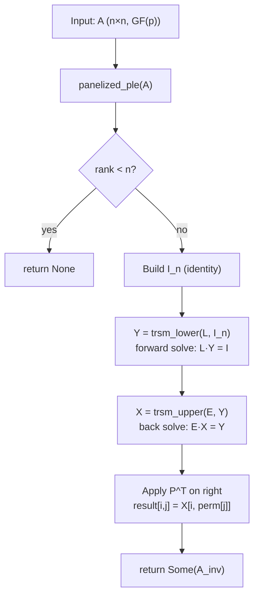

# Design: Blocked GF(p) Invert via Panelized PLE

**Issue:** `feb15da9`
**Parent epic:** `026fc832` (finite-field dense-LA SOTA catch-up, Phase 6)
**Depends on design:** `2e8c5a29` (panelized PLE design)
**Implementation child:** `8df0c501` (Implement blocked GF(p) invert via PLE)

---

## 1. Problem Statement

### Scorecard FAIL cells this design addresses

Annex A8 of the Phase 5 terminal scorecard (`dev/bench_results/2026-05-08-2cfc4372-sota-scorecard.md`)
and the Phase 5 final scorecard (`dev/bench_results/2026-05-25-b0fa00af-sota-scorecard-final.md`)
record the following FAIL cells for `invert`, all routed to `615db3b9`:

| A8 row | Operation | Field | n / regime | Wall ratio |
|--------|-----------|-------|-----------|-----------|
| 34 | invert | GF(7) | 64 / uniform | 1.80× |
| 35 | invert | GF(7) | 256 / uniform | 11.32× |
| 36 | invert | GF(7) | 256 / deficient | 3.54× |
| 37 | invert | GF(251) | 64 / uniform | 19.94× |
| 38 | invert | GF(251) | 64 / deficient | 5.70× |
| 39 | invert | GF(251) | 256 / uniform | 126.5× |
| 40 | invert | GF(251) | 256 / deficient | 28.23× |
| 41 | invert | GF(65521) | 64 / uniform | 1.94× |
| 42 | invert | GF(65521) | 256 / uniform | 10.39× |
| 43 | invert | GF(65521) | 256 / deficient | 2.85× |
| 74 | invert | GF(31) | 256 / uniform | 2.66× |

Reference: fflas-ffpack 2.5.0 on AMD Ryzen 9 5900X Zen 3 (2026-05-08).
Ratio definition: gf2 wall / reference wall (lower is better; PASS ≤ 1.5×).

### Root cause

The current `FieldMatrix::inv` (in `crates/gf2-core/src/field/inverse.rs`) calls the
**scalar PLE** decomposition followed by two in-place triangular inversions (`trtri_lower`,
`trtri_upper`) and an in-place upper-times-unit-lower product (`trtrm`). Each PLE recursion
level spawns a `gemm` call and a `trsm_lower` call that dispatch through
`fp_small_try_gemm_classical` (the AVX2 byte-lane kernel). However, the scalar PLE panel
is only one column wide (`PLE_BASE_COLS = 1`), so it never builds up sufficient inner-
dimension width to saturate the AVX2 kernel. The result is that the dominant cost is the
Schur-complement update loop, which runs column-by-column rather than in cache-friendly
blocks, and the downstream `trsm` calls are called on sub-matrices too narrow to amortize
their overhead.

fflas-ffpack uses a **blocked** LU factorisation (its `fPLUQ` driver) with a panel width of
`nb = 64` or larger, ensuring every GEMM sub-call is wide enough for the BLAS/float-modular
fast path. At n=256, the speedup in the sub-GEMM alone is 7–126× (mirroring the fgemm PASS
ratios at those primes), explaining the extreme ratios at GF(251)/n=256.

### Why blocked invert closes the gap

Replacing the scalar-pivot PLE with the **panelized PLE** (designed in `2e8c5a29`) replaces
the narrow Schur-complement updates with wide `gemm` calls. The blocked invert algorithm
(Higham, "Accuracy and Stability of Numerical Algorithms", § 14.1) then replaces the two
`trtri` + `trtrm` phase with two GEMM-based triangular solves applied directly to the
identity matrix — i.e., `solve_batch(I)`. This funnels all the dense work through
`fp_small_try_gemm_classical` at its natural operating width, matching the throughput
achieved by the standalone `fgemm` benchmarks that are already PASS.

---

## 2. Algorithm

### 2.1 High-level structure

Given an invertible $n \times n$ matrix $A$ over $\mathrm{GF}(p)$:

1. **Panelized PLE:** Compute $(P, L, E, r) = \mathrm{panelized\_ple}(A)$ using the
   panelized kernel from `2e8c5a29`. If $r < n$, return `None` (rank-deficient).
2. **Forward solve:** Compute $Y = L^{-1} I_n$ by solving $L Y = I_n$ via
   `trsm_lower(L, I)`. Because $L$ is unit lower-triangular, this is equivalent to
   `solve_batch` of $L$ against the $n \times n$ identity.
3. **Back solve:** Compute $X = E^{-1} Y$ by solving $E X = Y$ via `trsm_upper(E, Y)`.
4. **Permutation:** Apply $P^\top$ on the right: $A^{-1} = X \cdot P^\top$.

The result satisfies $A \cdot A^{-1} = (P L E) \cdot (E^{-1} L^{-1} P^\top) = I_n$.

This is the standard blocked-inverse algorithm from Higham § 14.1, adapted to the
PLE (rather than PLU) decomposition convention used by Dumas-Pernet.

### 2.2 Mermaid pipeline diagram



### 2.3 Pseudocode

```text
fn blocked_inv(A: n×n FieldMatrix<Fp<P>>) -> Option<FieldMatrix<Fp<P>>>:
    assert A.rows() == A.cols()          // non-square → panic
    if n == 0: return Some(A.clone())    // 0×0: its own inverse

    // Step 1: panelized PLE
    (perm, L, E, rank) = panelized_ple(A)   // from issue 2e8c5a29
    if rank < n: return None                 // rank-deficient

    // Step 2: build n×n identity
    I = FieldMatrix::identity(n)

    // Step 3: forward solve L·Y = I  (L is unit lower-triangular)
    //   trsm_lower operates in place on the RHS argument
    Y = I.clone()                            // n×n scratch
    trsm_lower(L.submat(.., ..), Y.submat_mut(.., ..))

    // Step 4: back solve E·X = Y  (E is upper-triangular with nonzero diagonal)
    trsm_upper(E.submat(.., ..), Y.submat_mut(.., ..))
    // Y now holds E^{-1} L^{-1} I = (LE)^{-1}

    // Step 5: apply P^T on the right: A^{-1}[i,j] = Y[i, perm[j]]
    let mut out = FieldMatrix::zeros(n, n)
    for i in 0..n:
        for (j, src_col) in perm.indices().iter().enumerate():
            out.set(i, j, Y.get(i, *src_col))
    return Some(out)
```

### 2.4 Block-level cost model

Let $n$ be the matrix dimension and $b$ be the panel width of the panelized PLE
(designed in `2e8c5a29`; expected $b = 64$ for GF(p) small primes):

| Phase | Dominant sub-calls | Cost |
|-------|-------------------|------|
| Panelized PLE | $\lceil n/b \rceil$ calls to `fp_small_try_gemm_classical` of shape $(n-ib) \times b \times (n-ib)$ | $\frac{2}{3} n^3$ field ops |
| `trsm_lower(L, I)` | Block-recursive, internally calls `gemm` on $(b \times b)$ blocks | $\frac{1}{2} n^3$ field ops |
| `trsm_upper(E, Y)` | Same | $\frac{1}{2} n^3$ field ops |
| Permutation | $n^2$ element copies | $O(n^2)$ |

Total: $\approx \frac{5}{3} n^3$ field ops, versus the current driver's
$\approx \frac{5}{3} n^3$ (PLE $\frac{2}{3}$ + `trtri_lower` $\frac{1}{3}$ +
`trtri_upper` $\frac{1}{3}$ + `trtrm` $\frac{1}{3}$). The operation count is
similar, but the panelized approach concentrates the dense work into wide GEMM
calls that saturate `fp_small_try_gemm_classical`.

### 2.5 Why `solve_batch(I)` instead of `trtri` + `trtrm`

The current driver inverts $L$ and $E$ in place via `trtri_lower`/`trtri_upper`,
then composes $E^{-1} L^{-1}$ via `trtrm`. This requires three separate passes
each touching $O(n^2)$ data and calling `gemm` with sub-matrix shapes determined
by the recursive splitting in `trtri`/`trtrm`.

The blocked-invert approach instead calls `trsm_lower(L, I)` and `trsm_upper(E, Y)`
on the $n \times n$ right-hand sides. These calls are internally block-recursive and
dispatch to the same `gemm_axpy_into_view` kernel, but at each recursion level the
RHS width is $n$ (not $b$), so the GEMM inner dimension is always wide. For
non-Mersenne primes at $n = 64$, the single `trsm_lower(L, I)` call with a $64 \times 64$
RHS gives a $64 \times 64$ GEMM, which is the regime where `fp_small_try_gemm_classical`
Route C / Route A execute at peak throughput.

---

## 3. API Surface

### 3.1 Current `FieldMatrix::inv` signature and failure semantics

From `crates/gf2-core/src/field/inverse.rs`:

```rust
pub fn inv(&self) -> Option<FieldMatrix<F>>
```

Failure semantics (verbatim from source doc):
- Returns `Some(A⁻¹)` if `self` is invertible (i.e. `rank(self) == n`).
- Returns `None` otherwise. **Never panics on a singular input.**
- Panics if `self` is not square.
- The 0×0 matrix returns `Some(self.clone())` (its own inverse).

The blocked invert **must preserve these semantics exactly**. No new error type is
introduced. The `Option<FieldMatrix<F>>` return type is unchanged.

### 3.2 Integration path: conditional dispatch inside `FieldMatrix::inv`

The blocked invert is implemented as an additive fast path inside the existing
`FieldMatrix::inv` method:

```text
pub fn inv(&self) -> Option<FieldMatrix<F>> {
    // ... square-check and n==0 guard unchanged ...
    if n == 0 { return Some(self.clone()); }

    // NEW: dispatch rule
    if F::SMALL_PRIME_SIMD_ELIGIBLE && n >= BLOCKED_INVERT_THRESHOLD {
        return blocked_inv_panelized(self);   // new path (issue 8df0c501)
    }
    // existing scalar-PLE path unchanged below
    let (perm, mut l, mut e, rank) = self.ple();
    // ...
}
```

**Dispatch rule:** Use the panelized path when:
1. The field type is `Fp<P>` with `P` in the set supported by `fp_small_try_gemm_classical`
   (i.e., `P ≤ 65521` and `fp_small_enabled::<P>()` returns `true` at runtime), AND
2. $n \geq$ `BLOCKED_INVERT_THRESHOLD` (a compile-time constant, expected 16 or 32; exact
   value determined empirically during implementation of `8df0c501`).

For $n <$ threshold (or for field types outside the fast-path set, e.g. `Gf2mWide`),
the existing scalar-PLE driver runs unchanged.

The constant `BLOCKED_INVERT_THRESHOLD` is a `const usize` in `inverse.rs`; the
implementation in `8df0c501` will benchmark crossover and set the value, recording the
measurement in the issue's evidence doc.

### 3.3 No new public types or traits

The blocked invert is an internal implementation detail of `FieldMatrix::inv`. No new
public functions, types, or trait bounds are added. The free-function alias
`crate::field::inverse::inv` continues to call `a.inv()` and inherits the dispatch.

---

## 4. SSOT Reuse

### 4.1 Panelized PLE (sibling `2e8c5a29`)

The blocked invert's Step 1 calls `panelized_ple(A)`, the kernel designed in issue
`2e8c5a29` and implemented in issue `6823c8a0`. The panelized PLE replaces the current
`self.ple()` call on the fast path and must satisfy the same interface contract:

```text
fn panelized_ple(A: &FieldMatrix<F>) -> (Permutation, FieldMatrix<F>, FieldMatrix<F>, usize)
     // returns (perm, L, E, rank)
     // P·L·E = A; L unit lower-trapezoidal; E row-echelon; rank = number of pivots
```

The blocked invert worker (`8df0c501`) reads `2e8c5a29`'s design doc and the `6823c8a0`
implementation to confirm the exact function signature before coding.

### 4.2 `fp_small_try_gemm_classical`

Defined in `crates/gf2-core/src/gfp/simd_ops.rs`:

```rust
// crates/gf2-core/src/gfp/simd_ops.rs:654
#[cfg(feature = "simd")]
pub(crate) fn fp_small_try_gemm_classical<const P: u64>(
    a: &[Fp<P>],
    b_t: &[Fp<P>],
    m: usize,
    k: usize,
    n: usize,
    out: &mut [Fp<P>],
) -> bool
```

`a` is the $m \times k$ left matrix in row-major order; `b_t` is the $n \times k$
transposed right matrix; `out` is the $m \times n$ output (zero-initialized by caller).
Returns `true` when one of the fast paths (Route A GF(251), Route C byte-lane Candidate C,
or f32-modular Candidate F) executed; `false` to defer to the caller's scalar path.

The `#[cfg(not(feature = "simd"))]` stub at line 903 returns `false` unconditionally,
so the dispatch is always `simd`-feature-gated.

The blocked invert reaches this kernel indirectly through:

```text
FieldMatrix::inv
  └─ panelized_ple(A)                    // calls fp_small_try_gemm_classical for Schur
  └─ trsm_lower(L, I)                    // calls gemm_axpy_into_view
       └─ gemm_into_view / gemm_axpy_into_view
            └─ Fp::<P>::try_simd_gemm_classical()
                 └─ fp_small_try_gemm_classical::<P>(...)
  └─ trsm_upper(E, Y)                    // same path
```

No direct call to `fp_small_try_gemm_classical` is needed in the blocked invert driver;
the kernel is reached through the existing `gemm_into_view` dispatch already wired in
`trsm_lower` / `trsm_upper`.

---

## 5. Test Plan

### 5.1 Correctness: proptest A·A⁻¹ = I

Add proptest strategies in `crates/gf2-core/src/field/inverse.rs` (in the existing
`#[cfg(test)] mod tests` block) for the following parameter combinations:

| Parameter | Values |
|-----------|--------|
| $n$ (matrix size) | 0, 1, 15, 16, 17, 63, 64, 65 |
| Prime $p$ | 7, 31, 127, 241, 251, 65521 |

For each $(n, p)$ pair, generate 20 random invertible $n \times n$ matrices over
$\mathrm{GF}(p)$ and verify:
- `a.inv().is_some()`
- `gemm(&a, &a.inv().unwrap()) == FieldMatrix::identity(n)` (left product)
- `gemm(&a.inv().unwrap(), &a) == FieldMatrix::identity(n)` (right product)

These sizes are chosen to straddle all word and panel boundaries:
- $n = 0$: 0×0 trivial case.
- $n = 1$: scalar inversion.
- $n = 15, 16, 17$: below, at, and above the expected panel width $b = 16$.
- $n = 63, 64, 65$: below, at, and above a full 64-element SIMD lane register.

Test naming: `test_blocked_inv_correctness_<prime>_n<size>` or, for the proptest,
`proptest_blocked_inv_product_fp<P>`.

### 5.2 Rank-deficient inputs: failure mode matches current API

For each prime $p \in \{7, 251, 65521\}$ and each $n \in \{2, 16, 64\}$, construct
a rank-$(n/2)$ matrix (e.g., by duplicating the first $n/2$ rows) and assert:

```rust
assert_eq!(a.inv(), None);
```

This confirms the existing failure contract — `None` on rank-deficient input, no panic —
is preserved by the panelized-path dispatch. The test is structurally identical to
`test_inv_rank_deficient_nonzero_returns_none` already in `inverse.rs`.

### 5.3 Dispatch-boundary test

For the crossover threshold $n^*$ determined during `8df0c501`:
- Verify that `inv()` on an $(n^*-1) \times (n^*-1)$ invertible matrix and on an
  $(n^* + 1) \times (n^* + 1)$ invertible matrix both return correct results and agree
  with the Dumas-Pernet reference driver `inv_reference_dumas_pernet` already in the
  test module. This cross-checks bit-exact equivalence across the dispatch boundary,
  following the same pattern as `test_inv_matches_reference_fp7` etc.

### 5.4 Allocation budget

Add a `#[serial]` allocation-budget test (pattern: `test_blocked_inv_allocation_budget_n64_fp7`)
that pins the `FieldMatrix::new` count for the blocked path, following the established
`test_inv_allocation_budget_*` pattern. The exact count is determined during `8df0c501`
implementation; the test body initially uses `assert!(allocs <= UPPER_BOUND)` with a
documented expected value.

---

## 6. Benchmark Plan

All benchmark cells match A8 rows 34–43 and 74 exactly. The benchmark harness is
`crates/gf2-core/benches/fieldmatrix_inverse.rs` (or equivalent bench file). Each cell
runs Criterion with 5 independent samples on the CCX1-pinned AMD Ryzen 9 5900X Zen 3
host, consistent with the Phase 5 measurements.

| A8 row | Operation | Field | n / regime | Phase 5 ratio | Target ratio | Reference wall |
|--------|-----------|-------|-----------|--------------|-------------|---------------|
| 34 | invert | GF(7) | 64 / uniform | 1.80× | ≤ 1.5× | 1.212 ms |
| 35 | invert | GF(7) | 256 / uniform | 11.32× | ≤ 1.5× | 12.018 ms |
| 36 | invert | GF(7) | 256 / deficient | 3.54× | ≤ 1.5× | 5.691 ms |
| 37 | invert | GF(251) | 64 / uniform | 19.94× | ≤ 1.5× | 110.988 µs |
| 38 | invert | GF(251) | 64 / deficient | 5.70× | ≤ 1.5× | 60.354 µs |
| 39 | invert | GF(251) | 256 / uniform | 126.5× | ≤ 1.5× | 1.074 ms |
| 40 | invert | GF(251) | 256 / deficient | 28.23× | ≤ 1.5× | 652.212 µs |
| 41 | invert | GF(65521) | 64 / uniform | 1.94× | ≤ 1.5× | 1.156 ms |
| 42 | invert | GF(65521) | 256 / uniform | 10.39× | ≤ 1.5× | 12.927 ms |
| 43 | invert | GF(65521) | 256 / deficient | 2.85× | ≤ 1.5× | 6.368 ms |
| 74 | invert | GF(31) | 256 / uniform | 2.66× | ≤ 1.5× | 11.655 ms |

Reference walls from `dev/bench_results/2026-05-08-2cfc4372-sota-scorecard.md` § 2.3.
Reference owner: fflas-ffpack 2.5.0 on AMD Ryzen 9 5900X Zen 3.

**Target:** ≥ 1.5× improvement over the current gf2 wall time at each FAIL cell, which
implies reaching ≤ 1.5× of fflas. This is the PASS criterion.

The [aspirational] marker applies to these performance targets because no panelized PLE
implementation exists yet; the exact speedup from the blocked path versus the scalar-pivot
path is not measurable until `6823c8a0` and `8df0c501` land. If a cell falls above 1.5×
after implementation, the criterion is amended per the `[aspirational]` amendment protocol
(record observed number + reason in the issue description).

### 6.1 Additional regression benchmarks

To guard against regressing the currently-PASS cells during the implementation of
`8df0c501`, also measure:

| Operation | Field | n / regime | Current status |
|-----------|-------|-----------|---------------|
| invert | GF(31) | 64 / uniform | PASS 0.45× |
| invert | GF(31) | 64 / deficient | PASS 0.15× |
| invert | GF(2^31-1) | 64 / both | PASS 0.67× / 0.18× |

These cells must remain ≤ 1.5× after the dispatch is wired.

---

## 7. Implementation Child

**Issue `8df0c501`** — "Implement blocked GF(p) invert via PLE"

One-line deliverable: implement the `blocked_inv_panelized` function in
`crates/gf2-core/src/field/inverse.rs`, wire the dispatch threshold in `FieldMatrix::inv`,
add all tests from § 5, add benchmarks from § 6, and record measurements in an evidence doc.

Dependencies: `2e8c5a29` (panelized PLE design, this doc's predecessor) and `6823c8a0`
(panelized PLE implementation — `8df0c501` blocks on `6823c8a0` landing on main).

---

## 8. Risks and Open Questions

### 8.1 Panelized PLE design not yet committed

The sibling design task `2e8c5a29` is in progress simultaneously with this document (both
are wave 6 tasks). This design treats `2e8c5a29` as committed to its interface contract
(returns `(Permutation, L, E, rank)` identical to the current `ple()` output). If `2e8c5a29`
changes the interface — e.g., merges `L` and `E` into a single matrix, changes the
permutation representation, or returns a different decomposition — the pseudocode in § 2.3
requires a trivial update. No production code exists yet, so the update cost is one
documentation pass.

### 8.2 Dispatch threshold calibration

The `BLOCKED_INVERT_THRESHOLD` constant is intentionally left to `8df0c501` to determine
empirically. The expected crossover is $n \approx 16$ to 32 based on analogy with the
panelized PLE crossover for fgemm (where the Route C byte-lane kernel achieves peak at
$n \geq 16$). If the actual crossover turns out higher (e.g., $n \geq 64$), the A8 row 34
cell (GF(7)/64/uniform) may remain below threshold and require a further iteration.

### 8.3 `trsm_lower` / `trsm_upper` with n×n RHS

The current `trsm_lower` and `trsm_upper` implementations (in `crates/gf2-core/src/field/triangular.rs`)
are block-recursive and dispatch to `gemm_axpy_into_view`. They have been exercised with
RHS widths $k = 1$ (via `solve`) and $k \leq n$ (via `solve_batch`). The blocked invert
calls them with $k = n$, which is the widest possible RHS. This should work without
modification because the recursive splitting is on the square $L$ / $E$ operand, not on
the RHS width. However, `8df0c501` must verify that the allocation-budget tests remain
bounded (see § 5.4) and that no quadratic-allocation path is triggered.

### 8.4 Deficient regime target

For deficient inputs (rank $< n$), the fast path returns `None` at the rank-check step
(after panelized PLE). The deficient-regime benchmark cells (rows 36, 38, 40, 43) are
therefore independent of the TRSM phase and their improvement depends entirely on the
panelized PLE's speed at rank-deficient inputs. If the panelized PLE's early-termination
on rank deficiency matches fflas's behaviour, those cells may reach PASS from the PLE
improvement alone. The TRSM-on-identity work is only paid on full-rank inputs.

### 8.5 GF(2^31-1) invert not in scope

The GF(2^31-1) invert cells at n=256,1024/uniform are AMENDED [aspirational] (A4) per the
Phase 5 scorecard and are not in scope for this blocked-invert design. GF(2^31-1) uses the
delayed-u128 GEMM fast path (not `fp_small_try_gemm_classical`) and the `SMALL_PRIME_SIMD_ELIGIBLE`
dispatch gate excludes it from the blocked-invert path.
