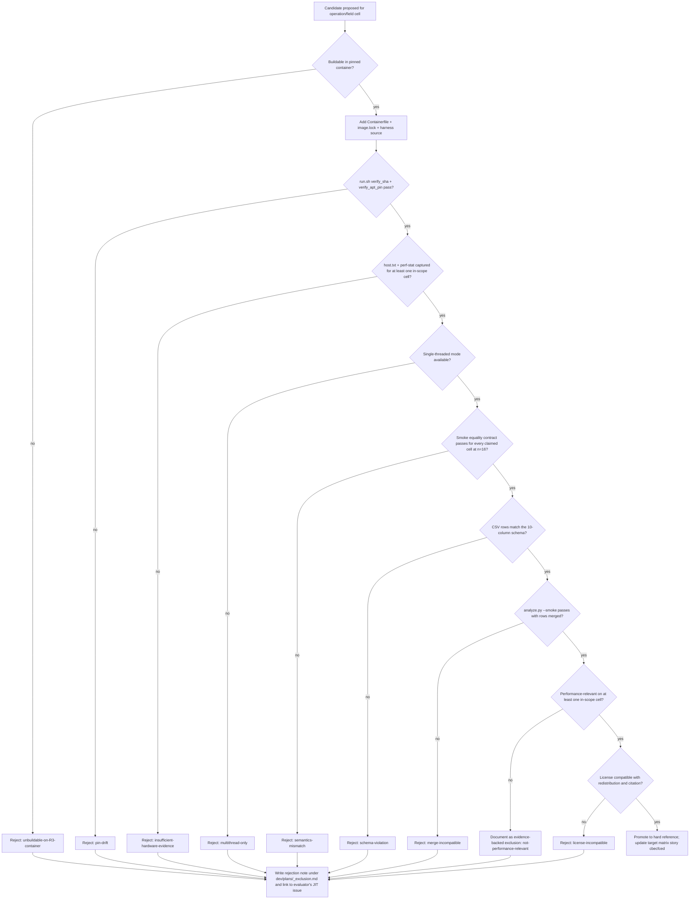

# SOTA Reference Acceptance Protocol

> **Scope.** This document defines the mechanical, evidence-driven protocol by
> which a candidate external implementation is either **promoted to a hard
> performance reference** or **rejected with a documented exclusion** for the
> `gf2-core` SOTA closure epic (`jit:97bf0879`).
>
> **Audience.** Future evaluators of NTL/FLINT (`jit:73ab8eef`), LinBox
> (`jit:79388011`), and M4RIE (`jit:507b0036`); reviewers of any subsequent
> "promote candidate X" pull request; the `code-review` and `doc-review`
> gates that evaluate this work.
>
> **Authority.** Linked to story `cbecfced` (*Define reproducible gf2-core
> SOTA reference matrix*) and to task `1d6043e8` (this document's owning
> issue) via `jit doc add`.

## 1. Problem statement

The post-PPC `gf2-core` epic (`jit:97bf0879`) contracts every in-scope
benchmark cell to be **within 1.5x of the best available reproducible
reference, or faster** ([hard]). The published baseline
`dev/bench_results/2026-04-26.md` already promotes two references — the
pinned-container `fflas-ffpack 2.5.0` (every GF(p) cell) and `M4RI 20260122`
(every GF(2) cell) — but four further candidates are explicitly named for
evaluation: `M4RIE`, `LinBox`, `NTL`, `FLINT`. The story
(`cbecfced`) requires each to be **either promoted to hard reference with a
working harness, or rejected with evidence**.

The 2026-04-26/29 evidence shows that informal promotion has already cost
the project clarity: the `2598b981` GF(p) sweep had to publish two ratio
columns ("gf2 / host fflas" and "gf2 / published fflas") because a
host-installed fflas build silently displaced the pinned-container build,
and the host's `Givaro 4.2.1` versus the container's `4.2.0` produced
materially different small-prime numbers (`GF(7)` 256³: 15.05 Gop/s host vs
50.75 Gop/s pinned). Without a written, mechanical acceptance protocol,
each future reference attempt repeats this process bug.

This protocol exists so that any agent or reviewer — without re-asking
what "reproducible" or "comparable semantics" means — can run a checklist
and produce a yes/no decision per criterion and per candidate.

## 2. Scope and non-goals

**In scope.** External finite-field linear-algebra and polynomial-arithmetic
libraries that operate over the field families `gf2-core` already implements:
GF(2), GF(p) (small / medium / large prime), GF(2^m) for `m ≤ 64`, and
sparse matrix variants of all of the above. Operations: dense `fgemm`,
`pluq`/`ple`, echelon, invert, solve, charpoly, minpoly, sparse `spmv` and
sparse `matmul`.

**Out of scope.** GPU-accelerated references; computer-algebra-system
references (Magma, Sage) — those are correctness oracles unless a future
user-approved amendment promotes a specific reproducible Magma/Sage
benchmark. AFF3CT/IT++ (gf2-coding decoder references) is a separate
program tracked outside epic `97bf0879`.

**Non-goal.** Speculative scoring of a candidate before a working harness
exists. The protocol is binary at every step; either the artefact exists
and matches, or the candidate is rejected (or deferred with a documented
exclusion class — see § 8).

## 3. Five mandatory acceptance criteria

A candidate becomes a `hard` reference for an `(operation, field-family)`
cell **iff and only iff all five criteria below hold**, each evidenced by
a concrete artefact in the repository. A candidate fails if **any**
criterion is unmet, in which case § 8 applies.

The five criteria are (in checklist order):

| # | Criterion          | Evidence artefact                                         |
|---|--------------------|-----------------------------------------------------------|
| 1 | Reproducible build | A pinned container layer matching § 4 plus a stamped `image.lock` row |
| 2 | Same hardware      | A `host.txt` and `*-perf-stat.txt` capture matching § 5 alongside the run |
| 3 | Comparable semantics | A correctness oracle pass per § 6 (operation-by-operation matrix) |
| 4 | Shared data shape  | A `benchmarks/reference/<lib>_bench.{cpp,c,rs}` source emitting the schema in § 7 |
| 5 | CSV merge support  | A run row in `benchmarks/results/<ts>.csv` that `analyze.py` accepts and merges |

The remainder of this section anchors each criterion to existing repo
artefacts and bench-day idioms so a future evaluator does not have to guess.

## 4. Reproducible build (criterion #1)

**Definition.** "Reproducible build" means: starting from a clean checkout of
`main`, running `./benchmarks/run.sh` on **any host with rootless podman
(or Docker)** must rebuild the candidate's reference binary from a layer
whose source pin is hash-locked, and the resulting artefact must satisfy the
existing `run.sh` pin-verification gate.

**Concrete requirements.**

1. **Container layer.** A new section is appended to
   `benchmarks/Containerfile` following the exact idiom used for
   `Givaro 4.2.0`, `fflas-ffpack 2.5.0`, and `M4RI 20260122`:
   ```dockerfile
   ARG <LIB>_VERSION=<version>
   ARG <LIB>_SHA256=<64-hex sha256 of upstream tarball>
   RUN curl -fsSL -o /tmp/<lib>.tar.gz <upstream URL> \
    && echo "${<LIB>_SHA256}  /tmp/<lib>.tar.gz" | sha256sum -c - \
    && tar -C /tmp -xf /tmp/<lib>.tar.gz \
    && cd /tmp/<lib>-${<LIB>_VERSION} \
    && ./configure --prefix=/usr/local --enable-shared --disable-static \
    && make -j"$(nproc)" \
    && make install \
    && rm -rf /tmp/<lib>-${<LIB>_VERSION} /tmp/<lib>.tar.gz
   ```
   `--disable-static` mirrors the existing pin posture; deviations need a
   one-line rationale comment in the Containerfile.

2. **Lock file row.** A matching `[libs.<lib>]` block in
   `benchmarks/image.lock` carries the same `version`, `source` URL, and
   `sha256`. `run.sh`'s `verify_sha` pre-build check (lines 130–155 of
   `benchmarks/run.sh`) cross-checks Containerfile `ARG`s against
   `image.lock`; **drift between the two is a build-time failure**.

3. **Stamped image id.** After a successful build, `run.sh` rewrites the
   `[image].local_id` slot to the produced image's content-addressable
   sha256. The bench-day baseline value is committed; a divergence on a
   future build is a tripwire, not an automatic failure (because
   `-march=native` couples the binary to host microarch — § 5).

4. **Compile flags.** The candidate must build cleanly under the existing
   container `ENV` block: `CFLAGS="-O3 -march=native -fPIC"`,
   `CXXFLAGS="-O3 -march=native -fPIC -std=c++17"`. If the candidate
   requires additional flags (e.g. AVX-512 enablement for FLINT), those
   flags are added to its `ARG` block, **not** to the global `ENV`, so
   the existing `fflas-ffpack` and `M4RI` builds remain bit-identical.

5. **No host-installed fallback.** The local fflas/Givaro fallback used
   by `dev/bench_results/2026-04-29-2598b981-fieldmatrix-gemm-fflas-sweep.md`
   is acceptable as **diagnostic context** but never as a promotion
   artefact. The pinned-container number is the only number that
   satisfies criterion #1.

**Rejection trigger.** If the candidate's upstream is unbuildable inside
`debian:bookworm-20260421-slim` with the pinned toolchain (e.g.
`gcc-12.2.0-14+deb12u1`), the candidate is rejected on criterion #1 with
an exclusion class of `unbuildable-on-R3-container` (§ 8).

## 5. Hardware (criterion #2)

**Definition.** "Same hardware" means: the candidate's reference numbers
are paired with a host-state capture sufficient for a third party to
recognize that the numbers are valid for that host's microarchitecture
class (and only that class).

**Required captures per run.** Every promotion-evidence run must produce
all three artefacts at the same timestamp prefix:

1. `benchmarks/host.txt` — written by `run.sh` from `uname -a`,
   `/etc/os-release`, `lscpu`, `/proc/cpuinfo` (first core only),
   `/proc/meminfo`, and runtime version. Already implemented.

2. `benchmarks/results/<ts>.csv` — the candidate's CSV rows; § 7 defines
   the schema.

3. `dev/bench_results/<date>-<short-id>-perf-stat.txt` — `perf stat -e
   cycles,instructions,branches,branch-misses,L1-dcache-loads,L1-dcache-load-misses
   -r 10` over a representative cell. Format follows
   `dev/bench_results/2026-04-28-c1-perf-stat.txt`. The chosen cell must
   match an in-scope cell — pick the largest square cell (e.g. `n=1024`
   for fgemm) the candidate covers.

**Hardware-class anchor.** The committed bench-day baseline is captured
on **AMD Ryzen 9 5900X (Zen 3, 12c/24t, AVX2 + BMI2 + VAES + VPCLMULQDQ;
no AVX-512)**, kernel `Linux 6.19.11-arch1-1`. Cross-host runs are
permitted; they must publish their own `host.txt`, but they cannot
displace a Zen-3 baseline. If the dev host is replaced, every promoted
reference must be re-measured before the new host's baseline is committed
— this is the "drift tripwire" semantics already in `image.lock`.

**Governor / boost / SMT policy.** The current bench-day idiom (per
`dev/bench_results/2026-04-26.md` § Methodology) leaves frequency boost on
and reports wall-clock with the `note: frequency boost left on; results
are wall-clock, not core-cycles`. A candidate is permitted to follow the
same idiom. A candidate that **requires** governor=performance, SMT off,
or core pinning to be competitive **must say so in its evidence row**;
the evaluator records the requirement and the protocol does not auto-veto
the candidate.

**Single-thread requirement.** All promotion runs are single-threaded.
Multi-threaded scaling is out of scope for this epic per `97bf0879`'s
parent description. A candidate that only runs multi-threaded by default
must expose a single-thread mode (e.g. `OMP_NUM_THREADS=1`); if it cannot,
it is rejected with exclusion class `multithread-only` (§ 8).

**Rejection trigger.** Missing `host.txt`, missing `perf-stat`, or a
microarchitecture mismatch from baseline that is not flagged in the
evidence row → criterion #2 fails.

## 6. Comparable semantics (criterion #3)

**Definition.** "Comparable semantics" means: for every `(operation,
field, shape)` cell the candidate claims to cover, its output on a
fixed-seeded input is **mathematically equivalent** to the gf2-core
output on the same input, **after the operation-specific normalization
spelled out below**.

This criterion is correctness-first. Per `CLAUDE.md`'s success-criterion
maturity rule, **correctness requirements are always `[hard]`** and never
amendable in-loop.

**Per-operation correctness contract.**

| Operation | Equality contract | Notes |
|---|---|---|
| `fgemm` (square) | Bitwise output equality of `C[i][j]` for all `i, j`, after both sides reduce results to canonical `[0, p)` (GF(p)) or canonical polynomial-residue form (GF(2^m)). | gf2-core stores in canonical form by construction; fflas-ffpack `Modular<int64_t>` does too. |
| `fgemm` (rectangular `m×k×n`) | As above. | Some references (e.g. fflas's host harness) only emit square; rectangular cells then carry `harness-scope-gap` per § 8. |
| `pluq` / `ple` | Equality of `(P, L, U, rank)` is **not** required (factorisations are not unique). Verify by reconstructing `P · L · U == A` over the field and checking `rank` matches. | Candidate must expose enough of the factorisation for the reconstruction product to be formed in the candidate's harness. |
| `echelon` (RREF) | Bitwise equality of the canonical RREF (unit pivots, zero columns above pivots, zero rows below rank). RREF is unique. | Both fflas-ffpack and M4RI emit canonical RREF. |
| `invert` | Bitwise equality of `A^{-1}` after reducing to canonical form. For singular `A`, both sides must report `singular`; the timing measures the singularity-detection path. |
| `solve` (`Ax = b`) | Equality of `x` after canonical reduction. Underdetermined / inconsistent systems: both sides must agree on solvability flag; if a particular solution is returned, equality is on the **specific** particular solution by basis convention (see "basis convention" note below). |
| `charpoly` | Equality of the characteristic polynomial as a vector of coefficients in canonical form, leading coefficient = 1, monic. |
| `minpoly` | Equality of the minimal polynomial as a vector of coefficients in canonical form, leading coefficient = 1, monic. |
| `spmv` | Bitwise equality of `y = A·x` after canonical reduction; sparse storage layout (CSR vs COO) is irrelevant as long as the seeded matrix is byte-identical. |

**GF(2^m) basis convention.** `gf2-core` uses the primitive polynomial
listed in `crates/gf2-core/src/primitive_polys.rs` for each `m`. A
candidate that uses a different primitive polynomial is **not** rejected
on criterion #3 if and only if it exposes its primitive polynomial
explicitly and the harness applies a basis-change transform (a
`m × m` GF(2) matrix `T`) that maps the candidate's representation to
the gf2-core representation. The basis-change matrix must be committed
under `benchmarks/reference/<lib>_basis_change_<m>.txt` and verified at
harness compile time. If the candidate cannot expose its primitive
polynomial choice, criterion #3 fails with exclusion class
`basis-incompatibility` (§ 8).

**GF(p) range convention.** `gf2-core` uses `[0, p)`. fflas-ffpack
`Modular<int64_t>` uses `[0, p)`; `ModularBalanced<int64_t>` uses
`[-(p-1)/2, (p-1)/2]`. Either is acceptable; the harness must apply the
canonical-form reduction before comparison.

**Determinism contract.** Both sides consume the same `splitmix64`-derived
seed sequence (`benchmarks/seeds/seed.txt` master + the derivation rule in
`benchmarks/README.md` § *Seed derivation*). The candidate's harness
**must call `gf2_bench_splitmix64` and `gf2_bench_derive_seed` from
`benchmarks/reference/seed_helpers.h`** so seed drift is structurally
impossible. New language harnesses (e.g. a Rust-side LinBox harness)
re-implement the same algorithm against an in-line test that proves
byte-equivalence with the reference C/C++ implementation.

**Correctness-oracle harness.** For each `(operation, field, shape)` cell
at `n = 16`, the candidate and the gf2-core implementation are run on the
same seeded input and the per-operation equality contract above is
asserted. Failure is a hard `exit(1)`. The smoke run must be invoked by
`benchmarks/smoke.sh` so the existing CI smoke path covers the new
candidate. **The smoke witness may be hosted in either form** (clarified
by Amendment 3 — see § 15):

1. A `--smoke` mode in the candidate's own benchmark harness (the
   original pattern, used by e.g. `fflas_bench --smoke`,
   `linbox_bench --smoke`, `m4ri_bench --smoke` for the dense-matmul
   cells).
2. A dedicated shared smoke harness (e.g.
   `benchmarks/reference/sparse_smoke.cpp`) that hosts oracle functions
   for each `(operation, field, shape)` cell across multiple candidate
   libraries and is itself invoked by `benchmarks/smoke.sh`. In this
   form, each candidate's bench harness may implement its own `--smoke`
   as a no-op pointer to the shared harness, provided the shared
   harness has dispatch coverage for every cell the bench harness
   claims a hard reference for.

Both forms satisfy criterion #3 as long as the per-cell equality contract
is asserted at `n = 16` in the path that `benchmarks/smoke.sh` runs.

**Rejection trigger.** Any equality contract above failing on a single
seeded `n = 16` cell → criterion #3 fails with exclusion class
`semantics-mismatch` (§ 8). This is non-negotiable; correctness
requirements are always `[hard]` regardless of any benchmark headroom the
candidate might offer.

## 7. Shared data shape (criterion #4)

**Definition.** "Shared data shape" means: the candidate's harness emits
CSV rows with **exactly** the schema declared in `benchmarks/README.md`
§ *CSV schema*. Any deviation is rejected at the `analyze.py` parse step.

**The schema is fixed.** Ten columns, in this order:

```
lib,operation,field,m,k,n,rank_regime,seed,wall_ns,throughput_ops
```

| Column | Type | Allowed values / convention |
|---|---|---|
| `lib` | string | The candidate's name as a stable identifier — lowercase, no spaces. New values: `m4rie`, `linbox`, `ntl`, `flint`. **The string is added to `benchmarks/analyze.py`'s implicit lib registry by appearing in at least one row; no code change is required.** |
| `operation` | string | Member of `{fgemm, matmul, pluq, echelon, invert, solve, charpoly, minpoly, spmv, sparse-matmul, sparse×dense, sparse-elim}`. M4RI uses `matmul`; `analyze.py` already aliases it to `fgemm` for cross-merge. **The three sparse operation values were added by Amendment 2 (2026-05-04) — see § 14.** |
| `field` | string | Member of `{GF(2), GF(7), GF(251), GF(65521), GF(2^31-1), GF(2^8), GF(2^16), GF(2^32)}`. New field tags require updating `FIELD_FAMILY` in `analyze.py` (cross-cutting change; flag for the lead). |
| `m, k, n` | usize | Matrix shape. Square ops emit `m == k == n`. Rectangular `fgemm` emits the actual values. |
| `rank_regime` | string | `uniform` or `deficient`. Operations that have no notion of rank deficiency emit `uniform` only. |
| `seed` | uint64 | The 64-bit deterministic seed for this row's matrix. Derived from the master seed via the published derivation rule (§ 6 *Determinism contract*). |
| `wall_ns` | uint64 | Mean wall-clock nanoseconds per iteration. `clock_gettime(CLOCK_MONOTONIC)` or `std::chrono::steady_clock`. |
| `throughput_ops` | float | Conventional dominant-term op count divided by `wall_ns`. The exact normalizer per operation is fixed in `benchmarks/README.md` § *CSV schema* — `2·m·k·n` for `fgemm`, `n³` for square factorisations and `charpoly`, `n⁴` for `minpoly`, `nnz` for `spmv`, `2·n³` for M4RI `matmul`. **A candidate that disagrees with the documented normalizer must update `benchmarks/README.md` and rebuild every existing CSV row before promotion.** |

**Per-cell warmup / iters defaults.** `--warmup 3 --iters 5`. A candidate
whose iteration time exceeds `kCellBudgetNs = 30 s` must implement an
`early_exit` warning to stderr (the existing fflas idiom in
`benchmarks/reference/fflas_bench.cpp` lines 75–80) and emit the partial
mean. The CSV column `wall_ns` then carries the partial mean; the
evaluator marks the cell `early_exit` in the side-by-side report.

**Header row policy.** The candidate's harness emits **only data rows on
stdout**. The header is written exactly once by `run.sh` (line 282).

**Stderr policy.** Status messages, compile-line scaffolding, and
`SINGULAR MATRIX`-style diagnostics go to stderr. The `2598b981` evidence
log was contaminated by stderr leaking into stdout; this is a recurrence
bug if it happens to a new candidate.

**Rejection trigger.** A row that `analyze.py` cannot parse (wrong
column count, unknown enum value, non-numeric `wall_ns`) → criterion #4
fails with exclusion class `schema-violation`.

## 8. CSV merge support (criterion #5)

**Definition.** "CSV merge support" means: the candidate's CSV rows merge
without modification into `analyze.py`'s side-by-side renderer, and
`analyze.py` selects the candidate as the canonical reference for cells
where its `(operation, field-family)` tuple has been declared canonical
in the target matrix.

**Concrete requirements.**

1. **`analyze.py` smoke-test passes.** Run
   ```bash
   python3 benchmarks/analyze.py --smoke
   ```
   This is the existing self-test; it must pass with the candidate's CSV
   rows added. No `analyze.py` source change should be required for a
   candidate that respects § 7.

2. **Side-by-side render.** Run
   ```bash
   python3 benchmarks/analyze.py \
       --gf2 dev/bench_results/<date>-gf2.csv \
       --reference dev/bench_results/<date>-reference.csv \
       --out dev/bench_results/<date>-tables.md
   ```
   on the post-promotion artefacts and verify every cell that the
   candidate covers shows a non-`PENDING` `ratio (gf2/<lib>)` column.

3. **Reference-selection rule.** `analyze.py` already encodes the
   reference-selection rule: M4RI for GF(2), fflas-ffpack for every other
   field. **A new candidate does not displace this default unless the
   target matrix (story `cbecfced`) explicitly designates the candidate
   as the canonical reference for an `(operation, field-family)` cell.**
   The target-matrix story owns those designations; this protocol owns
   only the gating procedure.

4. **No silent overwrite.** If two references claim the same cell (e.g.
   fflas-ffpack and LinBox both emitting `pluq` over `GF(2^31-1)`),
   `analyze.py` keeps both rows. The side-by-side rendering picks the
   canonical one; the other becomes `<lib>-secondary` evidence in a
   follow-up table. The protocol forbids silent overwrite because it
   destroys promotion evidence.

**Rejection trigger.** `analyze.py --smoke` failure, or an unrendered
post-merge cell where the candidate claimed coverage → criterion #5
fails.

## 9. Acceptance and rejection workflow

The evaluator (a sub-agent dispatched against `73ab8eef`, `79388011`, or
`507b0036`) executes this checklist top-to-bottom. The workflow is:



**Promotion artefact set.** A successful candidate produces:

- One commit on the evaluator's JIT branch carrying the Containerfile
  layer, `image.lock` row, `benchmarks/reference/<lib>_bench.{c,cpp,rs}`
  source, optional `<lib>_basis_change_<m>.txt` files, and the
  pinned-container CSV row(s).
- A short entry in `dev/plans/<lib>_promotion_evidence.md` capturing
  which `(operation, field)` cells the candidate now owns, the
  pinned-container build commands actually executed (copy-paste from
  the evidence run), and links back to `host.txt` /
  `perf-stat.txt` artefacts.
- `jit doc add cbecfced dev/plans/<lib>_promotion_evidence.md
  --doc-type evidence --label "<lib> promotion evidence"` so the target
  matrix story can render an up-to-date promotion ledger.

**Rejection artefact set.** A rejected candidate produces:

- A short entry in `dev/plans/<lib>_exclusion.md` carrying the **first**
  failed criterion in checklist order (one criterion per rejection;
  evaluators do not need to chase every downstream failure once the
  earliest one is fatal), the exact command and output that demonstrated
  the failure, the exclusion class from the table below, and one of:
  *(a)* a referenced upstream issue if the failure is fixable upstream,
  *(b)* the line in the candidate's source that prevents promotion, or
  *(c)* a license / policy citation if relevant.
- `jit doc add <evaluator-issue> dev/plans/<lib>_exclusion.md
  --doc-type evidence --label "<lib> exclusion evidence"` so the
  evaluator's `[hard]` "rejected with evidence" criterion is satisfied
  mechanically.

**Exclusion class registry.** A candidate may be rejected for at most
one of the following reasons. The list is exhaustive; a rejection that
does not fit one of these classes must escalate to the lead per
`.claude/skills/project-lead/references/escalation-policy.md`.

| Class | Meaning | Example |
|---|---|---|
| `unbuildable-on-R3-container` | Upstream fails to compile inside `debian:bookworm-20260421-slim` with the pinned toolchain. | A library requiring `gcc-15` would fall here. |
| `pin-drift` | Candidate's tarball sha256 disagrees with `image.lock` after a re-pin attempt. | Indicates upstream tag mutation. |
| `insufficient-hardware-evidence` | Promotion run did not emit `host.txt` or `perf-stat.txt`. | Procedural failure, fixable in a re-run. |
| `multithread-only` | Library has no single-threaded mode available. | Hypothetical — none of the named candidates is thought to fall here. |
| `semantics-mismatch` | Smoke equality contract fails for at least one cell. | A different basis convention with no exposed primitive polynomial. |
| `schema-violation` | CSV rows fail § 7. | Wrong column count; unknown field tag. |
| `merge-incompatible` | `analyze.py --smoke` fails with the candidate's rows. | Downstream of `schema-violation` but tracked separately because the schema may pass row-by-row while still tripping the merger. |
| `not-performance-relevant` | Candidate is reproducible and correct, but every in-scope cell shows it ≥ 100x slower than an existing promoted reference. **Marker, not a fail-fast.** Evidence is still archived because future scope may revive the candidate. | A library that targets arbitrary precision and is not competitive at machine-word sizes. |
| `basis-incompatibility` | GF(2^m) candidate cannot expose its primitive polynomial. | Specific to GF(2^m). |
| `license-incompatible` | Upstream license forbids redistribution alongside `gf2-core` or its citation in evidence docs. | Hypothetical; LGPL/MIT/GPL-2 are fine. |
| `not-yet-harnessed` | Candidate or candidate cell has no harness in `benchmarks/reference/` yet. The cell may be promoted in a future task that lands the harness; until then, the cell is excluded with this marker. **Marker, not a fail-fast.** Added by Amendment 2 (2026-05-04). | A future GF(2^32) NTL/FLINT harness — see issue `b13799ac`. |
| `no-independent-oracle` | Candidate is buildable, fast, and reproducible, but no *second* harness covers the same cell, so the protocol's § 6 bitwise-equality oracle cannot be applied. **Marker, not a fail-fast.** A library may legitimately be the *only* candidate for a cell; the marker records that a sibling oracle is missing. Added by Amendment 2 (2026-05-04). | LinBox `Method::SparseElimination` over GF(p) when no other library exposes a sparse Gauss-Jordan symbol — fflas-ffpack, FLINT, NTL, M4RI all lack the path. |

**Re-evaluation policy.** A rejected candidate may be re-evaluated when
the rejecting class no longer applies (e.g. a future upstream release
fixes `unbuildable-on-R3-container`). Re-evaluation re-runs the full
checklist; partial credit is not granted because the underlying artefacts
must be re-pinned to the new version anyway.

## 10. Worked example A — promoting fflas-ffpack on GF(p) (already done)

This example walks the protocol against the bench-day baseline so
future evaluators can reproduce its structure.

| Criterion | Evidence |
|---|---|
| #1 Reproducible build | `benchmarks/Containerfile` lines 84–100 (`ARG FFLAS_VERSION=2.5.0`, `ARG FFLAS_SHA256=dafb4c0835...`); `benchmarks/image.lock` `[libs.fflas-ffpack]` block; `[image].local_id = sha256:6c5d58a4...` stamped from the 2026-04-26 build. `run.sh verify_sha FFLAS_SHA256 libs.fflas-ffpack` must pass at run time. |
| #2 Same hardware | `benchmarks/host.txt` records AMD Ryzen 9 5900X, 12c/24t, AVX2/BMI2/VAES/VPCLMULQDQ. `dev/bench_results/2026-04-28-c1-perf-stat.txt` is the bench-day perf-stat capture for the GF(2^m) sibling cell; an equivalent capture is required for any future re-promotion run. The 2026-04-26 baseline pre-dates the perf-stat-on-promotion convention; subsequent runs (e.g. `2598b981`) are required to attach perf-stat to be considered fresh promotion evidence. |
| #3 Comparable semantics | `benchmarks/reference/fflas_bench.cpp` consumes `Modular<int64_t>` for GF(p), p ≤ 2^31-1; canonical form `[0, p)`. Smoke equality is enforced at `n = 16` against gf2-core's `FieldMatrix::gemm`. Both sides apply the same `splitmix64` seed (master `0x6F73AC91D31E4A7C` from `benchmarks/seeds/seed.txt`). |
| #4 Shared data shape | Rows in `dev/bench_results/2026-04-26-reference.csv` carry exactly ten columns; first row: `fflas-ffpack,fgemm,GF(2^31-1),64,64,64,uniform,5180433273409205583,405176,1.293976e+09`. |
| #5 CSV merge support | `python3 benchmarks/analyze.py --gf2 ...-gf2.csv --reference ...-reference.csv --out ...-tables.md` rendered the 2026-04-26 side-by-side tables without modification. |

**Outcome.** Promoted to hard reference for every GF(p) cell in
`{fgemm, pluq, echelon, invert, solve, charpoly}` at `n ∈ {64, 256, 1024,
4096}` (4096 only for fgemm; rest deferred per § *Deferred to T2 / T3* in
`benchmarks/README.md`). Canonical reference selected by `analyze.py` for
all GF(p) families.

**Outstanding caveat for future re-promotion.** The 2598b981 host-fflas
sweep showed `Givaro 4.2.1` produces materially different `GF(7)`
numbers from container `Givaro 4.2.0`. If a future run wants to refresh
the GF(p) baseline, it must rebuild the container (the lockfile has
already been written with the matching pin) — never paper over a
host-side fallback.

## 11. Worked example B — rejecting a hypothetical candidate

To make the rejection path concrete, this section walks through a
rejection of a hypothetical candidate (`HypotheticalLib 1.0`) against
the protocol. This example is illustrative only; no actual evaluator
has to follow this exact chain.

**Setup.** `HypotheticalLib 1.0` claims to provide `fgemm` over
`GF(2^16)`. Upstream is on GitHub, MIT-licensed, builds with
`gcc ≥ 13`, and uses a default primitive polynomial of `x^16 + x^5 + x^3
+ x^2 + 1` instead of the gf2-core
choice `x^16 + x^12 + x^3 + x + 1`.

| Criterion | Result | Evidence |
|---|---|---|
| #1 Reproducible build | **FAIL** | Container build fails: `gcc-12.2.0-14+deb12u1` cannot compile a C++23 feature the library requires (`std::expected`). |

**Outcome.** Rejected on criterion #1 with exclusion class
`unbuildable-on-R3-container`. The evaluator stops here — they do **not**
proceed to #2–5 because the protocol is fail-fast on the earliest
criterion. The evaluator writes
`dev/plans/hypotheticallib_exclusion.md` containing:

```markdown
# HypotheticalLib 1.0 — exclusion evidence

**Class:** unbuildable-on-R3-container

**Earliest failed criterion:** #1 Reproducible build.

**Evidence command:**
    podman build -t gf2-bench:hypotheticallib -f benchmarks/Containerfile.hypothetical benchmarks/

**Failing line of build output:**
    .../HypotheticalLib/include/hl/result.hpp:42:10: error:
        'expected' in namespace 'std' does not name a template type

**Root cause:** HypotheticalLib 1.0 requires C++23 `std::expected`,
which is not available in the pinned `g++-12.2.0-14+deb12u1` toolchain.
A future container refresh to `g++-13+` would unblock evaluation but
would also invalidate every existing fflas-ffpack and M4RI baseline
(both depend on the pinned toolchain) and is therefore out of scope for
this epic.

**Re-evaluation trigger:** When the bench-day base image refreshes to a
Debian release with `g++ ≥ 13`, re-run the full protocol against
HypotheticalLib's then-current upstream version.
```

A second hypothetical that fails criterion #3 instead would replace the
`Class:` and `Earliest failed criterion:` lines, attach the smoke-run
output that diverged at `n = 16`, and (if the divergence is a basis
mismatch) recommend either a basis-change matrix or formal acceptance
under `basis-incompatibility`.

## 12. Maintenance and amendment

This protocol is a `[hard]` design contract. Amendments require:

1. A failing real-world case in a JIT issue under epic `97bf0879` that
   demonstrates the current text is unworkable.
2. A user-approved escalation per
   `.claude/skills/project-lead/references/escalation-policy.md`.
3. A patch to this file in the same commit that resolves the failing
   case, with a short "Amendment N" subsection at the end of the file
   citing the JIT issue.

Bench-day idiom drift (e.g. a future run wants `--warmup 5` instead of
`--warmup 3`) is recorded as a config-only amendment; the protocol still
holds.

## 13. Open questions

These are flagged so the lead and the downstream evaluators can resolve
them rather than guess in-loop:

1. **GF(2^m) basis-change matrix authoring.** The protocol prescribes
   `benchmarks/reference/<lib>_basis_change_<m>.txt` for candidates that
   use a different primitive polynomial, but no such file exists today
   (M4RIE is the most likely first user). The exact file format
   (whitespace-separated bits row by row? hex words?) should be agreed
   when the M4RIE evaluator (`507b0036`) starts work, and back-ported
   into this document as Amendment 1.

2. **`analyze.py` reference-selection extension for canonical
   designations.** § 8.3 says the target matrix story (`cbecfced`)
   designates canonical references per `(operation, field-family)`, but
   `analyze.py` currently hardcodes `M4RI for GF(2), fflas-ffpack
   otherwise`. If the target matrix designates LinBox as canonical for,
   say, `charpoly` over `GF(2^31-1)`, `analyze.py` will need a
   per-cell override map. Whether that map lives in `analyze.py`, in
   `benchmarks/reference_matrix.toml`, or as a CLI flag is undecided.
   Flagging for the lead.

3. **Dev-host replacement protocol.** § 5 says "if the dev host is
   replaced, every promoted reference must be re-measured before the
   new host's baseline is committed". The mechanics of "every promoted
   reference must be re-measured" are an unspecified labour cost
   (likely a half-day on a new host). Whether that re-measurement is
   gated by JIT (a `recalibrate-references-on-host-change` issue
   created automatically) or by lead intervention is undecided.

4. **NTL / FLINT determinism.** Both libraries expose `ZZ_pX` and
   polynomial-arithmetic primitives that may use upstream RNGs at
   default settings. Whether they can be coerced to use the
   `splitmix64` master seed without intrusive source patches is a
   feasibility question the `73ab8eef` evaluator must answer before
   any other criterion is checked. If they cannot, the evaluator
   either: (a) runs them on a deterministic input array passed in by
   our harness (preferred), or (b) records `not-performance-relevant`
   if the library only exposes randomized algorithms whose outputs
   cannot be made bit-stable across runs. Note that `not-performance-
   relevant` is a marker, not a hard reject — the criterion #3
   semantics-mismatch path is the right home for an irreproducible
   answer that the harness cannot stabilize.

5. **Stamping perf-stat into `image.lock`.** Currently `image.lock`
   stamps only `[image].local_id`. We may want a similar stamp for
   the bench-day `perf-stat` digest (sha256 of the perf-stat file)
   so future runs can detect host-state drift mechanically. Out of
   scope for this protocol; flag for follow-up.

## 14. Amendment 2 (2026-05-04) — sparse operations + new exclusion classes

**JIT origin.** Wave 3 closure of epic `97bf0879`. User-approval recorded
in `dev/plans/gf2m_reference_lane_selection.md` § 6 and
`dev/plans/sparse_benchmark_corpus.md` § 9. Issues `9a715d75` and
`a3412e15` generated the failing real-world cases: 9a715d75 produced 18
GF(2^m) cells with no second harness available (resolved by the new
`no-independent-oracle` class) plus a deferred GF(2^32) cell now scoped
into task `b13799ac` (resolved by the new `not-yet-harnessed` class);
a3412e15 produced 12 sparse cells whose operation values
(`sparse-matmul`, `sparse×dense`, `sparse-elim`) were not in § 7's
allowed list.

**Patches applied to this protocol in the same commit:**

1. § 7 *CSV schema* — `operation` allowed-values list extended to
   `{fgemm, matmul, pluq, echelon, invert, solve, charpoly, minpoly,
   spmv, sparse-matmul, sparse×dense, sparse-elim}`.
2. § 9 *Exclusion class registry* — two new entries:
   - `not-yet-harnessed` (marker for a cell that lacks a harness today
     but is on the roadmap to land one).
   - `no-independent-oracle` (marker for a cell where a single
     candidate is the only harnessed option, so § 6 bitwise-equality
     against a sibling cannot be enforced).
3. **Downstream `analyze.py` validator update** — owned by issue
   `47698404` (Re-run sparse post-PPC scorecard). Until 47698404
   lands, the `analyze.py` schema validator will reject sparse rows;
   this is acknowledged in 47698404's scope.

**No prior protocol behaviour is invalidated.** The five mandatory
acceptance criteria (§ 3) are unchanged; the existing exclusion
classes are unchanged; the seed-helper contract is unchanged.

## 15. Amendment 3 (2026-05-05) — shared smoke-harness clarification

**JIT origin.** Wave 3-4 closure of epic `97bf0879`, specifically issue
`47698404` (Re-run sparse post-PPC scorecard) under code-review R10. The
sparse work landed a dedicated shared smoke harness
(`benchmarks/reference/sparse_smoke.cpp`) that hosts oracle functions
for fflas-ffpack, LinBox, and self-canonical paths across all sparse
cells the bench harnesses claim. The corresponding bench harnesses
(`fflas_sparse_bench`, `linbox_sparse_bench`) implement `--smoke` as
no-op pointers to the shared harness. The design doc
(`dev/plans/sparse_benchmark_corpus.md` § 4 "extend
`benchmarks/reference/ntl_flint_smoke.cpp` (or add
`benchmarks/reference/sparse_smoke.cpp`)") already anticipated this
shape. This amendment brings the protocol's § 6 *Correctness-oracle
harness* paragraph into alignment with the implemented architecture so
reviewers can verify criterion #3 against the actual code path
`benchmarks/smoke.sh` runs.

**Patch applied to this protocol in the same commit:**

§ 6 *Correctness-oracle harness* — replaced "Each candidate's harness
must include a `--smoke` mode" with a two-form contract: the smoke
witness may be hosted either in-bench (form 1, the original pattern) or
in a dedicated shared smoke harness invoked by `benchmarks/smoke.sh`
(form 2). The per-cell equality contract at `n = 16` and the "failure is
hard `exit(1)`" semantics are unchanged. The existing in-bench `--smoke`
implementations (`fflas_bench`, `linbox_bench`, `m4ri_bench`,
`m4rie_bench`, `ntl_bench`, `flint_bench`) continue to satisfy criterion
#3 under form 1.

**No prior protocol behaviour is invalidated.** The five mandatory
acceptance criteria (§ 3) are unchanged; existing dense-matmul harnesses
that implement form-1 in-bench `--smoke` continue to pass; the
seed-helper contract is unchanged. The sparse harnesses are explicitly
permitted to use form 2 because their cell coverage spans multiple
candidate libraries (fflas, LinBox, scalar reference for GF(2^m)) plus
the gf2-core ground-truth file mechanism (`96fde7c7`), and a single
shared harness loading the ground-truth once is more efficient and less
duplicative than emitting an embedded smoke per bench.

## 16. Mapping to issue 1d6043e8 success criteria

For reviewer convenience, the two `[hard]` criteria of this issue map
to specific sections above:

| Issue criterion | Sections that satisfy it |
|---|---|
| The protocol requires reproducible build, same hardware, comparable semantics, shared data shape, and CSV merge support. | § 3 (mandatory five-criteria checklist), § 4 (build), § 5 (hardware), § 6 (semantics), § 7 (shape), § 8 (merge), § 9 (workflow & rejection classes). |
| The protocol is linked as a design doc to the reference-matrix story. | Performed via `jit doc add cbecfced dev/plans/sota_reference_acceptance_protocol.md ...`; § 1 explicitly names `cbecfced` as the parent story. |
