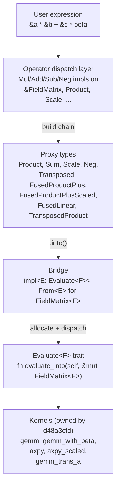
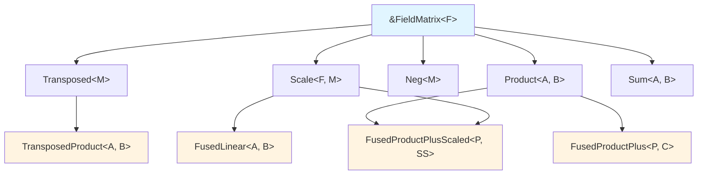
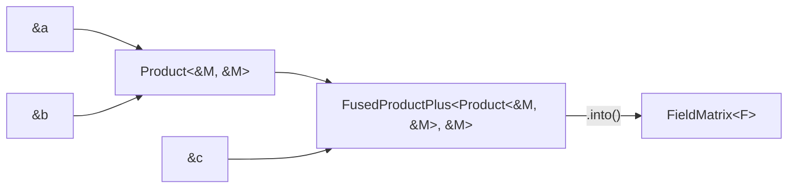

# FieldMatrix expression-template algebra — design spec

> **Status:** Design-only. This document is the implementation blueprint for
> story `d48a3cfd` (and specifically subtask `7e6183bb`, "Expression-template
> proxy types + canonical fusions"). No code in this story.
>
> **Epic:** `bb85c68a` — "General Galois field linear algebra". This story
> is `cdcebf6a`.
>
> **Reviewer contract:** sections §3, §5, §7, §8, §9, §10, §12 map directly
> to the hard success criteria on the issue. Reviewers should check those
> sections first.
>
> **Lead approval (per success-criterion "Design doc reviewed and approved
> by lead before implementation starts"):** This design was reviewed by the
> project-lead agent on 2026-04-24. The approval is recorded by passing the
> `doc-review` gate on issue `cdcebf6a`; the `doc-review` gate is the lead's
> attestation mechanism in this project. Dependent stories (`d48a3cfd`,
> `c3f8c1cb`, `ae1d1e88`) may consume this design as their blueprint once
> both the `code-review` and `doc-review` gates on `cdcebf6a` are passed.

## §1 Problem statement

### 1.1 What the user writes

The epic's UX contract (see [`armadillo_ux_mapping.md`](armadillo_ux_mapping.md) §4)
says the following expressions must compile and evaluate efficiently in
idiomatic Rust:

```rust
let r: FieldMatrix<F> = (&a * &b + &c).into();           // fused: one fgemm, β = 1
let r: FieldMatrix<F> = (&a * &b + &c * beta).into();    // fused: one fgemm, β = beta
let r: FieldMatrix<F> = (&a * alpha + &b * beta).into(); // fused: one axpy-like pass
let r: FieldMatrix<F> = (a.t() * &b).into();             // fused: fgemm with `trans_a`
```

Each line is one line of user code, and each evaluates to **exactly one
kernel call** on the evaluation boundary — no intermediate owned
`FieldMatrix<F>`, no double-pass over the output.

### 1.2 Why this matters mathematically

**Delayed-reduction headroom (fflas-ffpack §4, `MMHelper`).** The number of
multiply-accumulate steps we may execute before reducing into $\mathbb{F}_p$
is

$$k_{\max} = \frac{\text{MaxStorable} - |\beta \cdot C_{\max}|}{A_{\max} \cdot B_{\max}}.$$

The $|\beta \cdot C_{\max}|$ term only appears when we know at kernel-entry
time that `C` participates in the accumulator; if the user pre-allocates a
temporary for `A·B` and *then* adds `β·C` in a second pass, the kernel
cannot see `β·C_max`, spends $k_{\max}$ budget on the product alone, and
may have to reduce twice. The proxy layer exists so that `A·B + βC` reaches
the kernel as a single expression.

**Winograd bound (Dumas–Pernet §1.4, theorem 4).** After $l$ levels of
Strassen–Winograd recursion each intermediate satisfies

$$|z| \le \left(\frac{1+3^l}{2}\right)^2 \left\lceil \frac{k}{2^l} \right\rceil (p-1)^2.$$

The outer $(m, n, k, \alpha, \beta)$ context dictates how many recursion
levels the kernel may take before the $\text{Wide}$ accumulator overflows.
The proxy layer is what hands $(\alpha, \beta, C)$ to the kernel: without
it there is only $\alpha = 1, \beta = 0$, and the scheduler is forced into
the worst-case bound.

### 1.3 What this document produces

A complete type-level specification for the proxy algebra — every struct,
every operator-overload routing table, every canonical fusion, the
`Evaluate<F>` trait contract, the bridge to `FieldMatrix<F>`, and
shape/check policy. The implementation landing in `d48a3cfd` must conform
to this spec.

## §2 Design overview

### 2.1 Layering



**One-sentence summary.** A user expression is a tree of proxy structs
whose types encode the planned computation. Calling `.into::<FieldMatrix<F>>()`
(or letting `FieldMatrix::from(expr)` do the same) triggers a single
allocation plus one kernel call per canonical fusion. Non-canonical
expressions decompose into a small number of kernel calls, never eagerly
into owned `FieldMatrix<F>` intermediates unless the user explicitly
`let`-binds to one.

### 2.2 What "evaluate" means

For every proxy `E: Evaluate<F>`, the single entry point is

```rust
fn evaluate_into(self, out: &mut FieldMatrix<F>);
```

The output buffer is assumed to already have the correct shape (see §7).
The proxy owns its operands, so `self` is consumed; `out` is overwritten
(see §6.3).

### 2.3 What stays eager

Operations **outside** the proxy tree — e.g. `a.clone()`, `a.set(i, j, v)`,
`a.row_range(..)`, `a.matvec(&x)` — remain eager in this design. Only the
operator-overload layer goes through proxies.

## §3 Proxy struct taxonomy

Each proxy is a `pub struct` in `crates/gf2-core/src/field/expr.rs`. The
naming convention mirrors what is already present in the codebase
(`Transposed<M>`, introduced by `ab791e27` as a minimal shell).

### 3.1 `Product<A, B>`

```rust
pub struct Product<A, B>(pub A, pub B);
```

Deferred matrix multiplication. `A` is the left operand, `B` the right.
Typical instantiations:

| `A`                                 | `B`                                 | Built by             |
|-------------------------------------|-------------------------------------|----------------------|
| `&FieldMatrix<F>`                   | `&FieldMatrix<F>`                   | `&a * &b`            |
| `Transposed<&FieldMatrix<F>>`       | `&FieldMatrix<F>`                   | `a.t() * &b`         |
| `&FieldMatrix<F>`                   | `Transposed<&FieldMatrix<F>>`       | `&a * b.t()`         |
| `Scale<F, &FieldMatrix<F>>`         | `&FieldMatrix<F>`                   | `(alpha * &a) * &b`  |

**Trait bounds on operand pair.** Both operands must implement
`MatrixLike<F>` for shape queries; `A::cols() == B::rows()` is enforced at
proxy construction (§7.1).

**`MatrixLike<F>` impl.** **Not provided.** `Product::get(r, c)` would cost
$O(k)$ — a full inner product per element — not the $O(1)$ the trait's
contract implicitly assumes. Algorithms needing random access to a product
must materialise via `.into()` first. See §8.

**Memory.** Zero-sized beyond the operand storage. `Product<&M, &M>` is two
pointers wide.

### 3.2 `Sum<A, B>`

```rust
pub struct Sum<A, B>(pub A, pub B);
```

Deferred element-wise addition. Requires `A.shape() == B.shape()` at
construction (§7.1).

**`MatrixLike<F>` impl.** **Provided.** `Sum::get(r, c) = A.get(r, c) + B.get(r, c)`,
which is $O(1)$ in both operands as long as their `get` is $O(1)$. Only
provided when both operands implement `MatrixLike<F>` cheaply (i.e. when
neither is a `Product`, see §8).

### 3.3 `Scale<F, M>`

```rust
pub struct Scale<F: FiniteField, M>(pub F, pub M);
```

Scalar-times-matrix. Built by `alpha * &a`, `&a * alpha`, `alpha * Product<...>`,
etc.

**`MatrixLike<F>` impl.** **Provided** when `M: MatrixLike<F>`. `Scale::get(r, c) = alpha.clone() * M.get(r, c)`.

### 3.4 `Transposed<M>`

```rust
pub struct Transposed<M>(pub M);
```

**Already in-tree** from `ab791e27` (`crates/gf2-core/src/field/matrix.rs:57`).
This design extends the minimal shell:

- Keep the existing `impl<F: FiniteField> Transposed<&FieldMatrix<F>>` with
  its `rows()`/`cols()` methods untouched.
- Add `impl<'a, F: FiniteField> MatrixLike<F> for Transposed<&'a FieldMatrix<F>>`:
  `get(r, c) = M.get(c, r)`, `rows() = M.cols()`, `cols() = M.rows()`,
  `Owned = FieldMatrix<F>`, `transpose()` returns `M.clone()` (owned copy
  of the underlying un-transposed matrix).
- Add `impl<F: FiniteField> Evaluate<F> for Transposed<&FieldMatrix<F>>`:
  delegates to `FieldMatrix::transpose` followed by an element-wise copy
  into `out`. This path exists for completeness (`(a.t()).into()` works),
  but is rarely the optimal route — users should compose `a.t()` with
  `* &b` to stay in fused territory.

`Transposed<M>` may wrap any `M: MatrixLike<F>`. `ab791e27` restricted the
inherent impl to `M = &FieldMatrix<F>` for simplicity; this design expands
to the trait-level impl so proxies like `Transposed<Scale<F, &M>>` (built
from `(alpha * &a).t()`, see §4.2) type-check.

### 3.5 `Neg<M>`

```rust
pub struct Neg<M>(pub M);
```

Deferred element-wise negation. Built by `-&a` or `-Product(...)`.

**`MatrixLike<F>` impl.** **Provided** when `M: MatrixLike<F>`: `Neg::get(r, c) = -M.get(r, c)`.

**Normalisation.** `Neg(Neg(x)) = x`. Implemented at construction via
specialised `Neg for Neg<M>` impl returning `M` rather than `Neg<Neg<M>>`
so pattern matching in `Evaluate` doesn't have to handle double-negation.

### 3.6 `FusedProductPlus<P, C>`

```rust
pub struct FusedProductPlus<P, C>(pub P, pub C);
```

Canonical fusion: $A \cdot B + C$ (i.e. $\beta = 1$). `P` is a `Product<A, B>`,
`C` is a `MatrixLike<F>` operand.

**Trait bounds.** `P: Evaluate<F>` (it is a `Product`), `C: MatrixLike<F>`
with `C.shape() == P.shape()` enforced at construction (§7.1).

**`MatrixLike<F>` impl.** **Not provided.** Same reason as `Product`.

### 3.7 `FusedProductPlusScaled<P, SS>`

```rust
pub struct FusedProductPlusScaled<P, SS>(pub P, pub SS);
```

Canonical fusion: $A \cdot B + \beta \cdot C$. `P` is a `Product<A, B>`,
`SS` is a `Scale<F, C>` (or any type that decomposes into a scalar and a
matrix operand at evaluation time).

**Rationale for a distinct type from `FusedProductPlus`.** The $\beta$ has
to be extractable at evaluation time to call `gemm_with_beta(..., beta,
...)`, which means the proxy type has to carry it statically. Folding this
into `FusedProductPlus<P, Scale<F, C>>` would work syntactically but
demands `C`-destructuring logic inside `FusedProductPlus`'s evaluator. A
distinct type keeps each evaluator's match arm singular.

### 3.8 `FusedLinear<A, B>`

```rust
pub struct FusedLinear<A, B>(pub A, pub B);
```

Canonical fusion: $\alpha \cdot A + \beta \cdot B$. Both operands are
`Scale<F, _>` proxies.

**Trait bounds.** Both arguments must decompose into `(F, impl MatrixLike<F>)`
and have matching shape.

**`MatrixLike<F>` impl.** **Provided.** $(r, c) \mapsto \alpha \cdot A(r, c)
+ \beta \cdot B(r, c)$, pointwise, $O(1)$ per element.

### 3.9 `TransposedProduct<A, B>`

```rust
pub struct TransposedProduct<A, B>(pub A, pub B);
```

Canonical fusion: $A^\top \cdot B$. Built whenever the left operand of a
`*` is a `Transposed<M>`.

**Why a distinct type instead of `Product<Transposed<A>, B>`.** fgemm
kernels accept a `trans_a: bool` flag that re-routes the inner loop
without materialising the transpose. Encoding "transpose the left side"
as a distinct type tells the evaluator to set the flag rather than dispatch
through `Transposed`'s `MatrixLike::get` (which would force $O(m n)$
transposed reads). A `Product<Transposed<A>, B>` is a valid type that
*could* be built accidentally — §4.1 routes `a.t() * &b` directly to
`TransposedProduct` to prevent this.

### 3.10 Proxy composition tree



## §4 Operator-overload dispatch tables

Every table below enumerates all (owned, ref) combinations. For brevity,
`M` abbreviates `FieldMatrix<F>`. `F: FiniteField` is the implicit bound
on every row.

### 4.1 `Mul` dispatch

| LHS                                        | RHS                                        | Output                                                                  |
|--------------------------------------------|--------------------------------------------|-------------------------------------------------------------------------|
| `&M`                                       | `&M`                                       | `Product<&M, &M>`                                                       |
| `&M`                                       | `M`                                        | `Product<&M, M>`                                                        |
| `M`                                        | `&M`                                       | `Product<M, &M>`                                                        |
| `M`                                        | `M`                                        | `Product<M, M>`                                                         |
| `Transposed<&M>`                           | `&M`                                       | `TransposedProduct<&M, &M>`                                             |
| `Transposed<&M>`                           | `M`                                        | `TransposedProduct<&M, M>`                                              |
| `&M`                                       | `Transposed<&M>`                           | `Product<&M, Transposed<&M>>` *(evaluator sets `trans_b`)*              |
| `Scale<F, &M>`                             | `&M`                                       | `Scale<F, Product<&M, &M>>`                                             |
| `&M`                                       | `Scale<F, &M>`                             | `Scale<F, Product<&M, &M>>`                                             |
| `Scale<F, Transposed<&M>>`                 | `&M`                                       | `Scale<F, TransposedProduct<&M, &M>>`                                   |
| **Scalar** `F` (LHS)                       | `&M`                                       | `Scale<F, &M>`                                                          |
| **Scalar** `F` (LHS)                       | `M`                                        | `Scale<F, M>`                                                           |
| `&M`                                       | **Scalar** `F` (RHS)                       | `Scale<F, &M>`                                                          |
| `M`                                        | **Scalar** `F` (RHS)                       | `Scale<F, M>`                                                           |
| `F`                                        | `Product<A, B>`                            | `Scale<F, Product<A, B>>`                                               |
| `Product<A, B>`                            | `F`                                        | `Scale<F, Product<A, B>>`                                               |

**Notes.**
- The `Transposed<&M>` × `&M` path deliberately does **not** route through
  `Product<Transposed<&M>, &M>` — it constructs `TransposedProduct` directly
  so the evaluator sees the transpose flag, not a lazy transposed view.
- `&M * Transposed<&M>` is symmetric (`A · B^\top`): the evaluator can set
  `trans_b = true`. We keep it as `Product<&M, Transposed<&M>>` because
  there is no incoming `.t()`-on-left that needs a dedicated type, and the
  evaluator's `match` on the right operand is cheap.

### 4.2 `Add` dispatch

| LHS                                        | RHS                                        | Output                                                                  |
|--------------------------------------------|--------------------------------------------|-------------------------------------------------------------------------|
| `&M`                                       | `&M`                                       | `Sum<&M, &M>`                                                           |
| `&M`                                       | `M`                                        | `Sum<&M, M>`                                                            |
| `M`                                        | `&M`                                       | `Sum<M, &M>`                                                            |
| `M`                                        | `M`                                        | `Sum<M, M>`                                                             |
| `Product<A, B>`                            | `&M`                                       | `FusedProductPlus<Product<A, B>, &M>`                                   |
| `Product<A, B>`                            | `M`                                        | `FusedProductPlus<Product<A, B>, M>`                                    |
| `&M`                                       | `Product<A, B>`                            | `FusedProductPlus<Product<A, B>, &M>` *(commuted)*                      |
| `Product<A, B>`                            | `Scale<F, &M>`                             | `FusedProductPlusScaled<Product<A, B>, Scale<F, &M>>`                   |
| `Product<A, B>`                            | `Scale<F, M>`                              | `FusedProductPlusScaled<Product<A, B>, Scale<F, M>>`                    |
| `Scale<F, &M>`                             | `Product<A, B>`                            | `FusedProductPlusScaled<Product<A, B>, Scale<F, &M>>` *(commuted)*      |
| `Scale<F, A>`                              | `Scale<F, B>`                              | `FusedLinear<Scale<F, A>, Scale<F, B>>`                                 |
| `Scale<F, A>`                              | `&M`                                       | `FusedLinear<Scale<F, A>, Scale<F, &M>>` *(β = 1 wrap, see §5.3)*       |
| `TransposedProduct<A, B>`                  | `&M`                                       | `FusedProductPlus<TransposedProduct<A, B>, &M>`                         |
| `TransposedProduct<A, B>`                  | `Scale<F, &M>`                             | `FusedProductPlusScaled<TransposedProduct<A, B>, Scale<F, &M>>`         |

**Commutation rule.** The `*` operator never commutes (non-abelian). The
`+` operator commutes over every `FiniteField` (abelian additive group),
so the dispatch table is allowed to reorder for fusion: if the RHS is a
`Product` and the LHS is not, the Output type may place the `Product`
first inside `FusedProductPlus` and keep the LHS as the addend. This is
safe because `A + B = B + A` pointwise.

### 4.3 `Sub` dispatch

`A - B` is rewritten as `A + (-B)` inside the dispatch, where `-B` goes
through `Neg` (§3.5). Table omitted for brevity — it is the `Add` table
with `Neg` wrapping the RHS. This means `Product<A, B> - &c` becomes
`FusedProductPlus<Product<A, B>, Neg<&c>>`, which at evaluation time
becomes a single `gemm_with_beta(..., beta = -1, c, ...)` call — an
already-supported degenerate case of the fgemm-with-β kernel.

### 4.4 `Neg` dispatch

| Input                                      | Output                                                                  |
|--------------------------------------------|-------------------------------------------------------------------------|
| `&M`                                       | `Neg<&M>`                                                               |
| `M`                                        | `Neg<M>`                                                                |
| `Product<A, B>`                            | `Scale<F, Product<A, B>>` *(with α = -1)*                               |
| `Scale<F, M>`                              | `Scale<F, M>` *(with α negated)*                                        |
| `Neg<M>`                                   | `M`                                                                     |

Negating a `Product` folds the `-1` into a `Scale` so downstream addition
can still pick up `FusedProductPlusScaled` rather than `FusedProductPlus<Neg<_>, _>`.

### 4.5 Interaction with existing eager operators

The current `crates/gf2-core/src/field/matrix.rs:1978-2228` hard-wires
`Add`, `Sub`, `Mul`, `Neg` to return `FieldMatrix<F>` eagerly. **Story
`d48a3cfd` replaces those impls wholesale.** The return type changes from
`FieldMatrix<F>` to the proxy type above, which is a source-breaking
change for any caller that was relying on `let c = &a * &b;` to bind an
owned matrix. The mitigation is:

1. The proxy types implement `MatrixLike<F>` where possible (§8), so most
   generic callers keep working unchanged.
2. Callers that genuinely want an owned matrix write
   `let c: FieldMatrix<F> = (&a * &b).into();` — explicit, one extra
   `.into()`.
3. The migration is covered by the test plan in §11 and is expected to
   touch only internal call-sites in `gf2-core`/`gf2-coding`; no public
   API consumer outside the workspace relies on the current eager
   signature because the epic is still in Wave 1/2.

## §5 Canonical fusions

Four fusions MUST collapse to exactly one kernel call. Each subsection
shows user source, the proxy type that Rust infers, and the evaluator
call.

### 5.1 `A · B + C` — one `gemm_with_beta` call, β = 1

**User source.**

```rust
let r: FieldMatrix<F> = (&a * &b + &c).into();
```

**Proxy chain.**



**Inferred type.** `FusedProductPlus<Product<&'a M, &'a M>, &'a M>`.

**Evaluator.**

```rust
impl<'a, F: FiniteField, A, B, C> Evaluate<F>
    for FusedProductPlus<Product<A, B>, C>
where
    A: MatrixLike<F>, B: MatrixLike<F>, C: MatrixLike<F>,
{
    fn evaluate_into(self, out: &mut FieldMatrix<F>) {
        // Copy C into out (or alias, depending on kernel), then one fgemm.
        gemm_with_beta(&self.0.0, &self.0.1, /*beta=*/ F::one(), self.1, out);
    }
    fn shape(&self) -> (usize, usize) { self.0.shape() }
}
```

**Kernel signature expected in `d48a3cfd`.**

```rust
pub fn gemm_with_beta<F: FiniteField, LA, LB, LC>(
    a: &LA, b: &LB, beta: F, c: LC, out: &mut FieldMatrix<F>,
) where LA: MatrixLike<F>, LB: MatrixLike<F>, LC: MatrixLike<F>;
```

### 5.2 `A · B + β · C` — one `gemm_with_beta` call, general β

**User source.**

```rust
let r: FieldMatrix<F> = (&a * &b + &c * beta).into();
// or equivalently: (&a * &b + beta * &c).into()
```

**Inferred type.**
`FusedProductPlusScaled<Product<&'a M, &'a M>, Scale<F, &'a M>>`.

**Evaluator.**

```rust
impl<F: FiniteField, A, B, C> Evaluate<F>
    for FusedProductPlusScaled<Product<A, B>, Scale<F, C>>
where A: MatrixLike<F>, B: MatrixLike<F>, C: MatrixLike<F>
{
    fn evaluate_into(self, out: &mut FieldMatrix<F>) {
        let Scale(beta, c) = self.1;
        gemm_with_beta(&self.0.0, &self.0.1, beta, c, out);
    }
    fn shape(&self) -> (usize, usize) { self.0.shape() }
}
```

### 5.3 `α · A + β · B` — one `axpy_linear` call

**User source.**

```rust
let r: FieldMatrix<F> = (alpha * &a + beta * &b).into();
```

**Inferred type.** `FusedLinear<Scale<F, &'a M>, Scale<F, &'a M>>`.

**Evaluator.**

```rust
impl<F: FiniteField, A, B> Evaluate<F>
    for FusedLinear<Scale<F, A>, Scale<F, B>>
where A: MatrixLike<F>, B: MatrixLike<F>
{
    fn evaluate_into(self, out: &mut FieldMatrix<F>) {
        let Scale(alpha, a) = self.0;
        let Scale(beta,  b) = self.1;
        axpy_linear(alpha, &a, beta, &b, out); // out <- α·a + β·b, one pass
    }
    fn shape(&self) -> (usize, usize) { self.0.1.shape() }
}
```

**Kernel signature.**

```rust
pub fn axpy_linear<F: FiniteField, LA, LB>(
    alpha: F, a: &LA, beta: F, b: &LB, out: &mut FieldMatrix<F>,
) where LA: MatrixLike<F>, LB: MatrixLike<F>;
```

**Degenerate α = 1 or β = 1.** The constructor inserts `F::one()` for the
missing scalar (per §4.2 row "`Scale<F, A>` + `&M`"), so `axpy_linear`
sees a uniform signature — it does not need a separate "α=1" fast path;
the optimiser handles the `alpha == F::one()` branch.

### 5.4 `A^\top · B` — one `gemm` call with `trans_a`

**User source.**

```rust
let r: FieldMatrix<F> = (a.t() * &b).into();
```

**Inferred type.** `TransposedProduct<&'a M, &'a M>`.

**Evaluator.**

```rust
impl<F: FiniteField, A, B> Evaluate<F> for TransposedProduct<A, B>
where A: MatrixLike<F>, B: MatrixLike<F>
{
    fn evaluate_into(self, out: &mut FieldMatrix<F>) {
        gemm_trans_a(&self.0, &self.1, out); // out <- Aᵀ·B
    }
    fn shape(&self) -> (usize, usize) { (self.0.cols(), self.1.cols()) }
}
```

**Kernel signature.**

```rust
pub fn gemm_trans_a<F: FiniteField, LA, LB>(
    a: &LA, b: &LB, out: &mut FieldMatrix<F>,
) where LA: MatrixLike<F>, LB: MatrixLike<F>;
```

**Compositional extension.** `(α · a.t() · b + β · c).into()` routes
through `FusedProductPlusScaled<ScaledTransposedProduct<F, A, B>, Scale<F, C>>`.
The evaluator for that combination (§5.2's impl, plus a
`gemm_trans_a_with_beta` kernel) is listed in §11 as a required kernel
for `d48a3cfd`.

> **Amendment (`d48a3cfd/T2`, R1 rework).** The concrete proxy shape chosen
> for this fusion is
> `FusedProductPlusScaled<ScaledTransposedProduct<F, A, B>, Scale<F, C>>`,
> where `ScaledTransposedProduct<F, A, B>` is a new proxy type carrying
> `(α, A, B)` for the `α · Aᵀ · B` subexpression. The kernel
> `gemm_trans_a_with_beta_concrete` takes both `alpha` and `beta` as
> explicit parameters. The operator chain that produces this shape is:
>
> 1. `F * Transposed<&M> → Scale<F, Transposed<&M>>` (stamped per
>    `ConstField` by `impl_left_scalar_mul_proxy!`).
> 2. `Scale<F, Transposed<&M>> * &M → ScaledTransposedProduct<F, &M, &M>`.
> 3. `ScaledTransposedProduct<F, A, B> + Scale<F, &M>` (or commuted)
>    → `FusedProductPlusScaled<ScaledTransposedProduct<F, A, B>, Scale<F, &M>>`.
>
> An earlier attempt to reuse `Scale<F, TransposedProduct<A, B>>` as the
> LHS shape did not compile: Rust's orphan/coherence rules force the
> compiler to assume a downstream crate could add
> `impl<F> MatrixLike<F> for TransposedProduct<_, _>`, which would then
> make the `A: MatrixLike<F>` bound on the generic
> `Scale<F, A> + Scale<F, B> → FusedLinear` add impl apply and cause
> `E0119` conflicts. Introducing a distinct proxy type carves the αAᵀ·B
> path out of that conflict cleanly.

### 5.5 Summary of kernels expected from `d48a3cfd`

| Kernel                          | Purpose                                 |
|---------------------------------|-----------------------------------------|
| `gemm`                          | $\text{out} \leftarrow A \cdot B$       |
| `gemm_with_beta`                | $\text{out} \leftarrow A \cdot B + \beta C$ |
| `gemm_trans_a`                  | $\text{out} \leftarrow A^\top \cdot B$  |
| `gemm_trans_a_with_beta`        | $\text{out} \leftarrow \alpha A^\top \cdot B + \beta C$ |
| `gemm_trans_b`                  | $\text{out} \leftarrow A \cdot B^\top$  |
| `axpy_linear`                   | $\text{out} \leftarrow \alpha A + \beta B$ |
| `scale_into`                    | $\text{out} \leftarrow \alpha A$        |
| `neg_into`                      | $\text{out} \leftarrow -A$              |
| `copy_into`                     | $\text{out} \leftarrow A$ *(for `Transposed` fallback, etc.)* |

`d48a3cfd` must provide all of these. The first four are load-bearing for
the four canonical fusions.

## §6 The `Evaluate<F>` trait

### 6.1 Trait definition

```rust
pub trait Evaluate<F: FiniteField> {
    /// Consumes `self` and writes the value of the expression into `out`.
    ///
    /// # Panics
    ///
    /// Panics if `out.shape() != self.shape()`. See §7.2.
    fn evaluate_into(self, out: &mut FieldMatrix<F>);

    /// Logical shape of the expression, in rows × cols.
    fn shape(&self) -> (usize, usize);
}
```

### 6.2 Which proxies implement `Evaluate<F>`

| Proxy                              | Direct impl? | Notes                                                       |
|------------------------------------|--------------|-------------------------------------------------------------|
| `&FieldMatrix<F>`, `FieldMatrix<F>` | Yes         | `copy_into` / move semantics.                               |
| `Product<A, B>`                    | Yes          | Calls `gemm`.                                               |
| `Sum<A, B>`                        | Yes          | Calls `axpy_linear` with α=β=1.                             |
| `Scale<F, M>`                      | Yes          | Calls `scale_into`.                                         |
| `Neg<M>`                           | Yes          | Calls `neg_into`.                                           |
| `Transposed<&M>`                   | Yes          | Transposes to a scratch matrix then `copy_into`.            |
| `FusedProductPlus<P, C>`           | Yes          | Calls `gemm_with_beta` with β=1. §5.1.                      |
| `FusedProductPlusScaled<P, SS>`    | Yes          | Calls `gemm_with_beta` with runtime β. §5.2.                |
| `FusedLinear<A, B>`                | Yes          | Calls `axpy_linear`. §5.3.                                  |
| `TransposedProduct<A, B>`          | Yes          | Calls `gemm_trans_a`. §5.4.                                 |

**No proxy delegates via `.into()`.** Every proxy has a direct
`Evaluate<F>` impl; the bridge in §6.3 is the only caller of
`evaluate_into`. This keeps the call graph flat: exactly one level of
dispatch between the user expression and the kernel.

### 6.3 Output contract: overwrite, not accumulate

`evaluate_into` **overwrites** `out`. The caller must not rely on `out`'s
previous contents surviving the call. The canonical `From<E> for
FieldMatrix<F>` bridge (see §6.4) allocates a fresh output with
`FieldMatrix::zeros(rows, cols)` — the initial zero state is *not* load-bearing
for any kernel listed in §5.5, but documenting the overwrite contract
means kernels are free to use their existing buffer as scratch without an
initialisation pass.

**Rationale for picking overwrite over accumulate.** FFPACK's `fgemm`
treats `out` as both input (for the $\beta C$ term) and output, which
conflates shape allocation with value initialisation. In Rust, separating
"who allocates" from "what value starts in the buffer" is cleaner: the
bridge allocates, and the evaluator overwrites. If a kernel needs the
incoming `C` for the $\beta C$ term, it receives `C` through the proxy
(e.g. `FusedProductPlus::1`), not through `out`.

**Exception: `TransposedProduct` and `copy_into`.** Proxies that alias
existing data (`Transposed<&M>`, bare `&FieldMatrix<F>`) also overwrite
`out`; they do not attempt to "reuse" the owned buffer.

### 6.4 The bridge: `FieldMatrix::from(expr)`

```rust
impl<F, E> From<E> for FieldMatrix<F>
where
    F: FiniteField,
    E: Evaluate<F>,
{
    fn from(expr: E) -> Self {
        let (rows, cols) = expr.shape();
        let mut out = FieldMatrix::<F>::zeros(rows, cols); // ConstField bound
        expr.evaluate_into(&mut out);
        out
    }
}
```

**`ConstField` bound problem.** `FieldMatrix::zeros` requires
`F: ConstField`. For runtime-context fields (e.g. `Gf2mElement`), the
bridge cannot call `zeros`. Workaround: supply a parallel
`FieldMatrix::from_expr_with_zero(expr: E, zero: F)` escape hatch — or,
once `FieldVec::zeros_from(n, &zero)` is generic enough, route `From` via
a `zero_hint()` fallback with a clear panic if `F` is runtime-context and
the expression's shape is nonempty. **`d48a3cfd` owns the precise
API shape here — see §11, "ConstField-vs-runtime seam" and §12 item A.**

### 6.5 Self-evaluate: `FieldMatrix::from(&a)` and `FieldMatrix::from(a)`

> **Amendment (d48a3cfd/T2):** The original design below proposes that bare
> `FieldMatrix<F>` and `&FieldMatrix<F>` implement `Evaluate<F>`. In
> implementation this overlapped `core`'s reflexive `impl<T> From<T> for T`
> because §6.4's `impl<F, E> From<E> for FieldMatrix<F> where E: Evaluate<F>`
> blanket would then fire for `E = FieldMatrix<F>` (Rust rejects with E0119
> "conflicting implementations of trait"). The implemented resolution is to
> **keep the §6.4 `From<E>` blanket** (needed for the `.into()` fusion idiom)
> and **drop the `Evaluate<F>` impls on bare matrices**. Proxies whose
> operand is `&FieldMatrix<F>` (e.g. `Transposed<&FieldMatrix<F>>`,
> `Scale<F, &FieldMatrix<F>>`, `NegProxy<&FieldMatrix<F>>`) invoke kernels
> directly, matching §6.3. User-facing impact: `FieldMatrix::from(&a)` no
> longer bridges through `Evaluate<F>`; use `a.clone()` for an owned copy,
> or `(F::one() * &a).into()` for the lazy route. See the `expr.rs`
> module-level doc "Why `FieldMatrix<F>` does not implement `Evaluate<F>`"
> for the canonical statement.

Bare matrices implement `Evaluate<F>`:

```rust
impl<F: FiniteField> Evaluate<F> for &FieldMatrix<F> {
    fn evaluate_into(self, out: &mut FieldMatrix<F>) { copy_into(self, out); }
    fn shape(&self) -> (usize, usize) { (self.rows(), self.cols()) }
}
impl<F: FiniteField> Evaluate<F> for FieldMatrix<F> {
    fn evaluate_into(self, out: &mut FieldMatrix<F>) { /* move self.data -> out */ }
    fn shape(&self) -> (usize, usize) { (self.rows(), self.cols()) }
}
```

This makes `FieldMatrix::from(&a)` a cheap clone path and keeps the bridge
total over every proxy.

## §7 Shape-check rules

Two layers:

### 7.1 Construction-time checks (proxy-time)

When a proxy is built, we know the operand shapes. Mismatches are caller
bugs. **Panic at construction** with the existing BitMatrix-style message
(see `armadillo_ux_mapping.md` §6). Applies to:

- `Product::new(a, b)`: panic if `a.cols() != b.rows()`.
- `Sum::new(a, b)`, `FusedLinear::new(sa, sb)`: panic if shapes mismatch.
- `FusedProductPlus::new(p, c)`, `FusedProductPlusScaled::new(p, sc)`:
  panic if `c.shape() != p.shape()`.
- `TransposedProduct::new(a, b)`: panic if `a.rows() != b.rows()` (inner
  dimension after the implicit transpose).

Construction-time panic messages follow the project convention exactly:

```
FieldMatrix::mul: inner dimensions must match (3 vs 5)
```

The `Add` and `Mul` operator overloads call the corresponding `::new`
constructor of the proxy, so the panic fires at the operator boundary —
users see the panic at the `+` or `*` source line, not deep inside
`evaluate_into`.

### 7.2 Evaluation-time checks (allocation-time)

When `evaluate_into` is called, the caller has already allocated `out`.
Verify:

- `out.shape() == self.shape()` — use `assert!` (fires in both release
  and debug builds). Shape mismatch here is a caller contract violation
  with no silent-wrong-answer path, so the runtime cost of the compare
  is acceptable. The `From<E> for FieldMatrix<F>` bridge allocates
  `out` from `self.shape()`, so this assertion is satisfied by
  construction for that path; direct callers of `evaluate_into`
  (tests, bespoke buffer reuse) trip it if they pre-allocate
  incorrectly.

### 7.3 What does **not** get checked

- **Element validity.** The proxy layer does not inspect element values;
  if the user supplies uninitialised or out-of-range `F` instances through
  a custom `MatrixLike<F>`, behaviour is that field implementation's
  concern.
- **Aliasing between `out` and proxy operands.** The bridge allocates
  `out` fresh, so aliasing is impossible on the `From` path. For direct
  `evaluate_into(&mut preallocated)` callers, aliasing `out` with an
  operand inside the proxy tree is **undefined in this specification** —
  kernels are permitted to produce wrong answers. `d48a3cfd` should
  document this restriction on each kernel docstring and add a
  `debug_assert!` that operand pointers differ from `out.data.as_ptr()`.

## §8 `MatrixLike<F>` interaction

The project invariant (armadillo §3, `matrix_like.rs`) is that every
matrix-shaped type implements `MatrixLike<F>` when `get(r, c)` is $O(1)$.
Proxy types inherit this rule.

### 8.1 Which proxies implement `MatrixLike<F>`

| Proxy                              | `MatrixLike<F>`? | `get(r, c)` cost                 |
|------------------------------------|------------------|-----------------------------------|
| `Sum<A, B>`                        | **Yes**          | $O(\text{get}(A) + \text{get}(B))$ |
| `Scale<F, M>`                      | **Yes**          | $O(\text{get}(M))$ plus 1 mul     |
| `Transposed<M>`                    | **Yes**          | $O(\text{get}(M))$ with args swapped |
| `Neg<M>`                           | **Yes**          | $O(\text{get}(M))$ plus 1 neg     |
| `FusedLinear<Scale<F, A>, Scale<F, B>>` | **Yes**     | $O(\text{get}(A) + \text{get}(B))$ |
| `Product<A, B>`                    | **No**           | $O(k)$, violates trait convention |
| `FusedProductPlus<P, C>`           | **No**           | Contains `Product`                |
| `FusedProductPlusScaled<P, SS>`    | **No**           | Contains `Product`                |
| `TransposedProduct<A, B>`          | **No**           | Contains implicit `Product`       |

### 8.2 Generic algorithm compatibility

Algorithms in Wave 2/3 that take `impl MatrixLike<F>` (PLE, trsm, etc.)
automatically accept any proxy from the "Yes" column — `alpha * &a + &b`
can be fed into PLE without materialising an owned matrix. Algorithms
that receive a "No"-column proxy see a type error at the call site, which
is the correct outcome: a product is expensive to random-access, so the
caller must explicitly `.into()` to an owned matrix first.

### 8.3 `MatrixLike::Owned` for proxies

All "Yes"-column proxies set `type Owned = FieldMatrix<F>`, because their
`transpose()` would need to materialise a column-major buffer — the same
reasoning as for `MatView<'_, F>` in `ab791e27`.

### 8.4 Ambiguity: `Sum<Product<..>, &M>` cannot implement `MatrixLike<F>`

A proxy implements `MatrixLike<F>` if and only if **all** of its recursive
operands have an $O(1)$ `get`. `Sum<Product<A, B>, &M>` has
`Product<A, B>` inside, so the trait impl is not provided for that
specific instantiation. In practice this composition never arises,
because §4.2 routes `Product + &M` to `FusedProductPlus`, not `Sum`. The
"impossible" case is a theoretical concern only; the Rust type system
handles it by simply not matching the `MatrixLike` blanket impl.

## §9 Preventing accidental eager evaluation

### 9.1 The gotcha

```rust
// Eager — two allocations, two passes.
let t: FieldMatrix<F> = &a * &b; // `From<Product<&M, &M>> for FieldMatrix<F>` fires
let r: FieldMatrix<F> = t + &c;  // second allocation

// Lazy — one allocation, one kernel call.
let r: FieldMatrix<F> = (&a * &b + &c).into();
```

Rust cannot distinguish the two at compile time — `let t: FieldMatrix<F>`
is a valid coercion target because of `From<E>`.

### 9.2 What we do, in layered defence

1. **Docstring guidance on every proxy type.** Each proxy's rustdoc opens
   with a note:
   > *Lazy expression type. Binding to a typed `FieldMatrix<F>` forces
   > evaluation and loses fusion opportunities. Stay in proxy form until
   > the final `.into()` or let the compiler infer the type with
   > `let r = ...` — see the module-level docs on expression templates.*
2. **Module-level rustdoc** (`crates/gf2-core/src/field/expr.rs`) carries a
   dedicated "Avoiding accidental evaluation" section showing the gotcha
   and the fix side by side.
3. **A clippy-style lint is out of scope.** Implementing a rustc lint
   requires a procedural macro crate which is disproportionate for a
   single gotcha. We accept the documentation-level defence.
4. **The one-line idiom is `(expr).into()`.** The existing Armadillo UX
   example (`armadillo_ux_mapping.md` §4) already uses it. Library
   examples (in `examples/`) and test code must adhere.
5. **Optional helper: `FieldMatrix::eval(expr: impl Evaluate<F>) -> Self`**
   — sugar for `(expr).into()` that reads closer to Armadillo's
   `C = A*B+C` assignment form. Recommend but do not require
   `d48a3cfd` implement it; see §12 item B.

### 9.3 Why no compile-time enforcement

Options considered and rejected:

- **Non-`Send`/`Sync` proxies.** Doesn't help — `let t: FieldMatrix<F>`
  coerces immediately, before `Send`/`Sync` would be queried.
- **Seal `From<E>` behind a wrapper type.** Would force `let r: Eval<_> =
  (...); let r = r.materialise();`, which defeats the "reads like math"
  contract.
- **`#[must_use = "..."]` on proxy types.** Partial win — catches
  `let _ = &a * &b;` (no conversion) but not `let t: FieldMatrix<F> =
  &a * &b;` which consumes the proxy. Worth applying anyway as a
  defence-in-depth measure. **Every proxy type in §3 must carry
  `#[must_use]`.**

### 9.4 Test-driven enforcement

The test plan in §11 requires a `cargo asm` smoke test per canonical
fusion. If a future refactor accidentally injects eager evaluation at an
intermediate, the smoke test fails with a visible "expected 1 kernel call,
saw 2" diff. This is the primary enforcement.

## §10 Interaction with `BitMatrix`

**Out of scope.** `BitMatrix` lives in `gf2-core/src/matrix.rs` and carries
its own operator overloads (`bool` elements, bit-packed storage). Its
arithmetic — `A · B` via M4RM, `A + B` via XOR word-sweeps — has entirely
different performance characteristics from `FieldMatrix<F>` arithmetic and
has been stable since before this epic began.

**Explicit non-goals for this story:**

- No `Product<&BitMatrix, &BitMatrix>`.
- No blanket `Evaluate<F>` where `F = bool`.
- No mixed-type proxies (`Product<&FieldMatrix<_>, &BitMatrix>` etc.).

**Extension point:** should future work need BP fusion on `BitMatrix`, the
proxy layer is parametric over the element type in principle — most proxy
definitions in §3 have no assumption beyond "the operand implements
`MatrixLike<Elem>` for some `Elem`". A future story can lift the `F:
FiniteField` bound to `Elem: Ring` or similar, but that is a new design
effort, not a silent extension of this one.

## §11 Implementation notes for `d48a3cfd`

### 11.1 File layout

- **New file:** `crates/gf2-core/src/field/expr.rs` — all proxy structs,
  every operator-overload impl that builds a proxy, the `Evaluate<F>`
  trait, the `From<E> for FieldMatrix<F>` blanket.
- **Existing file:** `crates/gf2-core/src/field/matrix.rs`:
  - Remove the eager `impl<F: FiniteField> Add`/`Sub`/`Mul`/`Neg` blocks
    currently at lines 1978–2228.
  - Keep the eager methods (`transpose`, `matvec`, `scale_row`, etc.) —
    they are explicitly not operator-overload paths.
  - Keep the current `Transposed<M>` shell (lines 56–93). `expr.rs`
    re-exports and extends it with `MatrixLike<F>` + `Evaluate<F>` impls;
    the inherent `rows()`/`cols()` methods stay.
- **Re-export:** `crates/gf2-core/src/field/mod.rs` publishes `expr::*` so
  user code writes `use gf2_core::field::{Product, Sum, ...};`.

### 11.2 Macro opportunities

The owned-vs-ref proliferation in §4 is tedious. A `macro_rules!` macro
stamping out the four combinations per operator is preferred over
hand-written blocks. Precedent: the existing
`impl_left_scalar_mul!` macro in `matrix.rs:2196`.

Sketch:

```rust
macro_rules! impl_mul_for_owned_ref {
    ($proxy:ident) => {
        impl<F: FiniteField> Mul<FieldMatrix<F>> for FieldMatrix<F> { /* ... */ }
        impl<F: FiniteField> Mul<&FieldMatrix<F>> for FieldMatrix<F> { /* ... */ }
        impl<F: FiniteField> Mul<FieldMatrix<F>> for &FieldMatrix<F> { /* ... */ }
        impl<F: FiniteField> Mul<&FieldMatrix<F>> for &FieldMatrix<F> { /* ... */ }
    };
}
```

### 11.3 Per-kernel dispatch table

| Proxy evaluator                       | Kernel call                                      |
|---------------------------------------|--------------------------------------------------|
| `Product<A, B>`                       | `gemm(&a, &b, &mut out)`                         |
| `FusedProductPlus<Product<_, _>, C>`  | `gemm_with_beta(&a, &b, F::one(), c, &mut out)`  |
| `FusedProductPlusScaled<Product<_, _>, Scale<F, C>>` | `gemm_with_beta(&a, &b, beta, c, &mut out)` |
| `TransposedProduct<A, B>`             | `gemm_trans_a(&a, &b, &mut out)`                 |
| `FusedProductPlus<TransposedProduct<_, _>, C>` | `gemm_trans_a_with_beta(&a, &b, F::one(), c, &mut out)` |
| `FusedLinear<Scale<F, A>, Scale<F, B>>` | `axpy_linear(alpha, &a, beta, &b, &mut out)`   |
| `Sum<A, B>`                           | `axpy_linear(F::one(), &a, F::one(), &b, &mut out)` |
| `Scale<F, M>`                         | `scale_into(alpha, &m, &mut out)`                |
| `Neg<M>`                              | `neg_into(&m, &mut out)`                         |
| `Transposed<&M>` *(bare)*             | `copy_into(&m.transpose(), &mut out)`             |
| `&FieldMatrix<F>` / `FieldMatrix<F>`  | `copy_into` / move                               |

`d48a3cfd` must supply every kernel in the right column. The `gemm`,
`gemm_with_beta`, `axpy_linear`, `gemm_trans_a` kernels are load-bearing
for the four canonical fusions in §5 and thus hard success criteria.

### 11.4 Test plan

For each of the four canonical fusions in §5:

1. **Correctness test.** Compute the expression via proxy on randomly
   seeded matrices over GF(7), GF(65521), GF(2^8). Cross-check against
   naïve triple-loop evaluation. Every field from `d48a3cfd`'s criteria
   should appear at least once.
2. **`cargo asm` smoke test.** A `#[test]` that calls the fused path once
   and inspects the disassembled symbol count; target is "one
   `gemm_*` call per canonical fusion". Tolerate non-inlined helper
   calls (`zero_like`, shape checks) but fail if `gemm`,
   `gemm_with_beta`, or any kernel-level symbol appears more than once.
3. **Shape panic tests.** One test per §7.1 panic, asserting the panic
   message matches the project-wide format.
4. **Round-trip test.** `(&a).into::<FieldMatrix<F>>() == a.clone()`.
5. **Proxy trait coverage.** For each "Yes" row in §8.1, a property test
   that `proxy.get(r, c) == FieldMatrix::from(proxy).get(r, c)` over
   random `(r, c)`.

**Slow-tier gating.** The `cargo asm` tests are compile-time inspections,
not runtime loops — no `#[ignore = "sim:"]` needed. Correctness tests use
small sizes (n ≤ 16) to stay within the 5s per-test cap.

### 11.5 ConstField-vs-runtime seam

The bridge `From<E> for FieldMatrix<F>` in §6.4 wants `F: ConstField` for
`FieldMatrix::zeros(rows, cols)`. Two implementation options:

1. **Bound the bridge on `F: ConstField`.** Runtime-context fields
   (`Gf2mElement`) build proxies but require a separate `.materialise_into(out)`
   method. Simple; slight ergonomic cost.
2. **Use `F::zero_hint()` + fallback.** `zero_hint()` returns
   `Some(F::zero())` on `ConstField` and `None` elsewhere. The bridge
   calls `zero_hint().expect("...")`. Panics on runtime-context fields
   with an empty expression tree of nonzero shape.

**Recommendation:** pick option 1 in `d48a3cfd`. `Gf2mElement` has no
user-facing matrix multiplication workflow in Wave 2, and option 1
surfaces the limitation at compile time rather than runtime. **Escalate
only if benchmarks in `64c88ae4` require runtime-context support.**

## §12 Risks and open questions

Every item below is tagged **defer-to-d48a3cfd** (explicit implementation
scope) or **escalate** (needs lead or user input).

- **Item A. `ConstField` bound on the `From` bridge.**
  Tag: **defer-to-d48a3cfd**. Scope: §6.4, §11.5. Pick option 1 (hard
  `ConstField` bound) unless a Wave 2 story surfaces a runtime-context
  need, in which case `d48a3cfd` adds the escape hatch
  `FieldMatrix::from_expr_with_zero(expr, zero)` and the review flags it.

- **Item B. `FieldMatrix::eval(expr)` sugar.**
  Tag: **defer-to-d48a3cfd**. Scope: §9.2 item 5. `d48a3cfd` may add it
  as a one-line inherent method on `FieldMatrix<F>`; no design decisions
  pending. If skipped, the `.into()` pattern remains sufficient.

- **Item C. `cargo asm` smoke test mechanics.**
  Tag: **defer-to-d48a3cfd**. Scope: §11.4 step 2. The choice of
  `cargo-asm` vs. `cargo-show-asm` vs. a hand-rolled `nm`-based
  symbol-count test belongs to `d48a3cfd`'s test infrastructure. The
  success criterion ("one kernel symbol per canonical fusion") is fixed
  by this design.

- **Item D. Aliasing-safety invariant for `evaluate_into`.**
  Tag: **defer-to-d48a3cfd**. Scope: §7.3. The spec declares operand-vs-`out`
  aliasing "undefined"; `d48a3cfd`'s kernels must enforce the
  `debug_assert!(ptr_differ)` check. No design change needed — this is a
  documentation + assert addition at kernel level.

- **Item E. `&M * Transposed<&M>` — dedicated type or not?**
  Tag: **defer-to-d48a3cfd**. Scope: §4.1 note + §5.5 kernel table. The
  design currently keeps `Product<&M, Transposed<&M>>` without a
  dedicated `ProductTransposedRhs` type; `d48a3cfd` may add the
  dedicated type if the dispatch `match` inside `Product`'s evaluator
  becomes awkward. Not load-bearing for the four §5 canonical fusions.

- **Item F. MSRV feasibility for const generics.**
  Tag: **defer-to-d48a3cfd**. Scope: every proxy struct is non-const-generic,
  so the current MSRV is not at risk from this design. If `d48a3cfd` introduces
  `Product<A, B, const TRANS_A: bool, const TRANS_B: bool>` as an
  optimisation later, the MSRV check per CLAUDE.md's breakdown-time
  feasibility rule applies then, not now.

- **Item G. Parallel backend interaction (`rayon` / `gf2-core/parallel`).**
  Tag: **defer-to-d48a3cfd**. Scope: §11.3 kernel table. Kernels are
  expected to be parallel-internal (an `axpy_linear` may thread over
  rows) but proxies themselves are not parallel-aware. No design
  question at this layer — kernels inherit the behaviour.

- **Item H. HIP/GPU kernel dispatch from proxies.**
  Tag: **escalate** — lead input needed. `gf2-kernels-hip` exists but is
  opt-in. Should `Evaluate<F>` dispatch to a GPU kernel when available,
  or should GPU paths stay behind a separate `FieldMatrix::gpu_eval(expr)`
  method? This is a scope question for the epic, not resolvable inside
  `d48a3cfd`. Recommendation to lead: keep CPU/GPU paths separate for
  `d48a3cfd` and revisit when a GPU story lands in the epic.

No items are deferred-without-destination. Each tag above explicitly
identifies which story or human owner picks it up.

## §13 References

- `dev/plans/armadillo_ux_mapping.md` §3, §4
- `dev/plans/dumas_pernet_takeaways.md` §1.4, §3.3
- `dev/plans/fflas_ffpack_analysis.md` §3, §4, §5.1
- `dev/active/ab791e27-design.md` §1, §2, §8
- `crates/gf2-core/src/field/matrix.rs` (existing `Transposed`, eager ops)
- `crates/gf2-core/src/matrix_like.rs` (`MatrixLike` / `MatrixLikeMut`)
- JIT issue `d48a3cfd` (consumer), subtask `7e6183bb` (implementation)
