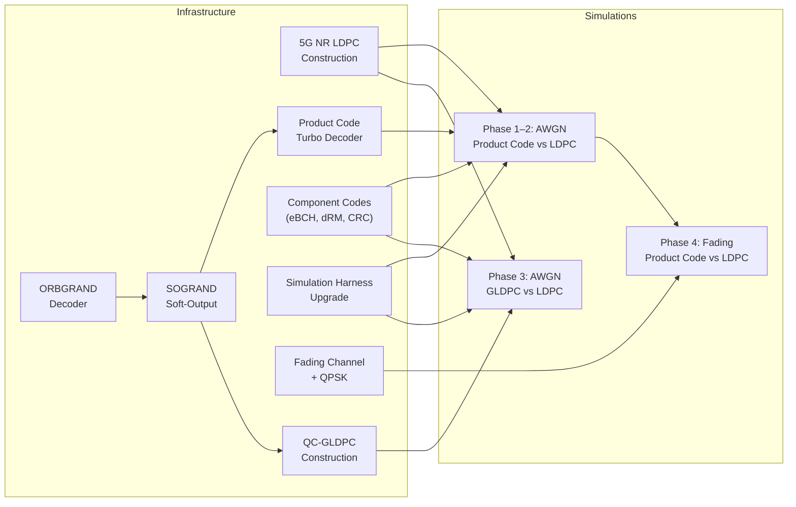
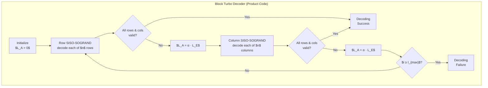
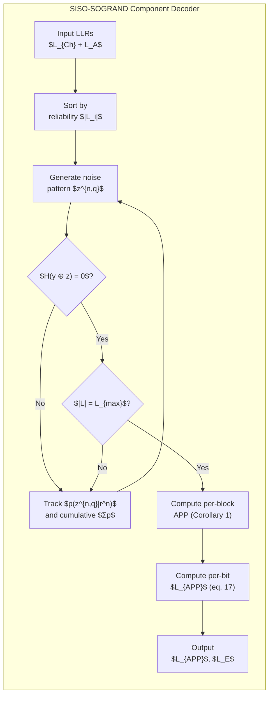

# GRAND vs 5G NR LDPC: Simulation Reproduction Plan

**Epic**: 6efb756b — Implement GRAND (Guessing Random Additive Noise Decoding)
**Reference**: Yuan, Médard, Galligan & Duffy, "Soft-output (SO) GRAND and Iterative Decoding to Outperform LDPCs" (~/Projects/so-grand/)

## 1. Objective

Reproduce the key simulation results from the SO-GRAND paper within the gf2 framework. The paper demonstrates that simple product codes decoded with SOGRAND can outperform 5G NR LDPC codes (BP/min-sum) in both AWGN and fading channels. Our goal is to independently verify these claims by implementing the necessary infrastructure and running equivalent simulations.

## 2. Target Simulations

### 2.1 AWGN Channel — Product Code vs 5G NR LDPC

The paper presents 5 AWGN comparisons (Figures 1, 3–6). We target all of them:

| Fig | Code Dimensions $(n,k)$ | Product Code | Component | LDPC | $E_b/N_0$ Range | Metrics |
|-----|-------------------------|--------------|-----------|------|------------------|---------|
| 1 | $(1024, 441)$ | $(32,21)^2$ dRM | dRM$(32,21)$ | 5G NR | $0$–$2.5$ dB | BLER |
| 3 | $(256, 121)$ | $(16,11)^2$ eBCH | eBCH$(16,11)$ | 5G NR + CA-Polar | $0$–$4$ dB | BLER, BER, queries/bit, iterations |
| 4 | $(625, 225)$ | $(25,15)^2$ CRC | CRC-0x2b9$(25,15)$ | 5G NR | $0$–$3$ dB | BLER, BER, queries/bit, iterations |
| 5 | $(4096, 3249)$ | $(64,57)^2$ eBCH | eBCH$(64,57)$ | 5G NR | $2$–$4$ dB | BLER, BER, queries/bit, iterations |
| 6 | $(256, 49)$ | $(16,7)^2$ eBCH | eBCH$(16,7)$ | 5G NR + CA-Polar | $0$–$4$ dB | BLER, BER, queries/bit, iterations |

### 2.2 AWGN Channel — GLDPC vs 5G NR LDPC (Figure 7)

| Fig | Code Dimensions $(n,k)$ | GLDPC Structure | Component | LDPC | $E_b/N_0$ Range | Metrics |
|-----|-------------------------|-----------------|-----------|------|------------------|---------|
| 7 | $(1024, 640)$ | QC-GLDPC [Lentmaier10] | eBCH nodes | 5G NR | $0$–$4$ dB | BLER, BER, queries/bit, iterations |

### 2.3 Fading Channel Comparisons (Figures 8–10)

| Fig | Code Dimensions $(n,k)$ | Product Code | Fading Params | $E_b/N_0$ Range |
|-----|-------------------------|--------------|---------------|------------------|
| 8 | $(1024, 441)$ | $(32,21)^2$ dRM | Rician: $N_c=128$, $t=4$, $K=5$, QPSK | $0$–$8$ dB |
| 9 | $(1024, 676)$ | $(32,26)^2$ eBCH | Rician: $N_c=256$, $t=2$, $K=8$, QPSK | $0$–$8$ dB |
| 10 | $(4096, 3249)$ | $(64,57)^2$ eBCH | Rician: $N_c=256$, $t=8$, $K=6$, QPSK | $0$–$8$ dB |

### 2.4 Priority

**Phase 1 (core)**: Fig 1 and Fig 3 — these are the headline results. Requires: 5G NR LDPC, ORBGRAND, SOGRAND, product code turbo decoder, $(16,11)$ eBCH and $(32,21)$ dRM component codes.

**Phase 2 (breadth)**: Figs 4–6 — additional AWGN dimensions. Requires: CRC component codes, more eBCH parameter sets.

**Phase 3 (advanced)**: Fig 7 — GLDPC codes. Requires: QC-GLDPC construction, generalized BP with SOGRAND check nodes.

**Phase 4 (channels)**: Figs 8–10 — fading channels. Requires: Rician fading, QPSK modulation, interleaver.

## 3. Simulation Parameters (from the paper)

### Decoder Configuration
- **LDPC BP decoder**: $I_\text{max} = 50$, standard BP and normalized min-sum
- **SOGRAND turbo decoder**: $I_\text{max} = 20$, $\alpha = 0.5$ (extrinsic LLR scaling), 1-line ORBGRAND for component decoding, list size $L \leq 4$, early-stop when predicted list-BLER $< 10^{-5}$ (or $10^{-6}$ for high-rate codes)
- **CA-Polar** (reference only, not our target): CA-SCL with $L=16$, 24-bit CRC

### Monte Carlo Parameters (inferred from data precision)
- Min frame errors: $\sim 100$ per SNR point for BLER down to $\sim 10^{-7}$
- This implies up to $\sim 10^9$ frames at the lowest BLER points
- Step size: $0.25$ dB or $0.5$ dB depending on figure

## 4. Infrastructure Needed

### 4.1 Already Implemented in gf2

| Component | Status | Location |
|-----------|--------|----------|
| LDPC BP decoder (min-sum) | Done | `gf2-coding/src/ldpc/` |
| LDPC normalized min-sum | Done (via `boxplus_normalized_minsum_n`) | `gf2-coding/src/llr.rs` |
| LDPC encoder (Richardson-Urbanke) | Done | `gf2-coding/src/ldpc/encoding/` |
| QC-LDPC construction | Done | `gf2-coding/src/ldpc/core.rs` |
| BCH encoder + BM decoder | Done | `gf2-coding/src/bch/` |
| AWGN channel (BPSK) | Done | `gf2-coding/src/channel.rs` |
| LLR type + boxplus variants | Done | `gf2-coding/src/llr.rs` |
| AVX2 SIMD min-sum | Done | `gf2-kernels-simd/src/llr.rs` |
| BER/FER simulation harness (partial) | Uncoded only | `gf2-coding/src/simulation.rs` |
| Polar transform kernel | Done (butterfly only) | `gf2-core/src/bitvec.rs` |

### 4.2 New Infrastructure Required

#### A. 5G NR LDPC Code Construction (HIGH — blocks everything)

**Current state**: Stub that panics in `ldpc/nr_5g.rs`.

**Required**:
- BG1 ($46 \times 68$) and BG2 ($42 \times 52$) base matrices from 3GPP TS 38.212 Table 5.3.2-2/3
- Lifting size set index ($i_\text{LS}$) $\to$ $Z$ mapping table (Table 5.3.2-1)
- `QuasiCyclicLdpc::nr_5g(base_graph, lifting_factor)` factory
- Rate matching: systematic bit selection for target $(n,k)$ from mother code
- Filler bit handling for when $K$ doesn't fill an integer number of lifting groups

**5G NR LDPC codes used in the paper** (we need to identify the exact $Z$ for each):

| Target $(n,k)$ | Rate | BG | Notes |
|-----------------|------|-----|-------|
| $(256, 121)$ | $0.473$ | BG2 | Short block |
| $(256, 49)$ | $0.191$ | BG2 | Very low rate |
| $(625, 225)$ | $0.36$ | BG2 | Non-standard length |
| $(1024, 441)$ | $0.431$ | BG2 | Paper's headline result |
| $(1024, 640)$ | $0.625$ | BG1 or BG2 | GLDPC comparison |
| $(4096, 3249)$ | $0.793$ | BG1 | High rate, long block |

Note: The paper says "5G LDPC" but the exact construction details (which $Z$, whether shortened/punctured) are not specified. We need to determine the closest valid 5G NR parameters for each target dimension, or use the LDPC codes as-is with matching $(n,k)$ via shortening/puncturing.

#### B. ORBGRAND Decoder (HIGH — core algorithm)

The 1-line ORBGRAND algorithm from [Duffy 2022]:
- Soft-input: takes LLR vector, sorts by reliability
- Generates noise patterns in decreasing likelihood order using the "logistic weight" ordering
- Codebook membership test via syndrome check: $\mathbf{H}(\mathbf{y} \oplus \mathbf{z}) = \mathbf{0}$
- Returns first valid codeword found (ML decoding)
- **List mode**: continue after first hit to collect $L$ codewords
- **Even code optimization**: skip noise patterns whose weight parity doesn't match $\bigoplus_i y_i$
- Must track: noise pattern probability $p(z^n | r^n)$ and cumulative sum $\sum_j p(z^{n,j} | r^n)$ for SOGRAND

**Key references**:
- ORBGRAND: Duffy et al., "Ordered Reliability Bits GRAND" (2022)
- 1-line ORBGRAND: simplification using logistic weight interpretation
- Hardware: Riaz et al. (2023) — parallelizable queries

#### C. SOGRAND Soft-Output (HIGH — enables iterative decoding)

Per-block APP computation (Theorem 1 / Corollary 1 of the paper):
- For each found codeword at query position $q_i$, compute $p(z^{n,q_i} | r^n)$
- Track cumulative noise probability: $\sum_{j=1}^{q_L} p(z^{n,j} | r^n)$
- Approximate APP for the $i$-th list element (eq. 14):

$$P(\text{correct} = i) = \frac{p_{N^n|R^n}(z^{n,q_i} | r^n)}{\displaystyle\sum_{i=1}^{L} p_{N^n|R^n}(z^{n,q_i} | r^n) + \left(1 - \sum_{j=1}^{q_L} p_{N^n|R^n}(z^{n,j} | r^n)\right) \cdot \frac{2^k - 1}{2^n - 1}}$$

- Probability that the correct codeword is **not** in the list (eq. 15):

$$P(\mathcal{C} \setminus \mathcal{L} | r^n) = \frac{\displaystyle\left(1 - \sum_{j=1}^{q_L} p_{N^n|R^n}(z^{n,j} | r^n)\right) \cdot \frac{2^k - 1}{2^n - 1}}{\displaystyle\sum_{i=1}^{L} p_{N^n|R^n}(z^{n,q_i} | r^n) + \left(1 - \sum_{j=1}^{q_L} p_{N^n|R^n}(z^{n,j} | r^n)\right) \cdot \frac{2^k - 1}{2^n - 1}}$$

- Per-bit APP LLR output (eq. 17):

$$L'_{\text{APP},i} = \log \frac{\displaystyle\sum_{c^n \in \mathcal{L}: c_i=0} P(X^n = c^n | r^n) + P(\mathcal{C} \setminus \mathcal{L} | r^n) \cdot p(X_i=0 | r_i)}{\displaystyle\sum_{c^n \in \mathcal{L}: c_i=1} P(X^n = c^n | r^n) + P(\mathcal{C} \setminus \mathcal{L} | r^n) \cdot p(X_i=1 | r_i)}$$

This is the key innovation of SOGRAND: the "not found" term $P(\mathcal{C} \setminus \mathcal{L} | r^n)$ allows accurate soft-output even with $L=1$, unlike Forney's approximation which requires $L \geq 2$ and conditions on the codeword being in the list.

#### D. Product Code Construction + Turbo Decoder (HIGH)

**Product code**: $(n,k)^2$ code from component $(n,k)$:
- Arrange $k^2$ information bits in $k \times k$ matrix
- Encode each row with component encoder $\to$ $k \times n$ matrix
- Encode each column with component encoder $\to$ $n \times n$ matrix
- Total: $n^2$ coded bits, $k^2$ info bits

**Block turbo decoder** (iterative SOGRAND):
1. Initialize: $\mathbf{L}_\text{Ch}$ = $n \times n$ channel LLR matrix, $\mathbf{L}_\text{A} = \mathbf{0}$
2. **Row step**: decode each row with SISO-SOGRAND$(\mathbf{L}_\text{Ch} + \mathbf{L}_\text{A})$, obtain $\mathbf{L}_\text{APP}$, $\mathbf{L}_\text{E}$
   - Check if hard decision is valid product codeword $\to$ early exit
   - Set $\mathbf{L}_\text{A} = \alpha \cdot \mathbf{L}_\text{E}$ where $\alpha = 0.5$
3. **Column step**: decode each column with SISO-SOGRAND$(\mathbf{L}_\text{Ch} + \mathbf{L}_\text{A})$, obtain $\mathbf{L}_\text{APP}$, $\mathbf{L}_\text{E}$
   - Check validity $\to$ early exit
   - Set $\mathbf{L}_\text{A} = \alpha \cdot \mathbf{L}_\text{E}$, go to step 2
4. Repeat up to $I_\text{max}$ iterations

**SISO decoder interface**: takes $(\mathbf{L}_\text{Ch} + \mathbf{L}_\text{A})$ as input LLRs, returns $\mathbf{L}_\text{APP}$ and $\mathbf{L}_\text{E} = \mathbf{L}_\text{APP} - \mathbf{L}_\text{A} - \mathbf{L}_\text{Ch}$

#### E. Component Codes (MEDIUM)

Need short codes as SOGRAND components:

| Code | $(n,k)$ | $t$ | Type | Status |
|------|---------|-----|------|--------|
| eBCH$(16,11)$ | $(16,11)$ | $1$ | extended BCH | Need to construct, BCH infra exists |
| eBCH$(16,7)$ | $(16,7)$ | $2$ | extended BCH | Need to construct |
| eBCH$(32,26)$ | $(32,26)$ | $1$ | extended BCH | Need to construct |
| eBCH$(64,57)$ | $(64,57)$ | $1$ | extended BCH | Need to construct |
| dRM$(32,21)$ | $(32,21)$ | — | decreasing RM | New code family needed |
| CRC$(25,15)$ | $(25,15)$ | — | CRC-0x2b9 | CRC as linear code, new |

**Notes**:
- "Extended BCH" means the standard BCH code extended by one overall parity bit to make it even. A code is even if $\sum_{j=1}^{n} \mathbf{G}_{i,j} = 0$ in $\mathbb{F}_2$ for all rows $i$ of the generator matrix, ensuring $\sum_{i=1}^{n} c_i = 0$ for every codeword. GRAND's even-code optimization exploits this to skip half of all noise queries.
- dRM (decreasing Reed-Muller) codes [Camion-Poli 2021] are a specific family — need generator matrix construction.
- CRC used as a linear code for error correction (not just detection).

#### F. Simulation Harness Upgrade (MEDIUM)

Current `SimulationRunner` only handles uncoded BER. Need:
- Generic coded simulation loop: encode $\to$ modulate $\to$ channel $\to$ demodulate $\to$ decode $\to$ count errors
- Per-SNR-point statistics: BLER, BER, avg iterations, avg queries/bit
- Parallel SNR sweeps (independent points)
- CSV/JSON output for plotting
- Progress reporting (especially for long runs at low BLER)
- Early termination: stop SNR point when `min_errors` reached or `max_frames` exceeded

#### G. Fading Channel + QPSK (LOW — Phase 4)

Block Rician fading model:

$$H_\text{Ri} = \sqrt{\frac{K}{K+1}} + \sqrt{\frac{1}{K+1}} H_\text{Ra}, \quad H_\text{Ra} \sim \mathcal{CN}(0, 2\sigma_\text{Ra}^2)$$

with $\sigma_\text{Ra}^2 = 0.5$ so that $\mathbb{E}[\|H_\text{Ri}\|^2] = 1$.

QPSK modulation with Gray labeling: $\mathcal{X} = \{\pm\Delta \pm \Delta j\}$. LLR computation with channel estimate $\hat{h}$:

$$L_1 = \frac{2\Delta \cdot \text{Re}(y \hat{h}^*)}{\sigma^2}, \quad L_2 = \frac{2\Delta \cdot \text{Im}(y \hat{h}^*)}{\sigma^2}$$

SNR definition:

$$\frac{E_s}{N_0} = \frac{\mathbb{E}[\|X\|^2] \cdot \mathbb{E}[\|H\|^2]}{2\sigma^2} = \frac{\Delta^2 \cdot \mathbb{E}[\|H\|^2]}{\sigma^2}$$

- Random interleaver (permute coded bits before symbol mapping)
- Coherence block structure: $N = 2 t N_c$ bits per frame

#### H. QC-GLDPC Construction (LOW — Phase 3)

Generalized LDPC with eBCH check nodes instead of SPC nodes. QC structure with circulant permutation matrices [Lentmaier 2010]. Adjacency matrix:

$$\Gamma = \begin{bmatrix} I_n^{(0)} & I_n^{(0)} & \cdots & I_n^{(0)} \\ I_n^{(0)} & I_n^{(1)} & \cdots & I_n^{(n-1)} \end{bmatrix}$$

where $I_n^{(i)}$ is an $n \times n$ circulant permutation matrix obtained by right-rotating the identity by $i$ positions. Code parameters: $(n^2, n^2 - 2n(n-k))$.

BP decoding where each check node runs full SISO-SOGRAND instead of the usual boxplus operation.

## 5. Dependency Graph

## 6. Validation Strategy

### Reference Data
The paper's figures contain exact numerical data points embedded in pgfplots `.tex` files (`~/Projects/so-grand/img_PY/`). We can extract these as ground-truth reference curves and overlay our simulation results.

### Validation Checkpoints
1. **5G NR LDPC alone**: Our BP decoder on the 5G NR LDPC codes should match the paper's black curves (LDPC, BP) within $\sim 0.1$ dB. This validates our LDPC baseline.
2. **ORBGRAND on short codes**: Decode known eBCH codes, verify ML performance matches theoretical bounds.
3. **SOGRAND SO accuracy**: Reproduce Fig 2 (predicted vs empirical list-BLER) to validate the soft-output formula.
4. **Product code turbo**: Reproduce the red curves from the paper's figures.

### Known Issues / Open Questions
- The paper doesn't specify exact 5G NR LDPC construction parameters (lifting factor $Z$, shortening/puncturing details). We need to determine these or note where our construction differs.
- The paper's LDPC baseline uses both "BP" and "norm-min-sum" decoders (Fig 1 shows both). We should test both.
- dRM code construction requires understanding the Camion-Poli (2021) construction — this may be a significant research sub-task.
- The CRC-0x2b9 polynomial used for the $(25,15)$ code needs verification.

## 7. Estimated Scope

| Component | New Code (approx LoC) | Complexity |
|-----------|----------------------|------------|
| 5G NR LDPC base matrices | ~500 (data tables) + ~200 (logic) | Medium — tedious data entry, straightforward logic |
| ORBGRAND decoder | ~400–600 | High — core algorithm, needs careful implementation |
| SOGRAND soft-output | ~200–300 | Medium — math is clear from paper |
| Product code + turbo decoder | ~400–500 | Medium — well-defined algorithm |
| Component code factories | ~100–200 | Low — uses existing BCH infrastructure |
| Simulation harness upgrade | ~300–400 | Medium — generic framework |
| Fading channel + QPSK | ~300–400 | Medium |
| QC-GLDPC | ~200–300 | Medium |
| **Total** | **~2500–3400** | |
