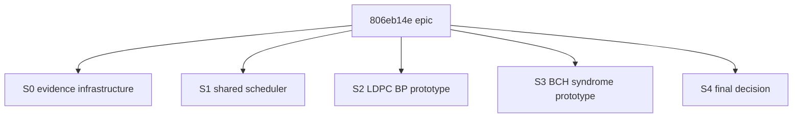

# HIP/ROCm GPU prototype wave plan

## Execution flow

This plan continues JIT epic `806eb14e` ("Prototype GPU acceleration for belief propagation") using the same project-lead and PPC evidence discipline as `babcf05e`.

Phase 1 is planning and JIT scaffolding:

- rewrite the epic with explicit success criteria;
- attach this document as the epic specification;
- restructure the current mixed child graph into HIP-only story checkpoints;
- update existing useful HIP children in place;
- supersede the older Vulkan/GLSL child path.

Phase 2 is autonomous execution via `/project-lead`:

- claim the epic;
- persist progress in `dev/active/806eb14e-progress.json`;
- dispatch work in topological waves;
- enforce gates and hard performance criteria;
- produce a final evidence-backed go/investigate/abandon report.

Workers must not edit `.jit/` state, pass or fail gates, or mark issues done. The project lead owns all JIT state transitions.

## Context

The repository already has a working `gf2-kernels-hip` crate that isolates HIP/ROCm unsafe code in the same spirit as `gf2-kernels-simd`. The crate currently contains:

- a batch BCJR prototype, integrated behind the `hip` feature in `gf2-coding`;
- a Gray-QAM soft-demapper prototype;
- `build.rs` integration with `hipcc --offload-arch=gfx1030`;
- safe Rust wrappers around device buffers and kernel launches.

Epic `806eb14e` currently mixes this HIP direction with older Vulkan/GLSL tasks and a production-backend child epic. The confirmed direction for this epic is HIP/ROCm only. Vulkan/GLSL, CUDA, and production backend selection are out of scope for this prototype wave.

Target evidence environment:

- GPU: AMD RX 6950 XT / RDNA2 / `gfx1030`;
- ROCm: 7.2;
- compiler: `/opt/rocm/bin/hipcc`;
- CPU comparator: best current production CPU path at the same batch or campaign shape, including rayon where production uses rayon.

## Non-goals

- No Vulkan/GLSL backend work.
- No CUDA backend work.
- No production multi-backend selection layer.
- No production backend rollout for all code types.
- No weakening of hard speed thresholds without explicit user approval.

## Evidence protocol

Every optimization issue must produce evidence for the actual performance boost. The protocol is:

1. Record hardware, ROCm version, `hipcc` path/version, CPU model, thread count, commit hash, benchmark command, and raw result path.
2. Pin the current CPU and, where relevant, existing HIP baseline before changing the implementation.
3. Compare against the best existing production CPU path for the same workload shape, not an artificially serial loop.
4. Sweep batch sizes that include the intended operating point and at least one smaller and larger point.
5. Break wall-clock time into meaningful phases where practical: CPU preparation, host-to-device copy, kernel execution, device-to-host copy, synchronization/waiting, and postprocessing.
6. Verify correctness against CPU before claiming performance: exact equality for integer syndromes, stated LLR tolerances for floating-point decoders.
7. Rework or reject any optimization issue that does not prove its hard speed criterion.

## Proposed issue tree

### Epic: HIP/ROCm GPU prototype wave for coding workloads

Existing issue: `806eb14e`.

Epic-level success criteria:

- [hard] The epic uses HIP/ROCm as the only GPU backend direction; Vulkan/GLSL children are rewritten or closed as superseded.
- [hard] LDPC BP has a HIP prototype with CPU/GPU correctness evidence and at least 3x speedup versus the best production CPU path at the selected design workload.
- [hard] BCH syndrome evaluation has a HIP prototype with exact CPU/GPU syndrome equivalence and at least 5x speedup versus the best production CPU path at the selected design workload.
- [hard] Shared HIP scheduling work quantifies direct per-thread/default-stream submission versus a shared scheduler and demonstrates measurable end-to-end throughput improvement.
- [hard] The final feasibility report states go/investigate/abandon for LDPC BP and BCH syndrome evaluation, with raw evidence paths and downstream production recommendations.
- [hard] Default workspace CI remains green without ROCm installed; HIP-only checks are isolated to the `gf2-kernels-hip` crate or `gf2-coding --features hip` on ROCm hosts.
- [hard] No unsafe code leaks outside `gf2-kernels-hip`.

Recommended epic gates: `cargo-ci`, `code-review`, `doc-review`.

### S0: GPU evidence and baseline infrastructure

Purpose: provide the measurement foundation before implementation tasks claim speedups.

Leaf tasks:

| Task | Deliverable |
|---|---|
| Pin GPU prototype baselines | Baseline manifest for BCJR, LDPC BP CPU comparator, and BCH syndrome CPU comparator, including hardware metadata. |
| Add GPU benchmark evidence harness | Script or bench support that records commands, batch-size sweeps, phase timings, raw results, and comparator identity. |
| Add GPU speed-threshold checks | Checker entries for LDPC >=3x, BCH >=5x, and scheduler throughput improvement. |
| Add CPU/GPU equivalence scaffolding | Small and production-sized fixtures for LDPC and BCH correctness comparisons. |

S0 is the first execution wave in the project-lead progress plan. It intentionally does not block S1, S2, and S3 through direct JIT cross-story edges, so the epic retains a `babcf05e`-style immediate story fan-out after JIT transitive reduction.

### S1: Shared HIP scheduler and work-queue strategy

Existing useful issue: `d77519a3`.

Purpose: resolve the known contention risk in the current default-stream plus `hipDeviceSynchronize()` path.

Leaf tasks:

| Task | Deliverable |
|---|---|
| Profile direct GPU submission | Evidence comparing per-thread decoder-owned GPU launches against controlled submission on BCJR. |
| Prototype shared GPU scheduler | Bounded queue, batch coalescing, stream/event completion, and backpressure policy. |
| Extend scheduler experiment | Repeat the comparison on LDPC BP or BCH syndrome once a microkernel exists. |
| Write scheduler recommendation | Reusable ownership, queueing, stream, completion, and CPU partitioning guidance. |

Hard evidence:

- phase breakdown across thread count, batch size, and stream count;
- explicit conclusion on whether default stream and full-device sync serialize submissions;
- measurable end-to-end throughput improvement versus direct submission.

### S2: HIP LDPC BP prototype

Existing useful issue: `37e0b235`.

Purpose: implement and evaluate batch LDPC normalized min-sum BP on HIP.

Leaf tasks:

| Task | Deliverable |
|---|---|
| Build GPU Tanner graph representation | Edge-based check/variable orderings, offsets, mate indices, and CPU consistency tests. |
| Implement HIP LDPC kernels | Check-node NMS, variable-node update, and syndrome/early-termination kernels. |
| Add safe wrappers and feature-gated surface | `gf2-kernels-hip` wrapper plus `gf2-coding` integration behind `hip`. |
| Add LDPC correctness fixtures | Hamming, 5G NR BG2, and DVB-T2 short Rate1/2 comparisons. |
| Add LDPC throughput evidence | Batch sweep and >=3x hard speed proof versus best production CPU path. |

Hard evidence:

- CPU/GPU hard decisions match on required fixtures;
- LLR differences stay within fixture-specific tolerances;
- convergence iteration counts match where specified;
- throughput is at least 3x faster than the best production CPU comparator at the design workload.

### S3: HIP BCH syndrome prototype

Existing useful issue: `9012f8a0`.

Purpose: implement and evaluate batch BCH syndrome evaluation on HIP.

Leaf tasks:

| Task | Deliverable |
|---|---|
| Add GPU GF(2^m) tables | Device log/exp table representation for $m \le 16$. |
| Implement HIP Horner syndrome kernel | One thread per `(codeword, syndrome_index)` with exact integer results. |
| Add safe wrappers and feature-gated BCH surface | `GpuBchSyndromeBatch` and optional use in BCH batch decode. |
| Add BCH correctness fixtures | Exhaustive/small BCH plus DVB-T2 short and normal exact comparisons. |
| Add BCH throughput evidence | Batch sweep and >=5x hard speed proof versus best production CPU path. |

Hard evidence:

- all integer syndromes match CPU exactly;
- valid codewords produce zero syndromes;
- injected-error codewords produce nonzero syndromes;
- GPU syndromes can feed the CPU decode pipeline with identical final decode output;
- throughput is at least 5x faster than the best production CPU comparator at the design workload.

### S4: Final feasibility decision and cleanup

Purpose: close the epic as a prototype and decision effort.

Leaf tasks:

| Task | Deliverable |
|---|---|
| Supersede Vulkan/GLSL children | Rewrite or close `886cebf9`, `46fe1108`, and `24c11004` so the epic graph no longer implies Vulkan scope. |
| Reframe production backend work | Detach or reframe `92acd7b5` as downstream production work conditioned on this epic's findings. |
| Write final feasibility report | Evidence map, thresholds, raw result paths, and go/investigate/abandon recommendation. |
| Close epic criteria map | Map each epic success criterion to child issues and artifacts. |

S4 is the final execution wave in the project-lead progress plan. It intentionally does not depend on every preceding story through JIT edges, so the epic remains readable as five immediate story checkpoints.

## Dependency plan

JIT dependency semantics are "blocked issue depends on blocking issue". The epic depends directly on its five story checkpoints. Cross-story execution order is recorded in `dev/active/806eb14e-progress.json` rather than encoded as extra DAG edges, because JIT's transitive-reduction validation collapses direct epic-to-story fan-out when a final story depends on every earlier story.

## Dispatch notes

- Use `/project-lead` for epic orchestration and `/jit-manage` for JIT state operations.
- Use the PPC optimization spiral for each kernel: measure first, inspect the compiled path when relevant, optimize one step at a time, then verify correctness and speed.
- Use manual worktree dispatch for parallel implementation waves. Do not use stale agent worktree isolation.
- Serialize LDPC and BCH tasks that touch the same files in `gf2-kernels-hip`, especially `src/lib.rs`, `ffi`, and `build.rs`.
- Keep cargo and benchmark jobs serialized unless workers use separate `CARGO_TARGET_DIR`s.
- Run pre-dispatch criterion audits before every hard threshold issue to avoid the amendment churn observed in `babcf05e`.

## Review protocol

The project lead reviews each child with:

- gate verification;
- regression check for prior findings;
- success-criteria verification against artifacts, not agent summaries;
- stale-narrative sweep;
- deferred-items audit across linked docs;
- holistic coherence review across HIP API, `gf2-coding` feature gates, docs, and benchmark narrative.

No child is marked done until its gates and hard evidence criteria pass.
