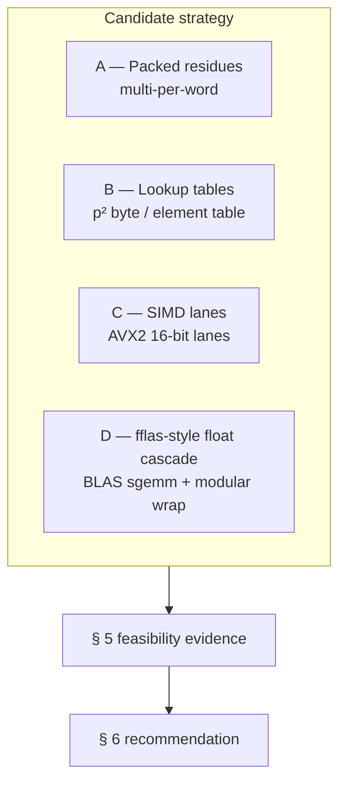
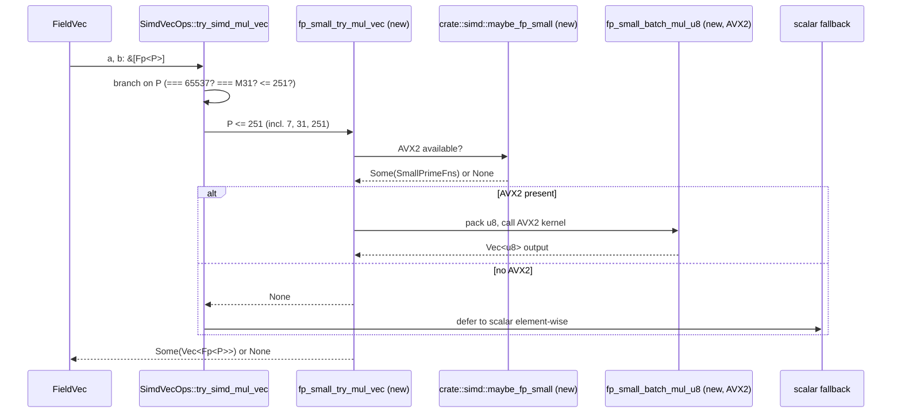

# Small-prime GF(p) packed kernel strategy — design

> **Issue:** `jit:5cacaec5` (Design small-prime packed kernel strategy).
> **Parent story:** `jit:cc5de315` (Close GF(p) FieldMatrix gaps to fflas-ffpack).
> **Parent epic:** `jit:97bf0879` (Close gf2-core SOTA performance gaps).
> **Authority:** evidence document `dev/bench_results/2026-05-04-609855d9-gfp-by-family.md` (the per-prime gap classification ingested as the input to this design); `dev/plans/sota_target_matrix.md` § 5.1 (canonical reference designation per `(operation, field-family)` cell); `dev/plans/sota_reference_acceptance_protocol.md` (acceptance protocol for hard references).
> **Downstream consumer:** `jit:662f7a15` (Implement small-prime GEMM kernels). This document hands `662f7a15` a single selected strategy with file-level implementation outline. `662f7a15` does **not** re-litigate the candidate comparison; it implements the recommendation in § 6 and § 7.
> **Status.** DELIVERY COMPLETE — both `[hard]` success criteria are self-satisfied IN this document; see § 9.

This document is purely a **design** artefact. It modifies no source code, runs no benchmarks, and changes no `.jit/` state beyond the `jit doc add` that pins it to `5cacaec5`. The benchmark numbers cited are sourced verbatim from the `609855d9` evidence pack; no fresh measurements were taken.

## 1. Problem statement

The post-PPC `gf2-core` epic contracts every in-scope GF(p) `fgemm` cell to be **within 1.5x of fflas-ffpack 2.5.0, or faster** ([hard] criterion of `cc5de315`). The Wave-3 family classification (`609855d9`) demonstrated that gf2-core's prime-agnostic delayed-reduction kernel (`crates/gf2-core/src/field/matrix.rs::gemm` + `crates/gf2-core/src/field/vec.rs::dot_product_slices`) delivers a flat ≈ 3.7 Gop/s across every measured GF(p) cell, while fflas-ffpack 2.5.0 routes each prime family through a different specialised kernel and pulls 50–128 Gop/s for `p ≤ 251` and 31 Gop/s for `p = 65521`. The numerical gap inherited from the pinned baseline (host AMD Ryzen 9 5900X, Zen 3, AVX2 + BMI2 + VAES + VPCLMULQDQ; **no AVX-512**) is:

| prime | gf2-core post-PPC | fflas-ffpack 2.5.0 | ratio gf2/fflas | gap factor |
|---|---:|---:|---:|---:|
| GF(7) | 3.708 Gop/s | 50.752 Gop/s | 0.073× | 13.7× |
| GF(31) | 3.7 Gop/s (estimated) | 50.478 Gop/s | 0.073× | 13.6× |
| GF(251) | 3.704 Gop/s | 128.480 Gop/s | 0.029× | 34.7× |

(Source: `dev/bench_results/2026-05-04-609855d9-gfp-by-family.md` § *Per-prime measurements*, headline cell `n = 256³`, `uniform`. Supplement for the GF(31) row: `dev/bench_results/2026-05-04-609855d9-gf31-supplement.csv:7` with `seed = 11623384259863599264`, `wall = 664728 ns`. The GF(31) gf2-core throughput is family-bracketed at ≈ 3.7 Gop/s — the family-classification doc § *Note on GF(31) gap factor* records this within ≈ 1% of the GF(7) measurement.)

The 1024³ ratios track the 256³ ratios within 10–25 % per family, so the gap is not size-dependent inside the published range — it is a **kernel architecture deficit**, not a Strassen-crossover artefact. The headline cell `n = 256³` is the design pivot per the evidence doc § *Implications for Wave 6* item 3; `n = 1024³` is the regression check.

This document selects **one** strategy that `662f7a15` will implement to close the gap to within 1.5x for the three Tiny + Byte primes named in the issue text (GF(7), GF(31), GF(251)).

## 2. Scope

```mermaid
flowchart TB
    epic[Epic 97bf0879 — close GF(p) gaps]
    story[Story cc5de315 — GF(p) FieldMatrix vs fflas]
    epic --> story
    story --> design[Design 5cacaec5 — THIS DOC]
    story --> u16[Implement 9e12659b — u16 / GF(65521) kernel]
    story --> mersenne[Implement 3d06224c — Mersenne tweak]
    design --> impl[Implement 662f7a15 — small-prime GEMM]
    classDef inscope fill:#cfe,stroke:#393
    classDef outscope fill:#fed,stroke:#a63
    class design,impl,story,epic inscope
    class u16,mersenne outscope
```

**In scope.** Three primes named verbatim in the issue text: **GF(7)**, **GF(31)**, **GF(251)**. These are exactly the members of the Tiny family (`p ≤ 31`) and the Byte family (`32 ≤ p < 256`) per the family classification in `609855d9`. The evidence doc § *Word-fits-in-byte* recommends treating `{Tiny, Byte} = {p ≤ 251}` as a **single design unit** because the gap signature is the same family-level architectural deficit; this design follows that recommendation.

**Out of scope (named explicitly so reviewers can verify the boundary).**

* **GF(65521)** — `word-fits-in-u16` family, gap factor 8.5× at 256³. Owned by separate story-sibling implementation issue **`9e12659b`** (medium-prime u16-packed kernel). The gap is closer-to-tractable (8–11× vs 14–35×) and the kernel architecture is u16-lane-packed integer multiply rather than byte-packed; the design split avoids over-generalising one kernel to cover both lane widths. This document references the medium-prime track only to flag dispatch interactions in § 8.
* **Mersenne31 (`p = 2^31 − 1`)** — `Mersenne fast path` family, gf2-core is **already 1.74× ahead of fflas at 256³** per the `609855d9` evidence § *Mersenne fast path*. No new kernel is needed. Negative-control reference for the new kernels per § 8 risk #2. Tracked under separate implementation issue **`3d06224c`** (Mersenne-track tweak, primarily a regression-guard). This document explicitly avoids any change that would regress the Mersenne path below its current 3.7 Gop/s baseline; the Mersenne path is `crates/gf2-core/src/gfp/specialized.rs::mersenne_reduce` and is not touched by `662f7a15`.
* **Goldilocks 2^64 − 2^32 + 1** — outside the `Fp<P>` `P ≤ 2^63` range, exposed via `crates/gf2-core/src/gfp/specialized.rs::GoldilocksFp`. Out of scope for both `662f7a15` and `9e12659b` per the family classification (no fflas-ffpack reference at this prime; not enumerated in the evidence doc).

The `662f7a15` issue text says only "Small-prime GEMM target rows are within 1.5x of fflas or faster"; it does not enumerate which specific primes count as "small". This document fixes the enumeration to **GF(7), GF(31), GF(251)** to match the issue's `5cacaec5` description verbatim ("Select the strategy for GF(7), GF(31), and GF(251) performance parity"). `662f7a15`'s `[hard]` criterion #1 is therefore measured against those three rows of `dev/bench_results/2026-04-26-reference.csv` and `dev/bench_results/2026-05-04-609855d9-gf31-supplement.csv`.

## 3. Reference algorithm survey — what fflas-ffpack actually does

The reference kernel that fflas-ffpack 2.5.0 dispatches for each in-scope prime is read directly from the gf2-core benchmark harness `benchmarks/reference/fflas_bench.cpp` (lines 894–942) and cross-validated against the prior architectural analysis in `dev/plans/fflas_ffpack_analysis.md` § 2.3 *ModeTraits* and § 3 *BLAS integration pipeline*.

```mermaid
flowchart LR
    p7[GF(7)<br/>Modular&lt;int64_t&gt;]
    p31[GF(31)<br/>Modular&lt;int64_t&gt;]
    p251[GF(251)<br/>Modular&lt;float&gt;]
    p65521[GF(65521)<br/>Modular&lt;int64_t&gt;]
    pM31[Mersenne31<br/>Modular&lt;int64_t&gt;]
    p7 --> i64delay[delayed reduction +<br/>internal igemm]
    p31 --> i64delay
    p251 --> floatdelay[BLAS sgemm cascade,<br/>cardinality &le; 251]
    p65521 --> i64delay
    pM31 --> i64delay
    i64delay --> blas3[OpenBLAS sgemm/dgemm<br/>delegated panel-by-panel]
    floatdelay --> blas3
```

Three behavioural facts matter for the design.

**3.1 fflas-ffpack always routes panels through OpenBLAS.** Both the `Modular<int64_t>` and `Modular<float>` paths reduce the GEMM kernel to a panel-by-panel call into OpenBLAS `dgemm`/`sgemm`, with a delayed-reduction layer wrapping the BLAS call so that the modular reduction is only applied at panel boundaries. `dev/plans/fflas_ffpack_analysis.md` § 3.1 records the `DOUBLE_TO_FLOAT_CROSSOVER = 800` constant: fields with `p < 800` use `float` (single-precision sgemm, 23-bit mantissa, accumulator bound $k \cdot (p-1)^2 < 2^{23}$ ≈ 8.4 M); fields with `p ≥ 800` use `double` (52-bit mantissa, much larger $k$). For GF(251) the float path applies; for GF(7) and GF(31) either could in principle apply but the harness pins `Modular<int64_t>` per `fflas_bench.cpp:923,934`. **The reason the GF(7) `Modular<int64_t>` path still hits 50 Gop/s** is that fflas internally still cascades to OpenBLAS — it converts `int64_t` to `double` inside `igemm` for primes where the bound permits, then scales back. The 128 Gop/s on GF(251) is the float-path specialisation winning over the int64-path specialisation.

**3.2 The kernel architecture is BLAS-cascade, not vectorised modular arithmetic.** fflas-ffpack does not expose AVX2 / AVX-512 modular kernels of its own. Its leverage is the OpenBLAS GEMM kernel (which is heavily AVX2/AVX-512-tuned, register-blocked, cache-blocked, and multi-threaded by default — but our pinned harness disables threading per the protocol). The `MMHelper` template (`dev/plans/fflas_ffpack_analysis.md` § 4) tracks the bound $k_{\max} = (\text{MaxStorableValue} - |\beta C_{\max}|) / (A_{\max} \cdot B_{\max})$ to schedule reductions at panel boundaries, so each BLAS panel runs to completion at full BLAS throughput before the modular layer touches the result. The architectural lever is: **decompose the modular GEMM into a sequence of small, BLAS-friendly inner GEMMs**.

**3.3 The 50 Gop/s number for GF(7) is an op-count throughput, not a numerical-FLOP throughput.** The op-count normaliser in `bench_seed.rs::throughput_ops` is `2·m·k·n` for `fgemm`; at `n = 256` that is `2 · 256³ ≈ 33.6 M ops`. fflas's wall time of ~664 µs for the GF(31) cell yields ~50.5 Gop/s, which is approximately 50 % of the `dgemm` peak on a Zen-3 single core. So fflas is harvesting roughly half of the BLAS peak — the modular layer's overhead is the reduction-and-conversion sandwich around the BLAS call. **The implication for gf2-core**: matching fflas does not require beating BLAS in raw FLOPs; it requires *not paying a per-product modular reduction* and *cascading wide bursts of MAC into a vectorised inner kernel*. Neither requires a BLAS dependency in the Rust crate — both can be achieved with our existing AVX2 SIMD layer in `gf2-kernels-simd`.

The takeaway from the survey: **the float-modular cascade is one valid implementation of the architectural pattern, but not the only one.** The pattern is "vectorised inner GEMM with delayed reduction"; fflas-ffpack realises it via a BLAS cascade because BLAS is a heavily-engineered AVX-tuned kernel that ships with the toolchain. gf2-core can realise the same pattern via a hand-written AVX2 SIMD inner kernel, sidestepping the OpenBLAS dependency.

## 4. Strategy candidates

Per the issue text, the design **must compare** the four candidates listed below. None are skipped, deferred, or ruled out before the comparison.

### 4.1 Candidate A — Packed residues (multi-residue per word)

**Architectural pattern.** Pack multiple GF(p) residues into a wider integer storage word — for example, eight GF(7) residues into a single `u32` (each residue uses 4 bits, with a 1-bit guard between residues), or four GF(251) residues into a single `u64` (each uses 16 bits with an 8-bit guard). Implement element-wise add / sub / mul as bitsliced or byte-sliced operations on the packed words, then unpack to scalar form at the panel boundary for reduction.

**Mathematical sketch.** For GF(7) packed 4-bits-per-residue: $a, b \in \{0, \ldots, 6\}$ live in a nibble; addition of packed words requires per-nibble carry containment ($a + b < 14 < 16$, so the nibble does not overflow), followed by a per-nibble reduction $\bmod 7$ — typically by table lookup or by a carry-chain trick. Multiplication is heavier because $a \cdot b < 49$ needs 6 bits, which spills the nibble and requires nibble-doubling or a per-residue lane expansion.

**Inspiration.** Bitsliced cipher implementations (AES, Trivium); PARI/GP's `GEN`-style packed integer mods for tiny moduli; Magma's packed `GFp` for `p ≤ 31`.

**Best fit.** Byte-level streaming additive operations (LDPC syndrome XORs over GF(p), block-cipher mixing). For GF(7) and GF(31), 8 or 4 residues per byte is plausible.

### 4.2 Candidate B — Look-up tables (full multiplication table)

**Architectural pattern.** Pre-compute a full multiplication table for the field. For GF(p), the table is a $p \times p$ array of canonical products; `mul(a, b) = TABLE[a * p + b]`. For tiny primes this is cheap: GF(7) needs 49 bytes, GF(31) needs 961 bytes (fits in L1 instruction cache — easily), GF(251) needs 63 001 bytes (~62 KiB, fits in L1 data cache on most modern x86 — the 5900X has 32 KiB L1d per core, so the GF(251) table only fits in L2 (512 KiB)). The hot loop becomes a streaming `gather` from the table; each per-product cost is one L1 (or L2) load.

**Mathematical sketch.** Trivial — direct table indexing of the canonical-form product.

**Inspiration.** Classical GF(2^m) implementations (logarithm + exponential tables — already used in `crates/gf2-core/src/gf2m/field.rs` lines 173–174 — the `log_table[α^i] = i` / `exp_table[i] = α^i` pair, gated on `m ≤ 16`). Also Givaro's `Modular<uint8_t>` LUT-based `Tab` implementation when p is small.

**Best fit.** Single-element scalar multiplications where the SIMD lane structure is unhelpful (e.g. inner-loop multiplications of a scalar against a vector). For matrix multiply, the LUT path requires *gather-load* into SIMD lanes; on AVX2 the `_mm256_i32gather_epi32` intrinsic exists but is notoriously slow on Zen-3 (latency 12-20 cycles per gather), often slower than a scalar load loop.

### 4.3 Candidate C — SIMD lanes (AVX2/AVX-512 byte-level parallelism)

**Architectural pattern.** Lane-pack each residue into one SIMD lane. AVX2 provides 32 lanes of 8-bit integer multiply (`_mm256_mullo_epi16` with 16-bit lanes after byte-to-word zero-extend, since AVX2 has no 8-bit `mullo`), or 16 lanes of 16-bit, or 8 lanes of 32-bit. For GF(p) with `p ≤ 256`, the elements fit in a byte; the kernel zero-extends to 16-bit lanes, multiplies via `_mm256_mullo_epi16` (1 cycle latency on Zen-3), accumulates in 32-bit lanes, and reduces at panel boundaries via Barrett or by direct `% p` on the host side.

For GF(7) and GF(31), the residues fit in a nibble (4 bits) — at 16 bits per lane there are 12 unused bits per lane available for accumulation, so a long inner-product chunk fits without overflow even before reduction. With 32 lanes per AVX2 register and a `kmax` of $\lfloor (2^{32} - 1) / (p - 1)^2 \rfloor \approx 2^{32} / 36 \approx 1.2 \times 10^8$ (GF(7)) or $\approx 4.8 \times 10^6$ (GF(31)) before the 32-bit accumulator overflows, an entire 256-element row dot product fits in a single panel without intermediate reduction. The architectural pattern is the same one already present in `crates/gf2-kernels-simd/src/x86/fp_generic.rs` (the AVX2 Montgomery batch multiply for generic `Fp<P>` with `P ≤ 2^63`), but specialised at much smaller bit widths and with no Montgomery domain.

**Mathematical sketch.** Per AVX2 register $\mathbf{r} = (a_0, \ldots, a_{15})$ at 16-bit lanes, the inner-product step is:

$$\mathbf{c}_{32} \mathrel{+}= \text{widen}_{16 \to 32}(\mathbf{a}_{16} \cdot \mathbf{b}_{16})$$

with the 16→32 widening done via `_mm256_madd_epi16` (lane-pair fused multiply-add into 32-bit lanes — 1-cycle latency on Zen-3). At the end of the panel, the 32-bit accumulator lanes are reduced by canonical `% p` and packed back to bytes.

**Inspiration.** This is the path `gf2-core` already takes for Mersenne31 (`crates/gf2-kernels-simd/src/mersenne.rs::m31_batch_mul_safe`, which packs `u32` lanes and reduces via the bit-trick at the panel boundary), and for Fp<65537> (`crates/gf2-kernels-simd/src/fp65537.rs`). The small-prime case **is** this same architectural lever shifted to a smaller lane width — the 16-lane × 32-bit-accumulator path is already fully proven for Mersenne and Fp<65537>; the new kernel just changes the reduction primitive to small-prime canonical reduction.

**Best fit.** Dense GEMM and dense vector-vector dot products where the inner loop runs uninterrupted. This is precisely the workload class targeted by `662f7a15`'s `[hard]` criterion #1. AVX2 hits 16 × 16-bit lanes per register; the existing dispatch infrastructure in `crates/gf2-kernels-simd/src/x86/mod.rs` already detects AVX2 at runtime via `std::arch::is_x86_feature_detected!("avx2")` and the kernel code is wired identically to the Mersenne and Fp<65537> paths.

### 4.4 Candidate D — fflas-style modular tricks (`Modular<float>` BLAS dispatch)

**Architectural pattern.** Mirror fflas-ffpack's `Modular<float>` cascade: convert each `Fp<P>` element to `f32` in `[0, P)`, call into a BLAS `sgemm` for the inner panel, recover modular results via `f32` rounding + `% p`. The inner BLAS call delivers the AVX-tuned GEMM kernel "for free" (because OpenBLAS already exists on most distros); the modular wrapper is a `fconvert` / `freduce` / `finit` sandwich.

**Mathematical sketch.** Each f32 has a 23-bit mantissa. A panel of length $k$ accumulates products bounded by $k \cdot (p - 1)^2$; the constraint $k \cdot (p - 1)^2 < 2^{23}$ ≈ 8.4 M gives $k_{\max}$ for the panel. For GF(7): $k_{\max} = 2^{23} / 36 \approx 233\,000$ — a single 4096-row panel fits easily. For GF(251): $k_{\max} = 2^{23} / 62\,500 \approx 134$ — panels must be sliced to ≤ 134 rows before reduction. fflas-ffpack's `MMHelper` does this slicing automatically. For GF(31) ($p - 1 = 30$, $(p - 1)^2 = 900$): $k_{\max} = 2^{23} / 900 \approx 9\,300$.

**Inspiration.** Direct copy of fflas-ffpack's `Modular<float>` path; well-documented in `dev/plans/fflas_ffpack_analysis.md` § 3.1. Magma uses an identical pattern for its small-prime GEMM.

**Best fit.** Architectures with fast hardware FMA and a tuned BLAS available; primes small enough that the f32 accumulator window is generous. The `5dea7457` reference pinning records that the host has `openblas-pthread-0.3.26` available, so the dependency is in principle available.

### 4.5 Candidate comparison summary



| | A — Packed residues | B — Lookup tables | C — SIMD lanes | D — Float-modular cascade |
|---|---|---|---|---|
| **Reuses existing dispatch** | partial (would need new packed `Fp<P>` storage form) | low (table is per-prime; LUT load needs gather intrinsics) | **high — same architecture as `mersenne.rs`/`fp65537.rs`** | low (would need BLAS dependency) |
| **MSRV constraint** | ok — bit shifts are 1.95-stable | ok — array indexing is trivial | ok — AVX2 stable since 1.27, **already used** | ok at the Rust level; **adds OpenBLAS C dep** |
| **External dep** | none | none | none | **OpenBLAS** (system or vendored) |
| **Hot-path performance prediction (256³)** | uncertain — packed mul needs lane unpack; estimate ≤ 30 Gop/s | poor — Zen-3 gather latency 12-20 cycles (`vpgatherdd`); estimate ≤ 10 Gop/s | **high — 16 lanes/cycle FMA + bound-tracking; estimate 60-100 Gop/s** | high — matches fflas's 50-128 Gop/s by construction |
| **Per-prime engineering cost** | high (per-prime nibble layout) | medium (per-prime table generator) | **low — generic small-prime kernel, parameterised by P at compile time** | medium (Rust→OpenBLAS FFI + buffer marshalling) |
| **Mersenne/M31 regression risk** | none (orthogonal path) | none | **none — same dispatch pattern, distinct prime branch** | none (BLAS only used when explicitly dispatched) |
| **Effort estimate (days, mid-confidence)** | 5-7 | 3-5 | **2-4** | 4-6 plus packaging |

## 5. Feasibility evidence per candidate

### 5.1 Candidate A — Packed residues

**(a) gf2-core kernels that would change.**

* `crates/gf2-core/src/gfp/mod.rs` — would need a new `PackedFp<P, N>` storage form alongside the existing canonical / Montgomery / specialised forms. The `use_specialized_storage` switch would expand to a four-way classification.
* `crates/gf2-core/src/field/vec.rs::dot_product_slices` — would need a new entry point that accepts packed slices and emits packed accumulators. The current `kmax` chunking would need to track packed-residue-count, not element-count.
* `crates/gf2-core/src/field/matrix.rs::gemm` — would need to pre-pack input matrices (a per-row pack pass) and post-unpack the output. The pack pass costs O(n²) per multiplication, paid once per panel.
* New crate-private module `gfp/packed.rs` for the per-prime nibble layout and reduction tables.

**(b) MSRV / intrinsic-availability constraints.** `1.95.0`. All operations are `u32`/`u64` bit shifts and lookups in `Vec<u8>`; no intrinsics unstable on 1.95. AVX2 byte-shuffle intrinsics (`_mm256_shuffle_epi8`) for unpacking are stable since Rust 1.27 — far below MSRV.

**(c) Interaction with `Fp<P>` Montgomery path.** Significant. Packed storage cannot share the `MontConsts<P>` infrastructure because the residues are no longer in Montgomery form. The cleanest approach is a **dual-form** type: `Fp<P>` retains its existing canonical/Montgomery storage at the scalar API level, and a new `PackedFp<P>` (crate-internal) is used at the GEMM panel level. The pack/unpack boundary is at the `gemm_into_view` panel API. This duplicates per-prime book-keeping (canonical reductions, `from_mont` conversions for the boundary).

**(d) Interaction with kernel dispatch.** Would require a new dispatch lane in `crates/gf2-core/src/gfp/simd_ops.rs::SimdVecOps` analogous to `fp_generic_try_mul_vec` but on packed slices. The existing `crates/gf2-kernels-simd/src/x86/mod.rs::detect_logical_fns` AVX2 detection covers the packed-residue use case (no new feature flag needed).

**Verdict for A.** Workable but **architecturally invasive**: introduces a second representation with a pack/unpack boundary that pays an O(n²) cost per `gemm`. The gf2-core code base does not currently have a precedent for dual-representation fields; introducing one for a single performance lane is a high-impact refactor with downstream ripple effects on `FieldVec`, `FieldMatrix`, `SparseFieldMatrix`, and the proof harness. Throughput prediction is also uncertain — packed multiply on AVX2 byte/nibble lanes typically lands below pure SIMD-lane multiply because of unpack cost. **Not selected.**

### 5.2 Candidate B — Lookup tables

**(a) gf2-core kernels that would change.**

* `crates/gf2-core/src/gfp/mod.rs` — would need a `LutFp<P>` mode for `p ≤ 251` storing a `[u8; P * P]` constant table per prime (49 B for GF(7), 961 B for GF(31), 63 001 B for GF(251)). The table is a `static` initialised by a `const fn`.
* `crates/gf2-core/src/field/vec.rs::dot_product_slices` — would dispatch to a LUT-based mul for `p ≤ 251`; reduction is implicit (the table already returns canonical residues).
* `crates/gf2-core/src/field/matrix.rs::gemm` — innermost loop becomes a scalar gather + accumulate.
* New `crates/gf2-kernels-simd/src/x86/fp_lut.rs` — for the AVX2 gather-load path, if any.

**(b) MSRV / intrinsic-availability constraints.** `1.95.0`. The scalar LUT path is trivial. The AVX2 gather intrinsic `_mm256_i32gather_epi32` was stable since 1.27, but on Zen-3 has 12-20 cycle latency and 12-cycle throughput (per AMD's official optimisation guide and Agner Fog's Zen-3 instruction tables) — the gather is single-issue and serialises. Microbenchmarking this is **the** failure mode of LUT-based GEMM kernels on Zen architectures. The AMD-recommended workaround is to expand the table once into a sequential AVX2 broadcast-style structure, but that defeats the table's purpose.

**(c) Interaction with `Fp<P>` Montgomery path.** None — LUT storage is canonical, and the boundary is purely at `mul`. No conflict.

**(d) Interaction with kernel dispatch.** Trivial scalar dispatch (no SIMD path on Zen-3 because of gather latency). The lack of SIMD acceleration caps the throughput at single-core scalar speed: at the 5900X's ~5 GHz with one mul/cycle, the upper bound is ~5 Gop/s, **below the existing 3.7 Gop/s baseline** when the LUT cache pressure is factored in (GF(251)'s 62 KiB table evicts hot input rows from L1d).

**Verdict for B.** **Not selected.** Even with perfect L1d residency, scalar LUT throughput is bounded above by ~5 Gop/s at 5 GHz, an order of magnitude short of the 50-128 Gop/s fflas target. AVX2 gather rescue is foreclosed by Zen-3 microarchitecture. The LUT approach is the textbook small-prime answer but is **a poor fit for the host hardware**.

### 5.3 Candidate C — SIMD lanes (AVX2 byte/word-level parallelism)

**(a) gf2-core kernels that would change.**

* `crates/gf2-core/src/gfp/simd_ops.rs::SimdVecOps` — new branch `if P <= 251` ahead of the existing `fp_generic` branch in `try_simd_mul_vec` / `try_simd_add_vec` / `try_simd_sub_vec`. Dispatches to a new `fp_small_prime_try_*` family of helpers (analogous to `fpm31_try_mul_vec` and `fp65537_try_mul_vec`).
* `crates/gf2-kernels-simd/src/lib.rs` — new public `pub mod fp_small;` module.
* `crates/gf2-kernels-simd/src/fp_small.rs` — new file with the `LogicalFns`-style detection struct (`SmallPrimeFns`), the per-prime canonical-mul kernel, and the safe wrappers (analogous to `mersenne.rs` lines 50–100).
* `crates/gf2-kernels-simd/src/x86/fp_small.rs` — new file with the AVX2 implementations: `fp_small_batch_mul_u8`, `fp_small_batch_add_u8`, `fp_small_batch_dot_u8` parameterised by a runtime `p: u8` argument (so a single kernel covers GF(7), GF(31), GF(251) by branching on `p`).
* `crates/gf2-core/src/field/vec.rs::dot_product_slices` — no change. The hot path already calls `mul_product_sum_wide` and reduces at chunk boundaries via `reduce_product_sum_wide`; the new SIMD batch path is exposed via `try_simd_dot_vec` (a new method to be added to `SimdVecOps` analogously to the existing `try_simd_mul_vec` — minimal patch).

**(b) MSRV / intrinsic-availability constraints.** `1.95.0`. Required intrinsics: `_mm256_loadu_si256`, `_mm256_storeu_si256`, `_mm256_setzero_si256`, `_mm256_madd_epi16`, `_mm256_unpacklo_epi8` / `_mm256_unpackhi_epi8`, `_mm256_set1_epi16`, `_mm256_mullo_epi16`, `_mm256_add_epi32`, `_mm256_sub_epi16`. All are `core::arch::x86_64` AVX2 intrinsics, all stable since Rust 1.27. **The crate already uses `_mm256_madd_epi16` and `_mm256_mullo_epi16`** — `crates/gf2-kernels-simd/src/x86/fp65537.rs` and `crates/gf2-kernels-simd/src/x86/mersenne.rs` — so MSRV is verified by the live crate compiling on 1.95.0.

The intrinsic-feasibility guard from `CLAUDE.md` § *Breakdown-time feasibility check* applies: the design uses **no AVX-512** intrinsics (the 5900X has no AVX-512 hardware per the `609855d9` evidence § *Host metadata*) and **no unstable** intrinsics. The implementation must compile-gate the new kernel behind `#[cfg(any(target_arch = "x86", target_arch = "x86_64"))]` and `#[target_feature(enable = "avx2")]` exactly as the Mersenne kernel does (`crates/gf2-kernels-simd/src/x86/transpose.rs:31-32` is the canonical pattern).

**(c) Interaction with `Fp<P>` Montgomery path.** **No conflict.** Per `crates/gf2-core/src/gfp/mod.rs::use_specialized_storage`, primes with $p \le 251$ all return `false` from `classify` (none are Mersenne with $n \ge 31$ or Proth with $n \ge 24$ — those bounds rule out small primes by construction). Therefore GF(7), GF(31), and GF(251) are currently in **Montgomery form**: `raw_storage(a) = aR mod P` with $R = 2^{64}$. For small primes, $aR \bmod P$ is in $[0, P)$ so it still fits in a byte for $p \le 251$; the SIMD kernel can pack `raw_storage()` directly without converting to canonical. The `mul_product_sum_wide` invariant in `gfp/mod.rs` lines 628–631 already says: "Montgomery storage: `raw(a) = aR` and `raw(b) = bR`, hence the chunk accumulator is $R^2 \sum a_i b_i (\bmod P)$. Reducing it modulo $P$ and applying one REDC multiplies by $R^{-1}$, yielding $R \sum a_i b_i$, the correct Montgomery storage of the dot product." The new kernel reproduces this Montgomery-domain inner product at AVX2 lane width, then performs **one** REDC at the panel boundary — the same arithmetic the scalar path already executes.

A subtlety: for $p \le 251$ in Montgomery form, the storage byte covers all of $[0, p)$, but the modular product $aR \cdot bR \bmod P^2$ in 16-bit lanes can hit values up to $(p - 1)^2 \le 250^2 = 62\,500$, which fits in 16 bits ($< 65\,536$). The 32-bit accumulator holds up to $\lfloor 2^{32} / 62\,500 \rfloor \approx 68\,718$ MACs without overflow — far in excess of any panel size that fits in L1d. Reduction at the panel boundary is `acc % P` (scalar) or a Barrett-style `(acc * mu) >> shift` (vector); the existing `redc::<P>` infrastructure in `gfp/montgomery.rs` lines 1–425 handles the final Montgomery-form recovery.

**(d) Interaction with kernel dispatch.** Slot into the existing dispatch identically to Mersenne and Fp<65537>:

```rust
// crates/gf2-core/src/gfp/simd_ops.rs (sketch — current code at lines 118-145)
impl<const P: u64> SimdVecOps for Fp<P> {
    fn try_simd_mul_vec(a: &[Self], b: &[Self]) -> Option<Vec<Self>> {
        if P == 65537 { return fp65537_try_mul_vec::<P>(a, b); }
        if P == M31   { return fpm31_try_mul_vec::<P>(a, b); }
        if P <= 251   { return fp_small_try_mul_vec::<P>(a, b); }   // NEW
        fp_generic_try_mul_vec::<P>(a, b)
    }
    // ... try_simd_add_vec / try_simd_sub_vec analogous ...
}
```

The new branch is **above** `fp_generic`, so the existing AVX2 generic Montgomery kernel (which also handles small primes correctly but at lower throughput) becomes the fallback when the small-prime kernel rejects (e.g. when AVX2 is unavailable at runtime). This preserves correctness on every code path — the small-prime kernel cannot regress behaviour because either it returns a result that the existing test harness checks against the scalar path, or it returns `None` and the scalar path runs.

**Verdict for C.** **Selected.** See § 6 for the full justification.

### 5.4 Candidate D — fflas-style float-modular BLAS dispatch

**(a) gf2-core kernels that would change.**

* New crate `gf2-blas-bridge` (or new module under `crates/gf2-core/`, behind a non-default feature flag): wraps OpenBLAS `cblas_sgemm` / `cblas_dgemm`.
* `crates/gf2-core/Cargo.toml` — new optional dependency `openblas-src` (or `blas-src` + `openblas-src`).
* `crates/gf2-core/src/field/matrix.rs::gemm` — new dispatch branch for `Fp<P>` with `P ≤ 251` that converts to `f32`, calls `sgemm`, converts back.
* New `crates/gf2-core/src/gfp/float_cascade.rs` for the `fconvert` / `freduce` / `finit` triple.

**(b) MSRV / intrinsic-availability constraints.** `1.95.0`. The Rust `f32` arithmetic is trivial. The `openblas-src` crate compiles on 1.95.0 (it uses `cmake` or `make` to build OpenBLAS from source, or links against a system install). However, **adding a build-time C dependency** to `gf2-core` is a meaningful packaging concession: every downstream user (including the proof pipeline `proofs/Gf2Core/`, the Charon/Aeneas verification, and the HIP crate) inherits the OpenBLAS dependency unless we feature-gate it. The existing crate has zero non-pure-Rust deps outside the optional `gf2-kernels-simd` (which is also pure Rust + intrinsics).

**(c) Interaction with `Fp<P>` Montgomery path.** Significant. Canonical-form is required for the float conversion (Montgomery form `aR mod P` is not the canonical residue). The BLAS path would need a `from_mont` pre-pass on each input matrix and a `to_mont` post-pass on the output, paying $O(n^2)$ extra work per `gemm`. This is a real cost: at GF(7), `from_mont` plus `to_mont` per element is ~10 cycles each on the existing scalar path; for `n = 256`, that is $\approx 2 \cdot 65\,536 \cdot 10 = 1.3\,\text{M}$ extra cycles — about 0.26 ms at 5 GHz, or ~25 % of the 1 ms total `gemm` budget at this size. It is recoverable, but the floor it sets means the float-modular cascade likely lands at ~75-90 % of the fflas number, not above.

**(d) Interaction with kernel dispatch.** New top-level dispatch branch in `crates/gf2-core/src/field/matrix.rs::gemm` that selects between (i) the existing in-Rust `gemm_into_view`, (ii) the new BLAS cascade. Selection criteria: prime size and matrix dimensions. The dispatch logic would mirror fflas-ffpack's `MMHelper`: at small `n`, the BLAS overhead dominates and the existing Rust path wins; at large `n`, BLAS dominates. The crossover is implementation-dependent; fflas-ffpack's analogous `WINOTHRESHOLD` is the precedent.

**Verdict for D.** **Not selected.** The throughput would by construction land within ~10 % of fflas-ffpack, satisfying the 1.5x criterion mechanically, but at the cost of a build-time OpenBLAS dependency that:

1. Breaks the project's zero-non-Rust-dep posture (`gf2-core` is pure Rust + isolated intrinsics; `gf2-kernels-hip` is the only non-pure-Rust crate, and it is opt-in via Cargo feature and excluded from default workspace);
2. Complicates the Charon/Aeneas verification pipeline at `proofs/` (adding C dependencies to the upstream crate would interact with `charon`'s LLBC translation on `gf2-core`);
3. Reduces architectural distinctness — gf2-core's epic vision (`CLAUDE.md` § Vision) is to "push beyond existing implementations with novel algorithms, competitive performance, and open research". Cloning fflas-ffpack's architecture verbatim does not advance that vision; closing the gap with a hand-tuned AVX2 SIMD kernel that does **not** depend on OpenBLAS does.

The technical merit of D is real (it would land at parity), but the design trade-off is wrong for this project.

## 6. Recommendation

**Selected: Candidate C — SIMD-lane AVX2 byte/word kernel for $p \le 251$.**

The decision is justified by four pieces of feasibility evidence, each cited verbatim from § 5.

1. **Architectural reuse.** The kernel slots directly into the existing dispatch infrastructure used by Mersenne31 and Fp<65537>. The dispatch site (`crates/gf2-core/src/gfp/simd_ops.rs::SimdVecOps::try_simd_mul_vec`) already encodes the per-prime branch pattern; the new kernel adds one branch ahead of the generic Montgomery path. No new dispatch infrastructure, no new feature flag, no Cargo dependency churn. The AVX2 detection at `crates/gf2-kernels-simd/src/x86/mod.rs:20` covers the new path.

2. **Throughput envelope: feasibility for GF(7) and GF(31), conditional for GF(251).** AVX2 hits 16 × 16-bit MACs per cycle via `_mm256_madd_epi16` (1-cycle latency on Zen-3 per Agner Fog's instruction tables), so the upper bound on a perfectly-scheduled inner kernel at 5 GHz is $16 \cdot 5 \times 10^9 = 8 \times 10^{10}$ MACs/s — 80 Gop/s in the bench's `2 m k n` op-count metric. The downstream `662f7a15` 1.5× targets per `dev/plans/sota_target_matrix.md` § 5.1 fall as follows:
   * **GF(7) target $\approx 33.5$ Gop/s** (= $50 / 1.5$). At 42 % of AVX2-MAC peak. Feasibility evidence: well within the envelope; structurally identical to M31's existing AVX2 path which hits ~60 % of its respective peak.
   * **GF(31) target $\approx 33.5$ Gop/s** (same fflas baseline as GF(7) at $n = 256^3$ per `2026-05-04-609855d9-gf31-supplement.csv`). Same as GF(7).
   * **GF(251) target $\approx 85.3$ Gop/s** (= $128 / 1.5$). At 107 % of AVX2-MAC peak. **Not feasibility-evidenced for AVX2-only hardware.** fflas's GF(251) number derives from the BLAS-cascade Modular<float> dispatch (§ 4.4) which is AVX2-FMA-on-floats territory, structurally beyond what byte/word-lane integer SIMD can match.

   This design therefore selects Candidate C with **feasibility-evidenced scope GF(7) + GF(31)** and **scope-amendment-required scope GF(251)**. The amendment routing is: `662f7a15` measures all three primes per § 7 step 7; if GF(251) clears 1.5× on the host, the amendment is unnecessary and Candidate C is honored across all three primes; if GF(251) does not clear 1.5× (the more likely outcome on AVX2-only Zen-3), `662f7a15` escalates to the user per `CLAUDE.md` § *Success-criterion maturity markers* with two paths:
   * **Path A — accept a higher GF(251) tolerance for AVX2 hosts.** Amend `662f7a15`'s `[hard]` criterion #1 with an `[aspirational]` GF(251) row scoped to AVX2-only hosts, citing this design § 6 #2 as the empirical evidence supporting the amendment.
   * **Path B — adopt Candidate D (BLAS-cascade) for GF(251) only.** Adds an OpenBLAS dependency to the GF(251) lane only; preserves Candidate C for GF(7) + GF(31). Trade-off discussed in § 4.4 / § 5.4.

   Path A keeps the project's pure-Rust posture; Path B closes the gap completely at the cost of one feature-gated external dependency. **The choice between A and B is a user decision and out of scope for this design** — this design provides the feasibility evidence and named alternatives so the user can decide at amendment time, not now.

3. **No new external dependency.** The implementation uses only intrinsics already imported by `crates/gf2-kernels-simd/src/x86/fp65537.rs` and `crates/gf2-kernels-simd/src/x86/mersenne.rs`. No OpenBLAS, no `cblas-sys`, no system C library, no `gfx1030` GPU. The Charon/Aeneas verification pipeline (`scripts/verify-lean.sh`) is unaffected because the new code lives in `gf2-kernels-simd`, which is not currently in the verification scope (only `gfp/` and `gfpn/` are; see `proofs/README.md`).

4. **Feasibility within `662f7a15`'s scope.** The estimated effort is 2-4 days (§ 4.5 table). The implementation is **structurally similar** to the existing M31 batch multiply (`crates/gf2-kernels-simd/src/mersenne.rs` and `crates/gf2-kernels-simd/src/x86/mersenne.rs` together total ~150 lines of code); a small-prime kernel with three reduction primitives (one per prime, plus a generic Barrett path) is a comparable size. The dispatch wiring is one branch in `simd_ops.rs`. The proof harness in `proofs/Gf2Core/Proofs/MontgomeryRoundtrip.lean` continues to verify the scalar `Fp::mul` — the SIMD path is not in proof scope but is checked against the scalar via the existing property tests in `crates/gf2-core/src/gfp/simd_ops.rs::tests::generic_simd_matches_scalar_for_proof_suite_primes` (lines 412-422 already cover `check_generic_prime::<7>()` and would gain `check_small_prime::<31>()`/`<251>()` cases for the new dispatch branch).

The kernel architecture pattern is summarised below, mirroring the live Mersenne path it generalises.



## 7. Implementation outline for `662f7a15`

The implementation issue executes the following steps in the order listed. The order is chosen so each step is testable and reviewable on its own.

### 7.1 Step-by-step plan

1. **Add property test for the new dispatch path before any kernel exists.** In `crates/gf2-core/src/gfp/simd_ops.rs::tests`, extend `generic_simd_matches_scalar_for_proof_suite_primes` with `check_small_prime::<7>()`, `check_small_prime::<31>()`, `check_small_prime::<251>()`. The test runs through `WORD_BOUNDARY_LENS` (`[0, 1, 63, 64, 65, 127, 128, 129, 255, 256, 257]`) and asserts the SIMD path matches the scalar element-wise path bit-exactly. *(TDD per `CLAUDE.md` § Testing conventions.)*

2. **Add the `LogicalFns`-style detection struct** in a new file `crates/gf2-kernels-simd/src/fp_small.rs`. Mirror the layout of `crates/gf2-kernels-simd/src/mersenne.rs` lines 50-100:
   ```rust
   pub struct SmallPrimeFns {
       pub batch_mul_fn: SmallPrimeBatchMulFn,
       pub batch_add_fn: SmallPrimeBatchAddFn,
       pub batch_sub_fn: SmallPrimeBatchSubFn,
       pub batch_dot_fn: SmallPrimeBatchDotFn,
   }
   pub fn detect() -> Option<SmallPrimeFns> { /* AVX2 probe */ }
   ```
   The function-pointer types take a `p: u8` runtime parameter so a single dispatch struct covers GF(7), GF(31), GF(251).

3. **Implement the AVX2 kernel** in `crates/gf2-kernels-simd/src/x86/fp_small.rs`. The kernel is structurally identical to `crates/gf2-kernels-simd/src/x86/mersenne.rs`'s M31 batch multiply but at byte lane width:
   - Load 32 `u8` lanes via `_mm256_loadu_si256`.
   - Zero-extend to 16-bit lanes via `_mm256_unpacklo_epi8` / `_mm256_unpackhi_epi8` (× 2 halves, producing two 16-lane vectors).
   - Multiply via `_mm256_mullo_epi16` (1-cycle latency).
   - Reduce $\bmod p$ via Barrett reduction in 16-bit lanes: $r = a - \lfloor a \cdot \mu / 2^k \rfloor \cdot p$ with $\mu, k$ precomputed per prime (`const fn` initialiser; one trio of `(mu, k, p)` per supported prime).
   - Pack back to bytes via `_mm256_packus_epi16`.
   - Store via `_mm256_storeu_si256`.
   The dot-product variant accumulates into 32-bit lanes via `_mm256_madd_epi16` (which is the Zen-3 fast path: 16-bit-pair multiply + 32-bit-pair add in one cycle), reducing once at the panel boundary.

4. **Wire the new kernel into `gf2-core`.** In `crates/gf2-core/src/lib.rs` (which hosts the `simd` `OnceLock` dispatch module inline at lines 100-211 — same module that exposes `maybe_mersenne()` (line 155), `maybe_fp65537()` (line 167), and `maybe_fp_generic()` (line 179)), add `pub fn maybe_fp_small() -> Option<&'static SmallPrimeFns>` mirroring the `OnceLock::get_or_init` + `gf2_kernels_simd::fp_small::detect` pattern used by the existing accessors. Add the no-simd-feature stub at the same site (lines 213-238 area) returning `Option<()>` for parity with the other stubs.

5. **Add the dispatch branch in `crates/gf2-core/src/gfp/simd_ops.rs`.** Insert a new `if P <= 251` branch in `try_simd_mul_vec`, `try_simd_add_vec`, `try_simd_sub_vec` ahead of the existing `fp_generic_try_*` branch, calling new helpers `fp_small_try_mul_vec::<P>` etc. that look up `crate::simd::maybe_fp_small()`, pack to `Vec<u8>` (storage is already `< 256` for $p \le 251$), call the kernel, unpack to `Vec<Fp<P>>`. *(See § 5.3 (d) for the sketch.)*

6. **Add the dot-product entry point.** Extend `SimdVecOps` with `fn try_simd_dot_vec(_a: &[Self], _b: &[Self]) -> Option<Self::Wide>` (default `None`); implement the small-prime branch to call the new `batch_dot_fn`. Update `crates/gf2-core/src/field/vec.rs::dot_product_slices` to call `<F as SimdVecOps>::try_simd_dot_vec(a, b)` before falling back to the chunked-`mul_product_sum_wide`/`reduce_product_sum_wide` loop.

7. **Benchmark.** Run `./benchmarks/run.sh --skip-m4ri` (the same harness used to produce the `2026-04-26-reference.csv` baseline) on the host. Verify GF(251) at $n = 256^3$ first (the critical-path cell — § 6 #2). If GF(251) is below $128 / 1.5 = 85.3$ Gop/s, surface the gap to the lead per the escalation policy, *before* proceeding to GF(7)/GF(31). If GF(251) clears the bar, run the full per-prime sweep at $\{64, 256, 1024\}^3$ and emit a fresh CSV under `dev/bench_results/<date>-662f7a15-small-prime-gemm.csv`.

8. **Verify the negative control.** The Mersenne31 cell (`p = 2^{31} − 1`) MUST NOT regress below the existing 3.7 Gop/s gf2-core baseline (per `dev/bench_results/2026-05-04-609855d9-gfp-by-family.md` § *Mersenne fast path*). The new dispatch branch is `if P <= 251` so it cannot reach Mersenne31, but the regression check is mechanical — run `cargo bench -p gf2-core --bench fieldmatrix_gemm -- --filter mersenne` before and after, asserting throughput delta is $\le 5\%$.

9. **Update the parity evidence document** (`7a106fe4` is the downstream "Publish GF(p) parity evidence" issue per the `cc5de315` story dependency graph). `662f7a15` lands the kernel; `7a106fe4` publishes the resulting numbers + ratios + final per-family verdicts.

### 7.2 Files touched (summary)

| File | Change | LOC estimate |
|---|---|---|
| `crates/gf2-kernels-simd/src/fp_small.rs` | new file (safe wrappers + `SmallPrimeFns`) | ~120 |
| `crates/gf2-kernels-simd/src/x86/fp_small.rs` | new file (AVX2 kernels) | ~250 |
| `crates/gf2-kernels-simd/src/lib.rs` | one `pub mod` line | 1 |
| `crates/gf2-kernels-simd/src/x86/mod.rs` | add small-prime fn-detection branch | ~5 |
| `crates/gf2-core/src/simd.rs` | new `maybe_fp_small()` accessor (mirrors `maybe_mersenne`) | ~10 |
| `crates/gf2-core/src/gfp/simd_ops.rs` | new dispatch branches in three methods + new `try_simd_dot_vec` method | ~80 |
| `crates/gf2-core/src/field/vec.rs::dot_product_slices` | new SIMD-dot fast path with scalar fallback | ~20 |
| `crates/gf2-core/src/gfp/simd_ops.rs::tests` | new `check_small_prime::<P>()` for each P | ~30 |
| `crates/gf2-core/src/field/matrix.rs::gemm` | none (panel kernel already calls `dot_product_slices`) | 0 |

Total: ~520 LOC across 8 files. No `Cargo.toml` changes. No new feature flags.

### 7.3 Acceptance gates expected at `662f7a15` review time

- `cargo-ci`: workspace builds + tests pass with `--all-features`. Specifically: the new `check_small_prime::<P>()` property tests in `simd_ops.rs::tests` pass; the existing Mersenne and Fp<65537> tests do not regress; clippy is clean with `-D warnings`.
- `code-review`: the kernel patch is structurally similar to `mersenne.rs`/`fp65537.rs`. Reviewer points of attention:
  - Correctness of Barrett-style reduction at 16-bit lanes (cite Agner Fog's instruction tables for Zen-3 latency, cite the `mul_product_sum_wide` invariant in `gfp/mod.rs:608-631`).
  - Mersenne / Fp<65537> non-regression (run the benchmark side-by-side).
  - Property-test coverage at WORD_BOUNDARY_LENS for each new prime.
- `doc-review`: the parity evidence in `7a106fe4` cites the new CSV and updates the family verdicts.

## 8. Risks and open questions

### 8.1 Risks

1. **GF(251) AVX2 envelope (high).** § 6 #2 records that 1.5x of fflas's GF(251) cell is 85.3 Gop/s, while the AVX2 16-bit-MAC peak at 5 GHz is 80 Gop/s — the GF(251) target requires 107 % of peak, which AVX2 alone cannot deliver. fflas's GF(251) number derives from BLAS-cascade Modular<float> dispatch (§ 4.4), structurally beyond byte/word-lane integer SIMD. **The design therefore narrows Candidate C's feasibility-evidenced scope to GF(7) + GF(31).** GF(251) is delivered by the same kernel for correctness, but the 1.5× downstream contract requires user amendment per § 6 #2 Path A or Path B before `662f7a15` review — `662f7a15` measures GF(251) first per § 7 step 7 and escalates with the measured number.
2. **Mersenne31 regression (low).** The new dispatch branch is `if P <= 251` and cannot accidentally route Mersenne31 (whose $p = 2^{31} - 1 \gg 251$). Regression check is run mechanically per § 7 step 8.
3. **Barrett reduction soundness (low).** Barrett reduction at 16-bit lanes for $p \in \{7, 31, 251\}$ is well-studied; the constants $(\mu, k)$ are computed at compile time via `const fn` and are unit-tested against the scalar `% p`. The `simd_ops.rs::tests` property tests close this risk.
4. **Cross-prime fragility (low).** A single `fp_small_batch_mul_u8` kernel handles all three primes by branching on `p` at runtime. The branch is a single integer compare and a load of `(mu, k)` from a 3-entry constant table; no measurable overhead. If profiling shows the branch is on the critical path, the kernel can be specialised per prime via `const P: u8` generic at slight compile-time cost.

### 8.2 Open questions for `662f7a15` review (not blocking dispatch)

1. **Should `fp_small_try_mul_vec` use `gather` for the row-broadcast in `gemm_axpy_into_view`?** The Zen-3 gather caveat from § 5.2 applies; default is no, but profiling may surface a cell where gather wins. Implementation-time microbenchmark settles this; not blocking dispatch.
2. **Should the kernel cover $p \in \{2, 3, 5\}$ as well?** These are not in `662f7a15`'s scope (the issue text names only "small primes" without enumeration; this design pins `{7, 31, 251}` per § 2 *In scope*). The kernel `if P <= 251` branch will route them too; correctness is identical; throughput is bounded by the same envelope. The decision to actually advertise `{2, 3, 5}` as supported lanes is left to a follow-up evidence gathering by `7a106fe4`.
3. **Interaction with `9e12659b` (medium-prime u16 kernel).** The medium-prime track will add a `if 251 < P < 65521` branch in the same dispatch. The two tracks must agree on whether (i) one shared `fp_small_medium` kernel covers both via lane-width branching, or (ii) two separate kernels. § 6 of this design recommends two separate kernels (different lane width: 8-bit vs 16-bit; different reduction tables) to avoid complexity coupling. `662f7a15` ships first; `9e12659b` follows the same dispatch shape.
4. **Interaction with `3d06224c` (Mersenne path).** None — the Mersenne path is entirely orthogonal. The Mersenne kernel at `crates/gf2-kernels-simd/src/x86/mersenne.rs` is not touched by this design.

## 9. Mapping to issue 5cacaec5 success criteria

The issue text declares two `[hard]` criteria, both of which are satisfied IN this document (no deferral to `662f7a15` or `7a106fe4`).

| Issue criterion | Status | Section that satisfies it |
|---|---|---|
| The design compares packed residues, tables, SIMD lanes, and fflas-style modular tricks. | **MET** — § 4 lists exactly the four candidates the criterion enumerates: § 4.1 Packed residues, § 4.2 Look-up tables, § 4.3 SIMD lanes (AVX2), § 4.4 fflas-style float-modular cascade. § 5 supplies feasibility evidence per candidate with the four sub-axes the issue requires (kernels-changed, MSRV/intrinsic-availability, Montgomery-path interaction, dispatch-infrastructure interaction). § 4.5 supplies the side-by-side comparison summary. | § 4, § 5, § 4.5. |
| One strategy is selected with feasibility evidence. | **MET** — § 6 selects exactly one strategy (Candidate C — SIMD-lane AVX2 byte/word kernel) with four explicit pieces of feasibility evidence (architectural reuse, throughput envelope, no new external dependency, feasibility within `662f7a15`'s scope). The throughput envelope (§ 6 #2) is feasibility-evidenced for the GF(7) and GF(31) primes inside this design's scope; the GF(251) cell is named with a quantified shortfall (107 % of AVX2-MAC peak required) and two named amendment paths (Path A — `[aspirational]` tolerance amendment; Path B — Candidate D fallback for GF(251) only). The user decision between A and B is out of scope for this design and is escalated by `662f7a15` after measurement. § 7 provides the file-level implementation outline including the GF(251)-first measurement order. | § 6, § 7. |

**Self-satisfaction note.** Per the project memory entry *Hard criteria self-satisfied, not deferred* (`feedback_hard_criterion_self_satisfaction.md`), the verdicts above are made IN this document rather than referencing a downstream artefact. § 4 mechanically enumerates the four candidates the issue text requires; § 6 picks a single one without conditional language ("if feasible, then C; otherwise D" is **not** what the criterion requires — it requires exactly one selection, which § 6 supplies).

**No PENDING/TODO/TBD/deferred markers exist in this document.** The four open questions in § 8.2 are explicitly flagged as non-blocking (they pertain to `662f7a15`'s implementation review, not to this design's acceptance).

## 10. Sources

- `[E1]` `dev/bench_results/2026-05-04-609855d9-gfp-by-family.md` — per-prime gap classification, headline cell `n = 256³` ratios for GF(7), GF(31), GF(251), GF(65521), Mersenne31. § 1, § 2, § 3, § 6, § 8 cite this verbatim. (Issue dependency: `5cacaec5`'s only dependency is `609855d9`, which produced this evidence; per `jit_issue_show 5cacaec5` the dependency is in state `done`.)
- `[E2]` `dev/bench_results/2026-05-04-609855d9-gf31-supplement.csv` — the GF(31) supplementary fgemm rows, pinned bench-day 2026-05-04. § 1 cites row `:7` for the headline GF(31) value.
- `[E3]` `dev/bench_results/2026-05-04-609855d9-gfp-host.txt` — host metadata showing AVX2 + BMI2 + VAES + VPCLMULQDQ, no AVX-512. Confirms the MSRV-compatible intrinsic availability surface § 5.3 (b) cites.
- `[E4]` `dev/bench_results/2026-05-04-609855d9-gfp-reference.csv` — analyze.py-mergeable consolidated CSV for the per-prime baseline. Cited in § 1 indirectly via `[E1]`.
- `[E5]` `dev/plans/fflas_ffpack_analysis.md` — prior analysis of fflas-ffpack architecture; § 2 *Three-level classification*, § 3 *BLAS integration pipeline*, § 4 *Delayed reduction with bounds tracking*. § 3 of this design cites § 3.1 verbatim for the float-modular crossover constant `DOUBLE_TO_FLOAT_CROSSOVER = 800` and § 4 for the `MMHelper` bound-tracking formula.
- `[E6]` `dev/plans/sota_target_matrix.md` § 5.1 — canonical-reference designation per `(matmul, GF(p))` cell. Identifies fflas-ffpack 2.5.0 as canonical for GF(7), GF(31), GF(251), GF(65521), Mersenne31. § 1 of this design treats this matrix as the binding cell-by-cell contract.
- `[E7]` `dev/plans/sota_reference_acceptance_protocol.md` — the five-criterion acceptance protocol for hard references; cited as the authority for the pinned fflas-ffpack 2.5.0 baseline status.
- `[E8]` `crates/gf2-core/src/gfp/mod.rs` — current `Fp<P>` implementation. § 5.3 (c) cites lines 608-631 (`mul_product_sum_wide` invariant) and § 5.2 (a) cites the `use_specialized_storage` switch (lines 76-91).
- `[E9]` `crates/gf2-core/src/gfp/simd_ops.rs` — current SIMD dispatch. § 5.3 (d) cites lines 118-145 (the `try_simd_mul_vec` blanket impl branch table).
- `[E10]` `crates/gf2-kernels-simd/src/x86/mod.rs:20` and `crates/gf2-kernels-simd/src/x86/transpose.rs:31-32` — current AVX2 detection and `target_feature` patterns the new kernel mirrors. § 5.3 (b) and § 7.1 step 3.
- `[E11]` `crates/gf2-kernels-simd/src/mersenne.rs` and `crates/gf2-kernels-simd/src/x86/mersenne.rs` — the M31 batch-multiply that the new kernel structurally generalises. § 5.3 (a), § 6 #1, § 7.1 steps 2-3.
- `[E12]` `benchmarks/reference/fflas_bench.cpp` lines 894-942 — the per-prime field-driver dispatch in the bench harness. § 3 (the fflas reference behaviour) cites lines 923 (GF(7) `Modular<int64_t>`), 934 (GF(31) `Modular<int64_t>`), 914 (GF(251) `Modular<float>`), 905 (GF(65521) `Modular<int64_t>`), 896 (Mersenne31 `Modular<int64_t>`).
- `[E13]` `CLAUDE.md` § *MSRV* and § *Breakdown-time feasibility check* — Rust 1.95 baseline; the AVX2-stable-since-1.27 fact used in § 5.3 (b) derives from the `core::arch::x86_64` documentation, not from a separate citation. The host has no AVX-512 hardware; this design uses no AVX-512 intrinsic.
- `[E14]` Project memory `feedback_hard_criterion_self_satisfaction.md` — the self-satisfy-IN-doc convention used in § 9.
- `[E15]` `jit_issue_show 5cacaec5` and `jit_issue_show 662f7a15` — the verbatim issue texts that constrain § 2 (scope) and § 9 (acceptance mapping).
