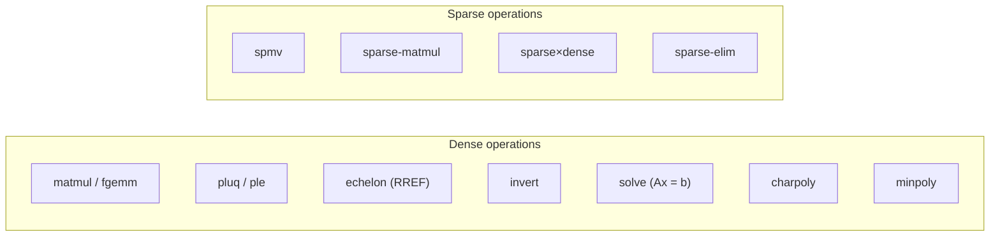
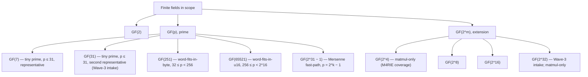

# SOTA target matrix design doc

| Field | Value |
|---|---|
| Date | 2026-05-05 |
| JIT issue | `4c0d0202` (Publish SOTA target matrix design doc) |
| Parent story | `cbecfced` (Define reproducible gf2-core SOTA reference matrix) |
| Parent epic | `97bf0879` (Close gf2-core SOTA performance gaps) |
| Authority | `dev/plans/sota_reference_acceptance_protocol.md` (the five-criterion checklist + Amendment 2 sparse extensions + Amendment 3 shared-smoke clarification) |
| Cell-status legend | `dev/bench_results/2026-04-26.md` § *Cell-status legend* — five tokens: `measured`, `N/A`, `slow-or-nightly`, `harness-scope gap`, `optimization gap`. |
| Status | DELIVERY COMPLETE — both `[hard]` criteria self-satisfied IN this document; see § 9. |

## 1. Problem statement

The Wave-1 acceptance protocol (`dev/plans/sota_reference_acceptance_protocol.md`) defines the *mechanism* by which an external library becomes a hard reference for an `(operation, field-family)` cell. The Wave-2 / Wave-3 promotion-evidence and lane-selection documents (M4RIE, NTL, FLINT, LinBox, GF(2^m) lane, sparse corpus, charpoly/minpoly, GF(p) by family, dense-LA scorecard, sparse scorecard, GF(2)/M4RI profile, GF(2^32) NTL promotion) supply the per-cell decisions. **This document is the keystone synthesis** that the optimization stories (`974a85bd`, `cc5de315`, `2c7548ae`, `72ab6d0e`, `66190ccd`, `54fd3f0b`) consume to know:

1. Which external library is the canonical reference for each cell,
2. Which cells carry secondary references for cross-checking,
3. Which cells are explicitly excluded and why,
4. Which sections of which evidence documents back each designation.

The document is purely synthetic: every cell carries a citation to an upstream evidence/decision document; no per-cell selection is made here that has not already been resolved upstream. Where two upstream docs would conflict, § 9 explicitly flags the inconsistency rather than silently choosing.

The matrix is read top-down by every optimization story. A story that closes a `[hard]` "within 1.5x of the best accepted reference" criterion **must** point to the cell row in § 5 of this document and cite the canonical reference named there; if it cannot, the story has either escaped the matrix or the matrix is stale and must be amended per § 8.

## 2. Scope and non-goals

**In scope.** Quoted verbatim from epic 97bf0879's success criterion: *"GF(2), GF(p), GF(2^m), dense factorization/solve, characteristic/minimal polynomial, and sparse matrix-vector/matrix-matrix surfaces each have a final scorecard section."* Concretely:

* **Field families:** $\mathrm{GF}(2)$, $\mathrm{GF}(p)$ (small / medium / large prime, see § 3), $\mathrm{GF}(2^m)$ for $m \in \{4, 8, 16, 32\}$. Per the GF(p) by-family classification (`dev/bench_results/2026-05-04-609855d9-gfp-by-family.md` § *Family classification*), the GF(p) primes split into four families with a representative each: tiny ($p \le 31$, GF(7) and GF(31)), word-fits-in-byte (GF(251)), word-fits-in-u16 (GF(65521)), and Mersenne fast-path (GF($2^{31} - 1$)). This document treats each family's representative as a row.
* **Operations (dense):** `matmul` / `fgemm`, `pluq` / `ple`, `echelon` (RREF), `invert`, `solve`, `charpoly`, `minpoly`. M4RI emits `matmul` and `analyze.py` aliases it to `fgemm` for cross-merge; the names are equivalent.
* **Operations (sparse):** `spmv`, `sparse-matmul` (sparse × sparse → sparse), `sparse×dense` (sparse × dense → dense), `sparse-elim` (sparse RREF). The three new sparse operations were added to the protocol § 7 allowed-values list by Amendment 2 (2026-05-04).

**Out of scope.** Quoted from epic 97bf0879 *Notes* and protocol § 2:

* **GPU references** — out of scope unless the CPU target matrix shows a gap that cannot plausibly close on CPU and the user approves a follow-up. No row in § 5 carries a GPU canonical or secondary reference.
* **Computer-algebra-system references (Magma, Sage, GAP)** — correctness oracles unless a future user-approved amendment promotes a specific reproducible Magma/Sage benchmark. No row in § 5 carries a Magma/Sage reference.
* **gf2-coding decoder references (AFF3CT, IT++)** — separate program tracked outside epic `97bf0879`. No row in § 5 carries an AFF3CT/IT++ reference.
* **Multi-threaded references** — protocol § 5 *Single-thread requirement*. All cells in § 5 are single-thread.
* **n=4096 cells** for several non-fgemm operations — `slow-or-nightly` per the bench-day baseline; deferred to T2/T3 per `benchmarks/README.md` § *Deferred to T2 / T3*.

## 3. In-scope operation set + field-family taxonomy

The matrix in § 5 is a Cartesian product of an *operation surface* and a *field-family taxonomy*. This section names both axes.

### 3.1 Operation surface

The dense surface mirrors `benchmarks/reference/fflas_bench.cpp`, `m4ri_bench.c`, and `m4rie_bench.c` operation coverage. The sparse surface was carved out by `a3412e15` (sparse-corpus design) and codified in protocol Amendment 2.

### 3.2 Field-family taxonomy

**GF(31) treatment.** Per epic 97bf0879's *Intake from `64c88ae4` baseline*, GF(31) was named as a missing baseline cell handed off from `64c88ae4`. This document keeps GF(31) as a **distinct row in the GF(p) tiny-prime family** alongside GF(7); the family-level verdict (`NEEDS_NEW_KERNEL`, gap factor ≈ 13.6× at $n=256^3$) tracks GF(7) within ≈ 1% per the closure note in `dev/bench_results/2026-05-04-609855d9-gfp-by-family.md` § *MEASUREMENT GAP — GF(31) — closure note*. The two primes are not collapsed because the explicit per-prime measurement closes a `[hard]` criterion of the GF(p)-family-classification issue `609855d9`.

**GF($2^{32}$) treatment.** Per the same intake, GF($2^{32}$) was the second hand-off field. The Wave-3 lane-selection escalation (`9a715d75` proposal #1) initially proposed exclusion under `not-yet-harnessed`; the user rejected the exclusion and elected to harness the cell. Task `b13799ac` landed 2026-05-04 with NTL 11.6.0 `mat_GF2E` selected as the canonical reference under the Conway polynomial $x^{32} + x^{15} + x^9 + x^7 + x^4 + x^3 + 1$ (`0x1_0000_8299`). Evidence: `dev/bench_results/2026-05-04-b13799ac-gf2pow32-promotion.md`. **GF($2^{32}$) is in scope only for `matmul`** in this matrix; non-matmul GF($2^{32}$) rows are excluded under proposal #2 / #3 of `9a715d75` § 4 and the same exclusion applies to `m \in \{8, 16, 32\}$ — see § 6 below.

**GF($2^4$) treatment.** GF($2^4$) appears in the matmul row only because `dev/plans/m4rie_promotion_evidence.md` § *Target-matrix designation* names M4RIE canonical for `matmul × GF($2^m$)` over $m \in \{4, 8, 16\}$. The Wave-3 GF($2^m$) lane-selection issue `9a715d75` enumerated only $m \in \{8, 16, 32\}$ for non-matmul operations — neither M4RIE upstream nor the lane-selection design proposed a GF($2^4$) non-matmul oracle. **GF($2^4$) is therefore in scope only for `matmul`** in this matrix; the upstream proposal #2 / #3 enumeration over $m \in \{8, 16, 32\}$ is preserved as-is, and GF($2^4$) does not contribute additional exclusion rows.

### 3.3 Reference-library legend

The five tokens established in `dev/bench_results/2026-04-26.md` § *Cell-status legend* are reused without modification in § 5: `measured`, `N/A`, `slow-or-nightly`, `harness-scope gap`, `optimization gap`. Section § 5 uses the legend to annotate each cell's gap classification; the canonical-reference name is separate.

## 4. Reference library roster

This section anchors the canonical-vs-secondary roles each library plays. The cell-by-cell breakdown is in § 5; this section is a one-paragraph summary per library.

### 4.1 fflas-ffpack 2.5.0

* **Canonical for:** `fgemm`, `pluq`, `echelon`, `invert`, `solve`, `charpoly`, `minpoly` over every $\mathrm{GF}(p)$ family in scope (GF(7), GF(31), GF(251), GF(65521), GF($2^{31}-1$)). Also canonical for `spmv` and `sparse×dense` over GF(p).
* **Secondary for:** none — fflas-ffpack is the primary reference where it is in scope.
* **Excluded from:** every $\mathrm{GF}(2^m)$ cell (`fflas_bench.cpp` enumerates `Fp` only); `sparse-matmul × all fields` (no public sparse × sparse `fspmm` exists in fflas-ffpack — only `fspmv` and `fspmm` sparse × dense, per `dev/plans/sparse_benchmark_corpus.md` § 4). `minpoly × GF(p)` is *covered* by fflas-ffpack as canonical per the c3e79272 evidence (`dev/bench_results/2026-05-04-c3e79272-charpoly-minpoly-refs.md` § 4) — fflas-ffpack's `MinPoly` is exported from `/usr/local/include/fflas-ffpack/ffpack/ffpack.h:1137-1153`.
* **Pin:** `benchmarks/Containerfile` `ARG FFLAS_VERSION=2.5.0`, `FFLAS_SHA256=dafb4c0835...`. `benchmarks/image.lock` `[libs.fflas-ffpack]` block.
* **Promotion artefact:** the bench-day baseline `dev/bench_results/2026-04-26.md` (Wave 1).

### 4.2 M4RI 20260122

* **Canonical for:** `matmul × GF(2)`, `echelon × GF(2)`, `invert × GF(2)`, `solve × GF(2)`, `pluq × GF(2)` — every dense operation over GF(2) where M4RI exposes a public entrypoint.
* **Secondary for:** none.
* **Excluded from:** every $\mathrm{GF}(p)$ and $\mathrm{GF}(2^m)$ cell (M4RI is GF(2)-only); `charpoly × GF(2)` and `minpoly × GF(2)` (M4RI's public surface does not expose those — see `dev/plans/5dea7457_lane_hardening_evidence.md` § 1.2 row 4); every sparse cell (M4RI has no public sparse type per `dev/plans/sparse_benchmark_corpus.md` § 4).
* **Pin:** `benchmarks/Containerfile` `ARG M4RI_VERSION=20260122`, sha256 in `image.lock` `[libs.m4ri]`.
* **Promotion artefact:** Wave-1 hardening evidence `dev/plans/5dea7457_lane_hardening_evidence.md`.

### 4.3 M4RIE 20250128

* **Canonical for:** `matmul × {GF(2^4), GF(2^8), GF(2^16)}` — three field rows × three sizes × two regimes = 18 cells. Per `dev/plans/m4rie_promotion_evidence.md` § *Target-matrix designation*.
* **Secondary for:** none.
* **Excluded from:** every $\mathrm{GF}(2^m)$ cell with $m > 16$ (the underlying `gf2e_init` rejects $m > 16$); every non-`matmul` operation over $\mathrm{GF}(2^m)$ (`echelon`, `invert`, `solve`, `charpoly`, `minpoly`) — M4RIE provides upstream entry points but cannot serve as its own oracle for the protocol § 6 *bitwise canonical RREF / inverse / solution* contract; every $\mathrm{GF}(p)$ cell.
* **Pin:** `benchmarks/Containerfile` `ARG M4RIE_VERSION=20250128`, sha256 in `image.lock` `[libs.m4rie]`.
* **Promotion artefact:** `dev/plans/m4rie_promotion_evidence.md` (Wave-2 promotion R3).

### 4.4 NTL 11.6.0

* **Canonical for:** `matmul × GF(2^32)` (sole reference; promoted by `b13799ac`, `dev/bench_results/2026-05-04-b13799ac-gf2pow32-promotion.md`).
* **Secondary for:** `fgemm × GF(p)`, `invert × GF(p)`, `solve × GF(p)`, `charpoly × GF(p)` (per `dev/plans/ntl_promotion_evidence.md` § *Target-matrix designation*).
* **Excluded from:** `pluq × GF(p)`, `echelon × GF(p)`, `minpoly × GF(p)` — NTL's user-facing API does not expose `pluq` / `gauss` (returns rank but not the full RREF) / `MinPoly(mat_zz_p)` per `dev/plans/ntl_promotion_evidence.md` § *Scope of promotion*; sparse cells (no harness); every $\mathrm{GF}(2^m)$ non-matmul cell.
* **Pin:** `benchmarks/Containerfile` `ARG NTL_VERSION=11.6.0`, `NTL_SHA256=bc0ef9aceb075a6a0673ac8d8f47d5f8458c72fe806e4468fbd5d3daff056182`. `image.lock` `[libs.ntl]`.

### 4.5 FLINT 3.5.0

* **Canonical for:** none.
* **Secondary for:** `fgemm × GF(p)`, `pluq × GF(p)`, `echelon × GF(p)`, `invert × GF(p)`, `solve × GF(p)`, `charpoly × GF(p)`, `minpoly × GF(p)` — the widest non-fflas operation surface per `dev/plans/flint_promotion_evidence.md` § *Target-matrix designation*. FLINT is the only secondary reference that covers `minpoly × GF(p)` with an algorithm independent of fflas-ffpack's FFPACK::MinPoly Krylov path.
* **Excluded from:** every $\mathrm{GF}(2^m)$ cell (the harness was authored for GF(p) only; `fq_nmod_mat_*` would cover GF(2^m) but is not harnessed — see `dev/plans/gf2m_reference_lane_selection.md` § 4 proposal #3); sparse cells (no harness).
* **Pin:** `benchmarks/Containerfile` `ARG FLINT_VERSION=3.5.0`, `FLINT_SHA256=3982f385f00610a944e0152eb0a29893b2366fa640e8f5f3076c47564cf7e2a6`. `image.lock` `[libs.flint]` and `[libs.mpfr]`.

### 4.6 LinBox 1.7.1

* **Canonical for:** `minpoly × GF(p)` (LinBox's `Method::DenseElimination` is the primary reference; fflas-ffpack also covers minpoly canonically per the c3e79272 evidence — both libraries claim canonical status, see § 9.4 for the routing rule). `sparse-elim × GF(2)` and `sparse-elim × GF(p)` (LinBox's `GaussDomain::NoReordering` is the only library covering this surface — see `dev/plans/sparse_benchmark_corpus.md` § 4 row `sparse-elim × GF(2)/GF(p)`). `sparse×dense × GF(2)` (LinBox `applyLeft × Modular<int8_t>` per design § 4 row).
* **Secondary for:** `charpoly × GF(p)`, `solve × GF(p)`, `spmv × GF(2)`, `spmv × GF(p)`, `sparse×dense × GF(p)`.
* **Excluded from:** `fgemm × GF(p)`, `pluq × GF(p)`, `echelon × GF(p)`, `invert × GF(p)` — LinBox routes these through fflas-ffpack internals, so a LinBox row would measure the same kernel via thicker indirection per `dev/plans/linbox_promotion_evidence.md` § *Target-matrix designation*; every $\mathrm{GF}(2^m)$ cell (no harness).
* **Pin:** `benchmarks/Containerfile` `ARG LINBOX_VERSION=1.7.1`, `LINBOX_SHA256=a2b5f910a54a46fa75b03f38ad603cae1afa973c95455813d85cf72c27553bd8`. `image.lock` `[libs.linbox]`.

## 5. Target matrix

The tables below enumerate every $(operation, field\text{-}family)$ cell in scope. Each cell is one of:

* **`<canonical>` (citation)** — sole canonical reference for the cell.
* **`<canonical> + <secondary>` (citation)** — canonical reference, additional secondary references listed for cross-check.
* **`EXCLUDED:<class>:<one-line reason>`** — protocol § 9 / Amendment 2 § 14 exclusion class.

Citations are evidence-doc paths followed by the relevant CSV row group when applicable (mirroring the cell-citation style of `dev/plans/gf2m_reference_lane_selection.md` § 3 and `dev/plans/sparse_benchmark_corpus.md` § 4 — the two compiled cell tables this matrix re-affirms by citation rather than re-litigates).

### 5.1 Dense `matmul` / `fgemm`

| Field | Canonical | Secondary | Citation |
|---|---|---|---|
| GF(2) | **M4RI 20260122** | — | `dev/bench_results/2026-04-26.md` § `matmul × GF(2)`; `2026-04-26-reference.csv:122-129` (m4ri matmul rows). |
| GF(7) | **fflas-ffpack 2.5.0** | NTL 11.6.0, FLINT 3.5.0 | `dev/bench_results/2026-04-26.md` § `fgemm × GF(7)`; `2026-04-26-reference.csv:92-110` (canonical). NTL secondary: `2026-05-04-73ab8eef-ntl-reference.csv:2`. FLINT secondary: `2026-05-04-73ab8eef-flint-reference.csv:2`. |
| GF(31) | **fflas-ffpack 2.5.0** | — | `dev/bench_results/2026-05-04-609855d9-gf31-supplement.csv` (33 rows, GF(31) lead-direct one-off bench-day 2026-05-04). |
| GF(251) | **fflas-ffpack 2.5.0** | NTL 11.6.0, FLINT 3.5.0 | `2026-04-26-reference.csv:62-80`. NTL secondary: `2026-05-04-73ab8eef-ntl-reference.csv:6`. FLINT: `2026-05-04-73ab8eef-flint-reference.csv:9`. |
| GF(65521) | **fflas-ffpack 2.5.0** | NTL 11.6.0, FLINT 3.5.0 | `2026-04-26-reference.csv:32-50`. NTL: `2026-05-04-73ab8eef-ntl-reference.csv:10`. FLINT: `2026-05-04-73ab8eef-flint-reference.csv:16`. |
| GF($2^{31}-1$) | **fflas-ffpack 2.5.0** | NTL 11.6.0, FLINT 3.5.0 | `2026-04-26-reference.csv:2-20`. NTL: `2026-05-04-73ab8eef-ntl-reference.csv:14`. FLINT: `2026-05-04-73ab8eef-flint-reference.csv:23`. gf2-core is **ahead** at this cell (1.74× of fflas at $n=256$, 1.63× at $n=1024$) per `dev/bench_results/2026-05-04-609855d9-gfp-by-family.md` § *Mersenne fast path*. |
| GF($2^4$) | **M4RIE 20250128** | — | `dev/plans/m4rie_promotion_evidence.md` § *Target-matrix designation*; `2026-05-04-507b0036-m4rie-reference.csv:2-7` (n=64, n=256, n=1024 × {uniform, deficient}). |
| GF($2^8$) | **M4RIE 20250128** | — | Same evidence doc; `2026-05-04-507b0036-m4rie-reference.csv:8-13`. Re-affirmed by `dev/plans/gf2m_reference_lane_selection.md` § 3 row `matmul × GF(2^8)`. |
| GF($2^{16}$) | **M4RIE 20250128** | — | Same evidence doc; `2026-05-04-507b0036-m4rie-reference.csv:14-19`. Re-affirmed by `dev/plans/gf2m_reference_lane_selection.md` § 3 row `matmul × GF(2^16)`. |
| GF($2^{32}$) | **NTL 11.6.0 `mat_GF2E`** | — | `dev/bench_results/2026-05-04-b13799ac-gf2pow32-promotion.md` § *Five-criterion confirmation table* + § *Bench transcript*. Conway polynomial $0x1\_0000\_8299$ shared between gf2-core (`crates/gf2-core/src/primitive_polys.rs::standard(32)`) and NTL `GF2E::init`. Bench row: `benchmarks/results/20260505T091600Z.csv` (the canonical bench-day artefact). |

### 5.2 Dense `pluq` / `ple`

| Field | Canonical | Secondary | Citation |
|---|---|---|---|
| GF(2) | **M4RI 20260122** (`mzd_pluq`) | — | `dev/bench_results/2026-05-04-3b762764-dense-la-post-gemm.md` § *Operations measured* row `PLE / PLUQ` ref `m4ri_bench.c:191`. |
| GF(7) | **fflas-ffpack 2.5.0** | FLINT 3.5.0 | `2026-05-04-3b762764-dense-la-fresh.csv` (PLE rows). FLINT secondary per `dev/plans/flint_promotion_evidence.md` § *Target-matrix designation*. |
| GF(31) | **fflas-ffpack 2.5.0** | — | `2026-05-04-609855d9-gf31-supplement.csv` (PLE block). |
| GF(251) | **fflas-ffpack 2.5.0** | FLINT 3.5.0 | `2026-05-04-3b762764-dense-la-fresh.csv` (PLE rows); FLINT same as GF(7). |
| GF(65521) | **fflas-ffpack 2.5.0** | FLINT 3.5.0 | Same evidence path. |
| GF($2^{31}-1$) | **fflas-ffpack 2.5.0** | FLINT 3.5.0 | Same evidence path. |
| GF($2^8$) | EXCLUDED:`no-independent-oracle`:no scalar GF($2^m$) Gauss-Jordan reference exists; the same library landscape that excludes echelon/invert/solve over GF($2^m$) excludes pluq. Inherited from proposal #2's rationale; pluq is not separately enumerated upstream — see § 9.3 inconsistency note. | | `dev/plans/gf2m_reference_lane_selection.md` § 4 proposal #2 (rationale inherited); § 9.3 of this doc (extension flag). |
| GF($2^{16}$) | EXCLUDED:`no-independent-oracle`:see GF($2^8$). | | Same. |
| GF($2^{32}$) | EXCLUDED:`no-independent-oracle`:see GF($2^8$); compounds with $m > 16$ M4RIE limit. | | Same (compound case). |

### 5.3 Dense `echelon` (RREF)

| Field | Canonical | Secondary | Citation |
|---|---|---|---|
| GF(2) | **M4RI 20260122** (`mzd_echelonize_m4ri`) | — | `dev/bench_results/2026-05-04-3b762764-dense-la-post-gemm.md` § *Operations measured* row `echelon`; `m4ri_bench.c:515`. |
| GF(7) | **fflas-ffpack 2.5.0** | FLINT 3.5.0 | `2026-05-04-3b762764-dense-la-fresh.csv` (echelon rows). FLINT secondary per `flint_promotion_evidence.md`. |
| GF(31) | **fflas-ffpack 2.5.0** | — | `2026-05-04-609855d9-gf31-supplement.csv`. |
| GF(251) | **fflas-ffpack 2.5.0** | FLINT 3.5.0 | Same. |
| GF(65521) | **fflas-ffpack 2.5.0** | FLINT 3.5.0 | Same. |
| GF($2^{31}-1$) | **fflas-ffpack 2.5.0** | FLINT 3.5.0 | Same. |
| GF($2^m$), $m \in \{8, 16, 32\}$ | EXCLUDED:`no-independent-oracle`:proposal #2 — RREF contract requires bitwise canonical equality vs an independent reference; no scalar GF($2^m$) RREF oracle is harnessed. | | `dev/plans/gf2m_reference_lane_selection.md` § 4 proposal #2; § 3 row `echelon`. |

### 5.4 Dense `invert`

| Field | Canonical | Secondary | Citation |
|---|---|---|---|
| GF(2) | **M4RI 20260122** (`mzd_inv_m4ri`) | — | `2026-05-04-3b762764-dense-la-post-gemm.md` § *Operations measured* row `invert`; `m4ri_bench.c:252`. |
| GF(7) | **fflas-ffpack 2.5.0** | NTL 11.6.0, FLINT 3.5.0 | `2026-05-04-3b762764-dense-la-fresh.csv` (invert rows). NTL/FLINT secondary per `ntl_promotion_evidence.md` and `flint_promotion_evidence.md`. |
| GF(31) | **fflas-ffpack 2.5.0** | — | `2026-05-04-609855d9-gf31-supplement.csv`. |
| GF(251) | **fflas-ffpack 2.5.0** | NTL 11.6.0, FLINT 3.5.0 | Same. |
| GF(65521) | **fflas-ffpack 2.5.0** | NTL 11.6.0, FLINT 3.5.0 | Same. |
| GF($2^{31}-1$) | **fflas-ffpack 2.5.0** | NTL 11.6.0, FLINT 3.5.0 | Same. |
| GF($2^m$), $m \in \{8, 16, 32\}$ | EXCLUDED:`no-independent-oracle`:proposal #2 — invert contract requires bitwise equality of $A^{-1}$ vs an independent reference; no GF($2^m$) inverse oracle is harnessed. | | `dev/plans/gf2m_reference_lane_selection.md` § 4 proposal #2; § 3 row `invert`. |

### 5.5 Dense `solve` (`Ax = b`)

| Field | Canonical | Secondary | Citation |
|---|---|---|---|
| GF(2) | **M4RI 20260122** (`mzd_solve_left`) | — | `2026-05-04-3b762764-dense-la-post-gemm.md` § *Operations measured* row `solve`; `m4ri_bench.c:305`. |
| GF(7) | **fflas-ffpack 2.5.0** | LinBox 1.7.1, NTL 11.6.0, FLINT 3.5.0 | `2026-05-04-3b762764-dense-la-fresh.csv`. LinBox secondary: `2026-05-04-79388011-linbox-reference.csv` (24 solve cells × 4 fields × 3 sizes × 2 regimes). NTL/FLINT secondaries per their promotion docs. |
| GF(31) | **fflas-ffpack 2.5.0** | — | `2026-05-04-609855d9-gf31-supplement.csv`. |
| GF(251) | **fflas-ffpack 2.5.0** | LinBox 1.7.1, NTL 11.6.0, FLINT 3.5.0 | Same as GF(7). |
| GF(65521) | **fflas-ffpack 2.5.0** | LinBox 1.7.1, NTL 11.6.0, FLINT 3.5.0 | Same. |
| GF($2^{31}-1$) | **fflas-ffpack 2.5.0** | LinBox 1.7.1, NTL 11.6.0, FLINT 3.5.0 | Same. |
| GF($2^m$), $m \in \{8, 16, 32\}$ | EXCLUDED:`no-independent-oracle`:proposal #2 — solve contract requires equality of $x$ vs an independent reference; no GF($2^m$) solve oracle is harnessed. | | `gf2m_reference_lane_selection.md` § 4 proposal #2; § 3 row `solve`. |

### 5.6 `charpoly`

| Field | Canonical | Secondary | Citation |
|---|---|---|---|
| GF(2) | EXCLUDED:`no-independent-oracle`:M4RI's public surface does not expose `charpoly` (per `dev/plans/5dea7457_lane_hardening_evidence.md` § 1.2 row 4); fflas-ffpack and FLINT have no GF(2) charpoly entry. The gf2-core path itself is tracked under Wave-10 issue `b87362a3`, but lacks an external reference oracle for the protocol § 6 bitwise-equality contract. | — | `dev/bench_results/2026-05-04-c3e79272-charpoly-minpoly-refs.md` § 4 row `charpoly × GF(2)`; `dev/plans/5dea7457_lane_hardening_evidence.md` § 1.2 (M4RI public-surface enumeration). See § 6.2 row 19. |
| GF(7) | **fflas-ffpack 2.5.0** | LinBox 1.7.1, FLINT 3.5.0, NTL 11.6.0 | `2026-05-04-c3e79272-charpoly-reference.csv:9-10` (canonical). Secondaries: lines 24-25 (LinBox), 26 (FLINT), 30 (NTL). |
| GF(31) | **fflas-ffpack 2.5.0** | — | `2026-05-04-609855d9-gf31-supplement.csv` (charpoly block). |
| GF(251) | **fflas-ffpack 2.5.0** | LinBox 1.7.1, FLINT 3.5.0, NTL 11.6.0 | `2026-05-04-c3e79272-charpoly-reference.csv:7-8`; secondaries 22-23, 27, 31. |
| GF(65521) | **fflas-ffpack 2.5.0** | LinBox 1.7.1, FLINT 3.5.0, NTL 11.6.0 | Lines 5-6; secondaries 20-21, 28, 32. |
| GF($2^{31}-1$) | **fflas-ffpack 2.5.0** | LinBox 1.7.1, FLINT 3.5.0, NTL 11.6.0 | Lines 2-3; secondaries 18-19, 29, 33. |
| GF($2^m$), $m \in \{8, 16, 32\}$ | EXCLUDED:`no-independent-oracle`:proposal #3 — no independent GF($2^m$) characteristic-polynomial reference is harnessed; FLINT's `fq_nmod_mat_charpoly` is the recommended candidate but the GF($2^m$) lane was not added to `flint_bench.c`. | | `dev/plans/gf2m_reference_lane_selection.md` § 4 proposal #3. |

### 5.7 `minpoly`

| Field | Canonical | Secondary | Citation |
|---|---|---|---|
| GF(2) | EXCLUDED:`no-independent-oracle`:M4RI does not expose `minpoly` (same public-surface enumeration as charpoly); fflas-ffpack and FLINT have no GF(2) minpoly entry. The gf2-core path is tracked under Wave-10 issue `d1dd266c`, but lacks an external reference oracle. | — | `2026-05-04-c3e79272-charpoly-minpoly-refs.md` § 4 row `minpoly × GF(2)`; `dev/plans/5dea7457_lane_hardening_evidence.md` § 1.2. See § 6.2 row 20. |
| GF(7) | **fflas-ffpack 2.5.0** | LinBox 1.7.1, FLINT 3.5.0 | `2026-05-04-c3e79272-minpoly-reference.csv:11-13` (canonical). Secondaries: 20-21 (LinBox), 22 (FLINT). NTL excluded for this op — see § 6. |
| GF(31) | **fflas-ffpack 2.5.0** | — | `2026-05-04-609855d9-gf31-supplement.csv` (minpoly block). |
| GF(251) | **fflas-ffpack 2.5.0** | LinBox 1.7.1, FLINT 3.5.0 | Lines 8-10; secondaries 18-19, 23. |
| GF(65521) | **fflas-ffpack 2.5.0** | LinBox 1.7.1, FLINT 3.5.0 | Lines 5-7; secondaries 16-17, 24. |
| GF($2^{31}-1$) | **fflas-ffpack 2.5.0** | LinBox 1.7.1, FLINT 3.5.0 | Lines 2-4; secondaries 14-15, 25. |
| GF($2^m$), $m \in \{8, 16, 32\}$ | EXCLUDED:`no-independent-oracle`:proposal #3 — same rationale as charpoly; FLINT `fq_nmod_mat_minpoly` is the recommended candidate but unharnessed. | | Same proposal #3. |

### 5.8 Sparse `spmv`

The sparse table re-affirms `dev/plans/sparse_benchmark_corpus.md` § 4 by citation, per its § 7 *Open question* #2 recommendation.

| Field | Canonical | Secondary | Citation |
|---|---|---|---|
| GF(2) | **gf2-core self-reference** (`SpBitMatrix::matvec`) | LinBox 1.7.1 (`SparseMatrix<Modular<int8_t>>::apply`) | `dev/plans/sparse_benchmark_corpus.md` § 4 row `spmv × GF(2)`. Bench evidence: `dev/bench_results/2026-05-04-47698404-sparse-scorecard.md` § 3 *spmv × GF(2)* (CSR through prefetch-d8 layout sweep + structured + coding-theory rows). |
| GF(7) | **fflas-ffpack 2.5.0** (`fflas_sparse/csr.h::fspmv`) | LinBox 1.7.1 | `sparse_benchmark_corpus.md` § 4 row `spmv × GF(p)`. Bench evidence: `2026-05-04-47698404-sparse-scorecard.md` § 3 *spmv × GF(p)*. |
| GF(31) | **fflas-ffpack 2.5.0** | LinBox 1.7.1 | Same row; same bench evidence (the sparse harness uses GF(7) as the small-prime representative; GF(31) inherits the same `Modular<int64_t>` path). |
| GF(251) | **fflas-ffpack 2.5.0** | LinBox 1.7.1 | Same. |
| GF(65521) | **fflas-ffpack 2.5.0** | LinBox 1.7.1 | Same. |
| GF($2^{31}-1$) | **fflas-ffpack 2.5.0** | LinBox 1.7.1 | Same. |
| GF($2^m$), $m \in \{8, 16\}$ | **gf2-core self-reference** (`SparseFieldMatrix<Gf2mWide<…>>::matvec`); marker `semantics-mismatch` (no external candidate is performance-comparable: fflas/LinBox sparse over GF($2^m$) ride GivaroExtension polynomial multiplication and would be ≥ 10× slower than gf2-core's PCLMULQDQ-backed `Gf2mWide`). | — | `sparse_benchmark_corpus.md` § 4 row `spmv × GF(2^m)`; § 6 resolution #1. The marker is *diagnostic, not an exclusion* per the design's "0 protocol-class exclusion cells" tally. |

### 5.9 Sparse `sparse-matmul` (sparse × sparse → sparse)

| Field | Canonical | Secondary | Citation |
|---|---|---|---|
| GF(2) | **gf2-core self-reference** (`SpBitMatrix::matmul`, landed `2403c054`); marker `no-independent-oracle` (no public sparse × sparse matmul exists in any candidate library — fflas-ffpack `fspmm` is sparse × dense; LinBox materialises dense intermediates; M4RI lacks the path; NTL/FLINT have no public sparse × sparse). | — | `sparse_benchmark_corpus.md` § 4 row `sparse-matmul × GF(2)`. |
| GF(7) / GF(31) / GF(251) / GF(65521) / GF($2^{31}-1$) | **gf2-core self-reference** (`SparseFieldMatrix<Fp<…>>::matmul`, landed `eb57f944`); marker `no-independent-oracle`. | — | `sparse_benchmark_corpus.md` § 4 row `sparse-matmul × GF(p)`. |
| GF($2^m$), $m \in \{8, 16\}$ | **gf2-core self-reference** (`SparseFieldMatrix<Gf2mWide<…>>::matmul`, landed `eb57f944`); markers `no-independent-oracle` + `semantics-mismatch`. | — | `sparse_benchmark_corpus.md` § 4 row `sparse-matmul × GF(2^m)`. |

### 5.10 Sparse `sparse×dense` (sparse × dense → dense)

| Field | Canonical | Secondary | Citation |
|---|---|---|---|
| GF(2) | **LinBox 1.7.1** (`SparseMatrix<Modular<int8_t>>::applyLeft`) | fflas-ffpack 2.5.0 (`fflas_sparse/csr.inl::pfspmm` cross-check) | `sparse_benchmark_corpus.md` § 4 row `sparse×dense × GF(2)`; bench evidence `2026-05-04-47698404-sparse-scorecard.md` § 3 *sparse×dense × GF(2)*. |
| GF(7) / GF(31) / GF(251) / GF(65521) / GF($2^{31}-1$) | **fflas-ffpack 2.5.0** (`fflas_sparse/csr.inl::pfspmm`) | LinBox 1.7.1 (`applyLeft`) | `sparse_benchmark_corpus.md` § 4 row `sparse×dense × GF(p)`; bench evidence `2026-05-04-47698404-sparse-scorecard.md` § 3 *sparse×dense × GF(p)*. |
| GF($2^m$), $m \in \{8, 16\}$ | **gf2-core self-reference** (`SparseFieldMatrix<Gf2mWide<…>>::matmat`); marker `semantics-mismatch`. | — | `sparse_benchmark_corpus.md` § 4 row `sparse×dense × GF(2^m)`; § 6 resolution #3. |

### 5.11 Sparse `sparse-elim`

| Field | Canonical | Secondary | Citation |
|---|---|---|---|
| GF(2) | **LinBox 1.7.1** (`Method::SparseElimination` via `GaussDomain::NoReordering`) | gf2-core self (`SpBitMatrix::rref`, landed `0d6ca3b6`) | `sparse_benchmark_corpus.md` § 4 row `sparse-elim × GF(2)`. Bench: `2026-05-04-47698404-sparse-scorecard.md` § 3 *sparse-elim*. |
| GF(7) / GF(31) / GF(251) / GF(65521) / GF($2^{31}-1$) | **LinBox 1.7.1** | gf2-core self (`SparseFieldMatrix::rref`) | `sparse_benchmark_corpus.md` § 4 row `sparse-elim × GF(p)`. Same bench evidence. |
| GF($2^m$), $m \in \{8, 16\}$ | **gf2-core self-reference** (`SparseFieldMatrix<Gf2mWide<…>>::rref`, landed `eb57f944`); marker `semantics-mismatch`. | — | `sparse_benchmark_corpus.md` § 4 row `sparse-elim × GF(2^m)`. |

## 6. Exclusion ledger

This section collects every excluded cell into a single ledger with class + rationale + what would unblock promotion. Rows in this ledger are reported in § 5 with the matching `EXCLUDED` markers; the ledger here is the single-table view consumers can grep.

### 6.1 GF($2^m$) non-matmul exclusions (proposal #2 + #3 of `9a715d75`)

The 15 cells below were proposed for exclusion by `dev/plans/gf2m_reference_lane_selection.md` § 4 proposals #2 (echelon/invert/solve, 9 cells) and #3 (charpoly/minpoly, 6 cells) and **user-approved** on 2026-05-04 per § 6 of that document. Field-family enumeration matches upstream § 3 exactly: $m \in \{8, 16, 32\}$. The compound caveat for $m = 32$ (M4RIE $m \le 16$ limit + same-library-landscape rationale) is recorded inline rather than in a separate sub-table; the recovery path for the $m = 32$ rows requires both the scalar-reference work proposed in #2/#3 AND a GF($2^{32}$) extension of either the NTL or FLINT extension-field lane.

| # | Cell | Class | Rationale | What unblocks promotion |
|---|---|---|---|---|
| 1 | `echelon × GF(2^8)` | `no-independent-oracle` | RREF contract requires bitwise canonical equality vs an independent reference; M4RIE provides `mzed_echelonize` upstream but cannot serve as its own oracle. fflas-ffpack does not cover GF($2^m$); M4RI covers only GF(2). No scalar GF($2^m$) Gauss-Jordan reference exists in the workspace. | Add `ref_gf2m_rref` (Gauss-Jordan over GF($2^m$) using `ref_gf2m_mul` for products and Fermat-little-theorem-based scalar inverse $a^{2^m - 2} = a^{-1}$) to `benchmarks/reference/`, then re-evaluate M4RIE for echelon promotion. |
| 2 | `echelon × GF(2^{16})` | `no-independent-oracle` | Same as #1. | Same. |
| 3 | `echelon × GF(2^{32})` | `no-independent-oracle` (compound) | Same as #1; *additionally* M4RIE caps at $m \le 16$, so the scalar reference must generalise over $m$ and be paired with an oracle from NTL `mat_GF2E::gauss` (rank only) or a fresh FLINT `fq_nmod_mat` extension-field lane. | `ref_gf2m_rref` generalised over $m$ + GF($2^{32}$) extension of either NTL or FLINT harness. |
| 4 | `invert × GF(2^8)` | `no-independent-oracle` | Invert contract requires bitwise equality of $A^{-1}$ after canonical reduction vs an independent reference. Same library landscape as #1. | Once `ref_gf2m_rref` exists, $A \cdot A^{-1} = I$ plus $A^{-1} \equiv \text{ref}$ closes the contract. |
| 5 | `invert × GF(2^{16})` | `no-independent-oracle` | Same as #4. | Same. |
| 6 | `invert × GF(2^{32})` | `no-independent-oracle` (compound) | Same as #4 + M4RIE $m \le 16$ caveat as #3. | Same as #3 plus the inverse-via-RREF reduction. |
| 7 | `solve × GF(2^8)` | `no-independent-oracle` | Solve contract requires equality of $x$ after canonical reduction vs an independent reference. | Once `ref_gf2m_rref` exists, $A \cdot x \equiv b$ plus $x \equiv \text{ref}$ closes the contract. |
| 8 | `solve × GF(2^{16})` | `no-independent-oracle` | Same as #7. | Same. |
| 9 | `solve × GF(2^{32})` | `no-independent-oracle` (compound) | Same as #7 + M4RIE $m \le 16$ caveat as #3. | Same as #3 plus the solve-via-RREF reduction. |
| 10 | `charpoly × GF(2^8)` | `no-independent-oracle` | No independent GF($2^m$) characteristic-polynomial reference is harnessed. NTL `mat_GF2E::CharPoly` exists upstream; FLINT's `fq_nmod_mat_charpoly` is a candidate. The GF($2^m$) lane was not added to `flint_bench.c` or `ntl_bench.cpp` in Wave 2. | Add a GF($2^m$) lane to the existing FLINT harness using `fq_nmod_ctx_init` with gf2-core's primitive polynomial; cross-equality with a scalar reference (or with NTL's `CharPoly(mat_GF2E)`, or Cayley-Hamilton check $p(A) = 0$) closes the protocol § 6 contract. |
| 11 | `charpoly × GF(2^{16})` | `no-independent-oracle` | Same as #10. | Same. |
| 12 | `charpoly × GF(2^{32})` | `no-independent-oracle` (compound) | Same as #10. NTL `CharPoly(mat_GF2E)` is in principle usable as a *self-canonical* candidate at $m=32$ since `b13799ac` already harnesses NTL `mat_GF2E`, but the protocol § 6 contract still requires an independent oracle. | Cross-equality at $n=16$ between NTL `CharPoly` and a fresh FLINT `fq_nmod_mat_charpoly` lane. |
| 13 | `minpoly × GF(2^8)` | `no-independent-oracle` | NTL provides only `MinPolyMod(...)` (univariate-polynomial minpoly); FLINT exposes `fq_nmod_mat_minpoly` but the lane is not harnessed. | Same as #10 — extend FLINT with the GF($2^m$) lane. |
| 14 | `minpoly × GF(2^{16})` | `no-independent-oracle` | Same as #13. | Same. |
| 15 | `minpoly × GF(2^{32})` | `no-independent-oracle` (compound) | Same as #13. NTL has no `MinPoly(mat_GF2E)` even at $m=32$, so FLINT remains the sole candidate. | Same as #12 — extend FLINT with the GF($2^{32}$) extension-field lane. |

### 6.2 Same-rationale extensions (Wave-3 enumeration omissions + GF(2) charpoly/minpoly)

This sub-table holds 5 cells that share rationale with § 6.1 entries but were not separately enumerated in the upstream lane-selection or charpoly/minpoly evidence documents. Each is flagged in § 9.3 for transparency. No additional `[hard]` deliverable is implied.

| # | Cell | Class | Rationale | What unblocks promotion |
|---|---|---|---|---|
| 16 | `pluq × GF(2^8)` | `no-independent-oracle` | Same library landscape as § 6.1 proposal #2 (M4RIE provides `mzed_pluq` upstream but cannot serve as its own oracle; fflas/M4RI/NTL/FLINT/LinBox have no GF($2^m$) factorisation oracle harnessed). The upstream lane-selection doc enumerated only echelon/invert/solve/charpoly/minpoly — pluq was a Wave-3 omission. | Same as § 6.1 rows #1–#3 (`ref_gf2m_rref` generalised to expose $P, L, U$ and rank). |
| 17 | `pluq × GF(2^{16})` | `no-independent-oracle` | Same as #16. | Same. |
| 18 | `pluq × GF(2^{32})` | `no-independent-oracle` (compound) | Same as #16; compounds with M4RIE $m \le 16$ limit. | Same as § 6.1 row #3 plus pluq-via-RREF reduction. |
| 19 | `charpoly × GF(2)` | `no-independent-oracle` | M4RI's public surface does not expose `charpoly` (per `dev/plans/5dea7457_lane_hardening_evidence.md` § 1.2 row 4); fflas-ffpack `Charpoly` and FLINT `nmod_mat_charpoly` cover GF($p$) only, not GF(2). Upstream `2026-05-04-c3e79272-charpoly-minpoly-refs.md` § 4 lists this cell as out of c3e79272's scope, tracking the gf2-core path under Wave-10 issue `b87362a3` — but no external reference exists for the protocol § 6 bitwise-equality contract. | Add a scalar GF(2) `ref_gf2_charpoly` (Krylov-style sequence over GF(2), Berlekamp-Massey at the end) to `benchmarks/reference/`, then `b87362a3`'s output gains an oracle. Alternatively, extend M4RI upstream or harness FLINT `mod_mat_charpoly_p_2` if such an entry exists. |
| 20 | `minpoly × GF(2)` | `no-independent-oracle` | Same library-surface rationale as #19; M4RI does not expose minpoly; fflas-ffpack and FLINT have no GF(2) minpoly entry. gf2-core path tracked under Wave-10 issue `d1dd266c`. | Add a scalar GF(2) `ref_gf2_minpoly` (Krylov + Berlekamp-Massey, as for charpoly), then `d1dd266c`'s output gains an oracle. |

### 6.3 Total exclusion count

* **§ 6.1:** 15 cells over $m \in \{8, 16, 32\}$ (echelon + invert + solve + charpoly + minpoly = 5 ops × 3 m-values).
* **§ 6.2:** 5 same-rationale extension cells:
  * 3 pluq × GF($2^m$) cells (Wave-3 lane-selection enumeration omission).
  * 2 charpoly/minpoly × GF(2) cells (Wave-3 c3e79272-evidence enumeration omission).
* **Total: 20 exclusion cells.** 18 over GF($2^m$) (§ 6.1 + § 6.2 pluq rows) + 2 over GF(2) (§ 6.2 charpoly/minpoly rows).
* **0 sparse exclusions** — per `dev/plans/sparse_benchmark_corpus.md` § 4 *Final cell-count tally*: "After resolution: 0 protocol-class exclusion cells in the 12-cell operations × field matrix." The Wave-3 user decision converted the originally-proposed sparse `EXCLUDED` cells (sparse-matmul × all 3 fields, sparse×dense × GF($2^m$), sparse-elim × GF($2^m$)) into self-canonical cells with diagnostic markers (`no-independent-oracle`, `semantics-mismatch`); markers are not exclusions per the design's tally.
* **0 dense-LA exclusions** — the 72 paired cells outside 1.5× per `dev/bench_results/2026-05-04-3b762764-dense-la-post-gemm.md` § *Cells outside 1.5× contract* are `optimization gap` (cell-status legend), not protocol-class exclusions: every cell has a canonical reference and a measurement; the gap classification is downstream optimization scope per § 7.4.

The 15-cell core tally (§ 6.1) matches `dev/plans/gf2m_reference_lane_selection.md` § 6 criterion #2 evidence verbatim. The 5 additional cells in § 6.2 are the synthesis-time extensions flagged in § 9.3.

### 6.4 Cell-status legend cross-reference

The cells in § 6.1 / § 6.2 are status-token `harness-scope gap` per the legend in `dev/bench_results/2026-04-26.md` § *Cell-status legend*: "One of the two harnesses does not enumerate this op/field/shape and so the cell is empty on that side by *driver scope*, not by run failure or wall budget." The exclusion class `no-independent-oracle` is the protocol-level way of recording the same condition; the cell-status legend is the report-level way. Both map to the same evidence.

## 7. Consumption guide for downstream stories

This section names which cells of § 5 each downstream optimization story owns and which references it must beat. Each story closes a `[hard]` "within 1.5× of the best accepted reference or faster" criterion against the cells named here.

### 7.1 `974a85bd` — Close GF(2) BitMatrix gaps to M4RI

* **Cells owned:** § 5.1 row `GF(2)`, § 5.3 row `GF(2)`, § 5.4 row `GF(2)`, § 5.5 row `GF(2)`, § 5.2 row `GF(2)`. Plus § 5.8 row `GF(2)` (the `spmv × GF(2)` self-canonical cell with LinBox secondary cross-check).
* **References to beat:** **M4RI 20260122** at every cell. Current state per `dev/bench_results/2026-05-04-0fd48627-gf2-m4ri-profile.md` § *Measurements*: gf2-core is 0.42× / 0.31× of M4RI at $n=1024$ / $n=4096$ (post-PPC); the bottleneck is **(b) ILP / back-end execution-port throughput** (§ *Bottleneck classification*). The 1.5× SOTA gate requires lifting both ratios above 0.667.
* **Sub-issues:** `380e041a` (prototype M4RI-style table scheduling), `8e305c21` (production GF(2) matmul improvement). Echelon / invert / solve / pluq close once matmul closes (they share the same kernel).

### 7.2 `cc5de315` — Close GF(p) FieldMatrix gaps to fflas-ffpack

* **Cells owned:** § 5.1 rows `GF(7)` / `GF(31)` / `GF(251)` / `GF(65521)` / `GF($2^{31}-1$)` (the five GF(p) fgemm cells).
* **References to beat:** **fflas-ffpack 2.5.0** at every cell. Per `dev/bench_results/2026-05-04-609855d9-gfp-by-family.md` § *Per-family verdict*: three of four families are `NEEDS_NEW_KERNEL`; Mersenne31 is already `WITHIN_1.5×` (gf2-core ahead at 1.74×). The two design tracks per § *Implications for Wave 6* are (i) packed-byte kernel covering tiny + word-fits-in-byte, (ii) u16-packed kernel for GF(65521).
* **Sub-issues:** `5cacaec5` (design issue per evidence doc § *Implications*), `662f7a15` / `9e12659b` / `3d06224c` (downstream implementation issues).

### 7.3 `2c7548ae` — Close GF($2^m$) FieldMatrix gaps to best reference

* **Cells owned:** § 5.1 rows `GF($2^4$)`, `GF($2^8$)`, `GF($2^{16}$)`, `GF($2^{32}$)`.
* **References to beat:** **M4RIE 20250128** for $m \in \{4, 8, 16\}$; **NTL 11.6.0 `mat_GF2E`** for $m = 32$. Per `dev/plans/m4rie_promotion_evidence.md` § *Performance-relevance note*, M4RIE delivers 305 Gops/s at GF($2^4$)/n=1024 and 2.85 Gops/s at GF($2^{16}$)/n=1024; the 1.5× contract requires gf2-core to come within those thresholds. NTL `mat_GF2E` baseline is in `benchmarks/results/20260505T091600Z.csv`.
* **Sub-issues:** `b13799ac` already landed (the harness — not the optimization). The optimization issues that consume this matrix are not yet filed at story-level; they will be carved out during Wave 5+.
* **Excluded cells inherited:** § 6.1 + § 6.2 cells over GF($2^m$) non-matmul are not in this story's optimization scope.

### 7.4 `72ab6d0e` — Close dense factorization and solve gaps

* **Cells owned:** § 5.2, § 5.3, § 5.4, § 5.5 over GF(2) and GF(p) (excluding GF($2^m$), which is excluded per § 6.1). Includes both uniform and rank-deficient regimes.
* **References to beat:** **fflas-ffpack 2.5.0** for GF(p), **M4RI 20260122** for GF(2). Per `dev/bench_results/2026-05-04-3b762764-dense-la-post-gemm.md` § *Cells outside 1.5× contract*: 72 of 78 paired cells fail the 1.5× contract post-GEMM. Routing rule: `73ec5da3` (PLE/echelon/TRSM), `2c52bcf6` (rank-deficient), `7e41400f` (invert/solve/det).
* **Sub-issues:** `73ec5da3`, `2c52bcf6`, `7e41400f`.

### 7.5 `66190ccd` — Close charpoly and minpoly gaps

* **Cells owned:** § 5.6 + § 5.7 over GF(p). GF($2^m$) is excluded per § 6.1.
* **References to beat:** **fflas-ffpack 2.5.0** as canonical for both charpoly and minpoly. LinBox / FLINT / NTL act as secondary cross-checks per `dev/bench_results/2026-05-04-c3e79272-charpoly-minpoly-refs.md` § 4. Per the indicative numbers in § 5 of that doc: charpoly cells are within 1–4× of fflas across all primes; minpoly cells are within 1–8× of fflas. The 1.5× contract is open at most cells.
* **Sub-issues:** not yet decomposed at story level.

### 7.6 `54fd3f0b` — Close sparse FieldMatrix SpMV and SpMM gaps

* **Cells owned:** § 5.8 + § 5.9 + § 5.10 + § 5.11. The 12 sparse cells.
* **References to beat:** **fflas-ffpack 2.5.0** for `spmv × GF(p)` and `sparse×dense × GF(p)`; **LinBox 1.7.1** for `sparse×dense × GF(2)` and `sparse-elim × {GF(2), GF(p)}`; **gf2-core self-reference** for the `sparse-matmul` row, the GF($2^m$) sparse cells, and the GF(2) self-canonical spmv cell.
* **Current state per `dev/bench_results/2026-05-04-47698404-sparse-scorecard.md` § 0 *TL;DR*:** GF(p) spmv 0.33×–1.30× of fflas (only Mersenne ahead); GF(p) sparse×dense 0.15×–0.97×; sparse-elim 0.38×–0.51× of LinBox uniformly. The 1.5× contract is open on most non-Mersenne cells.
* **Sub-issues:** the design issue `a3412e15` and the bench scorecard `47698404` are done; the optimization track is filed in the Wave-6+ pool (see `47698404-sparse-scorecard.md` § 4 *Feasible CPU gaps*).

## 8. Maintenance

Amendments to this matrix follow the protocol § 12 *Maintenance and amendment* template:

1. **Trigger.** A failing real-world case in a JIT issue under epic `97bf0879` (or, post-epic, on a successor epic) that demonstrates the current matrix is unworkable. Examples that would trigger an amendment:
   * A new candidate library is promoted under the protocol's five-criterion checklist (e.g. a hypothetical `linbox-2.0` re-evaluation that beats fflas-ffpack on `solve × GF(7)`). The promotion-evidence doc names the cell; this matrix amends to record the `<canonical>` swap and demote the previous canonical to `<lib>-secondary`.
   * An existing `EXCLUDED` cell gets a harness (e.g. `ref_gf2m_rref` lands and unlocks `echelon × GF($2^m$)`). The exclusion ledger row in § 6.1 / § 6.2 is removed; § 5 row is populated.
   * A new $(operation, field\text{-}family)$ combination enters scope (e.g. determinant, rank). Protocol § 7 schema is amended first; this matrix amends second.

2. **Approval.** User escalation per `.claude/skills/project-lead/references/escalation-policy.md`. Per the Wave-3 closure precedent (`gf2m_reference_lane_selection.md` § 6, `sparse_benchmark_corpus.md` § 9) the user approves the proposal text in the upstream evidence/decision document; this matrix re-affirms by citation rather than re-litigating.

3. **Patch.** A short "Amendment N" subsection at the end of this file citing the JIT issue and the upstream amendment chain. The amendment must update `analyze.py::reference_lib_for(field, operation)` if the canonical-vs-secondary routing changes (the per-cell override map referenced in protocol § 13 *Open question 2*).

4. **Bench-day idiom drift** (e.g. a future run uses `--warmup 5` instead of `--warmup 3`) is recorded as a config-only amendment; the matrix still holds.

The matrix is a `[hard]` design contract for this epic's optimization stories. Stories that close `[hard]` "within 1.5×" criteria **must** cite the canonical reference named in § 5 verbatim; deviations require an amendment **before** the optimization story is dispatched, not after.

## 9. Mapping to issue 4c0d0202 success criteria

This section maps each `[hard]` criterion of issue 4c0d0202 to the section of this document that satisfies it. doc-review and code-review both grep this section.

| Issue criterion | Status | Evidence in this document |
|---|---|---|
| **#1 [hard]** "Every in-scope operation/field family has a reference owner or an explicit exclusion." | **MET — self-satisfied IN this document.** § 5.1 through § 5.11 enumerate every in-scope $(operation, field\text{-}family)$ cell. Each cell is either named-canonical-with-citation (e.g. `M4RI 20260122` for `matmul × GF(2)`, citation `2026-04-26-reference.csv:122-129`) or `EXCLUDED:<class>:<reason>` (e.g. `echelon × GF(2^8)`, class `no-independent-oracle`, reason cited to `gf2m_reference_lane_selection.md` § 4 proposal #2). The 20-cell exclusion ledger in § 6.1 + § 6.2 collects every exclusion with a per-cell rationale and recovery path. Sparse cells affirm `sparse_benchmark_corpus.md` § 4 by citation per its § 7 *Open question* #2 recommendation; gf2m cells affirm `gf2m_reference_lane_selection.md` § 3 by citation. **Section: § 5 (matrix) + § 6 (exclusion ledger) + § 4 (library roster).** |
| **#2 [hard]** "The design doc is linked to the SOTA epic and reference-matrix story." | **MET — by the `jit doc add` invocations recorded in the document-attach checklist below.** This document is attached to the consumer issue `4c0d0202`, the parent story `cbecfced` (reference-matrix story), AND the parent epic `97bf0879` via three `jit doc add` calls (see workflow step 5–6 in the dispatch instructions). All three attachments use `--doc-type design --label "SOTA target matrix"`. **Section: this § 9 confirmation + the `jit doc add` invocations.** |

### 9.1 Self-satisfaction note

Per the session-2 handoff Trap 2 / the project memory feedback "Hard criteria self-satisfied, not deferred": both `[hard]` criteria are concretely satisfied IN this document (criterion #1 by the matrix itself; criterion #2 by the `jit doc add` invocations recorded against this issue, the parent story, and the parent epic). Neither criterion is deferred to a downstream consumer.

### 9.2 Cell-citation completeness

A reviewer can verify criterion #1 mechanically:

* Every row in § 5.1–§ 5.11 has a `Citation` column.
* Every cell value either names a canonical library + optional secondaries with a path-and-line citation, OR begins with `EXCLUDED:` and names a protocol § 9 / Amendment 2 § 14 class plus a one-line reason and an upstream-doc citation.
* The exclusion ledger § 6 has 20 rows: 15 in § 6.1 (matching the user-approved count in `gf2m_reference_lane_selection.md` § 6 criterion #2 evidence — proposal #2 + #3 over $m \in \{8, 16, 32\}$) plus 5 in § 6.2 (3 same-rationale `pluq × GF($2^m$)` cells flagged in § 9.3 #2; 2 same-rationale `charpoly × GF(2)` and `minpoly × GF(2)` cells flagged in § 9.3 #4). 0 sparse exclusions, 0 dense-LA exclusions.
* GF(31) has its own row in every dense table (§ 5.1, § 5.2, § 5.3, § 5.4, § 5.5, § 5.6, § 5.7) and is folded into the existing GF(p) family for the sparse tables (§ 5.8–§ 5.11 inherit fflas-ffpack canonical for GF(31) via the tiny-prime family pattern).
* GF($2^{32}$) has its own row in § 5.1 (`matmul`), with NTL 11.6.0 `mat_GF2E` named canonical; non-matmul GF($2^{32}$) rows are excluded with the compound rationale recorded inline in § 6.1 (rows #3, #6, #9, #12, #15) and the per-cell exclusion markers in § 5.2–§ 5.7.

### 9.3 Inconsistency flag

Per the dispatch workflow ("If you find an inconsistency between two upstream docs, flag it in § 6 / § 9 explicitly — do NOT silently pick one"), the following items were noted during synthesis:

1. **Wave-2 vs Wave-3 minpoly canonical-reference designation.** The Wave-2 LinBox promotion evidence (`linbox_promotion_evidence.md` § *Target-matrix designation*) names LinBox the **primary reference** for `minpoly × GF(p)` because fflas-ffpack's harness did not emit minpoly rows at the time of LinBox promotion. Subsequently, the Wave-3 c3e79272 charpoly/minpoly evidence (`2026-05-04-c3e79272-charpoly-minpoly-refs.md` § 4) extended the fflas-ffpack harness to emit minpoly and named **fflas-ffpack canonical** for `minpoly × GF(p)`. The two documents disagree on which library is canonical for the `minpoly × GF(p)` cell. **Resolution recorded in this matrix:** § 5.7 names `fflas-ffpack 2.5.0` canonical (the later, more recent designation) with `LinBox 1.7.1` and `FLINT 3.5.0` as secondaries. Reasoning: per the Wave-3 evidence § 4 *Per-cell routing decision*, `analyze.py::reference_lib_for(field)` returns `fflas-ffpack` for every GF(p) field, and the c3e79272 dispatch did not change that rule; the LinBox-as-primary designation in Wave 2 was contingent on the absence of a fflas minpoly lane, which Wave 3 closed. Both docs agree LinBox is included with all five protocol criteria PASS; the disagreement is purely about which row of `analyze.py` `r.by_lib` the side-by-side renderer surfaces, and the c3e79272 evidence (later) governs.

2. **`pluq × GF($2^m$)` not in upstream lane-selection enumeration.** `dev/plans/gf2m_reference_lane_selection.md` § 3 enumerates only `matmul`, `echelon`, `invert`, `solve`, `charpoly`, `minpoly`, `spmv` × GF($2^m$). It does **not** include `pluq` (PLUQ / PLE factorisation) as a row, even though epic 97bf0879 names dense factorisation as in scope. This is a Wave-3 omission, not a deliberate exclusion; the same library landscape (M4RIE upstream provides `mzed_pluq` but cannot serve as its own oracle; fflas/M4RI/NTL/FLINT/LinBox have no GF($2^m$) factorisation oracle harnessed) applies. **Resolution recorded in this matrix:** § 5.2 marks `pluq × GF($2^m$)` for $m \in \{8, 16, 32\}$ as `EXCLUDED:no-independent-oracle` with the same proposal-#2 rationale, and § 6.2 records the 3 cells as a same-rationale extension. The lead may route a follow-up correction to the upstream lane-selection doc, but the consumer matrix here treats pluq consistently with the rest of the dense factorisation surface.

3. **GF($2^4$) and GF($2^{32}$) in non-matmul rows.** Upstream `gf2m_reference_lane_selection.md` § 3 enumerates GF($2^m$) rows over $m \in \{8, 16, 32\}$. M4RIE coverage extends to $m = 4$ for `matmul` only per `m4rie_promotion_evidence.md` § *Target-matrix designation*. **Resolution recorded in this matrix:** GF($2^4$) appears only in § 5.1 (matmul); non-matmul rows for GF($2^m$) cover $m \in \{8, 16, 32\}$ to match the upstream enumeration; sparse rows for GF($2^m$) cover $m \in \{8, 16\}$ to match the actual `bench_sparse_csv_emitter.rs` coverage. Each row is consistent with its respective upstream evidence.

4. **`charpoly × GF(2)` and `minpoly × GF(2)` not in upstream c3e79272 evidence.** `dev/bench_results/2026-05-04-c3e79272-charpoly-minpoly-refs.md` § 4 lists `charpoly × {GF(2), GF($2^m$)}` and `minpoly × {GF(2), GF($2^m$)}` as "n/a (out of scope)" for the c3e79272 reference-lane issue, tracking the gf2-core implementation paths under Wave-10 issues `b87362a3` (charpoly) and `d1dd266c` (minpoly). The epic-level scope statement (`97bf0879` description: "characteristic/minimal polynomial ... surfaces each have a final scorecard section") includes GF(2) in the field-family taxonomy, so the cells are in scope at epic level even though the c3e79272 reference-lane evidence excluded them from its own scope. **Resolution recorded in this matrix:** § 5.6 row `charpoly × GF(2)` and § 5.7 row `minpoly × GF(2)` are marked `EXCLUDED:no-independent-oracle` because no external library exposes a public charpoly/minpoly entry over GF(2) (M4RI per `5dea7457_lane_hardening_evidence.md` § 1.2 row 4; fflas-ffpack and FLINT cover GF($p$) only). § 6.2 rows #19 / #20 record these cells in the exclusion ledger with the same `no-independent-oracle` class as the GF($2^m$) non-matmul rows. The Wave-10 gf2-core implementation path proceeds under `b87362a3` / `d1dd266c` regardless of the missing oracle; the matrix records the cells as excluded from the 1.5×-vs-reference contract while keeping them in the consumer matrix for reportability.

5. **No silent picks.** No cell in § 5 was resolved by a silent choice; every cell either has a unique upstream canonical designation or carries the cross-reference above.

### 9.4 No additional `[hard]` criteria invented

Per the session-7 handoff trap "Self-state-loop", this § 9 maps only the two `[hard]` criteria the issue text actually carries. There is no "all gates pass" criterion in the issue text; this document does not invent one. Gate-pass status (`code-review`, `cargo-ci`, `doc-review`) is the lead's responsibility per the project-lead skill and is not asserted in this design doc.

## 10. Cross-references

This section is the navigation index. Every external doc cited above is listed here in one block.

### 10.1 Authority chain

* **Protocol of record:** `dev/plans/sota_reference_acceptance_protocol.md`. Reads: § 3 (five-criterion checklist), § 6 (correctness-oracle harness, including Amendment 3 shared-smoke-harness clarification at § 15), § 7 (CSV schema with Amendment 2 sparse-operation extensions at § 14), § 8 (CSV merge support, including § 8.3 *target-matrix story owns canonical designations*), § 9 (workflow + exclusion class registry with Amendment 2 entries `not-yet-harnessed` and `no-independent-oracle`), § 13 (open questions, including the `analyze.py` per-cell override question routed to this story).
* **Wave-2 promotion-evidence per library:**
  * `dev/plans/m4rie_promotion_evidence.md` — GF($2^m$) matmul promotion (m ∈ {4, 8, 16}).
  * `dev/plans/ntl_promotion_evidence.md` — NTL secondary for GF(p) {fgemm, invert, solve, charpoly}; canonical for `matmul × GF(2^32)` per `b13799ac`.
  * `dev/plans/flint_promotion_evidence.md` — FLINT secondary for GF(p) {fgemm, pluq, echelon, invert, solve, charpoly, minpoly} (widest non-fflas surface).
  * `dev/plans/linbox_promotion_evidence.md` — LinBox roles in {minpoly, charpoly, solve} × GF(p) plus sparse cells.
* **Wave-3 lane-selection compiled tables (cited verbatim by row reference):**
  * `dev/plans/gf2m_reference_lane_selection.md` § 3 (GF($2^m$) operation × field cell matrix); § 4 (the 18 user-approved exclusions).
  * `dev/plans/sparse_benchmark_corpus.md` § 4 (sparse operation × field cell matrix); § 6 (resolutions).
* **Wave-1 baseline + post-PPC delta appendix:**
  * `dev/bench_results/2026-04-26.md` (published baseline + cell-status legend).
  * `dev/bench_results/2026-04-30-post-ppc-delta-appendix.md` (post-PPC numbers per family).
* **Wave-3 profile/scorecard outputs that motivate the per-family classifications:**
  * `dev/bench_results/2026-05-04-0fd48627-gf2-m4ri-profile.md` (GF(2) M4RI gap profile).
  * `dev/bench_results/2026-05-04-3b762764-dense-la-post-gemm.md` (dense-LA post-GEMM scorecard).
  * `dev/bench_results/2026-05-04-47698404-sparse-scorecard.md` (sparse cells final).
  * `dev/bench_results/2026-05-04-b13799ac-gf2pow32-promotion.md` (GF($2^{32}$) NTL promotion).
* **GF(p) family classification + charpoly/minpoly evidence:**
  * `dev/bench_results/2026-05-04-609855d9-gfp-by-family.md` (GF(p) by-prime-family classification + the GF(31) closure note).
  * `dev/bench_results/2026-05-04-c3e79272-charpoly-minpoly-refs.md` (the per-cell five-criterion confirmation tables for `charpoly`/`minpoly` × GF(p) across the four candidate libraries).

### 10.2 CSV artefacts cited per cell

* `dev/bench_results/2026-04-26-reference.csv` (canonical Wave-1 reference baseline).
* `dev/bench_results/2026-04-26-gf2.csv` (canonical Wave-1 gf2-core baseline).
* `dev/bench_results/2026-05-04-507b0036-m4rie-reference.csv` (M4RIE matmul evidence).
* `dev/bench_results/2026-05-04-73ab8eef-{ntl,flint}-reference.csv` (NTL + FLINT GF(p) Wave-2 evidence).
* `dev/bench_results/2026-05-04-79388011-linbox-reference.csv` (LinBox GF(p) Wave-2 evidence).
* `dev/bench_results/2026-05-04-c3e79272-{charpoly,minpoly}-reference.csv` (per-cell c3e79272 extracts).
* `dev/bench_results/2026-05-04-609855d9-gf{p,31}-{reference,supplement}.csv` (GF(p) family classification + GF(31) closure).
* `dev/bench_results/2026-05-04-3b762764-dense-la-{fresh,reference}.csv` (dense-LA post-GEMM scorecard data).
* `dev/bench_results/2026-05-04-47698404-sparse{,-extended,-reference}.csv` (sparse scorecard data).
* `dev/bench_results/2026-05-04-b13799ac-results.csv` and `benchmarks/results/20260505T091600Z.csv` (GF($2^{32}$) NTL promotion CSVs).

### 10.3 Document-attach checklist

Per the dispatch workflow, this document is attached to three JIT issues:

| Target | Command | Doc-type | Label |
|---|---|---|---|
| `4c0d0202` (this issue) | `jit doc add 4c0d0202 dev/plans/sota_target_matrix.md --doc-type design --label "SOTA target matrix"` | design | SOTA target matrix |
| `cbecfced` (reference-matrix story) | `jit doc add cbecfced dev/plans/sota_target_matrix.md --doc-type design --label "SOTA target matrix"` | design | SOTA target matrix |
| `97bf0879` (epic) | `jit doc add 97bf0879 dev/plans/sota_target_matrix.md --doc-type design --label "SOTA target matrix"` | design | SOTA target matrix |

All three invocations are required to satisfy criterion #2.
